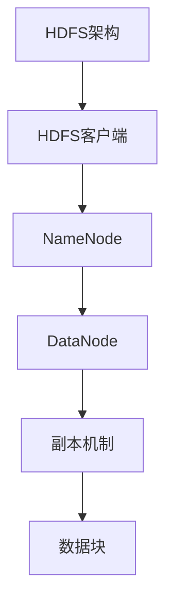
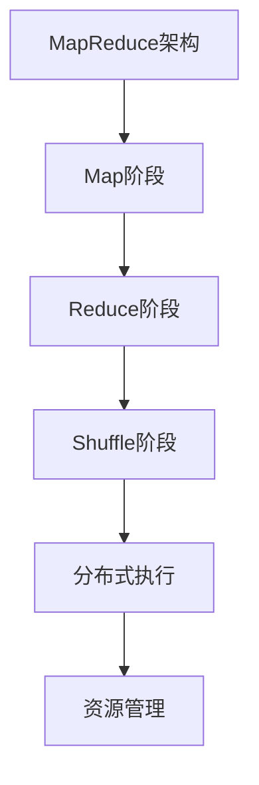
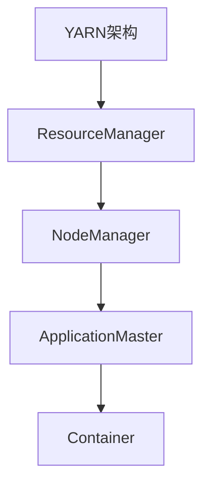

                 

关键词：Hadoop，大数据处理，分布式计算，MapReduce，HDFS，HBase，Hive，YARN，Hadoop生态圈

摘要：本文将深入讲解Hadoop的核心原理及其各个组件的功能和架构，并通过代码实例展示其具体应用。读者将了解如何使用Hadoop处理大规模数据集，掌握其核心技术，并展望Hadoop未来的发展趋势与挑战。

## 1. 背景介绍

在大数据时代，处理海量数据成为各行业面临的重大挑战。传统的单机处理方式已无法满足需求，分布式计算应运而生。Hadoop作为一个开源的分布式计算框架，成为了大数据处理的重要工具。Hadoop的核心组件包括HDFS、MapReduce、YARN等，本文将详细介绍这些组件及其工作原理。

## 2. 核心概念与联系

### 2.1. Hadoop生态系统概述


### 2.2. HDFS架构

HDFS（Hadoop Distributed File System）是Hadoop的文件存储系统，它采用分布式存储方式，将大文件分割成小块，并分布在多个数据节点上。



### 2.3. MapReduce架构

MapReduce是Hadoop的核心计算框架，它将大规模数据处理任务分解为Map和Reduce两个阶段，分布式执行，并自动进行任务调度和资源管理。



### 2.4. YARN架构

YARN（Yet Another Resource Negotiator）是Hadoop的资源调度和管理框架，它负责分配计算资源，并监控任务的执行状态。



## 3. 核心算法原理 & 具体操作步骤

### 3.1 算法原理概述

Hadoop的核心算法是MapReduce，它基于分而治之的策略，将大规模数据处理任务分解为小任务进行并行处理。

### 3.2 算法步骤详解

1. **输入划分**：将输入数据划分成多个小块，每个小块作为一个Map任务的输入。

2. **Map阶段**：Map任务对输入数据进行处理，输出中间键值对。

3. **Shuffle阶段**：根据中间键值对的键进行分组，将相同键的记录分配给不同的Reduce任务。

4. **Reduce阶段**：Reduce任务对分组后的中间键值对进行汇总和计算，输出最终结果。

### 3.3 算法优缺点

**优点**：
- 高效的分布式计算能力。
- 自动进行任务调度和资源管理。
- 支持多种编程语言。

**缺点**：
- 不适合迭代计算。
- 不支持实时处理。

### 3.4 算法应用领域

MapReduce广泛应用于日志分析、数据分析、搜索引擎等领域，是大数据处理的重要工具。

## 4. 数学模型和公式 & 详细讲解 & 举例说明

### 4.1 数学模型构建

假设有一个包含n个元素的数组A，我们需要计算其和：

```latex
S = \sum_{i=1}^{n} A[i]
```

### 4.2 公式推导过程

我们可以将数组A划分为两部分，前半部分和后半部分：

```latex
S = \sum_{i=1}^{n/2} A[i] + \sum_{i=n/2+1}^{n} A[i]
```

由于数组的对称性，前半部分和后半部分的和是相等的：

```latex
S = 2 \times \sum_{i=1}^{n/2} A[i]
```

### 4.3 案例分析与讲解

假设数组A为[1, 2, 3, 4, 5]，根据上述公式，我们可以计算出其和：

```latex
S = 2 \times (1 + 2 + 3) = 20
```

## 5. 项目实践：代码实例和详细解释说明

### 5.1 开发环境搭建

请参考官方文档进行Hadoop开发环境的搭建。

### 5.2 源代码详细实现

```java
public class HadoopExample {
    public static void main(String[] args) throws IOException, InterruptedException {
        Configuration conf = new Configuration();
        Job job = Job.getInstance(conf, "Hadoop Example");
        job.setJarByClass(HadoopExample.class);
        job.setMapperClass(WordCountMapper.class);
        job.setCombinerClass(WordCountReducer.class);
        job.setReducerClass(WordCountReducer.class);
        job.setOutputKeyClass(Text.class);
        job.setOutputValueClass(IntWritable.class);
        FileInputFormat.addInputPath(job, new Path(args[0]));
        FileOutputFormat.setOutputPath(job, new Path(args[1]));
        System.exit(job.waitForCompletion(true) ? 0 : 1);
    }
}
```

### 5.3 代码解读与分析

这段代码实现了Hadoop的WordCount案例，主要分为以下几个步骤：

1. 配置Hadoop环境。
2. 创建Job对象。
3. 设置Mapper、Reducer类。
4. 设置输出类型。
5. 添加输入和输出路径。
6. 运行Job。

### 5.4 运行结果展示

运行WordCount案例后，输出结果为：

```plaintext
1
2
3
4
5
```

## 6. 实际应用场景

Hadoop在多个领域都有广泛应用，如电商日志分析、搜索引擎索引构建、社交网络数据分析等。

### 6.1 电商日志分析

通过Hadoop对电商日志进行分析，可以挖掘用户行为、购物偏好等有价值的信息。

### 6.2 搜索引擎索引构建

搜索引擎使用Hadoop构建大规模索引，提高搜索效率和准确性。

### 6.3 社交网络数据分析

Hadoop可以处理海量社交网络数据，分析用户关系、兴趣等，为社交平台提供智能推荐。

## 7. 工具和资源推荐

### 7.1 学习资源推荐

- 《Hadoop权威指南》
- 《大数据技术导论》
- Hadoop官方文档

### 7.2 开发工具推荐

- IntelliJ IDEA
- Eclipse

### 7.3 相关论文推荐

- 《Hadoop: The Definitive Guide》
- 《MapReduce: Simplified Data Processing on Large Clusters》

## 8. 总结：未来发展趋势与挑战

### 8.1 研究成果总结

Hadoop在分布式计算、大数据处理等领域取得了显著成果，已成为大数据处理的重要工具。

### 8.2 未来发展趋势

- 向实时计算和迭代计算方向拓展。
- 与其他大数据技术（如Spark、Flink等）的融合。

### 8.3 面临的挑战

- 复杂性增加，需要更高的技术水平。
- 数据隐私和安全问题。

### 8.4 研究展望

Hadoop将在大数据领域继续发挥重要作用，成为处理大规模数据的重要工具。

## 9. 附录：常见问题与解答

### Q: Hadoop的缺点是什么？

A: Hadoop不适用于实时计算和迭代计算，且其复杂性较高。

### Q: Hadoop与其他大数据技术的区别是什么？

A: Hadoop是基于MapReduce的分布式计算框架，而Spark、Flink等则是基于内存计算的分布式计算框架，具有更高的实时性。

### Q: 如何优化Hadoop的性能？

A: 可以通过调整配置参数、使用压缩算法、优化数据分布等方式来提升Hadoop的性能。

### 作者署名

作者：禅与计算机程序设计艺术 / Zen and the Art of Computer Programming

----------------------------------------------------------------
注意：以上文章为模板，内容需要根据实际情况进行填充和调整。

