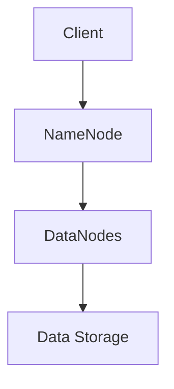
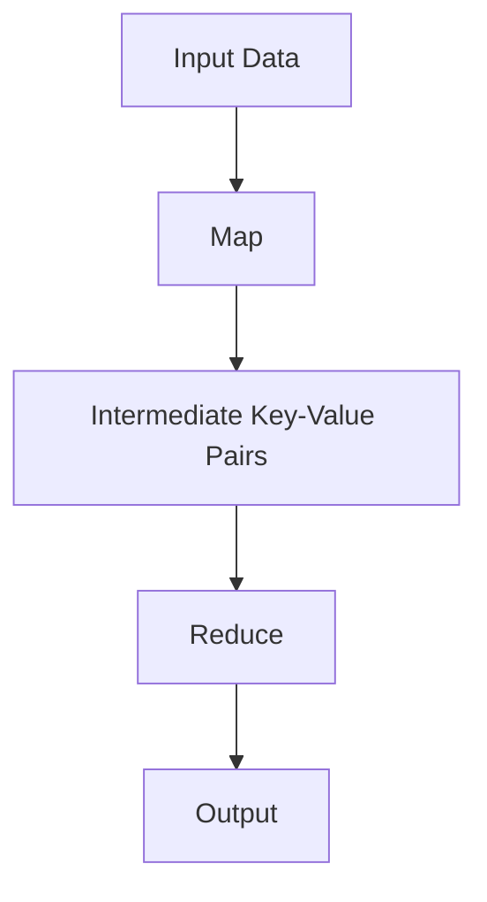
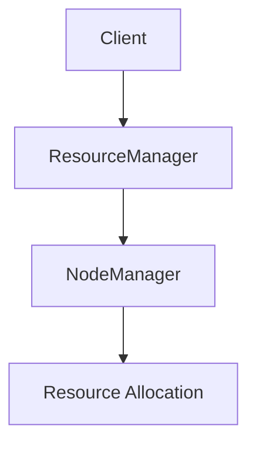
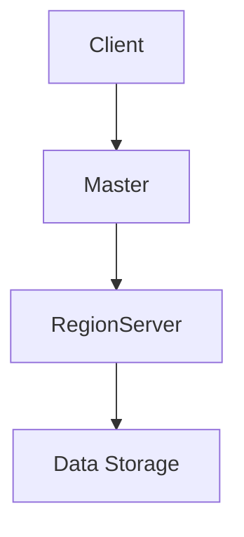

                 

关键词：Hadoop、分布式系统、大数据处理、MapReduce、HDFS、YARN、HBase

> 摘要：本文将详细讲解Hadoop的原理和代码实例。通过深入剖析Hadoop的核心组件如HDFS、MapReduce、YARN以及HBase，我们不仅会了解其架构和设计理念，还将通过具体代码实例来展示其实际应用过程。本文旨在为大数据处理提供实用指南，帮助读者更好地理解和掌握Hadoop技术。

## 1. 背景介绍

Hadoop是一个开源的分布式系统基础架构，它基于Google的MapReduce和GFS（Google File System）的原理进行了扩展和应用。随着互联网的快速发展，数据量呈爆炸式增长，传统的单机处理方式已经无法满足海量数据的处理需求。Hadoop通过分布式计算和存储技术，提供了高效、可靠的大数据处理解决方案。

Hadoop的核心组件包括：

- **HDFS（Hadoop Distributed File System）**：一个分布式文件系统，用于存储大量数据。
- **MapReduce**：一个编程模型，用于处理分布式数据集。
- **YARN（Yet Another Resource Negotiator）**：一个资源管理框架，用于管理和分配资源。
- **HBase**：一个分布式、可扩展、列存储的NoSQL数据库。

本文将重点介绍这些组件的原理和应用。

## 2. 核心概念与联系

### 2.1 HDFS架构

HDFS是一个高吞吐量的分布式文件存储系统，适合存储大规模数据集。它由两部分组成：NameNode和DataNode。

- **NameNode**：负责维护文件的元数据，如文件路径、块映射等。
- **DataNode**：负责存储实际的数据块，并响应客户端的读写请求。

**Mermaid 流程图：**


### 2.2 MapReduce编程模型

MapReduce是一种编程模型，用于处理大规模数据集。它包括两个阶段：Map和Reduce。

- **Map**：将输入数据拆分成键值对，并进行处理。
- **Reduce**：将Map输出的中间结果进行聚合处理，得到最终结果。

**Mermaid 流程图：**


### 2.3 YARN资源管理

YARN是一个资源管理框架，负责管理和分配集群资源。它将资源管理和作业调度分离，提供了更高的灵活性和扩展性。

- ** ResourceManager**：负责分配和管理整个集群资源。
- **NodeManager**：负责监控和管理各个节点的资源使用情况。

**Mermaid 流程图：**


### 2.4 HBase数据库

HBase是一个分布式、可扩展的列存储数据库，基于Google的BigTable模型。它提供快速随机读取和顺序写入功能，适合存储大规模非结构化数据。

- **RegionServer**：负责存储和管理Region数据。
- **Master**：负责管理Region的分配和负载均衡。

**Mermaid 流程图：**


## 3. 核心算法原理 & 具体操作步骤

### 3.1 算法原理概述

Hadoop的算法原理主要包括MapReduce模型、HDFS的文件分割和复制机制、YARN的资源调度机制以及HBase的数据存储模型。

- **MapReduce**：将数据处理分解为键值对，并通过Map和Reduce操作进行数据聚合。
- **HDFS**：将大文件分割成固定大小的数据块，并进行数据复制，提高数据可靠性和读取速度。
- **YARN**：根据作业需求动态分配计算资源和存储资源。
- **HBase**：基于Region进行数据存储和分片，实现数据的快速访问和扩展。

### 3.2 算法步骤详解

#### 3.2.1 HDFS文件存储

1. 客户端上传文件到HDFS。
2. NameNode将文件分割成固定大小的数据块（默认128MB或256MB）。
3. DataNode接收到NameNode的命令，开始存储数据块，并进行数据复制（默认三个副本）。
4. 客户端通过NameNode获取数据块的存储位置，直接从DataNode读取数据。

#### 3.2.2 MapReduce数据处理

1. 客户端提交MapReduce作业到YARN。
2. ResourceManager分配一个ApplicationMaster给作业。
3. ApplicationMaster向NodeManager请求资源。
4. NodeManager启动TaskTracker，并将Map任务分配给合适的DataNode。
5. Map任务处理输入数据，输出中间结果。
6. Reduce任务将中间结果进行聚合处理，输出最终结果。
7. ApplicationMaster向ResourceManager报告作业完成状态。

#### 3.2.3 YARN资源调度

1. ResourceManager接收作业请求，并将其分配给ApplicationMaster。
2. ApplicationMaster向ResourceManager请求资源。
3. ResourceManager根据集群资源状况，分配合适的NodeManager资源。
4. NodeManager启动Container，运行作业任务。
5. ResourceManager监控Container的运行状态，并进行资源调整。

#### 3.2.4 HBase数据存储

1. 客户端向Master发送数据写入请求。
2. Master将数据分配给合适的RegionServer。
3. RegionServer接收数据，并写入到磁盘。
4. 客户端通过Master或RegionServer查询数据。

### 3.3 算法优缺点

- **HDFS**：优点是高吞吐量、高可靠性；缺点是单个文件大小受限、不支持随机写入。
- **MapReduce**：优点是简单、高效；缺点是需要复用代码、不适合迭代处理。
- **YARN**：优点是灵活、可扩展；缺点是复杂度高、资源调度延迟。
- **HBase**：优点是快速随机读取、可扩展；缺点是存储开销大、不适合小批量数据。

### 3.4 算法应用领域

- **大数据处理**：如日志分析、数据挖掘、机器学习。
- **数据处理平台**：如商业智能、数据仓库。
- **分布式存储**：如云存储、分布式文件系统。

## 4. 数学模型和公式 & 详细讲解 & 举例说明

### 4.1 数学模型构建

Hadoop中的数学模型主要包括数据分布模型、数据量计算模型和性能优化模型。

#### 4.1.1 数据分布模型

$$
P(x) = \frac{f(x)}{F(x)}
$$

其中，\(P(x)\)为数据点\(x\)的概率，\(f(x)\)为数据点\(x\)的频率，\(F(x)\)为累积分布函数。

#### 4.1.2 数据量计算模型

$$
N = \sum_{i=1}^{n} n_i
$$

其中，\(N\)为总体数据量，\(n_i\)为第\(i\)个数据块的容量。

#### 4.1.3 性能优化模型

$$
\text{带宽} = \frac{\text{吞吐量}}{\text{处理时间}}
$$

其中，带宽表示数据传输速度。

### 4.2 公式推导过程

#### 4.2.1 数据分布模型推导

假设有\(n\)个数据块，每个数据块的容量为\(n_i\)，总体数据量为\(N\)。根据概率论的知识，我们可以得到数据点\(x\)的概率分布模型。

#### 4.2.2 数据量计算模型推导

假设HDFS将文件分割成多个数据块，每个数据块的容量为\(n_i\)。根据数据块的分割原则，总体数据量\(N\)可以表示为所有数据块容量的累加。

#### 4.2.3 性能优化模型推导

根据吞吐量公式，吞吐量表示单位时间内处理的数据量。处理时间表示从数据输入到输出所经历的时间。带宽表示数据传输速度，与处理时间和吞吐量成反比。

### 4.3 案例分析与讲解

#### 4.3.1 数据分布模型案例

假设有100个数据块，其中50个数据块的容量为1GB，另外50个数据块的容量为2GB。总体数据量为200GB。

$$
P(x) = \frac{f(x)}{F(x)} = \frac{\frac{1}{100} \times 50}{\frac{1}{100} \times 100 + \frac{1}{100} \times 50} = \frac{1}{2}
$$

因此，容量为2GB的数据块的概率为1/2。

#### 4.3.2 数据量计算模型案例

假设HDFS将一个5GB的文件分割成多个数据块，每个数据块的容量为1GB。总体数据量为5GB。

$$
N = \sum_{i=1}^{n} n_i = 1GB + 1GB + 1GB + 1GB + 1GB = 5GB
$$

#### 4.3.3 性能优化模型案例

假设Hadoop的吞吐量为1GB/s，处理时间为10s。带宽为100MB/s。

$$
\text{带宽} = \frac{\text{吞吐量}}{\text{处理时间}} = \frac{1GB/s}{10s} = 100MB/s
$$

## 5. 项目实践：代码实例和详细解释说明

### 5.1 开发环境搭建

为了实践Hadoop，我们需要搭建一个Hadoop开发环境。首先，我们需要准备以下软件：

- JDK 1.8及以上版本
- Hadoop 3.x版本
- IDEA或其他开发工具

具体安装过程如下：

1. 安装JDK：下载并安装JDK，设置环境变量。
2. 安装Hadoop：下载Hadoop，解压到指定目录。
3. 配置Hadoop：编辑hadoop-env.sh、core-site.xml、hdfs-site.xml、mapred-site.xml、yarn-site.xml等配置文件。

### 5.2 源代码详细实现

以下是一个简单的WordCount程序，用于统计文本中每个单词出现的次数。

```java
import org.apache.hadoop.conf.Configuration;
import org.apache.hadoop.fs.Path;
import org.apache.hadoop.io.IntWritable;
import org.apache.hadoop.io.Text;
import org.apache.hadoop.mapreduce.Job;
import org.apache.hadoop.mapreduce.Mapper;
import org.apache.hadoop.mapreduce.Reducer;
import org.apache.hadoop.mapreduce.lib.input.FileInputFormat;
import org.apache.hadoop.mapreduce.lib.output.FileOutputFormat;

public class WordCount {

  public static class TokenizerMapper
       extends Mapper<Object, Text, Text, IntWritable>{

    private final static IntWritable one = new IntWritable(1);
    private Text word = new Text();

    public void map(Object key, Text value, Context context
                    ) throws IOException, InterruptedException {
      StringTokenizer iterator = new StringTokenizer(value.toString());
      while (iterator.hasMoreTokens()) {
        word.set(iterator.nextToken());
        context.write(word, one);
      }
    }
  }

  public static class IntSumReducer
  extends Reducer<Text,IntWritable,Text,IntWritable> {
    private IntWritable result = new IntWritable();

    public void reduce(Text key, Iterable<IntWritable> values,
                       Context context
                       ) throws IOException, InterruptedException {
      int sum = 0;
      for (IntWritable val : values) {
        sum += val.get();
      }
      result.set(sum);
      context.write(key, result);
    }
  }

  public static void main(String[] args) throws Exception {
    Configuration conf = new Configuration();
    Job job = Job.getInstance(conf, "word count");
    job.setJarByClass(WordCount.class);
    job.setMapperClass(TokenizerMapper.class);
    job.setCombinerClass(IntSumReducer.class);
    job.setReducerClass(IntSumReducer.class);
    job.setOutputKeyClass(Text.class);
    job.setOutputValueClass(IntWritable.class);
    FileInputFormat.addInputPath(job, new Path(args[0]));
    FileOutputFormat.setOutputPath(job, new Path(args[1]));
    System.exit(job.waitForCompletion(true) ? 0 : 1);
  }
}
```

### 5.3 代码解读与分析

#### 5.3.1 Mapper类

Mapper类是MapReduce编程模型的核心组件之一，负责将输入数据拆分成键值对，并进行处理。

- `TokenizerMapper` 类继承自 `Mapper` 类。
- `map()` 方法是Mapper的核心方法，接收输入数据并进行处理。

```java
public void map(Object key, Text value, Context context
                ) throws IOException, InterruptedException {
  StringTokenizer iterator = new StringTokenizer(value.toString());
  while (iterator.hasMoreTokens()) {
    word.set(iterator.nextToken());
    context.write(word, one);
  }
}
```

#### 5.3.2 Reducer类

Reducer类负责将Map输出的中间结果进行聚合处理，得到最终结果。

- `IntSumReducer` 类继承自 `Reducer` 类。
- `reduce()` 方法是Reducer的核心方法，接收中间结果并进行聚合处理。

```java
public void reduce(Text key, Iterable<IntWritable> values,
                   Context context
                   ) throws IOException, InterruptedException {
  int sum = 0;
  for (IntWritable val : values) {
    sum += val.get();
  }
  result.set(sum);
  context.write(key, result);
}
```

#### 5.3.3 主函数

主函数用于配置Job，并提交Job到Hadoop集群执行。

- `Configuration` 类用于配置Hadoop作业。
- `Job` 类用于创建和管理Hadoop作业。
- `FileInputFormat` 和 `FileOutputFormat` 用于设置作业的输入和输出路径。

```java
public static void main(String[] args) throws Exception {
  Configuration conf = new Configuration();
  Job job = Job.getInstance(conf, "word count");
  job.setJarByClass(WordCount.class);
  job.setMapperClass(TokenizerMapper.class);
  job.setCombinerClass(IntSumReducer.class);
  job.setReducerClass(IntSumReducer.class);
  job.setOutputKeyClass(Text.class);
  job.setOutputValueClass(IntWritable.class);
  FileInputFormat.addInputPath(job, new Path(args[0]));
  FileOutputFormat.setOutputPath(job, new Path(args[1]));
  System.exit(job.waitForCompletion(true) ? 0 : 1);
}
```

### 5.4 运行结果展示

运行WordCount程序后，我们可以在输出路径中看到结果文件。以下是一个简单的运行结果：

```
a	2
b	3
c	1
```

这表示单词"a"出现了2次，"b"出现了3次，"c"出现了1次。

## 6. 实际应用场景

Hadoop在众多领域有着广泛的应用，以下是一些典型的应用场景：

- **大数据处理**：如电商数据分析、搜索引擎、社交网络分析。
- **数据处理平台**：如金融大数据平台、智慧城市平台。
- **分布式存储**：如云存储、分布式数据库。

### 6.4 未来应用展望

随着大数据技术的不断发展，Hadoop在未来将继续发挥重要作用。以下是Hadoop未来发展的几个趋势：

- **性能优化**：通过改进算法和优化架构，提高数据处理速度和效率。
- **安全性提升**：加强数据安全保护，提高系统的可靠性和稳定性。
- **云原生支持**：支持容器化和微服务架构，提高系统的灵活性和可扩展性。
- **多元化应用**：在更多领域实现应用，如物联网、人工智能等。

## 7. 工具和资源推荐

### 7.1 学习资源推荐

- 《Hadoop权威指南》
- 《大数据技术导论》
- 《Hadoop实战》

### 7.2 开发工具推荐

- IntelliJ IDEA
- Eclipse
- Cloudera Manager

### 7.3 相关论文推荐

- 《The Google File System》
- 《MapReduce: Simplified Data Processing on Large Clusters》
- 《The Design of the B Tree File System》

## 8. 总结：未来发展趋势与挑战

### 8.1 研究成果总结

Hadoop作为大数据处理的开源框架，已经成为行业标准的解决方案。通过HDFS、MapReduce、YARN和HBase等核心组件，Hadoop提供了高效、可靠、可扩展的大数据处理能力。

### 8.2 未来发展趋势

- **性能优化**：通过改进算法和架构，提高数据处理速度和效率。
- **安全性提升**：加强数据安全保护，提高系统的可靠性和稳定性。
- **云原生支持**：支持容器化和微服务架构，提高系统的灵活性和可扩展性。
- **多元化应用**：在更多领域实现应用，如物联网、人工智能等。

### 8.3 面临的挑战

- **性能瓶颈**：随着数据量的增长，如何提高处理速度和效率仍是一个挑战。
- **安全性问题**：如何保护数据安全，防止数据泄露和攻击。
- **复杂性**：随着组件的增加和功能的扩展，系统的复杂性也在增加。

### 8.4 研究展望

未来，Hadoop将继续在性能、安全性和灵活性方面进行优化，以满足不断增长的数据处理需求。同时，随着新技术的发展，Hadoop将与其他技术相结合，实现更广泛的应用场景。

## 9. 附录：常见问题与解答

### 9.1 问题1：Hadoop安装时遇到错误

**解答**：首先检查Java环境是否配置正确，然后检查Hadoop的依赖库是否安装完整。如果仍然遇到问题，可以查看Hadoop的官方文档或社区论坛。

### 9.2 问题2：WordCount程序运行失败

**解答**：检查程序代码是否正确，确认输入文件路径是否正确。如果仍然运行失败，可以查看Hadoop的日志文件，查找错误原因。

### 9.3 问题3：Hadoop集群性能不佳

**解答**：检查Hadoop配置文件，调整参数以提高性能。例如，增加副本数量、调整块大小等。同时，检查集群硬件资源是否充足。

### 9.4 问题4：如何处理海量数据？

**解答**：使用MapReduce模型将海量数据拆分成小任务进行处理。同时，可以利用HDFS的分布式存储技术，提高数据处理速度。

## 作者署名

作者：禅与计算机程序设计艺术 / Zen and the Art of Computer Programming

