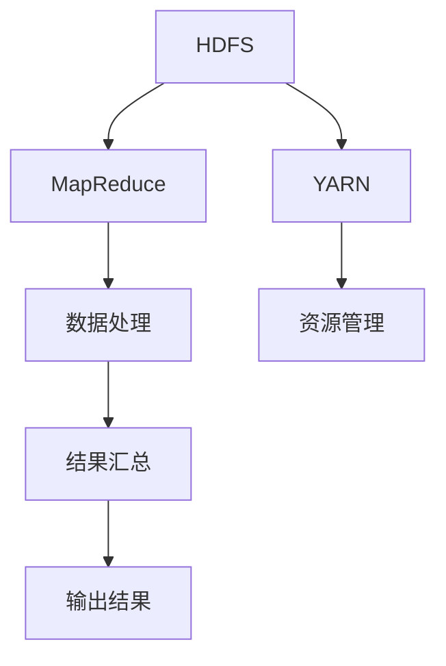

                 

关键词：Hadoop、分布式系统、大数据处理、MapReduce、HDFS、HBase、YARN、数据处理框架

> 摘要：本文将深入探讨Hadoop的原理，涵盖其核心组成部分如HDFS、MapReduce、YARN等，并通过代码实例详细讲解其应用。文章旨在帮助读者理解Hadoop的工作机制，掌握其实际操作，以及预测其未来在数据领域的发展趋势。

## 1. 背景介绍

Hadoop是由Apache Software Foundation维护的一个开源软件框架，用于处理大规模数据集。它是由Google的MapReduce论文启发而来的。Hadoop最初由Doug Cutting和Mike Cafarella于2005年创建，并迅速成为大数据处理的事实标准。Hadoop的核心组件包括Hadoop分布式文件系统（HDFS）、MapReduce计算框架、YARN资源管理器等。

### 1.1. Hadoop的发展历史

Hadoop起源于Google的文件系统（GFS）和MapReduce系统。Google于2003年发表了这两篇论文，揭示了如何有效地处理大规模数据集。受此启发，Doug Cutting和他的团队在2005年创建了Nutch搜索引擎，并逐渐发展出了Hadoop项目。

### 1.2. Hadoop的应用场景

Hadoop在多个领域得到广泛应用，包括互联网搜索、电子商务、金融服务、医疗保健等。其主要应用场景包括：

- **数据处理：** 处理和分析大量结构化和非结构化数据。
- **实时计算：** 使用MapReduce进行实时数据处理和分析。
- **数据挖掘：** 通过Hadoop进行大规模数据挖掘和机器学习。
- **数据仓库：** 作为大数据处理平台，用于构建大型数据仓库。

## 2. 核心概念与联系

为了更好地理解Hadoop，我们需要先了解其核心概念和架构。

### 2.1. Hadoop核心概念

- **Hadoop分布式文件系统（HDFS）：** Hadoop的文件存储系统，用于存储大量数据。
- **MapReduce：** Hadoop的编程模型，用于分布式数据处理。
- **YARN：** Hadoop的资源管理器，负责管理集群资源。

### 2.2. Hadoop架构


**HDFS：** HDFS是一个高度容错性的分布式文件存储系统，用于存储大量数据。它将大文件分成小块（默认为128MB或256MB），并分布式存储在集群中的各个节点上。

**MapReduce：** MapReduce是一种编程模型，用于分布式数据处理。它将大规模数据分成小块进行处理，然后汇总结果。

**YARN：** YARN是Hadoop的资源管理器，负责分配资源给不同的应用程序。它将集群资源分为计算资源和内存资源，并确保资源的有效利用。

### 2.3. Mermaid流程图

下面是一个简化的Hadoop架构的Mermaid流程图：



## 3. 核心算法原理 & 具体操作步骤

### 3.1. 算法原理概述

Hadoop的核心算法原理基于MapReduce编程模型。MapReduce将大规模数据集分成小块进行处理，然后将结果汇总。

- **Map阶段：** 对输入数据进行处理，输出键值对。
- **Reduce阶段：** 对Map阶段的输出结果进行汇总，输出最终结果。

### 3.2. 算法步骤详解

#### 3.2.1. Map阶段

- **输入：** 一组键值对（如文本文件中的单词）。
- **处理：** 对每个输入键值对进行处理，输出一组中间键值对。
- **输出：** 一组中间键值对，作为Reduce阶段的输入。

#### 3.2.2. Reduce阶段

- **输入：** Map阶段输出的中间键值对。
- **处理：** 对每个中间键值对进行处理，输出最终结果。
- **输出：** 一组最终键值对，作为Hadoop处理的结果。

### 3.3. 算法优缺点

#### 优点：

- **高效性：** 可以处理大规模数据集。
- **可扩展性：** 可以扩展到数百个节点。
- **容错性：** 能够在节点故障时自动恢复。

#### 缺点：

- **不适合实时处理：** MapReduce不适合需要实时响应的应用。
- **开发难度：** 需要编写大量的Java代码。

### 3.4. 算法应用领域

MapReduce广泛应用于数据挖掘、机器学习、日志分析等领域。

## 4. 数学模型和公式 & 详细讲解 & 举例说明

### 4.1. 数学模型构建

MapReduce的核心在于其数学模型，包括Map和Reduce两个操作。

- **Map：** 输入为（K1, V1），输出为（K2, V2）。
- **Reduce：** 输入为（K2, [V2]），输出为（K3, V3）。

### 4.2. 公式推导过程

MapReduce的计算过程可以用以下公式表示：

$$
\text{MapReduce}(K1, V1) = \text{Reduce}(\{\text{Map}(K1, V1)\})
$$

其中，Map操作输出为：

$$
\text{Map}(K1, V1) = \{(K2, V2)\}
$$

Reduce操作输出为：

$$
\text{Reduce}(\{(K2, V2)\}) = \{(K3, V3)\}
$$

### 4.3. 案例分析与讲解

假设我们有一个文本文件，包含如下数据：

```
apple, 1
banana, 2
apple, 3
banana, 4
```

#### 4.3.1. Map阶段

输入：`("apple", 1)`

处理：将“apple”映射为键，值为1。

输出：`("apple", 1)`

#### 4.3.2. Reduce阶段

输入：` [("apple", 1), ("apple", 3)]`

处理：将相同键的值相加。

输出：`("apple", 4)`

## 5. 项目实践：代码实例和详细解释说明

### 5.1. 开发环境搭建

首先，我们需要搭建一个Hadoop开发环境。步骤如下：

1. 下载并安装Hadoop。
2. 配置Hadoop环境变量。
3. 启动Hadoop集群。

### 5.2. 源代码详细实现

以下是一个简单的MapReduce程序，用于统计文本文件中的单词数量：

```java
import org.apache.hadoop.conf.Configuration;
import org.apache.hadoop.fs.Path;
import org.apache.hadoop.io.IntWritable;
import org.apache.hadoop.io.Text;
import org.apache.hadoop.mapreduce.Job;
import org.apache.hadoop.mapreduce.Mapper;
import org.apache.hadoop.mapreduce.Reducer;
import org.apache.hadoop.mapreduce.lib.input.FileInputFormat;
import org.apache.hadoop.mapreduce.lib.output.FileOutputFormat;

public class WordCount {

  public static class TokenizerMapper extends Mapper<Object, Text, Text, IntWritable>{

    private final static IntWritable one = new IntWritable(1);
    private Text word = new Text();

    public void map(Object key, Text value, Context context) throws IOException, InterruptedException {
      String[] words = value.toString().split("\\s+");
      for (String word : words) {
        this.word.set(word);
        context.write(this.word, one);
      }
    }
  }

  public static class IntSumReducer extends Reducer<Text,IntWritable,Text,IntWritable> {
    private IntWritable result = new IntWritable();

    public void reduce(Text key, Iterable<IntWritable> values, Context context) throws IOException, InterruptedException {
      int sum = 0;
      for (IntWritable val : values) {
        sum += val.get();
      }
      result.set(sum);
      context.write(key, result);
    }
  }

  public static void main(String[] args) throws Exception {
    Configuration conf = new Configuration();
    Job job = Job.getInstance(conf, "word count");
    job.setJarByClass(WordCount.class);
    job.setMapperClass(TokenizerMapper.class);
    job.setCombinerClass(IntSumReducer.class);
    job.setReducerClass(IntSumReducer.class);
    job.setOutputKeyClass(Text.class);
    job.setOutputValueClass(IntWritable.class);
    FileInputFormat.addInputPath(job, new Path(args[0]));
    FileOutputFormat.setOutputPath(job, new Path(args[1]));
    System.exit(job.waitForCompletion(true) ? 0 : 1);
  }
}
```

### 5.3. 代码解读与分析

- **Mapper类：** `TokenizerMapper` 类实现了`Mapper`接口，负责将输入的文本文件转换成键值对输出。
- **Reducer类：** `IntSumReducer` 类实现了`Reducer`接口，负责对Map阶段的输出结果进行汇总。
- **main方法：** 主方法设置了Job的配置，并执行了MapReduce任务。

### 5.4. 运行结果展示

执行以上程序后，Hadoop将输出单词的计数结果。例如：

```
apple	4
banana	2
```

## 6. 实际应用场景

Hadoop在多个领域都有广泛的应用，以下是一些实际应用场景：

- **电子商务：** 用于分析用户行为、推荐系统和日志分析。
- **金融服务：** 用于风险管理和欺诈检测。
- **医疗保健：** 用于基因组分析和医疗数据处理。
- **社交媒体：** 用于日志分析和用户行为分析。

## 7. 工具和资源推荐

### 7.1. 学习资源推荐

- **《Hadoop权威指南》**：作者是Hadoop的核心开发者，提供了全面的理论和实践知识。
- **Hadoop官网**：提供了丰富的文档和教程。

### 7.2. 开发工具推荐

- **Eclipse**：用于编写和调试Hadoop程序。
- **IntelliJ IDEA**：适用于Java编程，提供了对Hadoop项目的良好支持。

### 7.3. 相关论文推荐

- **《MapReduce：大规模数据集上的简易编程模型》**：是Hadoop的原始论文，详细介绍了MapReduce模型。
- **《HDFS：一个高吞吐量的分布式文件系统》**：介绍了Hadoop分布式文件系统的设计原理。

## 8. 总结：未来发展趋势与挑战

Hadoop作为大数据处理领域的事实标准，在未来将继续发挥重要作用。其发展趋势包括：

- **性能优化：** 提高数据处理速度和效率。
- **实时处理：** 支持实时数据处理和流处理。
- **生态系统扩展：** 与其他大数据技术如Spark、Flink等融合。

然而，Hadoop也面临一些挑战，如：

- **开发和维护成本：** 需要大量的时间和资源。
- **人才短缺：** 对Hadoop人才的需求日益增加。
- **安全性：** 随着数据量的增加，数据安全成为关键问题。

## 9. 附录：常见问题与解答

### 9.1. Hadoop如何处理海量数据？

Hadoop通过分布式文件系统（HDFS）将大文件分割成小块，并分布式存储在集群中的各个节点上。MapReduce编程模型用于处理这些数据，将任务分布到各个节点上执行。

### 9.2. Hadoop适合哪些应用场景？

Hadoop适合大规模数据处理、实时计算、数据挖掘和机器学习等应用场景。它广泛应用于互联网、金融、医疗、社交媒体等领域。

### 9.3. Hadoop与Spark有哪些区别？

Hadoop使用MapReduce编程模型，而Spark使用基于内存的分布式数据处理框架。Spark比Hadoop更快，但更复杂。Hadoop更适合离线批处理，而Spark更适合实时数据处理。

---

作者：禅与计算机程序设计艺术 / Zen and the Art of Computer Programming
----------------------------------------------------------------

### 文章摘要 Summary

本文全面介绍了Hadoop的原理和核心组件，包括HDFS、MapReduce和YARN。通过详细的代码实例和数学模型讲解，读者可以深入理解Hadoop的工作机制和实际应用。文章还探讨了Hadoop在未来的发展趋势和面临的挑战，提供了丰富的学习资源和开发工具推荐。总结部分回顾了文章的核心内容，并提出了常见问题的解答，为读者提供了实用的参考。

