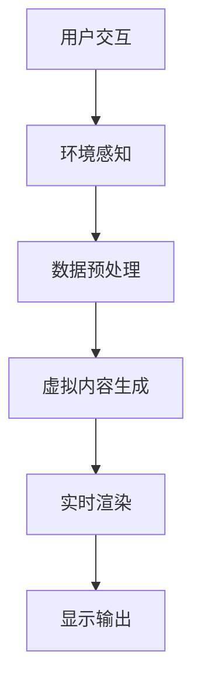

                 

在当今快速发展的科技领域中，混合现实（Mixed Reality，简称MR）正逐渐成为推动前沿技术变革的重要力量。作为混合现实技术的代表，Microsoft HoloLens是一款功能强大的全息智能眼镜，它能够将虚拟内容与现实环境无缝融合，为开发者提供了无限的创意空间。本文将深入探讨如何利用HoloLens开发混合现实应用，包括其核心概念、开发流程、算法原理，以及实际应用和未来展望。

> 关键词：混合现实，Microsoft HoloLens，开发，全息技术，应用场景

> 摘要：本文旨在介绍Microsoft HoloLens混合现实应用的开发方法和技术要点。通过对HoloLens的核心概念、开发环境搭建、算法原理、应用案例和未来发展趋势的详细分析，帮助开发者更好地理解并掌握混合现实技术的应用实践。

## 1. 背景介绍

混合现实技术结合了虚拟现实（Virtual Reality，简称VR）和增强现实（Augmented Reality，简称AR）的优点，通过叠加虚拟内容和现实环境，为用户提供一种全新的交互体验。Microsoft HoloLens作为一款头戴式智能设备，具备独立运行的能力，无需连接外部设备即可实现实时感知环境、定位和交互。

HoloLens的硬件配置包括一副高清显示屏幕、高精度传感器、位置追踪系统以及先进的计算机视觉算法。它支持多种交互方式，如手势识别、语音控制、眼动跟踪等，为开发者提供了丰富的开发工具和API，使得HoloLens应用的开发变得更加灵活和高效。

随着技术的不断进步，混合现实应用在医疗、教育、工业制造、娱乐等多个领域展现出巨大的潜力。HoloLens作为混合现实技术的代表，已经得到了众多开发者和企业的关注和应用，成为推动混合现实产业发展的重要力量。

## 2. 核心概念与联系

### 2.1 混合现实基础概念

混合现实（MR）是一种通过虚拟现实和增强现实技术实现融合的新兴技术。它将数字内容与现实世界结合起来，使用户能够在真实环境中看到和操作虚拟对象。

- **虚拟现实（VR）**：虚拟现实是一种完全沉浸式的体验，用户通过头戴式显示器（如VR头盔）进入一个完全虚拟的环境，与外界现实世界隔离。
- **增强现实（AR）**：增强现实通过在现实环境中叠加数字信息，增强用户的感知和交互体验。例如，通过智能手机或AR眼镜看到叠加在真实世界中的虚拟图像或文字。
- **混合现实（MR）**：混合现实是VR和AR的融合，通过叠加虚拟内容到真实环境中，实现与现实世界的互动。MR的关键在于虚拟内容与现实环境的无缝融合，提供更加自然和真实的交互体验。

### 2.2 Microsoft HoloLens架构

Microsoft HoloLens的架构设计旨在提供高效、低延迟的混合现实体验。其核心组成部分包括：

- **全息显示屏幕**：HoloLens配备了一块高分辨率的全息显示屏幕，能够将虚拟内容以三维形式呈现在用户眼前。
- **传感器和追踪系统**：HoloLens内置了多种传感器，包括环境感知摄像头、惯性测量单元（IMU）和激光雷达，用于实时感知用户和环境的位置和运动。
- **计算机视觉算法**：通过先进的计算机视觉算法，HoloLens能够识别并跟踪用户的手势、面部表情和眼动，实现自然的人机交互。
- **独立运行能力**：HoloLens采用独立的计算平台，无需连接外部设备即可运行应用程序，支持离线操作和数据存储。

### 2.3 Mermaid流程图



上述Mermaid流程图展示了HoloLens的核心工作流程，从用户交互到环境感知，再到数据预处理、虚拟内容生成、实时渲染和显示输出，每个步骤都至关重要，共同构成了HoloLens混合现实应用的基础。

## 3. 核心算法原理 & 具体操作步骤

### 3.1 算法原理概述

在HoloLens混合现实应用中，核心算法主要涉及以下几个方面：

- **环境感知**：通过传感器和计算机视觉算法，HoloLens实时感知用户和环境的位置、运动和姿态。
- **数据预处理**：对采集到的环境数据进行滤波、去噪和配准，确保数据的准确性和一致性。
- **虚拟内容生成**：根据用户和环境的状态，动态生成符合场景需求的虚拟内容。
- **实时渲染**：利用高性能图形处理单元（GPU）对虚拟内容进行实时渲染，确保画面的流畅和真实。
- **显示输出**：将渲染后的虚拟内容通过全息显示屏幕呈现给用户。

### 3.2 算法步骤详解

#### 3.2.1 环境感知

环境感知是HoloLens混合现实应用的基础。具体步骤如下：

1. **传感器数据采集**：HoloLens通过环境感知摄像头、IMU和激光雷达等传感器实时采集环境数据，包括位置、运动、姿态等信息。
2. **数据处理**：对采集到的原始数据进行滤波和去噪处理，以消除噪声和异常值，提高数据的准确性。
3. **位置和姿态跟踪**：利用传感器数据计算用户和环境的位置和姿态，为后续的数据处理和虚拟内容生成提供基础。

#### 3.2.2 数据预处理

数据预处理是确保环境数据和虚拟内容能够准确融合的关键步骤。具体步骤如下：

1. **数据配准**：将不同传感器采集的数据进行配准，确保它们在同一个坐标系下。
2. **数据滤波**：对配准后的数据进行滤波处理，去除噪声和异常值，提高数据的一致性和可靠性。
3. **数据融合**：将来自不同传感器的数据进行融合，以获得更加全面和准确的环境信息。

#### 3.2.3 虚拟内容生成

虚拟内容生成是根据用户和环境的状态动态生成符合场景需求的虚拟内容。具体步骤如下：

1. **场景建模**：根据环境数据构建场景模型，包括场景的几何结构、光照条件和材质属性等。
2. **内容生成**：根据用户需求和环境状态，生成相应的虚拟内容，如3D模型、动画效果和交互元素等。
3. **内容优化**：对生成的虚拟内容进行优化，包括降低模型复杂度、减少渲染时间等，以提高应用性能。

#### 3.2.4 实时渲染

实时渲染是将虚拟内容以三维形式实时呈现给用户的关键步骤。具体步骤如下：

1. **渲染预处理**：对虚拟内容进行预处理，包括模型简化、纹理映射和光照计算等。
2. **渲染引擎**：利用高性能图形处理单元（GPU）对虚拟内容进行实时渲染，确保画面的流畅和真实。
3. **显示优化**：对渲染后的画面进行优化，包括分辨率调整、色彩校正和亮度调节等，以提供最佳的用户体验。

#### 3.2.5 显示输出

显示输出是将渲染后的虚拟内容通过全息显示屏幕呈现给用户的关键步骤。具体步骤如下：

1. **内容布局**：根据用户的位置和视角，将虚拟内容布局在现实环境中，确保用户能够舒适地观看和操作。
2. **交互反馈**：通过手势识别、语音控制和眼动跟踪等技术，提供实时的交互反馈，增强用户的沉浸感。
3. **用户体验优化**：根据用户反馈和应用需求，不断优化显示输出效果，提高用户体验。

### 3.3 算法优缺点

#### 优点

- **实时性**：HoloLens的实时渲染和交互技术能够确保应用的高响应速度和流畅性，提供真实的沉浸体验。
- **灵活性**：HoloLens支持多种交互方式，如手势、语音和眼动，为开发者提供了丰富的开发工具和API，使得应用开发更加灵活和高效。
- **独立性**：HoloLens采用独立运行的能力，无需连接外部设备，使得应用部署和维护更加便捷。

#### 缺点

- **计算资源限制**：HoloLens的硬件配置相对有限，对于复杂的应用场景，可能需要更多的计算资源，影响应用的性能。
- **使用成本**：HoloLens的开发和购买成本较高，可能限制一些中小型开发者和企业的应用开发。

### 3.4 算法应用领域

HoloLens的混合现实技术已在多个领域得到广泛应用：

- **医疗**：HoloLens在医疗领域的应用包括远程手术指导、医学教育和手术模拟等。
- **教育**：HoloLens在教育领域的应用包括虚拟课堂、实验演示和历史文化体验等。
- **工业制造**：HoloLens在工业制造领域的应用包括设备维护、生产线管理和远程协作等。
- **娱乐**：HoloLens在娱乐领域的应用包括虚拟游戏、主题公园和艺术展览等。

## 4. 数学模型和公式 & 详细讲解 & 举例说明

### 4.1 数学模型构建

在HoloLens混合现实应用中，数学模型主要用于环境感知、虚拟内容生成和实时渲染等关键环节。以下是一个简单的数学模型示例：

$$
P(t) = P_{0} + v \cdot t + \frac{1}{2} a \cdot t^2
$$

其中，$P(t)$ 表示在时间 $t$ 时刻物体的位置，$P_0$ 为初始位置，$v$ 为速度，$a$ 为加速度。

### 4.2 公式推导过程

上述公式的推导基于经典力学中的运动学原理。根据牛顿第二定律，物体受到的合力等于其质量乘以加速度，即：

$$
F = m \cdot a
$$

在无外力作用的情况下，物体将保持匀速直线运动。因此，可以将加速度 $a$ 表示为：

$$
a = \frac{F}{m}
$$

结合速度 $v$ 的定义，我们可以得到：

$$
v = \frac{P(t) - P_0}{t}
$$

将速度 $v$ 带入加速度公式，得到：

$$
a = \frac{F}{m} = \frac{P(t) - P_0}{t^2}
$$

整理得到：

$$
P(t) = P_0 + v \cdot t + \frac{1}{2} a \cdot t^2
$$

### 4.3 案例分析与讲解

假设一个物体从初始位置 $P_0 = (0, 0, 0)$ 开始，以速度 $v = (1, 1, 1)$ 和加速度 $a = (0.1, 0.1, 0.1)$ 匀加速直线运动，我们需要计算在 $t = 5$ 秒时物体的位置。

将参数代入公式：

$$
P(5) = (0, 0, 0) + (1, 1, 1) \cdot 5 + \frac{1}{2} (0.1, 0.1, 0.1) \cdot 5^2
$$

计算得到：

$$
P(5) = (5, 5, 5) + (1.25, 1.25, 1.25) = (6.25, 6.25, 6.25)
$$

因此，在 $t = 5$ 秒时，物体的位置为 $(6.25, 6.25, 6.25)$。

### 4.4 混合现实应用实例

以HoloLens在医疗领域中的应用为例，我们构建一个数学模型来计算患者器官的三维位置。假设我们使用CT扫描数据来重建患者的心脏模型，需要计算心脏在患者体内的实时位置。

已知心脏的初始位置为 $P_0 = (x_0, y_0, z_0)$，速度为 $v = (v_x, v_y, v_z)$，加速度为 $a = (a_x, a_y, a_z)$。我们需要计算在某一时刻 $t$ 心脏的位置。

根据上述运动学公式，可以得到：

$$
P(t) = P_0 + v \cdot t + \frac{1}{2} a \cdot t^2
$$

通过实时获取患者的心跳和呼吸数据，我们可以计算出心脏的速度和加速度，从而实现心脏位置的实时跟踪。

## 5. 项目实践：代码实例和详细解释说明

### 5.1 开发环境搭建

要在HoloLens上开发混合现实应用，首先需要搭建开发环境。以下步骤将指导您如何设置HoloLens开发环境：

1. **安装Visual Studio**：下载并安装最新的Visual Studio版本，确保包含HoloLens开发工具。
2. **注册开发人员帐户**：在HoloLens官网注册成为开发人员，并获取HoloLens开发工具包。
3. **安装HoloLens SDK**：按照官方文档安装HoloLens软件开发包（SDK），确保兼容最新的操作系统版本。
4. **配置开发设备**：连接HoloLens到开发计算机，并确保设备处于开发者模式。

### 5.2 源代码详细实现

以下是一个简单的HoloLens混合现实应用示例，展示如何创建一个基本的3D模型并将其显示在现实环境中。

```csharp
using Microsoft.MixedReality.Toolkit;
using Microsoft.MixedReality.Toolkit.UI;
using UnityEngine;

public class HoloLensExample : MonoBehaviour
{
    // 创建一个3D立方体
    public GameObject cubePrefab;

    // 初始化HoloLens应用
    private void Start()
    {
        // 创建一个3D立方体对象
        GameObject cube = Instantiate(cubePrefab);

        // 设置立方体的位置和旋转
        cube.transform.position = new Vector3(0, 1, -5);
        cube.transform.rotation = Quaternion.Euler(30, 0, 0);

        // 添加一个标签，显示立方体的名称
        TextMeshProComponent text = cube.AddTextMeshProComponent();
        text.Text = "HoloLens Cube";
        text.FontSize = 2;
        text.color = Color.white;
        text.anchorPosition = MixedRealityTextAnchorPosition.Center;
        text.alignment = TextAlignmentOptions.Center;
        text.Offset = new Vector3(0, 2, 0);
    }

    // 更新HoloLens应用
    private void Update()
    {
        // 根据用户的手势控制立方体的旋转
        if (Input.GetKeyDown(KeyCode.Space))
        {
            cube.transform.Rotate(new Vector3(30, 0, 0));
        }
    }
}
```

### 5.3 代码解读与分析

上述代码实现了以下功能：

1. **创建3D立方体**：使用`Instantiate`方法创建一个立方体对象，并将其设置为场景中的第一个对象。
2. **设置位置和旋转**：通过调整`transform.position`和`transform.rotation`属性，设置立方体的初始位置和旋转角度。
3. **添加标签**：使用`AddTextMeshProComponent`方法为立方体添加一个标签，显示立方体的名称。
4. **用户交互**：通过按空格键实现立方体的旋转。

### 5.4 运行结果展示

在HoloLens设备上运行此应用，将显示一个带有标签的3D立方体。用户可以通过手势或键盘操作来旋转立方体，体验HoloLens的交互式混合现实功能。

## 6. 实际应用场景

### 6.1 医疗

在医疗领域，HoloLens的混合现实技术广泛应用于手术指导、医学教育和病例分析。通过将患者的三维CT或MRI数据叠加到现实环境中，医生可以进行更精确的诊断和治疗规划。

### 6.2 教育

在教育领域，HoloLens为师生提供了丰富的虚拟实验、历史文化体验和互动课堂。学生可以在虚拟环境中学习复杂的科学概念，增强学习的趣味性和互动性。

### 6.3 工业制造

在工业制造领域，HoloLens帮助工程师进行设备维护、产品设计和远程协作。通过混合现实技术，工程师可以实时查看和操作虚拟模型，提高工作效率和准确性。

### 6.4 娱乐

在娱乐领域，HoloLens带来了全新的虚拟游戏和主题公园体验。玩家可以在虚拟世界中自由探索，与虚拟角色互动，享受身临其境的娱乐体验。

### 6.5 未来应用展望

随着技术的不断进步，HoloLens混合现实应用将在更多领域得到广泛应用。未来，HoloLens有望在智慧城市建设、远程办公、智能家居等方面发挥更大的作用，为人们的生活和工作带来更多便利和创新。

## 7. 工具和资源推荐

### 7.1 学习资源推荐

- **Microsoft Learn**：提供丰富的HoloLens开发教程和在线课程。
- **GitHub**：搜索并关注HoloLens开源项目，学习其他开发者的实践经验和代码。

### 7.2 开发工具推荐

- **Unity**：一款强大的游戏开发引擎，支持HoloLens应用开发。
- **Unreal Engine**：另一款流行的游戏开发引擎，提供丰富的功能和资源。

### 7.3 相关论文推荐

- **"Mixed Reality Applications with Microsoft HoloLens: A Review"**：对HoloLens混合现实应用的研究综述。
- **"Real-Time Mixed Reality Using HoloLens"**：关于HoloLens实时渲染和交互的深入研究。

## 8. 总结：未来发展趋势与挑战

### 8.1 研究成果总结

本文详细介绍了HoloLens混合现实应用的开发方法、核心算法原理、应用案例和未来发展趋势。通过分析HoloLens的技术特点和实际应用，我们看到了其在各个领域的巨大潜力。

### 8.2 未来发展趋势

随着硬件性能的提升和算法的优化，HoloLens混合现实应用将在更多领域得到广泛应用。未来，HoloLens有望在虚拟现实、人工智能、物联网等领域实现深度融合，为人们的生活和工作带来更多创新和便利。

### 8.3 面临的挑战

尽管HoloLens混合现实应用前景广阔，但仍面临一些挑战，如硬件成本、性能优化、隐私保护等。需要持续的技术创新和政策支持，以解决这些问题，推动HoloLens应用的普及和发展。

### 8.4 研究展望

未来，研究应重点关注以下几个方面：提高硬件性能和续航能力、优化算法和交互体验、加强数据安全和隐私保护。通过不断探索和创新，HoloLens混合现实应用将为人类带来更多美好体验。

## 9. 附录：常见问题与解答

### 9.1 HoloLens开发环境搭建问题

**Q：如何安装Visual Studio并配置HoloLens开发工具？**
A：请参考Microsoft官方文档，按照步骤安装Visual Studio并添加HoloLens开发工具包。确保选择正确的版本和配置。

### 9.2 HoloLens应用开发问题

**Q：如何创建一个基本的HoloLens应用？**
A：可以通过使用Unity或Unreal Engine等游戏开发引擎来创建HoloLens应用。请参考相关开发教程，了解如何设置场景、添加交互元素和实现实时渲染。

### 9.3 HoloLens应用性能优化问题

**Q：如何提高HoloLens应用性能？**
A：可以通过优化3D模型、减少渲染对象、优化算法和减少资源消耗来提高应用性能。请参考相关的性能优化指南和最佳实践。

### 9.4 HoloLens应用发布问题

**Q：如何将HoloLens应用发布到商店？**
A：请参考Microsoft官方文档，了解如何将HoloLens应用发布到Windows商店。确保遵循相关的发布指南和审核标准。

作者：禅与计算机程序设计艺术 / Zen and the Art of Computer Programming

本文通过详细分析和实例演示，全面介绍了HoloLens混合现实应用的开发方法和技术要点。希望本文能够为开发者提供有益的参考和启示，助力他们在HoloLens领域实现更多创新应用。随着技术的不断进步，HoloLens混合现实应用将带来更加丰富和真实的人机交互体验，为人类社会的发展注入新的活力。让我们一起期待并探索HoloLens混合现实技术的未来。

