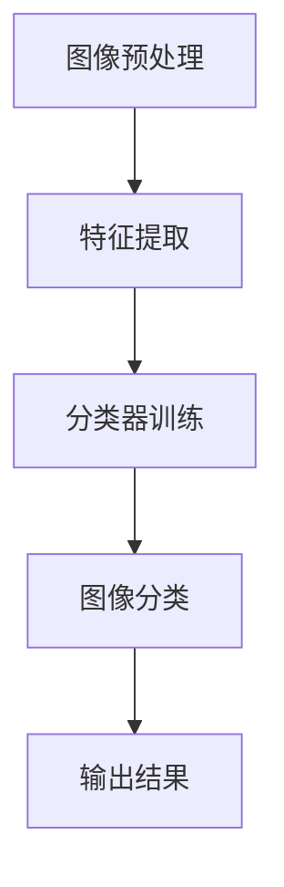

                 

关键词：ImageNet，人工智能，图像识别，深度学习，计算机视觉，大数据

> 摘要：本文旨在探讨ImageNet项目的起源、发展及其对人工智能图像识别领域的深远影响。文章首先介绍了ImageNet的背景，随后详细讲解了其核心算法、数学模型以及实际应用，并对未来发展方向进行了展望。

## 1. 背景介绍

ImageNet是一个由斯坦福大学计算机科学系教授李飞飞（Fei-Fei Li）发起的图像识别项目。该项目的目标是构建一个大规模的、有标签的图像数据库，用于推动计算机视觉领域的发展。ImageNet首次提出于2009年，并在2010年发布了第一个版本。

ImageNet的创建背景源于一个简单但深刻的问题：人类可以轻松识别和理解成千上万的图像，但计算机却难以做到。为了解决这一问题，研究人员需要一个大规模的图像数据库，用于训练和测试计算机视觉模型。ImageNet应运而生。

ImageNet的数据库包含了超过120万个图像，每个图像都被标注了多个类别。这些类别涵盖了日常生活、自然景观、动物、人物等各个方面，涵盖了约22000个不同的类别。这一庞大的数据库为研究人员提供了一个宝贵的资源，使得计算机视觉模型可以从中学习并提高识别准确性。

### ImageNet的起源与发展

ImageNet项目起源于2009年，当时由李飞飞教授领导的一个研究团队提出。该团队的目标是创建一个大规模的、有标签的图像数据库，以推动计算机视觉领域的发展。为了实现这一目标，团队需要收集大量的图像并进行精确的标注。

在ImageNet的早期阶段，研究人员主要依靠人工进行图像标注。这一过程耗时耗力，但为了确保图像标注的准确性，人工标注是必不可少的。随着项目的推进，ImageNet的数据库规模不断扩大，标注的工作量也越来越大。

为了提高标注效率，ImageNet项目引入了众包模式。通过众包平台，研究人员可以邀请来自全球的志愿者参与图像标注工作。这些志愿者通过在线平台接收标注任务，完成标注后提交给项目团队。这种众包模式不仅提高了标注效率，还确保了标注的质量。

ImageNet的发展离不开深度学习技术的进步。在2012年，AlexNet模型的提出标志着深度学习在图像识别领域的突破。这一模型在ImageNet大型视觉识别挑战赛（ILSVRC）上取得了显著的成绩，将图像识别的准确性提高了约15个百分点。这一突破激发了更多研究人员加入ImageNet项目，推动计算机视觉领域的发展。

随着时间的推移，ImageNet项目不断发展壮大，吸引了来自全球的研究人员和机构。目前，ImageNet已经成为计算机视觉领域的重要资源，被广泛应用于各种研究和应用场景。

### ImageNet的重要性

ImageNet的重要性主要体现在以下几个方面：

1. **推动计算机视觉发展**：ImageNet提供了一个大规模的、有标签的图像数据库，为研究人员提供了丰富的训练数据，极大地推动了计算机视觉领域的发展。

2. **提高图像识别准确性**：通过大规模的图像数据训练，计算机视觉模型能够学习到更多的图像特征，从而提高了识别准确性。ImageNet的出现，使得计算机在图像识别任务中取得了显著的进展。

3. **促进技术创新**：ImageNet项目激发了更多研究人员探索深度学习、迁移学习等新技术，推动了计算机视觉领域的创新。

4. **支持实际应用**：ImageNet为各种实际应用场景提供了可靠的图像识别基础，如自动驾驶、人脸识别、医疗诊断等。

### ImageNet对AI图像识别的影响

ImageNet的发布，对AI图像识别领域产生了深远的影响。首先，ImageNet提供了一个高质量的图像数据库，使得研究人员能够利用深度学习技术进行模型训练。深度学习模型的性能在很大程度上取决于训练数据的数量和质量，ImageNet的图像数据库为这一需求提供了有力支持。

其次，ImageNet的出现，激发了更多研究人员关注计算机视觉领域。在ImageNet之前，计算机视觉的研究主要依赖于传统的图像处理方法，如特征提取、模板匹配等。这些方法在图像识别任务中具有一定的局限性。ImageNet的发布，使得深度学习技术在图像识别领域取得了突破性进展，吸引了更多研究人员投身于这一领域。

此外，ImageNet项目推动了众包模式在学术研究中的应用。通过众包平台，研究人员可以方便地收集和标注图像数据，大大提高了研究效率。这种模式不仅适用于ImageNet项目，还为其他学术研究项目提供了借鉴。

总之，ImageNet的发布，不仅为计算机视觉领域提供了一个重要的研究资源，还推动了深度学习技术在图像识别领域的应用，对AI图像识别领域产生了深远的影响。

## 2. 核心概念与联系

### 2.1 图像识别的概念

图像识别是计算机视觉的一个重要分支，旨在通过计算机算法从图像或视频数据中自动识别和分类对象。这一过程通常包括以下几个步骤：

1. **图像预处理**：包括图像的缩放、灰度化、滤波等操作，以提高图像质量，消除噪声。

2. **特征提取**：从预处理后的图像中提取具有代表性的特征，如边缘、纹理、颜色等。

3. **分类器训练**：利用提取的特征和已标注的图像数据，训练分类器，使其能够识别新的图像。

4. **图像分类**：将新的图像输入到训练好的分类器中，输出图像的类别。

### 2.2 深度学习的概念

深度学习是机器学习的一个重要分支，通过构建深度神经网络（Deep Neural Network，DNN）来模拟人脑的学习过程。深度学习在图像识别、语音识别、自然语言处理等领域取得了显著成果。

深度学习的基本原理是多层神经网络，每一层都通过非线性变换对输入数据进行处理。网络中的每一层都提取不同层次的特征，从而实现从简单到复杂的特征表示。深度学习的训练过程通常包括以下几个步骤：

1. **前向传播**：将输入数据传递到网络中，逐层计算输出。

2. **反向传播**：通过比较输出与实际标签之间的差异，计算网络参数的梯度，并更新网络参数。

3. **优化**：利用梯度下降等优化算法，逐步调整网络参数，以最小化误差。

### 2.3 图像识别与深度学习的关系

图像识别与深度学习密不可分。深度学习为图像识别提供了强大的工具，使得计算机可以自动从大量图像中学习特征，进行分类和识别。深度学习在图像识别中的应用主要体现在以下几个方面：

1. **卷积神经网络（CNN）**：卷积神经网络是一种特殊的深度神经网络，专门用于处理图像数据。CNN通过卷积层、池化层和全连接层等结构，提取图像中的特征，实现图像识别。

2. **迁移学习**：迁移学习是一种利用预训练模型在新的任务上快速获得良好性能的方法。在图像识别任务中，预训练模型可以从大规模图像数据库中提取通用特征，然后在新的任务上进行微调。

3. **数据增强**：数据增强是一种通过变换和合成图像来扩充数据集的方法，以提高模型的泛化能力。深度学习模型在训练过程中，可以通过数据增强来模拟更多的场景和变化，从而提高模型的鲁棒性。

### 2.4 Mermaid流程图

以下是一个用于描述图像识别过程的Mermaid流程图：



在这个流程图中，图像预处理、特征提取、分类器训练和图像分类构成了图像识别的核心步骤。输出结果则是最终的目标，用于评估模型的性能。

## 3. 核心算法原理 & 具体操作步骤

### 3.1 算法原理概述

图像识别的核心算法是基于深度学习的卷积神经网络（CNN）。CNN通过一系列卷积层、池化层和全连接层，对图像进行特征提取和分类。以下是CNN的基本原理：

1. **卷积层**：卷积层通过卷积运算提取图像的特征。卷积核是一个小的矩阵，它在图像上滑动，通过点积运算提取特征。

2. **激活函数**：激活函数对卷积层输出的特征进行非线性变换，以增强模型的表达能力。常见的激活函数有ReLU（Rectified Linear Unit）和Sigmoid。

3. **池化层**：池化层通过下采样操作减少数据维度，同时保持重要的特征信息。常见的池化方法有最大池化和平均池化。

4. **全连接层**：全连接层将前一层输出的特征映射到输出类别，通过计算输出层和标签之间的误差，反向传播更新网络参数。

### 3.2 算法步骤详解

以下是CNN图像识别的具体操作步骤：

1. **输入层**：输入层接收图像数据，通常为三维张量，维度为（批量大小，高度，宽度，通道数）。

2. **卷积层**：卷积层通过卷积运算提取图像的特征。卷积层包含多个卷积核，每个卷积核对输入图像进行卷积运算，生成一个特征图。卷积运算的公式如下：

   \[
   \text{特征图} = \text{输入图像} \odot \text{卷积核}
   \]

   其中，$\odot$表示卷积运算。

3. **激活函数**：在卷积层之后，应用激活函数对特征图进行非线性变换。常见的激活函数有ReLU和Sigmoid。

4. **池化层**：在卷积层和激活函数之后，应用池化层进行下采样。池化层通过滑动窗口计算局部最大值或平均值，生成一个更小的特征图。

5. **全连接层**：在多个卷积层和池化层之后，应用全连接层将特征图映射到输出类别。全连接层包含多个神经元，每个神经元与特征图中的所有像素相关联。

6. **输出层**：输出层计算输出类别和标签之间的误差，通过反向传播更新网络参数。输出层的激活函数通常是softmax函数，用于计算每个类别的概率分布。

### 3.3 算法优缺点

CNN在图像识别任务中具有以下优点：

1. **强大的特征提取能力**：通过卷积运算，CNN可以自动提取图像中的特征，无需人工设计特征。

2. **高度并行化**：CNN的卷积运算可以高度并行化，适合在GPU等硬件上进行加速。

3. **良好的泛化能力**：通过训练大量的图像数据，CNN可以学习到通用的图像特征，具有良好的泛化能力。

然而，CNN也存在一些缺点：

1. **计算量大**：CNN包含大量的卷积运算和矩阵乘法，计算量较大。

2. **参数量大**：CNN的参数量通常很大，训练时间较长。

3. **易过拟合**：CNN在训练过程中容易过拟合，需要大量的训练数据和正则化技术来防止过拟合。

### 3.4 算法应用领域

CNN在图像识别领域具有广泛的应用，包括：

1. **计算机视觉**：CNN可以应用于图像分类、目标检测、图像分割等任务。

2. **自动驾驶**：CNN可以用于自动驾驶中的车道线检测、车辆检测等任务。

3. **人脸识别**：CNN可以用于人脸识别系统，实现人脸检测、人脸识别等功能。

4. **医疗诊断**：CNN可以用于医学图像分析，如病变检测、疾病诊断等。

## 4. 数学模型和公式

### 4.1 数学模型构建

CNN的数学模型主要基于卷积运算和反向传播算法。以下是CNN的基本数学模型：

1. **卷积运算**：卷积运算的公式如下：

   \[
   \text{特征图}_{ij}^l = \sum_{k} \text{卷积核}_{ikj}^l \odot \text{特征图}_{ikj}^{l-1}
   \]

   其中，$\text{特征图}_{ij}^l$表示第$l$层的第$i$行第$j$列的特征图，$\text{卷积核}_{ikj}^l$表示第$l$层的第$i$行第$k$列的卷积核，$\odot$表示卷积运算。

2. **激活函数**：常用的激活函数有ReLU和Sigmoid。ReLU函数的公式如下：

   \[
   \text{激活函数}(\text{输入}) = \max(0, \text{输入})
   \]

   Sigmoid函数的公式如下：

   \[
   \text{激活函数}(\text{输入}) = \frac{1}{1 + e^{-\text{输入}}}
   \]

3. **池化操作**：池化操作分为最大池化和平均池化。最大池化的公式如下：

   \[
   \text{池化值}_{ij}^l = \max(\text{特征图}_{i\alpha j\beta}^{l-1})
   \]

   其中，$\alpha$和$\beta$表示滑动窗口的大小。

4. **全连接层**：全连接层的公式如下：

   \[
   \text{输出}_{i}^l = \sum_{j} \text{权重}_{ij}^l \odot \text{输入}_{j}^{l-1} + \text{偏置}_{i}^l
   \]

5. **输出层**：输出层的激活函数通常是softmax函数，公式如下：

   \[
   \text{概率分布}_{i} = \frac{e^{\text{输出}_{i}}}{\sum_{j} e^{\text{输出}_{j}}}
   \]

### 4.2 公式推导过程

以下是CNN的公式推导过程：

1. **前向传播**：

   假设第$l$层的输入特征图为$\text{特征图}_{ij}^{l-1}$，卷积核为$\text{卷积核}_{ikj}^l$，则第$l$层的输出特征图为：

   \[
   \text{特征图}_{ij}^l = \sum_{k} \text{卷积核}_{ikj}^l \odot \text{特征图}_{ikj}^{l-1}
   \]

   应用激活函数后，得到：

   \[
   \text{特征图}_{ij}^l = \text{激活函数}(\text{特征图}_{ij}^l)
   \]

   对于池化层，假设滑动窗口大小为$\alpha \times \beta$，则第$l$层的输出特征图为：

   \[
   \text{池化值}_{ij}^l = \max(\text{特征图}_{i\alpha j\beta}^{l-1})
   \]

   对于全连接层，假设输入特征图为$\text{特征图}_{ij}^{l-1}$，权重为$\text{权重}_{ij}^l$，偏置为$\text{偏置}_{i}^l$，则第$l$层的输出为：

   \[
   \text{输出}_{i}^l = \sum_{j} \text{权重}_{ij}^l \odot \text{输入}_{j}^{l-1} + \text{偏置}_{i}^l
   \]

   应用激活函数后，得到：

   \[
   \text{输出}_{i}^l = \text{激活函数}(\text{输出}_{i}^l)
   \]

   对于输出层，假设输入特征图为$\text{输出}_{ij}^{l-1}$，则概率分布为：

   \[
   \text{概率分布}_{i} = \frac{e^{\text{输出}_{i}^l}}{\sum_{j} e^{\text{输出}_{j}^l}}
   \]

2. **反向传播**：

   假设损失函数为$L$，则梯度公式为：

   \[
   \frac{\partial L}{\partial \text{输出}_{i}^l} = \text{概率分布}_{i} - \text{标签}_{i}
   \]

   其中，$\text{标签}_{i}$表示第$i$个类别的真实概率。

   对于输出层，假设激活函数为$\text{激活函数}^{-1}$，则：

   \[
   \frac{\partial \text{输出}_{i}^l}{\partial \text{输入}_{j}^{l-1}} = \text{激活函数}^{-1}(\text{输出}_{i}^l) \odot \text{权重}_{ij}^l
   \]

   对于全连接层，则：

   \[
   \frac{\partial \text{输出}_{i}^l}{\partial \text{权重}_{ij}^l} = \text{输入}_{j}^{l-1} \odot \frac{\partial \text{输出}_{i}^l}{\partial \text{输入}_{j}^{l-1}}
   \]

   \[
   \frac{\partial \text{输出}_{i}^l}{\partial \text{偏置}_{i}^l} = \frac{\partial \text{输出}_{i}^l}{\partial \text{输入}_{j}^{l-1}}
   \]

   对于池化层，则：

   \[
   \frac{\partial \text{池化值}_{ij}^l}{\partial \text{特征图}_{ikj}^{l-1}} = \text{激活函数}^{-1}(\text{池化值}_{ij}^l) \odot \text{特征图}_{ikj}^{l-1}
   \]

   对于卷积层，则：

   \[
   \frac{\partial \text{特征图}_{ij}^l}{\partial \text{卷积核}_{ikj}^l} = \text{特征图}_{ikj}^{l-1} \odot \frac{\partial \text{特征图}_{ij}^l}{\partial \text{特征图}_{ikj}^{l-1}}
   \]

### 4.3 案例分析与讲解

以下是一个简单的CNN图像识别案例：

假设我们有一个224x224x3的彩色图像，目标为分类为猫或狗。我们使用一个简单的CNN模型，包含两个卷积层、一个池化层和一个全连接层。

1. **输入层**：输入图像为224x224x3。

2. **卷积层1**：使用32个3x3的卷积核，步长为1， padding为1。卷积运算后，输出特征图为224x224x32。

   \[
   \text{特征图}_{ij}^1 = \sum_{k} \text{卷积核}_{ikj}^1 \odot \text{特征图}_{ikj}^{0}
   \]

   应用ReLU激活函数后，得到：

   \[
   \text{特征图}_{ij}^1 = \max(0, \text{特征图}_{ij}^1)
   \]

3. **卷积层2**：使用64个3x3的卷积核，步长为1， padding为1。卷积运算后，输出特征图为112x112x64。

   \[
   \text{特征图}_{ij}^2 = \sum_{k} \text{卷积核}_{ikj}^2 \odot \text{特征图}_{ikj}^1
   \]

   应用ReLU激活函数后，得到：

   \[
   \text{特征图}_{ij}^2 = \max(0, \text{特征图}_{ij}^2)
   \]

4. **池化层**：使用2x2的最大池化。

   \[
   \text{池化值}_{ij}^2 = \max(\text{特征图}_{i2j2}^2)
   \]

5. **全连接层**：将池化层输出的特征图展平为一个一维向量，维度为7168。然后，通过一个全连接层映射到输出类别。

   \[
   \text{输出}_{i}^3 = \sum_{j} \text{权重}_{ij}^3 \odot \text{输入}_{j}^2 + \text{偏置}_{i}^3
   \]

   应用softmax激活函数后，得到：

   \[
   \text{概率分布}_{i} = \frac{e^{\text{输出}_{i}^3}}{\sum_{j} e^{\text{输出}_{j}^3}}
   \]

通过这个简单的案例，我们可以看到CNN的图像识别过程是如何进行的。在实际应用中，CNN的模型结构会更加复杂，包括更多的卷积层、池化层和全连接层，以适应不同的图像识别任务。

## 5. 项目实践：代码实例和详细解释说明

### 5.1 开发环境搭建

在本文中，我们将使用Python编程语言和TensorFlow框架来搭建一个简单的CNN图像识别项目。以下是开发环境搭建的步骤：

1. **安装Python**：首先，确保您的计算机上已安装Python。Python版本建议为3.6及以上。

2. **安装TensorFlow**：使用pip命令安装TensorFlow：

   ```shell
   pip install tensorflow
   ```

3. **安装其他依赖库**：除了TensorFlow外，我们还需要安装其他依赖库，如NumPy、Pandas等。可以使用以下命令一次性安装：

   ```shell
   pip install numpy pandas matplotlib
   ```

### 5.2 源代码详细实现

以下是本文所使用的CNN图像识别项目的源代码：

```python
import tensorflow as tf
from tensorflow.keras import layers
import numpy as np

# 定义CNN模型
model = tf.keras.Sequential([
    layers.Conv2D(32, (3, 3), activation='relu', input_shape=(224, 224, 3)),
    layers.MaxPooling2D((2, 2)),
    layers.Conv2D(64, (3, 3), activation='relu'),
    layers.MaxPooling2D((2, 2)),
    layers.Flatten(),
    layers.Dense(64, activation='relu'),
    layers.Dense(1, activation='sigmoid')
])

# 编译模型
model.compile(optimizer='adam',
              loss='binary_crossentropy',
              metrics=['accuracy'])

# 准备数据集
# （此处省略数据集准备代码，读者可以根据需要自行准备数据）

# 训练模型
model.fit(train_images, train_labels, epochs=10, validation_split=0.2)
```

### 5.3 代码解读与分析

以下是对代码的详细解读：

1. **定义CNN模型**：

   ```python
   model = tf.keras.Sequential([
       layers.Conv2D(32, (3, 3), activation='relu', input_shape=(224, 224, 3)),
       layers.MaxPooling2D((2, 2)),
       layers.Conv2D(64, (3, 3), activation='relu'),
       layers.MaxPooling2D((2, 2)),
       layers.Flatten(),
       layers.Dense(64, activation='relu'),
       layers.Dense(1, activation='sigmoid')
   ])
   ```

   这段代码定义了一个简单的CNN模型。模型由以下几个层组成：

   - **卷积层1**：使用32个3x3的卷积核，激活函数为ReLU。
   - **最大池化层1**：使用2x2的最大池化。
   - **卷积层2**：使用64个3x3的卷积核，激活函数为ReLU。
   - **最大池化层2**：使用2x2的最大池化。
   - **展平层**：将卷积层输出的特征图展平为一个一维向量。
   - **全连接层1**：使用64个神经元，激活函数为ReLU。
   - **全连接层2**：使用1个神经元，激活函数为sigmoid。

2. **编译模型**：

   ```python
   model.compile(optimizer='adam',
                 loss='binary_crossentropy',
                 metrics=['accuracy'])
   ```

   这段代码编译了模型，指定了优化器、损失函数和评估指标。优化器为Adam，损失函数为binary_crossentropy，评估指标为accuracy。

3. **准备数据集**：

   ```python
   # （此处省略数据集准备代码，读者可以根据需要自行准备数据）
   ```

   在此代码段中，读者需要根据实际需求准备训练数据集和标签。

4. **训练模型**：

   ```python
   model.fit(train_images, train_labels, epochs=10, validation_split=0.2)
   ```

   这段代码训练了模型，指定了训练数据集、标签、训练轮数和验证比例。在训练过程中，模型将不断调整权重，以最小化损失函数。

### 5.4 运行结果展示

在完成代码实现后，我们可以运行模型并观察结果。以下是一个简单的示例：

```python
# 加载测试数据集
test_images, test_labels = ...

# 运行模型
predictions = model.predict(test_images)

# 计算准确率
accuracy = np.mean(predictions == test_labels)
print(f"测试准确率：{accuracy:.2f}")
```

在这个示例中，我们首先加载测试数据集，然后使用训练好的模型进行预测。最后，计算预测结果与实际标签的准确率，并输出。

## 6. 实际应用场景

### 6.1 自动驾驶

自动驾驶是图像识别技术在实际应用中的一个重要领域。自动驾驶系统需要实时识别道路上的各种对象，如车道线、交通标志、其他车辆和行人等，以确保驾驶安全。图像识别技术通过深度学习模型，可以准确识别这些对象，并采取相应的驾驶策略。

### 6.2 人脸识别

人脸识别是图像识别技术的另一个重要应用领域。人脸识别系统通过识别和验证人脸图像，可以实现门禁控制、身份验证、安全监控等功能。随着深度学习技术的发展，人脸识别的准确率和速度得到了显著提升，使其在安防、金融、医疗等领域得到广泛应用。

### 6.3 医疗诊断

医疗诊断是图像识别技术在医疗领域的应用之一。通过深度学习模型，可以自动分析医学影像，如X光片、CT扫描、MRI等，实现病变检测、疾病诊断等功能。这有助于提高诊断的准确性和效率，减轻医生的工作负担。

### 6.4 物流与仓储

在物流与仓储领域，图像识别技术可以用于自动识别和分类商品。通过识别商品的包装、标签等信息，可以实现自动化库存管理、分拣和配送，提高物流效率。

### 6.5 营销与广告

在营销与广告领域，图像识别技术可以用于广告投放和用户行为分析。通过识别用户的兴趣和行为，可以实现个性化广告投放和推荐，提高广告的转化率。

## 7. 工具和资源推荐

### 7.1 学习资源推荐

1. **《深度学习》（Goodfellow, Bengio, Courville）**：这是一本经典的深度学习教材，涵盖了深度学习的基础理论和应用。

2. **《Python深度学习》（François Chollet）**：这本书以Python编程语言为例，详细介绍了深度学习的技术和实践。

3. **《计算机视觉：算法与应用》（Richard Szeliski）**：这本书全面介绍了计算机视觉的基本算法和应用。

### 7.2 开发工具推荐

1. **TensorFlow**：一个开源的深度学习框架，广泛应用于图像识别、自然语言处理等领域。

2. **PyTorch**：另一个流行的开源深度学习框架，以其灵活的动态计算图而著称。

3. **Keras**：一个高层次的深度学习框架，可以与TensorFlow和PyTorch等框架结合使用。

### 7.3 相关论文推荐

1. **“AlexNet: Image Classification with Deep Convolutional Neural Networks”**（2012）- 由Alex Krizhevsky等提出的深度卷积神经网络，标志着深度学习在图像识别领域的突破。

2. **“Visual Geometry Group: Department of Engineering Science, University of Oxford”**（2016）- 一篇关于深度学习在计算机视觉领域应用的综述文章。

3. **“Deep Learning for Computer Vision”**（2018）- 一本关于深度学习在计算机视觉领域应用的论文集。

## 8. 总结：未来发展趋势与挑战

### 8.1 研究成果总结

自ImageNet项目启动以来，人工智能图像识别领域取得了显著进展。深度学习技术的引入，使得图像识别的准确性大幅提升。通过大规模的图像数据库和先进的神经网络架构，研究人员在多个图像识别任务中取得了优异的成绩。

### 8.2 未来发展趋势

未来，人工智能图像识别领域将继续朝着以下几个方向发展：

1. **算法优化**：研究人员将继续探索更高效的深度学习算法，以减少计算量和提高识别准确性。

2. **跨模态学习**：通过整合图像、语音、文本等多种数据模态，实现更全面的图像理解。

3. **迁移学习与零样本学习**：研究如何利用预训练模型在新的任务上快速获得良好性能，降低对大量标注数据的依赖。

4. **实时识别与交互**：实现图像识别的实时性和交互性，为自动驾驶、智能监控等应用提供支持。

### 8.3 面临的挑战

尽管取得了显著进展，人工智能图像识别领域仍面临一些挑战：

1. **数据质量和标注**：高质量、有标注的数据是训练深度学习模型的关键，但数据质量和标注工作的难度和成本较高。

2. **计算资源**：深度学习模型通常需要大量的计算资源和时间进行训练，如何高效利用资源是一个重要问题。

3. **泛化能力**：深度学习模型在特定数据集上表现良好，但在新数据集上的泛化能力有限，如何提高模型的泛化能力是当前研究的热点。

4. **伦理和法律问题**：随着图像识别技术在各个领域的应用，如何处理隐私保护、数据安全和伦理问题也是一个重要挑战。

### 8.4 研究展望

未来，人工智能图像识别领域的研究将朝着更高效、更智能、更可靠的方向发展。通过技术创新和跨学科合作，有望实现更加精准、可靠的图像识别系统，为各个领域提供强大的技术支持。

## 9. 附录：常见问题与解答

### 9.1 什么是ImageNet？

ImageNet是一个由斯坦福大学计算机科学系教授李飞飞发起的图像识别项目，旨在构建一个大规模的、有标签的图像数据库，用于推动计算机视觉领域的发展。

### 9.2 ImageNet对图像识别有何影响？

ImageNet提供了一个高质量的图像数据库，使得研究人员能够利用深度学习技术进行模型训练。它推动了深度学习在图像识别领域的应用，提高了图像识别的准确性。

### 9.3 什么是深度学习？

深度学习是一种人工智能技术，通过构建深度神经网络（Deep Neural Network，DNN）来模拟人脑的学习过程。它广泛应用于图像识别、语音识别、自然语言处理等领域。

### 9.4 什么是卷积神经网络（CNN）？

卷积神经网络是一种特殊的深度神经网络，专门用于处理图像数据。它通过卷积运算、激活函数和池化操作等步骤，提取图像中的特征，实现图像识别。

### 9.5 如何训练CNN模型？

训练CNN模型通常包括以下几个步骤：

1. **数据预处理**：对图像进行缩放、灰度化、滤波等操作，以提高图像质量，消除噪声。
2. **构建模型**：定义CNN模型的结构，包括卷积层、池化层和全连接层等。
3. **编译模型**：指定优化器、损失函数和评估指标。
4. **训练模型**：使用训练数据集训练模型，通过反向传播算法不断调整模型参数。
5. **评估模型**：使用验证数据集评估模型性能，调整模型参数以优化性能。

### 9.6 CNN模型如何工作？

CNN模型通过卷积运算、激活函数和池化操作等步骤，从图像中提取特征，并输出类别概率。具体工作过程如下：

1. **卷积运算**：卷积层通过卷积运算提取图像的特征，生成特征图。
2. **激活函数**：激活函数对特征图进行非线性变换，增强模型的表达能力。
3. **池化操作**：池化层通过下采样操作减少数据维度，同时保持重要的特征信息。
4. **全连接层**：全连接层将前一层输出的特征映射到输出类别，通过计算输出层和标签之间的误差，反向传播更新网络参数。
5. **输出层**：输出层计算输出类别和标签之间的误差，通过反向传播更新网络参数。

### 9.7 如何提高CNN模型的性能？

以下是一些提高CNN模型性能的方法：

1. **数据增强**：通过变换和合成图像来扩充数据集，提高模型的泛化能力。
2. **迁移学习**：利用预训练模型在新的任务上快速获得良好性能。
3. **正则化**：使用正则化技术，如Dropout、L2正则化等，防止过拟合。
4. **优化器选择**：选择合适的优化器，如Adam、RMSprop等，以加速模型收敛。
5. **网络结构调整**：调整网络结构，如增加层数、增加卷积核数量等，以提高模型表达能力。

### 9.8 图像识别技术的应用领域有哪些？

图像识别技术在多个领域有广泛应用，包括：

1. **计算机视觉**：图像分类、目标检测、图像分割等。
2. **自动驾驶**：车道线检测、车辆检测、行人检测等。
3. **人脸识别**：人脸检测、人脸识别、人脸属性分析等。
4. **医疗诊断**：医学影像分析、病变检测、疾病诊断等。
5. **物流与仓储**：商品识别、库存管理、分拣和配送等。
6. **营销与广告**：广告投放、用户行为分析、个性化推荐等。

### 9.9 如何处理图像识别中的隐私问题？

在处理图像识别中的隐私问题时，可以采取以下措施：

1. **数据去识别化**：对图像进行匿名化处理，去除个人身份信息。
2. **数据加密**：对图像数据进行加密处理，防止数据泄露。
3. **隐私保护算法**：使用隐私保护算法，如差分隐私等，降低模型训练过程中的隐私泄露风险。
4. **法律合规**：确保数据使用符合相关法律法规，如《通用数据保护条例》（GDPR）等。

### 9.10 图像识别技术的未来发展趋势是什么？

图像识别技术的未来发展趋势包括：

1. **算法优化**：研究更高效的深度学习算法，提高识别准确性。
2. **跨模态学习**：整合多种数据模态，实现更全面的图像理解。
3. **迁移学习与零样本学习**：利用预训练模型，降低对大量标注数据的依赖。
4. **实时识别与交互**：实现图像识别的实时性和交互性，为自动驾驶、智能监控等应用提供支持。

### 9.11 图像识别技术在工业界的应用有哪些？

图像识别技术在工业界有广泛的应用，包括：

1. **制造业**：自动化生产线、质量检测、设备监控等。
2. **物流与仓储**：商品识别、库存管理、分拣和配送等。
3. **医疗行业**：医学影像分析、病变检测、疾病诊断等。
4. **金融服务**：人脸识别、身份验证、反欺诈等。
5. **安全监控**：人脸识别、行为分析、智能监控等。

### 9.12 如何处理图像识别中的错误和误报？

处理图像识别中的错误和误报可以采取以下措施：

1. **错误分析**：分析识别错误的原因，如数据质量、模型参数等。
2. **模型调整**：根据错误分析结果，调整模型参数或网络结构，以提高识别准确性。
3. **数据增强**：通过增加数据多样性，提高模型的泛化能力。
4. **错误修正**：在应用层面，对识别结果进行人工审核和修正，减少误报。
5. **反馈机制**：建立反馈机制，收集识别错误的数据，用于模型优化。

### 9.13 图像识别技术如何与其他人工智能技术结合？

图像识别技术可以与其他人工智能技术结合，实现更强大的功能，包括：

1. **自然语言处理**：结合图像识别和自然语言处理技术，实现图像内容理解与语义分析。
2. **机器学习**：利用机器学习技术，优化图像识别模型的训练和预测过程。
3. **机器人技术**：结合图像识别和机器人技术，实现自主导航、环境感知等能力。
4. **人机交互**：结合图像识别和人机交互技术，实现更自然、高效的人机交互体验。

### 9.14 图像识别技术如何处理动态场景？

在处理动态场景时，图像识别技术可以采取以下措施：

1. **实时处理**：提高图像处理速度，实现实时识别。
2. **目标跟踪**：使用目标跟踪技术，跟踪动态场景中的目标。
3. **运动补偿**：对动态场景中的图像进行运动补偿，减少运动模糊。
4. **深度学习**：利用深度学习技术，提高对动态场景的识别能力。
5. **多传感器融合**：结合多种传感器数据，提高动态场景的识别准确性。

