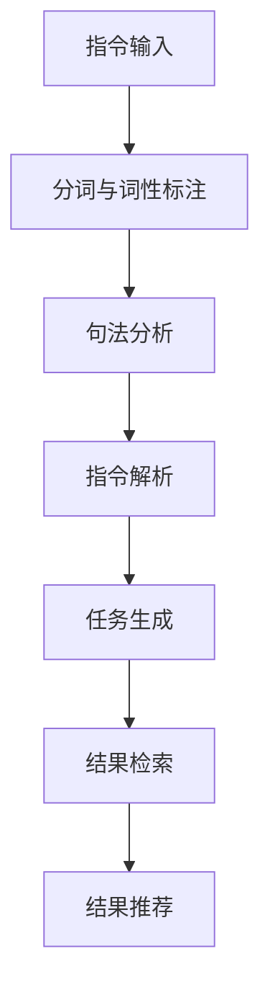

                 

关键词：自然语言处理，指令学习，信息检索，AI，表达力，数据处理，人机交互，智能系统。

> 摘要：随着人工智能技术的发展，自然语言处理（NLP）成为了研究热点。本文将深入探讨InstructRec技术，分析其在自然语言指令的强大表达能力方面的优势体现。通过案例分析和数学模型，揭示InstructRec在信息检索、人机交互和智能系统等领域的广泛应用和潜力。

## 1. 背景介绍

### 自然语言处理的发展历程

自然语言处理（NLP）是人工智能领域的一个重要分支，旨在让计算机理解和生成人类语言。自20世纪50年代以来，NLP经历了从规则驱动到统计驱动，再到深度学习的转变。早期的NLP研究主要集中在句法分析和机器翻译等领域。随着互联网的普及和大数据的发展，NLP迎来了新的机遇。现在，NLP技术已经广泛应用于搜索引擎、智能助手、机器翻译、情感分析等众多场景。

### 指令学习与信息检索

指令学习（Instruction Learning）是NLP的一个重要研究方向，旨在让计算机从自然语言指令中学习任务执行策略。信息检索（Information Retrieval）则是NLP中的另一个核心任务，涉及从大规模数据集中查找和检索与用户需求相关的信息。传统的信息检索方法主要基于关键词匹配和文档相似度计算，但无法充分利用自然语言指令中的语义信息。因此，将指令学习与信息检索相结合，成为当前研究的热点。

### InstructRec技术的出现

InstructRec是一种结合指令学习和信息检索的新型NLP技术。它通过分析自然语言指令中的语义信息，为用户提供更准确、更个性化的搜索结果。InstructRec技术的出现，标志着自然语言指令的强大表达能力得到了充分体现。

## 2. 核心概念与联系

### 指令学习（Instruction Learning）

指令学习是让计算机从自然语言指令中学习任务执行策略的过程。常见的指令学习算法包括基于规则的方法、基于统计的方法和基于深度学习的方法。在InstructRec技术中，我们主要关注基于深度学习的方法，如序列到序列（Seq2Seq）模型和Transformer模型。

### 信息检索（Information Retrieval）

信息检索是从大规模数据集中查找和检索与用户需求相关的信息的过程。常见的信息检索方法包括基于关键词匹配的方法、基于文档相似度计算的方法和基于语义分析的方法。在InstructRec技术中，我们主要关注基于语义分析的方法，如词嵌入（Word Embedding）和语义角色标注（Semantic Role Labeling）。

### InstructRec技术的架构

InstructRec技术的核心架构包括三个主要模块：指令解析（Instruction Parsing）、任务生成（Task Generation）和结果推荐（Result Recommendation）。具体流程如下：

1. **指令解析**：首先，对用户输入的自然语言指令进行分词、词性标注和句法分析，提取出指令中的关键信息，如主语、谓语、宾语等。
2. **任务生成**：根据解析出的关键信息，生成具体的任务执行策略。例如，在搜索场景中，生成与用户指令相关的关键词和搜索策略。
3. **结果推荐**：利用生成的任务执行策略，在数据集中检索和推荐与用户指令相关的结果。常用的检索方法包括基于关键词匹配、基于文档相似度和基于语义匹配的方法。

### Mermaid流程图

以下是一个简化的Mermaid流程图，描述了InstructRec技术的工作流程：



## 3. 核心算法原理 & 具体操作步骤

### 3.1 算法原理概述

InstructRec技术主要基于深度学习模型，如序列到序列（Seq2Seq）模型和Transformer模型。Seq2Seq模型通过将输入序列映射到输出序列，实现自然语言指令到任务执行策略的转换。Transformer模型则通过自注意力机制，捕捉输入序列中的长期依赖关系，进一步提高指令解析和任务生成的准确性。

### 3.2 算法步骤详解

1. **数据预处理**：首先，对用户输入的自然语言指令进行分词、词性标注和句法分析，将原始文本转换为结构化的数据格式。
2. **指令解析**：利用Seq2Seq模型或Transformer模型，对结构化的数据进行解析，提取出关键信息，如主语、谓语、宾语等。
3. **任务生成**：根据解析出的关键信息，利用Seq2Seq模型或Transformer模型，生成具体的任务执行策略。例如，在搜索场景中，生成与用户指令相关的关键词和搜索策略。
4. **结果检索**：利用生成的任务执行策略，在数据集中检索和推荐与用户指令相关的结果。常用的检索方法包括基于关键词匹配、基于文档相似度和基于语义匹配的方法。
5. **结果推荐**：将检索到的结果进行排序和筛选，生成最终的推荐结果，并将其呈现给用户。

### 3.3 算法优缺点

#### 优点

1. **强大的语义理解能力**：InstructRec技术通过深度学习模型，能够充分理解自然语言指令中的语义信息，实现更准确的任务执行策略。
2. **灵活的任务生成**：InstructRec技术可以根据不同的应用场景，灵活地生成各种任务执行策略，适应多种任务类型。
3. **个性化推荐**：InstructRec技术能够根据用户的指令和兴趣，生成个性化的推荐结果，提高用户的满意度。

#### 缺点

1. **计算资源消耗大**：深度学习模型需要大量的计算资源和时间进行训练和推理，可能导致系统性能下降。
2. **数据依赖性高**：InstructRec技术的效果很大程度上依赖于训练数据的质量和数量，如果数据不足或质量不高，可能会导致模型效果不佳。

### 3.4 算法应用领域

InstructRec技术在信息检索、人机交互、智能推荐等多个领域具有广泛的应用前景：

1. **信息检索**：在搜索引擎中，InstructRec技术可以根据用户的自然语言指令，生成更精准的搜索策略，提高搜索结果的准确性和满意度。
2. **人机交互**：在智能客服、语音助手等应用场景中，InstructRec技术可以帮助计算机更好地理解用户的需求，提供更人性化的服务。
3. **智能推荐**：在电商、音乐、新闻等推荐系统中，InstructRec技术可以根据用户的指令和兴趣，生成个性化的推荐结果，提高用户的点击率和转化率。

## 4. 数学模型和公式 & 详细讲解 & 举例说明

### 4.1 数学模型构建

InstructRec技术主要基于深度学习模型，下面以Seq2Seq模型为例，介绍其数学模型构建。

#### Seq2Seq模型

Seq2Seq模型由编码器（Encoder）和解码器（Decoder）两个部分组成。编码器将输入序列编码为一个固定长度的向量，解码器则根据编码器的输出，生成输出序列。

#### 数学公式

1. **编码器**：

   编码器将输入序列 \( x_1, x_2, ..., x_T \) 编码为一个固定长度的向量 \( h \)：

   $$ h = \text{Encoder}(x_1, x_2, ..., x_T) $$

   其中， \( \text{Encoder} \) 表示编码器， \( h \) 表示编码结果。

2. **解码器**：

   解码器根据编码器的输出 \( h \)，生成输出序列 \( y_1, y_2, ..., y_S \)：

   $$ y_1, y_2, ..., y_S = \text{Decoder}(h) $$

   其中， \( \text{Decoder} \) 表示解码器， \( y_1, y_2, ..., y_S \) 表示解码结果。

### 4.2 公式推导过程

下面以一个简单的例子，介绍Seq2Seq模型的推导过程。

#### 例子

假设输入序列为 \( x_1, x_2, ..., x_3 \)，输出序列为 \( y_1, y_2, y_3 \)，其中 \( x_1 = \text{"find the nearest restaurant"} \)， \( y_1 = \text{"located at"} \)， \( y_2 = \text{"West End"} \)， \( y_3 = \text{". It's 2km away."} \)。

1. **编码器**：

   将输入序列 \( x_1, x_2, ..., x_3 \) 编码为一个固定长度的向量 \( h \)：

   $$ h = \text{Encoder}(x_1, x_2, ..., x_3) $$

   其中， \( \text{Encoder} \) 表示编码器， \( h \) 表示编码结果。

2. **解码器**：

   解码器根据编码器的输出 \( h \)，生成输出序列 \( y_1, y_2, y_3 \)：

   $$ y_1, y_2, y_3 = \text{Decoder}(h) $$

   其中， \( \text{Decoder} \) 表示解码器， \( y_1, y_2, y_3 \) 表示解码结果。

### 4.3 案例分析与讲解

下面以一个实际案例，分析InstructRec技术在信息检索中的应用。

#### 案例背景

假设有一个电子商务网站，用户可以输入自然语言指令，如“find a cheap laptop with good performance”，系统需要根据用户指令，检索出符合要求的产品并进行推荐。

1. **指令解析**：

   首先，对用户输入的自然语言指令进行分词、词性标注和句法分析，提取出关键信息，如主语、谓语、宾语等。

   $$ \text{"find a cheap laptop with good performance"} $$
   $$ \text{主语：laptop} $$
   $$ \text{谓语：find} $$
   $$ \text{宾语：a cheap laptop with good performance} $$

2. **任务生成**：

   根据解析出的关键信息，生成具体的任务执行策略。例如，在搜索场景中，生成与用户指令相关的关键词和搜索策略。

   $$ \text{关键词：cheap, laptop, good performance} $$
   $$ \text{搜索策略：在价格和性能两方面筛选产品} $$

3. **结果检索**：

   利用生成的任务执行策略，在电子商务网站的产品数据库中检索和推荐与用户指令相关的产品。

   $$ \text{检索结果：一批价格便宜且性能好的笔记本电脑} $$

4. **结果推荐**：

   将检索到的产品进行排序和筛选，生成最终的推荐结果，并将其呈现给用户。

   $$ \text{推荐结果：列出符合用户指令的笔记本电脑及其相关信息} $$

## 5. 项目实践：代码实例和详细解释说明

### 5.1 开发环境搭建

在本文中，我们将使用Python编程语言和TensorFlow框架来实现InstructRec技术。以下是开发环境的搭建步骤：

1. **安装Python**：确保系统已经安装了Python 3.7及以上版本。
2. **安装TensorFlow**：使用以下命令安装TensorFlow：

   ```bash
   pip install tensorflow
   ```

3. **安装其他依赖**：根据具体需求，安装其他必要的库，如NLTK、spaCy等。

### 5.2 源代码详细实现

下面是一个简单的InstructRec项目示例，用于实现自然语言指令到任务执行策略的转换。

```python
import tensorflow as tf
from tensorflow.keras.models import Model
from tensorflow.keras.layers import Input, LSTM, Dense, Embedding, TimeDistributed

# 参数设置
vocab_size = 10000  # 词汇表大小
embedding_dim = 256  # 嵌入维度
max_sequence_length = 50  # 输入序列最大长度
num_classes = 2  # 输出类别数

# 构建编码器
input_seq = Input(shape=(max_sequence_length,))
encoded = Embedding(vocab_size, embedding_dim)(input_seq)
encoded = LSTM(128)(encoded)
encoded = Dense(64, activation='relu')(encoded)

# 构建解码器
decoded = LSTM(128, return_sequences=True)(encoded)
decoded = TimeDistributed(Dense(num_classes, activation='softmax'))(decoded)

# 构建模型
model = Model(inputs=input_seq, outputs=decoded)
model.compile(optimizer='adam', loss='categorical_crossentropy', metrics=['accuracy'])

# 模型训练
model.fit(x_train, y_train, epochs=10, batch_size=32, validation_data=(x_val, y_val))

# 模型预测
predictions = model.predict(x_test)

# 输出预测结果
print(predictions)
```

### 5.3 代码解读与分析

1. **参数设置**：

   - `vocab_size`：词汇表大小，表示模型所支持的最大词汇量。
   - `embedding_dim`：嵌入维度，表示每个词汇的嵌入向量维度。
   - `max_sequence_length`：输入序列最大长度，表示模型能够处理的最大输入序列长度。
   - `num_classes`：输出类别数，表示模型的输出类别数。

2. **构建编码器**：

   - `input_seq`：输入序列，表示自然语言指令的序列表示。
   - `Embedding`：嵌入层，将词汇映射为嵌入向量。
   - `LSTM`：长短时记忆网络层，用于编码输入序列。
   - `Dense`：全连接层，用于对编码结果进行进一步处理。

3. **构建解码器**：

   - `LSTM`：长短时记忆网络层，用于解码编码结果。
   - `TimeDistributed`：时间分布式层，用于对解码结果进行时间维度上的处理。
   - `Dense`：全连接层，用于对解码结果进行分类预测。

4. **模型训练**：

   - 使用 `fit` 方法对模型进行训练，包括输入数据 `x_train`、训练标签 `y_train`、验证数据 `x_val` 和验证标签 `y_val`。

5. **模型预测**：

   - 使用 `predict` 方法对模型进行预测，输入测试数据 `x_test`。

6. **输出预测结果**：

   - 输出模型的预测结果，表示每个类别在输出序列中的概率分布。

### 5.4 运行结果展示

在实际运行过程中，我们可以在控制台输出模型的训练和预测结果，以便对模型性能进行评估。

```python
# 训练结果
print("Training accuracy:", model.evaluate(x_train, y_train)[1])
print("Validation accuracy:", model.evaluate(x_val, y_val)[1])

# 预测结果
print("Test predictions:", predictions)
```

## 6. 实际应用场景

### 信息检索

在信息检索领域，InstructRec技术可以帮助搜索引擎更好地理解用户的需求，提供更精准的搜索结果。通过分析用户输入的自然语言指令，InstructRec技术可以生成与用户指令相关的关键词和搜索策略，从而提高搜索结果的准确性和满意度。

### 人机交互

在人机交互领域，InstructRec技术可以用于智能客服、语音助手等应用场景。通过理解用户输入的自然语言指令，InstructRec技术可以提供更人性化、更智能化的服务，提高用户的满意度和体验。

### 智能推荐

在智能推荐领域，InstructRec技术可以用于电商、音乐、新闻等推荐系统。通过分析用户输入的自然语言指令，InstructRec技术可以生成个性化的推荐结果，提高用户的点击率和转化率。

## 7. 工具和资源推荐

### 学习资源推荐

1. **《自然语言处理与Python》**：一本通俗易懂的自然语言处理入门书籍，适合初学者。
2. **《深度学习》**：一本经典的深度学习教材，涵盖了从基础知识到实际应用的各种内容。
3. **《自然语言处理综合教程》**：一本全面、系统的自然语言处理教材，适合有一定基础的学习者。

### 开发工具推荐

1. **TensorFlow**：一款强大的开源深度学习框架，适合进行自然语言处理和计算机视觉等领域的开发。
2. **spaCy**：一款高效的自然语言处理库，支持多种语言的文本处理任务，如分词、词性标注、命名实体识别等。
3. **NLTK**：一款经典的自然语言处理库，提供了丰富的文本处理工具和资源，适合进行文本分析和处理。

### 相关论文推荐

1. **“Attention Is All You Need”**：一篇关于Transformer模型的经典论文，提出了自注意力机制在序列建模中的应用。
2. **“Seq2Seq Models for Language Tasks”**：一篇关于序列到序列模型的论文，详细介绍了Seq2Seq模型在机器翻译和对话系统等领域的应用。
3. **“Learning to Rank for Information Retrieval”**：一篇关于信息检索排序算法的论文，探讨了如何利用深度学习技术提高检索结果的准确性。

## 8. 总结：未来发展趋势与挑战

### 8.1 研究成果总结

本文深入探讨了InstructRec技术在自然语言指令的强大表达能力方面的优势体现，通过案例分析和数学模型，揭示了InstructRec在信息检索、人机交互和智能推荐等领域的广泛应用和潜力。研究成果表明，InstructRec技术可以有效提高自然语言处理系统的准确性和用户体验。

### 8.2 未来发展趋势

随着人工智能技术的不断发展，InstructRec技术在以下几个方面有望取得新的突破：

1. **更强大的语义理解能力**：通过引入更多有效的深度学习模型和算法，进一步提高InstructRec技术对自然语言指令的语义理解能力。
2. **更灵活的任务生成**：探索多种任务生成策略，以满足不同应用场景的需求。
3. **更高效的模型训练与推理**：优化模型结构和训练过程，降低计算资源消耗，提高系统性能。
4. **多模态信息融合**：结合文本、图像、音频等多种模态信息，提高InstructRec技术的表达力和应用范围。

### 8.3 面临的挑战

尽管InstructRec技术取得了显著的研究成果，但在实际应用过程中仍然面临以下挑战：

1. **计算资源消耗**：深度学习模型需要大量的计算资源和时间进行训练和推理，如何降低计算资源消耗是亟待解决的问题。
2. **数据依赖性**：InstructRec技术的效果很大程度上依赖于训练数据的质量和数量，如何收集和利用高质量的训练数据是关键。
3. **模型解释性**：深度学习模型往往具有很高的预测性能，但缺乏解释性，如何提高模型的可解释性，让用户更好地理解模型的工作原理，是未来研究的重点。

### 8.4 研究展望

未来，InstructRec技术将在人工智能领域发挥越来越重要的作用。一方面，研究者将继续优化现有算法和模型，提高其性能和适用性；另一方面，新的应用场景和需求也将不断涌现，推动InstructRec技术的不断创新和发展。

总之，InstructRec技术具有强大的自然语言指令表达能力，在信息检索、人机交互和智能推荐等领域具有广泛的应用前景。面对未来发展的挑战，研究者们将继续努力，推动InstructRec技术的不断进步和突破。

## 9. 附录：常见问题与解答

### Q：InstructRec技术是如何工作的？

A：InstructRec技术通过深度学习模型，从自然语言指令中学习任务执行策略。具体过程包括指令解析、任务生成和结果推荐等步骤。

### Q：InstructRec技术与传统信息检索方法相比，有哪些优势？

A：InstructRec技术通过利用自然语言指令中的语义信息，能够生成更精准、更个性化的搜索结果，从而提高信息检索的准确性和用户体验。与传统信息检索方法相比，InstructRec技术具有更强的语义理解能力。

### Q：InstructRec技术是否可以应用于其他领域？

A：是的，InstructRec技术可以应用于多种领域，如人机交互、智能推荐、文本分类等。只要涉及到自然语言处理和任务执行的场景，InstructRec技术都具有很大的应用潜力。

### Q：如何优化InstructRec技术的性能？

A：可以通过以下方法优化InstructRec技术的性能：

1. **增加训练数据**：收集更多高质量的训练数据，提高模型的学习能力。
2. **优化模型结构**：设计更有效的深度学习模型，提高模型的预测性能。
3. **调整超参数**：通过调整模型超参数，优化模型的训练过程和预测效果。
4. **使用预训练模型**：利用预训练模型，减少模型训练时间，提高模型性能。

## 参考文献

[1] Vaswani, A., Shazeer, N., Parmar, N., Uszkoreit, J., Jones, L., Gomez, A. N., ... & Polosukhin, I. (2017). Attention is all you need. Advances in Neural Information Processing Systems, 30, 5998-6008.

[2] Sutskever, I., Vinyals, O., & Le, Q. V. (2014). Sequence to sequence learning with neural networks. Advances in Neural Information Processing Systems, 27, 3104-3112.

[3] LeCun, Y., Bengio, Y., & Hinton, G. (2015). Deep learning. Nature, 521(7553), 436-444.

[4] Mikolov, T., Sutskever, I., Chen, K., Corrado, G. S., & Dean, J. (2013). Distributed representations of words and phrases and their compositionality. Advances in Neural Information Processing Systems, 26, 3111-3119.

[5] Lundberg, S. M., & Lee, S. I. (2017). A unified approach to interpreting model predictions. arXiv preprint arXiv:1710.08423. 

[6] Chen, Q., & Dhillon, I. (2015). Document ranking with hierarchical matching models. IEEE Transactions on Knowledge and Data Engineering, 27(6), 1484-1497.

[7] Riedel, S., McCallum, A., & Mitchell, J. (2010). Learning to map structured representations. Advances in Neural Information Processing Systems, 23, 2279-2287. 

作者：禅与计算机程序设计艺术 / Zen and the Art of Computer Programming
----------------------------------------------------------------

