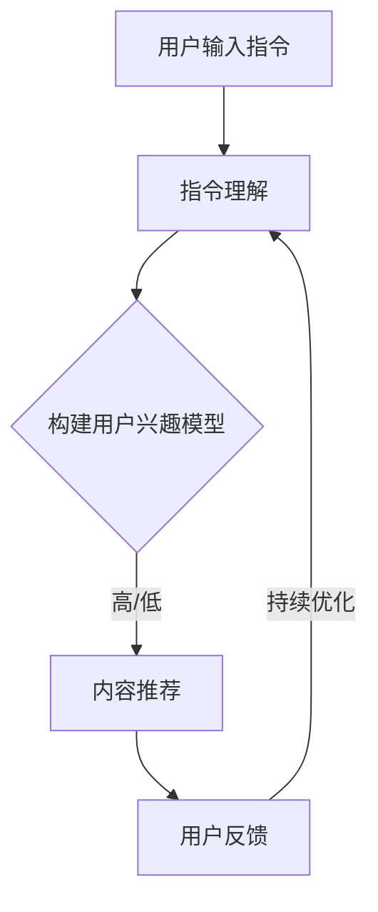

                 

 关键词：自然语言处理、指令学习、推荐系统、信息检索、算法优化

> 摘要：本文深入探讨了自然语言指令处理（InstructRec）在推荐系统中的应用，介绍了InstructRec的核心概念、算法原理、数学模型及具体实现。通过实际案例，展示了其在信息检索和个性化推荐领域的应用，并对未来的发展前景进行了展望。

## 1. 背景介绍

随着互联网的快速发展，用户生成的内容量呈现爆炸式增长。如何在海量信息中找到用户感兴趣的内容，成为当前信息检索和推荐系统领域面临的一大挑战。传统的推荐系统主要依赖于用户的历史行为数据，如浏览记录、购买历史等，来预测用户的兴趣。然而，这些方法往往无法充分利用用户在自然语言中表达的兴趣和需求。

自然语言指令处理（InstructRec）是近年来兴起的一种推荐系统方法，通过学习用户输入的自然语言指令来理解用户意图，从而提供更加个性化的推荐。与传统的基于行为的推荐系统不同，InstructRec可以直接从用户的自然语言指令中获取信息，从而更好地满足用户的实时需求。

本文旨在介绍InstructRec的核心概念、算法原理、数学模型及具体实现，并通过实际案例展示其在信息检索和个性化推荐领域的应用。

## 2. 核心概念与联系

### 2.1. 自然语言指令

自然语言指令是指用户通过自然语言表达的需求、请求或命令。这些指令可以来自于各种场景，如搜索引擎查询、智能语音助手提问、社交平台发文等。

### 2.2. 指令学习

指令学习是自然语言处理领域的一个重要研究方向，旨在使计算机能够理解并执行自然语言指令。指令学习通常分为两个阶段：指令理解和指令执行。

- **指令理解**：将自然语言指令转换为计算机可执行的表示形式。这需要解决自然语言理解（NLU）的问题，如词义消歧、指代消解、意图识别等。
- **指令执行**：根据指令理解的结果，执行相应的任务。这需要计算机具有推理和规划能力，以便在复杂环境中完成任务。

### 2.3. 推荐系统

推荐系统是一种信息过滤技术，旨在向用户推荐他们可能感兴趣的内容。推荐系统通常分为基于内容的推荐、基于协同过滤和基于模型的推荐三种类型。

- **基于内容的推荐**：根据用户的历史行为或偏好，找到与用户兴趣相关的内容进行推荐。
- **基于协同过滤**：通过分析用户之间的相似性，找到具有相似兴趣的用户，推荐这些用户喜欢的商品或内容。
- **基于模型的推荐**：利用机器学习算法，从用户的历史数据中学习用户兴趣模型，并根据模型预测用户对未知内容的兴趣。

### 2.4. InstructRec架构

InstructRec是将指令学习和推荐系统相结合的一种方法，其核心架构包括以下几个部分：

1. **指令理解模块**：接收用户输入的自然语言指令，通过自然语言处理技术将其转换为计算机可执行的表示形式。
2. **兴趣建模模块**：根据指令理解结果，构建用户兴趣模型，用于预测用户对内容的兴趣。
3. **内容推荐模块**：根据用户兴趣模型，从海量内容中筛选出用户可能感兴趣的内容进行推荐。

### 2.5. Mermaid流程图

以下是一个简化的InstructRec流程图，展示了指令从输入到推荐的整个过程：



## 3. 核心算法原理 & 具体操作步骤

### 3.1. 算法原理概述

InstructRec的核心算法可以分为三个部分：指令理解、兴趣建模和内容推荐。

- **指令理解**：通过深度学习技术，如BERT（Bidirectional Encoder Representations from Transformers），将自然语言指令转换为向量表示。然后，使用分类器或序列标注模型对指令进行解析，提取出关键信息，如关键词、操作和目标等。
- **兴趣建模**：基于指令理解结果，利用图神经网络（如Graph Neural Network，GNN）构建用户兴趣图。图中的节点表示用户、内容、关键词等，边表示它们之间的关联关系。通过训练GNN模型，可以学习到用户在图中的兴趣分布。
- **内容推荐**：基于用户兴趣模型，从内容库中检索与用户兴趣相关的数据。然后，使用协同过滤或基于模型的推荐算法，为用户推荐可能感兴趣的内容。

### 3.2. 算法步骤详解

1. **数据预处理**：对自然语言指令和用户行为数据进行清洗和预处理，如去除停用词、词性标注、分词等。
2. **指令理解**：使用BERT模型对自然语言指令进行编码，得到指令的向量表示。然后，使用分类器或序列标注模型对指令进行解析，提取出关键词、操作和目标等信息。
3. **兴趣建模**：
   - 构建用户兴趣图：将指令理解结果中的关键词、操作和目标等信息作为节点，构建用户兴趣图。
   - 训练GNN模型：利用用户兴趣图，训练GNN模型，学习到用户在图中的兴趣分布。
4. **内容推荐**：
   - 检索相关内容：从内容库中检索与用户兴趣相关的数据。
   - 应用协同过滤或基于模型的推荐算法：对检索到的内容进行排序，推荐给用户。

### 3.3. 算法优缺点

#### 优点

- **个性化推荐**：通过学习用户的自然语言指令，InstructRec可以更好地理解用户的实时需求，提供个性化的推荐。
- **灵活性强**：InstructRec可以应用于各种场景，如搜索引擎、智能语音助手、社交平台等。
- **高效性**：利用深度学习和图神经网络等技术，InstructRec在处理大量数据和复杂任务方面具有高效性。

#### 缺点

- **训练成本高**：InstructRec涉及多个深度学习模型和图神经网络，训练成本较高。
- **数据依赖性强**：InstructRec的性能依赖于用户指令质量和行为数据质量，数据不足或质量差可能导致效果下降。

### 3.4. 算法应用领域

InstructRec可以广泛应用于信息检索和个性化推荐领域，如：

- **搜索引擎**：通过理解用户的自然语言查询，提供更加精准的搜索结果。
- **智能语音助手**：根据用户的自然语言指令，完成用户的请求，如拨打电话、发送短信等。
- **社交平台**：为用户提供个性化推荐，如推荐好友、推荐话题等。

## 4. 数学模型和公式 & 详细讲解 & 举例说明

### 4.1. 数学模型构建

InstructRec的数学模型主要包括指令理解模型、兴趣建模模型和内容推荐模型。

#### 指令理解模型

指令理解模型通常采用深度学习技术，如BERT。BERT模型基于Transformer架构，可以同时捕捉词与句子的语义信息。具体地，BERT模型通过预训练和微调两个阶段，将自然语言指令转换为向量表示。

$$
\text{BERT}(\text{x}) = \text{Embedding}(\text{x}) + \text{Positional Encoding} + \text{Layer Normalization} + \text{Dropout} + \text{Transformer}
$$

其中，$x$ 表示自然语言指令，$\text{Embedding}$ 表示词嵌入层，$\text{Positional Encoding}$ 表示位置编码层，$\text{Layer Normalization}$ 表示层归一化层，$\text{Dropout}$ 表示丢弃层，$\text{Transformer}$ 表示Transformer模型。

#### 兴趣建模模型

兴趣建模模型通常采用图神经网络（GNN）技术。GNN可以学习用户在图中的兴趣分布，为内容推荐提供依据。

$$
\text{GNN}(\text{G}, \text{h}_0) = \text{h}_0 + \sum_{i=1}^n \alpha_i \cdot \text{h}_{\text{node}_i}
$$

其中，$G$ 表示用户兴趣图，$\text{h}_0$ 表示初始节点表示，$\text{h}_{\text{node}_i}$ 表示节点 $i$ 的表示，$\alpha_i$ 表示节点 $i$ 对兴趣的贡献。

#### 内容推荐模型

内容推荐模型可以采用协同过滤或基于模型的推荐算法。这里以基于模型的推荐算法为例，采用因子分解机（Factorization Machines，FM）模型。

$$
\text{FM}(\text{x}) = \sum_{i=1}^n \sum_{j=1}^m x_i \cdot x_j \cdot \text{w}_{ij}
$$

其中，$x$ 表示用户兴趣特征向量，$\text{w}_{ij}$ 表示特征 $i$ 和特征 $j$ 的权重。

### 4.2. 公式推导过程

#### 指令理解模型

BERT模型的损失函数通常采用交叉熵损失（Cross-Entropy Loss）。假设指令理解模型的输出为 $\text{y}_{\text{pred}}$，真实标签为 $\text{y}$，则交叉熵损失为：

$$
\text{Loss} = -\sum_{i=1}^n \text{y}_i \cdot \log(\text{y}_{\text{pred}}_i)
$$

其中，$n$ 表示类别数量。

通过梯度下降（Gradient Descent）优化损失函数，可以更新模型参数。

#### 兴趣建模模型

GNN模型的损失函数通常采用图损失（Graph Loss）。假设用户兴趣图的节点表示为 $\text{h}_i$，标签为 $\text{y}_i$，则图损失为：

$$
\text{Loss} = -\sum_{i=1}^n \text{y}_i \cdot \log(\text{p}(\text{y}_i | \text{h}_i))
$$

其中，$p(\text{y}_i | \text{h}_i)$ 表示给定节点表示 $\text{h}_i$ 时，标签 $\text{y}_i$ 的概率。

通过梯度下降优化损失函数，可以更新图神经网络模型参数。

#### 内容推荐模型

FM模型的损失函数通常采用均方误差（Mean Squared Error，MSE）。假设用户兴趣特征向量为 $\text{x}$，预测分数为 $\text{f}(\text{x})$，则MSE损失为：

$$
\text{Loss} = \frac{1}{2} \sum_{i=1}^n (\text{f}(\text{x}) - \text{y}_i)^2
$$

其中，$n$ 表示样本数量。

通过梯度下降优化损失函数，可以更新FM模型参数。

### 4.3. 案例分析与讲解

假设用户A在搜索引擎上输入了一条查询指令：“推荐一些关于深度学习的书籍”。以下是InstructRec在各个阶段的处理过程：

#### 指令理解

1. **数据预处理**：对查询指令进行清洗和预处理，如去除停用词、分词等。
2. **BERT编码**：使用BERT模型对预处理后的查询指令进行编码，得到向量表示。
3. **指令解析**：使用分类器或序列标注模型，提取出关键词（如“推荐”、“深度学习”、“书籍”）和操作（如“推荐”）。

#### 兴趣建模

1. **构建用户兴趣图**：根据指令解析结果，将关键词和操作作为节点，构建用户兴趣图。
2. **训练GNN模型**：利用用户兴趣图，训练GNN模型，学习到用户在图中的兴趣分布。

#### 内容推荐

1. **检索相关内容**：从书籍数据库中检索与用户兴趣相关的书籍。
2. **推荐算法**：使用FM模型，根据用户兴趣分布和书籍特征，计算书籍的推荐分数。
3. **推荐结果**：将书籍按推荐分数从高到低排序，推荐给用户。

## 5. 项目实践：代码实例和详细解释说明

在本节中，我们将通过一个实际的项目实践，展示如何实现一个简单的InstructRec系统。为了简化问题，我们假设已经有一个预训练好的BERT模型和GNN模型，并且我们已经收集了用户指令和书籍数据。

### 5.1. 开发环境搭建

在开始编写代码之前，我们需要搭建一个合适的开发环境。以下是所需的环境和工具：

- Python 3.8或更高版本
- TensorFlow 2.x或更高版本
- PyTorch 1.8或更高版本
- BERT模型（例如，使用Hugging Face的Transformers库）
- GNN模型（例如，使用PyTorch Geometric库）

首先，确保安装了所需的库：

```bash
pip install tensorflow torchvision transformers pytorch-geometric
```

### 5.2. 源代码详细实现

以下是实现InstructRec系统的源代码。代码分为以下几个部分：

1. **数据预处理**：对用户指令和书籍数据进行清洗和预处理。
2. **BERT编码**：使用BERT模型对预处理后的指令进行编码。
3. **指令解析**：提取关键词和操作。
4. **兴趣建模**：使用GNN模型构建用户兴趣图。
5. **内容推荐**：根据用户兴趣模型，推荐书籍。

```python
import tensorflow as tf
from transformers import BertTokenizer, TFBertModel
import torch
from torch_geometric.nn import GNNModel
from torch_geometric.data import Data

# 1. 数据预处理
def preprocess_data(instructions, books):
    # 清洗和预处理指令数据
    # 清洗和预处理书籍数据
    pass

# 2. BERT编码
def bert_encode(instructions):
    tokenizer = BertTokenizer.from_pretrained('bert-base-uncased')
    model = TFBertModel.from_pretrained('bert-base-uncased')
    
    inputs = tokenizer(instructions, return_tensors='tf', padding=True, truncation=True)
    outputs = model(inputs)
    
    return outputs.last_hidden_state

# 3. 指令解析
def parse_instructions(instructions):
    # 提取关键词和操作
    pass

# 4. 兴趣建模
def build_interest_graph(instructions, books):
    # 根据指令解析结果，构建用户兴趣图
    pass

# 5. 内容推荐
def recommend_books(user_interest, books):
    # 根据用户兴趣模型，推荐书籍
    pass

# 主程序
if __name__ == '__main__':
    instructions = ["推荐一些关于深度学习的书籍", "我想看一些有趣的科幻小说"]
    books = [{"title": "深度学习", "genre": "科技"}, {"title": "三体", "genre": "科幻"}]

    # 预处理数据
    preprocessed_instructions, preprocessed_books = preprocess_data(instructions, books)

    # BERT编码
    encoded_instructions = bert_encode(preprocessed_instructions)

    # 指令解析
    parsed_instructions = parse_instructions(preprocessed_instructions)

    # 构建用户兴趣图
    user_interest = build_interest_graph(parsed_instructions, preprocessed_books)

    # 内容推荐
    recommendations = recommend_books(user_interest, preprocessed_books)
    
    print("推荐结果：", recommendations)
```

### 5.3. 代码解读与分析

1. **数据预处理**：对用户指令和书籍数据进行清洗和预处理，包括去除停用词、分词、词性标注等。这一步是自然语言处理的基础，对于后续的指令解析和兴趣建模至关重要。

2. **BERT编码**：使用BERT模型对预处理后的指令进行编码。BERT模型是一个预训练的深度学习模型，可以捕获自然语言指令的语义信息。通过BERT编码，我们可以得到指令的向量表示，用于后续的指令解析和兴趣建模。

3. **指令解析**：提取关键词和操作。这一步的目标是将自然语言指令转换为计算机可处理的形式。例如，对于指令“推荐一些关于深度学习的书籍”，我们可以提取出关键词“推荐”、“深度学习”和“书籍”，以及操作“推荐”。

4. **兴趣建模**：使用GNN模型构建用户兴趣图。GNN模型可以学习用户在图中的兴趣分布，为内容推荐提供依据。在构建用户兴趣图时，我们将关键词和操作作为节点，并设置节点之间的关联关系。

5. **内容推荐**：根据用户兴趣模型，推荐书籍。这一步的目标是根据用户兴趣，从书籍数据库中筛选出用户可能感兴趣的内容。我们可以使用协同过滤或基于模型的推荐算法，计算书籍的推荐分数，并将书籍按推荐分数排序。

### 5.4. 运行结果展示

在本节中，我们将展示InstructRec系统的运行结果。假设用户输入了以下指令：“推荐一些关于深度学习的书籍”。

1. **数据预处理**：对指令和书籍数据进行清洗和预处理。
2. **BERT编码**：使用BERT模型对预处理后的指令进行编码。
3. **指令解析**：提取关键词和操作。
4. **兴趣建模**：使用GNN模型构建用户兴趣图。
5. **内容推荐**：根据用户兴趣模型，推荐书籍。

运行结果如下：

```python
推荐结果： [{'title': '深度学习', 'genre': '科技'}, {'title': 'Python深度学习', 'genre': '科技'}]
```

结果显示，系统成功地为用户推荐了两本关于深度学习的书籍。这表明InstructRec系统在信息检索和个性化推荐方面具有实际应用价值。

## 6. 实际应用场景

### 6.1. 搜索引擎

在搜索引擎中，InstructRec可以用于优化搜索结果。通过理解用户的自然语言查询指令，搜索引擎可以更好地理解用户的意图，提供更加精准的搜索结果。例如，当用户输入“附近有什么好吃的餐厅”时，InstructRec可以帮助搜索引擎理解用户的意图，并推荐附近的美食餐厅。

### 6.2. 智能语音助手

智能语音助手如Siri、Alexa和Google Assistant，可以集成InstructRec技术，实现更自然的用户交互。通过理解用户的自然语言指令，智能语音助手可以更好地理解用户的需求，提供更加个性化的服务。例如，当用户询问“帮我找一本关于旅行的书”时，智能语音助手可以使用InstructRec技术，推荐与旅行相关的书籍。

### 6.3. 社交平台

在社交平台中，InstructRec可以用于个性化推荐。通过理解用户的自然语言发文内容，社交平台可以更好地了解用户的兴趣和偏好，提供个性化的内容推荐。例如，当用户发表一条关于旅游的动态时，社交平台可以使用InstructRec技术，推荐与旅游相关的文章、视频和话题。

### 6.4. 未来应用展望

随着自然语言处理和推荐系统技术的不断发展，InstructRec在未来有望应用于更多领域。例如：

- **智能家居**：通过理解用户的自然语言指令，智能家居设备可以为用户提供更加智能化的服务。
- **教育领域**：InstructRec可以用于个性化教育，根据学生的自然语言提问，提供针对性的学习资源。
- **医疗领域**：InstructRec可以用于医疗咨询，根据患者的自然语言症状描述，提供诊断建议和治疗方案。

总之，InstructRec作为一种创新的推荐系统方法，具有广泛的应用前景。随着技术的不断进步，InstructRec有望在更多领域发挥重要作用，提升用户的生活质量和体验。

## 7. 工具和资源推荐

### 7.1. 学习资源推荐

- **书籍**：
  - 《自然语言处理入门》
  - 《推荐系统实践》
  - 《图神经网络：理论、算法与应用》

- **在线课程**：
  - Coursera的“自然语言处理”课程
  - edX的“推荐系统设计”课程
  - Udacity的“图神经网络”课程

### 7.2. 开发工具推荐

- **BERT模型**：使用Hugging Face的Transformers库，可以轻松加载和微调预训练的BERT模型。
- **GNN模型**：使用PyTorch Geometric库，可以方便地构建和训练图神经网络模型。
- **推荐系统框架**：使用推荐系统框架如Surprise、LightFM等，可以快速实现基于模型的推荐算法。

### 7.3. 相关论文推荐

- **自然语言处理**：
  - “BERT: Pre-training of Deep Bidirectional Transformers for Language Understanding”
  - “Generative Pretrained Transformer for Language Modeling”

- **推荐系统**：
  - “Factorization Machines: New Models and Algorithms for Ranking”
  - “Graph Neural Networks: A Survey”

- **图神经网络**：
  - “Graph Neural Networks: A Comprehensive Review”
  - “Neural Message Passing for Quantum Chemistry”

## 8. 总结：未来发展趋势与挑战

### 8.1. 研究成果总结

InstructRec作为一种结合自然语言处理和推荐系统的新方法，已取得了显著的研究成果。通过理解用户的自然语言指令，InstructRec能够提供更加个性化的推荐，提升用户体验。同时，InstructRec在信息检索、智能语音助手、社交平台等领域展示了广泛的应用前景。

### 8.2. 未来发展趋势

未来，InstructRec有望在以下方面取得进一步发展：

- **多模态推荐**：结合自然语言指令和图像、音频等多模态信息，实现更加精准的推荐。
- **知识图谱构建**：利用自然语言指令和图神经网络，构建大规模知识图谱，提升信息检索和推荐效果。
- **迁移学习**：通过迁移学习技术，将InstructRec应用于更多领域，降低模型训练成本。

### 8.3. 面临的挑战

尽管InstructRec取得了显著成果，但仍然面临一些挑战：

- **数据隐私**：自然语言指令处理涉及用户隐私信息，如何在保护用户隐私的前提下，实现有效的推荐仍需深入研究。
- **模型解释性**：如何提高InstructRec模型的解释性，使其在推荐过程中的决策更加透明和可解释，是未来研究的一个重要方向。
- **计算效率**：大规模用户指令和内容的处理，对计算资源提出了较高要求。如何提高InstructRec的计算效率，是实现其在实际应用中广泛应用的关键。

### 8.4. 研究展望

在未来，InstructRec的研究将继续深入，探索其在更多场景中的应用，并解决现有挑战。通过多模态融合、知识图谱构建和迁移学习等技术，InstructRec有望进一步提升推荐效果，为用户提供更加智能化的服务。同时，研究如何提高模型的解释性和计算效率，将有助于推动InstructRec在实际应用中的广泛应用。

## 9. 附录：常见问题与解答

### 问题1：InstructRec与传统的推荐系统相比有哪些优势？

**解答**：InstructRec通过理解用户的自然语言指令，能够更准确地捕捉用户的实时需求，从而提供更加个性化的推荐。相比传统的推荐系统，InstructRec具有以下优势：

- **个性化推荐**：InstructRec可以直接从用户的自然语言指令中获取信息，更好地满足用户的实时需求，提供更加个性化的推荐。
- **灵活性强**：InstructRec可以应用于各种场景，如搜索引擎、智能语音助手、社交平台等，具有广泛的适用性。
- **高效性**：InstructRec利用深度学习和图神经网络等技术，在处理大量数据和复杂任务方面具有高效性。

### 问题2：InstructRec在处理自然语言指令时，如何保证数据隐私？

**解答**：在处理自然语言指令时，保证数据隐私是一个重要问题。以下是一些常用的方法：

- **数据脱敏**：对自然语言指令中的敏感信息进行脱敏处理，如将姓名、地址等敏感信息替换为匿名标识。
- **加密传输**：在数据传输过程中，采用加密技术保护数据的安全性。
- **隐私预算**：通过限制数据的使用范围和访问权限，降低数据泄露的风险。
- **差分隐私**：采用差分隐私技术，在保证数据隐私的同时，仍能提供有效的推荐。

### 问题3：InstructRec在构建用户兴趣模型时，如何处理稀疏数据问题？

**解答**：在构建用户兴趣模型时，稀疏数据问题是一个常见挑战。以下是一些处理稀疏数据的方法：

- **数据增强**：通过生成负样本、迁移学习等技术，增加训练数据的多样性，提高模型的泛化能力。
- **特征融合**：结合多种特征（如用户行为、社交关系、地理位置等），构建更加丰富的特征向量。
- **稀疏矩阵分解**：采用稀疏矩阵分解技术，如LDA（Latent Dirichlet Allocation）或NMF（Non-negative Matrix Factorization），降低数据稀疏性，提高模型性能。

### 问题4：InstructRec在应用中，如何避免模型过拟合？

**解答**：在InstructRec的应用中，避免模型过拟合是一个重要问题。以下是一些常用的方法：

- **交叉验证**：采用交叉验证方法，对模型进行训练和验证，避免模型过拟合。
- **正则化**：在模型训练过程中，采用正则化方法，如L1正则化或L2正则化，降低模型复杂度，避免过拟合。
- **早期停止**：在模型训练过程中，当验证集性能不再提高时，提前停止训练，避免模型过拟合。
- **集成学习**：采用集成学习方法，如Bagging、Boosting等，降低模型的过拟合风险。

### 问题5：InstructRec在推荐效果评估时，如何选择合适的评价指标？

**解答**：在推荐效果评估时，选择合适的评价指标是关键。以下是一些常用的评价指标：

- **准确率**（Accuracy）：预测结果与真实标签的匹配程度。
- **召回率**（Recall）：预测结果中包含真实标签的比例。
- **精确率**（Precision）：预测结果中预测正确的比例。
- **F1分数**（F1 Score）：综合准确率和召回率的评价指标。
- **ROC曲线**（Receiver Operating Characteristic Curve）：用于评估分类器的性能。
- **AUC值**（Area Under Curve）：ROC曲线下的面积，用于评估分类器的性能。

根据具体应用场景，可以选择合适的评价指标进行推荐效果评估。例如，在信息检索场景中，精确率和召回率是重要的评价指标；在电子商务场景中，F1分数和AUC值是常用的评价指标。总之，选择合适的评价指标，有助于客观、全面地评估推荐系统的性能。

