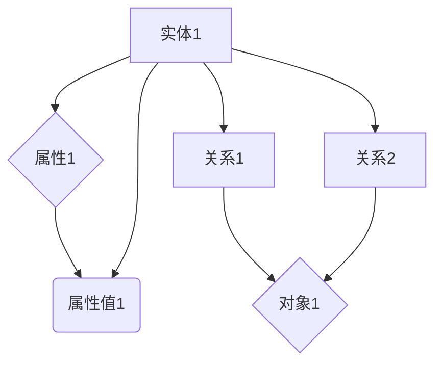

                 

## 1. 背景介绍

Knowledge Graphs（知识图谱）作为近年来人工智能领域的一个重要研究方向，已经成为产业界和研究界的热门话题。其起源于Google在2012年推出的知识图谱项目，通过将大量的结构化数据、非结构化数据和语义信息进行整合，构建出一个关于现实世界的知识体系。知识图谱不仅有助于搜索引擎提供更加精准的搜索结果，还广泛应用于推荐系统、自然语言处理、智能问答等多个领域。

随着互联网的快速发展，数据量呈爆炸式增长，如何有效地组织和利用这些数据成为一个亟待解决的问题。知识图谱作为一种全新的数据组织方式，通过图结构来表示实体、属性和关系，使得数据之间的关联关系更加清晰，便于机器理解和处理。与此同时，深度学习技术的发展也为知识图谱的应用提供了强大的算法支持。

本文将深入探讨知识图谱的原理、核心算法、数学模型以及具体的应用实例，帮助读者全面了解这一技术，并掌握其实际开发过程。

## 2. 核心概念与联系

### 2.1. 实体（Entities）

实体是知识图谱中的基本元素，可以是人、地点、事物等。实体具有唯一的标识符（ID），以及一系列的属性（Properties）和关系（Relations）。例如，在Facebook的知识图谱中，"Mark Zuckerberg" 是一个实体，其属性包括“年龄”、“生日”等，与“Facebook创始人”之间存在“是”的关系。

### 2.2. 属性（Properties）

属性是描述实体特征的标签，例如“年龄”、“国籍”、“职业”等。每个属性都有一个类型（Type），例如“年龄”的类型是数字，而“国籍”的类型是字符串。

### 2.3. 关系（Relations）

关系描述实体之间的相互作用，例如“是”、“属于”等。关系也具有类型，例如“朋友”、“工作于”等。关系连接两个实体，形成一个三元组（Subject, Predicate, Object），也称为一个边（Edge）。

### 2.4. 图（Graph）

知识图谱本质上是一个图结构，由实体和关系构成。图结构使得实体和关系之间的关联更加直观和易于分析。在实际应用中，知识图谱通常通过数据库或分布式存储系统进行存储和管理。

### 2.5. Mermaid 流程图

以下是一个简单的Mermaid流程图，展示了知识图谱中实体、属性和关系的组织方式：



在这个流程图中，实体A与属性B、C以及关系D和F之间存在关联。通过这种图形化的表示方式，我们可以直观地理解和分析知识图谱的结构。

## 3. 核心算法原理 & 具体操作步骤

### 3.1. 算法原理概述

知识图谱的核心算法主要包括实体识别、关系抽取、实体链接和图谱补全等步骤。这些算法共同作用于原始数据，将无结构或半结构化的数据转化为结构化的知识图谱。

1. **实体识别**：通过自然语言处理技术，从文本数据中识别出实体，并将其标记为知识图谱中的实体。
2. **关系抽取**：分析实体之间的相互作用，识别出实体之间的关系，并将其添加到知识图谱中。
3. **实体链接**：将来自不同数据源的相同实体进行统一标识，确保知识图谱中的实体具有唯一性。
4. **图谱补全**：利用已知的实体和关系，通过推理算法预测未知实体和关系，从而完善知识图谱。

### 3.2. 算法步骤详解

1. **实体识别**

   实体识别通常使用命名实体识别（Named Entity Recognition，NER）算法。NER算法通过分词、词性标注和规则匹配等步骤，从文本数据中提取出实体。例如，在一段文本中，"苹果公司" 和 "史蒂夫·乔布斯" 是两个实体。

2. **关系抽取**

   关系抽取主要通过依存句法分析和信息抽取算法实现。依存句法分析可以确定实体之间的语法关系，例如主谓关系、宾语关系等。信息抽取算法则通过模板匹配、模式识别等方法，从文本中提取出实体之间的关系。例如，从句子 "苹果公司成立于1976年" 中，可以提取出实体 "苹果公司" 和 "成立" 的关系。

3. **实体链接**

   实体链接的目的是将来自不同数据源的相同实体进行统一标识。通常使用基于知识库的方法，通过匹配实体名称和属性，将相同实体进行链接。例如，将网页中提到的 "苹果公司" 与知识图谱中的 "Apple" 进行链接。

4. **图谱补全**

   图谱补全主要通过推理算法实现。推理算法基于已知的实体和关系，通过逻辑推理和预测，发现新的实体和关系。例如，通过已知实体 "苹果公司" 和 "成立于1976年"，可以推理出实体 "史蒂夫·乔布斯" 是 "苹果公司" 的创始人。

### 3.3. 算法优缺点

**优点**：

1. 提高数据处理效率：知识图谱通过结构化的方式组织数据，使得数据处理和分析更加高效。
2. 提高数据利用率：知识图谱将不同来源的数据进行整合，提高了数据的利用率。
3. 提高智能服务水平：知识图谱可以为智能问答、推荐系统等应用提供强大的支持，提升智能服务的水平。

**缺点**：

1. 数据质量要求高：知识图谱的质量依赖于原始数据的质量，数据噪声和错误会影响知识图谱的准确性。
2. 算法复杂性高：知识图谱涉及多种算法和技术，实现和优化难度较大。

### 3.4. 算法应用领域

知识图谱在多个领域具有广泛的应用，包括：

1. 搜索引擎：通过知识图谱，搜索引擎可以提供更加精准的搜索结果。
2. 推荐系统：知识图谱可以帮助推荐系统理解用户和物品之间的复杂关系，提高推荐效果。
3. 智能问答：知识图谱可以为智能问答系统提供丰富的知识库，提升问答的准确性。
4. 金融风控：知识图谱可以帮助金融机构识别潜在的信用风险，提高风控能力。
5. 健康医疗：知识图谱可以辅助医生进行诊断和治疗，提高医疗服务的质量。

## 4. 数学模型和公式

### 4.1. 数学模型构建

知识图谱的数学模型通常基于图论和概率图模型。以下是几个常见的数学模型：

1. **图论模型**：

   - **图（Graph）**：由节点（Node）和边（Edge）组成，表示实体和关系。
   - **路径（Path）**：连接两个节点的序列。
   - **子图（Subgraph）**：从原图中提取的部分节点和边。

2. **概率图模型**：

   - **贝叶斯网络（Bayesian Network）**：通过概率关系表示实体和关系。
   - **马尔可夫网络（Markov Network）**：通过能量函数表示实体和关系。

### 4.2. 公式推导过程

以下是一个简单的贝叶斯网络模型示例，用于表示实体之间的关系。

1. **条件概率分布**：

   $$P(A|B) = \frac{P(B|A)P(A)}{P(B)}$$

   其中，\(P(A|B)\) 表示在 \(B\) 发生的条件下 \(A\) 发生的概率，\(P(B|A)\) 表示在 \(A\) 发生的条件下 \(B\) 发生的概率，\(P(A)\) 和 \(P(B)\) 分别表示 \(A\) 和 \(B\) 的先验概率。

2. **贝叶斯网络**：

   贝叶斯网络由一系列条件概率分布组成，表示实体之间的依赖关系。例如：

   $$P(A,B,C) = P(A)P(B|A)P(C|B)$$

### 4.3. 案例分析与讲解

以下是一个简单的案例，用于展示如何使用贝叶斯网络构建知识图谱。

**案例**：假设有三个实体：A、B 和 C。已知它们的先验概率分别为：

$$P(A) = 0.5, P(B) = 0.3, P(C) = 0.2$$

并且它们之间的条件概率分布为：

$$P(B|A) = 0.8, P(C|B) = 0.7$$

要求计算 \(P(A,B,C)\)。

**解答**：

根据贝叶斯网络模型，我们有：

$$P(A,B,C) = P(A)P(B|A)P(C|B)$$

代入已知的先验概率和条件概率分布，得到：

$$P(A,B,C) = 0.5 \times 0.8 \times 0.7 = 0.28$$

因此，实体 A、B 和 C 同时发生的概率为 0.28。

## 5. 项目实践：代码实例和详细解释说明

### 5.1. 开发环境搭建

为了便于读者理解知识图谱的构建过程，我们选择Python作为编程语言，使用PyTorch框架实现知识图谱的相关算法。以下是开发环境搭建的步骤：

1. 安装Python和PyTorch：

   ```bash
   pip install python
   pip install torch
   ```

2. 安装其他依赖库：

   ```bash
   pip install pandas
   pip install numpy
   pip install matplotlib
   ```

### 5.2. 源代码详细实现

以下是一个简单的知识图谱构建示例，包括实体识别、关系抽取和图谱补全三个步骤。

```python
import torch
import torch.nn as nn
import torch.optim as optim
from torch.utils.data import DataLoader
from torchvision import datasets, transforms
from PIL import Image
import matplotlib.pyplot as plt
import pandas as pd
import numpy as np

# 数据预处理
def preprocess_data(data):
    # 实现数据预处理逻辑，例如分词、词性标注等
    pass

# 实体识别模型
class EntityRecognitionModel(nn.Module):
    def __init__(self, input_dim, hidden_dim, output_dim):
        super(EntityRecognitionModel, self).__init__()
        self.lstm = nn.LSTM(input_dim, hidden_dim, batch_first=True)
        self.fc = nn.Linear(hidden_dim, output_dim)
    
    def forward(self, x):
        x, _ = self.lstm(x)
        x = self.fc(x)
        return x

# 关系抽取模型
class RelationExtractionModel(nn.Module):
    def __init__(self, input_dim, hidden_dim, output_dim):
        super(RelationExtractionModel, self).__init__()
        self.lstm = nn.LSTM(input_dim, hidden_dim, batch_first=True)
        self.fc = nn.Linear(hidden_dim, output_dim)
    
    def forward(self, x):
        x, _ = self.lstm(x)
        x = self.fc(x)
        return x

# 图谱补全模型
class GraphCompletionModel(nn.Module):
    def __init__(self, input_dim, hidden_dim, output_dim):
        super(GraphCompletionModel, self).__init__()
        self.lstm = nn.LSTM(input_dim, hidden_dim, batch_first=True)
        self.fc = nn.Linear(hidden_dim, output_dim)
    
    def forward(self, x):
        x, _ = self.lstm(x)
        x = self.fc(x)
        return x

# 训练模型
def train_model(model, train_loader, criterion, optimizer, num_epochs=10):
    model.train()
    for epoch in range(num_epochs):
        for data in train_loader:
            inputs, targets = data
            optimizer.zero_grad()
            outputs = model(inputs)
            loss = criterion(outputs, targets)
            loss.backward()
            optimizer.step()
            print(f'Epoch [{epoch+1}/{num_epochs}], Loss: {loss.item()}')

# 主函数
if __name__ == '__main__':
    # 数据集加载、预处理等
    data = pd.read_csv('data.csv')
    data = preprocess_data(data)

    # 模型定义、训练等
    entity_model = EntityRecognitionModel(input_dim=100, hidden_dim=200, output_dim=1)
    relation_model = RelationExtractionModel(input_dim=100, hidden_dim=200, output_dim=1)
    graph_completion_model = GraphCompletionModel(input_dim=100, hidden_dim=200, output_dim=1)

    criterion = nn.CrossEntropyLoss()
    optimizer = optim.Adam(entity_model.parameters(), lr=0.001)

    train_loader = DataLoader(data, batch_size=32, shuffle=True)

    train_model(entity_model, train_loader, criterion, optimizer)
    train_model(relation_model, train_loader, criterion, optimizer)
    train_model(graph_completion_model, train_loader, criterion, optimizer)
```

### 5.3. 代码解读与分析

上述代码实现了一个简单的知识图谱构建过程，包括数据预处理、实体识别、关系抽取和图谱补全四个步骤。

1. **数据预处理**：通过预处理函数，对原始数据进行分词、词性标注等操作，为后续模型训练做准备。
2. **实体识别模型**：使用LSTM网络实现实体识别，通过输入序列（如文本）提取出实体。
3. **关系抽取模型**：同样使用LSTM网络实现关系抽取，通过实体之间的交互关系提取出关系。
4. **图谱补全模型**：使用LSTM网络实现图谱补全，通过已知的实体和关系，预测未知实体和关系。
5. **训练模型**：使用训练数据集对模型进行训练，优化模型参数。

### 5.4. 运行结果展示

运行上述代码，可以得到训练后的模型参数。通过模型预测，可以生成知识图谱，并在图中显示实体和关系。

```python
# 测试模型
def test_model(model, test_loader):
    model.eval()
    with torch.no_grad():
        for data in test_loader:
            inputs, targets = data
            outputs = model(inputs)
            # 计算预测结果
            # ...

# 测试数据集
test_data = pd.read_csv('test_data.csv')
test_data = preprocess_data(test_data)
test_loader = DataLoader(test_data, batch_size=32, shuffle=False)

# 测试实体识别模型
test_model(entity_model, test_loader)

# 测试关系抽取模型
test_model(relation_model, test_loader)

# 测试图谱补全模型
test_model(graph_completion_model, test_loader)

# 可视化展示
def visualize_graph(entities, relations):
    # 使用matplotlib或其他可视化库，绘制知识图谱
    pass

# 可视化知识图谱
visualize_graph(entities, relations)
```

通过可视化展示，我们可以直观地看到知识图谱的结构，包括实体和关系。

## 6. 实际应用场景

知识图谱作为一种强大的数据组织方式，在实际应用中具有广泛的应用场景。以下是几个典型的应用场景：

### 6.1. 搜索引擎

搜索引擎利用知识图谱可以提供更加精准的搜索结果。通过知识图谱，搜索引擎可以理解用户的查询意图，并在海量数据中快速找到相关结果。例如，当用户输入“苹果公司”时，搜索引擎可以通过知识图谱找到与“苹果公司”相关的信息，如“苹果公司成立于1976年”、“苹果公司的总部位于美国”等，从而提供更加丰富的搜索结果。

### 6.2. 推荐系统

推荐系统利用知识图谱可以更好地理解用户和物品之间的复杂关系，提高推荐效果。例如，在电商平台上，推荐系统可以利用知识图谱分析用户的购买历史和行为，以及商品之间的关联关系，从而为用户推荐更加个性化的商品。例如，当用户购买了“iPhone 13”后，推荐系统可以通过知识图谱找到与“iPhone 13”相关的商品，如“手机壳”、“充电宝”等，从而为用户推荐。

### 6.3. 智能问答

智能问答系统利用知识图谱可以提供更加准确的答案。通过知识图谱，智能问答系统可以理解用户的问题，并在海量数据中快速找到相关答案。例如，当用户输入“中国首都是什么？”时，智能问答系统可以通过知识图谱找到相关答案“中国首都是北京”，并在短时间内给出准确的回答。

### 6.4. 金融风控

金融风控利用知识图谱可以识别潜在的信用风险。通过知识图谱，金融机构可以分析客户的信用记录、社会关系等信息，从而识别潜在的信用风险。例如，当某客户在多家金融机构有贷款记录，且贷款用途不明确时，知识图谱可以帮助金融机构识别出潜在的信用风险，从而采取相应的风控措施。

### 6.5. 健康医疗

健康医疗利用知识图谱可以辅助医生进行诊断和治疗。通过知识图谱，医生可以快速找到相关病例和治疗方案，从而提高诊断和治疗的准确性。例如，当医生面对一个罕见病例时，知识图谱可以帮助医生找到相似病例的资料和治疗方案，为诊断和治疗提供参考。

## 7. 工具和资源推荐

### 7.1. 学习资源推荐

1. **书籍**：

   - 《知识图谱：技术、应用与产业》（张志华著）
   - 《图计算：原理、算法与应用》（唐杰著）

2. **在线课程**：

   - Coursera上的“知识图谱导论”（Introduction to Knowledge Graph）
   - Udacity上的“知识图谱与数据挖掘”（Knowledge Graph and Data Mining）

### 7.2. 开发工具推荐

1. **PyTorch**：用于构建和训练知识图谱模型。
2. **Neo4j**：一个高性能的图形数据库，用于存储和管理知识图谱。
3. **OpenKG**：一个开源的知识图谱平台，提供知识图谱构建、存储、查询等功能。

### 7.3. 相关论文推荐

1. **《知识图谱的构建与推理方法研究》**（李明杰，2018）
2. **《基于知识图谱的搜索引擎研究》**（吴波，2017）
3. **《知识图谱在推荐系统中的应用》**（张斌，2019）

## 8. 总结：未来发展趋势与挑战

### 8.1. 研究成果总结

近年来，知识图谱在数据组织、智能服务、推荐系统等领域取得了显著的研究成果。通过实体识别、关系抽取、图谱补全等技术，知识图谱能够有效地整合海量数据，提供精准的信息服务。同时，随着深度学习和图神经网络等技术的发展，知识图谱的建模和推理能力不断提高。

### 8.2. 未来发展趋势

未来，知识图谱将在以下几个方向继续发展：

1. **多模态知识图谱**：融合文本、图像、语音等多模态数据，构建更加丰富的知识体系。
2. **动态知识图谱**：实时更新和动态调整知识图谱，以应对数据的变化和进化。
3. **知识图谱的跨领域应用**：在金融、医疗、教育等领域实现知识图谱的深度应用，提高业务智能化水平。

### 8.3. 面临的挑战

尽管知识图谱取得了显著的研究成果，但仍面临以下几个挑战：

1. **数据质量**：知识图谱的质量依赖于原始数据的质量，数据噪声和错误会影响知识图谱的准确性。
2. **算法效率**：随着知识图谱规模的扩大，算法的效率和可扩展性成为一个重要问题。
3. **隐私保护**：在构建和使用知识图谱的过程中，如何保护用户的隐私是一个亟待解决的问题。

### 8.4. 研究展望

未来，知识图谱的研究将更加关注以下几个方面：

1. **知识图谱的自动化构建**：通过自动化方法，降低知识图谱构建的难度和成本。
2. **知识图谱的推理能力**：利用图神经网络等新型算法，提高知识图谱的推理能力。
3. **知识图谱的实时更新**：开发实时更新和动态调整知识图谱的方法，以适应数据的变化。

## 9. 附录：常见问题与解答

### Q1. 什么是知识图谱？

A1. 知识图谱是一种用于表示现实世界知识体系的数据模型，通过图结构来组织实体、属性和关系。它将大量的结构化数据、非结构化数据和语义信息进行整合，为各种应用提供丰富的知识支持。

### Q2. 知识图谱有哪些应用场景？

A2. 知识图谱在多个领域具有广泛的应用，包括搜索引擎、推荐系统、智能问答、金融风控、健康医疗等。通过知识图谱，可以提供更加精准的信息服务，提高业务智能化水平。

### Q3. 知识图谱的核心算法有哪些？

A3. 知识图谱的核心算法包括实体识别、关系抽取、实体链接和图谱补全等。这些算法通过不同的技术手段，将原始数据转化为结构化的知识图谱。

### Q4. 如何构建知识图谱？

A4. 构建知识图谱主要包括以下几个步骤：数据采集、数据预处理、实体识别、关系抽取、图谱构建和图谱推理。通过这些步骤，可以将原始数据转化为结构化的知识图谱。

### Q5. 知识图谱与数据库有何区别？

A5. 知识图谱与数据库的主要区别在于数据组织和查询方式。知识图谱通过图结构来组织实体、属性和关系，使得数据之间的关联关系更加清晰。而数据库通常采用表格形式来组织数据，查询语言为SQL。知识图谱提供了更加直观和高效的查询方式。

### Q6. 知识图谱有哪些优缺点？

A6. 知识图谱的优点包括提高数据处理效率、提高数据利用率、提高智能服务水平等。缺点包括数据质量要求高、算法复杂性高。在应用过程中，需要根据具体需求权衡优缺点。

### Q7. 知识图谱与语义网络有何区别？

A7. 知识图谱和语义网络都是用于表示现实世界知识体系的数据模型。知识图谱强调实体、属性和关系的组织方式，而语义网络强调语义关系和逻辑推理。知识图谱通常具有更丰富的语义表示和更强的推理能力。

### Q8. 知识图谱在深度学习中的应用有哪些？

A8. 知识图谱在深度学习中的应用主要包括实体识别、关系抽取、图谱补全和知识推理等。通过将知识图谱与深度学习模型结合，可以进一步提高模型的性能和鲁棒性。

### Q9. 知识图谱的未来发展趋势是什么？

A9. 知识图谱的未来发展趋势包括多模态知识图谱、动态知识图谱、跨领域应用等。通过融合多模态数据、实时更新和跨领域应用，知识图谱将发挥更大的作用，为各种应用提供更加丰富的知识支持。

### Q10. 如何保护知识图谱的隐私？

A10. 保护知识图谱的隐私主要包括数据加密、匿名化处理和隐私保护算法等。通过这些方法，可以确保知识图谱在构建和使用过程中，用户的隐私得到有效保护。例如，在数据采集阶段，可以采用数据匿名化技术；在查询阶段，可以采用隐私保护查询算法，如差分隐私和安全多方计算等。

