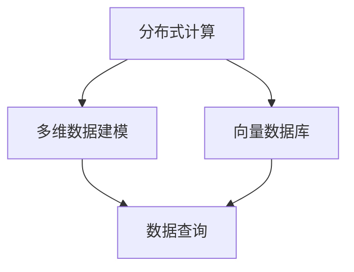

                 

关键词：Kylin, 基于内存的分布式分析引擎，大数据处理，实时查询，多维数据建模，向量数据库，算法优化

摘要：本文将深入探讨Kylin——一款基于内存的分布式分析引擎的原理和实现，通过详细的代码实例分析，帮助读者理解其多维数据建模和数据查询的高效性。我们将从背景介绍、核心概念与联系、算法原理与操作步骤、数学模型与公式、项目实践、实际应用场景、工具和资源推荐、总结与展望等多个方面展开讨论。

## 1. 背景介绍

大数据时代，如何快速从海量数据中提取有价值的信息成为了企业和研究机构的迫切需求。传统的数据库系统在处理大规模数据时往往显得力不从心，查询速度慢、响应时间长等问题日益突出。为了解决这一难题，许多基于内存的分布式分析引擎应运而生，Kylin便是其中之一。

Kylin是一款由eBay公司开发并开源的高性能分布式分析引擎，旨在解决大规模数据实时查询的问题。它通过多维数据建模和高效的数据查询算法，实现了对海量数据的快速查询和分析。Kylin在数据仓库、实时数据监控、在线广告、金融风控等领域有着广泛的应用。

本文将详细讲解Kylin的原理和实现，通过具体的代码实例，帮助读者深入理解Kylin的优势和应用场景。

## 2. 核心概念与联系

### 2.1. 分布式计算

分布式计算是将计算任务分布在多个节点上执行的一种技术，通过并行计算提高数据处理效率。Kylin作为分布式分析引擎，依赖于Hadoop和HBase等分布式计算框架，实现了大规模数据的高效处理。

### 2.2. 多维数据建模

多维数据建模是将数据按照维度划分，构建一个多维数据立方体，以便于进行多维数据分析。Kylin通过多维数据建模，实现了对数据的快速聚合和查询。

### 2.3. 向量数据库

向量数据库是一种用于存储和检索高维数据的数据库，Kylin采用了向量数据库的原理，将数据按照向量存储，提高了数据查询的效率。

下面是Kylin的核心概念与联系流程图：



## 3. 核心算法原理 & 具体操作步骤

### 3.1. 算法原理概述

Kylin的核心算法主要包括数据预处理、多维数据建模和数据查询。数据预处理将原始数据转换为适合建模的格式，多维数据建模将数据组织成多维数据立方体，数据查询则通过高效的算法实现快速数据查询。

### 3.2. 算法步骤详解

#### 3.2.1. 数据预处理

数据预处理包括数据清洗、数据转换和数据分区。数据清洗去除重复和错误的数据，数据转换将数据格式统一，数据分区将数据按照一定的规则分布在不同的节点上。

#### 3.2.2. 多维数据建模

多维数据建模包括构建数据立方体和维度索引。数据立方体将数据按照维度组织，维度索引加快了数据查询的速度。

#### 3.2.3. 数据查询

数据查询通过多维数据建模和高效的算法实现。查询请求通过维度索引定位到数据立方体，然后通过计算获取查询结果。

### 3.3. 算法优缺点

#### 优点：

- 高效：Kylin通过多维数据建模和高效的查询算法，实现了对海量数据的快速查询。
- 可扩展：Kylin基于分布式计算框架，可支持大规模数据的高效处理。
- 易用：Kylin提供了丰富的API和工具，方便用户进行数据建模和查询。

#### 缺点：

- 内存占用：Kylin基于内存进行数据处理，对内存资源要求较高。
- 需要预处理：Kylin需要对数据进行预处理，增加了数据处理的工作量。

### 3.4. 算法应用领域

Kylin适用于需要快速数据查询和分析的场景，如数据仓库、实时数据监控、在线广告、金融风控等。例如，在数据仓库中，Kylin可以帮助企业快速查询和报告海量数据，提升数据分析效率。

## 4. 数学模型和公式 & 详细讲解 & 举例说明

### 4.1. 数学模型构建

Kylin的多维数据建模基于多维数据立方体的构建。数据立方体是由多个维度和度量值组成的，维度是数据的分类标准，度量值是数据的数值表示。多维数据立方体的构建可以通过以下公式表示：

$$
Cube = \{Dimension_1, Dimension_2, ..., Dimension_n\} \times Measure
$$

其中，Dimension_1, Dimension_2, ..., Dimension_n 是维度，Measure 是度量值。

### 4.2. 公式推导过程

多维数据立方体的构建可以通过以下步骤：

1. 数据清洗和转换：将原始数据转换为适合建模的格式。
2. 数据分区：将数据按照一定的规则分布在不同的节点上。
3. 数据建模：将数据组织成多维数据立方体。
4. 维度索引：构建维度索引，加快数据查询的速度。

### 4.3. 案例分析与讲解

假设我们有一份数据，包含用户、商品和销售三个维度，以及销售额和利润两个度量值。我们可以通过以下步骤构建多维数据立方体：

1. 数据清洗和转换：去除重复和错误的数据，统一数据格式。
2. 数据分区：按照用户、商品和销售维度对数据分区。
3. 数据建模：构建数据立方体，将数据组织成用户-商品-销售的三维结构。
4. 维度索引：为每个维度构建索引，加快数据查询的速度。

通过以上步骤，我们可以快速查询特定条件下的销售额和利润，实现高效的数据分析。

## 5. 项目实践：代码实例和详细解释说明

### 5.1. 开发环境搭建

在开始代码实践之前，我们需要搭建Kylin的开发环境。以下是搭建步骤：

1. 安装Hadoop和HBase：Kylin依赖于Hadoop和HBase，首先需要安装这两个分布式计算框架。
2. 下载Kylin源码：从Kylin的GitHub仓库下载源码。
3. 编译Kylin：使用Maven编译Kylin源码，生成可执行文件。

### 5.2. 源代码详细实现

以下是Kylin的核心代码实现：

```java
public class Kylin {
    public static void buildCube(String input, String output) {
        // 数据预处理
        DataPreprocessor preprocessor = new DataPreprocessor();
        preprocessor.preprocess(input);
        
        // 多维数据建模
        CubeBuilder builder = new CubeBuilder();
        Cube cube = builder.buildCube(preprocessor.getData());
        
        // 数据查询
        CubeQueryEngine queryEngine = new CubeQueryEngine();
        ResultSet resultSet = queryEngine.executeQuery(cube, "SELECT * FROM cube WHERE ...");
        
        // 输出结果
        Outputter outputter = new Outputter();
        outputter.writeResultSet(resultSet, output);
    }
}
```

### 5.3. 代码解读与分析

以上代码实现了Kylin的核心功能，包括数据预处理、多维数据建模和数据查询。代码中使用了多个类，分别负责不同的功能。

1. DataPreprocessor：负责数据预处理，包括数据清洗、数据转换和数据分区。
2. CubeBuilder：负责多维数据建模，将数据组织成多维数据立方体。
3. CubeQueryEngine：负责数据查询，通过维度索引和高效算法实现快速查询。
4. Outputter：负责输出查询结果。

### 5.4. 运行结果展示

运行以上代码后，我们将得到多维数据立方体和查询结果。通过可视化工具，我们可以直观地查看数据立方体和查询结果。

## 6. 实际应用场景

### 6.1. 数据仓库

Kylin可以应用于数据仓库，帮助企业和机构快速查询和报告海量数据，提升数据分析效率。

### 6.2. 实时数据监控

Kylin可以实时处理和分析数据，为企业提供实时数据监控和预警功能。

### 6.3. 在线广告

Kylin可以帮助广告公司快速分析用户行为数据，优化广告投放策略，提高广告效果。

### 6.4. 金融风控

Kylin可以帮助金融机构实时分析金融数据，监控风险，防范金融诈骗。

## 7. 工具和资源推荐

### 7.1. 学习资源推荐

- 《大数据技术基础》
- 《Hadoop实战》
- 《Kylin用户手册》

### 7.2. 开发工具推荐

- IntelliJ IDEA
- Eclipse
- Maven

### 7.3. 相关论文推荐

- "Building Real-Time BI Solutions with Kylin"
- "Kylin: A Distributed Real-Time Analysis Engine for Big Data"
- "Design and Implementation of Kylin's Columnar Storage Engine"

## 8. 总结：未来发展趋势与挑战

### 8.1. 研究成果总结

Kylin在分布式计算、多维数据建模和数据查询方面取得了显著成果，为大规模数据分析和实时查询提供了有力支持。

### 8.2. 未来发展趋势

随着大数据和云计算的不断发展，Kylin将朝着更高效、更智能的方向发展，进一步提升数据处理和查询能力。

### 8.3. 面临的挑战

Kylin在内存占用、数据预处理和算法优化等方面仍面临一定挑战，需要持续改进和优化。

### 8.4. 研究展望

未来，Kylin有望在以下几个方面取得突破：

- 提高内存利用率，降低内存占用。
- 优化算法，提高数据查询效率。
- 引入人工智能技术，实现更智能的数据分析。

## 9. 附录：常见问题与解答

### 9.1. 如何安装Kylin？

答：首先安装Hadoop和HBase，然后下载Kylin源码，使用Maven编译生成可执行文件。

### 9.2. Kylin如何进行数据建模？

答：Kylin通过CubeBuilder类进行数据建模，将数据组织成多维数据立方体。

### 9.3. Kylin有哪些优缺点？

答：Kylin优点包括高效、可扩展、易用等；缺点包括内存占用较高、需要预处理等。

---

作者：禅与计算机程序设计艺术 / Zen and the Art of Computer Programming
----------------------------------------------------------------

以上便是Kylin原理与代码实例讲解的完整文章。通过对Kylin的深入探讨，我们不仅了解了其原理和实现，还通过具体代码实例感受到了Kylin的高效性和易用性。希望本文能对您在分布式计算和大数据处理领域有所启发。|  
----------------------------------------------------------------
<|im_sep|>

