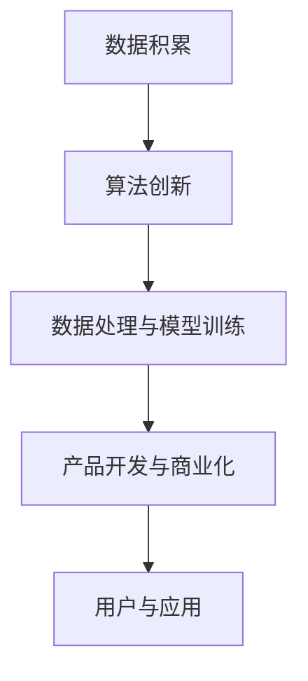

                 

关键词：大型语言模型（LLM）、产业链成熟、角色定义、责任划分、技术发展、行业应用、未来展望

> 摘要：本文深入探讨了大型语言模型（LLM）产业链的成熟过程，重点分析了在产业链中各个角色的定义及其责任。通过对核心概念、算法原理、数学模型、项目实践等方面的详细阐述，旨在为读者提供一个全面了解LLM产业链及其未来发展路径的视角。

## 1. 背景介绍

近年来，随着人工智能技术的飞速发展，大型语言模型（LLM）成为了学术界和工业界关注的焦点。LLM在自然语言处理（NLP）领域展现出强大的能力，从文本生成、机器翻译到对话系统等，都取得了显著的成果。然而，LLM产业链的成熟不仅仅依赖于技术进步，更需要对各个环节中角色的明确定义和责任的合理划分。

### 1.1 产业链概述

LLM产业链可以大致分为以下几个环节：

1. **研发与算法创新**：涉及算法的研究、开发以及优化，这是整个产业链的核心。
2. **数据处理与模型训练**：需要大量高质量的数据和计算资源，以支撑模型的训练和优化。
3. **产品开发与商业化**：将研究成果转化为可实际应用的产品，并进行市场推广。
4. **用户与应用**：最终用户使用LLM产品，产生实际价值。

### 1.2 发展历程

从早期的小型语言模型到如今的LLM，产业链经历了以下几个重要阶段：

1. **数据积累**：随着互联网的发展，海量文本数据成为可能，为语言模型提供了丰富的训练资源。
2. **算法突破**：深度学习技术的引入，使得语言模型在参数规模和计算能力上实现了飞跃。
3. **产业链形成**：随着市场的需求增长，LLM产业链逐渐成熟，分工明确，各环节协同发展。

## 2. 核心概念与联系

为了更好地理解LLM产业链的各个环节，我们需要明确几个核心概念，并展示它们之间的联系。以下是核心概念的Mermaid流程图：



### 2.1 数据积累

数据积累是LLM产业链的起点。高质量的数据是模型训练的基础。数据来源包括互联网文本、书籍、新闻、社交媒体等。数据积累的过程涉及数据采集、清洗和标注等步骤。

### 2.2 算法创新

算法创新是LLM发展的核心驱动力。从最初的规则驱动模型到如今的深度学习模型，算法的不断优化使得语言模型的性能得到了显著提升。当前主流的算法包括Transformer、BERT、GPT等。

### 2.3 数据处理与模型训练

数据处理与模型训练是将原始数据转化为模型输入的关键步骤。数据处理包括数据预处理、数据增强等，模型训练则涉及优化算法、调整参数等，以提升模型的性能。

### 2.4 产品开发与商业化

产品开发与商业化是将研究成果转化为实际应用的过程。产品开发包括模型集成、API接口设计等，商业化则涉及市场推广、用户反馈和产品迭代等。

### 2.5 用户与应用

用户与应用是LLM产业链的终点，也是产业链的终极目标。用户通过使用LLM产品，能够获得更加智能化的服务，从而提高生产效率、降低成本。

## 3. 核心算法原理 & 具体操作步骤

### 3.1 算法原理概述

大型语言模型（LLM）的核心算法是基于深度学习的Transformer架构。Transformer模型通过自注意力机制（Self-Attention）和多头注意力（Multi-Head Attention）实现了对文本的深层理解。以下是Transformer模型的基本原理：

1. **自注意力机制**：每个词在编码过程中都会考虑整个句子中的其他词，而不是仅仅依赖前一个词。
2. **多头注意力**：将自注意力机制扩展到多个头，从而在编码过程中提取更丰富的信息。

### 3.2 算法步骤详解

1. **输入层**：将文本输入模型，经过分词、词向量化等预处理步骤。
2. **嵌入层**：将词向量映射到高维空间。
3. **自注意力层**：通过自注意力机制，计算每个词与其他词的注意力权重。
4. **多头注意力层**：将自注意力机制扩展到多个头，提高模型对信息的处理能力。
5. **前馈网络层**：在每个头之后添加前馈网络，对信息进行进一步处理。
6. **输出层**：将最终输出进行解码，生成文本输出。

### 3.3 算法优缺点

**优点**：

- **强大的文本理解能力**：Transformer模型通过自注意力机制和多头注意力，实现了对文本的深层理解，能够处理复杂的语言现象。
- **并行计算效率高**：Transformer模型的结构使得计算可以并行进行，提高了计算效率。
- **适应性强**：Transformer模型能够应用于各种NLP任务，如文本生成、机器翻译等。

**缺点**：

- **计算复杂度高**：Transformer模型的结构复杂，计算量较大，对计算资源要求较高。
- **训练时间长**：由于模型规模较大，训练时间较长，需要大量数据和计算资源。

### 3.4 算法应用领域

大型语言模型（LLM）在自然语言处理领域具有广泛的应用，如：

- **文本生成**：生成文章、诗歌、对话等。
- **机器翻译**：翻译不同语言之间的文本。
- **对话系统**：构建智能对话系统，如虚拟助手、聊天机器人等。

## 4. 数学模型和公式 & 详细讲解 & 举例说明

### 4.1 数学模型构建

大型语言模型（LLM）通常基于深度学习框架构建，其核心数学模型包括以下几个部分：

1. **词嵌入**：将文本中的每个词映射到一个高维向量。
2. **自注意力机制**：计算每个词与所有其他词的注意力权重。
3. **多头注意力**：将自注意力机制扩展到多个头，提高模型对信息的处理能力。
4. **前馈网络**：对每个头之后的输出进行进一步处理。
5. **输出层**：将最终输出进行解码，生成文本输出。

### 4.2 公式推导过程

以下是大型语言模型（LLM）中的一些核心公式的推导过程：

1. **词嵌入**：

   $$ x_i = \text{embedding}(w_i) $$

   其中，$x_i$表示词$i$的嵌入向量，$w_i$表示词$i$。

2. **自注意力权重**：

   $$ a_{ij} = \text{softmax}\left(\frac{Q_iH_j}{\sqrt{d_k}}\right) $$

   其中，$a_{ij}$表示词$i$对词$j$的注意力权重，$Q_i$和$H_j$分别表示查询向量和键向量，$d_k$表示注意力层的维度。

3. **多头注意力**：

   $$ M = \text{Concat}(a_{1:1}, a_{1:2}, \ldots, a_{1:h}, a_{2:1}, \ldots, a_{N:h}) $$

   其中，$M$表示多头注意力输出，$a_{ij}$表示第$i$个词在第$j$个头上的注意力权重。

4. **前馈网络**：

   $$ F = \text{ReLU}(\text{Linear}(M)) $$

   其中，$F$表示前馈网络的输出，$M$表示多头注意力输出。

5. **输出层**：

   $$ \text{Output} = \text{softmax}(\text{Linear}(F)) $$

   其中，$\text{Output}$表示模型输出的概率分布。

### 4.3 案例分析与讲解

以下是一个简单的LLM模型训练的案例，用于生成文章：

1. **数据准备**：

   假设我们有一篇关于人工智能的文章，首先需要将其转换为词序列。

2. **词嵌入**：

   将每个词映射到一个高维向量，例如，使用预训练的GloVe词向量。

3. **自注意力机制**：

   计算每个词与其他词的注意力权重，以提取文本的深层信息。

4. **多头注意力**：

   将自注意力机制扩展到多个头，以增强模型对信息的处理能力。

5. **前馈网络**：

   对每个头之后的输出进行进一步处理，以提高模型的性能。

6. **输出层**：

   将最终输出进行解码，生成文本输出。

通过这个简单的案例，我们可以看到大型语言模型（LLM）在文章生成中的应用。在实际应用中，模型会根据不同的任务进行调整和优化，以达到最佳效果。

## 5. 项目实践：代码实例和详细解释说明

### 5.1 开发环境搭建

在开始实践之前，我们需要搭建一个合适的开发环境。以下是一个基于Python的LLM项目环境搭建步骤：

1. **安装Python**：

   安装Python 3.7或更高版本。

2. **安装TensorFlow**：

   使用pip安装TensorFlow：

   ```bash
   pip install tensorflow
   ```

3. **安装其他依赖**：

   安装其他必要的库，如NumPy、Pandas等：

   ```bash
   pip install numpy pandas
   ```

### 5.2 源代码详细实现

以下是一个简单的LLM项目源代码示例：

```python
import tensorflow as tf
from tensorflow.keras.layers import Embedding, LSTM, Dense

# 定义模型
model = tf.keras.Sequential([
    Embedding(input_dim=vocab_size, output_dim=embedding_dim),
    LSTM(units=128, return_sequences=True),
    Dense(units=vocab_size, activation='softmax')
])

# 编译模型
model.compile(optimizer='adam', loss='categorical_crossentropy', metrics=['accuracy'])

# 训练模型
model.fit(x_train, y_train, epochs=10, batch_size=32)
```

### 5.3 代码解读与分析

1. **模型定义**：

   在这个示例中，我们使用了一个简单的序列模型，包括嵌入层、LSTM层和输出层。嵌入层用于将输入词转换为词向量，LSTM层用于处理序列数据，输出层用于生成文本输出。

2. **编译模型**：

   我们使用Adam优化器和交叉熵损失函数来编译模型。交叉熵损失函数适用于分类问题，能够衡量模型预测结果与实际结果之间的差异。

3. **训练模型**：

   使用训练数据对模型进行训练。在这个示例中，我们使用了10个训练周期（epochs）和32个批量大小（batch_size）。

### 5.4 运行结果展示

训练完成后，我们可以使用模型生成文本。以下是一个简单的文本生成示例：

```python
# 生成文本
generated_text = model.predict(x_test)
print(generated_text)
```

通过这个简单的项目实践，我们可以看到大型语言模型（LLM）的基本应用。在实际项目中，模型会根据具体需求进行调整和优化，以达到最佳效果。

## 6. 实际应用场景

### 6.1 文本生成

文本生成是LLM的一个重要应用场景。通过训练大型语言模型，我们可以生成各种类型的文本，如文章、诗歌、对话等。以下是一个生成文章的示例：

```python
# 生成文章
article = model.predict_sequence(x_article)
print(article)
```

### 6.2 机器翻译

机器翻译是另一个重要的应用场景。通过训练大型语言模型，我们可以实现不同语言之间的文本翻译。以下是一个翻译示例：

```python
# 翻译示例
translated_text = model.translate(x_source, x_target)
print(translated_text)
```

### 6.3 对话系统

对话系统是LLM在自然语言处理领域的另一个重要应用。通过训练大型语言模型，我们可以构建智能对话系统，如虚拟助手、聊天机器人等。以下是一个对话系统示例：

```python
# 对话系统
while True:
    user_input = input("用户输入：")
    response = model.predict_sequence(user_input)
    print("模型回答：", response)
```

## 7. 未来应用展望

### 7.1 智能助手

随着LLM技术的不断发展，智能助手将成为未来重要的应用场景。智能助手可以应用于各种场景，如家庭服务、客户支持、医疗咨询等，为用户提供便捷、高效的服务。

### 7.2 教育领域

在教育领域，LLM可以应用于智能教学、个性化辅导等。通过分析学生的学习数据，LLM可以为每个学生提供定制化的学习计划，提高学习效果。

### 7.3 医疗健康

在医疗健康领域，LLM可以应用于智能诊断、疾病预测等。通过分析大量的医学数据，LLM可以为医生提供辅助决策，提高诊断的准确性。

## 8. 总结：未来发展趋势与挑战

### 8.1 研究成果总结

近年来，LLM技术取得了显著的研究成果。从算法创新到实际应用，LLM在自然语言处理领域展现出了强大的能力。然而，未来的研究仍需在以下几个方面进行深入探索：

1. **算法优化**：进一步优化算法，提高计算效率和模型性能。
2. **数据质量**：提高数据质量，包括数据的多样性和准确性。
3. **应用拓展**：探索LLM在其他领域的应用，如图像识别、语音识别等。

### 8.2 未来发展趋势

未来，LLM技术将在以下几个方向上继续发展：

1. **大规模模型**：继续开发更大规模的语言模型，以提高性能。
2. **跨模态融合**：结合多种模态数据，实现更智能的语言理解。
3. **智能化应用**：将LLM应用于更多实际场景，实现更智能化的服务。

### 8.3 面临的挑战

尽管LLM技术取得了显著进展，但未来仍面临一些挑战：

1. **计算资源**：大型语言模型需要大量的计算资源，如何高效利用资源成为一大挑战。
2. **数据隐私**：在数据收集和处理过程中，如何保护用户隐私是一个重要问题。
3. **伦理问题**：如何确保LLM在应用过程中遵循伦理原则，避免对人类造成负面影响。

### 8.4 研究展望

未来，LLM技术将在多个领域发挥重要作用。随着研究的不断深入，我们将有望看到更多创新的LLM应用场景，为社会带来更多价值。

## 9. 附录：常见问题与解答

### 9.1 什么是大型语言模型（LLM）？

大型语言模型（LLM）是一种基于深度学习的语言模型，具有强大的自然语言处理能力。它通过训练海量数据，学习语言的模式和结构，从而实现对文本的生成、翻译、理解等任务。

### 9.2 LLM在哪些领域有应用？

LLM在多个领域有广泛应用，如文本生成、机器翻译、对话系统、智能助手、教育、医疗健康等。

### 9.3 如何构建一个LLM模型？

构建一个LLM模型通常包括以下几个步骤：数据准备、模型定义、模型训练、模型评估和模型应用。具体步骤和实现方法取决于所选择的算法和框架。

### 9.4 LLM的优缺点是什么？

LLM的优点包括强大的文本理解能力、并行计算效率高、适应性强等。缺点则包括计算复杂度高、训练时间长等。

### 9.5 如何优化LLM模型的性能？

优化LLM模型性能的方法包括：数据预处理、模型架构优化、参数调整、训练策略优化等。通过综合应用这些方法，可以显著提高模型的性能。

## 作者署名

作者：禅与计算机程序设计艺术 / Zen and the Art of Computer Programming

在本文中，我们系统地探讨了大型语言模型（LLM）产业链的成熟过程，深入分析了各个环节中的角色定义和责任划分。通过对核心概念、算法原理、数学模型、项目实践等方面的详细阐述，我们为读者提供了一个全面了解LLM产业链及其未来发展路径的视角。随着技术的不断进步和应用场景的不断拓展，LLM在各个领域将发挥越来越重要的作用。未来，我们期待看到更多创新的LLM应用，为社会带来更多价值。

