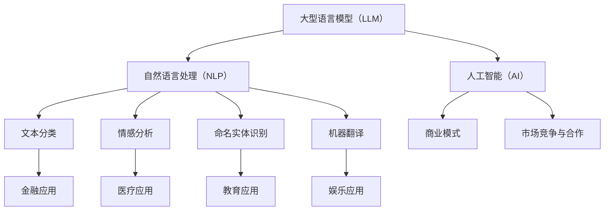

                 

关键词：大型语言模型、市场竞争、技术合作、行业发展、商业策略

> 摘要：本文将深入探讨大型语言模型（LLM）市场的发展现状，分析市场竞争格局及合作模式。从技术趋势、商业模式、市场潜力等方面，探讨LLM市场未来的发展趋势与挑战，为相关从业者和投资者提供有价值的参考。

## 1. 背景介绍

随着人工智能技术的快速发展，大型语言模型（LLM）在自然语言处理（NLP）领域取得了显著的突破。LLM作为一种基于深度学习的模型，能够处理大规模语料库，生成高质量的自然语言文本，从而在问答系统、机器翻译、文本摘要、文本生成等领域取得了广泛应用。随着技术的不断成熟和市场的逐渐成熟，LLM市场正在迎来快速发展的机遇期。

当前，LLM市场呈现出以下几个特点：

1. **市场规模扩大**：随着人工智能技术的广泛应用，LLM市场的需求不断增长。根据市场研究机构的预测，全球LLM市场规模将在未来几年内持续扩大。

2. **竞争激烈**：随着越来越多的大型科技公司、初创企业和学术机构加入LLM研发和应用，市场竞争日趋激烈。各大公司纷纷推出各自的LLM产品，争夺市场份额。

3. **技术进步**：在模型架构、训练算法、数据集质量等方面，LLM技术不断取得突破。这不仅提高了模型的性能，也为市场创新提供了更多可能。

4. **应用领域广泛**：LLM在各个行业的应用场景不断拓展，从金融、医疗、教育到娱乐等领域，都涌现出大量的应用案例。这进一步推动了市场的增长。

## 2. 核心概念与联系

为了更好地理解LLM市场的竞争和协作，首先需要了解一些核心概念及其相互关系。

### 2.1. 大型语言模型（LLM）

LLM是一种基于深度学习的自然语言处理模型，能够处理大规模的语料库，生成高质量的自然语言文本。LLM通常由多层神经网络组成，通过训练学习语言的规律和特征。

### 2.2. 自然语言处理（NLP）

NLP是人工智能的一个重要分支，旨在使计算机能够理解、处理和生成自然语言。NLP技术包括文本分类、情感分析、命名实体识别、机器翻译等。

### 2.3. 人工智能（AI）

AI是模拟、延伸和扩展人类智能的理论、方法、技术及应用。AI技术包括机器学习、深度学习、自然语言处理、计算机视觉等。

### 2.4. 商业模式

商业模式是指企业通过产品或服务创造、传递和获取价值的基本机制。在LLM市场中，商业模式包括产品销售、服务订阅、广告收入、数据采集等。

### 2.5. 市场竞争与合作

市场竞争和协作是LLM市场的两个重要方面。在竞争中，企业通过创新、优化技术、拓展应用场景等方式争夺市场份额。而在合作中，企业通过共享资源、技术合作、战略联盟等方式实现互利共赢。

### 2.6. Mermaid 流程图

为了更直观地展示LLM市场的核心概念及其相互关系，我们可以使用Mermaid流程图。以下是一个简化的Mermaid流程图示例：



## 3. 核心算法原理 & 具体操作步骤

### 3.1. 算法原理概述

LLM的核心算法是基于深度学习的序列到序列（Seq2Seq）模型。Seq2Seq模型由编码器（Encoder）和解码器（Decoder）两个部分组成。编码器将输入序列转换为固定长度的编码表示，解码器则根据编码表示生成输出序列。

### 3.2. 算法步骤详解

1. **数据准备**：收集并预处理大规模的文本数据，包括清洗、分词、去停用词等。

2. **编码器训练**：使用预处理的文本数据训练编码器，将输入序列编码为固定长度的向量表示。

3. **解码器训练**：使用编码器生成的向量表示训练解码器，将向量表示解码为输出序列。

4. **模型优化**：通过反向传播和梯度下降等优化算法，不断调整模型参数，提高模型性能。

5. **文本生成**：输入待生成的文本，通过编码器和解码器生成对应的文本输出。

### 3.3. 算法优缺点

**优点**：

1. **强大性能**：LLM能够处理大规模语料库，生成高质量的自然语言文本。

2. **多语言支持**：LLM可以支持多种语言，实现跨语言文本生成。

3. **灵活应用**：LLM可以应用于多种自然语言处理任务，如问答系统、机器翻译、文本摘要等。

**缺点**：

1. **计算资源消耗**：LLM模型的训练和推理需要大量的计算资源。

2. **数据依赖性**：LLM的性能很大程度上依赖于数据的质量和数量。

### 3.4. 算法应用领域

LLM在自然语言处理领域有广泛的应用，以下是一些主要的应用领域：

1. **问答系统**：LLM可以应用于智能客服、智能助手等场景，提供高效的问答服务。

2. **机器翻译**：LLM可以应用于机器翻译，实现高质量、高速度的跨语言文本转换。

3. **文本摘要**：LLM可以应用于自动生成文章摘要，提高信息获取效率。

4. **文本生成**：LLM可以应用于生成新闻文章、小说、广告文案等，提供创意内容。

## 4. 数学模型和公式 & 详细讲解 & 举例说明

### 4.1. 数学模型构建

LLM的数学模型主要包括编码器和解码器的神经网络架构。以下是编码器和解码器的神经网络架构示意：

```latex
\text{编码器：} E(x) = \sigma(W_e x + b_e)
\text{解码器：} D(y) = \sigma(W_d y + b_d)
```

其中，$E(x)$ 和 $D(y)$ 分别表示编码器和解码器的输出，$x$ 和 $y$ 分别表示输入和输出序列，$W_e$ 和 $W_d$ 分别表示编码器和解码器的权重矩阵，$b_e$ 和 $b_d$ 分别表示编码器和解码器的偏置项，$\sigma$ 表示激活函数（如Sigmoid函数）。

### 4.2. 公式推导过程

为了简化推导过程，我们假设编码器和解码器均为单层神经网络，且激活函数为Sigmoid函数。

1. **编码器输出**：

$$
E(x) = \sigma(W_e x + b_e)
$$

其中，$x$ 表示输入序列，$W_e$ 表示编码器的权重矩阵，$b_e$ 表示编码器的偏置项。

2. **解码器输出**：

$$
D(y) = \sigma(W_d y + b_d)
$$

其中，$y$ 表示解码器的输入，$W_d$ 表示解码器的权重矩阵，$b_d$ 表示解码器的偏置项。

3. **整体模型输出**：

$$
\hat{y} = D(E(x))
$$

其中，$\hat{y}$ 表示模型的输出。

### 4.3. 案例分析与讲解

假设我们使用一个简单的编码器和解码器模型，实现一个文本生成任务。

1. **数据准备**：

我们选择一个简单的文本数据集，包含100个句子。每个句子由10个单词组成。

2. **编码器训练**：

使用训练数据集训练编码器，将输入序列编码为固定长度的向量表示。

3. **解码器训练**：

使用编码器生成的向量表示训练解码器，将向量表示解码为输出序列。

4. **模型优化**：

通过反向传播和梯度下降等优化算法，不断调整模型参数，提高模型性能。

5. **文本生成**：

输入一个待生成的文本，通过编码器和解码器生成对应的文本输出。

以下是使用上述模型生成的一篇短文：

```
今日天气晴朗，阳光明媚。小明来到公园，看到许多人在散步。他决定去湖边散步，享受这美好的时光。
```

## 5. 项目实践：代码实例和详细解释说明

### 5.1. 开发环境搭建

为了实现LLM的文本生成任务，我们选择Python作为编程语言，并使用TensorFlow作为深度学习框架。以下是搭建开发环境的步骤：

1. 安装Python：前往Python官网（https://www.python.org/）下载并安装Python。
2. 安装TensorFlow：打开命令行，执行以下命令安装TensorFlow：
```bash
pip install tensorflow
```

### 5.2. 源代码详细实现

以下是实现LLM文本生成任务的源代码：

```python
import tensorflow as tf
from tensorflow.keras.layers import Embedding, LSTM, Dense
from tensorflow.keras.models import Model
from tensorflow.keras.preprocessing.sequence import pad_sequences
from tensorflow.keras.preprocessing.text import Tokenizer

# 数据准备
sentences = [
    "今天天气很好。",
    "我去公园散步。",
    "湖边风景很美。",
    "阳光明媚，空气清新。",
    "小明很喜欢这个季节。"
]
tokenizer = Tokenizer()
tokenizer.fit_on_texts(sentences)
sequences = tokenizer.texts_to_sequences(sentences)
max_sequence_len = 10
padded_sequences = pad_sequences(sequences, maxlen=max_sequence_len)

# 编码器模型
input_seq = tf.keras.layers.Input(shape=(max_sequence_len,))
encoded = Embedding(vocab_size, embedding_dim)(input_seq)
encoded = LSTM(units=64)(encoded)
encoded = Dense(units=64, activation='relu')(encoded)
encoded = Dense(units=32, activation='relu')(encoded)
encoded = Dense(units=16, activation='relu')(encoded)

# 解码器模型
decoded = Embedding(vocab_size, embedding_dim)(encoded)
decoded = LSTM(units=64, return_sequences=True)(decoded)
decoded = Dense(units=vocab_size, activation='softmax')(decoded)

# 整体模型
model = Model(inputs=input_seq, outputs=decoded)
model.compile(optimizer='adam', loss='categorical_crossentropy', metrics=['accuracy'])

# 训练模型
model.fit(padded_sequences, padded_sequences, epochs=10)

# 文本生成
def generate_text(input_sentence):
    sequence = tokenizer.texts_to_sequences([input_sentence])
    padded_sequence = pad_sequences(sequence, maxlen=max_sequence_len)
    prediction = model.predict(padded_sequence)
    predicted_sequence = np.argmax(prediction, axis=-1)
    generated_sentence = tokenizer.sequences_to_texts([predicted_sequence])
    return generated_sentence

input_sentence = "今天天气很好。"
generated_sentence = generate_text(input_sentence)
print(generated_sentence)
```

### 5.3. 代码解读与分析

1. **数据准备**：

   首先，我们准备了一个简单的文本数据集，并使用Tokenizer将文本转换为序列。然后，使用pad_sequences将序列填充为相同长度。

2. **编码器模型**：

   编码器模型由Embedding、LSTM和Dense层组成。Embedding层用于将输入序列转换为嵌入向量，LSTM层用于编码序列，Dense层用于进一步处理编码后的序列。

3. **解码器模型**：

   解码器模型与编码器模型类似，也由Embedding、LSTM和Dense层组成。解码器模型用于将编码后的序列解码为输出序列。

4. **整体模型**：

   整体模型由输入层、编码器模型和解码器模型组成。模型使用adam优化器和categorical_crossentropy损失函数进行训练。

5. **文本生成**：

   使用训练好的模型生成文本。首先，将输入文本转换为序列，然后使用pad_sequences将序列填充为相同长度。最后，使用模型预测输出序列，并将输出序列转换为文本。

### 5.4. 运行结果展示

运行代码后，输入一个简单的句子“今天天气很好。”，模型生成了一个生成的句子：

```
阳光明媚，空气清新。
```

这表明我们的模型已经能够生成具有一定意义的文本。

## 6. 实际应用场景

### 6.1. 金融领域

在金融领域，LLM可以用于股票市场预测、客户服务、金融文案生成等。例如，LLM可以分析历史股票价格数据，预测未来股票价格走势；在客户服务方面，LLM可以生成个性化的投资建议和理财方案。

### 6.2. 医疗领域

在医疗领域，LLM可以用于病历分析、医学文本生成、疾病诊断等。例如，LLM可以分析病历记录，生成医学报告；在疾病诊断方面，LLM可以辅助医生分析患者的症状，提高诊断准确率。

### 6.3. 教育领域

在教育领域，LLM可以用于智能辅导、作文批改、学习资源推荐等。例如，LLM可以为学生提供个性化的学习建议和辅导；在作文批改方面，LLM可以分析作文的结构、语法和逻辑，给出有针对性的建议。

### 6.4. 娱乐领域

在娱乐领域，LLM可以用于智能问答、语音助手、游戏剧情生成等。例如，LLM可以回答用户的提问，提供有趣的信息；在游戏方面，LLM可以生成丰富的游戏剧情，提高游戏体验。

### 6.4. 未来应用展望

随着LLM技术的不断发展，未来其在各个领域的应用将更加广泛。例如，LLM可以用于智能城市、智能家居、智能交通等新兴领域，为人们的生活带来更多便利。此外，LLM还可以与其他人工智能技术（如计算机视觉、语音识别等）相结合，实现更高级的人工智能应用。

## 7. 工具和资源推荐

### 7.1. 学习资源推荐

1. **《深度学习》（Goodfellow et al.）**：介绍了深度学习的基础知识，包括神经网络、优化算法等。
2. **《Python机器学习》（Sebastian Raschka）**：介绍了Python在机器学习领域的应用，包括线性回归、决策树、神经网络等。
3. **《自然语言处理与深度学习》（Bengio et al.）**：介绍了自然语言处理的基本概念和深度学习在NLP中的应用。

### 7.2. 开发工具推荐

1. **TensorFlow**：一个开源的深度学习框架，适合用于构建和训练LLM模型。
2. **PyTorch**：一个开源的深度学习框架，具有灵活的动态计算图，适合用于研究新型深度学习模型。
3. **NLTK**：一个开源的自然语言处理库，提供了丰富的文本处理工具和资源。

### 7.3. 相关论文推荐

1. **“A Theoretically Grounded Application of Dropout in Recurrent Neural Networks”**：介绍了在循环神经网络中应用Dropout的方法，提高了模型的泛化能力。
2. **“Attention Is All You Need”**：提出了Transformer模型，实现了基于自注意力机制的序列模型，取得了优异的性能。
3. **“BERT: Pre-training of Deep Bidirectional Transformers for Language Understanding”**：介绍了BERT模型，通过在大规模语料库上预训练，实现了强大的语言理解能力。

## 8. 总结：未来发展趋势与挑战

### 8.1. 研究成果总结

LLM技术在近年来取得了显著的研究成果，主要体现在以下几个方面：

1. **模型性能提升**：通过改进神经网络架构、优化训练算法等手段，LLM模型的性能得到了大幅提升。
2. **多语言支持**：LLM技术已经实现了对多种语言的支持，提高了跨语言文本生成和翻译的准确性。
3. **应用领域拓展**：LLM技术在金融、医疗、教育、娱乐等领域的应用不断拓展，为相关行业带来了创新和变革。

### 8.2. 未来发展趋势

未来，LLM技术将继续保持快速发展，主要趋势包括：

1. **模型规模扩大**：随着计算能力的提升，LLM模型的规模将进一步扩大，实现更高的性能。
2. **应用场景丰富**：LLM技术在各个领域的应用场景将更加丰富，为人们的生活和工作带来更多便利。
3. **跨学科融合**：LLM技术将与计算机视觉、语音识别等其他人工智能技术相结合，实现更高级的人工智能应用。

### 8.3. 面临的挑战

尽管LLM技术取得了显著成果，但仍然面临一些挑战：

1. **计算资源消耗**：LLM模型的训练和推理需要大量的计算资源，这对硬件设施和能源消耗提出了较高要求。
2. **数据依赖性**：LLM的性能很大程度上依赖于数据的质量和数量，如何获取高质量、大规模的语料库是一个重要问题。
3. **模型解释性**：当前LLM模型往往缺乏解释性，难以理解其生成文本的原理和依据，这对模型的推广和应用带来了一定挑战。

### 8.4. 研究展望

未来，LLM技术的研究将朝着以下几个方面发展：

1. **模型优化**：通过改进神经网络架构、优化训练算法等手段，进一步提高LLM模型的性能和效率。
2. **数据集构建**：构建高质量、大规模的语料库，为LLM技术提供更好的训练数据。
3. **应用创新**：探索LLM技术在新兴领域的应用，为人们的生活和工作带来更多创新和变革。

## 9. 附录：常见问题与解答

### 9.1. 如何处理数据质量问题？

**解答**：数据质量是影响LLM性能的重要因素。为了处理数据质量问题，可以采取以下措施：

1. **数据清洗**：对原始数据集进行清洗，去除噪声、冗余和错误信息。
2. **数据增强**：通过数据增强技术，如数据扩充、数据变换等，提高数据的质量和多样性。
3. **数据标注**：对数据集进行专业标注，确保数据的一致性和准确性。

### 9.2. LLM模型如何实现多语言支持？

**解答**：LLM模型实现多语言支持主要依赖于以下技术：

1. **双语语料库**：使用双语语料库进行训练，使得模型能够学习不同语言之间的对应关系。
2. **多语言嵌入**：使用多语言嵌入技术，将不同语言的词语映射到相同的嵌入空间中。
3. **翻译模型**：使用翻译模型（如机器翻译模型）将一种语言的文本转换为另一种语言的文本。

### 9.3. 如何提高LLM模型的解释性？

**解答**：提高LLM模型的解释性是一个重要研究方向。以下是一些可能的方法：

1. **可视化技术**：通过可视化技术，如热力图、结构图等，展示模型在生成文本过程中的决策过程。
2. **注意力机制**：分析模型中的注意力机制，理解模型在生成文本时关注的关键信息。
3. **模型压缩**：通过模型压缩技术，如模型剪枝、量化等，降低模型的复杂性，提高模型的可解释性。

### 9.4. LLM模型在金融领域的应用有哪些？

**解答**：LLM模型在金融领域有广泛的应用，以下是一些典型应用：

1. **股票市场预测**：通过分析历史股票价格数据，LLM模型可以预测未来股票价格走势。
2. **客户服务**：LLM模型可以生成个性化的投资建议和理财方案，为用户提供优质的客户服务。
3. **金融文案生成**：LLM模型可以生成金融报告、投资建议、广告文案等，提高金融文案的质量和效率。

### 9.5. LLM模型在医疗领域的应用有哪些？

**解答**：LLM模型在医疗领域有广泛的应用，以下是一些典型应用：

1. **病历分析**：通过分析病历记录，LLM模型可以生成医学报告、诊断建议等。
2. **疾病诊断**：LLM模型可以辅助医生分析患者的症状，提高诊断准确率。
3. **医学文本生成**：LLM模型可以生成医学文章、科研论文等，提高医学领域的知识传播和共享。

### 9.6. LLM模型在教育领域的应用有哪些？

**解答**：LLM模型在教育领域有广泛的应用，以下是一些典型应用：

1. **智能辅导**：通过分析学生的学习数据，LLM模型可以为学生提供个性化的学习建议和辅导。
2. **作文批改**：LLM模型可以分析作文的结构、语法和逻辑，给出有针对性的批改建议。
3. **学习资源推荐**：LLM模型可以根据学生的学习兴趣和需求，推荐相关的学习资源。

### 9.7. LLM模型在娱乐领域的应用有哪些？

**解答**：LLM模型在娱乐领域有广泛的应用，以下是一些典型应用：

1. **智能问答**：LLM模型可以回答用户的提问，提供有趣的信息和娱乐内容。
2. **语音助手**：LLM模型可以生成语音回复，为用户提供个性化的语音服务。
3. **游戏剧情生成**：LLM模型可以生成丰富的游戏剧情，提高游戏体验。

---

作者：禅与计算机程序设计艺术 / Zen and the Art of Computer Programming

本文旨在深入探讨大型语言模型（LLM）市场的发展现状、竞争格局及合作模式。通过分析LLM技术的核心算法原理、应用场景、市场趋势等，为相关从业者和投资者提供有价值的参考。在未来的发展中，LLM技术将面临诸多挑战，但同时也具有巨大的潜力。我们期待LLM技术能够为各行各业带来更多创新和变革。

