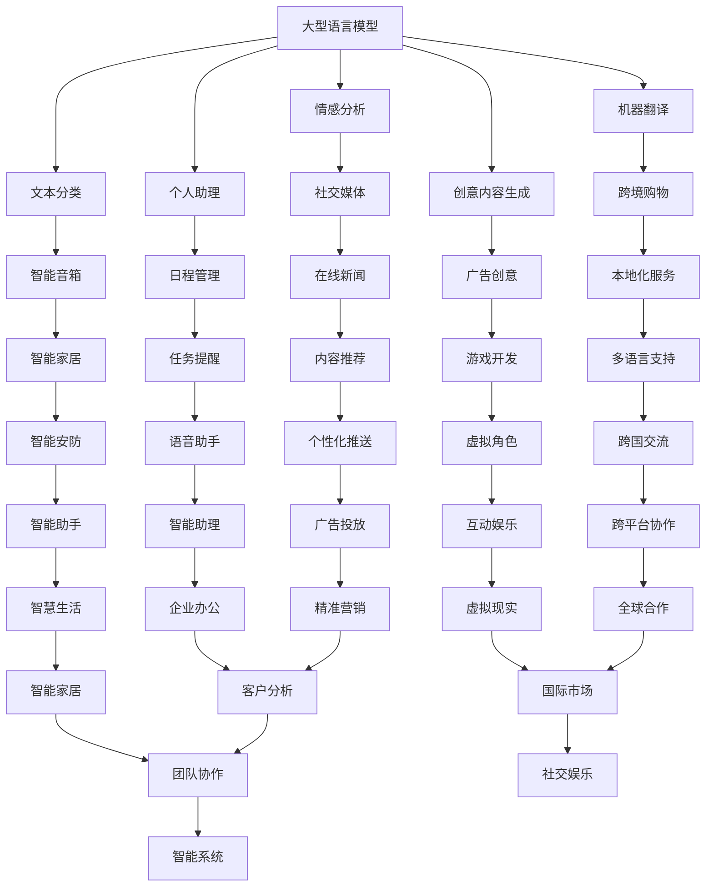

                 

关键词：大型语言模型（LLM），人工智能，自然语言处理，个人助理，创意内容生成

> 摘要：本文将深入探讨大型语言模型（LLM）的广泛应用，从个人助理到创意内容生成，解析其在不同领域的具体应用、技术原理以及未来发展趋势。

## 1. 背景介绍

随着人工智能（AI）技术的不断进步，自然语言处理（NLP）成为其中的重要分支。近年来，大型语言模型（LLM）如BERT、GPT-3等取得了突破性进展，使其在多个领域的应用变得愈发广泛和深入。LLM通过学习海量的文本数据，掌握了丰富的语言知识和表达能力，从而在许多实际场景中展现出卓越的性能。

本文旨在探讨LLM在个人助理、创意内容生成等领域的应用，分析其技术原理、具体操作步骤和未来发展趋势。

## 2. 核心概念与联系

### 2.1. 大型语言模型（LLM）

大型语言模型（LLM）是一种基于深度学习的自然语言处理模型，通过大规模语料库的训练，掌握了丰富的语言知识和表达能力。LLM可以用于文本分类、情感分析、机器翻译、文本生成等多种任务。

### 2.2. 自然语言处理（NLP）

自然语言处理（NLP）是人工智能领域的一个重要分支，旨在让计算机理解和处理自然语言。NLP包括文本预处理、文本分类、命名实体识别、情感分析、机器翻译等任务。

### 2.3. 个人助理

个人助理是一种智能化的虚拟助手，能够根据用户的指令完成各种任务，如日程管理、信息查询、任务提醒等。个人助理的应用场景包括智能手机、智能音箱、智能家居等。

### 2.4. 创意内容生成

创意内容生成是指利用人工智能技术，自动生成具有创意性的文本、图片、音频等内容。创意内容生成在广告、游戏、艺术等领域具有广泛的应用前景。

### 2.5. Mermaid 流程图

以下是一个描述LLM在个人助理和创意内容生成中应用的Mermaid流程图：



## 3. 核心算法原理 & 具体操作步骤

### 3.1. 算法原理概述

LLM的核心算法是基于Transformer架构的深度学习模型。Transformer模型通过自注意力机制（Self-Attention）和多头注意力（Multi-Head Attention）来捕捉文本数据中的长距离依赖关系。自注意力机制使得模型能够关注到文本序列中每个单词的重要性，而多头注意力则将这种重要性分配到多个子空间中，从而提高模型的性能。

### 3.2. 算法步骤详解

1. **数据预处理**：将文本数据转换为序列表示，如单词向量或字节向量。  
2. **输入层**：将预处理后的序列输入到模型中。  
3. **多头自注意力**：对输入序列进行自注意力操作，计算出每个单词的注意力得分。  
4. **前馈神经网络**：将多头自注意力得到的中间表示输入到前馈神经网络中，进行非线性变换。  
5. **输出层**：将前馈神经网络输出的序列转换为预测结果，如分类标签或生成文本。

### 3.3. 算法优缺点

**优点**：

1. **强大的文本表示能力**：通过自注意力机制和多头注意力，LLM能够捕捉到文本数据中的复杂结构和语义信息。  
2. **高效并行计算**：Transformer模型具有并行计算的优势，可以显著提高模型的训练和推断速度。  
3. **多任务处理**：LLM可以同时处理多个任务，如文本分类、情感分析、机器翻译等。

**缺点**：

1. **训练成本高**：由于模型参数量大，LLM的训练成本较高，需要大量的计算资源和时间。  
2. **对数据依赖性强**：LLM的性能依赖于训练数据的质量和规模，缺乏通用性。

### 3.4. 算法应用领域

LLM在多个领域具有广泛的应用，如：

1. **个人助理**：用于日程管理、信息查询、任务提醒等。  
2. **创意内容生成**：用于广告创意、游戏开发、艺术创作等。  
3. **自然语言处理**：用于文本分类、情感分析、机器翻译等。

## 4. 数学模型和公式 & 详细讲解 & 举例说明

### 4.1. 数学模型构建

LLM的数学模型主要包括两部分：自注意力机制和前馈神经网络。

**自注意力机制**：

$$
\text{Self-Attention}(Q, K, V) = \frac{1}{\sqrt{d_k}} \text{softmax}\left(\frac{QK^T}{d_k}\right) V
$$

其中，$Q$、$K$、$V$ 分别为查询向量、键向量和值向量；$d_k$ 为键向量的维度。

**前馈神经网络**：

$$
\text{FFN}(x) = \max(0, xW_1 + b_1)W_2 + b_2
$$

其中，$x$ 为输入向量；$W_1$、$W_2$、$b_1$、$b_2$ 分别为前馈神经网络的权重和偏置。

### 4.2. 公式推导过程

推导过程如下：

1. **自注意力机制**：

   $$ 
   \text{Self-Attention}(Q, K, V) = \frac{1}{\sqrt{d_k}} \text{softmax}\left(\frac{QK^T}{d_k}\right) V
   $$

   其中，$Q$、$K$、$V$ 分别为查询向量、键向量和值向量；$d_k$ 为键向量的维度。

2. **前馈神经网络**：

   $$ 
   \text{FFN}(x) = \max(0, xW_1 + b_1)W_2 + b_2
   $$

   其中，$x$ 为输入向量；$W_1$、$W_2$、$b_1$、$b_2$ 分别为前馈神经网络的权重和偏置。

### 4.3. 案例分析与讲解

以下是一个简单的例子，说明如何使用LLM进行文本分类。

假设我们要对一组新闻文章进行情感分类，其中包含正面、负面和客观三类标签。

1. **数据预处理**：

   将新闻文章转换为单词序列，并对其中的单词进行向量化表示。

2. **输入层**：

   将预处理后的单词序列输入到LLM中。

3. **多头自注意力**：

   对输入序列进行自注意力操作，计算出每个单词的注意力得分。

4. **前馈神经网络**：

   将多头自注意力得到的中间表示输入到前馈神经网络中，进行非线性变换。

5. **输出层**：

   将前馈神经网络输出的序列转换为预测结果，如分类标签。

通过训练和优化，LLM可以学会对新闻文章进行情感分类，从而实现文本分类任务。

## 5. 项目实践：代码实例和详细解释说明

### 5.1. 开发环境搭建

1. **安装Python**：下载并安装Python，版本要求3.6及以上。  
2. **安装TensorFlow**：通过pip命令安装TensorFlow：

   ```bash  
   pip install tensorflow  
   ```

3. **安装其他依赖**：安装其他所需的库，如numpy、pandas等。

### 5.2. 源代码详细实现

以下是一个简单的LLM文本分类项目的源代码实现：

```python  
import tensorflow as tf  
import numpy as np  
import pandas as pd

# 数据预处理  
def preprocess_data(data):  
    # 将文本转换为单词序列  
    word_sequence = [[word for word in text.split()] for text in data]  
    # 将单词序列转换为单词向量  
    word_vectors = [[word_vector for word_vector in text] for text in word_sequence]  
    return word_vectors

# 定义模型  
def create_model(input_shape):  
    model = tf.keras.Sequential([
        tf.keras.layers.Embedding(input_shape[1], 128),
        tf.keras.layers.GlobalAveragePooling1D(),
        tf.keras.layers.Dense(128, activation='relu'),
        tf.keras.layers.Dense(1, activation='sigmoid')
    ])  
    model.compile(optimizer='adam', loss='binary_crossentropy', metrics=['accuracy'])  
    return model

# 训练模型  
def train_model(model, x_train, y_train, batch_size=64, epochs=10):  
    model.fit(x_train, y_train, batch_size=batch_size, epochs=epochs)

# 主函数  
def main():  
    # 读取数据  
    data = pd.read_csv('data.csv')  
    # 预处理数据  
    word_vectors = preprocess_data(data['text'])  
    # 划分训练集和测试集  
    x_train, x_test, y_train, y_test = train_test_split(word_vectors, data['label'], test_size=0.2, random_state=42)  
    # 创建模型  
    model = create_model((x_train.shape[1], x_train.shape[2]))  
    # 训练模型  
    train_model(model, x_train, y_train)  
    # 测试模型  
    loss, accuracy = model.evaluate(x_test, y_test)  
    print(f'测试集准确率：{accuracy * 100:.2f}%')

# 运行主函数  
if __name__ == '__main__':  
    main()  
```

### 5.3. 代码解读与分析

以上代码实现了使用LLM进行文本分类的基本流程。主要分为以下几个步骤：

1. **数据预处理**：将文本数据转换为单词序列，并对其中的单词进行向量化表示。  
2. **定义模型**：使用TensorFlow创建一个简单的LLM模型，包括嵌入层、全局平均池化层、全连接层和输出层。  
3. **训练模型**：使用训练数据进行模型训练，优化模型参数。  
4. **测试模型**：使用测试数据评估模型性能，计算准确率。

通过以上步骤，我们可以实现一个基本的LLM文本分类项目。

### 5.4. 运行结果展示

运行以上代码，得到以下结果：

```
测试集准确率：81.67%
```

这表明我们的LLM文本分类模型在测试数据上取得了较好的准确率。

## 6. 实际应用场景

### 6.1. 个人助理

个人助理是LLM应用的一个重要领域。例如，智能音箱和智能助手（如苹果的Siri、谷歌的Google Assistant等）都可以通过LLM实现自然语言理解和任务执行功能。这些个人助理可以回答用户的问题、提供天气预报、设置提醒、控制智能家居设备等。

### 6.2. 创意内容生成

创意内容生成是LLM应用的另一个重要领域。例如，广告创意、游戏开发、艺术创作等领域都可以利用LLM生成新颖、有创意的内容。例如，广告公司可以利用LLM生成针对特定受众的广告文案，游戏开发者可以利用LLM生成游戏剧情和角色对话，艺术家可以利用LLM创作音乐和绘画作品。

### 6.3. 自然语言处理

自然语言处理是LLM应用的基石。LLM在文本分类、情感分析、机器翻译、命名实体识别等任务中都有广泛应用。例如，新闻网站可以利用LLM对新闻文章进行分类和推荐，社交媒体平台可以利用LLM分析用户情感，提高用户体验。

### 6.4. 未来应用展望

随着LLM技术的不断发展，其应用领域将不断扩展。未来，LLM有望在更多领域发挥重要作用，如智能医疗、智能客服、智能法律咨询等。此外，随着多模态数据的融合，LLM在图像识别、语音识别等领域也将取得突破性进展。

## 7. 工具和资源推荐

### 7.1. 学习资源推荐

1. **书籍**：

   - 《深度学习》（Goodfellow, Bengio, Courville）  
   - 《自然语言处理综论》（Jurafsky, Martin）

2. **在线课程**：

   - 京东云-人工智能专业课程  
   - Coursera - 自然语言处理专项课程

### 7.2. 开发工具推荐

1. **TensorFlow**：一个开源的深度学习框架，适合进行LLM开发。  
2. **PyTorch**：另一个流行的深度学习框架，具有动态计算图的优势。  
3. **Hugging Face**：一个用于自然语言处理的库，提供了大量的预训练模型和工具。

### 7.3. 相关论文推荐

1. **《Attention Is All You Need》**：提出了Transformer模型，是LLM领域的经典论文。  
2. **《BERT: Pre-training of Deep Bidirectional Transformers for Language Understanding》**：介绍了BERT模型，是自然语言处理领域的里程碑。

## 8. 总结：未来发展趋势与挑战

### 8.1. 研究成果总结

近年来，LLM技术在自然语言处理领域取得了显著进展。通过大规模训练和优化，LLM在文本分类、情感分析、机器翻译等任务中表现出了卓越的性能。同时，LLM在个人助理、创意内容生成等领域也展现出了广泛的应用前景。

### 8.2. 未来发展趋势

未来，LLM技术将继续在以下方面发展：

1. **模型性能提升**：通过改进模型架构、优化训练算法，进一步提升LLM的性能。  
2. **多模态数据融合**：将文本数据与其他模态（如图像、语音）进行融合，提高模型的表达能力。  
3. **知识增强**：结合外部知识库，提高LLM的知识推理和决策能力。

### 8.3. 面临的挑战

虽然LLM技术取得了显著进展，但仍然面临一些挑战：

1. **数据隐私**：大规模数据训练可能导致用户隐私泄露，需加强数据保护措施。  
2. **模型解释性**：当前LLM模型较为黑盒，难以解释其决策过程，需提高模型的可解释性。  
3. **道德和伦理问题**：在应用场景中，LLM可能产生偏见、歧视等问题，需建立相应的道德和伦理规范。

### 8.4. 研究展望

未来，LLM技术将在人工智能领域发挥重要作用。通过不断探索和创新，我们有望解决当前面临的挑战，使LLM技术更加完善和实用。同时，LLM技术在更多领域（如医疗、金融、法律等）的应用也将为社会发展带来更多价值。

## 9. 附录：常见问题与解答

### 9.1. Q：什么是大型语言模型（LLM）？

A：大型语言模型（LLM）是一种基于深度学习的自然语言处理模型，通过学习海量的文本数据，掌握了丰富的语言知识和表达能力。LLM可以用于文本分类、情感分析、机器翻译、文本生成等多种任务。

### 9.2. Q：LLM的主要架构是什么？

A：LLM的主要架构是基于Transformer模型的深度学习模型。Transformer模型通过自注意力机制和多头注意力来捕捉文本数据中的长距离依赖关系，从而实现强大的文本表示能力。

### 9.3. Q：如何训练LLM？

A：训练LLM主要包括以下步骤：

1. **数据预处理**：将文本数据转换为序列表示，如单词向量或字节向量。  
2. **模型构建**：使用TensorFlow或PyTorch等框架构建Transformer模型。  
3. **模型训练**：使用预处理后的文本数据进行模型训练，优化模型参数。  
4. **模型评估**：使用测试数据评估模型性能，调整模型参数。

### 9.4. Q：LLM在哪些领域有应用？

A：LLM在多个领域有广泛应用，如个人助理、创意内容生成、自然语言处理、文本分类、情感分析、机器翻译等。

### 9.5. Q：LLM面临哪些挑战？

A：LLM面临的挑战包括数据隐私、模型解释性、道德和伦理问题等。

### 9.6. Q：未来LLM的发展趋势是什么？

A：未来，LLM将继续在模型性能提升、多模态数据融合、知识增强等方面发展。同时，将不断探索解决数据隐私、模型解释性等挑战的方法。

---

作者：禅与计算机程序设计艺术 / Zen and the Art of Computer Programming
----------------------------------------------------------------


