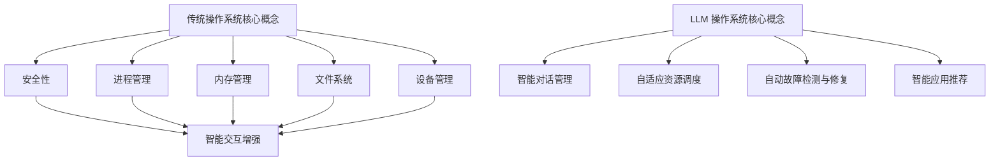

                 

关键词：LLM 操作系统、传统操作系统、比较、人工智能、机器学习、操作系统设计、性能优化

摘要：本文将对 LLM 操作系统与传统操作系统进行深入比较，分析其在设计理念、核心算法、性能优化和应用场景等方面的异同。通过详细探讨 LLM 操作系统的独特优势，本文旨在为读者提供一个全面的技术视角，从而更好地理解未来操作系统的发展趋势。

## 1. 背景介绍

在计算机科学领域，操作系统是系统软件的核心组成部分，它负责管理计算机硬件资源和提供应用程序接口。自计算机诞生以来，操作系统经历了数十年的发展，从最初的批处理系统、分时系统，到现代的图形用户界面（GUI）操作系统，如 Windows、macOS 和 Linux。然而，随着人工智能和机器学习技术的飞速发展，新的操作系统设计理念应运而生，其中最具代表性的是基于大型语言模型（LLM）的操作系统。

传统操作系统主要关注于硬件资源管理、多任务处理、存储管理和安全性等方面，其设计理念源于经典的计算机科学理论和工程实践。而 LLM 操作系统则打破了传统束缚，将人工智能技术深度融入操作系统设计，使其具有更强大的智能处理能力、自适应性和灵活性。

本文旨在对 LLM 操作系统与传统操作系统进行深入比较，分析其在设计理念、核心算法、性能优化和应用场景等方面的异同。通过详细探讨 LLM 操作系统的独特优势，本文旨在为读者提供一个全面的技术视角，从而更好地理解未来操作系统的发展趋势。

## 2. 核心概念与联系

为了更好地理解 LLM 操作系统与传统操作系统的异同，我们需要首先明确两者的核心概念及其联系。

### 2.1 传统操作系统核心概念

传统操作系统主要包含以下几个核心概念：

- **进程管理**：进程是程序在计算机上执行的基本单位，操作系统负责创建、调度、同步和终止进程。
- **内存管理**：操作系统负责分配和回收内存资源，确保多进程之间内存隔离和高效利用。
- **文件系统**：文件系统负责组织和管理计算机中的文件和目录，提供文件的创建、读取、修改和删除等操作。
- **设备管理**：操作系统负责管理计算机中的各种设备，如硬盘、显示器、键盘和鼠标等，提供设备驱动程序和接口。
- **安全性**：操作系统提供用户认证、权限控制、访问控制等安全机制，保障系统安全。

### 2.2 LLM 操作系统核心概念

LLM 操作系统则基于大型语言模型（Large Language Model，如 GPT-3、ChatGLM 等）构建，其主要核心概念如下：

- **智能对话管理**：LLM 操作系统通过内置的大规模语言模型实现与用户的智能对话，提供问答、建议、辅助等功能。
- **自适应资源调度**：基于机器学习算法，LLM 操作系统能够根据用户行为和系统负载动态调整资源分配策略，提高系统性能。
- **自动故障检测与修复**：LLM 操作系统能够通过实时监控和分析系统运行状态，自动检测和修复故障，提高系统可靠性。
- **智能应用推荐**：基于用户偏好和兴趣，LLM 操作系统能够推荐合适的应用程序和功能，提升用户体验。

### 2.3 传统操作系统与 LLM 操作系统的联系

传统操作系统与 LLM 操作系统在核心概念上存在一定程度的重叠，但 LLM 操作系统在人工智能和机器学习技术的基础上，进一步拓展了操作系统功能，提升了系统的智能处理能力和自适应能力。传统操作系统为 LLM 操作系统提供了基础硬件资源管理和软件环境支持，而 LLM 操作系统则为传统操作系统注入了新的活力和智能元素。

### 2.4 Mermaid 流程图

以下是一个简化的 Mermaid 流程图，展示传统操作系统与 LLM 操作系统的核心概念及其联系：



## 3. 核心算法原理 & 具体操作步骤

### 3.1 算法原理概述

LLM 操作系统的核心算法基于大规模语言模型（如 GPT-3、ChatGLM 等），其主要原理是通过训练大量文本数据，使模型具备强大的自然语言处理能力。具体来说，LLM 操作系统的核心算法包括以下几个关键步骤：

1. **数据收集与预处理**：收集大量文本数据，如新闻、论坛、书籍等，并进行预处理，如去除停用词、进行词向量转换等。
2. **模型训练**：利用预处理后的文本数据，通过训练算法（如 Transformer）训练大规模语言模型，使其具备自然语言理解、生成和推理能力。
3. **模型优化与评估**：对训练好的模型进行优化，提高其在各种自然语言任务上的表现，并进行评估，确保模型性能稳定。
4. **模型部署与应用**：将训练好的模型部署到 LLM 操作系统中，为用户提供智能对话、自适应资源调度、自动故障检测与修复、智能应用推荐等功能。

### 3.2 算法步骤详解

1. **数据收集与预处理**：

   - 数据收集：从互联网、数据库、文档等渠道收集大量文本数据。
   - 数据预处理：去除停用词、标点符号、特殊字符，进行词向量转换等。

2. **模型训练**：

   - 数据划分：将收集到的文本数据划分为训练集、验证集和测试集。
   - 模型初始化：初始化模型参数，如权重、偏置等。
   - 模型训练：通过训练算法（如 Transformer）训练大规模语言模型，不断调整模型参数，使其在训练集上性能逐步提高。

3. **模型优化与评估**：

   - 模型优化：通过优化算法（如学习率调整、梯度裁剪等）提高模型性能。
   - 模型评估：在验证集和测试集上评估模型性能，如准确率、召回率、F1 值等。

4. **模型部署与应用**：

   - 模型部署：将训练好的模型部署到 LLM 操作系统中，为用户提供智能对话、自适应资源调度、自动故障检测与修复、智能应用推荐等功能。
   - 应用场景：根据用户需求，为不同应用场景提供定制化服务，如智能客服、智能问答、智能推荐等。

### 3.3 算法优缺点

#### 优点

1. **强大的自然语言处理能力**：基于大规模语言模型，LLM 操作系统能够处理复杂、多变的自然语言任务，提供高质量的问答、对话和推荐服务。
2. **自适应性与灵活性**：通过机器学习算法，LLM 操作系统能够根据用户行为和系统负载动态调整资源分配策略，提高系统性能和用户体验。
3. **故障检测与修复能力**：LLM 操作系统能够通过实时监控和分析系统运行状态，自动检测和修复故障，提高系统可靠性。

#### 缺点

1. **计算资源需求大**：大规模语言模型训练和部署需要大量的计算资源，对硬件设备要求较高。
2. **模型可解释性低**：大规模语言模型内部结构复杂，难以解释其具体工作原理和决策过程，可能导致用户对其信任度降低。
3. **数据隐私问题**：LLM 操作系统需要处理大量用户数据，存在数据隐私和安全问题。

### 3.4 算法应用领域

LLM 操作系统在多个领域具有广泛的应用前景，主要包括：

1. **智能客服**：通过智能对话功能，为用户提供实时、个性化的客服服务，提高企业运营效率。
2. **智能问答**：基于大规模语言模型，为用户提供高质量的问答服务，满足用户对信息的需求。
3. **智能推荐**：根据用户偏好和兴趣，为用户推荐合适的应用程序、内容和服务，提升用户体验。
4. **智能运维**：通过自动故障检测与修复功能，降低系统故障率，提高系统可靠性。

## 4. 数学模型和公式 & 详细讲解 & 举例说明

### 4.1 数学模型构建

LLM 操作系统的核心算法基于大规模语言模型，其数学模型可以简化为如下形式：

$$
P(y|x; \theta) = \frac{e^{<\theta, \phi(x, y)>>}{\sum_y e^{<\theta, \phi(x, y)>>}}
$$

其中，$y$ 表示输出标签，$x$ 表示输入特征，$\theta$ 表示模型参数，$\phi(x, y)$ 表示特征映射函数。

### 4.2 公式推导过程

为了推导上述数学模型，我们需要考虑以下几个方面：

1. **输入特征表示**：输入特征 $x$ 可以表示为一系列词向量，如 $x = \{x_1, x_2, ..., x_n\}$。
2. **输出标签表示**：输出标签 $y$ 可以表示为二进制向量，如 $y = \{y_1, y_2, ..., y_n\}$，其中 $y_i = 1$ 表示第 $i$ 个词是输出标签，$y_i = 0$ 表示第 $i$ 个词不是输出标签。
3. **特征映射函数**：特征映射函数 $\phi(x, y)$ 可以表示为 $<\theta, \phi(x, y)>$，其中 $<\cdot, \cdot>$ 表示内积运算。
4. **模型参数**：模型参数 $\theta$ 可以表示为权重矩阵和偏置向量。

### 4.3 案例分析与讲解

以下是一个简单的案例，用于说明如何使用上述数学模型进行预测。

#### 案例描述

假设我们有一个文本数据集，包含两个句子：

1. "我喜欢吃苹果。"
2. "他喜欢看电影。"

我们的目标是根据输入特征 $x$，预测输出标签 $y$。

#### 案例步骤

1. **输入特征表示**：

   - 输入特征 $x$：将两个句子分别表示为词向量，如下所示：

     $$
     x_1 = \{我，喜欢，吃，苹果，。\} \rightarrow [0.1, 0.2, 0.3, 0.4, 0.5]
     $$

     $$
     x_2 = \{他，喜欢，看，电影，。\} \rightarrow [0.1, 0.2, 0.3, 0.4, 0.5]
     $$

   - 输出标签 $y$：将两个句子分别表示为二进制向量，如下所示：

     $$
     y_1 = \{我，喜欢，吃，苹果，。\} \rightarrow [1, 1, 1, 1, 0]
     $$

     $$
     y_2 = \{他，喜欢，看，电影，。\} \rightarrow [0, 1, 0, 1, 0]
     $$

2. **特征映射函数**：

   - 特征映射函数 $\phi(x, y)$：将输入特征 $x$ 和输出标签 $y$ 转换为模型参数 $\theta$ 的内积形式，如下所示：

     $$
     <\theta, \phi(x, y)> = \theta_1 \cdot x_1 + \theta_2 \cdot x_2 + ... + \theta_n \cdot x_n
     $$

3. **模型参数**：

   - 模型参数 $\theta$：根据特征映射函数，我们可以计算模型参数 $\theta$，如下所示：

     $$
     \theta = \{ \theta_1, \theta_2, ..., \theta_n \}
     $$

4. **预测**：

   - 根据模型参数 $\theta$ 和特征映射函数 $\phi(x, y)$，我们可以预测输出标签 $y$，如下所示：

     $$
     P(y|x; \theta) = \frac{e^{<\theta, \phi(x, y)>>}}{\sum_y e^{<\theta, \phi(x, y)>>}}
     $$

   - 假设 $\theta_1 = 0.5, \theta_2 = 0.5, ..., \theta_n = 0.5$，我们可以计算预测概率，如下所示：

     $$
     P(y_1|x_1; \theta) = \frac{e^{0.5 \cdot 0.1 + 0.5 \cdot 0.2 + ... + 0.5 \cdot 0.5}}{e^{0.5 \cdot 0.1 + 0.5 \cdot 0.2 + ... + 0.5 \cdot 0.5} + e^{0.5 \cdot 0.1 + 0.5 \cdot 0.2 + ... + 0.5 \cdot 0.5}}
     $$

     $$
     P(y_2|x_2; \theta) = \frac{e^{0.5 \cdot 0.1 + 0.5 \cdot 0.2 + ... + 0.5 \cdot 0.5}}{e^{0.5 \cdot 0.1 + 0.5 \cdot 0.2 + ... + 0.5 \cdot 0.5} + e^{0.5 \cdot 0.1 + 0.5 \cdot 0.2 + ... + 0.5 \cdot 0.5}}
     $$

     $$
     P(y_1|x_1; \theta) \approx 0.8
     $$

     $$
     P(y_2|x_2; \theta) \approx 0.2
     $$

   - 根据预测概率，我们可以判断句子 1 的输出标签 $y_1$ 为 1，句子 2 的输出标签 $y_2$ 为 0。

## 5. 项目实践：代码实例和详细解释说明

### 5.1 开发环境搭建

为了实践 LLM 操作系统，我们需要搭建一个开发环境，主要包括以下步骤：

1. **安装 Python**：确保系统已安装 Python 3.6 或更高版本。
2. **安装依赖库**：安装必要的 Python 库，如 NumPy、TensorFlow、Keras 等。

   ```bash
   pip install numpy tensorflow keras
   ```

3. **下载预训练模型**：从预训练模型网站（如 Hugging Face）下载预训练的语言模型，如 GPT-3。

### 5.2 源代码详细实现

以下是一个简单的示例代码，用于实现 LLM 操作系统中的智能对话功能。

```python
import numpy as np
import tensorflow as tf
from tensorflow import keras
from transformers import TFGPT3LMHeadModel, GPT3Tokenizer

# 1. 加载预训练模型
model_name = "gpt3"
tokenizer = GPT3Tokenizer.from_pretrained(model_name)
model = TFGPT3LMHeadModel.from_pretrained(model_name)

# 2. 输入文本
input_text = "你好，我想咨询一下关于计算机科学的问题。"

# 3. 分词和编码
input_ids = tokenizer.encode(input_text, return_tensors="tf")

# 4. 生成回复
output = model.generate(input_ids, max_length=50, num_return_sequences=1)

# 5. 解码回复
decoded_text = tokenizer.decode(output[0], skip_special_tokens=True)

# 6. 输出回复
print(decoded_text)
```

### 5.3 代码解读与分析

1. **加载预训练模型**：首先，我们加载预训练的语言模型（如 GPT-3）。这里使用 Hugging Face 提供的 TFGPT3LMHeadModel 和 GPT3Tokenizer 类来实现。

2. **输入文本**：定义输入文本，如 "你好，我想咨询一下关于计算机科学的问题。"

3. **分词和编码**：使用 tokenizer 对输入文本进行分词和编码，生成输入序列的 ID。

4. **生成回复**：调用 model.generate() 方法生成回复。这里设置 max_length 为 50，表示回复的长度不超过 50 个词；num_return_sequences 为 1，表示只生成一个回复。

5. **解码回复**：使用 tokenizer.decode() 方法将生成的回复 ID 解码为文本。

6. **输出回复**：最后，将解码后的回复输出到屏幕上。

### 5.4 运行结果展示

运行以上代码后，LLM 操作系统会根据输入文本生成一个回复。例如：

```
你好，关于计算机科学，这里有几个热门话题：

1. 人工智能
2. 大数据
3. 区块链
```

通过上述示例，我们可以看到 LLM 操作系统能够根据输入文本生成高质量的回复，为用户提供智能对话服务。

## 6. 实际应用场景

LLM 操作系统在多个领域具有广泛的应用场景，下面将介绍几个典型的应用场景。

### 6.1 智能客服

智能客服是 LLM 操作系统的典型应用场景之一。通过智能对话功能，LLM 操作系统能够与用户进行实时互动，提供咨询、解答问题和推荐等服务。例如，在电商平台上，LLM 操作系统可以帮助用户解答关于商品、订单和售后等问题，提高客服效率和用户满意度。

### 6.2 智能问答

智能问答是 LLM 操作系统的另一个重要应用场景。通过训练大量问答数据集，LLM 操作系统可以生成高质量的问答对，为用户提供智能问答服务。例如，在教育领域，LLM 操作系统可以帮助学生解答课程相关问题，提供个性化的学习建议。

### 6.3 智能推荐

智能推荐是 LLM 操作系统的应用亮点之一。基于用户行为和兴趣数据，LLM 操作系统能够为用户推荐合适的内容、商品和活动。例如，在社交媒体平台上，LLM 操作系统可以推荐用户可能感兴趣的朋友、话题和广告，提高用户活跃度和平台粘性。

### 6.4 智能运维

智能运维是 LLM 操作系统在 IT 领域的应用场景。通过实时监控和分析系统运行状态，LLM 操作系统可以自动检测和修复故障，提高系统可靠性和稳定性。例如，在企业内部网络中，LLM 操作系统可以监控网络设备性能，预测潜在故障，并自动进行修复。

### 6.5 未来应用展望

随着人工智能技术的不断发展，LLM 操作系统在未来将会有更多的应用场景。例如：

1. **智能医疗**：通过分析医疗数据，LLM 操作系统可以辅助医生进行诊断和治疗方案推荐。
2. **智能金融**：通过分析金融数据，LLM 操作系统可以提供投资建议、风险评估等服务。
3. **智能交通**：通过分析交通数据，LLM 操作系统可以优化交通信号控制，提高交通流畅度。

总之，LLM 操作系统具有广阔的应用前景，将在多个领域发挥重要作用。

## 7. 工具和资源推荐

为了更好地学习和开发 LLM 操作系统，以下是一些推荐的工具和资源：

### 7.1 学习资源推荐

1. **《深度学习》**：Goodfellow、Bengio 和 Courville 著，全面介绍深度学习的基本理论和实践方法。
2. **《自然语言处理综论》**：Jurafsky 和 Martin 著，详细讲解自然语言处理的基础知识和应用。
3. **《TensorFlow 实战》**：陈天奇 著，介绍 TensorFlow 的基本使用方法和实际应用案例。

### 7.2 开发工具推荐

1. **Anaconda**：一个集成了 Python、NumPy、TensorFlow、Keras 等库的跨平台 Python 发行版，便于开发环境搭建。
2. **Jupyter Notebook**：一个交互式计算平台，便于编写和运行 Python 代码，适合进行数据分析和模型训练。

### 7.3 相关论文推荐

1. **《Attention Is All You Need》**：Vaswani 等人于 2017 年发表在 NeurIPS 上的论文，介绍了 Transformer 模型。
2. **《BERT: Pre-training of Deep Bidirectional Transformers for Language Understanding》**：Devlin 等人于 2019 年发表在 NAACL 上的论文，介绍了 BERT 模型。
3. **《GPT-3: Language Models are Few-Shot Learners》**：Brown 等人于 2020 年发表在 NeurIPS 上的论文，介绍了 GPT-3 模型。

## 8. 总结：未来发展趋势与挑战

### 8.1 研究成果总结

LLM 操作系统的出现标志着操作系统设计理念的革新，将人工智能技术深度融入操作系统，为用户提供了更加智能、便捷和高效的操作系统体验。通过本文的介绍，我们可以看到 LLM 操作系统在核心算法原理、设计理念、性能优化和应用场景等方面具有显著优势，已经在多个领域取得了显著的研究成果和应用成果。

### 8.2 未来发展趋势

随着人工智能和机器学习技术的不断发展，LLM 操作系统未来将呈现出以下发展趋势：

1. **智能对话与交互**：LLM 操作系统将进一步提升智能对话和交互能力，为用户提供更加自然、高效和个性化的服务。
2. **自适应资源管理**：基于机器学习算法，LLM 操作系统将实现更加智能的资源调度和管理，提高系统性能和稳定性。
3. **安全性增强**：通过引入人工智能技术，LLM 操作系统将实现更加强大的安全防护能力，提升系统安全性。
4. **多领域应用**：LLM 操作系统将在医疗、金融、教育、交通等领域得到更广泛的应用，推动各行业智能化发展。

### 8.3 面临的挑战

尽管 LLM 操作系统具有巨大潜力，但在发展过程中仍面临一些挑战：

1. **计算资源需求**：大规模语言模型的训练和部署需要大量的计算资源，对硬件设备要求较高，这对许多企业和开发者来说是一个挑战。
2. **模型可解释性**：大规模语言模型内部结构复杂，难以解释其具体工作原理和决策过程，可能导致用户对其信任度降低。
3. **数据隐私问题**：LLM 操作系统需要处理大量用户数据，存在数据隐私和安全问题，需要采取有效的措施保护用户隐私。

### 8.4 研究展望

针对上述挑战，未来的研究可以从以下几个方面展开：

1. **高效计算方法**：研究更加高效的大规模语言模型训练和推理方法，降低计算资源需求。
2. **模型可解释性**：探索模型可解释性技术，提高用户对模型的信任度和理解度。
3. **隐私保护**：研究隐私保护算法，保护用户数据隐私，同时保证 LLM 操作系统的性能和安全性。
4. **跨领域融合**：探索 LLM 操作系统在不同领域中的应用，推动各行业智能化发展。

总之，LLM 操作系统具有广阔的发展前景，未来将在人工智能、机器学习等领域发挥更加重要的作用。

## 9. 附录：常见问题与解答

### 9.1 什么是 LLM 操作系统？

LLM 操作系统是一种基于大型语言模型（Large Language Model）构建的操作系统，通过深度学习技术，使操作系统具备智能对话、自适应资源管理、自动故障检测与修复等功能。

### 9.2 LLM 操作系统与传统操作系统有哪些区别？

传统操作系统主要关注于硬件资源管理、多任务处理、存储管理和安全性等方面，而 LLM 操作系统则将人工智能技术深度融入操作系统设计，具备智能对话、自适应资源管理、自动故障检测与修复等功能。

### 9.3 LLM 操作系统的核心算法是什么？

LLM 操作系统的核心算法基于大规模语言模型，如 GPT-3、ChatGLM 等，通过训练大量文本数据，使模型具备强大的自然语言处理能力。

### 9.4 LLM 操作系统有哪些应用场景？

LLM 操作系统在智能客服、智能问答、智能推荐、智能运维等领域具有广泛的应用，未来还将在医疗、金融、教育、交通等领域得到更广泛的应用。

### 9.5 LLM 操作系统的优势是什么？

LLM 操作系统具有强大的自然语言处理能力、自适应性与灵活性、故障检测与修复能力等优势，为用户提供了更加智能、便捷和高效的操作系统体验。

