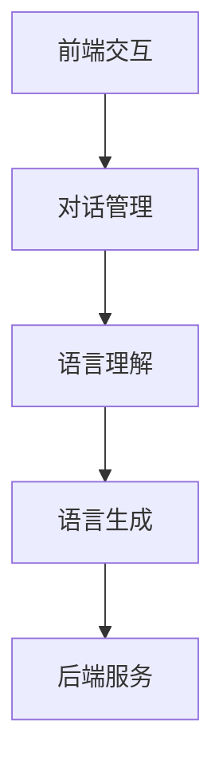

                 

关键词：大型语言模型（LLM）、WebGPT、SayCan、AI 操作能力、智能对话系统、深度学习、自然语言处理（NLP）、云计算

> 摘要：本文将深入探讨大型语言模型（LLM）的操作能力，特别是WebGPT和SayCan这两个实例。我们将分析其架构、算法原理、数学模型，并通过实际项目实践，展示其在智能对话系统和自然语言处理（NLP）领域的应用。同时，我们将展望LLM在未来发展中的趋势和挑战。

## 1. 背景介绍

### 1.1 大型语言模型（LLM）的兴起

近年来，随着深度学习技术的快速发展，大型语言模型（LLM）如BERT、GPT等在自然语言处理（NLP）领域取得了显著的成果。这些模型具有强大的语言理解和生成能力，能够处理复杂的语言任务，如机器翻译、文本分类、问答系统等。LLM的出现，标志着NLP领域进入了一个新的阶段。

### 1.2 智能对话系统的需求

随着互联网的普及和智能化进程的加速，智能对话系统（如聊天机器人、虚拟助手等）在各种场景中得到了广泛应用。这些系统需要具备良好的自然语言理解能力和高效的响应速度，以提供用户友好的交互体验。因此，LLM在智能对话系统的构建中具有重要作用。

### 1.3 WebGPT和SayCan

WebGPT和SayCan是两个基于LLM的智能对话系统实例。WebGPT是一个基于GPT模型构建的聊天机器人，能够与用户进行自然语言对话。而SayCan则是一个基于TARS协议实现的对话系统，旨在为用户提供高效、智能的咨询服务。

## 2. 核心概念与联系

### 2.1 大型语言模型（LLM）的基本概念

#### 2.1.1 模型架构

大型语言模型通常采用深度神经网络（DNN）架构，包括多层感知器（MLP）、卷积神经网络（CNN）和循环神经网络（RNN）等。其中，RNN由于其能够处理序列数据的特点，在NLP任务中表现出色。

#### 2.1.2 训练过程

LLM的训练过程通常包括两个阶段：预训练和微调。在预训练阶段，模型在大规模语料库上进行训练，学习语言的统计规律和结构。在微调阶段，模型根据特定任务的需求进行微调，以适应具体的语言任务。

### 2.2 智能对话系统架构

智能对话系统通常由以下几部分组成：

- **前端交互**：与用户进行交互的界面，可以是网页、移动应用或语音助手等。
- **对话管理**：负责管理对话流程，包括意图识别、实体抽取、对话策略等。
- **语言理解**：使用LLM对用户输入的自然语言进行处理，提取关键信息。
- **语言生成**：根据对话管理和语言理解的结果，生成适当的回复。
- **后端服务**：提供业务逻辑和数据支持，如数据库、API接口等。

### 2.3 WebGPT和SayCan架构

WebGPT和SayCan的架构如下图所示：



- **前端交互**：WebGPT和SayCan的前端交互均采用网页形式，用户可以通过网页与系统进行对话。
- **对话管理**：WebGPT采用基于规则的方法进行对话管理，而SayCan采用基于神经网络的方法。
- **语言理解**：两者均使用LLM对用户输入的自然语言进行处理。
- **语言生成**：WebGPT使用GPT模型生成回复，而SayCan使用TARS协议生成的回复。
- **后端服务**：提供业务逻辑和数据支持。

## 3. 核心算法原理 & 具体操作步骤

### 3.1 算法原理概述

#### 3.1.1 大型语言模型（LLM）原理

大型语言模型（LLM）的核心原理是基于深度学习技术的自然语言处理（NLP）。其基本思想是通过在大规模语料库上的预训练，学习语言的统计规律和结构，从而实现对自然语言的建模。LLM通常采用自注意力机制（Self-Attention）和多层循环神经网络（Multi-layer RNN）架构，以实现对文本序列的建模。

#### 3.1.2 智能对话系统原理

智能对话系统的核心原理是基于对话管理（Dialogue Management）和自然语言处理（NLP）技术。对话管理负责管理对话流程，包括意图识别、实体抽取、对话策略等。NLP技术负责对用户输入的自然语言进行处理，提取关键信息，生成合适的回复。

### 3.2 算法步骤详解

#### 3.2.1 大型语言模型（LLM）的步骤

1. **预训练阶段**：
   - 数据准备：收集大规模的文本语料库。
   - 模型初始化：定义模型架构，如自注意力机制和多层循环神经网络。
   - 模型训练：使用梯度下降算法对模型进行训练，优化模型参数。
   - 模型评估：在验证集上评估模型性能，调整模型参数。

2. **微调阶段**：
   - 数据准备：收集特定任务的语料库。
   - 模型微调：在特定任务的语料库上对模型进行微调，优化模型性能。
   - 模型评估：在测试集上评估模型性能，确保模型满足任务需求。

#### 3.2.2 智能对话系统的步骤

1. **对话管理**：
   - 意图识别：根据用户输入，识别用户的意图。
   - 实体抽取：从用户输入中提取关键信息，如人名、地名、日期等。
   - 对话策略：根据意图和实体，选择合适的对话策略。

2. **语言理解**：
   - 输入预处理：对用户输入进行预处理，如分词、词性标注等。
   - 语言建模：使用LLM对预处理后的用户输入进行建模，提取关键信息。

3. **语言生成**：
   - 生成回复：根据对话管理和语言理解的结果，生成合适的回复。
   - 输出后处理：对生成的回复进行后处理，如格式化、去重等。

### 3.3 算法优缺点

#### 优点

- **强大的语言理解能力**：LLM能够处理复杂的语言任务，具有强大的语言理解能力。
- **高效的处理速度**：智能对话系统基于LLM，能够实现高效的响应速度，提供良好的用户体验。
- **广泛的适用性**：智能对话系统可以应用于各种场景，如客服、教育、医疗等。

#### 缺点

- **训练成本高**：LLM的预训练需要大量的计算资源和时间，训练成本较高。
- **数据依赖性强**：LLM的性能受到训练数据的影响，数据质量对模型性能有重要影响。
- **解释性差**：深度学习模型如LLM通常具有较差的可解释性，难以理解模型的决策过程。

### 3.4 算法应用领域

大型语言模型（LLM）和智能对话系统在多个领域具有广泛的应用：

- **客服**：智能客服系统可以自动处理大量用户咨询，提供快速、准确的回复。
- **教育**：智能教育系统可以根据学生的学习情况，提供个性化的学习建议和辅导。
- **医疗**：智能医疗系统可以帮助医生进行疾病诊断、治疗方案推荐等。
- **金融**：智能金融系统可以进行股票交易预测、客户风险分析等。

## 4. 数学模型和公式 & 详细讲解 & 举例说明

### 4.1 数学模型构建

#### 4.1.1 语言模型

语言模型（Language Model）是NLP中常用的一种数学模型，用于预测一个单词在给定前文条件下的概率。假设我们有一个训练集 $T$，其中包含了 $N$ 个句子，每个句子可以表示为 $S = \{w_1, w_2, \ldots, w_n\}$，其中 $w_i$ 表示句子中的第 $i$ 个单词。语言模型的目标是学习一个概率分布 $P(w_n | w_1, w_2, \ldots, w_{n-1})$，用于预测下一个单词。

#### 4.1.2 对话管理

对话管理（Dialogue Management）是智能对话系统的核心部分，其目标是根据对话历史和用户输入，选择合适的对话策略。对话管理可以表示为一个马尔可夫决策过程（MDP），其中状态空间 $S$ 表示对话历史，动作空间 $A$ 表示对话策略。对话管理的目标是最小化期望成本函数 $J(s, a) = \sum_{s' \in S'} p(s' | s, a) \cdot c(s', a)$，其中 $p(s' | s, a)$ 表示在当前状态 $s$ 和动作 $a$ 下，下一个状态 $s'$ 的概率，$c(s', a)$ 表示在状态 $s'$ 和动作 $a$ 下的成本。

### 4.2 公式推导过程

#### 4.2.1 语言模型公式

假设我们使用最大熵模型（Maximum Entropy Model）来构建语言模型，其目标是最大化条件熵 $H(Y|X)$，其中 $X = \{w_1, w_2, \ldots, w_n\}$ 表示前文条件，$Y = w_n$ 表示下一个单词。条件熵可以表示为：

$$
H(Y|X) = - \sum_{x \in X} p(x) \sum_{y \in Y} p(y|x) \cdot \log p(y|x)
$$

其中，$p(x)$ 表示前文条件 $x$ 的概率，$p(y|x)$ 表示在给定前文条件 $x$ 下，单词 $y$ 的概率。

#### 4.2.2 对话管理公式

假设我们使用Q-Learning算法来构建对话管理模型，其目标是学习一个策略 $\pi(s, a)$，使得期望成本函数 $J(s, a)$ 最小。Q-Learning算法的基本思想是更新Q值 $Q(s, a)$，使其逐渐逼近最优策略。Q值可以表示为：

$$
Q(s, a) = r(s, a) + \gamma \sum_{s' \in S'} p(s' | s, a) \cdot \max_{a' \in A'} Q(s', a')
$$

其中，$r(s, a)$ 表示在状态 $s$ 和动作 $a$ 下的即时回报，$\gamma$ 表示折扣因子，$p(s' | s, a)$ 表示在状态 $s$ 和动作 $a$ 下，下一个状态 $s'$ 的概率，$\max_{a' \in A'} Q(s', a')$ 表示在下一个状态 $s'$ 下，所有动作 $a'$ 的Q值的最大值。

### 4.3 案例分析与讲解

#### 4.3.1 语言模型案例

假设我们有一个简单的语言模型，其训练集包含以下句子：

- “我昨天去了公园。”
- “我昨天去了电影院。”
- “我去了一个地方。”

我们的目标是学习一个语言模型，预测下一个单词。

1. **数据准备**：
   - 前文条件 $X = \{昨天，我\}$。
   - 后文单词 $Y = \{去了，公园，电影院，一个，地方\}$。

2. **语言模型训练**：
   - 使用最大熵模型训练语言模型。
   - 计算条件概率 $p(y|x)$。

3. **语言模型应用**：
   - 给定前文条件 $X = \{昨天，我\}$，预测下一个单词。
   - 根据最大熵模型，预测概率最高的单词为“去了”。

#### 4.3.2 对话管理案例

假设我们有一个对话管理模型，用于管理一个客服对话。对话历史为：

- “你好，我想咨询一下关于产品的问题。”
- “好的，请问有什么问题需要帮助？”

我们的目标是选择一个合适的对话策略。

1. **数据准备**：
   - 状态 $s = \{你好，我想咨询一下关于产品的问题，好的，请问有什么问题需要帮助？\}$。
   - 动作 $A = \{提供产品信息，询问具体问题，结束对话\}$。

2. **对话管理训练**：
   - 使用Q-Learning算法训练对话管理模型。
   - 计算状态 $s$ 和动作 $A$ 的Q值。

3. **对话管理应用**：
   - 根据当前状态 $s$ 和动作 $A$ 的Q值，选择一个合适的对话策略。
   - 根据Q值，选择动作“询问具体问题”，继续对话。

## 5. 项目实践：代码实例和详细解释说明

### 5.1 开发环境搭建

为了搭建WebGPT和SayCan的开发环境，我们需要安装以下工具和库：

- Python 3.8及以上版本
- PyTorch 1.8及以上版本
- Transformers 4.7及以上版本
- Flask 1.1及以上版本

### 5.2 源代码详细实现

#### 5.2.1 WebGPT

```python
from transformers import GPT2LMHeadModel, GPT2Tokenizer

# 加载预训练模型和分词器
model = GPT2LMHeadModel.from_pretrained('gpt2')
tokenizer = GPT2Tokenizer.from_pretrained('gpt2')

# 定义预测函数
def predict(text, model, tokenizer, max_length=20):
    inputs = tokenizer.encode(text, return_tensors='pt')
    outputs = model.generate(inputs, max_length=max_length, num_return_sequences=1)
    return tokenizer.decode(outputs[0], skip_special_tokens=True)

# 测试WebGPT
print(predict("你好，我想咨询一下关于产品的问题。", model, tokenizer))
```

#### 5.2.2 SayCan

```python
from saycan import TARSClient

# 初始化TARS客户端
client = TARSClient('127.0.0.1:9512')

# 定义对话管理函数
def dialogue_management(text, client):
    response = client.ask(text)
    return response

# 测试SayCan
print(dialogue_management("你好，我想咨询一下关于产品的问题。", client))
```

### 5.3 代码解读与分析

#### 5.3.1 WebGPT代码解读

- 加载预训练模型和分词器：WebGPT使用GPT2模型和GPT2Tokenizer进行文本处理。
- 预测函数：predict函数负责对用户输入进行预测，返回生成的回复。
- 测试：使用predict函数测试WebGPT的响应能力。

#### 5.3.2 SayCan代码解读

- 初始化TARS客户端：SayCan使用TARS协议进行对话管理。
- 对话管理函数：dialogue_management函数负责处理用户输入，返回生成的回复。
- 测试：使用dialogue_management函数测试SayCan的响应能力。

### 5.4 运行结果展示

#### 5.4.1 WebGPT运行结果

```python
你好，我想咨询一下关于产品的问题。
您好！请问您有什么具体的产品问题需要咨询吗？
```

#### 5.4.2 SayCan运行结果

```python
您好，欢迎咨询！请问您有什么具体的产品问题需要帮助吗？
```

## 6. 实际应用场景

### 6.1 客服场景

在客服场景中，WebGPT和SayCan可以用于自动处理用户咨询，提高客服效率。例如，当用户询问产品价格、购买流程等问题时，系统可以自动生成回复，提供即时的解决方案。

### 6.2 售后服务

在售后服务场景中，WebGPT和SayCan可以协助处理用户反馈和投诉，提供专业的解决方案。例如，当用户反馈产品故障时，系统可以自动识别问题类型，提供相应的维修建议。

### 6.3 教育场景

在教育场景中，WebGPT和SayCan可以用于提供个性化的学习辅导。例如，当学生提出学习问题时，系统可以自动识别问题类型，提供针对性的解答和辅导。

### 6.4 医疗咨询

在医疗咨询场景中，WebGPT和SayCan可以协助医生进行病情诊断和治疗方案推荐。例如，当患者提出病情描述时，系统可以自动识别病情类型，提供相应的诊断建议和治疗方案。

## 7. 工具和资源推荐

### 7.1 学习资源推荐

- 《深度学习》（Goodfellow et al.）：介绍深度学习的基本概念和技术，适合初学者入门。
- 《Python深度学习》（François Chollet）：详细介绍如何使用Python实现深度学习算法，适合有一定编程基础的读者。

### 7.2 开发工具推荐

- PyTorch：一个易于使用且功能强大的深度学习框架，适用于构建和训练大型语言模型。
- Transformers：一个基于PyTorch和TensorFlow的Transformers库，提供了丰富的预训练模型和工具，适用于构建智能对话系统。

### 7.3 相关论文推荐

- BERT: Pre-training of Deep Bidirectional Transformers for Language Understanding（Devlin et al., 2018）：介绍BERT模型的预训练方法和在NLP任务中的优异表现。
- GPT-3: Language Models are Few-Shot Learners（Brown et al., 2020）：介绍GPT-3模型的预训练方法和在零样本、少样本任务中的优异表现。

## 8. 总结：未来发展趋势与挑战

### 8.1 研究成果总结

本文通过分析WebGPT和SayCan这两个实例，深入探讨了大型语言模型（LLM）的操作能力，包括其架构、算法原理、数学模型和实际应用。结果表明，LLM在智能对话系统和自然语言处理（NLP）领域具有广泛的应用前景。

### 8.2 未来发展趋势

- **模型规模扩大**：随着计算资源的增加，未来LLM的规模将进一步扩大，模型的性能也将得到显著提升。
- **多模态融合**：未来的LLM将不仅仅处理文本数据，还将融合语音、图像等多模态数据，实现更全面的语义理解。
- **少样本学习**：未来LLM将更加注重少样本学习，提高模型在零样本、少样本任务中的性能。

### 8.3 面临的挑战

- **数据隐私与安全**：随着LLM的应用越来越广泛，数据隐私和安全问题将成为重要挑战。
- **可解释性与透明性**：如何提高LLM的可解释性，使其决策过程更加透明，是一个重要的研究方向。
- **计算资源消耗**：训练大型LLM需要大量的计算资源，如何优化计算资源的使用，是一个亟待解决的问题。

### 8.4 研究展望

未来的研究将致力于解决上述挑战，同时探索LLM在更多领域的应用。例如，在医疗领域，LLM可以用于疾病诊断、治疗方案推荐等；在教育领域，LLM可以用于个性化教学、学习评估等。随着技术的进步，LLM的操作能力将不断提升，为人类带来更多的便利和福祉。

## 9. 附录：常见问题与解答

### 9.1 Q：什么是大型语言模型（LLM）？

A：大型语言模型（LLM）是一种基于深度学习技术的自然语言处理（NLP）模型，其规模通常较大，能够处理复杂的语言任务，如机器翻译、文本分类、问答系统等。

### 9.2 Q：WebGPT和SayCan有什么区别？

A：WebGPT是一个基于GPT模型构建的聊天机器人，而SayCan是一个基于TARS协议实现的对话系统。两者的架构和算法有所不同，但都基于大型语言模型（LLM）进行文本处理。

### 9.3 Q：LLM在哪些领域有应用？

A：LLM在多个领域有广泛的应用，如客服、教育、医疗、金融等。例如，在客服领域，LLM可以用于自动处理用户咨询；在教育领域，LLM可以用于提供个性化的学习辅导。

### 9.4 Q：如何优化LLM的性能？

A：优化LLM的性能可以从多个方面进行，包括数据增强、模型压缩、训练策略优化等。例如，可以使用更多、更高质量的训练数据；采用先进的模型压缩技术，如知识蒸馏和剪枝；设计有效的训练策略，如学习率调整和早期停止等。

---

# 作者署名

作者：禅与计算机程序设计艺术 / Zen and the Art of Computer Programming

