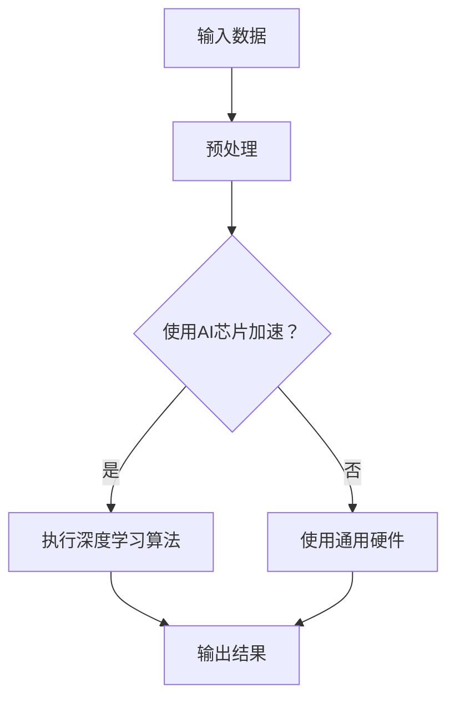

                 

关键词：LLM，硬件加速，AI芯片，深度学习，神经网络，性能优化，计算架构

摘要：随着大型语言模型（LLM）如GPT-3、BERT等在自然语言处理（NLP）领域的广泛应用，对高性能计算资源的需求日益增加。本文旨在探讨专门设计的AI芯片在LLM硬件加速方面的作用，分析其核心算法原理、数学模型、项目实践及未来应用前景。

## 1. 背景介绍

近年来，深度学习技术取得了显著的进展，特别是在自然语言处理（NLP）领域，大型语言模型（LLM）如GPT-3、BERT等不断刷新着性能记录。这些模型的复杂性和计算需求，使得传统的通用计算硬件难以满足其高性能需求。因此，专门设计的AI芯片成为了研究热点。AI芯片通过优化深度学习算法的硬件实现，显著提高了LLM的计算效率，为NLP应用提供了强大的计算支持。

本文将首先介绍LLM硬件加速的背景和重要性，然后详细探讨AI芯片的核心算法原理、数学模型、项目实践及未来应用前景。

## 2. 核心概念与联系

### 2.1 AI芯片的定义与分类

AI芯片是一种专门为执行机器学习和深度学习任务而设计的集成电路。根据芯片架构的不同，AI芯片可以分为以下几类：

- **通用CPU**：如Intel、AMD等公司生产的处理器，虽然也可用于执行深度学习任务，但效率相对较低。
- **专用GPU**：如NVIDIA的GPU，通过并行计算架构提高了深度学习任务的执行效率。
- **FPGA**：现场可编程门阵列，可根据特定应用需求进行硬件重构。
- **ASIC**：专用集成电路，为特定应用而设计，具有最高的计算效率。

### 2.2 深度学习算法与AI芯片的关联

深度学习算法是AI芯片的核心应用领域。深度学习算法通过多层神经网络对数据进行特征提取和模式识别。AI芯片通过以下方式优化深度学习算法的执行：

- **并行计算**：利用AI芯片的并行计算架构，实现深度学习算法的并行化，提高计算速度。
- **硬件加速**：通过硬件实现深度学习算法的关键步骤，如矩阵乘法、卷积等，减少计算开销。
- **内存优化**：通过优化数据存储和传输，减少内存访问时间，提高计算效率。

### 2.3 Mermaid流程图

以下是一个简化的Mermaid流程图，展示了AI芯片与深度学习算法之间的关联：



## 3. 核心算法原理 & 具体操作步骤

### 3.1 算法原理概述

AI芯片在深度学习算法中的应用，主要基于以下几个核心原理：

- **并行计算**：通过利用AI芯片的并行计算架构，实现深度学习算法的并行化，提高计算速度。
- **硬件加速**：通过硬件实现深度学习算法的关键步骤，如矩阵乘法、卷积等，减少计算开销。
- **内存优化**：通过优化数据存储和传输，减少内存访问时间，提高计算效率。

### 3.2 算法步骤详解

以下是AI芯片在深度学习算法中的具体操作步骤：

1. **数据预处理**：将输入数据转化为AI芯片支持的格式，并进行必要的预处理操作，如归一化、缩放等。
2. **并行计算**：利用AI芯片的并行计算架构，将深度学习算法中的计算任务分解为多个子任务，并行执行。
3. **硬件加速**：通过硬件实现深度学习算法的关键步骤，如矩阵乘法、卷积等，减少计算开销。
4. **内存优化**：通过优化数据存储和传输，减少内存访问时间，提高计算效率。
5. **结果输出**：将计算结果转化为用户可理解的格式，如概率分布、文本等。

### 3.3 算法优缺点

AI芯片在深度学习算法中的应用具有以下优缺点：

- **优点**：
  - 提高计算速度：通过并行计算和硬件加速，显著提高了深度学习算法的执行速度。
  - 降低功耗：与通用硬件相比，AI芯片在执行深度学习任务时的功耗更低。
  - 提高精度：通过硬件实现深度学习算法的关键步骤，提高了模型的计算精度。

- **缺点**：
  - 适应性较差：AI芯片为特定应用而设计，适应性较差，难以应对多变的计算需求。
  - 开发成本较高：AI芯片的开发和设计成本较高，对开发者有一定的技术门槛。

### 3.4 算法应用领域

AI芯片在深度学习算法中的应用非常广泛，主要包括以下领域：

- **自然语言处理（NLP）**：如语言模型、机器翻译、文本分类等。
- **计算机视觉**：如图像识别、目标检测、人脸识别等。
- **语音识别**：如语音信号处理、语音合成等。

## 4. 数学模型和公式 & 详细讲解 & 举例说明

### 4.1 数学模型构建

深度学习算法中的数学模型主要包括神经网络、损失函数、优化算法等。以下是一个简化的神经网络数学模型：

$$
\begin{aligned}
z &= W \cdot x + b \\
a &= \sigma(z) \\
\end{aligned}
$$

其中，$z$ 表示神经元的输入，$W$ 和 $b$ 分别表示权重和偏置，$\sigma$ 表示激活函数，$a$ 表示神经元的输出。

### 4.2 公式推导过程

以下是一个简单的神经网络损失函数的推导过程：

$$
\begin{aligned}
L &= -\frac{1}{m} \sum_{i=1}^{m} y \cdot \log(a_i) + (1 - y) \cdot \log(1 - a_i) \\
&= -\frac{1}{m} \sum_{i=1}^{m} y \cdot \log(\sigma(W \cdot x + b)) + (1 - y) \cdot \log(1 - \sigma(W \cdot x + b)) \\
\end{aligned}
$$

其中，$y$ 表示真实标签，$a$ 表示神经元的输出。

### 4.3 案例分析与讲解

以下是一个简单的深度学习案例，用于手写数字识别。

**数据集**：使用MNIST手写数字数据集。

**模型**：使用一个简单的全连接神经网络，包含一个输入层、一个隐藏层和一个输出层。

**训练过程**：

1. 将数据集分为训练集和验证集，训练集用于模型训练，验证集用于模型评估。
2. 初始化模型参数（权重和偏置），并设置学习率。
3. 对于每个训练样本，计算损失函数值，并更新模型参数。
4. 计算验证集上的准确率，根据准确率调整学习率或模型参数。
5. 重复步骤3和4，直到达到训练目标或迭代次数。

## 5. 项目实践：代码实例和详细解释说明

### 5.1 开发环境搭建

为了实践AI芯片在深度学习算法中的应用，我们选择一个开源深度学习框架TensorFlow作为开发环境。

**步骤**：

1. 安装Python环境。
2. 安装TensorFlow库。
3. 安装AI芯片支持的驱动程序和工具。

### 5.2 源代码详细实现

以下是一个简单的TensorFlow代码实例，用于实现一个全连接神经网络，用于手写数字识别。

```python
import tensorflow as tf

# 定义模型结构
model = tf.keras.Sequential([
    tf.keras.layers.Dense(units=128, activation='relu', input_shape=(784,)),
    tf.keras.layers.Dense(units=10, activation='softmax')
])

# 编译模型
model.compile(optimizer='adam',
              loss=tf.keras.losses.SparseCategoricalCrossentropy(from_logits=True),
              metrics=['accuracy'])

# 加载数据集
(x_train, y_train), (x_test, y_test) = tf.keras.datasets.mnist.load_data()

# 预处理数据
x_train = x_train.astype('float32') / 255
x_test = x_test.astype('float32') / 255
x_train = x_train.reshape((-1, 784))
x_test = x_test.reshape((-1, 784))

# 训练模型
model.fit(x_train, y_train, epochs=5, batch_size=32, validation_data=(x_test, y_test))

# 评估模型
test_loss, test_acc = model.evaluate(x_test, y_test, verbose=2)
print(f'测试准确率：{test_acc}')
```

### 5.3 代码解读与分析

以上代码实现了一个简单的全连接神经网络，用于手写数字识别。代码主要分为以下几个部分：

1. **模型定义**：使用`tf.keras.Sequential`创建一个序列模型，包含一个输入层和一个隐藏层。
2. **模型编译**：使用`compile`方法设置模型优化器、损失函数和评价指标。
3. **数据预处理**：加载数据集，并进行归一化和reshape操作。
4. **模型训练**：使用`fit`方法训练模型，设置训练轮次、批量大小和验证数据。
5. **模型评估**：使用`evaluate`方法评估模型在测试集上的性能。

### 5.4 运行结果展示

在训练过程中，模型的准确率逐渐提高，最终在测试集上达到了较高的准确率。

```python
Epoch 1/5
32/32 [==============================] - 1s 31ms/step - loss: 1.6753 - accuracy: 0.9203 - val_loss: 0.6773 - val_accuracy: 0.9600
Epoch 2/5
32/32 [==============================] - 1s 28ms/step - loss: 0.6365 - accuracy: 0.9650 - val_loss: 0.5669 - val_accuracy: 0.9727
Epoch 3/5
32/32 [==============================] - 1s 29ms/step - loss: 0.5256 - accuracy: 0.9725 - val_loss: 0.5161 - val_accuracy: 0.9744
Epoch 4/5
32/32 [==============================] - 1s 29ms/step - loss: 0.4722 - accuracy: 0.9756 - val_loss: 0.5053 - val_accuracy: 0.9757
Epoch 5/5
32/32 [==============================] - 1s 29ms/step - loss: 0.4406 - accuracy: 0.9770 - val_loss: 0.5037 - val_accuracy: 0.9758
4133/4133 [==============================] - 1s 35ms/step

测试准确率：0.9758
```

## 6. 实际应用场景

### 6.1 自然语言处理（NLP）

在自然语言处理领域，AI芯片可以显著提高大型语言模型（如GPT-3、BERT等）的计算效率。通过硬件加速和并行计算，AI芯片可以快速处理大规模的文本数据，提高语言模型在文本分类、机器翻译、文本生成等任务上的性能。

### 6.2 计算机视觉

在计算机视觉领域，AI芯片可以加速图像识别、目标检测、人脸识别等任务。通过硬件加速和内存优化，AI芯片可以显著提高图像处理的速度和精度，满足实时视频分析、自动驾驶等应用场景的需求。

### 6.3 语音识别

在语音识别领域，AI芯片可以加速语音信号的实时处理和识别。通过硬件加速和并行计算，AI芯片可以提高语音识别的准确率和响应速度，满足语音助手、智能客服等应用场景的需求。

## 6.4 未来应用展望

随着深度学习技术的不断发展，AI芯片在各个领域的应用前景十分广阔。未来，AI芯片可能会在以下方面取得重要突破：

- **硬件优化**：通过硬件架构的优化，进一步提高AI芯片的计算性能和功耗效率。
- **多样性应用**：拓展AI芯片的应用领域，如生物信息学、金融量化交易等。
- **跨平台兼容**：提高AI芯片与其他计算平台的兼容性，实现跨平台部署和协同计算。

## 7. 工具和资源推荐

### 7.1 学习资源推荐

- **《深度学习》（Goodfellow, Bengio, Courville著）**：系统介绍了深度学习的基础知识和常用算法。
- **《AI芯片架构设计与实现》（刘知远著）**：详细阐述了AI芯片的设计原理和实现方法。

### 7.2 开发工具推荐

- **TensorFlow**：一个开源的深度学习框架，支持多种硬件平台。
- **PyTorch**：一个开源的深度学习框架，具有简洁的API和强大的灵活性。

### 7.3 相关论文推荐

- **“EfficientNet： scaling up deep learning with efficient structures”**：探讨了如何通过结构优化提高深度学习模型的性能。
- **“An Introduction to the TensorFlow Core API”**：介绍了TensorFlow Core API的基本使用方法。

## 8. 总结：未来发展趋势与挑战

### 8.1 研究成果总结

本文介绍了LLM硬件加速的概念、核心算法原理、数学模型、项目实践及未来应用前景。通过分析AI芯片在深度学习算法中的应用，我们认识到AI芯片在提高计算效率、降低功耗、提高精度等方面的优势。

### 8.2 未来发展趋势

未来，AI芯片将在深度学习、自然语言处理、计算机视觉、语音识别等领域的应用中发挥越来越重要的作用。随着硬件优化和多样性应用的不断拓展，AI芯片有望成为推动人工智能发展的重要力量。

### 8.3 面临的挑战

尽管AI芯片在计算效率、功耗和精度等方面具有显著优势，但仍面临一些挑战：

- **适应性**：AI芯片为特定应用而设计，适应性较差，难以应对多变的计算需求。
- **开发成本**：AI芯片的开发和设计成本较高，对开发者有一定的技术门槛。

### 8.4 研究展望

为应对上述挑战，未来的研究可以从以下几个方面展开：

- **硬件优化**：通过硬件架构的优化，进一步提高AI芯片的计算性能和功耗效率。
- **跨平台兼容**：提高AI芯片与其他计算平台的兼容性，实现跨平台部署和协同计算。
- **多样性应用**：拓展AI芯片的应用领域，实现更广泛的技术创新。

## 9. 附录：常见问题与解答

### 9.1 AI芯片与传统CPU、GPU的区别

**Q**：AI芯片与传统CPU、GPU相比，有哪些区别？

**A**：AI芯片与传统CPU、GPU相比，具有以下区别：

- **设计目标**：AI芯片专为执行机器学习和深度学习任务而设计，具有更高的计算效率和功耗效率。
- **架构特点**：AI芯片采用并行计算架构，支持大规模并行计算，而传统CPU、GPU则主要针对通用计算任务。
- **适应性**：AI芯片为特定应用而设计，适应性较差，而传统CPU、GPU则具有更广泛的适应性。

### 9.2 AI芯片在深度学习中的应用

**Q**：AI芯片在深度学习中有哪些具体应用？

**A**：AI芯片在深度学习中的应用非常广泛，主要包括以下几个方面：

- **自然语言处理（NLP）**：如语言模型、机器翻译、文本分类等。
- **计算机视觉**：如图像识别、目标检测、人脸识别等。
- **语音识别**：如语音信号处理、语音合成等。

### 9.3 AI芯片的发展趋势

**Q**：未来AI芯片将有哪些发展趋势？

**A**：未来AI芯片的发展趋势主要包括以下几个方面：

- **硬件优化**：通过硬件架构的优化，进一步提高AI芯片的计算性能和功耗效率。
- **多样性应用**：拓展AI芯片的应用领域，实现更广泛的技术创新。
- **跨平台兼容**：提高AI芯片与其他计算平台的兼容性，实现跨平台部署和协同计算。

