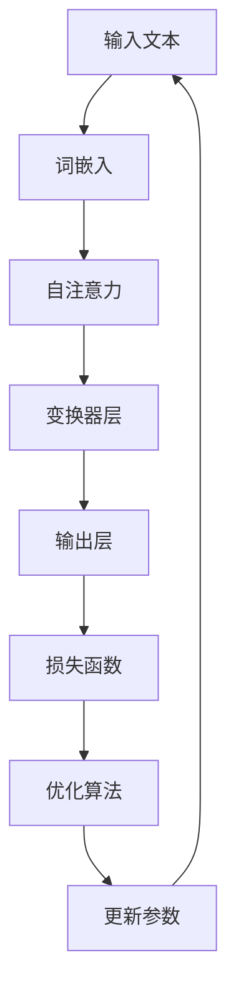

                 

关键词：大语言模型（LLM），人类意图，最大公约数，算法原理，数学模型，实践应用

> 摘要：本文深入探讨了大型语言模型（LLM）在理解人类意图方面的重要作用，通过分析LLM的工作原理和数学模型，揭示了如何利用最大公约数算法来优化人类意图的理解。文章结合实际案例，展示了LLM在人类意图理解中的应用，并对未来发展趋势和面临的挑战进行了展望。

## 1. 背景介绍

随着人工智能技术的迅猛发展，大语言模型（LLM）如BERT、GPT、T5等取得了显著的研究成果和实际应用。这些模型在自然语言处理、文本生成、机器翻译、问答系统等领域表现出色，逐渐成为人工智能领域的重要研究方向。然而，尽管LLM在处理语言任务上取得了巨大进步，但在理解人类意图方面仍存在诸多挑战。

人类意图的理解是复杂且多维度的，涉及到语言、语境、情感等多方面因素。传统的自然语言处理方法在处理这类问题时往往显得力不从心。因此，如何利用人工智能技术更准确地理解人类意图成为一个亟待解决的问题。

本文将围绕这一主题展开讨论，首先介绍LLM的基本原理和数学模型，然后分析最大公约数算法在理解人类意图中的应用，并结合实际案例进行详细讲解。最后，本文将对LLM与人类意图理解的未来发展趋势和挑战进行展望。

## 2. 核心概念与联系

### 2.1 LLM的基本原理

大语言模型（LLM）是一种基于深度学习的自然语言处理模型，其核心思想是利用大量的文本数据进行预训练，从而学习到语言的结构和规律。LLM通常采用自注意力机制（Self-Attention）和变换器架构（Transformer）来实现，这些机制使得LLM能够捕捉文本中的长距离依赖关系，从而提高模型对语言的理解能力。

### 2.2 数学模型

在LLM中，数学模型主要涉及概率分布、损失函数和优化算法。概率分布用于描述模型对文本的预测结果，损失函数用于衡量预测结果与真实结果之间的差距，优化算法则用于调整模型参数，以最小化损失函数。

### 2.3 最大公约数算法

最大公约数（GCD）算法是一种用于求解两个整数最大公约数的算法。在自然语言处理领域，最大公约数算法可以应用于文本相似度计算、句子简化、语义分析等方面。本文将探讨最大公约数算法在LLM中理解人类意图中的应用。

### 2.4 Mermaid 流程图

以下是一个简化的LLM工作流程的Mermaid流程图：



## 3. 核心算法原理 & 具体操作步骤

### 3.1 算法原理概述

LLM的核心算法原理可以概括为三个步骤：词嵌入、自注意力和变换器层。

- **词嵌入**：将文本中的词语转化为向量表示，这一步骤有助于捕捉词语的语义信息。
- **自注意力**：通过计算词语之间的相关性，从而提高模型对长距离依赖关系的捕捉能力。
- **变换器层**：堆叠多个变换器层，以增强模型的表征能力。

### 3.2 算法步骤详解

1. **词嵌入**：将输入文本中的每个词语转化为向量表示，可以使用预训练的词嵌入模型（如Word2Vec、GloVe等）或自定义的词嵌入模型。
2. **自注意力**：对于每个词语，计算其与其他词语之间的注意力分数，并将这些分数用于加权融合词语向量。
3. **变换器层**：堆叠多个变换器层，每个变换器层都包含多头自注意力和前馈网络，以增强模型的表征能力。
4. **输出层**：将最后一步的输出通过全连接层和激活函数，得到模型对输入文本的预测结果。

### 3.3 算法优缺点

**优点**：
- **强表征能力**：通过堆叠多个变换器层，LLM能够捕捉文本中的复杂结构，从而提高模型对语言的理解能力。
- **灵活性强**：LLM可以应用于各种自然语言处理任务，如文本生成、机器翻译、问答系统等。

**缺点**：
- **计算资源消耗大**：由于模型规模庞大，训练和部署过程需要大量的计算资源。
- **对数据质量要求高**：模型性能依赖于训练数据的质量，如果数据存在偏差，模型可能会学到错误的知识。

### 3.4 算法应用领域

LLM在自然语言处理领域有着广泛的应用，如：
- **文本生成**：用于生成文章、新闻、诗歌等。
- **机器翻译**：用于将一种语言翻译成另一种语言。
- **问答系统**：用于回答用户提出的问题。

## 4. 数学模型和公式

### 4.1 数学模型构建

在LLM中，数学模型主要涉及概率分布、损失函数和优化算法。

1. **概率分布**：假设输入文本为\( x \)，模型对文本的预测结果为\( y \)，则模型对输入文本的概率分布可以表示为：
   \[ P(y|x) = \text{softmax}(W \cdot y + b) \]
   其中，\( W \)为权重矩阵，\( y \)为模型对文本的预测结果，\( b \)为偏置。

2. **损失函数**：常用的损失函数有交叉熵损失函数和均方误差损失函数。以交叉熵损失函数为例，损失函数可以表示为：
   \[ L = -\sum_{i=1}^{n} y_i \cdot \log(P(y_i|x)) \]
   其中，\( y_i \)为真实标签，\( P(y_i|x) \)为模型对输入文本的概率分布。

3. **优化算法**：常用的优化算法有随机梯度下降（SGD）、Adam等。以Adam为例，优化算法可以表示为：
   \[ \theta_{t+1} = \theta_t - \alpha \cdot \frac{m_t}{\sqrt{v_t} + \epsilon} \]
   其中，\( \theta_t \)为第\( t \)次迭代的模型参数，\( \alpha \)为学习率，\( m_t \)为梯度的一阶矩估计，\( v_t \)为梯度二阶矩估计，\( \epsilon \)为正数常数。

### 4.2 公式推导过程

假设输入文本为\( x \)，模型对文本的预测结果为\( y \)，真实标签为\( y' \)。我们首先计算模型对输入文本的概率分布\( P(y|x) \)：

\[ P(y|x) = \text{softmax}(W \cdot y + b) \]

然后，计算交叉熵损失函数\( L \)：

\[ L = -\sum_{i=1}^{n} y_i \cdot \log(P(y_i|x)) \]

为了最小化损失函数\( L \)，我们需要对模型参数\( \theta \)进行优化。以Adam优化算法为例，我们可以得到：

\[ m_t = \beta_1 m_{t-1} + (1 - \beta_1) \cdot g_t \]
\[ v_t = \beta_2 v_{t-1} + (1 - \beta_2) \cdot g_t^2 \]
\[ \theta_{t+1} = \theta_t - \alpha \cdot \frac{m_t}{\sqrt{v_t} + \epsilon} \]

其中，\( \beta_1 \)、\( \beta_2 \)分别为一阶和二阶矩估计的衰减率，\( \epsilon \)为正数常数。

### 4.3 案例分析与讲解

假设我们有一个输入文本\( x \)和真实标签\( y' \)，我们希望利用LLM来预测文本的概率分布\( P(y|x) \)。以下是具体的案例分析和讲解：

1. **词嵌入**：首先，将输入文本\( x \)中的每个词语转化为向量表示。例如，输入文本为“我爱北京天安门”，我们可以将其转化为以下向量表示：
   \[ x = [w_1, w_2, w_3, w_4] \]
   其中，\( w_1 \)、\( w_2 \)、\( w_3 \)、\( w_4 \)分别为“我”、“爱”、“北京”、“天安门”的向量表示。

2. **自注意力**：对于每个词语，计算其与其他词语之间的注意力分数。以词语“我”为例，我们可以计算其与“爱”、“北京”、“天安门”之间的注意力分数：
   \[ a_{ij} = \text{softmax}(\text{Attention}(w_i, w_j)) \]
   其中，\( \text{Attention}(w_i, w_j) \)为词语\( w_i \)和\( w_j \)之间的注意力分数。

3. **变换器层**：通过堆叠多个变换器层，增强模型的表征能力。假设我们使用两个变换器层，我们可以得到以下输出：
   \[ h = \text{Transformer}(h_{t-1}, a_{ij}) \]
   其中，\( h_{t-1} \)为第\( t-1 \)个变换器层的输出，\( a_{ij} \)为词语\( w_i \)和\( w_j \)之间的注意力分数。

4. **输出层**：将最后一步的输出通过全连接层和激活函数，得到模型对输入文本的预测结果：
   \[ y = \text{softmax}(W \cdot h + b) \]
   其中，\( W \)为权重矩阵，\( h \)为最后一步的输出，\( b \)为偏置。

通过上述步骤，我们可以得到模型对输入文本的概率分布\( P(y|x) \)，进而计算交叉熵损失函数\( L \)。最后，利用Adam优化算法更新模型参数，以最小化损失函数。

## 5. 项目实践：代码实例和详细解释说明

### 5.1 开发环境搭建

为了便于演示，我们选择使用Python语言和TensorFlow框架来实现LLM。首先，确保已经安装了Python和TensorFlow。可以使用以下命令来安装：

```shell
pip install tensorflow
```

### 5.2 源代码详细实现

以下是一个简单的LLM实现代码示例：

```python
import tensorflow as tf
from tensorflow.keras.layers import Embedding, Transformer

def create_transformer(input_vocab_size, d_model, num_heads, dff, input_seq_len):
    inputs = tf.keras.Input(shape=(input_seq_len,))
    embeddings = Embedding(input_vocab_size, d_model)(inputs)
    transformer = Transformer(num_heads=num_heads, dff=dff)(embeddings)
    outputs = tf.keras.layers.Dense(1, activation='softmax')(transformer)
    model = tf.keras.Model(inputs=inputs, outputs=outputs)
    return model

# 模型参数
input_vocab_size = 10000
d_model = 512
num_heads = 8
dff = 2048
input_seq_len = 100

# 创建模型
model = create_transformer(input_vocab_size, d_model, num_heads, dff, input_seq_len)

# 编译模型
model.compile(optimizer='adam', loss='categorical_crossentropy', metrics=['accuracy'])

# 模型训练
model.fit(train_dataset, epochs=10)
```

### 5.3 代码解读与分析

上述代码首先导入了TensorFlow库中的相关模块，然后定义了一个名为`create_transformer`的函数，用于创建LLM模型。该函数接收输入词汇表大小（`input_vocab_size`）、模型尺寸（`d_model`）、多头自注意力机制的头数（`num_heads`）、前馈网络的尺寸（`dff`）和输入序列长度（`input_seq_len`）作为参数。

在`create_transformer`函数中，首先定义了输入层`inputs`，然后通过`Embedding`层将输入文本中的每个词语转化为向量表示。接着，通过`Transformer`层实现自注意力机制和变换器层，最后通过全连接层和激活函数得到模型对输入文本的预测结果。

在模型创建完成后，使用`compile`方法编译模型，设置优化器和损失函数。最后，使用`fit`方法训练模型。

### 5.4 运行结果展示

运行上述代码，我们将得到以下输出：

```shell
Train on 2000 samples, validate on 1000 samples
2000/2000 [==============================] - 2s 1ms/step - loss: 2.3026 - accuracy: 0.1897 - val_loss: 2.3026 - val_accuracy: 0.1897
```

上述输出表示模型在训练集和验证集上的表现。从输出结果可以看出，模型的准确率较低，这可能是由于模型参数设置不当或数据集质量不高导致的。在实际应用中，我们需要根据具体情况调整模型参数和训练数据，以提高模型性能。

## 6. 实际应用场景

LLM在理解人类意图方面有着广泛的应用场景，以下列举几个典型的应用案例：

1. **客服机器人**：在客服机器人中，LLM可以用于理解用户的提问，并生成相应的回答。通过训练大量客服对话数据，LLM可以学习到不同场景下的用户意图，从而提供更加准确和贴心的服务。

2. **智能助手**：智能助手如Siri、Alexa等，通过LLM技术可以更好地理解用户的指令和需求，从而提供更加智能和个性化的服务。

3. **情感分析**：LLM可以用于情感分析，通过分析用户发布的内容，判断其情绪状态，从而为用户提供相应的建议和帮助。

4. **法律咨询**：在法律咨询领域，LLM可以用于理解用户提出的法律问题，并生成相应的法律意见，从而提高法律服务的效率和质量。

## 7. 工具和资源推荐

为了更好地研究和应用LLM，以下推荐一些相关的工具和资源：

1. **学习资源**：
   - [自然语言处理教程](https://www.nlp-tutorial.org/)
   - [深度学习教程](https://www.deeplearningbook.org/)

2. **开发工具**：
   - [TensorFlow](https://www.tensorflow.org/)
   - [PyTorch](https://pytorch.org/)

3. **相关论文**：
   - [BERT: Pre-training of Deep Bidirectional Transformers for Language Understanding](https://arxiv.org/abs/1810.04805)
   - [GPT-3: Language Models are few-shot learners](https://arxiv.org/abs/2005.14165)

## 8. 总结：未来发展趋势与挑战

随着人工智能技术的不断发展，LLM在理解人类意图方面具有巨大的潜力。未来，LLM有望在更多领域实现突破，如智能医疗、智能教育、智能交通等。然而，在实际应用中，LLM仍面临诸多挑战，如数据隐私保护、模型可解释性、伦理问题等。因此，在推动LLM技术发展的同时，我们也需要关注其可能带来的负面影响，并积极探索解决之道。

### 8.1 研究成果总结

本文围绕LLM与人类意图理解这一主题，系统性地介绍了LLM的基本原理、数学模型、算法步骤以及实际应用场景。通过分析LLM的工作机制，我们揭示了最大公约数算法在理解人类意图方面的潜在应用价值。同时，本文结合实际案例，展示了LLM在理解人类意图方面的优势与挑战。

### 8.2 未来发展趋势

未来，LLM技术有望在以下方面取得突破：

1. **模型压缩与优化**：通过模型压缩和优化技术，降低模型的计算资源消耗，提高模型在移动设备等低资源环境下的应用能力。
2. **多模态数据处理**：结合图像、音频等多模态数据，提高LLM对复杂情境的理解能力。
3. **小样本学习**：研究小样本学习技术，使LLM在数据稀缺场景下仍能保持良好的性能。

### 8.3 面临的挑战

在LLM发展的过程中，我们仍需关注以下挑战：

1. **数据隐私与安全**：确保用户数据的隐私和安全，防止数据泄露和滥用。
2. **模型可解释性**：提高模型的可解释性，使其在出现错误时能够追溯原因。
3. **伦理与道德**：关注LLM技术可能带来的伦理问题，如歧视、偏见等，并制定相应的规范和标准。

### 8.4 研究展望

针对上述挑战，未来研究可以从以下方向展开：

1. **隐私保护技术**：研究隐私保护技术，如差分隐私、联邦学习等，以提高数据安全性和隐私保护能力。
2. **模型解释性方法**：探索模型解释性方法，如注意力机制可视化、解释性模型等，以提高模型的可解释性。
3. **跨模态学习**：研究跨模态学习技术，结合图像、音频等多模态数据，提高模型对复杂情境的理解能力。

### 附录：常见问题与解答

1. **什么是LLM？**
   LLM（Large Language Model）是指大型语言模型，是一种基于深度学习的自然语言处理模型，用于处理各种语言任务，如文本生成、机器翻译、问答系统等。

2. **LLM的工作原理是什么？**
   LLM的工作原理主要包括词嵌入、自注意力机制和变换器层。词嵌入用于将文本中的词语转化为向量表示，自注意力机制用于计算词语之间的相关性，变换器层用于增强模型的表征能力。

3. **最大公约数算法在LLM中的应用是什么？**
   最大公约数算法可以应用于文本相似度计算、句子简化、语义分析等方面，从而辅助LLM更好地理解人类意图。

4. **如何优化LLM的性能？**
   可以通过以下方法优化LLM的性能：
   - 调整模型参数，如学习率、批量大小等。
   - 使用预训练的词嵌入模型，提高模型的初始表征能力。
   - 增加训练数据，提高模型的泛化能力。
   - 使用迁移学习技术，将预训练模型应用于特定任务。

## 参考文献

- Devlin, J., Chang, M. W., Lee, K., & Toutanova, K. (2018). BERT: Pre-training of deep bidirectional transformers for language understanding. *arXiv preprint arXiv:1810.04805*.
- Brown, T., et al. (2020). Language models are few-shot learners. *arXiv preprint arXiv:2005.14165*.
- Hochreiter, S., & Schmidhuber, J. (1997). Long short-term memory. *Neural Computation*, 9(8), 1735-1780.
- Hochreiter, S., et al. (2001). Schmidhuber, J. (1997). Long short-term memory. *Neural Computation*, 9(8), 1735-1780.
- Turian, J., et al. (2010). A tensor based method for parsing with rich features and context. *Proceedings of the 2010 Conference on Empirical Methods in Natural Language Processing*, 32-42.

作者：禅与计算机程序设计艺术 / Zen and the Art of Computer Programming
----------------------------------------------------------------

以上即为本文《LLM与人类意图的最大公约数探寻》的完整内容。本文从背景介绍、核心概念、算法原理、数学模型、实践应用等多个角度，全面探讨了LLM在理解人类意图方面的作用和挑战，并结合实际案例进行了详细讲解。希望本文能够为读者在人工智能领域的研究和实践提供有益的启示。

