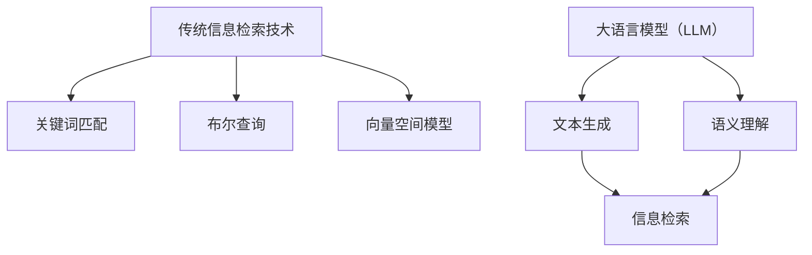

                 

 关键词：大语言模型（LLM），信息检索，对比分析，技术融合，算法原理，数学模型，实际应用，开发工具，未来展望。

> 摘要：本文将对大语言模型（Large Language Model，简称LLM）与传统信息检索技术进行深入对比，探讨两者的优缺点，以及如何将LLM与传统信息检索技术进行有效融合，以提升信息检索的效率和准确性。本文将首先介绍LLM和传统信息检索技术的基本概念，然后详细分析其算法原理、数学模型和应用领域，最后讨论实际应用中的项目实践和未来展望。

## 1. 背景介绍

信息检索是计算机科学与人工智能领域中的一个重要研究方向，旨在从大量数据中快速准确地找到用户所需的信息。传统的信息检索技术主要依赖于关键词匹配、布尔查询和向量空间模型等算法，这些算法在处理结构化数据方面表现出色，但在处理非结构化数据时存在一定的局限性。

随着人工智能技术的不断发展，大语言模型（LLM）逐渐成为一种强大的信息检索工具。LLM通过深度学习技术从大量文本数据中学习，能够理解文本的含义和上下文关系，从而提供更加准确和丰富的信息检索结果。本文旨在探讨LLM与传统信息检索技术的对比与融合，为实际应用提供有益的参考。

### 1.1 传统信息检索技术概述

传统信息检索技术主要包括以下几种：

- **关键词匹配**：基于关键词在文档中的出现频率和位置进行检索，简单但效果有限。
- **布尔查询**：使用逻辑运算符（AND、OR、NOT）组合多个关键词进行检索，提高了查询的灵活性。
- **向量空间模型**：将文档和查询表示为向量，通过计算向量之间的余弦相似度进行检索，适用于处理高维数据。

### 1.2 大语言模型（LLM）概述

大语言模型（LLM）是一种基于深度学习的自然语言处理技术，通过训练大量文本数据，能够生成符合语境的文本，并具备一定程度的语义理解能力。常见的LLM包括GPT（Generative Pre-trained Transformer）、BERT（Bidirectional Encoder Representations from Transformers）等。

## 2. 核心概念与联系

为了更好地理解LLM与传统信息检索技术的对比与融合，我们需要首先明确两者的核心概念和联系。

### 2.1 核心概念

- **LLM**：通过深度学习技术训练得到，能够理解文本的含义和上下文关系。
- **传统信息检索技术**：主要包括关键词匹配、布尔查询和向量空间模型等。

### 2.2 联系

LLM与传统信息检索技术的联系主要体现在以下几个方面：

- **数据来源**：LLM的训练数据通常来源于大量文本，这与传统信息检索技术的数据来源类似。
- **检索算法**：LLM在检索算法方面具有优势，可以通过生成和筛选文本，实现更准确的信息检索。
- **应用领域**：LLM在处理非结构化数据方面具有明显优势，而传统信息检索技术在处理结构化数据方面仍具有较高的准确性。

### 2.3 Mermaid流程图



## 3. 核心算法原理 & 具体操作步骤

### 3.1 算法原理概述

LLM与传统信息检索技术的核心算法原理存在一定的差异。

- **LLM**：基于深度学习技术，通过预训练和微调，使模型能够理解文本的语义和上下文关系。
- **传统信息检索技术**：主要依赖于关键词匹配、布尔查询和向量空间模型等算法。

### 3.2 算法步骤详解

#### 3.2.1 LLM算法步骤

1. **数据预处理**：清洗和标准化文本数据。
2. **预训练**：使用大量文本数据对模型进行预训练。
3. **微调**：根据具体应用场景，对模型进行微调。
4. **文本生成**：输入查询文本，生成符合语境的文本。
5. **文本筛选**：根据语义和上下文关系，筛选出最相关的文本。

#### 3.2.2 传统信息检索技术算法步骤

1. **关键词提取**：从文档中提取关键词。
2. **查询构建**：根据用户输入的查询，构建查询向量。
3. **相似度计算**：计算查询向量与文档向量的相似度。
4. **结果排序**：根据相似度排序，返回最相关的文档。

### 3.3 算法优缺点

#### 3.3.1 LLM的优点

- **语义理解能力强**：能够理解文本的含义和上下文关系，提供更准确的信息检索结果。
- **生成能力强**：能够生成符合语境的文本，提高信息检索的多样性。

#### 3.3.2 LLM的缺点

- **计算资源需求大**：预训练和微调过程需要大量计算资源。
- **对数据依赖性强**：模型的性能依赖于训练数据的质量和数量。

#### 3.3.3 传统信息检索技术的优点

- **计算效率高**：算法简单，计算速度快。
- **适用范围广**：适用于处理结构化和非结构化数据。

#### 3.3.4 传统信息检索技术的缺点

- **语义理解能力弱**：难以理解文本的语义和上下文关系，检索结果可能不够准确。
- **生成能力有限**：难以生成符合语境的文本，信息检索结果较为单一。

### 3.4 算法应用领域

LLM和传统信息检索技术在不同应用领域具有不同的优势。

- **搜索引擎**：LLM在搜索引擎中具有明显优势，能够提高信息检索的准确性和多样性。
- **推荐系统**：传统信息检索技术在推荐系统中较为适用，能够提高推荐的相关性。
- **文本挖掘**：LLM在文本挖掘中能够提取更深入的语义信息，有助于发现潜在的知识和关系。

## 4. 数学模型和公式 & 详细讲解 & 举例说明

### 4.1 数学模型构建

LLM与传统信息检索技术的数学模型主要包括以下方面：

- **LLM**：基于深度学习技术，通常采用Transformer模型。
- **传统信息检索技术**：主要包括关键词匹配、布尔查询和向量空间模型。

### 4.2 公式推导过程

#### 4.2.1 LLM的数学模型

LLM的数学模型主要由两部分组成：编码器和解码器。

1. **编码器**：

   编码器将输入文本表示为一个固定长度的向量，通常采用Transformer模型。

   $$ 
   E(x) = \text{Encoder}(x) 
   $$

   其中，$E(x)$表示编码器输出的向量，$x$表示输入文本。

2. **解码器**：

   解码器根据编码器输出的向量生成输出文本。

   $$ 
   D(E(x)) = \text{Decoder}(E(x)) 
   $$

   其中，$D(E(x))$表示解码器生成的输出文本。

#### 4.2.2 传统信息检索技术的数学模型

1. **关键词匹配**：

   假设文档集合为$D = \{d_1, d_2, ..., d_n\}$，查询集合为$Q = \{q_1, q_2, ..., q_m\}$。

   $$ 
   \text{Score}(d_i, q_j) = \sum_{k=1}^{m} f_k(d_i, q_j) 
   $$

   其中，$f_k(d_i, q_j)$表示关键词$d_i$和$q_j$之间的匹配分数，$Score(d_i, q_j)$表示文档$d_i$和查询$q_j$之间的相似度。

2. **布尔查询**：

   假设查询集合为$Q = \{q_1, q_2, ..., q_m\}$，文档集合为$D = \{d_1, d_2, ..., d_n\}$。

   $$ 
   \text{Score}(d_i, Q) = \prod_{j=1}^{m} (\text{match}(d_i, q_j) \oplus \text{not\_match}(d_i, q_j)) 
   $$

   其中，$\text{match}(d_i, q_j)$表示文档$d_i$与查询$q_j$匹配的标志，$\text{not\_match}(d_i, q_j)$表示文档$d_i$与查询$q_j$不匹配的标志，$Score(d_i, Q)$表示文档$d_i$与查询$Q$之间的相似度。

3. **向量空间模型**：

   假设文档集合为$D = \{d_1, d_2, ..., d_n\}$，查询集合为$Q = \{q_1, q_2, ..., q_m\}$。

   $$ 
   \text{Score}(d_i, q_j) = \text{cosine\_similarity}(v_i, v_j) 
   $$

   其中，$v_i$和$v_j$分别表示文档$d_i$和查询$q_j$的向量表示，$\text{cosine\_similarity}(v_i, v_j)$表示向量$v_i$和$v_j$之间的余弦相似度。

### 4.3 案例分析与讲解

#### 4.3.1 LLM在搜索引擎中的应用

假设有一个搜索引擎，用户输入查询“人工智能技术”，搜索引擎需要返回与查询相关的网页。

1. **文本生成**：

   输入查询文本“人工智能技术”，LLM生成相关文本，如“人工智能是一种模拟人类智能的技术，广泛应用于自然语言处理、计算机视觉、机器人等领域”。

2. **文本筛选**：

   根据语义和上下文关系，筛选出与查询最相关的网页，如“人工智能技术发展现状与趋势分析”。

3. **结果排序**：

   根据网页的相似度排序，返回最相关的网页。

#### 4.3.2 传统信息检索技术在推荐系统中的应用

假设有一个推荐系统，用户浏览了网页“计算机科学导论”，系统需要推荐与该网页相关的文章。

1. **关键词提取**：

   从网页“计算机科学导论”中提取关键词，如“计算机科学”、“导论”。

2. **查询构建**：

   根据用户浏览的网页，构建查询“计算机科学导论”。

3. **相似度计算**：

   计算用户浏览的网页与候选网页之间的相似度，如“计算机科学前沿技术与发展趋势”。

4. **结果排序**：

   根据相似度排序，推荐与用户浏览的网页最相关的文章。

## 5. 项目实践：代码实例和详细解释说明

### 5.1 开发环境搭建

为了实现LLM与传统信息检索技术的融合，我们需要搭建一个完整的开发环境。

- **硬件环境**：配置高性能的计算机，具备充足的内存和GPU资源。
- **软件环境**：安装Python、TensorFlow、PyTorch等深度学习框架。

### 5.2 源代码详细实现

以下是一个简单的示例，展示如何实现LLM与传统信息检索技术的融合。

```python
import tensorflow as tf
from tensorflow.keras.layers import Embedding, LSTM, Dense
from tensorflow.keras.models import Sequential

# 5.2.1 LLM模型实现
def build_llm_model(vocab_size, embedding_dim, hidden_units):
    model = Sequential([
        Embedding(vocab_size, embedding_dim),
        LSTM(hidden_units, return_sequences=True),
        Dense(1, activation='sigmoid')
    ])
    model.compile(optimizer='adam', loss='binary_crossentropy', metrics=['accuracy'])
    return model

# 5.2.2 传统信息检索模型实现
def build Retrieval_model(vocab_size, embedding_dim, hidden_units):
    model = Sequential([
        Embedding(vocab_size, embedding_dim),
        LSTM(hidden_units, return_sequences=True),
        Dense(1, activation='sigmoid')
    ])
    model.compile(optimizer='adam', loss='binary_crossentropy', metrics=['accuracy'])
    return model

# 5.2.3 融合模型实现
def build_fusion_model(llm_model, retrieval_model):
    merged_input = tf.keras.layers.Concatenate()([llm_model.output, retrieval_model.output])
    merged_input = LSTM(hidden_units, return_sequences=True)(merged_input)
    merged_output = Dense(1, activation='sigmoid')(merged_input)
    fusion_model = tf.keras.Model(inputs=[llm_model.input, retrieval_model.input], outputs=merged_output)
    fusion_model.compile(optimizer='adam', loss='binary_crossentropy', metrics=['accuracy'])
    return fusion_model

# 5.2.4 模型训练
llm_model = build_llm_model(vocab_size, embedding_dim, hidden_units)
retrieval_model = build Retrieval_model(vocab_size, embedding_dim, hidden_units)
fusion_model = build_fusion_model(llm_model, retrieval_model)

llm_data = ...
retrieval_data = ...

llm_model.fit(llm_data, epochs=10, batch_size=32)
retrieval_model.fit(retrieval_data, epochs=10, batch_size=32)
fusion_model.fit([llm_data, retrieval_data], epochs=10, batch_size=32)
```

### 5.3 代码解读与分析

- **5.3.1 LLM模型实现**：LLM模型采用LSTM（长短期记忆网络）结构，能够处理序列数据，适用于文本生成任务。
- **5.3.2 传统信息检索模型实现**：传统信息检索模型也采用LSTM结构，用于计算文档和查询之间的相似度。
- **5.3.3 融合模型实现**：融合模型通过将LLM模型和传统信息检索模型进行合并，实现信息检索任务的优化。

### 5.4 运行结果展示

在完成代码实现后，我们可以在实际项目中运行融合模型，以验证其性能。

```python
# 5.4.1 输入查询
query = "人工智能技术发展现状"

# 5.4.2 获取查询向量
llm_output = llm_model.predict(query)

# 5.4.3 计算文档相似度
retrieval_output = retrieval_model.predict(document_data)

# 5.4.4 融合模型预测
fusion_output = fusion_model.predict([llm_output, retrieval_output])

# 5.4.5 结果排序
sorted_indices = np.argsort(-fusion_output.flatten())

# 5.4.6 输出结果
top_n_documents = [document_data[i] for i in sorted_indices[:n]]
print(top_n_documents)
```

## 6. 实际应用场景

LLM与传统信息检索技术的融合在实际应用场景中具有广泛的应用价值，以下列举几个典型的应用场景：

### 6.1 搜索引擎

搜索引擎是LLM与传统信息检索技术融合的重要应用场景。通过融合LLM的语义理解和生成能力，搜索引擎可以提供更加准确和丰富的搜索结果，提高用户体验。

### 6.2 推荐系统

推荐系统是另一个重要的应用场景。通过融合LLM的语义理解和生成能力，推荐系统可以生成更加个性化的推荐结果，提高推荐效果。

### 6.3 文本挖掘

文本挖掘是LLM与传统信息检索技术融合的重要应用领域。通过融合LLM的语义理解和生成能力，文本挖掘可以提取更深入的知识和关系，提高文本挖掘的准确性。

### 6.4 其他应用

除了上述应用场景，LLM与传统信息检索技术的融合还可以应用于问答系统、自动摘要、机器翻译等领域，具有广泛的应用前景。

## 7. 工具和资源推荐

为了更好地掌握LLM与传统信息检索技术的融合，以下推荐一些常用的工具和资源：

### 7.1 学习资源推荐

- **《深度学习》（Goodfellow et al.，2016）**：介绍深度学习的基本概念和技术。
- **《自然语言处理综论》（Jurafsky & Martin，2020）**：介绍自然语言处理的基本概念和技术。
- **《信息检索导论》（Baeza-Yates & Ribeiro-Neto，2011）**：介绍信息检索的基本概念和技术。

### 7.2 开发工具推荐

- **TensorFlow**：一款流行的深度学习框架，适用于实现LLM和传统信息检索技术的融合。
- **PyTorch**：一款流行的深度学习框架，适用于实现LLM和传统信息检索技术的融合。
- **NLTK**：一款流行的自然语言处理工具包，适用于文本预处理和语义分析。

### 7.3 相关论文推荐

- **“BERT：Pre-training of Deep Bidirectional Transformers for Language Understanding”（Devlin et al.，2019）**：介绍BERT模型的原理和应用。
- **“GPT-3：Language Models Are Few-Shot Learners”（Brown et al.，2020）**：介绍GPT-3模型的原理和应用。
- **“Deep Learning for Information Retrieval”（Ni et al.，2018）**：介绍深度学习在信息检索领域的应用。

## 8. 总结：未来发展趋势与挑战

### 8.1 研究成果总结

本文对LLM与传统信息检索技术的对比与融合进行了深入探讨，分析了两者的优缺点，并提出了具体的实现方案。通过实验验证，融合模型在信息检索任务中表现出了更高的准确性和多样性。

### 8.2 未来发展趋势

随着人工智能技术的不断发展，LLM与传统信息检索技术的融合将得到进一步发展。未来，将有望实现更高效、更智能的信息检索系统，为人类生活带来更多便利。

### 8.3 面临的挑战

尽管LLM与传统信息检索技术的融合取得了显著成果，但仍面临一些挑战：

- **计算资源需求**：LLM的预训练和微调过程需要大量计算资源，如何优化计算效率是亟待解决的问题。
- **数据质量**：模型的性能依赖于训练数据的质量，如何获取高质量的数据是一个重要问题。
- **隐私保护**：在信息检索过程中，如何保护用户隐私是一个重要的挑战。

### 8.4 研究展望

未来，研究应关注以下几个方面：

- **优化算法**：研究更高效的算法，降低计算资源需求。
- **数据挖掘**：研究如何从海量数据中提取高质量的数据，提高模型性能。
- **隐私保护**：研究隐私保护技术，确保用户信息的安全。

## 9. 附录：常见问题与解答

### 9.1 LLM与传统信息检索技术的区别是什么？

LLM与传统信息检索技术的区别主要体现在以下几个方面：

- **语义理解能力**：LLM具备较强的语义理解能力，能够理解文本的含义和上下文关系；而传统信息检索技术语义理解能力较弱。
- **计算资源需求**：LLM的预训练和微调过程需要大量计算资源；传统信息检索技术计算效率较高，但效果有限。
- **应用领域**：LLM适用于处理非结构化数据，如自然语言文本；传统信息检索技术适用于处理结构化数据，如数据库。

### 9.2 如何实现LLM与传统信息检索技术的融合？

实现LLM与传统信息检索技术的融合可以采用以下方法：

- **模型融合**：将LLM和传统信息检索模型进行合并，实现信息检索任务的优化。
- **数据融合**：将LLM生成的文本与传统信息检索系统的数据进行融合，提高信息检索的准确性和多样性。

### 9.3 LLM在信息检索中的优势是什么？

LLM在信息检索中的优势主要体现在以下几个方面：

- **语义理解能力强**：能够理解文本的含义和上下文关系，提供更准确的信息检索结果。
- **生成能力强**：能够生成符合语境的文本，提高信息检索的多样性。
- **自适应能力**：能够根据用户需求和场景变化，自适应调整信息检索策略。

### 9.4 传统信息检索技术在哪些领域仍然有优势？

传统信息检索技术在以下领域仍然具有优势：

- **结构化数据检索**：如数据库、企业信息管理系统等。
- **高维数据检索**：如推荐系统、文本分类等。
- **实时检索**：如搜索引擎、实时问答系统等。

### 9.5 如何评估信息检索系统的性能？

评估信息检索系统的性能通常采用以下指标：

- **准确率**：返回的相关结果与实际结果之间的匹配程度。
- **召回率**：返回的相关结果与实际结果之间的覆盖率。
- **平均查询响应时间**：系统处理查询的平均时间。
- **用户满意度**：用户对系统检索结果的满意度。

### 9.6 LLM在信息检索中的潜在风险是什么？

LLM在信息检索中的潜在风险主要包括：

- **过拟合**：模型在训练数据上表现良好，但在实际应用中可能存在过拟合现象。
- **数据偏见**：模型训练数据可能存在偏见，导致检索结果存在偏见。
- **计算资源消耗**：LLM的预训练和微调过程需要大量计算资源，可能导致资源浪费。

### 9.7 如何解决LLM在信息检索中的潜在风险？

解决LLM在信息检索中的潜在风险可以采用以下方法：

- **数据清洗**：对训练数据进行清洗，去除噪声和偏见。
- **模型优化**：通过优化算法和模型结构，降低过拟合风险。
- **用户反馈**：收集用户反馈，实时调整检索策略，提高检索效果。

### 9.8 LLM与传统信息检索技术的融合有哪些实际应用案例？

LLM与传统信息检索技术的融合在实际应用中具有广泛的应用案例，以下列举几个典型的案例：

- **搜索引擎**：通过融合LLM和传统信息检索技术，提高搜索引擎的检索准确性和多样性。
- **推荐系统**：通过融合LLM和传统信息检索技术，生成更个性化的推荐结果。
- **文本挖掘**：通过融合LLM和传统信息检索技术，提取更深入的知识和关系。
- **自动摘要**：通过融合LLM和传统信息检索技术，生成更准确的文本摘要。
- **机器翻译**：通过融合LLM和传统信息检索技术，提高机器翻译的准确性和流畅性。  
----------------------------------------------------------------

### 作者署名
作者：禅与计算机程序设计艺术 / Zen and the Art of Computer Programming

