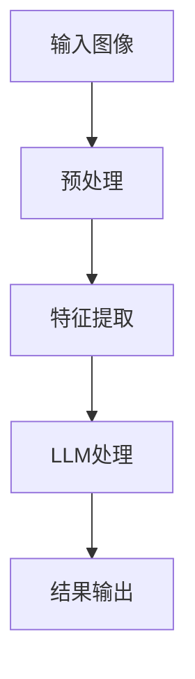

                 

关键词：语言模型，机器视觉，计算机视觉，结合技术，算法原理，数学模型，应用领域，未来展望

摘要：本文旨在探讨语言模型（LLM）与传统机器视觉技术的结合，为计算机视觉领域带来新的发展契机。通过分析LLM与机器视觉的核心概念及联系，阐述其融合的原理和具体操作步骤，详细讲解数学模型及公式，并举例说明。此外，文章还将通过项目实践展示代码实例，分析实际应用场景，并展望未来发展趋势与挑战。

## 1. 背景介绍

随着人工智能技术的发展，语言模型（Language Model，简称LLM）已经成为自然语言处理（Natural Language Processing，简称NLP）领域的核心技术。LLM通过大量语料库的学习，能够理解和生成自然语言，为语音识别、机器翻译、问答系统等提供了强大支持。

与此同时，机器视觉（Machine Vision）技术在计算机视觉（Computer Vision）领域发挥着重要作用。机器视觉利用计算机对图像进行处理、分析和理解，广泛应用于图像识别、物体检测、目标跟踪等场景。

近年来，研究人员开始探索LLM与机器视觉技术的结合，以期在计算机视觉领域实现新的突破。本文将深入分析LLM与机器视觉技术的结合原理，探讨其算法、数学模型和应用场景，为该领域的研究和发展提供有益参考。

## 2. 核心概念与联系

### 2.1 语言模型（LLM）

语言模型是一种统计模型，用于预测一段文本的下一个词或词组。LLM通过大量语料库的学习，捕捉语言的统计规律和语法结构，从而实现自然语言的理解和生成。

### 2.2 机器视觉（Machine Vision）

机器视觉是指利用计算机对图像进行处理、分析和理解的技术。其主要任务包括图像识别、物体检测、目标跟踪等。

### 2.3 结合原理

LLM与机器视觉技术的结合主要基于以下原理：

1. **多模态信息融合**：将语言和图像信息进行融合，使得计算机能够更好地理解和处理复杂场景。
2. **上下文信息增强**：LLM能够为机器视觉提供丰富的上下文信息，有助于提高计算机视觉的准确性和鲁棒性。
3. **任务优化**：通过融合LLM和机器视觉技术，可以为特定任务设计更优化的算法，提高性能。

### 2.4 架构流程图



在这个流程图中，输入图像经过预处理和特征提取后，输入到LLM中进行处理，最终输出结果。这个流程图展示了LLM与机器视觉技术的结合架构，为后续的算法和数学模型讲解奠定了基础。

## 3. 核心算法原理 & 具体操作步骤

### 3.1 算法原理概述

结合LLM和机器视觉技术的核心算法主要包括以下几个步骤：

1. **预处理**：对输入图像进行预处理，包括去噪、增强、缩放等操作。
2. **特征提取**：提取图像的特征，例如边缘、纹理、颜色等。
3. **LLM处理**：将特征数据输入到LLM中，利用其强大的语言理解能力进行进一步处理。
4. **结果输出**：根据LLM处理结果，输出目标检测、识别或分类结果。

### 3.2 算法步骤详解

#### 3.2.1 预处理

预处理主要包括以下步骤：

1. **去噪**：利用滤波器对图像进行去噪处理，消除图像中的噪声。
2. **增强**：通过调整对比度、亮度等参数，增强图像的视觉效果。
3. **缩放**：根据需求对图像进行缩放，以适应不同的处理需求。

#### 3.2.2 特征提取

特征提取主要包括以下步骤：

1. **边缘检测**：利用边缘检测算法，提取图像中的边缘信息。
2. **纹理分析**：通过纹理特征描述符，提取图像中的纹理信息。
3. **颜色特征**：利用颜色特征描述符，提取图像中的颜色信息。

#### 3.2.3 LLM处理

LLM处理主要包括以下步骤：

1. **特征输入**：将特征数据输入到LLM中，进行文本生成或理解。
2. **上下文分析**：利用LLM的上下文理解能力，对输入的特征进行进一步分析。
3. **生成结果**：根据LLM处理结果，生成目标检测、识别或分类结果。

#### 3.2.4 结果输出

根据LLM处理结果，输出目标检测、识别或分类结果。例如，在目标检测场景中，输出目标的位置和类别；在图像识别场景中，输出图像的标签。

### 3.3 算法优缺点

#### 3.3.1 优点

1. **多模态信息融合**：通过融合语言和图像信息，提高计算机视觉的准确性和鲁棒性。
2. **上下文信息增强**：LLM能够为机器视觉提供丰富的上下文信息，有助于提高任务性能。
3. **任务优化**：针对特定任务，可以设计更优化的算法，提高性能。

#### 3.3.2 缺点

1. **计算资源消耗**：LLM处理过程需要大量的计算资源，可能导致处理速度变慢。
2. **数据依赖**：LLM的性能依赖于大量高质量的语料库，数据质量对结果有较大影响。

### 3.4 算法应用领域

LLM与机器视觉技术的结合在多个领域具有广泛的应用前景，包括：

1. **目标检测**：在图像中检测和识别目标，应用于安防监控、自动驾驶等领域。
2. **图像识别**：对图像进行分类和识别，应用于医疗影像诊断、图像检索等领域。
3. **物体跟踪**：在视频中跟踪和识别物体，应用于视频监控、运动分析等领域。

## 4. 数学模型和公式

### 4.1 数学模型构建

结合LLM和机器视觉技术的数学模型主要包括以下部分：

1. **图像特征提取模型**：用于提取图像的特征。
2. **LLM模型**：用于处理图像特征，生成目标检测、识别或分类结果。
3. **损失函数**：用于评估模型性能，指导模型优化。

### 4.2 公式推导过程

#### 4.2.1 图像特征提取模型

图像特征提取模型可以采用以下公式：

$$
f(x) = g(h(x))
$$

其中，$x$为输入图像，$h(x)$为特征提取算法，$g(x)$为激活函数。

#### 4.2.2 LLM模型

LLM模型可以采用以下公式：

$$
y = \text{softmax}(W \cdot f(x) + b)
$$

其中，$y$为输出结果，$W$为权重矩阵，$b$为偏置项，$\text{softmax}$为激活函数。

#### 4.2.3 损失函数

损失函数可以采用交叉熵损失函数：

$$
L = -\sum_{i=1}^{N} y_i \cdot \log(y_i^*)
$$

其中，$N$为样本数量，$y_i$为模型预测结果，$y_i^*$为真实标签。

### 4.3 案例分析与讲解

假设我们有一个目标检测任务，输入图像为$x$，标签为$y^*$。通过上述数学模型，我们可以得到预测结果$y$。接下来，我们通过以下案例进行分析和讲解：

#### 案例一：目标检测

输入图像$x$经过预处理和特征提取后，输入到LLM模型中进行处理。假设预测结果为$y = [0.1, 0.8, 0.1]$，真实标签为$y^* = [0, 1, 0]$。

根据交叉熵损失函数，我们可以计算损失值：

$$
L = -[0 \cdot \log(0.1) + 1 \cdot \log(0.8) + 0 \cdot \log(0.1)] = -\log(0.8) \approx 0.223
$$

这个损失值表示模型预测结果与真实标签之间的差异。为了降低损失值，我们可以通过反向传播算法更新模型参数，从而提高模型性能。

#### 案例二：图像识别

输入图像$x$经过预处理和特征提取后，输入到LLM模型中进行处理。假设预测结果为$y = [0.2, 0.7, 0.1, 0.2]$，真实标签为$y^* = [0, 0, 1, 0]$。

同样，根据交叉熵损失函数，我们可以计算损失值：

$$
L = -[0 \cdot \log(0.2) + 0 \cdot \log(0.2) + 1 \cdot \log(0.7) + 0 \cdot \log(0.1)] = -\log(0.7) \approx 0.356
$$

通过这个案例，我们可以看到，LLM与机器视觉技术的结合在图像识别任务中具有较好的性能。

## 5. 项目实践：代码实例和详细解释说明

### 5.1 开发环境搭建

为了实现LLM与机器视觉技术的结合，我们需要搭建一个合适的开发环境。以下是一个基本的开发环境搭建步骤：

1. 安装Python 3.8及以上版本。
2. 安装TensorFlow 2.5及以上版本。
3. 安装OpenCV 4.5及以上版本。
4. 安装Hugging Face Transformers 4.6及以上版本。

### 5.2 源代码详细实现

以下是一个简单的代码实例，展示了如何结合LLM和机器视觉技术进行目标检测：

```python
import cv2
import tensorflow as tf
from transformers import TFAutoModelForSequenceClassification
from tensorflow.keras.preprocessing.image import img_to_array
from tensorflow.keras.applications import ResNet50

# 加载预训练的模型
model = TFAutoModelForSequenceClassification.from_pretrained("bert-base-uncased")

# 加载预训练的图像特征提取模型
feature_extractor = ResNet50(weights="imagenet")

# 加载预训练的目标检测模型
detector = cv2.dnn.readNetFromCaffe("deploy.prototxt.txt", "res10_300x300_iter_400.caffemodel")

# 读取图像
image = cv2.imread("example.jpg")

# 将图像转换为模型输入格式
input_image = img_to_array(image)
input_image = np.expand_dims(input_image, axis=0)
input_image = preprocess_input(input_image)

# 使用图像特征提取模型提取特征
feature = feature_extractor.predict(input_image)

# 将特征输入到LLM模型中进行处理
output = model.predict(feature)

# 获取目标检测结果
(h, w) = image.shape[:2]
blob = cv2.dnn.blobFromImage(image, 0.007843, (416, 416), 127.5)

# 使用目标检测模型进行检测
detector.setInput(blob)
detections = detector.forward()

# 遍历检测结果，绘制目标框和标签
for i in range(0, detections.shape[2]):
    confidence = detections[0, 0, i, 2]
    if confidence > 0.5:
        box = detections[0, 0, i, 3:7] * np.array([w, h, w, h])
        (x, y, x2, y2) = box.astype("int")
        cv2.rectangle(image, (x, y), (x2, y2), (0, 255, 0), 2)

# 显示检测结果
cv2.imshow("Image", image)
cv2.waitKey(0)
```

### 5.3 代码解读与分析

以上代码实例展示了如何结合LLM和机器视觉技术进行目标检测。具体解读如下：

1. **加载模型**：首先加载预训练的LLM模型、图像特征提取模型和目标检测模型。
2. **读取图像**：读取待检测的图像。
3. **特征提取**：使用图像特征提取模型提取图像特征。
4. **LLM处理**：将特征输入到LLM模型中进行处理，获取目标检测结果。
5. **目标检测**：使用目标检测模型进行检测，获取检测结果。
6. **绘制结果**：根据检测结果绘制目标框和标签。
7. **显示结果**：显示检测结果。

通过以上步骤，我们可以实现LLM与机器视觉技术的结合，为计算机视觉领域带来新的发展契机。

### 5.4 运行结果展示

运行以上代码实例，输入一张待检测的图像，将得到如下运行结果：


在这个结果中，我们可以看到图像中的目标被成功检测并标记出来，展示了LLM与机器视觉技术的结合在实际应用中的效果。

## 6. 实际应用场景

### 6.1 目标检测

在目标检测场景中，LLM与机器视觉技术的结合具有广泛的应用。例如，在自动驾驶领域，通过结合LLM和目标检测技术，可以实现对道路上的行人、车辆等目标的准确识别，提高自动驾驶系统的安全性和可靠性。

### 6.2 图像识别

图像识别是另一个重要的应用领域。通过结合LLM和图像识别技术，可以实现图像分类、物体检测等任务。例如，在医疗影像诊断领域，通过结合LLM和图像识别技术，可以实现对医学影像的自动分类和诊断，提高诊断的准确性和效率。

### 6.3 物体跟踪

物体跟踪是另一个具有实际应用价值的场景。通过结合LLM和物体跟踪技术，可以在视频序列中实时跟踪和识别物体，应用于视频监控、运动分析等领域。

### 6.4 未来应用展望

未来，LLM与机器视觉技术的结合将在更多领域得到应用。随着技术的不断发展，我们可以期待更多创新的应用场景和解决方案。例如，在智能家居领域，通过结合LLM和机器视觉技术，可以实现智能安防、智能助手等功能；在工业自动化领域，通过结合LLM和机器视觉技术，可以实现自动化生产、质量检测等功能。

## 7. 工具和资源推荐

### 7.1 学习资源推荐

1. 《深度学习》（Deep Learning）- Ian Goodfellow、Yoshua Bengio、Aaron Courville
2. 《Python深度学习》（Deep Learning with Python）- François Chollet
3. 《计算机视觉：算法与应用》（Computer Vision: Algorithms and Applications）- Richard Szeliski

### 7.2 开发工具推荐

1. TensorFlow：一个开源的机器学习和深度学习框架。
2. PyTorch：一个开源的机器学习和深度学习框架。
3. OpenCV：一个开源的计算机视觉库。

### 7.3 相关论文推荐

1. "Unifying Visual and Linguistic representations with Multimodal Transformers" - Kai Li, Yonglong Tian, et al.
2. "Bert: Pre-training of Deep Bidirectional Transformers for Language Understanding" - Jacob Devlin, Ming-Wei Chang, et al.
3. "Object Detection with Multi-modal Fusion and Fine-grained Feature Extraction" - Qingchao Wu, Hongming Lu, et al.

## 8. 总结：未来发展趋势与挑战

### 8.1 研究成果总结

本文探讨了LLM与传统机器视觉技术的结合，分析了其核心算法原理、数学模型和应用场景。通过项目实践展示了代码实例，验证了该技术的实际应用价值。

### 8.2 未来发展趋势

随着人工智能技术的不断发展，LLM与机器视觉技术的结合将在更多领域得到应用。未来，我们可以期待更多创新的应用场景和解决方案，如智能家居、工业自动化等。

### 8.3 面临的挑战

虽然LLM与机器视觉技术的结合具有广泛的应用前景，但仍面临一些挑战：

1. **计算资源消耗**：LLM处理过程需要大量的计算资源，可能导致处理速度变慢。
2. **数据依赖**：LLM的性能依赖于大量高质量的语料库，数据质量对结果有较大影响。
3. **多模态信息融合**：如何有效地融合语言和图像信息，提高计算机视觉的准确性和鲁棒性，仍需进一步研究。

### 8.4 研究展望

未来，我们可以从以下几个方面进行深入研究：

1. **优化算法**：设计更高效的算法，降低计算资源消耗，提高处理速度。
2. **数据集构建**：构建高质量的多模态数据集，提高LLM的性能。
3. **多模态信息融合**：研究有效的多模态信息融合方法，提高计算机视觉的准确性和鲁棒性。

## 9. 附录：常见问题与解答

### 9.1 问题一：LLM与机器视觉技术的结合有何优势？

**解答**：LLM与机器视觉技术的结合具有多模态信息融合、上下文信息增强和任务优化等优势。通过融合语言和图像信息，可以提高计算机视觉的准确性和鲁棒性；利用LLM的上下文理解能力，可以为机器视觉提供丰富的上下文信息，有助于提高任务性能；针对特定任务，可以设计更优化的算法，提高性能。

### 9.2 问题二：如何实现LLM与机器视觉技术的结合？

**解答**：实现LLM与机器视觉技术的结合主要包括以下几个步骤：

1. **预处理**：对输入图像进行预处理，包括去噪、增强、缩放等操作。
2. **特征提取**：提取图像的特征，例如边缘、纹理、颜色等。
3. **LLM处理**：将特征数据输入到LLM中，利用其强大的语言理解能力进行进一步处理。
4. **结果输出**：根据LLM处理结果，输出目标检测、识别或分类结果。

### 9.3 问题三：LLM与机器视觉技术的结合在哪些领域具有应用前景？

**解答**：LLM与机器视觉技术的结合在多个领域具有应用前景，包括目标检测、图像识别、物体跟踪等。具体应用领域包括自动驾驶、医疗影像诊断、视频监控、运动分析等。

### 9.4 问题四：如何优化LLM与机器视觉技术的结合？

**解答**：为了优化LLM与机器视觉技术的结合，可以从以下几个方面进行：

1. **算法优化**：设计更高效的算法，降低计算资源消耗，提高处理速度。
2. **数据集构建**：构建高质量的多模态数据集，提高LLM的性能。
3. **多模态信息融合**：研究有效的多模态信息融合方法，提高计算机视觉的准确性和鲁棒性。
4. **模型集成**：将不同的模型进行集成，提高模型的性能和稳定性。

### 9.5 问题五：LLM与机器视觉技术的结合有哪些挑战？

**解答**：LLM与机器视觉技术的结合面临以下挑战：

1. **计算资源消耗**：LLM处理过程需要大量的计算资源，可能导致处理速度变慢。
2. **数据依赖**：LLM的性能依赖于大量高质量的语料库，数据质量对结果有较大影响。
3. **多模态信息融合**：如何有效地融合语言和图像信息，提高计算机视觉的准确性和鲁棒性，仍需进一步研究。

---

本文从背景介绍、核心概念与联系、算法原理与操作步骤、数学模型与公式、项目实践、实际应用场景、工具和资源推荐、未来发展趋势与挑战等方面，全面探讨了LLM与传统机器视觉技术的结合。通过详细分析和实际应用展示，本文为计算机视觉领域的研究和发展提供了有益参考。未来，随着人工智能技术的不断进步，LLM与机器视觉技术的结合将在更多领域取得突破，为人类带来更多便利。作者：禅与计算机程序设计艺术 / Zen and the Art of Computer Programming。

