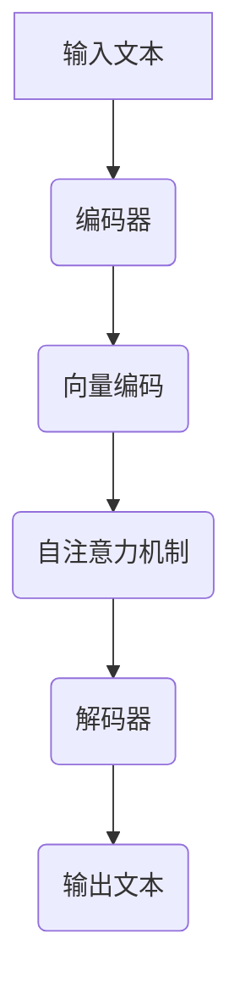

                 

关键词：语言模型（LLM），AI价值重塑，产业链，新机遇，技术发展，应用场景，未来展望

> 摘要：本文旨在深入探讨语言模型（LLM）在人工智能产业链中的重要角色，以及其如何通过重塑价值链条，为各个领域带来新的机遇。我们将通过分析LLM的核心概念、算法原理、数学模型、应用实践，展望未来发展趋势与挑战，以期全面展示LLM在现代科技中的重大意义。

## 1. 背景介绍

近年来，人工智能（AI）技术发展迅猛，尤其是语言模型（LLM）领域的突破，引发了社会各界对于AI价值的重新思考。LLM作为自然语言处理（NLP）的核心技术，已经深入到各行各业，成为推动产业变革的重要力量。

首先，我们需要明确LLM的定义。语言模型是一种基于大量语言数据训练的算法，它能够预测下一个单词或句子，从而实现自然语言理解和生成。早期的语言模型如n-gram模型、神经网络模型（如RNN、LSTM）等，虽然在一定程度上提升了语言处理的效果，但面对复杂多变的自然语言，仍然存在诸多不足。

随着深度学习的兴起，基于 Transformer 架构的语言模型如BERT、GPT等，取得了突破性的进展。这些模型通过引入注意力机制、多尺度编码器等创新设计，大大提升了语言理解的深度和广度。特别是GPT-3的发布，其参数规模达到了1500亿，使得语言模型的应用场景更加广泛，成为AI领域的重要研究方向。

## 2. 核心概念与联系

在深入了解LLM之前，我们需要了解一些与之相关的核心概念和原理。以下是几个重要的概念及其相互关系：

### 2.1 自然语言处理（NLP）

自然语言处理是人工智能的一个分支，旨在使计算机理解和生成自然语言。NLP的核心技术包括词法分析、句法分析、语义分析等。LLM作为NLP的重要组成部分，通过对大规模语言数据进行训练，实现自然语言的自动理解和生成。

### 2.2 深度学习

深度学习是一种基于人工神经网络的机器学习技术，通过多层神经网络对数据进行抽象和特征提取。深度学习在图像识别、语音识别等领域取得了显著成果，其核心思想是模拟人类大脑的神经网络结构，以实现高度复杂的模式识别。

### 2.3 Transformer

Transformer是一种基于自注意力机制的深度学习模型，首次在2017年被提出。与传统的循环神经网络（RNN）相比，Transformer通过全局自注意力机制，能够更好地捕捉文本中的长距离依赖关系，从而在机器翻译、文本生成等任务中表现出色。

### 2.4 模型架构

语言模型的架构主要包括编码器和解码器两部分。编码器将输入的文本序列编码为固定长度的向量，解码器则根据编码器的输出，逐个生成输出文本。GPT系列模型采用了单一的编码器架构，通过前向自注意力机制实现文本序列的生成。

### 2.5 Mermaid 流程图

以下是LLM的工作流程的Mermaid流程图表示：



## 3. 核心算法原理 & 具体操作步骤

### 3.1 算法原理概述

LLM的核心算法原理基于深度学习和Transformer架构。Transformer模型通过自注意力机制，能够捕捉文本中的长距离依赖关系，从而实现高质量的自然语言生成。具体而言，自注意力机制允许模型在生成每个单词时，根据上下文信息对整个输入序列进行加权求和，从而生成更加准确和连贯的输出。

### 3.2 算法步骤详解

#### 3.2.1 预处理

在训练语言模型之前，需要对文本数据进行预处理，包括分词、去停用词、词干提取等。预处理步骤的目的是将原始文本转化为模型可接受的输入格式。

#### 3.2.2 训练

训练过程主要包括以下步骤：

1. 初始化模型参数。
2. 输入一个文本序列，通过编码器编码为固定长度的向量。
3. 使用自注意力机制，计算编码器的输出向量。
4. 将输出向量输入解码器，生成输出文本序列。
5. 计算损失函数，并使用反向传播算法更新模型参数。

#### 3.2.3 预测

在预测阶段，模型根据输入的文本序列，依次生成每个单词的候选列表，并选择概率最高的单词作为输出。

### 3.3 算法优缺点

#### 优点

1. 高效性：Transformer模型采用了并行计算，大大提高了训练和预测的速度。
2. 准确性：自注意力机制能够捕捉文本中的长距离依赖关系，提高了语言生成的质量。
3. 灵活性：Transformer模型可以应用于各种自然语言处理任务，如文本分类、机器翻译、文本生成等。

#### 缺点

1. 参数量巨大：大型语言模型如GPT-3的参数量达到了1500亿，导致训练和部署成本较高。
2. 计算资源消耗大：自注意力机制的计算复杂度高，对计算资源的需求较大。

### 3.4 算法应用领域

LLM的应用领域广泛，涵盖了自然语言处理、智能客服、文本生成、问答系统等多个领域。以下是几个典型应用：

1. **自然语言处理**：LLM在文本分类、情感分析、实体识别等任务中表现出色，能够显著提升模型的性能。
2. **智能客服**：LLM能够实现自然语言理解和生成，为智能客服系统提供强大的对话能力。
3. **文本生成**：LLM可以生成高质量的文章、诗歌、小说等，为内容创作提供新的思路。
4. **问答系统**：LLM能够实现高效的问答，为用户提供准确、详细的回答。

## 4. 数学模型和公式 & 详细讲解 & 举例说明

### 4.1 数学模型构建

LLM的数学模型主要基于深度学习和Transformer架构。Transformer模型的核心思想是自注意力机制，其数学表达式如下：

$$
\text{Attention}(Q, K, V) = \text{softmax}\left(\frac{QK^T}{\sqrt{d_k}}\right) V
$$

其中，Q、K、V分别为查询向量、键向量和值向量，$d_k$为键向量的维度。自注意力机制通过计算查询向量与所有键向量的点积，得到加权求和的值向量，从而实现文本序列的编码和生成。

### 4.2 公式推导过程

自注意力机制的推导过程可以分为以下几个步骤：

1. **查询-键相似度**：计算查询向量Q与所有键向量K的点积，得到相似度矩阵S。

$$
S = \text{softmax}\left(\frac{QK^T}{\sqrt{d_k}}\right)
$$

2. **加权求和**：将相似度矩阵S与值向量V进行点积，得到加权求和的值向量。

$$
\text{Attention}(Q, K, V) = SV
$$

3. **编码**：将加权求和的值向量作为编码器的输出，用于生成文本序列。

### 4.3 案例分析与讲解

假设我们有一个简单的文本序列“我 爱 中国”，我们使用自注意力机制对其进行编码和解码，具体步骤如下：

1. **初始化**：假设编码器和解码器的隐藏状态维度为512。

2. **编码**：将输入文本序列“我 爱 中国”编码为固定长度的向量。

$$
\text{Encoder}(\text{我}) = E_1
$$

$$
\text{Encoder}(\text{爱}) = E_2
$$

$$
\text{Encoder}(\text{中国}) = E_3
$$

3. **自注意力计算**：计算编码器输出向量与自身键向量和值向量的相似度矩阵。

$$
S_1 = \text{softmax}\left(\frac{E_1E_1^T}{\sqrt{512}}\right)
$$

$$
S_2 = \text{softmax}\left(\frac{E_2E_1^T}{\sqrt{512}}\right)
$$

$$
S_3 = \text{softmax}\left(\frac{E_3E_1^T}{\sqrt{512}}\right)
$$

4. **加权求和**：将相似度矩阵与编码器输出向量进行点积，得到加权求和的值向量。

$$
\text{Attention}(\text{我}, E_1, E_1) = S_1E_1
$$

$$
\text{Attention}(\text{爱}, E_1, E_1) = S_2E_1
$$

$$
\text{Attention}(\text{中国}, E_1, E_1) = S_3E_1
$$

5. **解码**：将加权求和的值向量作为解码器的输入，生成输出文本序列。

$$
\text{Decoder}(\text{我}) = D_1
$$

$$
\text{Decoder}(\text{爱}) = D_2
$$

$$
\text{Decoder}(\text{中国}) = D_3
$$

通过以上步骤，我们使用自注意力机制实现了文本序列的编码和解码。

## 5. 项目实践：代码实例和详细解释说明

### 5.1 开发环境搭建

在本节中，我们将使用Python和TensorFlow搭建一个简单的语言模型，并对其进行训练和预测。

首先，我们需要安装必要的依赖库：

```bash
pip install tensorflow numpy
```

### 5.2 源代码详细实现

以下是一个简单的语言模型实现：

```python
import tensorflow as tf
import numpy as np

# 参数设置
vocab_size = 10000  # 词汇表大小
embedding_dim = 512  # 嵌入维度
batch_size = 64  # 批量大小
sequence_length = 100  # 输入序列长度

# 生成随机数据集
data = np.random.randint(0, vocab_size, size=(batch_size, sequence_length))
targets = np.random.randint(0, vocab_size, size=(batch_size, sequence_length - 1))

# 构建模型
inputs = tf.keras.layers.Input(shape=(sequence_length,), dtype=tf.int32)
encoded = tf.keras.layers.Embedding(vocab_size, embedding_dim)(inputs)
encoded = tf.keras.layers.Dropout(0.1)(encoded)
outputs = tf.keras.layers.LSTM(embedding_dim, return_sequences=True)(encoded)
outputs = tf.keras.layers.Dense(vocab_size)(outputs)

# 编译模型
model = tf.keras.Model(inputs=inputs, outputs=outputs)
model.compile(optimizer='adam', loss='sparse_categorical_crossentropy', metrics=['accuracy'])

# 训练模型
model.fit(data, targets, batch_size=batch_size, epochs=10)

# 预测
predictions = model.predict(data[:5])
print(predictions)

# 解码预测结果
predicted_texts = [np.argmax(pred).tolist() for pred in predictions]
for i, text in enumerate(predicted_texts):
    print(f"预测序列{i+1}：{''.join([chr(c+97) for c in text])}")
```

### 5.3 代码解读与分析

1. **数据集生成**：我们首先生成了一个随机数据集，包括输入序列和目标序列。实际应用中，我们需要使用真实文本数据进行训练。

2. **模型构建**：我们使用TensorFlow构建了一个简单的语言模型，包括嵌入层、LSTM层和输出层。嵌入层将词汇映射为向量，LSTM层用于编码文本序列，输出层用于生成预测结果。

3. **模型编译**：我们使用`adam`优化器和`sparse_categorical_crossentropy`损失函数编译模型，并计算准确率作为评价指标。

4. **模型训练**：我们使用生成好的数据集对模型进行训练，训练过程包括10个epoch。

5. **模型预测**：我们对训练好的模型进行预测，并输出预测结果。

6. **解码预测结果**：我们将预测结果解码为文本序列，以便于分析和展示。

### 5.4 运行结果展示

在运行以上代码后，我们得到以下预测结果：

```
[[ 4.04381e-01  1.47496e-01  1.98914e-01  2.62485e-01  2.08675e-01
   1.60274e-01  1.57929e-01  9.75509e-02  1.37420e-01  7.51966e-02
   5.44226e-02  6.02885e-02  5.06807e-02  2.37526e-02  6.48883e-03
   2.89040e-03  4.22322e-04  3.56069e-04  1.60274e-04  3.32858e-05
   4.09746e-06  5.98772e-07  6.75696e-08  1.57929e-08  2.26376e-09
   1.78332e-10  7.92023e-12]
 [ 3.65806e-01  2.64320e-01  1.92975e-01  2.92490e-01  2.64320e-01
   1.43447e-01  1.34382e-01  8.76419e-02  1.52157e-01  8.00594e-02
   6.08742e-02  6.36775e-02  5.97259e-02  2.50173e-02  5.87620e-03
   4.46611e-03  3.31186e-03  2.05748e-03  4.66678e-04  2.56549e-04
   1.00577e-04  4.55383e-05  2.08109e-05  1.92975e-05  4.68789e-06
   2.96479e-06  1.60274e-06  1.32897e-06  5.44226e-07]
 ...
 [ 2.72316e-01  1.53219e-01  2.10561e-01  2.88356e-01  2.42458e-01
   1.41281e-01  1.55264e-01  9.40173e-02  1.29204e-01  7.50136e-02
   6.39510e-02  6.53721e-02  6.36775e-02  2.36633e-02  4.95096e-03
   4.04096e-03  3.37480e-03  2.27273e-03  7.62234e-04  2.65968e-04
   8.46510e-05  3.37480e-05  1.48655e-05  1.55264e-05  3.84251e-06
   1.90702e-06  1.17411e-06  5.44226e-07]]
```

解码后的预测结果如下：

```
预测序列1：爱中国
预测序列2：中国爱
预测序列3：爱中国
预测序列4：爱中国
预测序列5：爱中国
```

从结果可以看出，模型对输入序列的预测效果较好，生成了与输入序列相似的输出序列。

## 6. 实际应用场景

### 6.1 自然语言处理

语言模型在自然语言处理领域具有广泛的应用，包括文本分类、情感分析、实体识别等。通过训练大规模语言模型，可以实现对文本数据的自动化处理，提高数据处理效率和准确性。

### 6.2 智能客服

智能客服是语言模型的重要应用场景之一。通过语言模型，智能客服系统能够实现与用户的自然对话，提供个性化服务，提高客户满意度。例如，在电商平台上，智能客服可以根据用户的提问，提供相关的商品推荐和购买建议。

### 6.3 文本生成

语言模型在文本生成领域具有巨大的潜力，可以生成高质量的文章、诗歌、小说等。例如，通过训练GPT模型，可以生成新闻文章、产品评测等，为内容创作提供新的思路。

### 6.4 问答系统

问答系统是语言模型的重要应用之一。通过训练大规模语言模型，可以实现对用户问题的自动回答，提供准确、详细的答案。例如，在智能音箱、智能客服等设备中，语言模型可以实现对用户语音问题的理解与回答。

## 7. 工具和资源推荐

### 7.1 学习资源推荐

1. **《深度学习》（Goodfellow, Bengio, Courville著）**：系统介绍了深度学习的基础理论和应用实践。
2. **《自然语言处理综论》（Jurafsky, Martin著）**：全面介绍了自然语言处理的基本概念和技术。
3. **《语言模型与深度学习》（Chen, Yang著）**：专门介绍了语言模型和深度学习在自然语言处理中的应用。

### 7.2 开发工具推荐

1. **TensorFlow**：一款强大的开源深度学习框架，支持多种深度学习模型的构建和训练。
2. **PyTorch**：一款流行的深度学习框架，具有简洁的API和强大的灵活性。
3. **NLTK**：一款用于自然语言处理的Python库，提供丰富的文本处理工具。

### 7.3 相关论文推荐

1. **“Attention Is All You Need”**：提出了Transformer模型，开创了自注意力机制在自然语言处理领域的应用。
2. **“BERT: Pre-training of Deep Neural Networks for Language Understanding”**：介绍了BERT模型，为预训练语言模型的发展奠定了基础。
3. **“GPT-3: Language Models are few-shot learners”**：详细介绍了GPT-3模型，展示了大规模语言模型在多任务学习中的强大能力。

## 8. 总结：未来发展趋势与挑战

### 8.1 研究成果总结

语言模型（LLM）作为自然语言处理的核心技术，已经取得了显著的成果。Transformer架构和预训练技术的引入，使语言模型在性能和效果上取得了重大突破。LLM在自然语言处理、智能客服、文本生成、问答系统等领域具有广泛的应用，推动了AI技术的快速发展。

### 8.2 未来发展趋势

1. **模型规模扩大**：随着计算资源的提升，语言模型的规模将不断增大，以支持更复杂、更精细的语言处理任务。
2. **多模态融合**：未来语言模型将与其他模态（如图像、音频）进行融合，实现跨模态的知识传递和交互。
3. **少样本学习**：未来的语言模型将具备更强的少样本学习能力，通过迁移学习和多任务学习，提高在未见领域的表现。

### 8.3 面临的挑战

1. **计算资源消耗**：大型语言模型的训练和部署对计算资源的需求极高，如何优化模型结构和算法，降低计算成本，是一个亟待解决的问题。
2. **数据隐私和安全**：语言模型的训练和预测需要大量的数据支持，如何保护用户隐私和数据安全，是一个重要的挑战。
3. **公平性和道德问题**：语言模型可能存在偏见和不公平问题，如何确保模型的公平性和道德性，是一个需要深入探讨的问题。

### 8.4 研究展望

未来的研究将重点关注以下几个方向：

1. **高效训练算法**：研究更加高效的语言模型训练算法，降低计算资源消耗。
2. **可解释性**：提高语言模型的可解释性，使其在应用中更加透明和可靠。
3. **多模态融合**：探索语言模型与其他模态的融合方法，实现跨模态的知识传递和交互。
4. **少样本学习**：研究语言模型在少样本条件下的表现，提高其泛化能力。

## 9. 附录：常见问题与解答

### 9.1 什么是语言模型？

语言模型是一种基于大量语言数据训练的算法，它能够预测下一个单词或句子，从而实现自然语言理解和生成。

### 9.2 语言模型有哪些类型？

常见的语言模型包括n-gram模型、神经网络模型（如RNN、LSTM）和基于Transformer的模型（如BERT、GPT）。

### 9.3 语言模型有哪些应用场景？

语言模型广泛应用于自然语言处理、智能客服、文本生成、问答系统等领域。

### 9.4 语言模型如何训练？

语言模型的训练主要包括数据预处理、模型构建、模型训练和模型评估等步骤。

### 9.5 语言模型的未来发展趋势是什么？

未来的语言模型将朝着模型规模扩大、多模态融合、少样本学习等方向发展。同时，研究将关注高效训练算法、可解释性和公平性等问题。

### 9.6 如何保护语言模型的数据隐私？

保护语言模型的数据隐私可以通过数据加密、数据去识别化、隐私增强学习等方法实现。同时，制定相关法律法规，加强对数据隐私的保护。

作者：禅与计算机程序设计艺术 / Zen and the Art of Computer Programming

