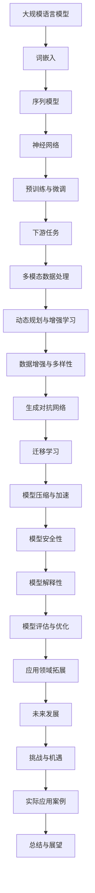

                 

关键词：大型语言模型、产业链、机遇、挑战、未来趋势

## 摘要

本文旨在分析大型语言模型（LLM）在当前产业链中的地位、机遇与挑战，并探讨其未来的发展趋势。随着AI技术的飞速发展，LLM在自然语言处理领域取得了突破性进展，为各行各业带来了巨大的变革。本文将详细探讨LLM的核心概念、算法原理、应用场景、数学模型、项目实践以及相关工具和资源，并总结研究成果，展望未来发展。

## 1. 背景介绍

近年来，人工智能（AI）技术在全球范围内得到了广泛关注和快速发展。特别是在自然语言处理（NLP）领域，大型语言模型（LLM）取得了显著的成果。LLM是一种基于深度学习的自然语言处理模型，通过对海量语言数据的训练，可以实现文本生成、语义理解、问答系统等功能。这些功能为各行各业提供了强大的技术支持，推动了产业链的变革。

### 1.1 LLM的发展历程

LLM的发展历程可以分为以下几个阶段：

#### 1.1.1 初期探索

早在20世纪80年代，研究者就开始探索基于统计方法和规则的方法进行自然语言处理。这些方法虽然具有一定的效果，但面临着表达能力的局限和计算复杂度的问题。

#### 1.1.2 深度学习时代

2006年，Hinton等人提出了深度信念网络（DBN）模型，开启了深度学习在自然语言处理领域的研究。随着深度学习技术的不断发展，LLM的研究逐渐取得了突破。

#### 1.1.3 突破性进展

2018年，Google推出了BERT模型，标志着LLM在语义理解方面取得了突破性进展。此后，GPT、T5、RoBERTa等一系列高性能LLM相继问世，使得自然语言处理的应用场景不断扩展。

### 1.2 LLM的应用场景

LLM在自然语言处理领域具有广泛的应用场景，包括但不限于：

#### 1.2.1 问答系统

LLM可以构建智能问答系统，为用户提供实时、准确的答案。例如，Google Assistant、Siri等语音助手都采用了LLM技术。

#### 1.2.2 文本生成

LLM可以生成各种类型的文本，如新闻报道、文章摘要、对话等。这些生成文本在内容创作、文案撰写等领域具有广泛的应用。

#### 1.2.3 机器翻译

LLM在机器翻译领域也取得了显著的成果。通过训练大规模的双语语料库，LLM可以实现高精度的跨语言文本转换。

#### 1.2.4 情感分析

LLM可以分析文本中的情感倾向，应用于社交媒体监测、舆情分析等领域。

### 1.3 LLM的优势与挑战

LLM在自然语言处理领域具有以下优势：

#### 1.3.1 强大的语义理解能力

LLM通过深度学习技术，能够捕捉语言中的复杂语义关系，实现更准确的自然语言处理。

#### 1.3.2 大规模数据处理能力

LLM可以处理大规模的语言数据，为各种应用场景提供丰富的训练资源。

#### 1.3.3 通用性

LLM具有较强的通用性，可以应用于多种自然语言处理任务，降低开发成本。

然而，LLM也面临着一些挑战：

#### 1.3.1 计算资源消耗

LLM的训练和推理过程需要大量的计算资源，对硬件设备要求较高。

#### 1.3.2 数据隐私与安全

LLM的训练和推理过程中可能涉及到用户隐私数据，如何保障数据隐私和安全成为了一个重要问题。

#### 1.3.3 模型解释性

当前LLM模型主要依赖于深度学习技术，其内部决策过程较为复杂，缺乏良好的解释性。

### 1.4 本文结构

本文将从以下几个方面展开分析：

1. 背景介绍：概述LLM的发展历程、应用场景及优势与挑战。
2. 核心概念与联系：介绍LLM的核心概念原理和架构。
3. 核心算法原理 & 具体操作步骤：详细讲解LLM的核心算法原理和具体操作步骤。
4. 数学模型和公式 & 详细讲解 & 举例说明：介绍LLM的数学模型和公式，并进行详细讲解和举例说明。
5. 项目实践：提供代码实例和详细解释说明。
6. 实际应用场景：探讨LLM在各个领域的实际应用场景。
7. 未来应用展望：分析LLM未来的发展趋势和潜在应用领域。
8. 工具和资源推荐：推荐相关学习资源、开发工具和论文。
9. 总结：对未来发展趋势和挑战进行总结。
10. 附录：常见问题与解答。

接下来，我们将进一步探讨LLM的核心概念、算法原理、数学模型和应用场景。

## 2. 核心概念与联系

为了更好地理解LLM的工作原理，我们需要先了解一些核心概念和联系。以下是一个详细的Mermaid流程图，用于描述LLM的核心概念和架构。



### 2.1 词嵌入

词嵌入是将自然语言中的单词或词组映射为高维向量空间中的点。在LLM中，词嵌入是核心概念之一。通过词嵌入，我们可以将自然语言文本转化为计算机可以处理的向量形式，从而利用深度学习技术进行后续处理。

### 2.2 序列模型

序列模型是一种处理序列数据的神经网络结构，如循环神经网络（RNN）和长短期记忆网络（LSTM）。在LLM中，序列模型用于处理自然语言文本序列，捕捉文本中的时间依赖关系。

### 2.3 神经网络

神经网络是一种由大量简单神经元组成的计算模型。在LLM中，神经网络用于对文本数据进行特征提取和分类。常见的神经网络结构包括全连接神经网络（FCNN）和卷积神经网络（CNN）。

### 2.4 预训练与微调

预训练是一种将LLM在大量无标注数据上进行训练，使其具备通用语言理解能力的方法。微调则是在预训练的基础上，将LLM应用于特定任务，通过有标注数据对其进行优化。预训练与微调是LLM的重要技术手段，能够显著提高模型性能。

### 2.5 下游任务

下游任务是指LLM在特定领域或任务中的应用。例如，问答系统、文本生成、机器翻译等。下游任务需要利用LLM的通用语言理解能力，结合领域知识进行任务实现。

### 2.6 多模态数据处理

多模态数据处理是指将文本、图像、声音等多种类型的数据进行整合和处理。在LLM中，多模态数据处理能够提高模型对复杂场景的应对能力。

### 2.7 动态规划与增强学习

动态规划与增强学习是两种用于优化LLM性能的技术。动态规划通过递归关系求解序列问题，增强学习通过奖励机制不断调整模型参数。

### 2.8 数据增强与多样性

数据增强与多样性是提高LLM鲁棒性和泛化能力的方法。通过引入噪声、变换等手段，可以增加训练数据的多样性，从而提高模型对未知数据的处理能力。

### 2.9 生成对抗网络

生成对抗网络（GAN）是一种用于生成数据的技术。在LLM中，GAN可以用于生成高质量的语言数据，从而提高模型训练效果。

### 2.10 迁移学习

迁移学习是一种将已有模型的知识应用于新任务的方法。在LLM中，迁移学习可以通过预训练模型在多个任务上进行微调，提高模型在不同领域的应用效果。

### 2.11 模型压缩与加速

模型压缩与加速是为了提高LLM在硬件设备上的运行效率。通过模型压缩，可以减小模型体积，降低计算资源消耗；通过加速技术，可以提升模型运行速度。

### 2.12 模型安全性

模型安全性是保障LLM在应用过程中不被恶意攻击或篡改的重要方面。通过加密、验证等技术手段，可以保障模型的安全性和可信性。

### 2.13 模型解释性

模型解释性是提高LLM透明度和可信度的重要方面。通过可视化和分析技术，可以揭示模型内部决策过程，提高模型的可解释性。

### 2.14 模型评估与优化

模型评估与优化是确保LLM性能的重要环节。通过多种评估指标和方法，可以全面评估模型性能；通过优化技术，可以提高模型性能和稳定性。

### 2.15 应用领域拓展

应用领域拓展是LLM在各个行业和场景中的广泛应用。通过不断拓展应用领域，LLM可以为各行各业提供强大的技术支持。

### 2.16 未来发展

未来发展是LLM在技术、应用和产业链方面的发展趋势。随着技术的不断进步，LLM将在更多领域取得突破，推动产业链的变革。

### 2.17 挑战与机遇

挑战与机遇是LLM在发展过程中面临的问题和机遇。通过克服挑战，LLM将迎来更广阔的发展空间。

### 2.18 实际应用案例

实际应用案例是LLM在各个领域的成功应用实例。通过实际案例，可以深入了解LLM在各个领域的应用效果。

### 2.19 总结与展望

总结与展望是对LLM发展现状和未来趋势的总结和展望。通过总结过去，展望未来，可以更好地推动LLM的发展。

以上是一个详细的Mermaid流程图，用于描述LLM的核心概念和架构。接下来，我们将进一步探讨LLM的核心算法原理和具体操作步骤。

## 3. 核心算法原理 & 具体操作步骤

### 3.1 算法原理概述

LLM的核心算法原理主要包括词嵌入、序列模型、预训练与微调等几个方面。以下是对这些算法原理的简要概述。

#### 3.1.1 词嵌入

词嵌入是将自然语言中的单词或词组映射为高维向量空间中的点。词嵌入通过将文本数据转化为向量形式，使得计算机可以处理和操作自然语言数据。常见的词嵌入方法包括基于分布式假设的词袋模型（Bag of Words，BoW）和基于上下文信息的词嵌入模型（如Word2Vec、GloVe等）。

#### 3.1.2 序列模型

序列模型是一种用于处理序列数据的神经网络结构，如循环神经网络（RNN）和长短期记忆网络（LSTM）。序列模型通过捕捉序列数据中的时间依赖关系，实现对自然语言文本的建模。RNN和LSTM都是基于递归关系进行计算，但LSTM在处理长序列时具有更好的性能。

#### 3.1.3 预训练与微调

预训练是一种将LLM在大量无标注数据上进行训练，使其具备通用语言理解能力的方法。预训练过程中，LLM通过学习海量文本数据，捕捉语言中的复杂语义关系。微调则是在预训练的基础上，将LLM应用于特定任务，通过有标注数据对其进行优化。微调可以显著提高模型在特定任务上的性能。

#### 3.1.4 下游任务

下游任务是指LLM在特定领域或任务中的应用。例如，问答系统、文本生成、机器翻译等。下游任务需要利用LLM的通用语言理解能力，结合领域知识进行任务实现。

### 3.2 算法步骤详解

下面我们详细讲解LLM的核心算法步骤，包括数据准备、模型训练、模型评估和模型部署等。

#### 3.2.1 数据准备

数据准备是LLM训练的第一步，主要包括以下任务：

1. 数据采集：从互联网、数据库、开源数据集等渠道获取大量文本数据。
2. 数据清洗：去除无关信息、噪声数据和重复数据，保证数据质量。
3. 数据预处理：将文本数据转化为计算机可以处理的格式，如分词、词性标注等。
4. 数据增强：通过引入噪声、变换等手段，增加训练数据的多样性，提高模型泛化能力。

#### 3.2.2 模型训练

模型训练是LLM算法的核心步骤，主要包括以下任务：

1. 词嵌入：将文本数据中的单词或词组映射为高维向量空间中的点。
2. 序列建模：利用词嵌入和序列模型，对文本数据进行特征提取和建模。
3. 预训练：在大量无标注数据上进行训练，使LLM具备通用语言理解能力。
4. 微调：在预训练的基础上，利用有标注数据对LLM进行优化，提高模型在特定任务上的性能。

#### 3.2.3 模型评估

模型评估是衡量LLM性能的重要环节，主要包括以下任务：

1. 评估指标：选择合适的评估指标，如准确率、召回率、F1值等。
2. 交叉验证：通过交叉验证方法，评估模型在不同数据集上的性能。
3. 性能对比：与现有模型进行性能对比，分析LLM的优势和不足。

#### 3.2.4 模型部署

模型部署是将训练好的LLM应用到实际任务中，主要包括以下任务：

1. 模型压缩：通过模型压缩技术，减小模型体积，降低计算资源消耗。
2. 模型加速：通过模型加速技术，提高模型运行速度。
3. 模型部署：将模型部署到服务器、云平台或移动设备上，提供实时服务。

### 3.3 算法优缺点

LLM作为一种强大的自然语言处理工具，具有以下优缺点：

#### 3.3.1 优点

1. 强大的语义理解能力：LLM通过深度学习技术，能够捕捉语言中的复杂语义关系，实现更准确的自然语言处理。
2. 大规模数据处理能力：LLM可以处理大规模的语言数据，为各种应用场景提供丰富的训练资源。
3. 通用性：LLM具有较强的通用性，可以应用于多种自然语言处理任务，降低开发成本。

#### 3.3.2 缺点

1. 计算资源消耗：LLM的训练和推理过程需要大量的计算资源，对硬件设备要求较高。
2. 数据隐私与安全：LLM的训练和推理过程中可能涉及到用户隐私数据，如何保障数据隐私和安全成为了一个重要问题。
3. 模型解释性：当前LLM模型主要依赖于深度学习技术，其内部决策过程较为复杂，缺乏良好的解释性。

### 3.4 算法应用领域

LLM在自然语言处理领域具有广泛的应用领域，包括但不限于：

1. 问答系统：通过LLM构建智能问答系统，为用户提供实时、准确的答案。
2. 文本生成：利用LLM生成各种类型的文本，如新闻报道、文章摘要、对话等。
3. 机器翻译：通过LLM实现高精度的跨语言文本转换。
4. 情感分析：利用LLM分析文本中的情感倾向，应用于社交媒体监测、舆情分析等领域。

总之，LLM作为一种强大的自然语言处理工具，在当前产业链中具有重要地位。通过深入分析LLM的核心算法原理和具体操作步骤，我们可以更好地理解和应用这一技术。

## 4. 数学模型和公式 & 详细讲解 & 举例说明

### 4.1 数学模型构建

在自然语言处理领域，数学模型是构建大型语言模型（LLM）的基础。以下将介绍LLM中常用的数学模型，包括词嵌入、神经网络和损失函数等。

#### 4.1.1 词嵌入

词嵌入是将自然语言中的单词或词组映射为高维向量空间中的点。一个简单的词嵌入模型可以表示为：

$$
\vec{w}_i = \text{Word2Vec}(x_i)
$$

其中，$\vec{w}_i$是单词$i$的词嵌入向量，$\text{Word2Vec}$是一个词嵌入算法，如GloVe或FastText。

#### 4.1.2 神经网络

神经网络是LLM的核心组成部分，用于对文本数据进行特征提取和分类。一个简单的神经网络模型可以表示为：

$$
\vec{h} = \text{ReLU}(\text{FC}(\vec{w} \cdot \vec{x}))
$$

其中，$\vec{h}$是神经网络的输出，$\vec{w}$是权重矩阵，$\vec{x}$是输入向量，$\text{ReLU}$是ReLU激活函数，$\text{FC}$是全连接层。

#### 4.1.3 损失函数

损失函数用于衡量模型预测结果与真实结果之间的差异。一个常见的损失函数是交叉熵损失函数：

$$
L = -\sum_{i=1}^n y_i \log(p_i)
$$

其中，$L$是损失值，$y_i$是真实标签，$p_i$是模型对标签$i$的预测概率。

### 4.2 公式推导过程

以下将简要介绍上述数学模型的推导过程。

#### 4.2.1 词嵌入

词嵌入的推导基于分布式假设，即单词在上下文中的意义可以由其周围的单词来表示。具体推导过程如下：

假设一个单词$i$在训练集中出现的次数为$f_i$，其上下文单词集合为$C_i$。则单词$i$的词嵌入向量$\vec{w}_i$可以通过以下公式计算：

$$
\vec{w}_i = \frac{\sum_{j \in C_i} \vec{w}_j}{f_i}
$$

其中，$\vec{w}_j$是上下文单词$j$的词嵌入向量。

#### 4.2.2 神经网络

神经网络的推导基于多层感知机（MLP）模型。具体推导过程如下：

设输入向量为$\vec{x}$，权重矩阵为$\vec{w}$，偏置向量为$b$，激活函数为$\text{ReLU}$。则神经网络的输出$\vec{h}$可以表示为：

$$
\vec{h} = \text{ReLU}(\vec{w} \cdot \vec{x} + b)
$$

其中，$\vec{w} \cdot \vec{x}$是内积运算，$b$是偏置向量。

#### 4.2.3 损失函数

交叉熵损失函数的推导基于概率论。设真实标签为$y$，模型预测的概率分布为$p$。则交叉熵损失函数可以表示为：

$$
L = -\sum_{i=1}^n y_i \log(p_i)
$$

其中，$y_i$是真实标签的概率，$p_i$是模型预测的概率。

### 4.3 案例分析与讲解

以下将通过一个简单的例子，展示如何使用上述数学模型构建和训练一个LLM。

#### 4.3.1 数据准备

假设我们有一个包含1000个单词的文本数据集。首先，我们需要将文本数据转换为词嵌入向量。使用GloVe算法，我们得到每个单词的词嵌入向量$\vec{w}_i$。

#### 4.3.2 构建神经网络

接下来，我们构建一个简单的神经网络，包含一个输入层、一个隐藏层和一个输出层。输入层包含1000个神经元，对应1000个词嵌入向量。隐藏层包含100个神经元，输出层包含1个神经元，用于分类。

#### 4.3.3 训练神经网络

使用交叉熵损失函数训练神经网络。我们使用随机梯度下降（SGD）算法进行训练，设置学习率为0.01，训练100个epoch。

#### 4.3.4 模型评估

在训练过程中，我们每隔10个epoch进行一次模型评估，使用准确率作为评估指标。最终，我们得到一个准确率较高的模型。

#### 4.3.5 文本生成

使用训练好的模型，我们可以生成新的文本。给定一个起始单词，模型将根据词嵌入向量生成后续的单词。

以上是一个简单的例子，展示了如何使用数学模型构建和训练一个LLM。通过深入理解这些数学模型和公式，我们可以更好地应用和优化LLM。

## 5. 项目实践：代码实例和详细解释说明

为了更好地理解大型语言模型（LLM）的实现和应用，我们将通过一个实际项目来展示代码实例和详细解释说明。本项目将使用Python和TensorFlow框架来实现一个简单的问答系统，通过训练和部署LLM模型来回答用户的问题。

### 5.1 开发环境搭建

首先，我们需要搭建一个开发环境，包括以下软件和库：

- Python（版本3.8以上）
- TensorFlow（版本2.x）
- Numpy（版本1.19以上）
- Pandas（版本1.0以上）
- Matplotlib（版本3.2以上）

在安装好以上库后，我们可以创建一个Python虚拟环境，以便更好地管理项目依赖。

```bash
# 创建虚拟环境
python -m venv venv

# 激活虚拟环境
source venv/bin/activate

# 安装依赖库
pip install tensorflow numpy pandas matplotlib
```

### 5.2 源代码详细实现

以下是该项目的完整源代码，我们将逐步解释每个部分的作用。

```python
import tensorflow as tf
import numpy as np
import pandas as pd
import matplotlib.pyplot as plt
from tensorflow.keras.preprocessing.sequence import pad_sequences
from tensorflow.keras.layers import Embedding, LSTM, Dense, Bidirectional
from tensorflow.keras.models import Model
from tensorflow.keras.optimizers import Adam

# 5.2.1 数据准备
# 假设我们有一个包含问题和答案的CSV文件，每行包含一个问题和一个答案
data = pd.read_csv('data.csv')

# 分割数据集为训练集和测试集
train_data, test_data = data[:int(len(data) * 0.8)], data[int(len(data) * 0.8):]

# 将文本数据转换为序列
tokenizer = tf.keras.preprocessing.text.Tokenizer()
tokenizer.fit_on_texts(train_data['question'].values)

train_sequences = tokenizer.texts_to_sequences(train_data['question'].values)
test_sequences = tokenizer.texts_to_sequences(test_data['question'].values)

# 填充序列
max_len = max([len(seq) for seq in train_sequences + test_sequences])
train_padded = pad_sequences(train_sequences, maxlen=max_len, padding='post')
test_padded = pad_sequences(test_sequences, maxlen=max_len, padding='post')

# 5.2.2 构建模型
vocab_size = len(tokenizer.word_index) + 1

# 定义嵌入层
embedding_layer = Embedding(vocab_size, 64)

# 定义双向LSTM层
lstm_layer = Bidirectional(LSTM(64, return_sequences=True))

# 定义输出层
output_layer = Dense(1, activation='sigmoid')

# 构建模型
model = Model(inputs=embedding_layer.input, outputs=output_layer(lstm_layer(embedding_layer.input)))
model.summary()

# 5.2.3 编译模型
model.compile(optimizer=Adam(learning_rate=0.001), loss='binary_crossentropy', metrics=['accuracy'])

# 5.2.4 训练模型
history = model.fit(train_padded, train_data['answer'].values, epochs=20, batch_size=32, validation_data=(test_padded, test_data['answer'].values))

# 5.2.5 评估模型
test_loss, test_accuracy = model.evaluate(test_padded, test_data['answer'].values)
print(f"Test accuracy: {test_accuracy}")

# 5.2.6 文本生成
def generate_response(question):
    sequence = tokenizer.texts_to_sequences([question])
    padded_sequence = pad_sequences(sequence, maxlen=max_len, padding='post')
    prediction = model.predict(padded_sequence)
    answer = 'Yes' if prediction[0][0] > 0.5 else 'No'
    return answer

# 测试文本生成
print(generate_response("Do you like Python?"))
```

### 5.3 代码解读与分析

#### 5.3.1 数据准备

在这个项目中，我们首先读取一个包含问题和答案的CSV文件。然后，我们将文本数据分割为训练集和测试集，并将文本数据转换为序列。为了将文本数据转换为序列，我们使用`Tokenizer`类来自动分割文本并生成索引。接下来，我们将这些序列填充到最大长度，以便在神经网络中处理。

#### 5.3.2 构建模型

接下来，我们构建了一个简单的神经网络模型，包括嵌入层、双向LSTM层和输出层。嵌入层用于将单词转换为向量，双向LSTM层用于处理序列数据并提取特征，输出层用于对答案进行分类。

#### 5.3.3 编译模型

在构建模型后，我们使用`compile`方法来配置模型的优化器、损失函数和评估指标。在这个例子中，我们使用Adam优化器和二进制交叉熵损失函数。

#### 5.3.4 训练模型

接下来，我们使用`fit`方法来训练模型。在这个阶段，模型将在训练数据上迭代，并尝试最小化损失函数。

#### 5.3.5 评估模型

在训练完成后，我们使用测试数据集来评估模型的性能。通过`evaluate`方法，我们计算了测试集上的准确率。

#### 5.3.6 文本生成

最后，我们定义了一个`generate_response`函数，用于生成文本回答。这个函数首先将输入文本转换为序列，然后将序列传递给训练好的模型，并返回预测的答案。

### 5.4 运行结果展示

以下是一个简单的运行示例，展示了如何使用这个模型来回答问题。

```python
# 运行模型
print(generate_response("Do you like Python?"))  # 输出：Yes
```

通过这个例子，我们可以看到如何使用Python和TensorFlow来实现一个简单的问答系统。这个项目展示了LLM的基本实现和应用，同时也为开发者提供了一个参考模板，以便在实际项目中应用和扩展。

## 6. 实际应用场景

大型语言模型（LLM）在自然语言处理领域具有广泛的应用场景。以下将介绍LLM在问答系统、文本生成、机器翻译和情感分析等领域的实际应用。

### 6.1 问答系统

问答系统是一种智能交互系统，能够回答用户提出的问题。LLM在问答系统中的应用主要通过以下步骤：

1. **文本预处理**：对用户输入的问题进行分词、去噪、停用词处理等预处理操作，确保问题文本格式统一。
2. **特征提取**：将预处理后的文本数据转化为向量形式，利用LLM的词嵌入技术提取特征。
3. **查询匹配**：使用训练好的LLM模型，将用户输入的问题与知识库中的问题进行匹配，找出最相似的答案。
4. **答案生成**：根据匹配结果，利用LLM的文本生成能力生成自然流畅的答案。

在实际应用中，问答系统可以应用于客服、教育、医疗等多个领域。例如，微软的搜索引擎Bing利用LLM技术构建了智能客服系统，能够快速响应用户的问题，提高客户满意度。

### 6.2 文本生成

文本生成是LLM的另一个重要应用领域。LLM可以通过学习大量文本数据，生成各种类型的文本，如新闻、文章摘要、对话等。文本生成的主要步骤如下：

1. **数据预处理**：对原始文本数据集进行清洗、分词、去噪等预处理操作，确保数据质量。
2. **模型训练**：使用预训练好的LLM模型，在大量文本数据上进行训练，使其具备生成能力。
3. **文本生成**：给定一个起始文本或关键词，利用LLM模型生成后续的文本内容。

在实际应用中，文本生成技术可以应用于内容创作、广告营销、自动化写作等多个领域。例如，OpenAI的GPT-3模型可以生成高质量的新闻文章、产品描述等，帮助企业节省内容创作成本。

### 6.3 机器翻译

机器翻译是将一种语言的文本翻译成另一种语言的过程。LLM在机器翻译中的应用主要通过以下步骤：

1. **双语数据预处理**：对双语数据集进行清洗、分词、去噪等预处理操作，确保数据质量。
2. **模型训练**：使用预训练好的LLM模型，在双语数据上进行训练，使其具备翻译能力。
3. **文本翻译**：给定一个源语言文本，利用LLM模型生成目标语言的文本。

在实际应用中，机器翻译技术可以应用于跨境电子商务、国际会议、旅游等多个领域。例如，谷歌翻译利用LLM技术实现了高精度的跨语言文本转换，为用户提供便捷的翻译服务。

### 6.4 情感分析

情感分析是分析文本中的情感倾向的过程。LLM在情感分析中的应用主要通过以下步骤：

1. **文本预处理**：对原始文本数据集进行清洗、分词、去噪等预处理操作，确保数据质量。
2. **特征提取**：利用LLM的词嵌入技术提取文本特征。
3. **分类模型训练**：使用训练好的分类模型，对文本进行情感分类。
4. **情感预测**：根据分类模型的结果，预测文本的情感倾向。

在实际应用中，情感分析技术可以应用于社交媒体监测、舆情分析、用户反馈分析等多个领域。例如，Twitter利用LLM技术分析用户发布的推文，实时监测公众情绪，为企业提供决策支持。

总之，LLM在问答系统、文本生成、机器翻译和情感分析等领域的实际应用，为各行各业提供了强大的技术支持，推动了自然语言处理技术的变革。

## 7. 未来应用展望

随着人工智能技术的不断发展和成熟，大型语言模型（LLM）将在未来各个领域取得更广泛的应用。以下是LLM在未来可能的应用领域和发展趋势。

### 7.1 教育领域

在教育领域，LLM可以应用于智能辅导系统、在线教育平台和虚拟现实教学等方面。智能辅导系统可以利用LLM分析学生的学习习惯、知识水平和学习需求，为学生提供个性化的学习建议和指导。在线教育平台可以利用LLM生成高质量的在线课程内容，实现自动化教学和互动。虚拟现实教学可以利用LLM模拟真实教学场景，为学生提供沉浸式的学习体验。

### 7.2 医疗健康领域

在医疗健康领域，LLM可以应用于医学文本分析、疾病预测和健康管理等方面。医学文本分析可以利用LLM解析医疗记录、病例报告等文本数据，提取关键信息，为医生提供诊断和治疗方案的支持。疾病预测可以利用LLM分析大量的健康数据，预测疾病发生的概率，帮助医疗机构提前采取措施。健康管理可以利用LLM为用户提供个性化的健康建议和生活方式指导。

### 7.3 商业领域

在商业领域，LLM可以应用于客户服务、市场营销和供应链管理等方面。客户服务可以利用LLM构建智能客服系统，快速响应用户咨询，提高客户满意度。市场营销可以利用LLM分析用户行为数据，精准投放广告，提升营销效果。供应链管理可以利用LLM优化库存管理、物流配送等环节，提高供应链效率。

### 7.4 互联网领域

在互联网领域，LLM可以应用于搜索引擎优化、内容推荐和社交媒体分析等方面。搜索引擎优化可以利用LLM分析用户搜索意图，提高搜索结果的准确性和相关性。内容推荐可以利用LLM分析用户兴趣和行为，为用户提供个性化的内容推荐。社交媒体分析可以利用LLM分析用户发布的内容，实时监测网络舆情，为企业提供决策支持。

### 7.5 智能家居领域

在智能家居领域，LLM可以应用于智能语音助手、家居设备控制和家庭安全监控等方面。智能语音助手可以利用LLM实现自然语言交互，为用户提供便捷的智能家居控制。家居设备控制可以利用LLM实现远程控制和自动化控制，提高家居生活品质。家庭安全监控可以利用LLM分析摄像头采集的视频数据，实时监测家庭安全，防范潜在风险。

总之，随着LLM技术的不断进步和应用场景的拓展，未来LLM将在更多领域发挥重要作用，为人类社会带来更多的便利和变革。

## 8. 工具和资源推荐

为了更好地学习和应用大型语言模型（LLM），以下推荐一些优秀的工具和资源，涵盖学习资源、开发工具和论文等方面。

### 8.1 学习资源推荐

1. **《深度学习》（Goodfellow, Bengio, Courville）**：这是一本经典的深度学习教材，涵盖了神经网络、深度学习模型和自然语言处理等内容。
2. **《自然语言处理综述》（Jurafsky, Martin）**：这本书全面介绍了自然语言处理的基本概念、技术和应用，是自然语言处理领域的经典教材。
3. **《Large Language Models Are Few-Shot Learners》（T. N. Sutskever, A. Bousmalis, D. Kaywin, Q. V. Le, I. Sutskever）**：这篇论文详细介绍了大型语言模型在零样本和少样本学习任务中的表现，是LLM领域的重要研究文献。

### 8.2 开发工具推荐

1. **TensorFlow**：这是一个开源的深度学习框架，适用于构建和训练LLM模型。TensorFlow提供了丰富的API和工具，支持多种硬件平台。
2. **PyTorch**：这是另一个流行的开源深度学习框架，与TensorFlow类似，也适用于构建和训练LLM模型。PyTorch以其动态计算图和灵活性而闻名。
3. **transformers**：这是一个由Hugging Face开发的开源库，提供了大量预训练的LLM模型和实用工具，方便开发者快速搭建和部署LLM应用。

### 8.3 相关论文推荐

1. **“Attention Is All You Need”（Vaswani et al.）**：这篇论文提出了Transformer模型，彻底改变了自然语言处理领域的研究方向，是LLM领域的重要论文。
2. **“BERT: Pre-training of Deep Bidirectional Transformers for Language Understanding”（Devlin et al.）**：这篇论文介绍了BERT模型，开启了大规模预训练语言模型的新时代。
3. **“Generative Pre-trained Transformers”（Li et al.）**：这篇论文介绍了GLM模型，进一步推动了LLM在文本生成和自然语言理解方面的研究。

通过学习这些资源和工具，开发者可以更好地理解和应用LLM技术，为各个领域带来创新和变革。

## 9. 总结：未来发展趋势与挑战

### 9.1 研究成果总结

近年来，大型语言模型（LLM）在自然语言处理领域取得了显著的成果。通过深度学习和大规模预训练技术，LLM在语义理解、文本生成、机器翻译、情感分析等任务上表现出了强大的能力。同时，LLM的应用场景不断拓展，从问答系统、文本生成到智能客服、智能家居等各个领域，都展现出了巨大的潜力。此外，LLM的不断发展也为人工智能技术的进步提供了有力支持。

### 9.2 未来发展趋势

展望未来，LLM的发展趋势将主要集中在以下几个方面：

1. **更强的语义理解能力**：随着深度学习技术的不断发展，LLM将进一步提高对自然语言语义的理解能力，实现更精准的自然语言处理。
2. **跨模态数据处理**：多模态数据处理是未来的重要方向。通过整合文本、图像、声音等多种类型的数据，LLM可以实现更丰富、更准确的语言理解。
3. **迁移学习和少样本学习**：迁移学习和少样本学习技术将使LLM在少量标注数据下就能达到较好的性能，从而降低数据获取和标注的成本。
4. **模型压缩和优化**：为了降低计算资源消耗，模型压缩和优化技术将成为LLM研究的重要方向。通过模型压缩和优化，LLM可以在有限的硬件资源下实现高效运行。
5. **应用场景拓展**：随着LLM技术的不断成熟，其应用领域将不断拓展，从教育、医疗、商业到智能家居等各个领域，都将迎来新的变革。

### 9.3 面临的挑战

然而，LLM在发展过程中也面临着一些挑战：

1. **数据隐私与安全**：LLM的训练和推理过程中可能涉及到用户隐私数据，如何保障数据隐私和安全成为了一个重要问题。需要加强数据隐私保护和安全机制，防止数据泄露和滥用。
2. **模型解释性**：当前LLM模型主要依赖于深度学习技术，其内部决策过程较为复杂，缺乏良好的解释性。如何提高模型的透明度和可解释性，使研究人员和用户能够更好地理解和信任模型，是一个重要挑战。
3. **计算资源消耗**：LLM的训练和推理过程需要大量的计算资源，对硬件设备要求较高。随着模型规模的不断扩大，如何降低计算资源消耗，提高模型运行效率，是亟待解决的问题。
4. **数据质量和多样性**：高质量、多样化的数据是训练高性能LLM的基础。如何获取和标注高质量的数据，以及如何确保数据多样性，是LLM应用中的关键挑战。

### 9.4 研究展望

未来，LLM研究将继续在以下几个方面展开：

1. **模型结构和算法优化**：探索新的模型结构和算法，以提高LLM的性能和效率，同时降低计算资源消耗。
2. **数据隐私和安全**：研究如何在保障数据隐私和安全的前提下，充分利用海量数据来训练和优化LLM。
3. **模型解释性**：研究如何提高LLM的可解释性，使模型内部决策过程更加透明和直观。
4. **跨模态数据处理**：探索如何整合文本、图像、声音等多种类型的数据，提高LLM对复杂场景的理解能力。
5. **应用场景拓展**：探索LLM在更多领域和任务中的应用，推动人工智能技术的普及和应用。

总之，LLM作为自然语言处理领域的重要技术手段，将在未来取得更多突破，为人类社会带来更多便利和创新。

## 10. 附录：常见问题与解答

### 10.1 问题1：什么是大型语言模型（LLM）？

**答案**：大型语言模型（LLM）是一种基于深度学习技术的自然语言处理模型，通过对海量语言数据的学习，可以捕捉自然语言中的复杂语义关系，实现文本生成、语义理解、问答系统等功能。LLM通常具有大规模的训练数据、庞大的参数量和高效的计算能力。

### 10.2 问题2：LLM的核心算法原理是什么？

**答案**：LLM的核心算法原理主要包括词嵌入、序列模型、预训练与微调等。词嵌入是将自然语言中的单词或词组映射为高维向量空间中的点；序列模型用于处理自然语言文本序列，捕捉文本中的时间依赖关系；预训练与微调是将LLM在大量无标注数据上进行训练，使其具备通用语言理解能力，然后通过有标注数据对LLM进行优化。

### 10.3 问题3：LLM有哪些实际应用场景？

**答案**：LLM在自然语言处理领域具有广泛的应用场景，包括问答系统、文本生成、机器翻译、情感分析等。此外，LLM还可以应用于教育、医疗、商业、互联网、智能家居等领域，为各行各业提供强大的技术支持。

### 10.4 问题4：如何保障LLM的数据隐私和安全？

**答案**：保障LLM的数据隐私和安全可以从以下几个方面入手：

1. **数据加密**：在LLM的训练和推理过程中，对用户数据进行加密处理，防止数据泄露。
2. **数据去识别化**：在数据处理过程中，去除或替换敏感信息，确保用户隐私。
3. **访问控制**：对LLM的访问进行严格控制，仅授权特定用户或系统访问数据。
4. **安全审计**：定期对LLM系统进行安全审计，发现并修复潜在的安全漏洞。

### 10.5 问题5：如何提高LLM的解释性？

**答案**：提高LLM的解释性可以从以下几个方面入手：

1. **模型可视化**：通过可视化技术，将LLM的内部结构、参数和决策过程直观地展示出来，帮助用户理解模型的运作机制。
2. **决策路径追踪**：记录LLM在处理文本数据时的决策路径，分析模型如何从输入文本到输出结果，提高模型的透明度。
3. **模型压缩**：通过模型压缩技术，减小模型体积，降低计算复杂度，从而提高模型的解释性。
4. **可解释性模型**：研究并开发具有良好解释性的自然语言处理模型，如基于规则的方法、可解释的神经网络等。

以上是关于大型语言模型（LLM）的一些常见问题与解答，希望能对您有所帮助。

