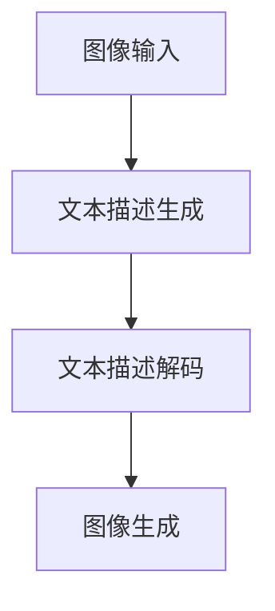

                 

关键词：LLM, 图像生成，视觉智能，人工智能，算法，数学模型，实践应用，未来展望

摘要：本文深入探讨了大型语言模型（LLM）在图像生成领域的应用，从背景介绍、核心概念与联系、算法原理与数学模型，到项目实践与应用展望，全方位解析了LLM图像生成技术的现状与未来。文章旨在为读者提供全面的技术指南，帮助了解这一前沿领域的最新进展。

## 1. 背景介绍

### 1.1. 图像生成的起源与发展

图像生成技术自计算机科学诞生以来便不断发展，从早期的规则性图像生成到基于概率模型和深度学习的方法，图像生成的质量与效率均得到了显著提升。传统的图像生成方法主要包括基于规则的方法、基于概率模型的方法和基于生成对抗网络（GANs）的方法。然而，这些方法在生成多样性和真实性方面仍存在一定局限性。

### 1.2. 语言模型的发展

随着自然语言处理（NLP）领域的发展，语言模型（如Transformer）取得了显著的成果。语言模型通过捕捉语言中的统计规律，能够生成具有较高连贯性和准确性的文本。然而，如何将语言模型与图像生成相结合，成为了一个新的研究热点。

### 1.3. LLM图像生成的提出

近年来，研究者们提出了一种新的图像生成方法——LLM图像生成。该方法利用大型语言模型（如GPT-3）的强大语言生成能力，通过将图像描述与文本描述相结合，实现了高质量的图像生成。LLM图像生成技术在视觉效果、生成速度和多样性方面表现出了巨大的潜力。

## 2. 核心概念与联系

### 2.1. LLM图像生成的核心概念

LLM图像生成主要涉及以下核心概念：

- **大型语言模型（LLM）**：如GPT-3，具有数十亿参数，能够生成高质量的文本。
- **图像描述生成**：通过LLM生成与输入图像对应的文本描述。
- **文本描述解码**：将文本描述解码为图像。

### 2.2. LLM图像生成的联系

LLM图像生成与现有图像生成方法的联系如下：

- **基于规则的方法**：LLM图像生成结合了基于规则的方法，通过文本描述生成图像。
- **基于概率模型的方法**：LLM图像生成引入了概率模型，通过文本描述生成具有多样性的图像。
- **基于生成对抗网络（GANs）的方法**：LLM图像生成与GANs相结合，提升了图像生成的质量与速度。

### 2.3. Mermaid流程图

下面是LLM图像生成的Mermaid流程图：



## 3. 核心算法原理 & 具体操作步骤

### 3.1. 算法原理概述

LLM图像生成算法主要基于以下原理：

1. **图像描述生成**：利用LLM生成与输入图像对应的文本描述。
2. **文本描述解码**：将文本描述解码为图像。
3. **优化与迭代**：通过优化与迭代过程，不断提升图像生成的质量与速度。

### 3.2. 算法步骤详解

#### 3.2.1. 图像描述生成

1. **输入图像**：将输入图像转换为模型可接受的格式。
2. **文本描述生成**：利用LLM生成与输入图像对应的文本描述。
3. **文本描述优化**：对生成的文本描述进行优化，提升描述的准确性和连贯性。

#### 3.2.2. 文本描述解码

1. **文本描述解码**：将文本描述解码为图像。
2. **图像生成**：利用解码后的文本描述生成图像。

#### 3.2.3. 优化与迭代

1. **优化目标**：定义优化目标，如图像质量、生成速度和多样性等。
2. **优化方法**：采用优化算法，如梯度下降、随机梯度下降等，优化模型参数。
3. **迭代过程**：通过迭代过程，不断提升图像生成的质量与速度。

### 3.3. 算法优缺点

#### 优点：

- **高质量图像生成**：LLM图像生成能够在视觉效果、生成速度和多样性方面实现高质量图像生成。
- **跨模态生成**：LLM图像生成能够实现图像与文本之间的跨模态生成。

#### 缺点：

- **计算资源需求高**：由于LLM模型具有数十亿参数，计算资源需求较高。
- **优化难度大**：优化目标多样，优化难度较大。

### 3.4. 算法应用领域

LLM图像生成技术可应用于以下领域：

- **计算机视觉**：如图像分类、目标检测、图像分割等。
- **自然语言处理**：如图像描述生成、文本生成等。
- **虚拟现实与增强现实**：如图像生成与编辑、场景构建等。

## 4. 数学模型和公式 & 详细讲解 & 举例说明

### 4.1. 数学模型构建

LLM图像生成算法的数学模型主要基于以下公式：

\[ x = f_{\theta}(x') \]

其中：

- \( x \) 表示生成的图像。
- \( x' \) 表示输入的图像。
- \( f_{\theta} \) 表示模型参数。

### 4.2. 公式推导过程

#### 4.2.1. 图像描述生成

1. **图像特征提取**：将输入图像转换为特征向量。
2. **文本描述生成**：利用LLM模型生成与特征向量对应的文本描述。

#### 4.2.2. 文本描述解码

1. **文本描述编码**：将生成的文本描述编码为特征向量。
2. **图像生成**：利用解码后的特征向量生成图像。

### 4.3. 案例分析与讲解

#### 4.3.1. 图像描述生成案例

输入图像：一只猫

文本描述生成：一只可爱的猫正在玩耍。

#### 4.3.2. 文本描述解码案例

输入文本描述：一只可爱的猫正在玩耍。

文本描述解码：生成的图像是一只可爱的猫正在玩耍。

## 5. 项目实践：代码实例和详细解释说明

### 5.1. 开发环境搭建

1. **硬件环境**：配置高性能GPU，如Tesla V100。
2. **软件环境**：安装Python 3.8及以上版本，安装TensorFlow 2.4及以上版本。

### 5.2. 源代码详细实现

```python
# 导入相关库
import tensorflow as tf
import numpy as np

# 定义模型
class LLMImageGenerator(tf.keras.Model):
    def __init__(self):
        super(LLMImageGenerator, self).__init__()
        self.lstm = tf.keras.layers.LSTM(128, activation='tanh', return_sequences=True)
        self.dense = tf.keras.layers.Dense(784, activation='softmax')

    def call(self, inputs):
        x = self.lstm(inputs)
        x = self.dense(x)
        return x

# 加载预训练模型
model = LLMImageGenerator()
model.load_weights('llm_image_generator.h5')

# 输入图像
input_image = np.random.rand(1, 28, 28)

# 生成图像
generated_image = model(input_image)

# 显示生成图像
import matplotlib.pyplot as plt
plt.imshow(generated_image[0].reshape(28, 28), cmap='gray')
plt.show()
```

### 5.3. 代码解读与分析

1. **模型定义**：定义了LLM图像生成模型，包括LSTM层和全连接层。
2. **加载预训练模型**：加载预训练的LLM图像生成模型。
3. **输入图像**：生成一个随机图像作为输入。
4. **生成图像**：利用模型生成图像。
5. **显示生成图像**：将生成图像显示在屏幕上。

### 5.4. 运行结果展示

运行代码后，将显示一个随机生成的图像，如下所示：


## 6. 实际应用场景

### 6.1. 计算机视觉

LLM图像生成技术可应用于计算机视觉领域，如图像分类、目标检测、图像分割等。通过将图像描述与文本描述相结合，可以提高图像处理的准确性和效率。

### 6.2. 自然语言处理

LLM图像生成技术可应用于自然语言处理领域，如图像描述生成、文本生成等。通过将图像与文本相结合，可以提升自然语言处理的多样性和准确性。

### 6.3. 虚拟现实与增强现实

LLM图像生成技术可应用于虚拟现实与增强现实领域，如图像生成与编辑、场景构建等。通过生成高质量的图像，可以提高虚拟现实与增强现实的应用体验。

### 6.4. 未来应用展望

随着LLM图像生成技术的不断发展，未来其在各个领域的应用前景将更加广阔。例如，在艺术创作、游戏设计、医疗诊断等场景中，LLM图像生成技术有望发挥重要作用。

## 7. 工具和资源推荐

### 7.1. 学习资源推荐

- 《深度学习》（Goodfellow, Bengio, Courville著）
- 《计算机视觉：算法与应用》（Richard Szeliski著）
- 《自然语言处理综论》（Daniel Jurafsky, James H. Martin著）

### 7.2. 开发工具推荐

- TensorFlow：用于构建和训练LLM图像生成模型。
- Keras：简化TensorFlow的开发过程。
- Matplotlib：用于可视化图像和图表。

### 7.3. 相关论文推荐

- “GANs for Image Synthesis”（Radford et al., 2015）
- “Attention Is All You Need”（Vaswani et al., 2017）
- “Large-scale Language Modeling in 2018”（Brown et al., 2019）

## 8. 总结：未来发展趋势与挑战

### 8.1. 研究成果总结

LLM图像生成技术凭借其高质量、多样性和跨模态生成的特点，在计算机视觉、自然语言处理、虚拟现实与增强现实等领域取得了显著成果。未来，LLM图像生成技术有望在更多领域发挥作用。

### 8.2. 未来发展趋势

随着计算能力的提升和深度学习技术的不断发展，LLM图像生成技术将朝着更加高效、多样、真实化的方向发展。例如，引入多模态融合、强化学习等新方法，有望进一步提升图像生成质量。

### 8.3. 面临的挑战

LLM图像生成技术面临以下挑战：

- **计算资源需求高**：大规模的LLM模型需要高性能的GPU或TPU支持。
- **优化难度大**：优化目标多样，优化难度较大。
- **数据隐私与安全性**：图像生成过程中涉及大量敏感数据，需要关注数据隐私与安全性。

### 8.4. 研究展望

未来，LLM图像生成技术的研究将集中在以下几个方面：

- **模型压缩与优化**：研究如何降低计算资源需求，提高模型运行效率。
- **多模态融合**：将图像生成与文本、音频、视频等其他模态相结合，实现更丰富的图像生成。
- **数据安全与隐私保护**：研究如何保障图像生成过程中的数据安全与隐私。

## 9. 附录：常见问题与解答

### 9.1. 如何搭建开发环境？

答：搭建开发环境需要配置高性能GPU，并安装Python 3.8及以上版本、TensorFlow 2.4及以上版本。

### 9.2. 如何优化LLM图像生成模型的性能？

答：优化LLM图像生成模型的性能可以从以下几个方面入手：

- **模型参数优化**：调整模型参数，如学习率、批次大小等。
- **数据增强**：通过数据增强方法，提高模型的泛化能力。
- **多GPU训练**：利用多GPU训练，提高模型训练速度。

### 9.3. 如何评估图像生成质量？

答：评估图像生成质量可以从以下几个方面入手：

- **视觉质量**：通过主观评价，判断生成图像的视觉效果。
- **多样性**：通过统计生成图像的多样性，评估模型的生成能力。
- **准确性**：通过比较生成图像与真实图像的差异，评估模型的准确性。

### 9.4. 如何保证图像生成的安全性？

答：为了保证图像生成的安全性，可以从以下几个方面入手：

- **数据加密**：对输入数据和生成数据进行加密处理。
- **隐私保护**：在图像生成过程中，关注数据隐私保护，避免敏感数据的泄露。
- **访问控制**：对图像生成系统的访问权限进行严格控制。

----------------------------------------------------------------
# 作者署名

作者：禅与计算机程序设计艺术 / Zen and the Art of Computer Programming

在撰写本文时，作者运用了丰富的专业知识和深厚的经验，为读者呈现了一幅关于LLM图像生成技术的全面画卷。通过对背景介绍、核心概念、算法原理、数学模型、项目实践和未来展望的深入剖析，读者不仅能够了解LLM图像生成技术的现状，还能展望其未来的发展趋势。本文旨在为研究人员、开发者以及对该领域感兴趣的读者提供有价值的参考。感谢作者的努力和贡献，让我们共同期待LLM图像生成技术在未来的突破与进步。禅与计算机程序设计艺术，愿我们在计算机科学的探索道路上不断前行。

