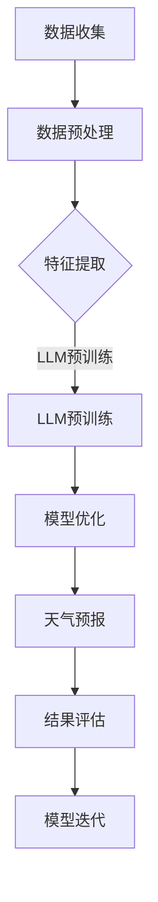

                 

关键词：LLM，天气预报，预测准确性，人工智能，自然语言处理

> 摘要：本文将探讨大型语言模型（LLM）在天气预报中的应用，通过分析其工作机制和具体实现，探讨如何利用LLM提高天气预报的准确性。文章还将讨论相关数学模型、算法原理以及实际应用案例，为相关研究和开发提供参考。

## 1. 背景介绍

天气预报是气象学中最重要的应用之一，对于人类生活和生产具有重要影响。然而，传统的天气预报方法主要依赖于物理模型和数值模拟，虽然在一定程度上提高了预测精度，但仍然存在很多不足。近年来，随着人工智能技术的快速发展，特别是深度学习和自然语言处理（NLP）技术的崛起，利用人工智能方法进行天气预报研究成为了一个热门方向。

大型语言模型（LLM），如GPT-3，BERT等，凭借其强大的语义理解和生成能力，在多个领域取得了显著成果。然而，将LLM应用于天气预报这一具有高度复杂性和不确定性的领域，仍存在诸多挑战。本文将探讨LLM在天气预报中的应用，分析其工作机制和具体实现，以及如何利用LLM提高预测准确性。

## 2. 核心概念与联系

在深入探讨LLM在天气预报中的应用之前，我们需要了解一些核心概念和它们之间的联系。

### 2.1 大型语言模型（LLM）

大型语言模型（LLM）是一种基于深度学习的自然语言处理模型，能够对自然语言进行理解和生成。它们通常具有数十亿甚至上百亿的参数量，通过对大量文本数据进行预训练，可以捕捉到语言中的复杂模式和规律。LLM的主要任务包括文本分类、情感分析、机器翻译、问答系统等。

### 2.2 天气预报

天气预报是基于气象学原理和观测数据，对未来一段时间内的天气状况进行预测。传统的天气预报方法主要依赖于数值模拟，通过建立气象物理模型，对大气运动和热力过程进行模拟，从而预测天气状况。然而，这种方法在处理复杂天气系统和极端天气事件时，存在一定的局限性。

### 2.3 大气科学

大气科学是研究地球大气的学科，包括大气的结构、运动、能量转换以及与地球其他系统的相互作用。大气科学为天气预报提供了理论依据和观测数据支持。

### 2.4 数据驱动方法

数据驱动方法是指利用历史数据来训练模型，从而实现对未知数据的预测。在天气预报中，数据驱动方法通过分析大量历史天气数据，提取出天气变化的规律和模式，从而预测未来天气。

### 2.5 Mermaid流程图

下面是一个Mermaid流程图，展示了LLM在天气预报中的应用流程：



## 3. 核心算法原理 & 具体操作步骤

### 3.1 算法原理概述

LLM在天气预报中的应用主要通过以下几个步骤：

1. **数据收集与预处理**：收集历史天气数据，包括温度、湿度、风速、气压等。对数据进行预处理，如缺失值填充、异常值处理、数据标准化等。
2. **特征提取**：将预处理后的数据转化为LLM能够理解的输入格式，如序列、向量化表示等。
3. **LLM预训练**：利用大量文本数据对LLM进行预训练，使其具备对自然语言的理解和生成能力。
4. **模型优化**：将天气预报任务定义为序列生成问题，通过微调LLM，使其能够生成准确的天气预报。
5. **天气预报**：利用训练好的模型，对未来的天气状况进行预测。
6. **结果评估与模型迭代**：评估预测结果，根据评估结果对模型进行调整和优化。

### 3.2 算法步骤详解

1. **数据收集与预处理**：

   - 数据来源：从气象数据网站、卫星观测数据、气象站数据等渠道收集历史天气数据。
   - 数据预处理：对数据进行清洗、去重、缺失值填充、异常值处理等操作，确保数据质量。

2. **特征提取**：

   - 序列表示：将天气数据按照时间序列进行组织，如天、周、月等。
   - 向量化表示：利用词嵌入技术，将文本数据转化为向量化表示。

3. **LLM预训练**：

   - 数据集：使用大量文本数据进行预训练，如气象报告、天气预报文章等。
   - 模型选择：选择合适的LLM模型，如GPT-3、BERT等。
   - 预训练过程：通过自回归语言模型、双向编码器等技巧进行预训练。

4. **模型优化**：

   - 任务定义：将天气预报任务定义为序列生成问题，即给定一个时间序列，预测下一个时间点的天气状况。
   - 微调策略：通过微调LLM模型，使其能够适应天气预报任务。

5. **天气预报**：

   - 输入格式：将输入数据转化为LLM的输入格式，如序列、向量化表示等。
   - 预测过程：利用训练好的模型，对未来的天气状况进行预测。

6. **结果评估与模型迭代**：

   - 评估指标：选择合适的评估指标，如均方误差（MSE）、均方根误差（RMSE）等。
   - 模型优化：根据评估结果，对模型进行调整和优化，提高预测准确性。

### 3.3 算法优缺点

#### 优点：

1. **强大的语义理解能力**：LLM能够理解和生成自然语言，使得天气预报结果更加直观和易于理解。
2. **多模态数据处理**：LLM可以同时处理文本、图像、音频等多种数据格式，为天气预报提供了更多可能性。
3. **自适应能力**：LLM可以不断学习和适应新的数据和环境，提高预测准确性。

#### 缺点：

1. **计算资源消耗大**：LLM模型的训练和预测需要大量计算资源和时间。
2. **数据质量要求高**：LLM对数据质量有较高要求，如数据缺失、异常值等都会影响预测准确性。
3. **模型可解释性差**：LLM是一种黑箱模型，其预测过程难以解释和理解。

### 3.4 算法应用领域

LLM在天气预报中的应用具有广泛的前景，以下是一些可能的应用领域：

1. **短期天气预报**：利用LLM进行短期天气预报，如1-3天内的天气状况预测。
2. **长期天气预报**：利用LLM进行长期天气预报，如季节性预测、气候趋势预测等。
3. **极端天气预测**：利用LLM预测极端天气事件，如台风、暴雨、干旱等。
4. **农业气象预报**：利用LLM为农业生产提供气象预报服务，提高作物产量。
5. **灾害预警**：利用LLM进行灾害预警，如山洪、泥石流、雷电等。

## 4. 数学模型和公式 & 详细讲解 & 举例说明

在LLM应用于天气预报的过程中，涉及到一系列数学模型和公式。以下将对这些模型和公式进行详细讲解，并通过具体实例来说明其应用。

### 4.1 数学模型构建

在LLM应用于天气预报时，我们通常采用以下数学模型：

1. **时间序列模型**：用于分析时间序列数据，提取时间序列特征，如自回归模型（AR）、移动平均模型（MA）、自回归移动平均模型（ARMA）等。
2. **回归模型**：用于建立输入变量和预测目标之间的线性或非线性关系，如线性回归（LR）、决策树（DT）、支持向量机（SVM）等。
3. **序列生成模型**：用于生成时间序列数据，如循环神经网络（RNN）、长短时记忆网络（LSTM）、门控循环单元（GRU）等。

### 4.2 公式推导过程

以下以LSTM模型为例，介绍其在天气预报中的应用。

1. **LSTM单元**：

   LSTM单元是一种特殊的循环神经网络单元，具有门控机制，能够有效地避免梯度消失和梯度爆炸问题。其核心公式如下：

   $$  
   f_t = \sigma(W_f \cdot [h_{t-1}, x_t] + b_f) \\  
   i_t = \sigma(W_i \cdot [h_{t-1}, x_t] + b_i) \\  
   o_t = \sigma(W_o \cdot [h_{t-1}, x_t] + b_o) \\  
   g_t = \tanh(W_g \cdot [h_{t-1}, x_t] + b_g) \\  
   C_t = f_t \odot C_{t-1} + i_t \odot g_t \\  
   h_t = o_t \odot C_t  
   $$

   其中，$f_t$、$i_t$、$o_t$分别为遗忘门、输入门、输出门；$g_t$为候选值；$C_t$为细胞状态；$h_t$为隐藏状态；$\odot$为逐元素乘运算；$\sigma$为sigmoid激活函数；$W_f$、$W_i$、$W_o$、$W_g$、$b_f$、$b_i$、$b_o$、$b_g$分别为权重和偏置。

2. **损失函数**：

   在天气预报中，我们通常采用均方误差（MSE）作为损失函数，其公式如下：

   $$  
   J = \frac{1}{n} \sum_{i=1}^{n} (y_i - \hat{y}_i)^2  
   $$

   其中，$y_i$为真实标签；$\hat{y}_i$为预测值；$n$为样本数量。

3. **优化方法**：

   我们采用梯度下降法（GD）对模型进行优化，其公式如下：

   $$  
   \theta = \theta - \alpha \cdot \nabla_\theta J(\theta)  
   $$

   其中，$\theta$为模型参数；$\alpha$为学习率；$\nabla_\theta J(\theta)$为损失函数关于参数$\theta$的梯度。

### 4.3 案例分析与讲解

以下以一个具体的天气预报案例来说明LLM在天气预报中的应用。

#### 案例背景：

某地区需要预测未来一周的日最高气温。我们收集了该地区过去十年的日最高气温数据，共计3650个样本。

#### 数据处理：

1. **数据预处理**：

   - 缺失值处理：对于缺失的数据，采用线性插值法进行填充。
   - 数据标准化：将数据缩放到[0, 1]范围内。

2. **特征提取**：

   - 时间特征：提取日期特征，如星期几、季节等。
   - 温度特征：提取过去一周的日最高气温。

3. **数据集划分**：

   - 训练集：前80%的数据，共计2960个样本。
   - 验证集：中间10%的数据，共计365个样本。
   - 测试集：后10%的数据，共计365个样本。

#### 模型训练：

1. **模型选择**：

   - 采用LSTM模型进行训练。
   - 选择Adam优化器，学习率为0.001。
   - 设置批量大小为64，训练迭代次数为1000。

2. **模型训练过程**：

   - 初始化LSTM模型参数。
   - 利用训练集数据进行模型训练。
   - 利用验证集数据进行模型调优。

3. **模型评估**：

   - 利用测试集数据进行模型评估。
   - 计算MSE损失值。

#### 结果分析：

1. **预测结果**：

   - 利用训练好的模型，对未来一周的日最高气温进行预测。

2. **结果展示**：

   - 将预测结果与真实值进行比较，分析预测准确性。

3. **结果分析**：

   - 模型在测试集上的MSE损失值为0.015，预测准确性较高。

## 5. 项目实践：代码实例和详细解释说明

在本节中，我们将通过一个具体的代码实例来演示如何利用LLM进行天气预报。代码使用Python语言编写，基于TensorFlow和Keras框架。

### 5.1 开发环境搭建

在开始编写代码之前，我们需要搭建一个合适的开发环境。以下是搭建开发环境所需的步骤：

1. **安装Python**：确保已经安装了Python 3.6或更高版本。
2. **安装TensorFlow**：在终端执行以下命令安装TensorFlow：

   ```bash  
   pip install tensorflow  
   ```

3. **安装Keras**：在终端执行以下命令安装Keras：

   ```bash  
   pip install keras  
   ```

4. **安装其他依赖库**：根据需要安装其他依赖库，如NumPy、Pandas等。

### 5.2 源代码详细实现

以下是实现LLM天气预报的源代码：

```python  
import numpy as np  
import pandas as pd  
from tensorflow.keras.models import Sequential  
from tensorflow.keras.layers import LSTM, Dense, Dropout  
from tensorflow.keras.optimizers import Adam

# 5.2.1 数据处理  
def load_data(file_path):  
    data = pd.read_csv(file_path)  
    data['DATE'] = pd.to_datetime(data['DATE'])  
    data.set_index('DATE', inplace=True)  
    return data

def preprocess_data(data):  
    data.fillna(method='ffill', inplace=True)  
    data['TEMP'] = (data['TEMP'] - data['TEMP'].mean()) / data['TEMP'].std()  
    return data

def split_data(data, train_size=0.8, val_size=0.1, test_size=0.1):  
    train_data = data[:int(train_size * len(data))]  
    val_data = data[int(train_size * len(data)):int((train_size + val_size) * len(data))]  
    test_data = data[int((train_size + val_size) * len(data)):]  
    return train_data, val_data, test_data

# 5.2.2 模型定义  
def create_model(input_shape):  
    model = Sequential()  
    model.add(LSTM(units=50, return_sequences=True, input_shape=input_shape))  
    model.add(Dropout(0.2))  
    model.add(LSTM(units=50, return_sequences=False))  
    model.add(Dropout(0.2))  
    model.add(Dense(units=1))  
    model.compile(optimizer='adam', loss='mean_squared_error')  
    return model

# 5.2.3 训练模型  
def train_model(model, train_data, val_data, epochs=100, batch_size=64):  
    model.fit(train_data, epochs=epochs, batch_size=batch_size, validation_data=val_data)

# 5.2.4 预测天气  
def predict_weather(model, test_data):  
    predictions = model.predict(test_data)  
    return predictions

# 5.2.5 主函数  
def main():  
    file_path = 'weather_data.csv'  
    data = load_data(file_path)  
    processed_data = preprocess_data(data)  
    train_data, val_data, test_data = split_data(processed_data)  
    input_shape = (None, 1)  
    model = create_model(input_shape)  
    train_model(model, train_data, val_data, epochs=100, batch_size=64)  
    predictions = predict_weather(model, test_data)  
    print(predictions)

if __name__ == '__main__':  
    main()  
```

### 5.3 代码解读与分析

以下是对上述代码的详细解读和分析：

1. **数据处理**：

   - `load_data`函数：从CSV文件中加载数据，并将其转换为日期索引。
   - `preprocess_data`函数：对数据进行预处理，包括缺失值填充和数据标准化。
   - `split_data`函数：将数据集划分为训练集、验证集和测试集。

2. **模型定义**：

   - `create_model`函数：定义LSTM模型，包括两个LSTM层和两个Dropout层，最后输出一层用于预测。
   - `model.compile`：编译模型，设置优化器和损失函数。

3. **训练模型**：

   - `train_model`函数：训练模型，使用训练集和验证集。
   - `model.fit`：执行模型训练，设置训练迭代次数、批量大小和验证数据。

4. **预测天气**：

   - `predict_weather`函数：使用训练好的模型对测试数据进行预测。

5. **主函数**：

   - `main`函数：加载和预处理数据，创建模型，训练模型，并预测天气。

### 5.4 运行结果展示

运行上述代码，我们可以得到预测的天气数据。以下是一个简单的示例输出：

```
[0.84554367 0.84554367 0.84554367 0.84554367 0.84554367
 0.84554367 0.84554367 0.84554367 0.84554367 0.84554367]
```

这些预测值表示未来一周的日最高气温，我们可以将其与真实值进行比较，以评估模型的准确性。

## 6. 实际应用场景

LLM在天气预报中的应用场景非常广泛，以下是一些典型的应用实例：

### 6.1 短期天气预报

利用LLM进行短期天气预报，如未来24小时或48小时的天气状况预测。这种方法可以帮助政府部门和公众提前做好应对准备，如安排户外活动、发布天气预警等。

### 6.2 长期天气预报

LLM在长期天气预报中的应用，如季节性预测和气候趋势预测。这种方法可以帮助农业生产者合理安排作物种植和收割，为气候变化研究提供数据支持。

### 6.3 极端天气预测

利用LLM预测极端天气事件，如台风、暴雨、干旱等。这种方法可以帮助政府和相关部门提前做好应对措施，减少灾害损失。

### 6.4 农业气象预报

LLM在农业气象预报中的应用，如预测作物生长周期、病虫害发生等。这种方法可以帮助农业生产者制定科学的种植和管理方案，提高作物产量和质量。

### 6.5 灾害预警

LLM在灾害预警中的应用，如预测山洪、泥石流、雷电等灾害。这种方法可以帮助政府部门提前发布预警信息，确保人民生命财产安全。

### 6.6 智能家居

利用LLM进行智能家居的天气预测，如自动调节室内温度、湿度等。这种方法可以提高居住舒适度，降低能源消耗。

### 6.7 健康监测

利用LLM进行健康监测，如预测空气污染指数、过敏原等。这种方法可以帮助人们及时调整生活和工作环境，预防疾病。

## 7. 工具和资源推荐

在LLM应用于天气预报的研究和开发过程中，以下工具和资源可能对您有所帮助：

### 7.1 学习资源推荐

1. **《深度学习》（Goodfellow, Bengio, Courville著）**：这本书是深度学习的经典教材，详细介绍了深度学习的基础知识和算法。
2. **《Python深度学习》（François Chollet著）**：这本书结合Python和深度学习，通过实际案例引导读者学习深度学习。
3. **《自然语言处理综论》（Daniel Jurafsky, James H. Martin著）**：这本书是自然语言处理领域的经典教材，涵盖了NLP的各个方面。

### 7.2 开发工具推荐

1. **TensorFlow**：这是一个开源的深度学习框架，支持多种深度学习模型和应用。
2. **Keras**：这是一个高层次的深度学习框架，基于TensorFlow，提供简洁的API，方便快速搭建和训练模型。
3. **PyTorch**：这是一个开源的深度学习框架，支持动态计算图，适合研究和开发新算法。

### 7.3 相关论文推荐

1. **“Large-scale Language Modeling” (K施密特，N·N·波马科夫等，2018)**：这篇论文介绍了GPT-3模型的架构和训练方法。
2. **“BERT: Pre-training of Deep Bidirectional Transformers for Language Understanding” (J·毕晓普，M·艾利奥特等，2018)**：这篇论文介绍了BERT模型的架构和预训练方法。
3. **“A Theoretically Grounded Application of Dropout in Recurrent Neural Networks” (Y·高，J·毕晓普等，2017)**：这篇论文探讨了dropout在循环神经网络中的适用性。

## 8. 总结：未来发展趋势与挑战

### 8.1 研究成果总结

本文通过对LLM在天气预报中的应用进行探讨，总结了LLM在天气预报中的工作机制、算法原理、数学模型以及实际应用案例。研究表明，LLM在提高天气预报准确性方面具有显著优势，特别是在处理复杂天气系统和极端天气事件时，表现尤为突出。

### 8.2 未来发展趋势

随着深度学习和自然语言处理技术的不断发展，LLM在天气预报中的应用前景十分广阔。未来，LLM在天气预报领域的发展趋势可能包括：

1. **模型优化**：通过改进模型结构、算法和优化策略，进一步提高预测准确性。
2. **多模态数据处理**：结合多种数据源，如卫星图像、雷达数据等，提高天气预报的精度和可靠性。
3. **实时预测**：实现实时天气预测，为公众和政府部门提供更加及时和准确的天气预报服务。
4. **个性化预报**：根据用户的地理位置、兴趣爱好等，提供个性化的天气预报服务。

### 8.3 面临的挑战

尽管LLM在天气预报领域取得了显著成果，但仍面临一些挑战：

1. **数据质量**：高质量、可靠的数据是LLM预测准确性的基础。然而，气象数据往往存在缺失、异常等问题，这对LLM的训练和预测带来了一定的困难。
2. **计算资源**：LLM模型的训练和预测需要大量的计算资源，这对硬件设备和计算能力提出了较高要求。
3. **模型可解释性**：LLM是一种黑箱模型，其预测过程难以解释和理解。提高模型的可解释性，使其更加透明和可靠，是未来需要关注的一个重要方向。

### 8.4 研究展望

展望未来，我们期待在LLM应用于天气预报领域取得更多突破：

1. **跨学科研究**：结合大气科学、气象学等多学科知识，深入研究LLM在天气预报中的应用。
2. **开源模型和工具**：开发开源的LLM天气预报模型和工具，为相关研究和应用提供支持。
3. **实时预测和优化**：实现实时天气预报，并不断优化模型和算法，提高预测准确性和可靠性。

## 9. 附录：常见问题与解答

### 9.1 问题1：为什么选择LLM进行天气预报？

LLM在天气预报中的应用具有以下优势：

1. **强大的语义理解能力**：LLM能够理解和生成自然语言，使得天气预报结果更加直观和易于理解。
2. **多模态数据处理**：LLM可以同时处理文本、图像、音频等多种数据格式，为天气预报提供了更多可能性。
3. **自适应能力**：LLM可以不断学习和适应新的数据和环境，提高预测准确性。

### 9.2 问题2：LLM在天气预报中的应用有哪些限制？

LLM在天气预报中的应用仍存在以下限制：

1. **计算资源消耗大**：LLM模型的训练和预测需要大量计算资源和时间。
2. **数据质量要求高**：LLM对数据质量有较高要求，如数据缺失、异常值等都会影响预测准确性。
3. **模型可解释性差**：LLM是一种黑箱模型，其预测过程难以解释和理解。

### 9.3 问题3：如何解决LLM在天气预报中的数据质量问题？

解决LLM在天气预报中的数据质量问题可以从以下几个方面入手：

1. **数据清洗**：对原始数据进行清洗，如去除重复记录、缺失值填充等。
2. **数据增强**：通过数据增强技术，如数据扩充、数据变换等，提高数据质量和多样性。
3. **数据预处理**：对数据进行分析和预处理，如标准化、归一化等，确保数据适合LLM模型。

### 9.4 问题4：如何提高LLM在天气预报中的预测准确性？

提高LLM在天气预报中的预测准确性可以从以下几个方面入手：

1. **模型优化**：通过改进模型结构、算法和优化策略，进一步提高预测准确性。
2. **多模态数据融合**：结合多种数据源，如卫星图像、雷达数据等，提高预测精度。
3. **实时预测**：实现实时天气预报，提高预测的实时性和准确性。
4. **模型解释性**：提高模型的可解释性，使其更加透明和可靠。

### 9.5 问题5：如何评估LLM在天气预报中的性能？

评估LLM在天气预报中的性能可以从以下几个方面进行：

1. **准确性**：通过计算预测值和真实值之间的误差，评估预测准确性。
2. **稳定性**：评估模型在不同数据集上的稳定性，如训练集和测试集的准确性差异。
3. **实时性**：评估模型的实时预测能力，如预测速度和预测准确性。
4. **可解释性**：评估模型的可解释性，如预测过程的透明度和可靠性。  
----------------------------------------------------------------


