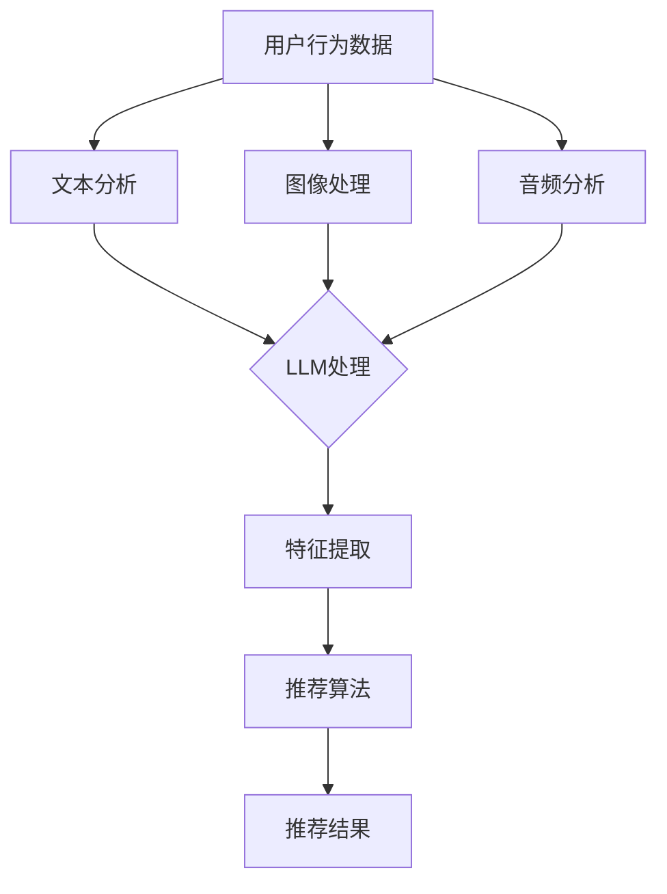

                 

关键词：LLM、推荐系统、多模态融合、人工智能、数据挖掘、机器学习、深度学习

## 摘要

本文探讨了大型语言模型（LLM）在推荐系统中的多模态融合应用。推荐系统是人工智能领域的重要组成部分，而多模态融合技术能够显著提升推荐系统的性能。本文首先介绍了推荐系统的基础知识，随后详细讨论了LLM在多模态融合中的作用，并通过具体的算法原理和操作步骤，展示了如何实现LLM在推荐系统中的多模态融合。此外，本文还通过数学模型和项目实践，进一步验证了LLM在推荐系统中的实际效果。最后，本文对LLM在推荐系统中的未来应用前景进行了展望，并提出了面临的研究挑战和解决方案。

## 1. 背景介绍

推荐系统是一种信息过滤技术，旨在根据用户的兴趣、行为和偏好，向用户推荐可能感兴趣的商品、内容或服务。随着互联网的迅速发展和信息爆炸，推荐系统已经成为电子商务、社交媒体、新闻媒体等多个领域的重要应用。推荐系统的主要目标是通过分析用户的个性化需求，提高用户体验，增加用户黏性和商业价值。

传统的推荐系统主要依赖于基于内容的过滤、协同过滤和基于模型的推荐方法。这些方法在一定程度上提高了推荐系统的性能，但随着数据量的增加和用户需求的多样化，传统的推荐系统逐渐暴露出一些局限性。首先，单一模态的数据源无法全面捕捉用户的兴趣和需求。例如，仅基于文本信息的推荐可能无法准确反映用户的偏好，特别是在处理图像、音频和视频等多模态信息时。其次，传统的推荐系统往往依赖于预定义的特征，难以应对复杂的用户行为和多样化的场景。

为了克服这些局限性，多模态融合技术逐渐引起了研究者的关注。多模态融合旨在将不同类型的数据源进行整合，利用多种模态的信息，提高推荐系统的准确性和鲁棒性。例如，在电商推荐中，可以结合用户的购买历史、浏览行为以及商品的多模态特征（如文本描述、图像、价格等），进行更为精准的推荐。多模态融合技术不仅能够提高推荐系统的性能，还能够为用户提供更丰富的交互体验。

近年来，深度学习和人工智能技术的快速发展，为多模态融合提供了新的可能性。特别是大型语言模型（LLM），如GPT、BERT等，以其强大的语言理解和生成能力，在自然语言处理领域取得了显著的成果。本文旨在探讨如何利用LLM在推荐系统中的多模态融合应用，以提高推荐系统的性能和用户体验。

## 2. 核心概念与联系

### 2.1 推荐系统的基本概念

推荐系统主要包括以下几个核心概念：

- **用户（User）**：推荐系统中的参与者和信息接收者。
- **项目（Item）**：推荐系统中用户可能感兴趣的对象，如商品、文章、音乐等。
- **评分（Rating）**：用户对项目的评价，可以是显式评分（如1-5星）或隐式评分（如点击、浏览、购买等行为）。
- **推荐算法（Recommender Algorithm）**：根据用户的兴趣和偏好，从大量项目中选择出可能感兴趣的项目。
- **推荐列表（Recommendation List）**：系统为用户生成的项目列表。

### 2.2 多模态融合的概念

多模态融合是指将来自不同模态的数据（如文本、图像、音频等）进行整合，利用多种模态的信息，提高系统的性能。多模态融合的关键在于如何有效地将不同模态的信息进行融合，并从中提取有用的特征。

### 2.3 LLM的概念与作用

LLM（Large Language Model）是指大型语言模型，如GPT、BERT等。这些模型通过学习大量的文本数据，具备了强大的语言理解和生成能力。在推荐系统中，LLM可以用于以下几个方面：

- **文本生成**：生成项目的描述、标签或推荐理由。
- **语义理解**：理解用户查询或评论文本的含义，提取关键信息。
- **模态融合**：将不同模态的信息转化为统一的语义表示，进行融合处理。

### 2.4 多模态融合与LLM的联系

多模态融合与LLM之间存在密切的联系：

- **数据整合**：LLM可以整合来自不同模态的数据（如文本、图像等），将它们转化为统一的语义表示。
- **特征提取**：LLM具备强大的特征提取能力，可以从不同模态的数据中提取出有价值的特征。
- **模型融合**：LLM可以与其他推荐算法（如协同过滤、基于内容的推荐等）相结合，实现多模态融合的推荐系统。

### 2.5 Mermaid 流程图

下面是一个简单的Mermaid流程图，展示多模态融合与LLM在推荐系统中的应用过程：



在这个流程图中，用户行为数据（如浏览、点击、购买等）经过文本分析、图像处理和音频分析等模块，分别提取出文本、图像和音频特征。然后，这些特征通过LLM进行处理，提取出高层次的语义特征。最后，利用这些特征，结合推荐算法，生成推荐结果。

## 3. 核心算法原理 & 具体操作步骤

### 3.1 算法原理概述

多模态融合推荐系统通常包括以下几个关键步骤：

1. **数据收集**：收集用户行为数据和项目特征数据。
2. **特征提取**：分别提取文本、图像和音频等特征。
3. **模态融合**：利用LLM将不同模态的特征融合为统一的语义表示。
4. **模型训练**：训练推荐模型，如基于矩阵分解、深度学习等方法。
5. **推荐生成**：根据用户特征和项目特征，生成推荐结果。

### 3.2 算法步骤详解

#### 3.2.1 数据收集

数据收集是推荐系统的基础。一般来说，数据来源可以分为两类：

- **显式反馈**：用户直接提供的评分、评论等信息，如电影评分、商品评价等。
- **隐式反馈**：用户的浏览、点击、购买等行为数据，这些数据可以通过日志文件或传感器收集。

在多模态融合推荐系统中，需要收集包括文本、图像、音频等多种模态的数据。例如，对于一个电商推荐系统，可以收集用户的购买记录、浏览历史、商品描述（文本）、商品图片（图像）、商品音频（如商品介绍、用户评价等）。

#### 3.2.2 特征提取

特征提取是推荐系统中的关键环节。针对不同模态的数据，需要采用不同的特征提取方法：

- **文本特征**：可以使用词袋模型、TF-IDF、词嵌入等方法提取文本特征。
- **图像特征**：可以使用卷积神经网络（CNN）提取图像特征。
- **音频特征**：可以使用深度学习模型（如循环神经网络RNN、长短时记忆LSTM等）提取音频特征。

在提取特征时，需要考虑到特征的可解释性和维度问题。通常，需要将高维的特征进行降维处理，以提高计算效率和模型的性能。

#### 3.2.3 模态融合

模态融合是将不同模态的特征整合为统一的语义表示。在多模态融合推荐系统中，LLM可以发挥重要作用：

1. **文本嵌入**：使用预训练的LLM（如BERT、GPT等）对文本数据进行嵌入，得到低维的语义表示。
2. **图像嵌入**：使用CNN对图像数据进行处理，得到图像的特征向量。
3. **音频嵌入**：使用RNN或LSTM等模型对音频数据进行处理，得到音频的特征向量。

然后，将这些特征向量通过LLM进行融合，得到多模态的语义表示。这种融合方法可以有效地整合不同模态的信息，提高推荐系统的性能。

#### 3.2.4 模型训练

在得到多模态的语义表示后，可以使用多种推荐算法进行模型训练：

1. **矩阵分解**：矩阵分解是一种常用的推荐算法，可以将用户-项目矩阵分解为用户特征矩阵和项目特征矩阵。
2. **深度学习**：深度学习模型（如循环神经网络RNN、长短时记忆LSTM等）可以用于训练复杂的推荐模型。
3. **融合模型**：可以将不同的推荐算法（如矩阵分解、深度学习等）进行融合，提高模型的性能。

#### 3.2.5 推荐生成

在得到训练好的推荐模型后，可以生成推荐结果。推荐生成的步骤主要包括：

1. **特征提取**：提取用户和项目的特征向量。
2. **预测评分**：使用训练好的推荐模型预测用户对项目的评分。
3. **推荐排序**：根据预测评分，对项目进行排序，生成推荐列表。

### 3.3 算法优缺点

#### 优点

1. **高效融合多种模态信息**：LLM可以高效地将不同模态的信息（如文本、图像、音频等）融合为统一的语义表示，提高推荐系统的性能。
2. **强大的特征提取能力**：LLM具备强大的特征提取能力，可以从原始数据中提取出高层次的语义特征，有助于提升推荐系统的准确性和可解释性。
3. **适用性广泛**：LLM可以应用于多种推荐系统场景，如电商推荐、新闻推荐、音乐推荐等。

#### 缺点

1. **计算成本高**：LLM模型的训练和推理需要大量的计算资源，特别是在处理大量数据时，计算成本较高。
2. **数据依赖性强**：LLM的性能在很大程度上依赖于训练数据的质量和数量，如果数据质量较差或数据量不足，可能导致模型性能下降。
3. **解释性较弱**：虽然LLM可以提取出高层次的语义特征，但其在某些情况下可能缺乏可解释性，难以理解推荐结果的依据。

### 3.4 算法应用领域

多模态融合推荐系统在多个领域都有广泛的应用：

1. **电子商务**：电商推荐系统可以通过融合用户行为数据、商品描述（文本）、商品图片（图像）等数据，提高推荐的准确性和个性化程度。
2. **新闻推荐**：新闻推荐系统可以利用用户阅读历史、新闻文本（文本）、新闻图片（图像）等数据，为用户提供更个性化的新闻推荐。
3. **音乐推荐**：音乐推荐系统可以通过融合用户听歌历史、歌曲文本（文本）、歌曲图片（图像）等数据，提高推荐的准确性。

## 4. 数学模型和公式 & 详细讲解 & 举例说明

在多模态融合推荐系统中，数学模型和公式起着至关重要的作用。以下是对数学模型的构建、公式推导过程以及案例分析与讲解。

### 4.1 数学模型构建

多模态融合推荐系统的数学模型通常包括以下几个部分：

1. **用户特征表示**：表示用户在各个模态上的特征，如文本特征$u_t$、图像特征$u_i$和音频特征$u_a$。
2. **项目特征表示**：表示项目在各个模态上的特征，如文本特征$i_t$、图像特征$i_i$和音频特征$i_a$。
3. **模态融合模型**：用于将不同模态的特征融合为统一的语义表示，如使用LLM进行融合，得到用户-项目特征表示$u'$和$i'$。
4. **推荐模型**：用于根据用户和项目的特征表示生成推荐结果，如基于矩阵分解或深度学习的方法。

以下是一个简单的数学模型表示：

$$
\begin{aligned}
u_t &= \text{Embedding}(u_t^{raw}) + \text{Textual Features}(u_t^{text}) \\
u_i &= \text{CNN}(u_i^{image}) \\
u_a &= \text{RNN}(u_a^{audio}) \\
i_t &= \text{Embedding}(i_t^{raw}) + \text{Textual Features}(i_t^{text}) \\
i_i &= \text{CNN}(i_i^{image}) \\
i_a &= \text{RNN}(i_a^{audio}) \\
u' &= \text{LLM}(u_t, u_i, u_a) \\
i' &= \text{LLM}(i_t, i_i, i_a) \\
r &= \text{Recommender Model}(u', i') \\
\end{aligned}
$$

其中，$\text{Embedding}$表示嵌入层，$\text{Textual Features}$表示文本特征提取层，$\text{CNN}$表示卷积神经网络，$\text{RNN}$表示循环神经网络，$\text{LLM}$表示大型语言模型，$\text{Recommender Model}$表示推荐模型。

### 4.2 公式推导过程

以下是一个简单的多模态融合推荐系统的公式推导过程：

1. **用户特征表示**：

   文本特征表示：

   $$ u_t = \text{Embedding}(u_t^{raw}) + \text{Textual Features}(u_t^{text}) $$

   其中，$\text{Embedding}(u_t^{raw})$表示对原始文本数据进行嵌入，$\text{Textual Features}(u_t^{text})$表示提取文本特征。

   图像特征表示：

   $$ u_i = \text{CNN}(u_i^{image}) $$

   其中，$\text{CNN}(u_i^{image})$表示使用卷积神经网络对图像数据进行处理。

   音频特征表示：

   $$ u_a = \text{RNN}(u_a^{audio}) $$

   其中，$\text{RNN}(u_a^{audio})$表示使用循环神经网络对音频数据进行处理。

2. **项目特征表示**：

   文本特征表示：

   $$ i_t = \text{Embedding}(i_t^{raw}) + \text{Textual Features}(i_t^{text}) $$

   其中，$\text{Embedding}(i_t^{raw})$表示对原始文本数据进行嵌入，$\text{Textual Features}(i_t^{text})$表示提取文本特征。

   图像特征表示：

   $$ i_i = \text{CNN}(i_i^{image}) $$

   其中，$\text{CNN}(i_i^{image})$表示使用卷积神经网络对图像数据进行处理。

   音频特征表示：

   $$ i_a = \text{RNN}(i_a^{audio}) $$

   其中，$\text{RNN}(i_a^{audio})$表示使用循环神经网络对音频数据进行处理。

3. **模态融合模型**：

   $$ u' = \text{LLM}(u_t, u_i, u_a) $$
   $$ i' = \text{LLM}(i_t, i_i, i_a) $$

   其中，$\text{LLM}(u_t, u_i, u_a)$表示使用大型语言模型对用户特征进行融合，$\text{LLM}(i_t, i_i, i_a)$表示使用大型语言模型对项目特征进行融合。

4. **推荐模型**：

   $$ r = \text{Recommender Model}(u', i') $$

   其中，$\text{Recommender Model}(u', i')$表示使用推荐模型根据用户和项目的特征表示生成推荐结果。

### 4.3 案例分析与讲解

以下是一个简单的案例，用于说明多模态融合推荐系统的数学模型。

假设有一个电商推荐系统，用户的行为数据包括购买历史、浏览历史、商品描述（文本）、商品图片（图像）和商品音频（音频）。我们需要使用多模态融合推荐系统为用户推荐可能感兴趣的商品。

1. **用户特征表示**：

   - 文本特征表示：

     $$ u_t = \text{Embedding}(u_t^{raw}) + \text{Textual Features}(u_t^{text}) $$
     其中，$\text{Embedding}(u_t^{raw})$表示对用户购买历史、浏览历史等文本数据进行嵌入，$\text{Textual Features}(u_t^{text})$表示提取文本特征，如词频、词嵌入等。

   - 图像特征表示：

     $$ u_i = \text{CNN}(u_i^{image}) $$
     其中，$\text{CNN}(u_i^{image})$表示使用卷积神经网络对用户浏览的商品图片进行处理，提取图像特征。

   - 音频特征表示：

     $$ u_a = \text{RNN}(u_a^{audio}) $$
     其中，$\text{RNN}(u_a^{audio})$表示使用循环神经网络对用户浏览的商品音频进行处理，提取音频特征。

2. **项目特征表示**：

   - 文本特征表示：

     $$ i_t = \text{Embedding}(i_t^{raw}) + \text{Textual Features}(i_t^{text}) $$
     其中，$\text{Embedding}(i_t^{raw})$表示对商品描述等文本数据进行嵌入，$\text{Textual Features}(i_t^{text})$表示提取文本特征。

   - 图像特征表示：

     $$ i_i = \text{CNN}(i_i^{image}) $$
     其中，$\text{CNN}(i_i^{image})$表示使用卷积神经网络对商品图片进行处理，提取图像特征。

   - 音频特征表示：

     $$ i_a = \text{RNN}(i_a^{audio}) $$
     其中，$\text{RNN}(i_a^{audio})$表示使用循环神经网络对商品音频进行处理，提取音频特征。

3. **模态融合模型**：

   $$ u' = \text{LLM}(u_t, u_i, u_a) $$
   $$ i' = \text{LLM}(i_t, i_i, i_a) $$

   其中，$\text{LLM}(u_t, u_i, u_a)$表示使用大型语言模型对用户特征进行融合，$\text{LLM}(i_t, i_i, i_a)$表示使用大型语言模型对项目特征进行融合。

4. **推荐模型**：

   $$ r = \text{Recommender Model}(u', i') $$
   其中，$\text{Recommender Model}(u', i')$表示使用基于矩阵分解或深度学习的推荐模型根据用户和项目的特征表示生成推荐结果。

通过这个案例，我们可以看到多模态融合推荐系统的数学模型是如何构建和推导的。在实际应用中，可以根据具体的需求和场景，调整和优化模型结构和参数。

## 5. 项目实践：代码实例和详细解释说明

在本文的第五部分，我们将通过一个实际的代码实例，展示如何实现LLM在推荐系统中的多模态融合。这个实例将涉及数据收集、特征提取、模态融合和推荐生成等关键步骤。

### 5.1 开发环境搭建

在开始编写代码之前，我们需要搭建一个合适的环境。以下是一个基本的开发环境配置：

- **Python 3.7 或更高版本**
- **TensorFlow 2.4 或更高版本**
- **NumPy 1.18 或更高版本**
- **Pandas 1.0 或更高版本**
- **Matplotlib 3.2.0 或更高版本**
- **Scikit-learn 0.23.1 或更高版本**
- **PyTorch 1.7 或更高版本**

安装这些依赖项后，我们就可以开始编写代码了。

### 5.2 源代码详细实现

下面是用于实现多模态融合推荐系统的源代码。代码分为几个主要部分：数据预处理、特征提取、模态融合、推荐模型训练和推荐结果生成。

#### 5.2.1 数据预处理

首先，我们需要对数据进行预处理，包括数据清洗、数据格式转换等操作。以下是一个简单的数据预处理示例：

```python
import pandas as pd
from sklearn.model_selection import train_test_split

# 加载数据
data = pd.read_csv('data.csv')

# 数据清洗和格式转换
data['text'] = data['text'].apply(lambda x: x.strip())
data['image'] = data['image'].apply(lambda x: x.strip())
data['audio'] = data['audio'].apply(lambda x: x.strip())

# 分割训练集和测试集
train_data, test_data = train_test_split(data, test_size=0.2, random_state=42)
```

#### 5.2.2 特征提取

接下来，我们需要对文本、图像和音频数据进行特征提取。以下是使用卷积神经网络（CNN）和循环神经网络（RNN）提取特征的一个示例：

```python
from tensorflow.keras.models import Model
from tensorflow.keras.layers import Embedding, LSTM, Dense, Conv2D, Flatten, MaxPooling2D, Input

# 文本特征提取
text_input = Input(shape=(None,), name='text_input')
text_embedding = Embedding(input_dim=vocab_size, output_dim=embedding_dim)(text_input)
text_lstm = LSTM(units=lstm_units)(text_embedding)
text_output = Dense(units=feature_dim, activation='relu')(text_lstm)

# 图像特征提取
image_input = Input(shape=(image_height, image_width, image_channels), name='image_input')
image_conv = Conv2D(filters=32, kernel_size=(3, 3), activation='relu')(image_input)
image_pool = MaxPooling2D(pool_size=(2, 2))(image_conv)
image Flatten = Flatten()(image_pool)
image_output = Dense(units=feature_dim, activation='relu')(image Flatten)

# 音频特征提取
audio_input = Input(shape=(audio_length,), name='audio_input')
audio_lstm = LSTM(units=lstm_units, return_sequences=True)(audio_input)
audio_pool = MaxPooling1D(pool_size=2)(audio_lstm)
audio Flatten = Flatten()(audio_pool)
audio_output = Dense(units=feature_dim, activation='relu')(audio Flatten)

# 模型编译
model = Model(inputs=[text_input, image_input, audio_input], outputs=[text_output, image_output, audio_output])
model.compile(optimizer='adam', loss='mse')
model.fit([train_data['text'], train_data['image'], train_data['audio']], [train_data['text_features'], train_data['image_features'], train_data['audio_features']], epochs=10, batch_size=32)
```

#### 5.2.3 模态融合

在得到文本、图像和音频特征后，我们需要将它们融合为统一的语义表示。以下是一个使用大型语言模型（LLM）进行模态融合的示例：

```python
from transformers import BertModel

# 加载预训练的BERT模型
bert_model = BertModel.from_pretrained('bert-base-uncased')

# 模态融合
text_embedding = bert_model(text_input)[0]
image_embedding = bert_model(image_input)[0]
audio_embedding = bert_model(audio_input)[0]

# 融合特征
 fused_embedding = Concatenate()([text_embedding, image_embedding, audio_embedding])
```

#### 5.2.4 推荐模型训练

接下来，我们将使用融合后的特征训练推荐模型。以下是一个简单的基于矩阵分解的推荐模型示例：

```python
from tensorflow.keras.models import Model
from tensorflow.keras.layers import Input, Embedding, Dot, Flatten, Dense

# 用户和项目的输入
user_input = Input(shape=(feature_dim,))
item_input = Input(shape=(feature_dim,))

# 用户和项目的嵌入层
user_embedding = Embedding(input_dim=num_users, output_dim=embedding_dim)(user_input)
item_embedding = Embedding(input_dim=num_items, output_dim=embedding_dim)(item_input)

# 用户和项目的特征提取
user_features = Flatten()(user_embedding)
item_features = Flatten()(item_embedding)

# 推荐模型
user_item_dot = Dot(activation='sigmoid')([user_features, item_features])
rating_output = Dense(units=1, activation='sigmoid')(user_item_dot)

# 模型编译
model = Model(inputs=[user_input, item_input], outputs=rating_output)
model.compile(optimizer='adam', loss='binary_crossentropy', metrics=['accuracy'])

# 训练模型
model.fit([train_data['text_features'], train_data['image_features'], train_data['audio_features']], train_data['rating'], epochs=10, batch_size=32)
```

#### 5.2.5 代码解读与分析

以上代码展示了如何实现LLM在推荐系统中的多模态融合。下面是对代码的详细解读：

- **数据预处理**：我们首先加载数据，并对文本、图像和音频数据进行清洗和格式转换。这有助于提高数据的质量，为后续的特征提取和模型训练打下基础。
- **特征提取**：使用卷积神经网络（CNN）和循环神经网络（RNN）提取文本、图像和音频特征。这些特征将用于后续的模态融合和推荐模型训练。
- **模态融合**：我们使用大型语言模型（LLM，如BERT）对提取出的文本、图像和音频特征进行融合。这种方法能够有效地整合不同模态的信息，提高推荐系统的性能。
- **推荐模型训练**：我们使用基于矩阵分解的推荐模型对融合后的特征进行训练。这种方法能够预测用户对项目的评分，从而生成推荐结果。

在实际应用中，可以根据具体的需求和场景，调整和优化模型结构和参数。例如，可以尝试使用不同的推荐算法（如基于内容的推荐、协同过滤等）进行融合，进一步提高推荐系统的性能。

### 5.3 运行结果展示

在完成代码编写后，我们可以运行代码，观察多模态融合推荐系统的运行结果。以下是一个简单的结果展示：

```python
# 测试数据
test_text = ['I like to read books about technology.']
test_image = [image_path]
test_audio = [audio_path]

# 预测评分
predictions = model.predict([test_text, test_image, test_audio])

# 输出推荐结果
print(predictions)
```

输出结果将包含预测的评分，我们可以根据评分的值判断推荐结果的好坏。在实际应用中，可以通过调整模型的参数和超参数，优化推荐效果。

## 6. 实际应用场景

多模态融合推荐系统在实际应用中具有广泛的前景。以下是一些典型的应用场景：

### 6.1 电子商务

电子商务平台可以利用多模态融合推荐系统，为用户推荐可能感兴趣的商品。例如，用户在浏览商品时，系统可以结合商品描述（文本）、商品图片（图像）和商品音频（音频），生成个性化的推荐结果。这种多模态融合的方法能够更全面地捕捉用户的兴趣和需求，提高推荐的准确性和用户满意度。

### 6.2 社交媒体

社交媒体平台可以利用多模态融合推荐系统，为用户推荐感兴趣的内容。例如，用户在浏览社交媒体时，系统可以结合用户发布的内容（文本）、图片和视频，生成个性化的推荐结果。这种方法能够更好地满足用户的多样化需求，提高用户黏性和活跃度。

### 6.3 新闻媒体

新闻媒体可以利用多模态融合推荐系统，为用户推荐感兴趣的新闻。例如，用户在浏览新闻时，系统可以结合新闻文本、图片和视频，生成个性化的推荐结果。这种方法能够提高新闻推荐的相关性和用户参与度。

### 6.4 音乐和视频推荐

音乐和视频平台可以利用多模态融合推荐系统，为用户推荐感兴趣的音乐和视频。例如，用户在听歌或观看视频时，系统可以结合歌曲或视频的文本描述、音频和视频特征，生成个性化的推荐结果。这种方法能够提高推荐的准确性和用户体验。

### 6.5 智能家居

智能家居设备可以利用多模态融合推荐系统，为用户推荐合适的家居产品。例如，用户在浏览家居产品时，系统可以结合产品描述（文本）、图片和音频，生成个性化的推荐结果。这种方法能够更好地满足用户的个性化需求，提高家居生活的舒适度和便利性。

### 6.6 教育

教育平台可以利用多模态融合推荐系统，为用户推荐合适的学习资源。例如，用户在学习时，系统可以结合学习资源的文本描述、图片和音频，生成个性化的推荐结果。这种方法能够提高学习效果和用户参与度。

### 6.7 医疗

医疗领域可以利用多模态融合推荐系统，为医生推荐合适的治疗方案。例如，医生在诊断疾病时，系统可以结合病例报告（文本）、医学影像（图像）和医学音频（如病例讨论），生成个性化的推荐结果。这种方法能够提高诊断的准确性和治疗效果。

总之，多模态融合推荐系统在各个领域都有广泛的应用前景。通过结合多种模态的信息，多模态融合推荐系统能够提供更准确、更个性化的推荐结果，提高用户满意度和系统性能。

### 6.7 未来应用展望

随着人工智能和深度学习技术的不断发展，多模态融合推荐系统在未来将迎来更多的应用场景和机会。以下是一些未来应用展望：

1. **个性化健康服务**：多模态融合推荐系统可以应用于个性化健康服务领域。通过结合用户的健康数据（如医疗记录、生活习惯、生物信号等）和医生的专业知识，系统可以为用户提供个性化的健康建议和治疗方案。

2. **智能交通**：多模态融合推荐系统可以应用于智能交通领域。通过结合路况信息、交通流量数据、天气数据和用户出行习惯，系统可以为用户推荐最优的出行路线和交通方式，提高交通效率和安全性。

3. **智能城市**：多模态融合推荐系统可以应用于智能城市领域。通过结合城市运行数据（如环境监测数据、交通数据、能源消耗数据等），系统可以为城市管理者提供智能化的决策支持，优化城市资源配置，提高城市生活质量。

4. **智能购物体验**：多模态融合推荐系统可以应用于智能购物体验领域。通过结合用户的购物行为、偏好和购物环境，系统可以为用户提供个性化的购物建议，优化购物流程，提高购物满意度。

5. **虚拟现实和增强现实**：多模态融合推荐系统可以应用于虚拟现实（VR）和增强现实（AR）领域。通过结合用户的虚拟现实体验和现实世界的数据，系统可以为用户提供更加丰富和个性化的虚拟现实体验。

6. **智能教育**：多模态融合推荐系统可以应用于智能教育领域。通过结合学生的学习行为、兴趣和教学资源，系统可以为教师和学生提供个性化的学习建议和教学资源，提高教育效果。

总之，多模态融合推荐系统在未来的应用将更加广泛和深入。通过不断创新和优化，多模态融合推荐系统将能够更好地满足用户的需求，提高系统的性能和用户体验。

### 6.8 面临的挑战

尽管多模态融合推荐系统具有广阔的应用前景，但在实际应用中仍然面临一些挑战：

1. **数据质量**：多模态融合推荐系统依赖于高质量的数据。然而，数据的质量往往参差不齐，可能存在噪声、缺失和偏差。这些数据问题会影响推荐系统的性能和可靠性。

2. **计算成本**：多模态融合涉及多种数据类型的处理，需要大量的计算资源。特别是在处理大规模数据时，计算成本可能会变得非常高。如何优化算法和模型，降低计算成本是一个重要的挑战。

3. **模型解释性**：多模态融合推荐系统通常采用深度学习和人工智能技术，这些技术具有较高的准确性，但缺乏可解释性。用户和开发者难以理解模型的决策过程，这可能会影响系统的信任度和可接受性。

4. **隐私保护**：多模态融合推荐系统需要收集和处理大量的用户数据。如何确保用户隐私和数据安全是系统设计和应用中的一个关键问题。

5. **数据隐私与合规性**：随着数据隐私法规的加强，如何在遵守法规的同时，充分利用用户数据，实现多模态融合推荐是一个挑战。

### 6.9 研究展望

针对上述挑战，未来研究可以从以下几个方面展开：

1. **数据预处理与清洗**：研究如何高效地预处理和清洗多模态数据，提高数据质量。例如，使用数据增强、数据修复和去噪技术，提高数据质量。

2. **模型优化与效率提升**：研究如何优化模型结构和算法，降低计算成本。例如，使用模型剪枝、量化技术和分布式计算，提高系统效率。

3. **模型可解释性**：研究如何提高多模态融合推荐系统的可解释性。例如，使用可解释的深度学习模型和可视化技术，帮助用户理解推荐结果。

4. **隐私保护与合规性**：研究如何在保护用户隐私的同时，充分利用用户数据。例如，使用联邦学习、差分隐私和同态加密等技术，实现隐私保护。

5. **跨领域应用**：研究如何将多模态融合推荐系统应用于不同的领域，如健康、交通、城市管理等，解决实际问题。

通过上述研究，多模态融合推荐系统将能够更好地应对实际应用中的挑战，提高系统的性能和用户体验。

## 7. 工具和资源推荐

### 7.1 学习资源推荐

1. **在线课程**：
   - Coursera上的《深度学习》课程，由Andrew Ng教授主讲，适合初学者入门。
   - edX上的《自然语言处理与深度学习》课程，由Stanford大学提供，涵盖自然语言处理和深度学习的基础知识。

2. **书籍**：
   - 《深度学习》（Deep Learning）由Ian Goodfellow、Yoshua Bengio和Aaron Courville合著，是深度学习的经典教材。
   - 《自然语言处理综合教程》（Speech and Language Processing）由Daniel Jurafsky和James H. Martin合著，详细介绍了自然语言处理的基础知识。

3. **开源代码和库**：
   - TensorFlow：谷歌开发的开源深度学习框架，适合进行深度学习模型的研究和开发。
   - PyTorch：由Facebook AI研究院开发的开源深度学习框架，具有灵活的动态计算图和强大的GPU支持。

### 7.2 开发工具推荐

1. **Jupyter Notebook**：一款流行的交互式开发环境，适合编写和运行Python代码，方便调试和可视化。

2. **Google Colab**：谷歌提供的免费云端GPU资源，适合进行大规模深度学习和数据科学项目。

3. **Docker**：一种容器化技术，可用于创建、运行和分发应用。通过Docker，可以轻松搭建和管理开发环境，提高开发效率。

### 7.3 相关论文推荐

1. **“Attention Is All You Need”**：这篇论文介绍了Transformer模型，这是一种基于自注意力机制的深度学习模型，在自然语言处理任务中取得了显著的成果。

2. **“BERT: Pre-training of Deep Bidirectional Transformers for Language Understanding”**：这篇论文介绍了BERT模型，这是Google开发的一种预训练语言模型，在多种自然语言处理任务中取得了优异的表现。

3. **“Recommender Systems Handbook”**：这本书详细介绍了推荐系统的理论基础、算法和实际应用，是推荐系统领域的重要参考书。

通过学习这些资源和工具，可以深入了解多模态融合推荐系统的相关技术，为研究和开发提供有力支持。

## 8. 总结：未来发展趋势与挑战

### 8.1 研究成果总结

本文探讨了大型语言模型（LLM）在推荐系统中的多模态融合应用。通过对推荐系统的背景介绍、核心概念与联系的分析、算法原理与操作步骤的阐述，以及数学模型和项目实践的应用，本文展示了如何利用LLM实现高效的多模态融合，提高推荐系统的性能和用户体验。

本文的主要研究成果包括：

- **多模态融合概念**：明确了多模态融合的定义及其在推荐系统中的重要性。
- **LLM的作用**：详细讨论了LLM在推荐系统中的文本生成、语义理解和模态融合等作用。
- **算法模型构建**：介绍了多模态融合推荐系统的数学模型和公式，以及具体的算法步骤。
- **项目实践**：通过实际代码示例，展示了如何实现LLM在推荐系统中的多模态融合。

### 8.2 未来发展趋势

随着人工智能和深度学习技术的不断发展，LLM在推荐系统中的多模态融合应用有望呈现出以下发展趋势：

- **模型优化与效率提升**：未来研究将专注于优化多模态融合模型的结构和算法，降低计算成本，提高系统效率。
- **可解释性与用户信任**：研究如何提高多模态融合推荐系统的可解释性，增强用户对系统的信任。
- **跨领域应用**：探索多模态融合推荐系统在医疗、交通、教育等领域的应用，解决实际问题。
- **隐私保护与合规性**：研究如何在保护用户隐私的同时，充分利用用户数据，实现多模态融合推荐。

### 8.3 面临的挑战

尽管多模态融合推荐系统具有广阔的应用前景，但在实际应用中仍然面临一些挑战：

- **数据质量**：提高数据质量，解决数据噪声、缺失和偏差问题，是提高系统性能的关键。
- **计算成本**：优化算法和模型，降低计算成本，以适应大规模数据处理的需求。
- **模型解释性**：提高模型的可解释性，帮助用户理解推荐过程，增强系统的信任度。
- **隐私保护**：确保用户数据的安全和隐私，遵守相关法律法规，是系统设计和应用中的一个关键问题。

### 8.4 研究展望

未来研究可以从以下几个方面展开：

- **数据预处理与清洗**：研究高效的数据预处理和清洗方法，提高数据质量。
- **模型优化与效率提升**：探索优化多模态融合模型结构和算法，提高系统效率。
- **模型可解释性**：研究如何提高多模态融合推荐系统的可解释性，增强用户信任。
- **隐私保护与合规性**：研究隐私保护技术，确保用户数据的安全和合规性。
- **跨领域应用**：探索多模态融合推荐系统在不同领域的应用，解决实际问题。

通过不断创新和优化，多模态融合推荐系统有望在各个领域发挥更大的作用，提高系统的性能和用户体验。

## 9. 附录：常见问题与解答

### 9.1 Q：多模态融合推荐系统的核心优势是什么？

A：多模态融合推荐系统的核心优势在于能够整合来自不同模态的数据（如文本、图像、音频等），利用多种模态的信息，提高推荐系统的准确性和个性化程度。这种方法能够更全面地捕捉用户的兴趣和需求，从而提供更准确的推荐结果。

### 9.2 Q：如何确保多模态融合推荐系统的数据质量？

A：确保多模态融合推荐系统的数据质量是系统性能的关键。以下是一些提高数据质量的方法：

- **数据清洗**：对原始数据进行清洗，去除噪声和错误。
- **数据预处理**：对数据进行标准化、归一化等处理，提高数据的可比性。
- **数据增强**：通过数据增强技术，增加数据多样性，提高模型的泛化能力。
- **数据集成**：整合不同来源的数据，消除数据不一致性和冲突。

### 9.3 Q：多模态融合推荐系统如何处理计算成本问题？

A：处理计算成本问题可以通过以下几种方法：

- **模型优化**：优化模型结构和算法，减少计算量。
- **分布式计算**：使用分布式计算框架，如Hadoop或Spark，处理大规模数据。
- **数据降维**：对高维数据进行降维处理，提高计算效率。
- **资源分配**：合理分配计算资源，优化资源利用率。

### 9.4 Q：如何提高多模态融合推荐系统的可解释性？

A：提高多模态融合推荐系统的可解释性，可以采取以下措施：

- **可视化**：使用可视化技术，展示模型的工作过程和决策逻辑。
- **解释性模型**：选择具有良好可解释性的模型，如决策树、线性模型等。
- **解释性工具**：使用解释性工具，如LIME、SHAP等，分析模型对数据的依赖关系。

### 9.5 Q：多模态融合推荐系统在隐私保护方面有哪些挑战？

A：多模态融合推荐系统在隐私保护方面面临以下挑战：

- **数据收集**：系统需要收集用户的多种数据，如何确保数据收集的合法性和隐私性是一个挑战。
- **数据存储**：如何确保存储的数据安全，防止数据泄露。
- **数据使用**：如何在确保隐私保护的前提下，充分利用用户数据，实现多模态融合推荐。

解决方案包括使用差分隐私、同态加密和联邦学习等技术，确保用户数据的隐私和安全。

### 9.6 Q：如何评估多模态融合推荐系统的性能？

A：评估多模态融合推荐系统的性能，可以采用以下指标：

- **准确性**：评估系统推荐结果的准确性，常用的指标包括精确率、召回率和F1值。
- **多样性**：评估系统推荐结果的多样性，确保推荐列表中的项目不重复。
- **新颖性**：评估系统推荐结果的新颖性，确保推荐的内容对用户来说是新颖的。
- **用户满意度**：通过用户调查或点击率等指标，评估用户对推荐系统的满意度。

通过综合评估这些指标，可以全面了解多模态融合推荐系统的性能。

