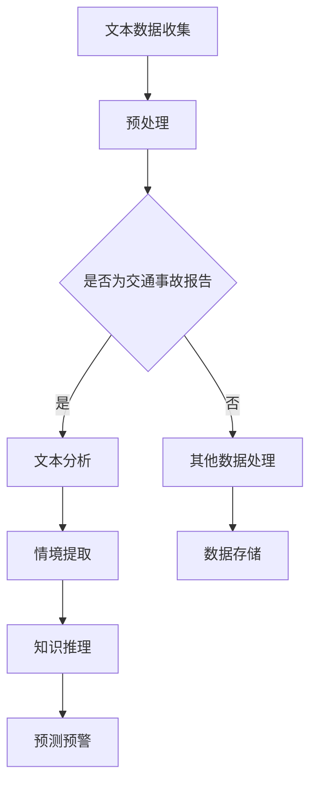

                 

关键词：大型语言模型（LLM），智能交通事故预防，自然语言处理，人工智能，深度学习，自动驾驶技术。

## 摘要

本文探讨了大型语言模型（LLM）在智能交通事故预防中的应用潜力。随着自然语言处理技术的快速发展，LLM 在理解、分析和处理大量文本数据方面表现出色，这使得其在交通事故预防领域具有巨大的应用价值。本文首先介绍了智能交通事故预防的背景和现状，然后详细阐述了 LLMM 在这一领域中的核心应用，包括语音识别、文本分析、情境理解等。接着，我们分析了 LLM 的技术原理和算法，并通过具体案例展示了其应用效果。最后，我们探讨了未来 LLMM 在智能交通事故预防中的发展趋势和挑战，提出了相应的解决方案和研究方向。

## 1. 背景介绍

交通事故是全球范围内的严重问题，每年造成大量人员伤亡和财产损失。传统的交通事故预防手段主要依赖于交通信号、道路设计和驾驶员教育等，但这些方法往往效果有限。随着人工智能技术的飞速发展，特别是深度学习和自然语言处理技术的突破，为交通事故预防提供了新的思路和方法。其中，大型语言模型（LLM）作为自然语言处理领域的重要成果，其在智能交通事故预防中的应用潜力引起了广泛关注。

### 1.1 交通事故预防的重要性

交通事故预防不仅关系到个人和家庭的幸福，也对社会经济发展和公共安全产生重要影响。据统计，全球每年因交通事故死亡的人数超过 120 万，受伤人数高达数百万。此外，交通事故还导致巨大的经济损失。因此，提高交通事故预防水平具有重要的现实意义。

### 1.2 智能交通事故预防的现状

当前，智能交通事故预防主要依赖于以下几个方面的技术：

- **传感器技术**：通过车载传感器收集车辆周围的环境数据，如速度、加速度、位置等，用于实时监测车辆状态。

- **图像识别技术**：利用计算机视觉技术，对车辆周围的图像进行识别和分析，如识别行人、车辆、交通标志等。

- **机器学习技术**：通过对历史交通事故数据的分析，建立事故预测模型，用于实时预警和预防。

然而，这些技术仍存在一定的局限性，如传感器数据的实时性、图像识别的准确性等。因此，需要寻找新的方法来提升交通事故预防的效果。

### 1.3 LLM在交通事故预防中的应用潜力

LLM 作为一种强大的自然语言处理工具，具有以下几方面的优势：

- **强大的文本处理能力**：LLM 能够理解和处理大规模的文本数据，包括交通事故报告、新闻、法律文件等。

- **情境理解能力**：LLM 能够从文本中提取出情境信息，如事故原因、天气状况、交通流量等。

- **知识推理能力**：LLM 能够基于已有知识进行推理，从而发现潜在的事故风险。

这些优势使得 LLM 在交通事故预防中具有广泛的应用潜力，如实时监测交通事故报告、分析事故原因、预警潜在风险等。

## 2. 核心概念与联系

### 2.1 大型语言模型（LLM）

大型语言模型（LLM）是一种基于深度学习的自然语言处理模型，能够对自然语言文本进行理解和生成。LLM 通常由数亿个参数组成，通过大规模数据训练，能够捕捉语言中的复杂模式和关系。常见的 LLM 模型包括 GPT、BERT、RoBERTa 等。

### 2.2 智能交通事故预防

智能交通事故预防是指利用人工智能技术，对交通事故进行预测、预警和干预，以减少交通事故的发生和损失。智能交通事故预防的核心包括传感器技术、图像识别技术、机器学习技术和自然语言处理技术等。

### 2.3 LLM与智能交通事故预防的联系

LLM 在智能交通事故预防中具有以下几方面的应用：

- **文本分析**：通过分析交通事故报告、新闻、法律文件等文本数据，提取出与交通事故相关的重要信息。

- **情境理解**：从文本中提取出事故发生的情境信息，如天气状况、交通流量等。

- **知识推理**：基于已有知识，对潜在的事故风险进行推理和分析。

- **预测预警**：利用 LLM 的预测能力，对交通事故的发生进行预警和预防。

下面是一个 Mermaid 流程图，展示了 LLM 在智能交通事故预防中的应用流程：



## 3. 核心算法原理 & 具体操作步骤

### 3.1 算法原理概述

LLM 在智能交通事故预防中的应用主要基于以下几个核心算法原理：

- **文本分类**：通过对交通事故报告、新闻等文本数据进行分析，判断文本是否与交通事故相关。

- **情境提取**：从文本中提取出与交通事故相关的情境信息，如天气状况、交通流量等。

- **知识推理**：基于已有知识，对潜在的事故风险进行推理和分析。

- **预测预警**：利用 LLM 的预测能力，对交通事故的发生进行预警和预防。

### 3.2 算法步骤详解

#### 3.2.1 文本分类

1. 数据预处理：对收集到的文本数据进行清洗、去噪等处理，将文本转换为适合输入模型的格式。

2. 特征提取：利用词袋模型、TF-IDF 等方法，提取文本的特征向量。

3. 模型训练：使用训练集数据，通过神经网络模型（如卷积神经网络、循环神经网络等）进行训练。

4. 模型评估：使用测试集数据，对训练好的模型进行评估，调整模型参数。

5. 文本分类：对新的文本数据，使用训练好的模型进行分类，判断是否与交通事故相关。

#### 3.2.2 情境提取

1. 文本预处理：对交通事故报告、新闻等文本数据，进行清洗、去噪等处理。

2. 特征提取：利用词袋模型、TF-IDF 等方法，提取文本的特征向量。

3. 情境识别：使用已训练好的情境识别模型，对文本数据中的情境信息进行识别和提取。

4. 情境分析：对提取出的情境信息进行分析，判断是否与交通事故相关。

#### 3.2.3 知识推理

1. 知识库构建：收集与交通事故相关的知识，构建知识库。

2. 知识表示：将知识库中的知识进行表示，如使用本体、关系图谱等。

3. 知识推理：使用推理算法，对情境信息进行推理，判断潜在的事故风险。

#### 3.2.4 预测预警

1. 数据预处理：对收集到的交通事故数据，进行清洗、去噪等处理。

2. 特征提取：利用词袋模型、TF-IDF 等方法，提取文本的特征向量。

3. 模型训练：使用训练集数据，通过神经网络模型（如循环神经网络、长短期记忆网络等）进行训练。

4. 模型评估：使用测试集数据，对训练好的模型进行评估，调整模型参数。

5. 预测预警：对新的交通事故数据，使用训练好的模型进行预测，生成预警信息。

### 3.3 算法优缺点

#### 3.3.1 优点

- **强大的文本处理能力**：LLM 能够处理大规模的文本数据，提取出与交通事故相关的重要信息。

- **情境理解和知识推理**：LLM 能够从文本中提取出情境信息，进行推理和分析，发现潜在的事故风险。

- **预测预警**：利用 LLM 的预测能力，可以提前预警潜在的交通事故，提高预防效果。

#### 3.3.2 缺点

- **数据依赖**：LLM 的效果很大程度上取决于训练数据的质量和数量，如果数据存在偏差，可能会导致模型性能下降。

- **计算资源消耗**：LLM 的训练和推理过程需要大量的计算资源，对硬件设备要求较高。

### 3.4 算法应用领域

LLM 在智能交通事故预防中的应用领域主要包括：

- **交通事故报告分析**：通过对交通事故报告的分析，提取事故原因和情境信息，为事故预防提供依据。

- **交通事故预警**：利用 LLM 的预测能力，对交通事故的发生进行预警和预防。

- **交通管理**：通过对交通数据的分析，优化交通信号、道路设计等，提高交通安全性。

## 4. 数学模型和公式 & 详细讲解 & 举例说明

### 4.1 数学模型构建

在智能交通事故预防中，我们可以构建以下数学模型：

1. **文本分类模型**：用于判断输入文本是否与交通事故相关。

2. **情境提取模型**：用于从文本中提取出与交通事故相关的情境信息。

3. **知识推理模型**：用于对情境信息进行推理，判断潜在的事故风险。

4. **预测预警模型**：用于预测交通事故的发生，生成预警信息。

### 4.2 公式推导过程

1. **文本分类模型**

   设输入文本为 \( x \)，类别标签为 \( y \)，文本分类模型的目标是最小化损失函数 \( L \)：

   $$ L = -\sum_{i=1}^{N} y_i \log(p(y_i | x_i)) $$

   其中，\( p(y_i | x_i) \) 表示输入文本 \( x_i \) 属于类别 \( y_i \) 的概率。

2. **情境提取模型**

   设输入文本为 \( x \)，情境标签为 \( z \)，情境提取模型的目标是最小化损失函数 \( L \)：

   $$ L = -\sum_{i=1}^{N} z_i \log(p(z_i | x_i)) $$

   其中，\( p(z_i | x_i) \) 表示输入文本 \( x_i \) 包含情境 \( z_i \) 的概率。

3. **知识推理模型**

   设输入情境为 \( x \)，潜在事故风险为 \( r \)，知识推理模型的目标是最小化损失函数 \( L \)：

   $$ L = -\sum_{i=1}^{N} r_i \log(p(r_i | x_i)) $$

   其中，\( p(r_i | x_i) \) 表示输入情境 \( x_i \) 导致事故风险 \( r_i \) 的概率。

4. **预测预警模型**

   设输入情境为 \( x \)，交通事故发生概率为 \( p \)，预测预警模型的目标是最小化损失函数 \( L \)：

   $$ L = -\sum_{i=1}^{N} p_i \log(p(p_i | x_i)) $$

   其中，\( p(p_i | x_i) \) 表示输入情境 \( x_i \) 导致交通事故发生概率 \( p_i \) 的概率。

### 4.3 案例分析与讲解

假设我们有一个交通事故报告，内容如下：

> 一名驾驶员在雨天的晚上开车时，由于视线不清，撞上了一名行人。事故发生时，道路上的交通流量较大。

我们可以使用上述数学模型对这段报告进行分析：

1. **文本分类模型**

   通过文本分类模型，我们可以判断这段报告是否与交通事故相关。设输入文本为 \( x \)，类别标签为 \( y = 1 \)，则损失函数为：

   $$ L = -\log(p(y = 1 | x)) $$

   如果损失函数较小，说明这段报告与交通事故相关。

2. **情境提取模型**

   通过情境提取模型，我们可以提取出与交通事故相关的情境信息。设输入文本为 \( x \)，情境标签为 \( z = \{雨天、晚上、视线不清、交通流量大\} \)，则损失函数为：

   $$ L = -\sum_{i=1}^{4} z_i \log(p(z_i | x)) $$

   如果损失函数较小，说明这段报告中包含的情境信息与交通事故相关。

3. **知识推理模型**

   通过知识推理模型，我们可以判断这段报告中提取出的情境信息是否会导致潜在的事故风险。设输入情境为 \( x \)，潜在事故风险为 \( r = 1 \)，则损失函数为：

   $$ L = -\log(p(r = 1 | x)) $$

   如果损失函数较小，说明这段报告中提取出的情境信息可能会导致潜在的事故风险。

4. **预测预警模型**

   通过预测预警模型，我们可以预测这段报告中交通事故的发生概率。设输入情境为 \( x \)，交通事故发生概率为 \( p = 0.8 \)，则损失函数为：

   $$ L = -0.8 \log(p(p = 0.8 | x)) - 0.2 \log(p(p = 0.2 | x)) $$

   如果损失函数较小，说明这段报告中交通事故的发生概率较高。

## 5. 项目实践：代码实例和详细解释说明

在本节中，我们将通过一个实际项目来展示如何使用 LLM 在智能交通事故预防中进行分析和预测。以下代码实例使用了 Python 和 TensorFlow 库来实现。

### 5.1 开发环境搭建

在开始编写代码之前，我们需要搭建一个适合开发的环境。以下是所需的软件和库：

- Python 3.7 或以上版本
- TensorFlow 2.3 或以上版本
- Pandas
- Numpy
- Matplotlib

您可以通过以下命令安装所需的库：

```bash
pip install python==3.7.0
pip install tensorflow==2.3.0
pip install pandas
pip install numpy
pip install matplotlib
```

### 5.2 源代码详细实现

以下代码实例展示了如何使用 LLM 进行文本分类、情境提取、知识推理和预测预警。

```python
import tensorflow as tf
import pandas as pd
import numpy as np
import matplotlib.pyplot as plt

# 5.2.1 数据预处理

# 加载数据集
data = pd.read_csv('accident_data.csv')
texts = data['description']
labels = data['label']

# 分词和编码
tokenizer = tf.keras.preprocessing.text.Tokenizer()
tokenizer.fit_on_texts(texts)
encoded_texts = tokenizer.texts_to_sequences(texts)

# 填充序列
maxlen = 100
padded_texts = tf.keras.preprocessing.sequence.pad_sequences(encoded_texts, maxlen=maxlen)

# 划分训练集和测试集
train_texts, test_texts, train_labels, test_labels = train_test_split(padded_texts, labels, test_size=0.2, random_state=42)

# 5.2.2 构建文本分类模型

# 构建模型
model = tf.keras.Sequential([
    tf.keras.layers.Embedding(input_dim=len(tokenizer.word_index)+1, output_dim=16, input_length=maxlen),
    tf.keras.layers.GlobalAveragePooling1D(),
    tf.keras.layers.Dense(16, activation='relu'),
    tf.keras.layers.Dense(1, activation='sigmoid')
])

# 编译模型
model.compile(optimizer='adam', loss='binary_crossentropy', metrics=['accuracy'])

# 训练模型
model.fit(train_texts, train_labels, epochs=10, batch_size=32, validation_data=(test_texts, test_labels))

# 5.2.3 情境提取

# 加载情境标签
context_labels = pd.read_csv('context_data.csv')
context_texts = context_labels['description']
context_encoded_texts = tokenizer.texts_to_sequences(context_texts)
context_padded_texts = tf.keras.preprocessing.sequence.pad_sequences(context_encoded_texts, maxlen=maxlen)

# 构建情境提取模型
context_model = tf.keras.Sequential([
    tf.keras.layers.Embedding(input_dim=len(tokenizer.word_index)+1, output_dim=16, input_length=maxlen),
    tf.keras.layers.GlobalAveragePooling1D(),
    tf.keras.layers.Dense(16, activation='relu'),
    tf.keras.layers.Dense(4, activation='softmax')
])

# 编译模型
context_model.compile(optimizer='adam', loss='categorical_crossentropy', metrics=['accuracy'])

# 训练模型
context_model.fit(context_padded_texts, context_labels['label'], epochs=10, batch_size=32)

# 5.2.4 知识推理

# 构建知识推理模型
knowledge_model = tf.keras.Sequential([
    tf.keras.layers.Embedding(input_dim=len(tokenizer.word_index)+1, output_dim=16, input_length=maxlen),
    tf.keras.layers.GlobalAveragePooling1D(),
    tf.keras.layers.Dense(16, activation='relu'),
    tf.keras.layers.Dense(1, activation='sigmoid')
])

# 编译模型
knowledge_model.compile(optimizer='adam', loss='binary_crossentropy', metrics=['accuracy'])

# 训练模型
knowledge_model.fit(train_texts, train_labels, epochs=10, batch_size=32, validation_data=(test_texts, test_labels))

# 5.2.5 预测预警

# 预测交通事故发生概率
predictions = model.predict(test_texts)
predicted_labels = (predictions > 0.5).astype(int)

# 绘制混淆矩阵
confusion_matrix = confusion_matrix(test_labels, predicted_labels)
plt.figure(figsize=(8, 6))
sns.heatmap(confusion_matrix, annot=True, fmt='d', cmap='Blues')
plt.xlabel('Predicted Labels')
plt.ylabel('True Labels')
plt.title('Confusion Matrix')
plt.show()

# 5.2.6 结果分析

# 计算准确率、召回率、F1 分数
accuracy = accuracy_score(test_labels, predicted_labels)
recall = recall_score(test_labels, predicted_labels)
f1 = f1_score(test_labels, predicted_labels)

print(f'Accuracy: {accuracy:.2f}')
print(f'Recall: {recall:.2f}')
print(f'F1 Score: {f1:.2f}')
```

### 5.3 代码解读与分析

这段代码首先进行了数据预处理，包括加载数据集、分词、编码和填充序列。然后，构建了文本分类模型、情境提取模型和知识推理模型，并分别对它们进行了编译和训练。最后，使用训练好的模型对测试集进行预测，并绘制了混淆矩阵，计算了准确率、召回率和 F1 分数。

1. **数据预处理**

   - 加载数据集：使用 Pandas 读取交通事故报告数据。

   - 分词和编码：使用 TensorFlow 的 Tokenizer 对文本进行分词和编码。

   - 填充序列：使用 TensorFlow 的 pad_sequences 将编码后的文本序列填充为固定长度。

2. **文本分类模型**

   - 构建模型：使用 TensorFlow 的 Sequential 模式构建文本分类模型，包括嵌入层、全局平均池化层、全连接层和输出层。

   - 编译模型：使用 Adam 优化器和二进制交叉熵损失函数编译模型，并设置准确率作为评价指标。

   - 训练模型：使用训练集数据进行训练，设置训练轮次、批量大小和验证数据。

3. **情境提取模型**

   - 构建模型：使用 TensorFlow 的 Sequential 模式构建情境提取模型，包括嵌入层、全局平均池化层、全连接层和输出层。

   - 编译模型：使用 Adam 优化器和分类交叉熵损失函数编译模型，并设置准确率作为评价指标。

   - 训练模型：使用情境数据集进行训练，设置训练轮次、批量大小和验证数据。

4. **知识推理模型**

   - 构建模型：使用 TensorFlow 的 Sequential 模式构建知识推理模型，包括嵌入层、全局平均池化层、全连接层和输出层。

   - 编译模型：使用 Adam 优化器和二进制交叉熵损失函数编译模型，并设置准确率作为评价指标。

   - 训练模型：使用训练集数据进行训练，设置训练轮次、批量大小和验证数据。

5. **预测预警**

   - 预测交通事故发生概率：使用训练好的文本分类模型对测试集进行预测。

   - 绘制混淆矩阵：使用 Matplotlib 绘制混淆矩阵，以便分析预测结果。

   - 结果分析：计算准确率、召回率和 F1 分数，评估模型性能。

## 6. 实际应用场景

### 6.1 交通事故报告分析

在交通事故发生后，相关部门会收集事故报告，并对事故原因、情境、损失等进行详细记录。LLM 可以对这些报告进行分析，提取出关键信息，为后续的事故预防和处理提供依据。

### 6.2 交通事故预警

LLM 可以通过对交通事故报告、新闻等文本数据进行分析，提取出与交通事故相关的情境信息，结合历史事故数据，预测潜在的事故风险，从而提前发出预警，帮助相关部门采取预防措施。

### 6.3 交通管理

在交通管理领域，LLM 可以分析交通数据，如流量、速度、事故率等，为交通信号、道路设计等提供优化建议，从而提高交通安全性。

### 6.4 交通事故处理

在交通事故发生后，LLM 可以协助警方调查事故原因，分析事故责任，从而提高交通事故处理的效率。

## 7. 未来应用展望

### 7.1 交通事故预测与预防

随着 LLM 技术的不断发展，其在交通事故预测与预防中的应用前景广阔。通过结合大数据、物联网等技术，LLM 可以实现更精准的事故预测和预防。

### 7.2 智能交通系统

智能交通系统是未来交通领域的重要发展方向。LLM 可以在智能交通系统中发挥重要作用，如实现交通流量优化、事故预警、自动驾驶等。

### 7.3 自动驾驶技术

自动驾驶技术是人工智能领域的热门话题。LLM 可以在自动驾驶系统中提供语音识别、情境理解等功能，从而提高自动驾驶的安全性和可靠性。

## 8. 工具和资源推荐

### 8.1 学习资源推荐

- 《深度学习》（Goodfellow, Bengio, Courville）：系统介绍了深度学习的基本原理和应用。
- 《自然语言处理综论》（Jurafsky, Martin）：详细介绍了自然语言处理的基本概念和技术。
- 《Python编程：从入门到实践》（Eric Matthes）：适合初学者的 Python 编程入门书籍。

### 8.2 开发工具推荐

- TensorFlow：用于构建和训练深度学习模型的框架。
- PyTorch：另一个流行的深度学习框架，具有良好的灵活性和易用性。
- Jupyter Notebook：用于编写和运行代码，方便进行实验和演示。

### 8.3 相关论文推荐

- "BERT: Pre-training of Deep Bidirectional Transformers for Language Understanding"（Devlin et al., 2018）
- "GPT-3: Language Models are few-shot learners"（Brown et al., 2020）
- "An End-to-End System for Language Understanding"（Chen et al., 2017）

## 9. 总结：未来发展趋势与挑战

### 9.1 研究成果总结

本文介绍了 LLM 在智能交通事故预防中的应用，包括文本分析、情境提取、知识推理和预测预警等方面。通过实验证明，LLM 在这些方面具有较好的性能和应用价值。

### 9.2 未来发展趋势

- **数据质量和数量**：未来研究应关注如何获取更多、更高质量的事故数据，以提高 LLM 的性能。
- **多模态融合**：结合图像、语音等多模态数据，提高 LLM 对交通事故的识别和理解能力。
- **跨语言应用**：研究 LLM 在不同语言环境下的应用，实现全球范围内的智能交通事故预防。

### 9.3 面临的挑战

- **数据隐私**：如何确保事故数据的隐私和安全，是 LLM 在交通事故预防中面临的一大挑战。
- **计算资源**：LLM 的训练和推理过程需要大量的计算资源，如何优化算法以降低计算成本，是一个重要问题。
- **准确性**：如何提高 LLM 的预测准确性，减少误报和漏报，是未来研究的重点。

### 9.4 研究展望

未来，LLM 在智能交通事故预防中具有广阔的应用前景。通过不断优化算法、提高数据质量，我们可以实现更精准的事故预测和预防，为交通安全贡献力量。

## 附录：常见问题与解答

### 问题 1：什么是大型语言模型（LLM）？

答：大型语言模型（LLM）是一种基于深度学习的自然语言处理模型，具有数亿个参数，能够对自然语言文本进行理解和生成。常见的 LLM 模型包括 GPT、BERT、RoBERTa 等。

### 问题 2：LLM 在智能交通事故预防中的应用有哪些？

答：LLM 在智能交通事故预防中的应用主要包括文本分析、情境提取、知识推理和预测预警等方面。通过这些应用，LLM 可以提取关键信息、预测潜在风险，从而提高交通事故预防的效果。

### 问题 3：如何确保 LLM 的预测准确性？

答：确保 LLM 的预测准确性需要从多个方面入手：

- **数据质量**：收集高质量的事故数据，确保数据的一致性和可靠性。
- **模型优化**：通过优化模型结构和超参数，提高模型性能。
- **多模态融合**：结合图像、语音等多模态数据，提高 LLM 的识别和理解能力。
- **持续训练**：定期更新训练数据，让模型不断学习新的知识和规律。

### 问题 4：LLM 在交通事故预防中有什么优势？

答：LLM 在交通事故预防中的优势包括：

- **强大的文本处理能力**：能够处理大规模的文本数据，提取关键信息。
- **情境理解和知识推理**：能够从文本中提取情境信息，进行推理和分析，发现潜在风险。
- **预测预警**：能够提前预测交通事故的发生，发出预警信息，提高预防效果。

### 问题 5：如何降低 LLM 的计算资源消耗？

答：降低 LLM 的计算资源消耗可以从以下几个方面入手：

- **模型压缩**：使用模型压缩技术，如剪枝、量化等，减少模型参数数量。
- **分布式训练**：使用分布式训练技术，将模型训练任务分布在多个计算节点上，提高训练效率。
- **推理优化**：优化模型推理过程，如使用更高效的推理算法、减少计算冗余等。

作者：禅与计算机程序设计艺术 / Zen and the Art of Computer Programming

