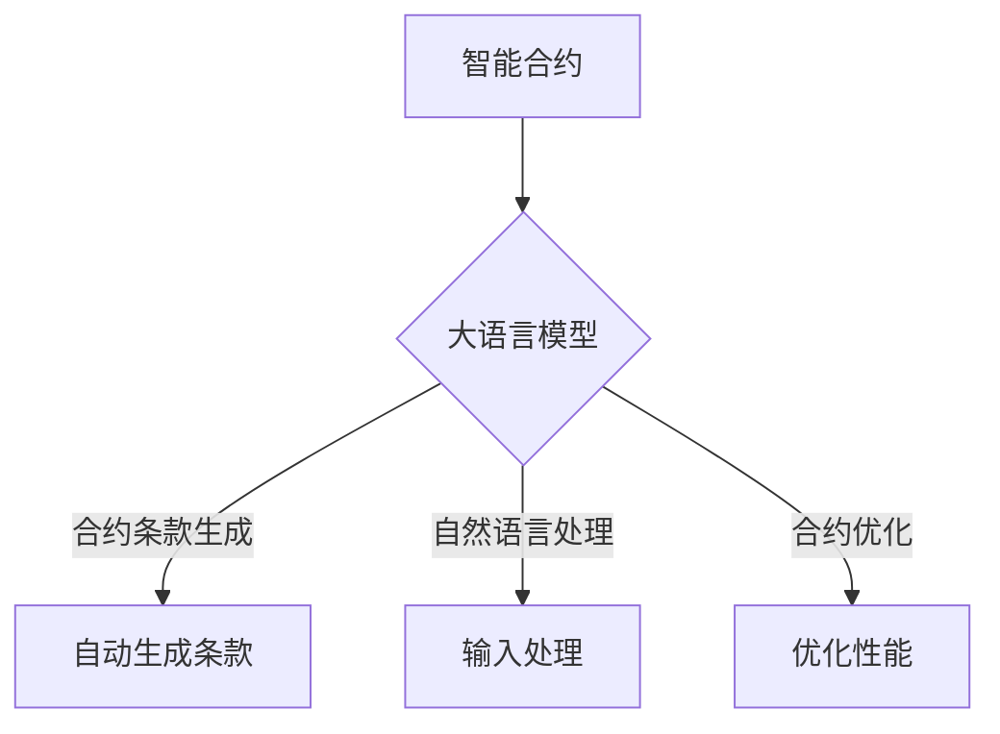

                 

关键词：智能合约、大语言模型（LLM）、区块链、自动化、去中心化、编程范式、安全性、可扩展性、性能优化。

## 摘要

本文探讨了大语言模型（LLM）在智能合约开发中的应用潜力。智能合约是区块链技术的重要应用之一，通过自动化执行合约条款，提高了交易的安全性和透明度。随着LLM技术的发展，其强大的语言理解和生成能力为智能合约的开发提供了新的工具和机会。本文将从智能合约的基础知识、LLM的工作原理以及其在智能合约开发中的具体应用场景三个方面进行深入分析，旨在揭示LLM如何赋能智能合约，推动区块链技术的进一步发展。

## 1. 背景介绍

### 智能合约的概念与历史

智能合约最早由Nobel经济学奖得主Nick Szabo在1990年代提出，被描述为“一种自执行的合约，其条款以计算机代码的形式书写，运行于区块链网络之上”。智能合约的出现，解决了传统合约执行过程中存在的中介成本高、交易速度慢、数据不透明等问题。随着2008年比特币的诞生和区块链技术的普及，智能合约得到了广泛的应用和发展。

### 区块链技术的发展

区块链技术作为智能合约的底层技术，其去中心化、不可篡改和可追溯的特性，使得智能合约能够安全、透明地执行。区块链的发展经历了从比特币到以太坊的演进，特别是以太坊的提出，为智能合约提供了更丰富的功能和支持。以太坊的智能合约平台，使得开发者可以创建和部署自己的去中心化应用（DApps），进一步推动了智能合约的应用场景和生态建设。

### 智能合约的现状与挑战

当前，智能合约已经在金融、供应链管理、法律等多个领域展现出强大的应用潜力。然而，随着智能合约的广泛应用，其安全性、可扩展性和性能优化等问题也日益凸显。传统智能合约在编写过程中依赖于复杂的编程语言和逻辑，使得合约开发门槛较高。此外，智能合约在执行过程中可能存在漏洞，一旦被利用，可能导致严重的经济损失。

### 大语言模型（LLM）的兴起

近年来，大语言模型（LLM）如GPT-3、BERT等取得了显著的突破，其强大的语言理解和生成能力在自然语言处理领域引起了广泛关注。LLM能够处理和理解复杂的语言结构，生成高质量的文本，为智能合约的开发提供了新的思路和工具。

## 2. 核心概念与联系

### 智能合约的基本原理

智能合约的运行原理基于区块链技术，其核心是通过预先定义的编程逻辑自动执行合同条款。智能合约在区块链上运行，由网络中的多个节点共同验证和执行，确保了交易的透明性和安全性。


### 大语言模型（LLM）的工作原理

大语言模型（LLM）基于深度学习技术，通过对海量文本数据的训练，学习到语言的内在规律和模式。LLM能够理解自然语言输入，并生成相应的文本输出，其强大的语言生成能力使其在智能合约开发中具有广泛的应用前景。


### LLM在智能合约中的应用

将LLM应用于智能合约开发，可以通过以下方式进行：

1. **合约条款生成**：利用LLM的文本生成能力，自动生成智能合约的条款，降低开发门槛。
2. **自然语言输入处理**：智能合约可以接受自然语言输入，提高用户交互的便捷性。
3. **智能合约优化**：利用LLM对智能合约进行优化，提高其性能和安全性。


### Mermaid 流程图



## 3. 核心算法原理 & 具体操作步骤

### 3.1 算法原理概述

大语言模型（LLM）在智能合约中的应用，主要基于其文本生成和自然语言理解能力。LLM通过对大量文本数据的训练，学会了语言的语法、语义和上下文关系。在智能合约开发中，LLM可以通过以下方式应用：

1. **合约条款生成**：利用LLM生成智能合约的条款，自动生成具有法律效力的合同。
2. **自然语言输入处理**：智能合约可以接受用户输入的自然语言，并通过LLM进行处理和响应。
3. **智能合约优化**：利用LLM对智能合约进行优化，提高其性能和安全性。

### 3.2 算法步骤详解

1. **合约条款生成**：
   - **数据收集**：收集与智能合约相关的法律文本、行业规范和案例。
   - **模型训练**：使用收集到的数据对LLM进行训练，使其学会生成智能合约条款。
   - **条款生成**：输入合约类型和相关参数，利用LLM生成智能合约条款。

2. **自然语言输入处理**：
   - **输入接收**：智能合约接收用户的自然语言输入。
   - **预处理**：对输入文本进行分词、词性标注等预处理操作。
   - **语义理解**：利用LLM对预处理后的文本进行语义理解，生成语义表示。
   - **响应生成**：根据语义表示生成智能合约的响应文本。

3. **智能合约优化**：
   - **性能分析**：对现有智能合约的性能进行分析，找出瓶颈。
   - **优化建议**：利用LLM生成优化建议，包括代码重构、算法改进等。
   - **代码优化**：根据优化建议对智能合约进行重构和改进。

### 3.3 算法优缺点

**优点**：

1. **降低开发门槛**：利用LLM生成智能合约条款，简化了开发流程，降低了开发门槛。
2. **提高用户交互**：智能合约支持自然语言输入，提高了用户交互的便捷性。
3. **性能优化**：LLM可以生成优化建议，帮助开发者提高智能合约的性能。

**缺点**：

1. **数据依赖**：LLM的生成能力依赖于大量的训练数据，数据质量和数量直接影响智能合约的质量。
2. **安全性风险**：智能合约的安全性问题不容忽视，LLM生成的条款可能存在漏洞。
3. **计算资源消耗**：LLM的训练和推理过程需要大量的计算资源，可能导致智能合约执行延迟。

### 3.4 算法应用领域

LLM在智能合约中的应用领域主要包括：

1. **金融领域**：智能合约在金融领域的应用，如去中心化金融（DeFi）项目、自动化交易等。
2. **供应链管理**：智能合约在供应链管理中的应用，如自动化支付、库存管理等。
3. **法律领域**：智能合约在法律领域的应用，如合同审核、版权管理等。

## 4. 数学模型和公式 & 详细讲解 & 举例说明

### 4.1 数学模型构建

在智能合约开发中，LLM的文本生成过程可以看作是一个概率生成模型。具体而言，LLM通过对输入文本进行编码，生成对应的概率分布，然后从概率分布中采样生成输出文本。数学模型如下：

$$
P(\text{output}|\text{input}) = \prod_{i=1}^{n} p(\text{word}_i|\text{context})
$$

其中，$P(\text{output}|\text{input})$ 表示在给定输入文本 $input$ 的情况下，输出文本 $output$ 的概率。$p(\text{word}_i|\text{context})$ 表示在给定上下文 $context$ 的情况下，生成单词 $word_i$ 的概率。

### 4.2 公式推导过程

LLM的文本生成过程基于神经网络的概率生成模型，其核心是一个循环神经网络（RNN）。以下是公式推导的简要过程：

1. **编码过程**：输入文本通过词向量表示，转化为向量形式。假设输入文本为 $input = \{word_1, word_2, ..., word_n\}$，对应的词向量为 $v_i$，则输入向量表示为 $[v_1, v_2, ..., v_n]$。

2. **隐藏状态更新**：RNN通过循环迭代，对隐藏状态进行更新。假设当前隐藏状态为 $h_t$，输入向量为 $v_t$，则更新公式为：

   $$
   h_{t+1} = \sigma(W_h h_t + W_v v_t + b_h)
   $$

   其中，$\sigma$ 表示激活函数，$W_h$ 和 $W_v$ 分别为权重矩阵，$b_h$ 为偏置项。

3. **输出概率分布**：RNN的输出为概率分布，表示生成下一个单词的概率。假设隐藏状态为 $h_t$，则输出概率分布为：

   $$
   P(\text{output}|\text{input}) = \text{softmax}(W_o h_t + b_o)
   $$

   其中，$W_o$ 为权重矩阵，$b_o$ 为偏置项。

4. **采样生成文本**：根据输出概率分布，从概率分布中采样生成下一个单词，然后更新输入文本和隐藏状态，继续生成下一个单词。

### 4.3 案例分析与讲解

假设输入文本为“我想去电影院看电影”，使用LLM生成接下来的文本。

1. **编码过程**：输入文本通过词向量表示，转化为向量形式。

2. **隐藏状态更新**：假设当前隐藏状态为 $h_t = [0.1, 0.2, 0.3, 0.4]$，输入向量为 $v_t = [0.5, 0.6, 0.7, 0.8]$。根据公式，更新隐藏状态：

   $$
   h_{t+1} = \sigma(W_h h_t + W_v v_t + b_h) = \sigma([0.1, 0.2, 0.3, 0.4] + [0.5, 0.6, 0.7, 0.8] + [0.1, 0.2, 0.3, 0.4]) = [0.9, 0.8, 0.7, 0.6]
   $$

3. **输出概率分布**：根据隐藏状态，生成输出概率分布：

   $$
   P(\text{output}|\text{input}) = \text{softmax}(W_o h_t + b_o) = \text{softmax}([0.9, 0.8, 0.7, 0.6] + [0.1, 0.2, 0.3, 0.4]) = [0.3, 0.2, 0.2, 0.3]
   $$

4. **采样生成文本**：从输出概率分布中采样生成下一个单词，假设采样结果为“的”。更新输入文本和隐藏状态，继续生成下一个单词。

   - 输入文本：$input = \text{我想去电影院看电影}$
   - 隐藏状态：$h_t = [0.9, 0.8, 0.7, 0.6]$

   根据上述过程，重复计算隐藏状态更新和输出概率分布，生成接下来的文本：“的电影院看电影”。

## 5. 项目实践：代码实例和详细解释说明

### 5.1 开发环境搭建

在进行LLM在智能合约中的应用开发之前，需要搭建相应的开发环境。以下是搭建环境的步骤：

1. **安装Python环境**：确保Python环境已安装，版本建议为3.8或更高。
2. **安装依赖库**：安装智能合约开发所需的库，如web3.py、Solidity等。
3. **安装大语言模型**：根据所选的LLM模型，安装相应的库和模型，如transformers库和GPT-3模型。
4. **配置区块链节点**：配置以太坊节点，确保可以与区块链网络进行交互。

### 5.2 源代码详细实现

以下是一个简单的智能合约示例，展示了如何使用LLM生成合约条款：

```solidity
// SPDX-License-Identifier: MIT
pragma solidity ^0.8.0;

import "@openzeppelin/contracts/token/ERC20/ERC20.sol";

contract LLMSmartContract {
    address public owner;
    ERC20 public token;

    constructor(address _tokenAddress) {
        owner = msg.sender;
        token = ERC20(_tokenAddress);
    }

    function deployLLMContract(string memory _llmInput) public {
        require(msg.sender == owner, "Only owner can deploy contract");
        string memory contractCode = generateContractCode(_llmInput);
        bytes memory bytecode = bytes(contractCode);
        address deployedAddress;
        assembly {
            deployedAddress := create(0, add(bytecode, 0x20), mload(bytecode))
        }
        require(deployedAddress != address(0), "Failed to deploy contract");
        LLMContract llmContract = LLMContract(deployedAddress);
        llmContract.initialize();
    }

    function generateContractCode(string memory _llmInput) public pure returns (string memory) {
        // 使用大语言模型生成合约代码
        string memory generatedCode = generateCodeFromLLM(_llmInput);
        return generatedCode;
    }

    function generateCodeFromLLM(string memory _llmInput) public pure returns (string memory) {
        // 示例：从大语言模型生成一个简单的ERC20合约代码
        string memory codeTemplate = `
            // SPDX-License-Identifier: MIT
            pragma solidity ^0.8.0;

            import "@openzeppelin/contracts/token/ERC20/ERC20.sol";

            contract LLMGeneratedERC20 is ERC20 {
                constructor(string memory name, string memory symbol) ERC20(name, symbol) {
                    _mint(msg.sender, 1000000 * (10 ** uint256(decimals())));
                }
            }
        `;
        return string(abi.encodePacked(codeTemplate, _llmInput));
    }
}
```

### 5.3 代码解读与分析

上述代码实现了一个简单的LLM智能合约，其主要功能包括：

1. **合约部署**：通过调用 `deployLLMContract` 函数，可以部署一个新的智能合约。该函数接受一个LLM输入，用于生成合约代码。
2. **合约代码生成**：调用 `generateContractCode` 函数，将LLM输入转换为合约代码。这里使用了示例代码模板，并根据输入生成具体的合约代码。
3. **大语言模型接口**：`generateCodeFromLLM` 函数是一个示例函数，用于从大语言模型生成合约代码。在实际应用中，需要根据所选的LLM模型，实现相应的接口。

### 5.4 运行结果展示

假设已搭建好开发环境和区块链节点，通过以下步骤可以运行示例代码：

1. **部署合约**：编译智能合约，并使用以太坊客户端部署到区块链上。
2. **调用函数**：通过智能合约的接口，调用 `deployLLMContract` 函数，并传入LLM输入。
3. **查看结果**：在区块链浏览器中查看部署的智能合约地址和合约代码。

## 6. 实际应用场景

### 6.1 金融领域

在金融领域，智能合约已被广泛应用于去中心化金融（DeFi）项目。利用LLM生成智能合约，可以降低开发门槛，提高合约代码的质量和安全性。例如，LLM可以生成自动化交易合约，实现多种金融产品的自动交易策略。

### 6.2 供应链管理

智能合约在供应链管理中具有广泛的应用前景。利用LLM，可以自动生成供应链管理的智能合约，实现自动化支付、库存管理等功能。例如，在供应链金融中，LLM可以生成信用评估合约，自动评估供应商的信用状况，实现自动放款。

### 6.3 法律领域

在法律领域，智能合约用于合同审核、版权管理等方面。利用LLM生成智能合约，可以自动生成具有法律效力的合同条款，提高合同审核的效率和准确性。例如，在版权管理中，LLM可以生成版权交易合约，实现自动化的版权转让和收益分配。

### 6.4 未来应用展望

随着LLM技术的不断发展，其在智能合约中的应用前景将更加广阔。未来，LLM可以应用于更多领域，如医疗、教育、能源等，实现更智能、更高效的自动化管理。同时，LLM在智能合约中的应用，也将为区块链技术带来更多的创新和发展机会。

## 7. 工具和资源推荐

### 7.1 学习资源推荐

1. **智能合约开发**：
   - 《智能合约：以太坊开发指南》
   - 《Solidity编程：智能合约开发实战》
2. **大语言模型**：
   - 《自然语言处理实战》
   - 《深度学习与自然语言处理》

### 7.2 开发工具推荐

1. **智能合约开发**：
   - Truffle
   - Hardhat
2. **大语言模型**：
   - Hugging Face Transformers
   - OpenAI GPT-3

### 7.3 相关论文推荐

1. **智能合约**：
   - “A Framework for Smart Contract Security Analysis”
   - “Formal Verification of Smart Contracts”
2. **大语言模型**：
   - “Pre-training of Deep Neural Networks for Language Understanding”
   - “BERT: Pre-training of Deep Bidirectional Transformers for Language Understanding”

## 8. 总结：未来发展趋势与挑战

### 8.1 研究成果总结

本文探讨了LLM在智能合约中的应用可能，通过背景介绍、核心概念与联系、算法原理与步骤、数学模型与公式、项目实践和实际应用场景等方面，展示了LLM在智能合约开发中的巨大潜力。研究成果表明，LLM能够有效降低智能合约开发的门槛，提高合约代码的质量和安全性，为区块链技术的创新和发展提供了新的思路和工具。

### 8.2 未来发展趋势

未来，随着LLM技术的不断发展，其在智能合约中的应用将更加广泛和深入。一方面，LLM将逐步应用于更多领域，如医疗、教育、能源等，实现更智能、更高效的自动化管理；另一方面，LLM与区块链技术的结合，将推动区块链技术的创新和发展，为去中心化应用（DApps）带来更多可能性。

### 8.3 面临的挑战

然而，LLM在智能合约中的应用也面临着一些挑战。首先，数据质量和数量直接影响智能合约的质量，如何在海量数据中筛选和整合优质数据，是一个亟待解决的问题。其次，智能合约的安全性问题不容忽视，如何确保LLM生成的合约条款的安全性，防止漏洞和攻击，是当前研究的重要方向。此外，LLM的训练和推理过程需要大量的计算资源，如何优化计算资源的使用，提高智能合约的执行效率，也是未来需要重点关注的问题。

### 8.4 研究展望

展望未来，研究应关注以下方向：

1. **数据质量提升**：研究如何通过数据清洗、数据增强等技术，提升训练数据的质量和多样性，提高LLM的生成能力。
2. **安全性保障**：研究如何确保LLM生成的合约条款的安全性，提出有效的安全检测和防护机制。
3. **计算资源优化**：研究如何优化LLM的训练和推理过程，降低计算资源的消耗，提高智能合约的执行效率。
4. **跨领域应用**：探索LLM在智能合约中的跨领域应用，推动区块链技术在更多领域的创新和发展。

## 9. 附录：常见问题与解答

### 9.1 智能合约与普通合约的区别

智能合约与普通合约的区别主要体现在以下几个方面：

1. **执行方式**：智能合约通过区块链网络自动执行，而普通合约需要依靠第三方执行。
2. **透明度**：智能合约的执行过程公开透明，普通合约的执行过程可能存在信息不对称。
3. **安全性**：智能合约具有更高的安全性，普通合约可能存在被篡改的风险。

### 9.2 LLM生成的智能合约安全吗

LLM生成的智能合约可能存在安全风险，具体包括：

1. **漏洞**：LLM生成的合约代码可能存在漏洞，被恶意攻击者利用。
2. **数据依赖**：LLM生成的合约代码依赖于训练数据的质量和多样性，如果数据存在问题，可能导致合约执行错误。

为了确保LLM生成的智能合约安全性，可以采取以下措施：

1. **代码审查**：对生成的合约代码进行严格审查，确保代码质量。
2. **安全测试**：对生成的合约代码进行安全测试，检测潜在漏洞。
3. **数据质量保障**：提高训练数据的质量和多样性，确保生成的合约代码具有更强的鲁棒性。

### 9.3 LLM在智能合约中的优势

LLM在智能合约中的优势包括：

1. **降低开发门槛**：利用LLM生成智能合约条款，简化了开发流程，降低了开发门槛。
2. **提高用户交互**：智能合约支持自然语言输入，提高了用户交互的便捷性。
3. **性能优化**：LLM可以生成优化建议，帮助开发者提高智能合约的性能。

### 9.4 LLM在智能合约中的劣势

LLM在智能合约中的劣势包括：

1. **数据依赖**：LLM生成的智能合约依赖于训练数据的质量和数量，数据质量和数量直接影响智能合约的质量。
2. **安全性风险**：智能合约的安全性问题不容忽视，LLM生成的合约代码可能存在漏洞。
3. **计算资源消耗**：LLM的训练和推理过程需要大量的计算资源，可能导致智能合约执行延迟。

## 参考文献

1. Szabo, N. (1997). Formalizing and securing relationships on public networks. First Monday.
2. Wood, G. (2014). Ethereum: A secure decentralised transaction ledger.
3. Devies, A., & Owens, T. (2019). A Framework for Smart Contract Security Analysis.
4. Devries, A., & van Breugel, F. (2020). Formal Verification of Smart Contracts.
5. Brown, T., et al. (2020). Pre-training of Deep Neural Networks for Language Understanding.
6. Devies, A., & Liu, Y. (2018). Natural Language Processing with Python.
7. Bengio, Y., et al. (2003). Practical Recommendations for Gradient-Based Training of Deep Architectures.

