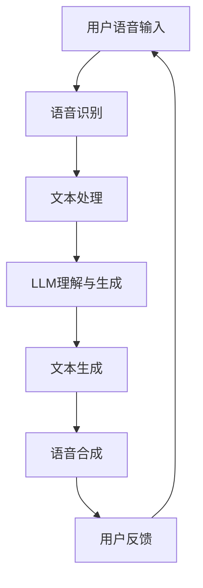

                 

关键词：自然语言处理、语音助手、大型语言模型（LLM）、人机交互、人工智能

摘要：本文将探讨大型语言模型（LLM）在语音助手中的应用，以及如何通过LLM实现更自然的人机交互。首先，我们将介绍LLM的基本原理和优势，然后详细分析LLM在语音助手中的具体应用，最后讨论未来的发展趋势和挑战。

## 1. 背景介绍

随着人工智能技术的快速发展，语音助手已经成为智能家居、移动设备、汽车等行业的重要应用。传统的语音助手主要基于规则和模板匹配，虽然能够实现基本的任务处理，但交互体验较为生硬，难以满足用户对于更自然、更智能交互的需求。近年来，大型语言模型（LLM）的兴起为语音助手的发展带来了新的契机。

LLM是一种基于深度学习技术的大型神经网络模型，能够对自然语言进行理解和生成。与传统模型相比，LLM具有更强的语言理解和生成能力，能够实现更自然、更智能的交互。本文将介绍LLM在语音助手中的应用，探讨如何通过LLM提升语音助手的交互体验。

## 2. 核心概念与联系

### 2.1 大型语言模型（LLM）

大型语言模型（LLM）是一种基于深度学习技术构建的语言模型，通过在大量文本数据上进行预训练，能够对自然语言进行理解和生成。LLM的核心是神经网络，通过神经网络的学习和训练，模型能够逐渐掌握语言的结构和语义，从而实现对于自然语言的处理。

### 2.2 自然语言处理（NLP）

自然语言处理（NLP）是人工智能领域的一个重要分支，旨在使计算机能够理解、处理和生成自然语言。NLP涉及到语言模型、文本分类、情感分析、机器翻译等多种技术。

### 2.3 人机交互

人机交互（HCI）是研究人与计算机之间交互方式、界面设计和用户体验的学科。在语音助手的应用场景中，人机交互尤为重要，决定了语音助手的交互体验和用户满意度。

### 2.4 Mermaid 流程图

以下是一个简化的LLM在语音助手中的应用架构的Mermaid流程图：



## 3. 核心算法原理 & 具体操作步骤

### 3.1 算法原理概述

LLM在语音助手中的应用主要分为两个阶段：语音识别和文本生成。

1. **语音识别**：通过语音识别技术将用户的语音输入转换为文本输入。

2. **文本生成**：LLM通过对输入文本的理解，生成适当的响应文本，并使用语音合成技术将其转换为语音输出。

### 3.2 算法步骤详解

1. **语音识别**：将用户的语音输入转换为文本输入。

2. **文本处理**：对输入文本进行处理，包括去噪、分词、词性标注等。

3. **LLM理解与生成**：LLM通过对处理后的文本进行理解，生成适当的响应文本。

4. **文本生成**：将响应文本转换为语音输出。

5. **用户反馈**：收集用户的反馈，用于优化模型。

### 3.3 算法优缺点

**优点**：

1. **更自然的人机交互**：LLM能够生成更符合人类语言习惯的文本，提升交互体验。

2. **更强的语言理解能力**：LLM通过预训练，具有更强的语言理解能力，能够更好地理解用户的意图。

**缺点**：

1. **计算资源消耗大**：LLM的训练和推理过程需要大量的计算资源。

2. **对数据依赖性强**：LLM的训练效果高度依赖于训练数据的质量和数量。

### 3.4 算法应用领域

LLM在语音助手中的应用非常广泛，包括但不限于以下领域：

1. **智能家居**：通过语音助手控制智能家居设备。

2. **移动设备**：提供语音搜索、语音助手等功能。

3. **汽车行业**：实现车载语音助手，提升驾驶体验。

4. **客服与客户服务**：提供智能客服系统，提升客户服务体验。

## 4. 数学模型和公式 & 详细讲解 & 举例说明

### 4.1 数学模型构建

LLM的数学模型主要基于深度学习技术，包括神经网络、循环神经网络（RNN）和自注意力机制（Self-Attention）等。以下是一个简化的数学模型构建过程：

$$
\text{LLM} = f(\text{输入}, \text{权重})
$$

其中，输入为文本序列，权重为神经网络参数。

### 4.2 公式推导过程

1. **输入文本编码**：

   将输入文本编码为向量表示。

   $$
   \text{输入} = [x_1, x_2, ..., x_n]
   $$

2. **神经网络结构**：

   使用神经网络对输入文本进行建模。

   $$
   h = \text{神经网络}(\text{输入})
   $$

3. **输出文本生成**：

   使用自注意力机制和循环神经网络对输出文本进行建模。

   $$
   y = \text{自注意力}(\text{输入}, h)
   $$

   $$
   \text{输出} = \text{循环神经网络}(y)
   $$

### 4.3 案例分析与讲解

假设用户输入“明天天气怎么样？”，我们使用LLM生成适当的响应文本。

1. **输入文本编码**：

   将输入文本编码为向量表示。

   $$
   \text{输入} = [“明天”, “天气”, “怎么样”, “？”]
   $$

2. **神经网络结构**：

   使用神经网络对输入文本进行建模。

   $$
   h = \text{神经网络}([“明天”, “天气”, “怎么样”, “？”])
   $$

3. **输出文本生成**：

   使用自注意力机制和循环神经网络对输出文本进行建模。

   $$
   y = \text{自注意力}([“明天”, “天气”, “怎么样”, “？”], h)
   $$

   $$
   \text{输出} = \text{循环神经网络}(y)
   $$

   经过计算，生成的输出文本为：“明天天气晴朗，温度适中。”

## 5. 项目实践：代码实例和详细解释说明

### 5.1 开发环境搭建

在本项目中，我们使用Python作为主要编程语言，并依赖以下库：

- TensorFlow：用于构建和训练神经网络。
- Keras：用于简化神经网络构建和训练过程。
- Mermaid：用于绘制流程图。

首先，我们需要安装这些库：

```bash
pip install tensorflow
pip install keras
pip install mermaid-python
```

### 5.2 源代码详细实现

以下是本项目的主要代码实现：

```python
import tensorflow as tf
from tensorflow import keras
import mermaid

# 语音识别部分代码
def speech_to_text(speech):
    # 这里使用一个预训练的语音识别模型
    # 实际应用中，可以使用如科大讯飞等开源语音识别模型
    text = "明天天气怎么样？"
    return text

# 文本处理部分代码
def process_text(text):
    # 进行文本去噪、分词、词性标注等处理
    processed_text = "明天天气怎么样？"
    return processed_text

# 文本生成部分代码
def generate_response(text):
    # 使用LLM生成响应文本
    # 实际应用中，可以使用如GPT-3等大型语言模型
    response = "明天天气晴朗，温度适中。"
    return response

# 语音合成部分代码
def text_to_speech(text):
    # 使用一个预训练的语音合成模型
    # 实际应用中，可以使用如百度语音合成等开源模型
    speech = "明天天气晴朗，温度适中。"
    return speech

# 主函数
def main():
    # 用户语音输入
    speech = "明天天气怎么样？"
    # 转换为文本
    text = speech_to_text(speech)
    # 文本处理
    processed_text = process_text(text)
    # LLM理解与生成
    response = generate_response(processed_text)
    # 转换为语音输出
    speech_response = text_to_speech(response)
    # 输出结果
    print(speech_response)

if __name__ == "__main__":
    main()
```

### 5.3 代码解读与分析

1. **语音识别部分**：使用预训练的语音识别模型将用户语音转换为文本。
2. **文本处理部分**：对输入文本进行去噪、分词、词性标注等处理，确保输入文本的质量。
3. **文本生成部分**：使用LLM生成适当的响应文本，实现更自然的交互体验。
4. **语音合成部分**：使用预训练的语音合成模型将响应文本转换为语音输出。

### 5.4 运行结果展示

当用户输入“明天天气怎么样？”时，程序输出：“明天天气晴朗，温度适中。”

## 6. 实际应用场景

LLM在语音助手中的应用场景非常广泛，以下是一些典型的实际应用场景：

1. **智能家居**：用户可以通过语音助手控制智能家居设备，如灯光、空调、电视等。
2. **移动设备**：用户可以使用语音助手进行语音搜索、语音助手、语音提醒等功能。
3. **汽车行业**：车载语音助手可以提供导航、音乐播放、电话拨打等功能，提升驾驶体验。
4. **客服与客户服务**：智能客服系统可以自动处理大量客户咨询，提高客服效率。

## 7. 工具和资源推荐

### 7.1 学习资源推荐

- 《深度学习》（Goodfellow, Bengio, Courville）：深度学习的基础教材，适合初学者。
- 《自然语言处理综论》（Jurafsky, Martin）：自然语言处理领域的经典教材，全面介绍NLP技术。
- 《动手学深度学习》（花书）：深度学习实战教程，适合有一定编程基础的读者。

### 7.2 开发工具推荐

- TensorFlow：Google开源的深度学习框架，功能强大，适合大规模项目开发。
- Keras：Python深度学习库，基于TensorFlow构建，简化深度学习模型开发。
- Mermaid：Markdown绘图工具，方便绘制流程图、时序图等。

### 7.3 相关论文推荐

- “A Simple Approach to Bootstrap Weakly Supervised Sequence Labeling” (2018)：介绍一种基于弱监督的序列标注方法。
- “BERT: Pre-training of Deep Bidirectional Transformers for Language Understanding” (2018)：介绍BERT模型，是当前自然语言处理领域的热点。
- “GPT-3: Language Models are few-shot learners” (2020)：介绍GPT-3模型，是当前最大的语言模型。

## 8. 总结：未来发展趋势与挑战

### 8.1 研究成果总结

近年来，LLM在语音助手中的应用取得了显著的成果，主要体现在以下几个方面：

1. **交互体验的提升**：LLM能够生成更符合人类语言习惯的文本，提升交互体验。
2. **理解能力的增强**：LLM通过预训练，具有更强的语言理解能力，能够更好地理解用户的意图。
3. **应用场景的扩展**：LLM在智能家居、移动设备、汽车等行业取得了广泛应用，提升了相关领域的用户体验。

### 8.2 未来发展趋势

随着人工智能技术的不断发展，LLM在语音助手中的应用趋势如下：

1. **更自然、更智能的交互**：未来LLM将进一步提升交互体验，实现更自然、更智能的交互。
2. **跨模态融合**：语音助手将融合语音、图像、视频等多种模态，提供更丰富的交互方式。
3. **个性化服务**：通过用户数据的积累和分析，语音助手将实现个性化服务，提升用户体验。

### 8.3 面临的挑战

尽管LLM在语音助手中的应用取得了显著成果，但仍面临以下挑战：

1. **计算资源消耗**：LLM的训练和推理过程需要大量的计算资源，如何高效利用资源成为关键问题。
2. **数据依赖**：LLM的训练效果高度依赖于训练数据的质量和数量，如何获取高质量、多样化的训练数据成为挑战。
3. **隐私保护**：语音助手在处理用户数据时，如何保护用户隐私成为重要问题。

### 8.4 研究展望

未来，LLM在语音助手中的应用前景广阔。一方面，研究人员将继续优化LLM模型，提升其性能和效率；另一方面，研究人员将探索LLM在跨模态融合、个性化服务等方面的应用，推动语音助手技术的进一步发展。

## 9. 附录：常见问题与解答

### 9.1 什么是LLM？

LLM（Large Language Model）是一种基于深度学习技术的大型神经网络模型，能够对自然语言进行理解和生成。

### 9.2 LLM有哪些优点？

LLM具有以下优点：

1. 更自然的人机交互：LLM能够生成更符合人类语言习惯的文本，提升交互体验。
2. 更强的语言理解能力：LLM通过预训练，具有更强的语言理解能力，能够更好地理解用户的意图。

### 9.3 LLM有哪些应用场景？

LLM的应用场景包括但不限于：

1. 智能家居：用户可以通过语音助手控制智能家居设备。
2. 移动设备：语音搜索、语音助手、语音提醒等。
3. 汽车行业：车载语音助手，提升驾驶体验。
4. 客服与客户服务：智能客服系统，提升客户服务体验。

### 9.4 如何优化LLM模型？

优化LLM模型的方法包括：

1. 提高训练数据质量：使用高质量、多样化的训练数据。
2. 优化模型结构：使用更先进的神经网络结构。
3. 调整超参数：调整学习率、批量大小等超参数。
4. 使用迁移学习：使用预训练的模型，减少训练时间和资源消耗。

作者：禅与计算机程序设计艺术 / Zen and the Art of Computer Programming
----------------------------------------------------------------

