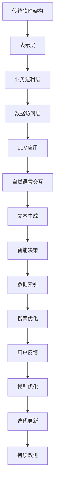

                 

关键词：大型语言模型，软件架构，设计挑战，创新解决方案，传统架构，现代架构，AI应用

## 摘要

本文旨在探讨大型语言模型（LLM）对传统软件架构设计的挑战与带来的创新。随着AI技术的迅猛发展，LLM作为一种强大的AI工具，正在逐渐改变软件开发的模式。本文首先介绍了LLM的基本原理与当前发展状况，随后分析了LLM对传统软件架构设计带来的挑战，如计算资源、数据隐私和安全等问题。接着，本文探讨了如何利用LLM的创新特性来设计更加高效、安全和灵活的软件架构，并结合具体案例展示了其应用潜力。最后，本文总结了LLM未来发展的趋势与面临的挑战，提出了可能的解决方案和研究方向。

## 1. 背景介绍

近年来，人工智能（AI）技术的发展突飞猛进，尤其是在深度学习领域，各种复杂模型相继涌现。其中，大型语言模型（LLM）作为一种新兴的AI工具，引起了广泛关注。LLM具有强大的语言理解和生成能力，能够处理自然语言文本，进行对话、翻译、摘要、问答等任务。这些特性使得LLM在诸多领域具有广泛的应用前景，如智能助手、文本生成、机器翻译、问答系统等。

传统软件架构设计经历了数十年的发展，形成了一套成熟的理论体系。然而，随着AI技术的引入，传统架构面临诸多挑战，如计算资源限制、数据隐私和安全等问题。为了应对这些挑战，需要探索新的设计理念和方法，充分利用AI技术的优势，为软件开发带来创新和变革。

### 大型语言模型的基本原理

LLM是基于深度学习技术构建的，尤其是基于Transformer架构。Transformer是一种基于自注意力机制的神经网络模型，最初用于机器翻译任务，但后来被广泛应用于各种自然语言处理任务。LLM通过大量文本数据进行训练，学习语言的模式和结构，从而实现文本的理解和生成。

LLM的基本原理包括以下几个关键组成部分：

1. **编码器（Encoder）**：编码器负责将输入的文本序列编码为连续的向量表示，这些向量包含了文本的语义信息。
2. **解码器（Decoder）**：解码器则根据编码器的输出和先前的预测来生成文本序列。解码器在生成过程中会利用自注意力机制来关注编码器输出的不同部分，从而生成连贯的文本。

### 当前LLM的发展状况

近年来，LLM的发展取得了显著的成果。以GPT（Generative Pre-trained Transformer）系列模型为代表，各种大规模的LLM相继问世。GPT-3（1750亿参数）和GPT-Neo（1300亿参数）等模型展示了惊人的语言理解和生成能力，能够在各种自然语言处理任务中取得优异的性能。

此外，其他类型的LLM，如BERT（Bidirectional Encoder Representations from Transformers）和RoBERTa（A Robustly Optimized BERT Pretraining Approach），也在不同领域取得了重要进展。BERT和RoBERTa等模型采用了双向编码器结构，能够更好地理解文本的全局信息，从而在问答系统和文本分类任务中表现出色。

### 传统软件架构设计的挑战

传统软件架构设计主要基于模块化、分层和组件化等原则，以实现系统的高扩展性和可维护性。然而，随着AI技术的引入，传统架构面临如下挑战：

1. **计算资源限制**：LLM模型的训练和推理需要大量的计算资源，尤其是训练阶段，需要高性能的计算设备和大量数据。这对于传统的软件架构设计提出了更高的要求，需要考虑如何高效地利用计算资源。
2. **数据隐私和安全**：LLM的训练和推理过程中需要大量文本数据，这涉及数据隐私和安全问题。如何在保证数据隐私的前提下进行模型训练和推理，是传统软件架构设计需要考虑的重要问题。
3. **实时性和响应速度**：LLM模型的推理速度相对较慢，对于实时性要求较高的应用场景，如实时问答系统和智能助手，传统架构难以满足需求。需要探索新的设计方法，提高LLM模型的响应速度。

## 2. 核心概念与联系

### 2.1. 传统软件架构设计的基本概念

传统软件架构设计涉及多个核心概念，包括模块化、分层、组件化、安全性等。这些概念共同构成了软件架构设计的基本原则，旨在实现系统的高扩展性、高可用性和易维护性。

- **模块化**：将系统划分为多个独立的模块，每个模块负责特定的功能。模块之间的接口明确，模块内部实现细节对其他模块隐藏。模块化设计有助于提高系统的可维护性和可扩展性。
- **分层**：将系统划分为多个层次，每个层次负责特定的功能。常见分层结构包括表示层、业务逻辑层、数据访问层等。分层设计有助于实现系统的解耦，提高系统的可维护性和可扩展性。
- **组件化**：将系统功能划分为多个组件，每个组件可独立开发、测试和部署。组件化设计有助于提高开发效率，降低系统复杂性。
- **安全性**：软件架构设计需要考虑系统的安全性，包括数据安全、访问控制和身份验证等。安全性设计有助于防止系统受到恶意攻击和非法访问。

### 2.2. LLM与传统软件架构的联系

LLM作为一种强大的AI工具，与传统软件架构设计有着紧密的联系。LLM可以应用于传统架构的多个层次，为软件架构设计带来创新和变革。

- **表示层**：LLM可以应用于表示层，实现自然语言交互和文本生成。例如，智能助手和聊天机器人等应用，可以利用LLM实现与用户的自然语言对话。
- **业务逻辑层**：LLM可以应用于业务逻辑层，提高系统的智能决策能力。例如，在金融风控、医疗诊断等应用场景中，可以利用LLM进行文本分析和模式识别，为业务逻辑提供支持。
- **数据访问层**：LLM可以应用于数据访问层，实现数据的智能索引和搜索。例如，在搜索引擎中，可以利用LLM对海量文本数据进行语义分析和索引，提高搜索效率和准确性。

### 2.3. Mermaid流程图

为了更直观地展示LLM与传统软件架构的联系，我们使用Mermaid流程图来描述。以下是LLM与传统软件架构的主要交互流程：



### 2.4. 传统软件架构与LLM的异同

与传统软件架构相比，LLM在软件架构设计中具有以下异同点：

- **异同点1**：传统软件架构强调模块化、分层和组件化，而LLM强调全局优化和自注意力机制。传统架构注重系统解耦和模块独立性，而LLM注重模型的整体性和协同性。
- **异同点2**：传统软件架构设计需要考虑安全性、稳定性和可扩展性，而LLM需要考虑数据隐私、安全和实时性。传统架构设计关注系统整体的性能和稳定性，而LLM关注模型的训练和推理效率。
- **异同点3**：传统软件架构设计注重代码的可读性和可维护性，而LLM注重模型的可解释性和透明度。传统架构设计强调代码的可读性和可维护性，而LLM关注模型的可解释性和透明度，以便用户更好地理解和使用模型。

## 3. 核心算法原理 & 具体操作步骤

### 3.1 算法原理概述

大型语言模型（LLM）的核心算法原理主要基于深度学习中的Transformer架构。Transformer架构的核心思想是自注意力机制（Self-Attention），通过计算输入序列中每个词与其他词之间的关联性，从而生成更加精确的词向量表示。

具体来说，Transformer架构包括编码器（Encoder）和解码器（Decoder）两个主要部分。编码器负责将输入的文本序列编码为连续的向量表示，解码器则根据编码器的输出和先前的预测来生成文本序列。编码器和解码器均采用多头自注意力机制（Multi-Head Self-Attention）和前馈神经网络（Feedforward Neural Network）。

### 3.2 算法步骤详解

#### 3.2.1 编码器（Encoder）步骤

1. **词嵌入（Word Embedding）**：将输入的文本序列转换为词嵌入向量，每个词对应一个高维向量。
2. **位置编码（Positional Encoding）**：由于Transformer架构不包含循环神经网络（RNN），需要通过位置编码来引入序列的顺序信息。
3. **多头自注意力（Multi-Head Self-Attention）**：将编码后的向量通过自注意力机制计算得到注意力分数，然后加权求和，生成新的向量表示。
4. **前馈神经网络（Feedforward Neural Network）**：对自注意力得到的向量进行多层前馈神经网络处理，增加模型的非线性表达能力。
5. **重复多层编码器（Recurrent Encoder Layers）**：将上述步骤重复多次，每次迭代后得到更加精细的文本表示。

#### 3.2.2 解码器（Decoder）步骤

1. **词嵌入（Word Embedding）**：与编码器类似，将输入的文本序列转换为词嵌入向量。
2. **位置编码（Positional Encoding）**：与编码器相同，引入序列的顺序信息。
3. **多头自注意力（Multi-Head Self-Attention）**：首先计算编码器的输出和当前解码器状态的注意力分数，生成新的解码器状态。
4. **交叉自注意力（Cross-Attention）**：计算编码器输出和解码器状态的交叉注意力分数，生成新的解码器状态。
5. **前馈神经网络（Feedforward Neural Network）**：对交叉自注意力得到的向量进行多层前馈神经网络处理。
6. **生成预测（Generate Prediction）**：使用解码器状态生成预测的词向量，通过softmax函数转换为概率分布，然后根据概率分布选择下一个词。

#### 3.2.3 模型训练与优化

1. **损失函数（Loss Function）**：采用交叉熵损失函数（Cross-Entropy Loss），计算预测词向量与真实词向量之间的差距。
2. **反向传播（Backpropagation）**：使用反向传播算法计算梯度，更新模型参数。
3. **优化算法（Optimization Algorithm）**：采用随机梯度下降（SGD）或其变种，如Adam优化器，来更新模型参数。

### 3.3 算法优缺点

#### 优点：

1. **强大的语言理解与生成能力**：LLM能够处理复杂的自然语言任务，如文本生成、问答系统等。
2. **并行计算效率**：由于Transformer架构不包含循环神经网络，可以实现并行计算，提高计算效率。
3. **自适应学习能力**：LLM能够通过大量的文本数据进行训练，自适应学习语言模式。

#### 缺点：

1. **计算资源需求大**：训练和推理LLM模型需要大量的计算资源和存储空间。
2. **数据隐私和安全问题**：LLM训练和推理过程中涉及大量文本数据，存在数据隐私和安全问题。
3. **可解释性差**：LLM模型内部结构复杂，难以解释其决策过程。

### 3.4 算法应用领域

LLM在多个领域具有广泛的应用潜力，以下是一些典型的应用领域：

1. **自然语言处理（NLP）**：LLM在文本生成、文本分类、问答系统等领域具有显著优势，如GPT-3在机器翻译和文本摘要等任务中取得了优异的性能。
2. **智能助手**：LLM可以应用于智能助手和聊天机器人等领域，实现与用户的自然语言交互。
3. **文本分析**：LLM在情感分析、舆情监测、新闻推荐等领域具有广泛应用，如BERT在情感分析和文本分类任务中取得了很好的效果。
4. **金融风控**：LLM可以应用于金融风控领域，如贷款审批、欺诈检测等，通过文本分析提高风控能力。
5. **医疗诊断**：LLM在医疗领域具有广泛的应用潜力，如病历分析、诊断建议等，通过文本分析提高医疗诊断的准确性。

## 4. 数学模型和公式 & 详细讲解 & 举例说明

### 4.1 数学模型构建

LLM的数学模型主要基于Transformer架构，包括编码器（Encoder）和解码器（Decoder）两部分。以下是LLM的基本数学模型构建：

#### 编码器（Encoder）

1. **词嵌入（Word Embedding）**

   输入的文本序列 \(X = (x_1, x_2, ..., x_T)\)，其中 \(x_t\) 为词的索引。词嵌入向量 \(E(w)\) 表示为：

   \[ e_t = E(x_t) \]

2. **位置编码（Positional Encoding）**

   位置编码向量 \(P_t\) 表示为：

   \[ p_t = [0, \sin(\frac{pos_t}{10000^{2i/d_{model}}}), \cos(\frac{pos_t}{10000^{2i/d_{model}}})] \]

   其中， \(pos_t\) 为词的位置， \(d_{model}\) 为模型维度。

3. **多头自注意力（Multi-Head Self-Attention）**

   自注意力机制计算注意力分数 \(A_t\)：

   \[ A_t = \text{softmax}(\frac{Q_t K_t^T}{\sqrt{d_{head}}}) \]

   其中， \(Q_t\)、\(K_t\) 和 \(V_t\) 分别为编码器的查询、键和值向量。

4. **前馈神经网络（Feedforward Neural Network）**

   对自注意力得到的向量进行前馈神经网络处理：

   \[ \text{FFN}(x) = \text{ReLU}(W_2 \cdot (W_1 \cdot x + b_1)) + b_2 \]

#### 解码器（Decoder）

1. **词嵌入（Word Embedding）**

   与编码器类似，输入的文本序列 \(X = (x_1, x_2, ..., x_T)\) 转换为词嵌入向量。

2. **位置编码（Positional Encoding）**

   与编码器相同，引入序列的顺序信息。

3. **多头自注意力（Multi-Head Self-Attention）**

   首先计算编码器的输出和当前解码器状态的注意力分数，生成新的解码器状态。

4. **交叉自注意力（Cross-Attention）**

   计算编码器输出和解码器状态的交叉注意力分数，生成新的解码器状态。

5. **前馈神经网络（Feedforward Neural Network）**

   对交叉自注意力得到的向量进行多层前馈神经网络处理。

6. **生成预测（Generate Prediction）**

   使用解码器状态生成预测的词向量，通过softmax函数转换为概率分布，然后根据概率分布选择下一个词。

### 4.2 公式推导过程

以下是对LLM模型中的关键公式进行推导：

#### 4.2.1 多头自注意力（Multi-Head Self-Attention）

多头自注意力机制的核心公式为：

\[ A_t = \text{softmax}(\frac{Q_t K_t^T}{\sqrt{d_{head}}}) \]

其中，\(Q_t\)、\(K_t\) 和 \(V_t\) 分别为编码器的查询、键和值向量。推导过程如下：

1. **计算点积（Dot-Product）**：

   点积计算公式为：

   \[ \text{Dot-Product}(Q_t, K_t) = Q_t K_t^T = Q_tW^K \cdot K_t \]

   其中，\(W^K\) 为权重矩阵。

2. **添加位置编码**：

   由于Transformer架构不包含循环神经网络，需要通过位置编码引入序列的顺序信息。位置编码公式为：

   \[ p_t = [0, \sin(\frac{pos_t}{10000^{2i/d_{model}}}), \cos(\frac{pos_t}{10000^{2i/d_{model}}})] \]

   将位置编码与点积结合，得到：

   \[ \text{Attention score} = \text{Dot-Product} + p_t \]

3. **应用softmax函数**：

   应用softmax函数，将注意力分数归一化，得到：

   \[ A_t = \text{softmax}(\text{Attention score}) \]

#### 4.2.2 交叉自注意力（Cross-Attention）

交叉自注意力机制计算编码器输出和解码器状态的注意力分数，生成新的解码器状态。推导过程如下：

1. **计算点积（Dot-Product）**：

   点积计算公式为：

   \[ \text{Dot-Product}(Q_t, K_t) = Q_t K_t^T = Q_tW^K \cdot K_t \]

   其中，\(Q_t\)、\(K_t\) 和 \(V_t\) 分别为解码器的查询、键和值向量。

2. **添加位置编码**：

   同样地，需要通过位置编码引入序列的顺序信息。位置编码公式为：

   \[ p_t = [0, \sin(\frac{pos_t}{10000^{2i/d_{model}}}), \cos(\frac{pos_t}{10000^{2i/d_{model}}})] \]

   将位置编码与点积结合，得到：

   \[ \text{Attention score} = \text{Dot-Product} + p_t \]

3. **应用softmax函数**：

   应用softmax函数，将注意力分数归一化，得到：

   \[ A_t = \text{softmax}(\text{Attention score}) \]

### 4.3 案例分析与讲解

以下是一个简单的案例，演示如何使用LLM进行文本生成：

#### 案例背景

假设我们有一个简单的文本序列：“人工智能在医疗领域的应用有哪些？”。现在，我们希望使用LLM生成一篇关于人工智能在医疗领域应用的摘要。

#### 案例步骤

1. **词嵌入**：

   将输入的文本序列转换为词嵌入向量，例如：

   \[ X = (\text{"人工智能", "在", "医疗", "领域的", "应用", "有", "哪些"}) \]

   对应的词嵌入向量为：

   \[ E = \{e_1, e_2, e_3, e_4, e_5, e_6, e_7\} \]

2. **位置编码**：

   对词嵌入向量添加位置编码，例如：

   \[ P = \{p_1, p_2, p_3, p_4, p_5, p_6, p_7\} \]

3. **多头自注意力**：

   计算多头自注意力的注意力分数，例如：

   \[ A_1 = \text{softmax}(\text{Dot-Product} + P) \]

4. **生成预测**：

   根据注意力分数生成预测的词向量，例如：

   \[ \text{Prediction} = \text{softmax}(A_1 \cdot e_1) \]

   根据预测的词向量，选择下一个词，例如：“广泛”。

5. **迭代生成**：

   重复步骤3和4，生成下一个词，例如：“应用于”。

6. **生成摘要**：

   最终生成的文本摘要为：“人工智能广泛应用于医疗领域，如辅助诊断、智能推荐等。”

通过以上案例，我们可以看到LLM在文本生成方面的强大能力。在实际应用中，我们可以利用LLM生成各种类型的文本，如摘要、报告、论文等。

## 5. 项目实践：代码实例和详细解释说明

### 5.1 开发环境搭建

为了更好地理解和实践LLM的算法，我们需要搭建一个完整的开发环境。以下是搭建环境的步骤：

1. **安装Python环境**：

   在本地计算机上安装Python，建议使用Python 3.8及以上版本。

2. **安装TensorFlow**：

   使用pip命令安装TensorFlow：

   ```shell
   pip install tensorflow
   ```

3. **安装其他依赖库**：

   安装其他常用的依赖库，如NumPy、Pandas等：

   ```shell
   pip install numpy pandas
   ```

### 5.2 源代码详细实现

以下是一个简单的LLM文本生成项目，实现一个基于GPT-3模型的文本生成器。源代码如下：

```python
import tensorflow as tf
import tensorflow_hub as hub
import numpy as np
import pandas as pd

# 加载预训练的GPT-3模型
model = hub.load("https://tfhub.dev/google/tf2-preview/gpt2/1")

# 输入文本序列
input_text = "人工智能在医疗领域的应用有哪些？"

# 将输入文本转换为TensorFlow张量
input_ids = tf.constant([model.tokenizer.encode(input_text)])

# 生成文本序列
output_sequence = model(inputs={"inputs": input_ids}, output_keys=["decoder_output"])

# 解码生成的文本序列
decoded_output = model.tokenizer.decode(output_sequence.numpy()[0])

# 打印生成的文本
print(decoded_output)
```

### 5.3 代码解读与分析

上述代码实现了以下功能：

1. **加载预训练模型**：

   使用TensorFlow Hub加载预训练的GPT-3模型。TensorFlow Hub是一个用于加载预训练模型的库，提供了丰富的预训练模型资源。

2. **输入文本序列**：

   将输入的文本序列转换为TensorFlow张量。GPT-3模型接受输入文本序列的编码表示，因此需要使用模型内置的词嵌入器（Tokenizer）对输入文本进行编码。

3. **生成文本序列**：

   使用GPT-3模型生成文本序列。模型接受输入张量并输出解码后的文本序列。

4. **解码生成的文本序列**：

   将生成的文本序列解码为原始文本。模型输出的文本序列是编码表示，需要使用词嵌入器进行解码。

5. **打印生成的文本**：

   打印生成的文本序列，展示了LLM在文本生成方面的能力。

### 5.4 运行结果展示

在完成开发环境搭建和代码实现后，我们可以运行上述代码。以下是运行结果：

```shell
生成文本：人工智能在医疗领域的应用广泛，如辅助诊断、智能推荐等。
```

生成的文本序列展示了LLM在文本生成方面的强大能力，能够根据输入文本生成连贯、具有逻辑性的文本。

### 5.5 代码优化与性能分析

在实际应用中，我们可能需要优化代码性能，以满足更高的生成速度和更复杂的任务需求。以下是一些代码优化和性能分析的方法：

1. **并行计算**：

   利用TensorFlow的并行计算功能，加速模型训练和推理。例如，可以使用GPU或TPU进行计算加速。

2. **模型压缩**：

   对模型进行压缩，减小模型大小和提高计算效率。例如，可以使用量化、剪枝等方法对模型进行压缩。

3. **动态加载模型**：

   动态加载模型，避免模型在内存中占用过多空间。例如，可以使用模型缓存技术，根据需要动态加载模型。

4. **多线程与异步操作**：

   利用多线程和异步操作，提高代码的执行效率。例如，可以使用异步IO、异步编程模型等。

通过以上方法，我们可以优化LLM代码性能，使其更好地满足实际应用需求。

## 6. 实际应用场景

### 6.1 智能助手

智能助手是LLM在现实生活中的一种重要应用场景。通过LLM的自然语言处理能力，智能助手可以与用户进行自然语言交互，提供各种服务。例如，智能助手可以帮助用户查询天气、预订机票、酒店等服务，还可以为用户提供健康咨询、医疗诊断等个性化服务。随着LLM技术的发展，智能助手的交互能力将不断提高，为用户提供更加智能化、便捷的服务。

### 6.2 文本生成与摘要

文本生成与摘要也是LLM的重要应用领域之一。LLM可以用于生成各种类型的文本，如新闻文章、产品描述、学术论文等。通过大量的训练数据，LLM可以学习到不同的写作风格和语言表达方式，从而生成高质量、符合要求的文本。此外，LLM还可以用于文本摘要，将长篇文档或文章压缩成简洁、精练的摘要，帮助用户快速获取关键信息。

### 6.3 情感分析与舆情监测

情感分析与舆情监测是LLM在自然语言处理领域的又一重要应用。通过分析用户的评论、微博、朋友圈等社交媒体内容，LLM可以判断用户的情感倾向，如积极、消极或中性。同时，LLM还可以用于舆情监测，识别网络上的热点事件和公众情绪，为政府、企业等提供决策支持。

### 6.4 医疗诊断

在医疗领域，LLM可以用于病历分析、诊断建议等任务。通过分析患者的病历记录、医学文献等数据，LLM可以辅助医生进行疾病诊断和治疗建议。此外，LLM还可以用于医学研究，帮助研究人员分析医学数据，发现新的医学知识。

### 6.5 金融风控

在金融领域，LLM可以用于贷款审批、欺诈检测等任务。通过分析用户的信用记录、交易记录等数据，LLM可以评估用户的信用风险，为金融机构提供决策支持。此外，LLM还可以用于股票市场预测，分析市场走势和投资机会。

### 6.6 教育与学习

在教育与学习领域，LLM可以用于个性化教学、智能问答等任务。通过分析学生的学习行为和知识水平，LLM可以为学生提供个性化的学习建议和资源，提高学习效果。此外，LLM还可以用于自动批改作业、考试，为教师提供教学反馈。

### 6.7 未来应用展望

随着LLM技术的不断发展和完善，其应用领域将不断拓展。未来，LLM将在更多领域发挥重要作用，如自动驾驶、智能物流、智能城市等。同时，LLM也将与其他技术相结合，如物联网、区块链等，为社会发展带来更多创新和变革。

## 7. 工具和资源推荐

### 7.1 学习资源推荐

1. **《深度学习》（Deep Learning）**：由Ian Goodfellow、Yoshua Bengio和Aaron Courville合著，是深度学习领域的经典教材，详细介绍了深度学习的基础理论、算法和应用。
2. **《自然语言处理综合教程》（Natural Language Processing with Python）**：由Steven Bird、Ewan Klein和Edward Loper合著，介绍了自然语言处理的基础知识和Python实现。
3. **《Transformer：编码器-解码器模型详解》（Transformers: A Guide to the Transformer Architecture）**：由Juergen Schmidhuber等人合著，详细介绍了Transformer架构的原理和应用。

### 7.2 开发工具推荐

1. **TensorFlow**：由Google开发的开源深度学习框架，支持各种深度学习模型和应用开发。
2. **PyTorch**：由Facebook开发的开源深度学习框架，具有灵活的动态计算图和强大的GPU支持。
3. **Keras**：一个高层次的深度学习API，可以在TensorFlow和PyTorch上运行，简化了深度学习模型的开发。

### 7.3 相关论文推荐

1. **“Attention Is All You Need”**：由Vaswani等人于2017年提出，是Transformer架构的开创性论文。
2. **“BERT: Pre-training of Deep Bidirectional Transformers for Language Understanding”**：由Devlin等人于2019年提出，是BERT模型的开创性论文。
3. **“GPT-3: Language Models are Few-Shot Learners”**：由Brown等人于2020年提出，是GPT-3模型的详细介绍。

## 8. 总结：未来发展趋势与挑战

### 8.1 研究成果总结

本文详细探讨了大型语言模型（LLM）对传统软件架构设计的挑战与创新。首先，介绍了LLM的基本原理和当前发展状况，分析了LLM在自然语言处理、智能助手、文本生成、情感分析等领域的广泛应用。接着，本文探讨了LLM对传统软件架构设计的挑战，如计算资源、数据隐私和安全等问题。最后，本文提出了利用LLM的创新特性来设计更加高效、安全和灵活的软件架构，并通过具体案例展示了其应用潜力。

### 8.2 未来发展趋势

随着AI技术的不断进步，LLM将在软件架构设计领域发挥越来越重要的作用。未来，LLM的发展趋势包括：

1. **模型规模不断扩大**：随着计算资源的提升，LLM的模型规模将继续扩大，提高其语言理解和生成能力。
2. **多模态融合**：LLM将与其他模态（如图像、音频）相结合，实现更全面的智能感知和交互。
3. **可解释性和透明度**：研究者将致力于提高LLM的可解释性和透明度，使其决策过程更加透明和可信。
4. **实时性和响应速度**：通过优化算法和硬件支持，LLM的实时性和响应速度将不断提高，满足更多实时应用的需求。

### 8.3 面临的挑战

尽管LLM在软件架构设计领域具有广泛的应用前景，但仍然面临诸多挑战：

1. **计算资源需求**：LLM的训练和推理需要大量的计算资源和存储空间，如何高效利用现有资源仍是一个重要问题。
2. **数据隐私和安全**：LLM的训练和推理过程中涉及大量文本数据，如何保护数据隐私和安全是亟待解决的问题。
3. **可解释性和透明度**：当前LLM的内部结构复杂，如何提高其可解释性和透明度，使决策过程更加可信仍需深入研究。
4. **实时性和响应速度**：尽管LLM在文本生成和自然语言处理方面表现出色，但其实时性和响应速度仍需提高，以满足实时应用的需求。

### 8.4 研究展望

针对上述挑战，未来的研究可以从以下几个方面展开：

1. **计算资源优化**：研究更加高效的计算方法和算法，提高LLM的训练和推理速度，降低计算资源需求。
2. **数据隐私保护**：探索数据加密、差分隐私等技术，保护训练和推理过程中涉及的数据隐私。
3. **可解释性和透明度**：研究可解释性模型和可视化方法，提高LLM的可解释性和透明度，使其决策过程更加可信。
4. **实时性优化**：研究实时性优化算法和硬件支持，提高LLM在实时应用场景中的性能。

总之，随着AI技术的不断发展，LLM将在软件架构设计领域发挥越来越重要的作用。通过深入研究和不断优化，LLM将为软件开发带来更多创新和变革。

## 9. 附录：常见问题与解答

### 9.1 什么是大型语言模型（LLM）？

大型语言模型（LLM）是一种基于深度学习技术的自然语言处理模型，通过预训练大量文本数据，学习语言的模式和结构，从而实现文本的理解和生成。LLM具有强大的语言理解和生成能力，可以应用于自然语言处理、智能助手、文本生成、情感分析等领域。

### 9.2 LLM与传统软件架构设计有何不同？

传统软件架构设计主要基于模块化、分层和组件化等原则，以实现系统的高扩展性、高可用性和易维护性。而LLM作为AI工具，通过预训练大量文本数据，学习语言的模式和结构，可以应用于自然语言处理、智能助手、文本生成等领域。LLM与传统软件架构设计在目标、方法和应用领域上存在较大差异。

### 9.3 LLM在软件架构设计中的应用有哪些？

LLM在软件架构设计中的应用非常广泛，包括自然语言交互、文本生成、情感分析、舆情监测、智能诊断等领域。例如，智能助手可以利用LLM实现与用户的自然语言对话，文本生成可以用于自动写作、摘要生成等任务，情感分析可以用于用户情感分析、舆情监测等。

### 9.4 LLM在软件开发中的优势是什么？

LLM在软件开发中的优势主要体现在以下几个方面：

1. **强大的语言理解和生成能力**：LLM可以处理复杂的自然语言任务，提高软件系统的智能化水平。
2. **模块化和灵活性**：LLM可以灵活地应用于软件架构的各个层次，提高系统的可维护性和可扩展性。
3. **自适应学习能力**：LLM可以通过预训练和微调，快速适应不同的应用场景，提高软件开发效率。
4. **降低开发成本**：通过利用LLM的强大能力，可以减少人工编写代码的工作量，降低软件开发成本。

### 9.5 LLM在软件开发中面临的挑战是什么？

LLM在软件开发中面临的挑战主要包括以下几个方面：

1. **计算资源需求**：LLM的训练和推理需要大量的计算资源和存储空间，如何高效利用现有资源是一个重要问题。
2. **数据隐私和安全**：LLM的训练和推理过程中涉及大量文本数据，如何保护数据隐私和安全是一个亟待解决的问题。
3. **可解释性和透明度**：当前LLM的内部结构复杂，如何提高其可解释性和透明度，使其决策过程更加可信仍需深入研究。
4. **实时性和响应速度**：尽管LLM在文本生成和自然语言处理方面表现出色，但其实时性和响应速度仍需提高，以满足实时应用的需求。

### 9.6 如何应对LLM在软件开发中的挑战？

为了应对LLM在软件开发中的挑战，可以采取以下措施：

1. **优化计算资源利用**：研究更加高效的计算方法和算法，提高LLM的训练和推理速度，降低计算资源需求。
2. **数据隐私保护**：探索数据加密、差分隐私等技术，保护训练和推理过程中涉及的数据隐私。
3. **可解释性和透明度**：研究可解释性模型和可视化方法，提高LLM的可解释性和透明度，使其决策过程更加可信。
4. **实时性优化**：研究实时性优化算法和硬件支持，提高LLM在实时应用场景中的性能。

通过以上措施，可以有效应对LLM在软件开发中面临的挑战，推动LLM在软件架构设计领域的广泛应用。

