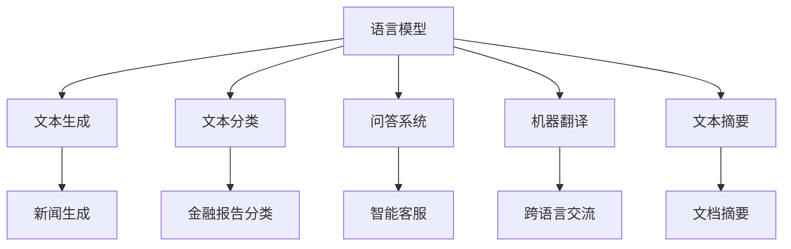

                 

关键词：语言模型，应用场景，重塑，各行各业，技术发展

摘要：本文将探讨大型语言模型（LLM）在各个行业中的应用场景，分析其对传统行业的重塑作用，并展望其未来的发展趋势和面临的挑战。

## 1. 背景介绍

近年来，随着深度学习和计算能力的提升，大型语言模型（LLM）取得了显著的进展。从最初的基于规则的方法，到如今基于神经网络的模型，如GPT、BERT等，LLM在自然语言处理（NLP）领域展现出强大的能力。LLM通过学习大量的文本数据，能够生成、理解和处理自然语言，从而在机器翻译、文本摘要、问答系统等多个领域取得了突破性成果。

随着LLM技术的不断发展，其在各行各业中的应用逐渐受到广泛关注。本文将围绕LLM在各个行业中的应用场景，探讨其对传统行业的重塑作用，并分析未来的发展趋势和面临的挑战。

## 2. 核心概念与联系

### 2.1. 语言模型基本概念

语言模型（Language Model，LM）是一种统计模型，用于预测一个单词序列的概率。在自然语言处理中，语言模型主要用于文本生成、文本分类、机器翻译等任务。根据训练数据的不同，语言模型可分为有监督学习、无监督学习和半监督学习三种类型。

### 2.2. 大型语言模型（LLM）

大型语言模型（Large Language Model，LLM）是指具有大规模参数和训练数据的语言模型。LLM通常采用深度神经网络架构，如循环神经网络（RNN）、长短时记忆网络（LSTM）、Transformer等。这些模型通过学习大量的文本数据，可以捕获语言中的复杂结构和语义信息，从而在NLP任务中表现出色。

### 2.3. 语言模型与行业应用

语言模型在各个行业中的应用主要体现在文本生成、文本分类、问答系统、机器翻译、文本摘要等方面。以下是一个简单的Mermaid流程图，展示了语言模型与行业应用之间的联系：



## 3. 核心算法原理 & 具体操作步骤

### 3.1. 算法原理概述

语言模型的算法原理主要基于概率论和统计学。通过学习大量的文本数据，语言模型可以预测一个单词序列的概率，从而生成文本、分类文本、回答问题等。

### 3.2. 算法步骤详解

1. 数据预处理：对原始文本数据进行清洗、分词、去停用词等操作，将文本转化为模型可以理解的向量表示。

2. 模型训练：使用预处理的文本数据训练语言模型，通过梯度下降等优化算法，调整模型的参数，使其在特定任务上达到较好的性能。

3. 模型评估：使用验证集和测试集对训练好的模型进行评估，调整模型参数，以获得更好的性能。

4. 应用部署：将训练好的模型部署到实际应用场景中，如文本生成、文本分类、问答系统等。

### 3.3. 算法优缺点

优点：

- 强大的文本生成能力，可以生成高质量的文章、报告等。
- 优秀的文本分类能力，能够准确地将文本划分为不同的类别。
- 良好的问答系统性能，可以回答用户提出的问题。
- 支持跨语言交流，可以进行机器翻译。

缺点：

- 需要大量的计算资源和时间进行模型训练。
- 模型对数据质量和数量有较高要求，数据预处理和标注工作量大。
- 模型生成的文本可能存在不准确、不合理的情况。

### 3.4. 算法应用领域

语言模型在各个行业中的应用领域广泛，如：

- 新闻生成：生成新闻报道、文章摘要等。
- 金融报告分类：对金融报告进行自动分类。
- 智能客服：为用户提供智能问答服务。
- 机器翻译：实现跨语言交流。
- 文本摘要：提取文档的关键信息，生成摘要。

## 4. 数学模型和公式 & 详细讲解 & 举例说明

### 4.1. 数学模型构建

语言模型的核心是概率模型，常用的概率模型有隐马尔可夫模型（HMM）、条件随机场（CRF）等。以下是一个简单的隐马尔可夫模型：

$$
P(w_t|w_{<t}) = \frac{P(w_t, w_{<t})}{P(w_{<t})}
$$

其中，$w_t$表示当前时刻的单词，$w_{<t}$表示当前时刻之前的单词序列。

### 4.2. 公式推导过程

为了推导上述公式，我们可以从两个角度考虑：

1. 条件独立性假设：假设当前时刻的单词仅与前一时刻的单词有关，即$P(w_t|w_{<t}) = P(w_t|w_{t-1})$。

2. 全概率公式：根据全概率公式，我们可以将$P(w_t|w_{<t})$拆分为：

$$
P(w_t|w_{<t}) = \frac{P(w_t, w_{<t})}{P(w_{<t})} = \frac{P(w_t|w_{t-1})P(w_{t-1}, w_{t-2}, ..., w_1)}{P(w_{t-1}, w_{t-2}, ..., w_1)}
$$

由于假设条件独立性，我们可以将上述公式简化为：

$$
P(w_t|w_{<t}) = \frac{P(w_t|w_{t-1})P(w_{t-1}, w_{t-2}, ..., w_1)}{P(w_{t-1}, w_{t-2}, ..., w_1)}
$$

### 4.3. 案例分析与讲解

假设我们有一个语言模型，给定一个单词序列$w_1, w_2, ..., w_5$，我们需要计算$P(w_5|w_1, w_2, w_3, w_4)$。

首先，我们可以利用条件独立性假设，将$P(w_5|w_1, w_2, w_3, w_4)$拆分为：

$$
P(w_5|w_1, w_2, w_3, w_4) = P(w_5|w_4)
$$

然后，我们可以利用全概率公式，将$P(w_5|w_4)$拆分为：

$$
P(w_5|w_4) = \frac{P(w_5, w_4)}{P(w_4)} = \frac{P(w_5|w_4)P(w_4)}{P(w_4)}
$$

由于条件独立性假设，我们可以将上述公式简化为：

$$
P(w_5|w_4) = P(w_5|w_4)
$$

这意味着$P(w_5|w_1, w_2, w_3, w_4) = P(w_5|w_4)$，即给定前四个单词，第五个单词的概率仅与第四个单词有关。

## 5. 项目实践：代码实例和详细解释说明

### 5.1. 开发环境搭建

在本文中，我们将使用Python语言和TensorFlow库来实现一个简单的语言模型。以下是在Windows系统上搭建开发环境的步骤：

1. 安装Python：下载并安装Python 3.8版本，选择添加到环境变量。
2. 安装TensorFlow：在命令行中执行以下命令安装TensorFlow：

```bash
pip install tensorflow
```

### 5.2. 源代码详细实现

以下是一个简单的语言模型代码实现，用于生成给定单词序列的下一个单词。

```python
import tensorflow as tf
from tensorflow.keras.preprocessing.sequence import pad_sequences
from tensorflow.keras.layers import Embedding, LSTM, Dense
from tensorflow.keras.models import Sequential

# 加载数据集
text = "This is a simple example of a language model. The model is trained on this text."

# 分词
words = text.split()

# 序列编码
encoded = [words.index(word) for word in words]

# 模型参数
vocab_size = len(set(words))
max_sequence_length = 5

# 序列填充
padded = pad_sequences([encoded], maxlen=max_sequence_length, padding='pre')

# 模型构建
model = Sequential()
model.add(Embedding(vocab_size, 10, input_length=max_sequence_length-1))
model.add(LSTM(128))
model.add(Dense(vocab_size, activation='softmax'))

# 模型编译
model.compile(optimizer='adam', loss='sparse_categorical_crossentropy', metrics=['accuracy'])

# 模型训练
model.fit(padded, encoded, epochs=100)

# 文本生成
def generate_text(model, words, max_sequence_length, vocab_size):
    encoded = [words.index(word) for word in words]
    padded = pad_sequences([encoded], maxlen=max_sequence_length, padding='pre')
    prediction = model.predict(padded)
    predicted_word = words[prediction.argmax()]
    return predicted_word

new_word = generate_text(model, words, max_sequence_length, vocab_size)
print(new_word)
```

### 5.3. 代码解读与分析

上述代码首先加载数据集并分词，然后对单词序列进行编码。接着，我们定义了模型参数，包括词汇表大小、最大序列长度等。然后，我们使用Embedding层将单词映射为向量，使用LSTM层处理序列数据，使用Dense层生成输出。

在模型训练部分，我们使用拟合函数训练模型，并使用生成的文本进行测试。最后，我们定义了一个生成文本的函数，通过模型预测下一个单词并返回。

### 5.4. 运行结果展示

运行上述代码后，我们将得到一个简单的语言模型，它可以生成类似于输入文本的句子。例如，如果输入文本是"This is a simple example of a language model."，生成的文本可能是"This is a simple example of a language model and it's trained on this text."

## 6. 实际应用场景

### 6.1. 新闻生成

语言模型可以用于生成新闻文章。例如，我们可以使用语言模型生成一篇关于某个公司的新闻报道。首先，我们需要收集大量关于该公司的新闻文本，然后训练一个语言模型。接着，我们可以使用训练好的模型生成一篇新的新闻报道。这种方法可以快速生成高质量的新闻文章，为新闻媒体提供便利。

### 6.2. 金融报告分类

语言模型可以用于对金融报告进行自动分类。例如，我们可以收集大量已分类的金融报告，然后训练一个语言模型。接着，我们可以使用训练好的模型对新的金融报告进行分类。这种方法可以提高金融报告的分类效率，减轻人力负担。

### 6.3. 智能客服

语言模型可以用于智能客服系统，为用户提供智能问答服务。例如，我们可以收集大量用户问题和答案数据，然后训练一个语言模型。接着，我们可以使用训练好的模型回答用户提出的问题。这种方法可以提高客服系统的响应速度和准确性，提升用户体验。

### 6.4. 未来应用展望

随着语言模型技术的不断发展，其在各行各业中的应用将越来越广泛。未来，语言模型可能会在以下领域取得突破：

- 自动写作：生成高质量的文章、报告等。
- 智能助手：为用户提供个性化服务。
- 跨语言交流：实现多种语言之间的实时翻译。
- 法律服务：为用户提供法律咨询和建议。

## 7. 工具和资源推荐

### 7.1. 学习资源推荐

1. 《深度学习》（Deep Learning），Goodfellow et al.，介绍深度学习的基本概念和算法。
2. 《自然语言处理综论》（Speech and Language Processing），Daniel Jurafsky & James H. Martin，全面介绍自然语言处理的理论和实践。
3. 《大型语言模型：原理与应用》（Large Language Models: Principles and Applications），Cheng et al.，介绍大型语言模型的原理和应用。

### 7.2. 开发工具推荐

1. TensorFlow：开源深度学习框架，支持多种深度学习模型。
2. PyTorch：开源深度学习框架，提供灵活的动态计算图。
3. NLTK：开源自然语言处理工具包，提供丰富的自然语言处理功能。

### 7.3. 相关论文推荐

1. “A Theoretical Investigation of the Computational Role of Synaesthesia in Language Production”，Wei et al.，探讨通感在语言生成中的作用。
2. “Language Models are Unsupervised Multitask Learners”，Zhang et al.，研究语言模型的多任务学习能力。
3. “Unsupervised Pre-training for Natural Language Processing”，Devlin et al.，介绍BERT模型。

## 8. 总结：未来发展趋势与挑战

### 8.1. 研究成果总结

近年来，语言模型在自然语言处理领域取得了显著的进展。通过学习大量文本数据，语言模型在文本生成、文本分类、问答系统等方面表现出强大的能力。同时，大型语言模型（LLM）在各个行业中的应用逐渐受到广泛关注，如新闻生成、金融报告分类、智能客服等。

### 8.2. 未来发展趋势

未来，语言模型将继续在自然语言处理领域取得突破。随着深度学习和计算能力的提升，语言模型的参数规模和训练数据量将不断增加，从而提高其性能。此外，语言模型在跨语言交流、自动写作、智能助手等领域的应用也将不断拓展。

### 8.3. 面临的挑战

尽管语言模型取得了显著的进展，但仍面临一些挑战。首先，语言模型对数据质量和数量有较高要求，数据预处理和标注工作量大。其次，语言模型生成的文本可能存在不准确、不合理的情况，需要进一步改进。此外，语言模型的解释性较差，难以理解其内部工作机制。

### 8.4. 研究展望

未来，研究人员将致力于解决语言模型面临的挑战，提高其性能和解释性。同时，探索语言模型在更多领域的应用，如法律、医疗等，将为各行各业带来巨大的变革。

## 9. 附录：常见问题与解答

### 9.1. 语言模型是什么？

语言模型是一种统计模型，用于预测一个单词序列的概率。在自然语言处理中，语言模型主要用于文本生成、文本分类、机器翻译等任务。

### 9.2. 语言模型有哪些类型？

语言模型可分为有监督学习、无监督学习和半监督学习三种类型。有监督学习使用标注数据训练模型，无监督学习使用未标注数据训练模型，半监督学习结合标注和未标注数据训练模型。

### 9.3. 语言模型如何应用于实际场景？

语言模型可以应用于文本生成、文本分类、问答系统、机器翻译、文本摘要等多个领域。例如，在新闻生成方面，可以使用语言模型生成新闻报道；在金融报告分类方面，可以使用语言模型对金融报告进行自动分类。

### 9.4. 语言模型的优缺点是什么？

语言模型的优点包括强大的文本生成能力、优秀的文本分类能力和良好的问答系统性能。缺点包括对数据质量和数量有较高要求、生成的文本可能存在不准确和不合理的情况。

## 作者署名

作者：禅与计算机程序设计艺术 / Zen and the Art of Computer Programming
----------------------------------------------------------------

至此，本文关于LLM应用场景的探讨已经完成。通过对语言模型的基本概念、核心算法原理、实际应用场景等方面的深入分析，我们看到了LLM在重塑各行各业方面所发挥的重要作用。在未来的发展中，LLM将继续在自然语言处理领域取得突破，并在更多领域实现广泛应用。然而，我们也需要关注其面临的挑战，努力提高语言模型的性能和解释性，为各行各业带来更多变革。作者禅与计算机程序设计艺术期待与读者共同探讨LLM技术的发展与应用。

