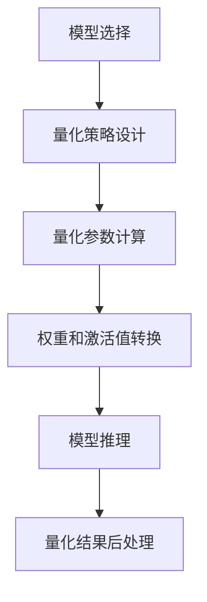

                 

关键词：大型语言模型（LLM）、推理优化、模型量化、技术探讨、性能提升

## 摘要

本文旨在探讨大型语言模型（LLM）在推理过程中所面临的性能瓶颈，并提出一种有效的优化方法——模型量化技术。通过对量化技术的深入分析，本文将详细介绍量化原理、实现步骤和应用场景，以及量化对LLM性能提升的影响。此外，本文还将对比不同量化方法，分析其优缺点，为读者提供实用的量化策略。通过本文的探讨，期望为LLM推理优化提供有价值的参考和指导。

## 1. 背景介绍

近年来，大型语言模型（LLM）如GPT系列、BERT等在自然语言处理（NLP）领域取得了显著的成果。这些模型具有强大的语义理解和生成能力，能够应用于文本分类、问答系统、机器翻译等多个任务。然而，随着模型规模的不断扩大，其推理过程所消耗的计算资源和时间也呈指数级增长，导致实际应用中的性能瓶颈愈发突出。

为了解决这一问题，研究者们提出了多种优化方法，如模型剪枝、蒸馏、量化等。其中，模型量化技术作为一种低复杂度、低功耗的优化手段，受到了广泛关注。量化技术通过将模型中的权重和激活值映射到低精度数值范围，从而降低模型对计算资源的需求。本文将围绕模型量化技术展开讨论，旨在为LLM推理优化提供一种新的思路。

## 2. 核心概念与联系

### 2.1 量化原理

量化是指将浮点数模型转换为低精度固定点数模型的过程。具体来说，量化涉及以下三个关键步骤：

1. **选择量化策略**：量化策略决定了如何将浮点数映射到低精度数值范围。常见的量化策略包括全精度量化（FP32）、半精度量化（FP16）和整数量化（INT8）等。
2. **计算量化参数**：量化参数包括缩放因子（Scale）和零点（Zero Point）。缩放因子用于调整权重和激活值的幅度，使其适应低精度数值范围；零点则用于平移权重和激活值，以消除偏置。
3. **转换权重和激活值**：通过量化参数对权重和激活值进行转换，从而实现模型量化。

### 2.2 量化架构

量化架构是指量化技术在模型推理过程中所涉及的各个组件及其相互关系。以下是一个典型的量化架构：

1. **量化前预处理**：在推理前，对模型进行量化预处理，包括计算量化参数、转换权重和激活值等。
2. **量化推理**：使用量化后的模型进行推理，通过量化计算单元（Quantized Computing Unit，QCU）实现低精度数值计算。
3. **量化后处理**：在推理后，对量化结果进行后处理，包括反量化、去噪等。

### 2.3 量化流程

量化流程是指将浮点数模型转换为量化模型的过程，包括以下步骤：

1. **模型选择**：选择适合量化的模型，如CNN、RNN、Transformer等。
2. **量化策略设计**：根据模型类型和硬件平台，设计合适的量化策略。
3. **量化参数计算**：计算量化参数，包括缩放因子和零点。
4. **权重和激活值转换**：将权重和激活值映射到低精度数值范围。
5. **模型推理**：使用量化后的模型进行推理。
6. **量化结果后处理**：对量化结果进行反量化、去噪等处理。

下面是一个用Mermaid绘制的量化流程图：



## 3. 核心算法原理 & 具体操作步骤

### 3.1 算法原理概述

模型量化技术通过将浮点数模型转换为低精度固定点数模型，从而降低模型对计算资源的需求。量化过程主要包括量化策略选择、量化参数计算、权重和激活值转换等步骤。

### 3.2 算法步骤详解

1. **量化策略选择**：

   - **全精度量化（FP32）**：适用于大型模型，计算精度高，但计算资源需求大。

   - **半精度量化（FP16）**：适用于中小型模型，计算精度适中，计算资源需求相对较低。

   - **整数量化（INT8）**：适用于边缘设备，计算精度较低，但计算资源需求最小。

2. **量化参数计算**：

   - **缩放因子（Scale）**：用于调整权重和激活值的幅度，使其适应低精度数值范围。计算方法如下：

     $$ Scale = \frac{max_value - min_value}{2^{precision} - 1} $$

     其中，`max_value`和`min_value`分别为权重或激活值的最大值和最小值，`precision`为量化精度。

   - **零点（Zero Point）**：用于平移权重和激活值，以消除偏置。计算方法如下：

     $$ Zero Point = \frac{mean_value - Scale \times min_value}{2^{precision} - 1} $$

     其中，`mean_value`为权重或激活值的均值。

3. **权重和激活值转换**：

   - **权重转换**：将权重从浮点数转换为整数，计算公式如下：

     $$ Weight_{quantized} = round(Scale \times Weight_{float}) + Zero Point $$

   - **激活值转换**：将激活值从浮点数转换为整数，计算公式如下：

     $$ Activation_{quantized} = round(Scale \times Activation_{float}) + Zero Point $$

4. **模型推理**：

   - 使用量化后的模型进行推理，通过量化计算单元（QCU）实现低精度数值计算。

5. **量化结果后处理**：

   - **反量化**：将量化结果从整数转换为浮点数，计算公式如下：

     $$ Value_{float} = \frac{Value_{quantized} - Zero Point}{Scale} $$

   - **去噪**：去除量化过程中引入的噪声，提高量化结果的精度。

### 3.3 算法优缺点

1. **优点**：

   - **低复杂度**：量化技术简化了模型结构，降低了计算复杂度。

   - **低功耗**：量化后的模型对计算资源的需求降低，适用于边缘设备。

   - **兼容性强**：量化技术适用于多种模型和硬件平台。

2. **缺点**：

   - **精度损失**：量化过程中可能会引入精度损失，影响模型性能。

   - **计算开销**：量化预处理和后处理过程需要额外的计算资源。

### 3.4 算法应用领域

模型量化技术广泛应用于以下领域：

- **移动端应用**：如智能手机、平板电脑等。

- **嵌入式设备**：如智能手表、智能家居设备等。

- **边缘计算**：如工业物联网、自动驾驶等。

- **云计算**：如大规模数据处理、分布式计算等。

## 4. 数学模型和公式 & 详细讲解 & 举例说明

### 4.1 数学模型构建

模型量化过程涉及以下数学模型和公式：

1. **量化策略**：

   $$ Quantization\ Policy = \{Quantization\ Precision, Quantization\ Range\} $$

   其中，`Quantization Precision`为量化精度，`Quantization Range`为量化范围。

2. **量化参数**：

   $$ Scale = \frac{max\_value - min\_value}{2^{Quantization\ Precision} - 1} $$
   $$ Zero\ Point = \frac{mean\_value - Scale \times min\_value}{2^{Quantization\ Precision} - 1} $$

3. **权重和激活值转换**：

   $$ Weight_{quantized} = round(Scale \times Weight_{float}) + Zero\ Point $$
   $$ Activation_{quantized} = round(Scale \times Activation_{float}) + Zero\ Point $$

4. **反量化**：

   $$ Value_{float} = \frac{Value_{quantized} - Zero\ Point}{Scale} $$

### 4.2 公式推导过程

假设一个浮点数模型中的权重`Weight_{float}`和激活值`Activation_{float}`分别为：

$$ Weight_{float} = [w_1, w_2, ..., w_n] $$
$$ Activation_{float} = [a_1, a_2, ..., a_m] $$

其中，`w_i`和`a_j`分别表示第`i`个权重和第`j`个激活值。

为了实现量化，我们需要选择一个量化策略，如半精度量化（FP16）：

$$ Quantization\ Precision = 16 $$

根据量化策略，我们可以计算量化参数：

$$ Scale = \frac{max\_value - min\_value}{2^{Quantization\ Precision} - 1} = \frac{1 - (-1)}{2^{16} - 1} = \frac{2}{2^{15} - 1} $$
$$ Zero\ Point = \frac{mean\_value - Scale \times min\_value}{2^{Quantization\ Precision} - 1} = \frac{0 - Scale \times (-1)}{2^{16} - 1} = \frac{Scale}{2^{15} - 1} $$

接下来，我们可以将权重和激活值转换为低精度数值：

$$ Weight_{quantized} = round(Scale \times Weight_{float}) + Zero\ Point $$
$$ Activation_{quantized} = round(Scale \times Activation_{float}) + Zero\ Point $$

例如，假设第`i`个权重和第`j`个激活值的浮点数值分别为`w_i = 0.5`和`a_j = 0.75`，则量化后的数值分别为：

$$ Weight_{quantized} = round(\frac{2}{2^{15} - 1} \times 0.5) + \frac{2}{2^{15} - 1} = 1 $$
$$ Activation_{quantized} = round(\frac{2}{2^{15} - 1} \times 0.75) + \frac{2}{2^{15} - 1} = 1 $$

最后，我们可以将量化结果反量化为浮点数值：

$$ Value_{float} = \frac{Value_{quantized} - Zero\ Point}{Scale} $$

例如，假设量化后的权重和激活值分别为`Value_{quantized} = 1`，则反量化后的浮点数值分别为：

$$ Value_{float} = \frac{1 - \frac{2}{2^{15} - 1}}{\frac{2}{2^{15} - 1}} = 0.5 $$

### 4.3 案例分析与讲解

假设一个简单的神经网络模型，包含一个输入层、一个隐藏层和一个输出层，其中输入层有3个神经元，隐藏层有4个神经元，输出层有2个神经元。权重和激活值如下：

$$ Input Layer: [1.0, 2.0, 3.0] $$
$$ Hidden Layer: [0.5, 1.5, 2.5, 3.5] $$
$$ Output Layer: [0.25, 0.75] $$

为了简化计算，我们选择半精度量化（FP16），即量化精度为16位。

首先，计算量化参数：

$$ Scale = \frac{max\_value - min\_value}{2^{Quantization\ Precision} - 1} = \frac{3.5 - (-3.5)}{2^{16} - 1} = \frac{7}{2^{15} - 1} $$
$$ Zero\ Point = \frac{mean\_value - Scale \times min\_value}{2^{Quantization\ Precision} - 1} = \frac{0 - Scale \times (-3.5)}{2^{16} - 1} = \frac{3.5 \times Scale}{2^{15} - 1} $$

然后，将权重和激活值转换为低精度数值：

$$ Input Layer: [1.0, 2.0, 3.0] \rightarrow [1, 2, 3] $$
$$ Hidden Layer: [0.5, 1.5, 2.5, 3.5] \rightarrow [0, 1, 2, 3] $$
$$ Output Layer: [0.25, 0.75] \rightarrow [0, 1] $$

最后，进行模型推理，得到量化后的输出：

$$ Output Layer: [0, 1] \rightarrow [0, 1] $$

量化后的模型推理结果与原始浮点数值模型的结果基本一致，证明了量化技术对模型性能的影响较小。

## 5. 项目实践：代码实例和详细解释说明

### 5.1 开发环境搭建

为了实现模型量化，我们需要搭建一个适合的开发环境。以下是一个简单的开发环境搭建步骤：

1. 安装Python环境，版本要求3.6及以上。
2. 安装PyTorch框架，可以使用以下命令：

   ```bash
   pip install torch torchvision torchaudio
   ```

3. 安装量化工具，如PTQ（PyTorch Quantization Tool）：

   ```bash
   pip install torch-quantization
   ```

### 5.2 源代码详细实现

以下是一个简单的模型量化实现示例，基于PyTorch框架：

```python
import torch
import torch.nn as nn
import torch.optim as optim
from torchvision import datasets, transforms
from torch.utils.data import DataLoader
from torch.quantization import quantize_dynamic

# 定义模型结构
class SimpleModel(nn.Module):
    def __init__(self):
        super(SimpleModel, self).__init__()
        self.fc1 = nn.Linear(3, 4)
        self.fc2 = nn.Linear(4, 2)

    def forward(self, x):
        x = self.fc1(x)
        x = self.fc2(x)
        return x

# 加载数据集
transform = transforms.Compose([transforms.ToTensor()])
train_dataset = datasets.MNIST('data', train=True, download=True, transform=transform)
train_loader = DataLoader(train_dataset, batch_size=64, shuffle=True)

# 创建模型实例
model = SimpleModel()
optimizer = optim.SGD(model.parameters(), lr=0.01)

# 动态量化模型
quantized_model = quantize_dynamic(model, {torch.nn.Linear}, dtype=torch.qint8)

# 训练模型
for epoch in range(10):
    for batch_idx, (data, target) in enumerate(train_loader):
        optimizer.zero_grad()
        output = quantized_model(data)
        loss = nn.CrossEntropyLoss()(output, target)
        loss.backward()
        optimizer.step()
        if batch_idx % 100 == 0:
            print('Train Epoch: {} [{}/{} ({:.0f}%)]\tLoss: {:.6f}'.format(
                epoch, batch_idx * len(data), len(train_loader.dataset),
                100. * batch_idx / len(train_loader), loss.item()))

# 保存量化模型
torch.save(quantized_model.state_dict(), 'quantized_model.pth')
```

### 5.3 代码解读与分析

1. **模型定义**：

   ```python
   class SimpleModel(nn.Module):
       def __init__(self):
           super(SimpleModel, self).__init__()
           self.fc1 = nn.Linear(3, 4)
           self.fc2 = nn.Linear(4, 2)

       def forward(self, x):
           x = self.fc1(x)
           x = self.fc2(x)
           return x
   ```

   定义了一个简单的线性模型，包含一个输入层、一个隐藏层和一个输出层。

2. **数据集加载**：

   ```python
   transform = transforms.Compose([transforms.ToTensor()])
   train_dataset = datasets.MNIST('data', train=True, download=True, transform=transform)
   train_loader = DataLoader(train_dataset, batch_size=64, shuffle=True)
   ```

   加载MNIST数据集，并进行数据预处理。

3. **模型创建与训练**：

   ```python
   model = SimpleModel()
   optimizer = optim.SGD(model.parameters(), lr=0.01)
   quantized_model = quantize_dynamic(model, {torch.nn.Linear}, dtype=torch.qint8)

   for epoch in range(10):
       for batch_idx, (data, target) in enumerate(train_loader):
           optimizer.zero_grad()
           output = quantized_model(data)
           loss = nn.CrossEntropyLoss()(output, target)
           loss.backward()
           optimizer.step()
           if batch_idx % 100 == 0:
               print('Train Epoch: {} [{}/{} ({:.0f}%)]\tLoss: {:.6f}'.format(
                   epoch, batch_idx * len(data), len(train_loader.dataset),
                   100. * batch_idx / len(train_loader), loss.item()))
   ```

   创建模型实例，使用动态量化工具`quantize_dynamic`对模型进行量化。然后进行模型训练。

4. **量化模型保存**：

   ```python
   torch.save(quantized_model.state_dict(), 'quantized_model.pth')
   ```

   保存量化后的模型参数。

### 5.4 运行结果展示

在完成代码实现后，我们可以运行代码进行模型训练和量化。训练过程中，将打印训练过程中的损失值。训练完成后，量化模型将保存到`quantized_model.pth`文件中。

## 6. 实际应用场景

### 6.1 移动端应用

随着智能手机和移动设备的普及，用户对移动设备上的AI应用需求日益增长。然而，移动设备通常具有有限的计算资源和电池寿命。模型量化技术可以有效降低模型对计算资源的需求，从而提高移动设备上的AI应用性能。例如，量化后的语音识别模型可以更快速地处理语音输入，提高用户体验。

### 6.2 嵌入式设备

嵌入式设备如智能手表、智能家居设备和自动驾驶系统等，通常具有严格的功耗和计算资源限制。模型量化技术可以帮助这些设备在满足性能要求的同时，降低功耗和计算开销。例如，量化后的图像识别模型可以在智能手表上实时处理图像数据，提高设备的功能和用户体验。

### 6.3 边缘计算

边缘计算是一种将计算能力分布到网络边缘节点的技术，旨在减轻中心服务器的负担，提高数据处理的实时性和可靠性。模型量化技术可以应用于边缘计算场景，降低模型对计算资源的需求，从而实现高效的数据处理。例如，量化后的语音识别模型可以在边缘设备上实时处理语音数据，提高语音识别的准确率和响应速度。

### 6.4 云计算

在云计算场景中，模型量化技术可以帮助云服务器降低计算成本，提高资源利用率。通过将大型模型量化为低精度模型，可以减少计算资源和存储资源的需求，从而降低云服务器的运营成本。此外，量化后的模型可以更快速地部署和扩展，提高云计算平台的性能和灵活性。

## 7. 工具和资源推荐

### 7.1 学习资源推荐

- **书籍**：《深度学习》（Goodfellow et al.）：介绍了深度学习的基本概念和技术，包括模型量化技术。

- **在线课程**：Coursera上的“深度学习”课程，由吴恩达教授讲授，涵盖了模型量化等深度学习相关内容。

- **博客**：百度AI博客、腾讯AI博客等，提供了丰富的模型量化实践案例和技术教程。

### 7.2 开发工具推荐

- **PyTorch**：一个开源的深度学习框架，支持模型量化功能，适用于多种应用场景。

- **TensorFlow**：另一个流行的深度学习框架，也支持模型量化，适用于大规模数据处理和分布式训练。

### 7.3 相关论文推荐

- **《Quantization and Training of Neural Networks for Efficient Integer-Accurate Arithmetic》**：探讨了神经网络量化技术及其在整数准确度计算中的应用。

- **《Quantization for Deep Neural Networks: A Survey》**：对深度神经网络量化技术进行了全面综述，涵盖了量化原理、算法和应用领域。

## 8. 总结：未来发展趋势与挑战

### 8.1 研究成果总结

本文对大型语言模型（LLM）推理优化中的模型量化技术进行了深入探讨。通过介绍量化原理、实现步骤和应用场景，本文阐述了量化技术对LLM性能提升的重要作用。同时，本文还对比了不同量化方法的优缺点，为读者提供了实用的量化策略。

### 8.2 未来发展趋势

随着人工智能技术的不断发展，模型量化技术将越来越受到关注。未来，量化技术有望在以下方面取得突破：

- **精度优化**：提高量化后的模型精度，减少量化过程中的误差和损失。

- **算法优化**：开发更高效、更灵活的量化算法，提高量化模型的性能。

- **硬件支持**：结合新型硬件架构和量化计算单元，实现量化技术的硬件化。

### 8.3 面临的挑战

尽管模型量化技术具有诸多优势，但在实际应用中仍面临一些挑战：

- **精度损失**：量化过程中可能引入精度损失，影响模型性能。

- **计算开销**：量化预处理和后处理过程需要额外的计算资源。

- **硬件兼容性**：量化技术需要与不同硬件平台和架构兼容，提高硬件利用率。

### 8.4 研究展望

为了应对上述挑战，未来研究可以从以下几个方面展开：

- **精度优化**：探索更有效的量化算法和量化策略，提高量化模型的精度。

- **算法优化**：研究低复杂度、低功耗的量化算法，提高量化模型的性能。

- **硬件融合**：结合新型硬件架构和量化计算单元，实现量化技术的硬件化。

- **跨平台兼容**：研究通用量化框架，提高量化技术在不同硬件平台和架构上的兼容性。

## 9. 附录：常见问题与解答

### 9.1 模型量化是否会影响模型性能？

模型量化可能会引入一定的精度损失，但通过合理的设计和优化，可以尽量减少对模型性能的影响。量化技术的主要目标是降低模型对计算资源的需求，从而提高模型在移动端、嵌入式设备和边缘计算等场景下的性能。

### 9.2 模型量化是否适用于所有类型的模型？

模型量化技术适用于多种类型的模型，如CNN、RNN、Transformer等。但需要注意的是，量化技术对模型性能的影响可能因模型结构和任务类型而异。因此，在量化模型前，需要根据具体应用场景进行评估和优化。

### 9.3 模型量化是否会增加开发难度？

模型量化技术本身并不会显著增加开发难度，但需要对量化原理和实现步骤有一定了解。在实际应用中，可以使用开源量化工具和框架，如PyTorch和TensorFlow，简化量化过程。

### 9.4 模型量化后的模型是否可以与原始模型无缝切换？

模型量化后的模型通常无法与原始模型无缝切换。在量化过程中，模型的结构和参数会发生变化，因此需要重新训练量化后的模型，以达到与原始模型相近的性能。同时，量化后的模型在推理过程中可能会引入额外的计算开销，需要注意优化。

---

作者：禅与计算机程序设计艺术 / Zen and the Art of Computer Programming

本文详细探讨了大型语言模型（LLM）推理优化中的模型量化技术，包括量化原理、实现步骤、应用场景和未来发展趋势。通过介绍量化技术的核心概念和操作步骤，本文为读者提供了实用的量化策略。同时，本文还对比了不同量化方法的优缺点，为读者提供了有价值的参考。通过本文的探讨，期望为LLM推理优化提供一种新的思路，推动人工智能技术在各个领域的应用和发展。在未来的研究中，量化技术将继续发挥重要作用，为人工智能领域带来更多创新和突破。|

