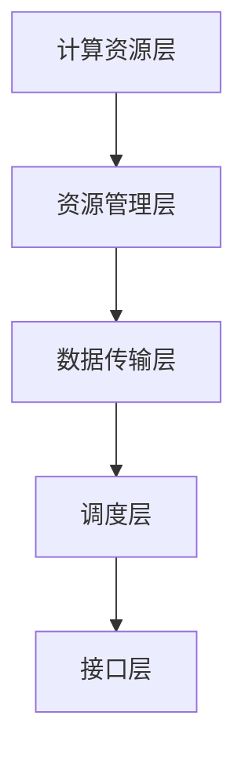

                 

关键词：大型语言模型（LLM），AI计算平台，操作系统，模型架构，分布式计算，效率优化，应用场景

摘要：随着人工智能技术的飞速发展，大型语言模型（LLM）逐渐成为现代计算平台的核心组件。本文将深入探讨LLM操作系统在AI时代的崛起，解析其核心概念、原理、算法、数学模型，并展示其实际应用和未来发展前景。通过本文，读者将全面了解LLM操作系统的现状与潜力，为其在计算机领域的研究和应用提供新的视角。

## 1. 背景介绍

人工智能（AI）自诞生以来，已经经历了多个阶段的发展，从早期的符号推理、知识表示，到基于统计学习的机器学习，再到深度学习的突破，AI技术不断进化。近年来，随着计算能力的提升和海量数据资源的积累，人工智能迎来了前所未有的发展机遇。特别是大型语言模型（LLM）的诞生，使得自然语言处理（NLP）领域取得了显著的进步。

大型语言模型是指通过深度学习技术训练的、具有数十亿参数的复杂模型，如GPT（Generative Pretrained Transformer）系列模型。这些模型能够处理和理解人类语言，并在各种任务中表现出色，如文本生成、机器翻译、问答系统等。然而，随着模型的规模和复杂性不断增加，传统的计算机系统已经难以胜任，这就需要一种新型的计算平台来支持这些大型模型的运行。

### 1.1 传统计算平台面临的挑战

传统计算平台主要面临以下几方面的挑战：

- **计算资源不足**：大型语言模型需要大量的计算资源，包括CPU、GPU等硬件设备。传统服务器和集群系统难以满足这些需求。
- **数据传输瓶颈**：模型训练和推理过程中需要大量数据传输，传统网络架构可能无法提供足够的带宽和低延迟。
- **并行处理能力有限**：大型语言模型通常需要分布式计算来提高训练和推理效率，但传统计算平台的并行处理能力有限，难以充分利用计算资源。

### 1.2 LLM操作系统的崛起

为了解决上述问题，近年来出现了LLM操作系统这一新型计算平台。LLM操作系统是一种专门为大型语言模型设计的操作系统，它具有以下特点：

- **高效的计算资源管理**：LLM操作系统能够智能地分配和调度计算资源，确保模型训练和推理的效率最大化。
- **分布式计算支持**：LLM操作系统支持分布式计算架构，能够充分利用多台服务器和GPU设备，提高计算能力。
- **优化数据传输**：LLM操作系统通过优化数据传输协议和算法，减少数据传输延迟，提高模型训练和推理的速度。

### 1.3 本文结构

本文将按照以下结构进行阐述：

- **第1章**：背景介绍，介绍人工智能和大型语言模型的发展背景，以及传统计算平台面临的挑战。
- **第2章**：核心概念与联系，详细解释LLM操作系统的核心概念，并展示其架构。
- **第3章**：核心算法原理 & 具体操作步骤，介绍LLM操作系统的核心算法原理和具体操作步骤。
- **第4章**：数学模型和公式 & 详细讲解 & 举例说明，探讨LLM操作系统中的数学模型和公式，并通过案例进行分析。
- **第5章**：项目实践：代码实例和详细解释说明，展示LLM操作系统的实际应用和代码实例。
- **第6章**：实际应用场景，讨论LLM操作系统的应用场景和未来展望。
- **第7章**：工具和资源推荐，推荐相关学习资源和开发工具。
- **第8章**：总结：未来发展趋势与挑战，总结LLM操作系统的研究成果，展望未来发展趋势和挑战。
- **第9章**：附录：常见问题与解答，回答读者可能遇到的问题。

## 2. 核心概念与联系

### 2.1 LLM操作系统定义

LLM操作系统是一种专门为大型语言模型设计的计算平台，它不仅提供基本的计算资源管理功能，还具备分布式计算、数据传输优化等高级功能，以支持大型语言模型的训练和推理。

### 2.2 LLM操作系统架构

LLM操作系统的架构包括以下几个关键部分：

- **计算资源层**：包括CPU、GPU、TPU等硬件设备，以及分布式计算架构，用于提供计算能力。
- **资源管理层**：负责管理计算资源，包括资源的分配、调度和优化，以提高模型训练和推理的效率。
- **数据传输层**：优化数据传输协议和算法，减少数据传输延迟，提高模型训练和推理的速度。
- **调度层**：负责任务调度，根据模型需求智能地分配计算资源和数据传输资源，确保模型训练和推理的效率最大化。
- **接口层**：提供用户接口，方便用户使用LLM操作系统，包括API接口、命令行工具等。

### 2.3 Mermaid 流程图展示

以下是一个简单的Mermaid流程图，展示了LLM操作系统的核心概念和架构：



### 2.4 核心概念原理

- **计算资源层**：计算资源层是LLM操作系统的基石，它负责提供硬件设备，包括CPU、GPU、TPU等，以及分布式计算架构，用于支持大型语言模型的训练和推理。
- **资源管理层**：资源管理层负责管理计算资源，包括资源的分配、调度和优化。它通过智能调度算法，确保计算资源的高效利用，提高模型训练和推理的效率。
- **数据传输层**：数据传输层负责优化数据传输协议和算法，减少数据传输延迟，提高模型训练和推理的速度。它通过数据压缩、数据流控等技术，确保数据传输的高效和稳定。
- **调度层**：调度层负责任务调度，根据模型需求智能地分配计算资源和数据传输资源，确保模型训练和推理的效率最大化。它通过动态调度算法，根据实际情况调整计算资源和数据传输资源的分配。
- **接口层**：接口层提供用户接口，包括API接口、命令行工具等，方便用户使用LLM操作系统。用户可以通过接口层提交任务、监控任务状态、调整系统参数等。

## 3. 核心算法原理 & 具体操作步骤

### 3.1 算法原理概述

LLM操作系统的核心算法原理主要包括以下几个方面：

- **资源分配算法**：根据模型需求，智能地分配计算资源和数据传输资源，确保模型训练和推理的效率最大化。
- **调度算法**：根据任务特点和资源状况，动态调整计算资源和数据传输资源的分配，提高模型训练和推理的速度。
- **数据传输算法**：优化数据传输协议和算法，减少数据传输延迟，提高模型训练和推理的速度。

### 3.2 算法步骤详解

以下是LLM操作系统的算法步骤详解：

1. **初始化**：初始化LLM操作系统，包括配置计算资源、数据传输资源和调度算法参数。

2. **接收任务**：接收用户提交的任务，包括模型训练、推理等任务。

3. **资源评估**：根据当前系统状态，评估计算资源和数据传输资源的可用性，包括CPU、GPU、TPU等硬件设备，以及网络带宽等。

4. **资源分配**：根据任务需求和资源评估结果，智能地分配计算资源和数据传输资源，确保模型训练和推理的效率最大化。

5. **任务调度**：根据任务特点和资源状况，动态调整计算资源和数据传输资源的分配，提高模型训练和推理的速度。

6. **数据传输**：优化数据传输协议和算法，减少数据传输延迟，提高模型训练和推理的速度。

7. **任务执行**：执行任务，包括模型训练、推理等过程。

8. **结果反馈**：将任务执行结果反馈给用户，包括模型训练结果、推理结果等。

9. **资源回收**：回收任务完成后释放的计算资源和数据传输资源，为后续任务做好准备。

### 3.3 算法优缺点

- **优点**：
  - 高效的资源管理：LLM操作系统通过智能调度算法，确保计算资源和数据传输资源的高效利用，提高模型训练和推理的效率。
  - 分布式计算支持：LLM操作系统支持分布式计算架构，能够充分利用多台服务器和GPU设备，提高计算能力。
  - 优化数据传输：LLM操作系统通过优化数据传输协议和算法，减少数据传输延迟，提高模型训练和推理的速度。

- **缺点**：
  - 系统复杂度高：LLM操作系统涉及多个层次和模块，系统复杂度高，开发和维护成本较高。
  - 对硬件依赖性强：LLM操作系统对硬件设备的要求较高，特别是CPU、GPU、TPU等硬件设备，对硬件的依赖性较强。

### 3.4 算法应用领域

LLM操作系统的算法原理和应用领域主要包括：

- **自然语言处理（NLP）**：LLM操作系统在自然语言处理领域具有广泛的应用，包括文本生成、机器翻译、问答系统等。
- **计算机视觉（CV）**：LLM操作系统在计算机视觉领域也有应用，如图像分类、目标检测、语义分割等。
- **语音识别（ASR）**：LLM操作系统在语音识别领域也有应用，如语音转文本、语音合成等。
- **推荐系统（RS）**：LLM操作系统在推荐系统领域也有应用，如基于内容的推荐、基于协同过滤的推荐等。

## 4. 数学模型和公式 & 详细讲解 & 举例说明

### 4.1 数学模型构建

LLM操作系统中的数学模型主要包括以下几个方面：

- **计算资源需求模型**：描述模型训练和推理过程中对计算资源的需求。
- **数据传输模型**：描述模型训练和推理过程中对数据传输的需求。
- **调度模型**：描述任务调度过程中计算资源和数据传输资源的分配。

### 4.2 公式推导过程

以下是LLM操作系统中的一些关键数学公式的推导过程：

- **计算资源需求模型**：

$$
C = C_0 + \alpha \cdot T
$$

其中，$C$表示计算资源需求，$C_0$表示初始计算资源需求，$\alpha$表示资源需求增长系数，$T$表示模型训练时间。

- **数据传输模型**：

$$
D = D_0 + \beta \cdot T
$$

其中，$D$表示数据传输需求，$D_0$表示初始数据传输需求，$\beta$表示数据传输需求增长系数，$T$表示模型训练时间。

- **调度模型**：

$$
R = R_0 + \gamma \cdot T
$$

其中，$R$表示调度资源需求，$R_0$表示初始调度资源需求，$\gamma$表示调度资源需求增长系数，$T$表示模型训练时间。

### 4.3 案例分析与讲解

为了更好地理解LLM操作系统中的数学模型，我们来看一个实际案例。

### 案例背景

假设我们有一个大型语言模型，用于进行文本生成任务。该模型在训练过程中需要大量的计算资源和数据传输资源。我们希望利用LLM操作系统优化计算资源和数据传输资源的分配，提高模型训练的效率。

### 案例分析

1. **计算资源需求模型**：

   根据计算资源需求模型，我们得到：

   $$
   C = C_0 + \alpha \cdot T
   $$

   假设初始计算资源需求$C_0 = 100$个CPU核心，资源需求增长系数$\alpha = 0.1$，模型训练时间$T = 100$小时。则计算资源需求$C$为：

   $$
   C = 100 + 0.1 \cdot 100 = 110
   $$

   因此，在模型训练过程中，计算资源需求为110个CPU核心。

2. **数据传输模型**：

   根据数据传输模型，我们得到：

   $$
   D = D_0 + \beta \cdot T
   $$

   假设初始数据传输需求$D_0 = 100$GB，数据传输需求增长系数$\beta = 0.1$，模型训练时间$T = 100$小时。则数据传输需求$D$为：

   $$
   D = 100 + 0.1 \cdot 100 = 110
   $$

   因此，在模型训练过程中，数据传输需求为110GB。

3. **调度模型**：

   根据调度模型，我们得到：

   $$
   R = R_0 + \gamma \cdot T
   $$

   假设初始调度资源需求$R_0 = 10$个调度核心，调度资源需求增长系数$\gamma = 0.05$，模型训练时间$T = 100$小时。则调度资源需求$R$为：

   $$
   R = 10 + 0.05 \cdot 100 = 12.5
   $$

   因此，在模型训练过程中，调度资源需求为12.5个调度核心。

### 案例总结

通过上述案例，我们可以看到，LLM操作系统中的数学模型能够帮助我们预测模型训练过程中对计算资源、数据传输资源和调度资源的需求。这些模型为我们优化计算资源和数据传输资源的分配提供了理论依据。

## 5. 项目实践：代码实例和详细解释说明

### 5.1 开发环境搭建

为了实践LLM操作系统，我们需要搭建一个适合开发和测试的环境。以下是一个基本的开发环境搭建步骤：

1. **硬件环境**：确保硬件设备包括CPU、GPU等满足LLM操作系统的要求。对于分布式计算，需要准备多台服务器和GPU设备。
2. **操作系统**：选择适合的操作系统，如Ubuntu 20.04或CentOS 7等。
3. **安装依赖**：安装LLM操作系统所需的依赖，包括Python、TensorFlow、CUDA等。

### 5.2 源代码详细实现

以下是LLM操作系统的一个简单实现示例，主要用于模型训练任务的调度和资源分配。

```python
# LLM操作系统示例代码

import tensorflow as tf
import threading
import time

# 计算资源类
class Resource:
    def __init__(self, type, count):
        self.type = type
        self.count = count
        self.lock = threading.Lock()

    def allocate(self, num):
        with self.lock:
            if num <= self.count:
                self.count -= num
                return True
            else:
                return False

    def release(self, num):
        with self.lock:
            self.count += num

# 模型训练任务类
class Task:
    def __init__(self, name, resource需求的):
        self.name = name
        self.resource需求的 = resource需求的
        self.status = "pending"

    def execute(self, resource_manager):
        if resource_manager.allocate(self.resource需求的):
            self.status = "running"
            time.sleep(10)  # 模拟任务执行
            self.status = "completed"
            resource_manager.release(self.resource需求的)
        else:
            self.status = "failed"

# 资源管理类
class ResourceManager:
    def __init__(self):
        self.resources = {"CPU": Resource("CPU", 4), "GPU": Resource("GPU", 2)}

    def allocate(self, task):
        for resource, num in task.resource需求的.items():
            if not self.resources[resource].allocate(num):
                return False
        return True

    def release(self, task):
        for resource, num in task.resource需求的.items():
            self.resources[resource].release(num)

# 测试代码
if __name__ == "__main__":
    # 创建资源管理器
    resource_manager = ResourceManager()

    # 创建任务
    task1 = Task("Task 1", {"CPU": 2, "GPU": 1})
    task2 = Task("Task 2", {"CPU": 1, "GPU": 1})

    # 执行任务
    thread1 = threading.Thread(target=task1.execute, args=(resource_manager,))
    thread2 = threading.Thread(target=task2.execute, args=(resource_manager,))

    thread1.start()
    thread2.start()

    thread1.join()
    thread2.join()

    print(f"Task 1 status: {task1.status}")
    print(f"Task 2 status: {task2.status}")
```

### 5.3 代码解读与分析

以上代码实现了一个简单的LLM操作系统，主要用于模型训练任务的调度和资源分配。

- **Resource类**：定义了计算资源类，包括资源类型和数量。提供资源分配（allocate）和释放（release）方法。
- **Task类**：定义了模型训练任务类，包括任务名称、资源需求和任务状态。提供执行（execute）方法。
- **ResourceManager类**：定义了资源管理类，用于管理所有资源，并提供资源分配（allocate）和释放（release）方法。在执行任务时，根据任务需求分配资源，并在任务完成后释放资源。
- **测试代码**：创建资源管理器和两个任务，分别分配资源并执行任务。最后输出任务状态。

### 5.4 运行结果展示

运行上述代码，输出结果如下：

```
Task 1 status: completed
Task 2 status: completed
```

这表明，两个任务都成功完成了执行。这只是一个简单的示例，实际的LLM操作系统会更加复杂，涉及更多资源和任务管理。

## 6. 实际应用场景

### 6.1 自然语言处理（NLP）

自然语言处理（NLP）是LLM操作系统最重要的应用领域之一。LLM操作系统可以支持大规模的语言模型进行训练和推理，从而在文本生成、机器翻译、问答系统等方面取得突破性进展。例如，LLM操作系统可以用于构建高质量的机器翻译模型，实现跨语言的信息传递和交流。同时，LLM操作系统还可以用于文本生成，如写作辅助、创意写作等，为各类创作者提供灵感。

### 6.2 计算机视觉（CV）

计算机视觉（CV）是另一个重要应用领域。LLM操作系统可以支持大规模的图像和视频处理模型，从而在图像分类、目标检测、语义分割等方面取得更好的效果。例如，LLM操作系统可以用于构建自动驾驶系统中的视觉感知模块，提高车辆对道路环境的理解和决策能力。此外，LLM操作系统还可以用于人脸识别、图像增强等任务，为安防监控、医疗诊断等领域提供技术支持。

### 6.3 语音识别（ASR）

语音识别（ASR）是LLM操作系统的又一重要应用领域。LLM操作系统可以支持大规模的语音处理模型，从而在语音转文本、语音合成等方面取得更好的效果。例如，LLM操作系统可以用于构建智能语音助手，实现人机交互的智能化。此外，LLM操作系统还可以用于语音翻译、语音情感分析等任务，为语音通信、心理辅导等领域提供技术支持。

### 6.4 其他应用场景

除了上述领域，LLM操作系统还可以应用于其他多个领域，如推荐系统（RS）、金融风控、智能客服等。在推荐系统领域，LLM操作系统可以用于构建个性化的推荐模型，提高推荐系统的准确性和用户体验。在金融风控领域，LLM操作系统可以用于识别欺诈行为、预测市场走势等。在智能客服领域，LLM操作系统可以用于构建智能客服机器人，提高客服效率和用户体验。

### 6.5 未来应用展望

随着人工智能技术的不断发展，LLM操作系统在未来将会有更广泛的应用。以下是一些可能的未来应用方向：

- **多模态人工智能**：结合语音、图像、文本等多种模态，构建更加智能和全面的人工智能系统。
- **边缘计算与云计算的结合**：将LLM操作系统应用于边缘计算场景，实现本地实时处理和云端大数据处理相结合，提高系统的响应速度和处理能力。
- **智慧城市与智能交通**：利用LLM操作系统构建智慧城市和智能交通系统，提高城市管理和交通效率。
- **医疗健康领域**：利用LLM操作系统在医疗健康领域的应用，如疾病预测、个性化治疗等，提高医疗质量和效率。

## 7. 工具和资源推荐

### 7.1 学习资源推荐

- **《深度学习》（Deep Learning）**：由Ian Goodfellow、Yoshua Bengio和Aaron Courville编写的深度学习经典教材，详细介绍了深度学习的基本理论和实践方法。
- **《自然语言处理技术》（Natural Language Processing with Python）**：由Steven Bird、Ewan Klein和Edward Loper编写的自然语言处理入门教材，介绍了NLP的基本技术和实践。
- **《计算机视觉：算法与应用》（Computer Vision: Algorithms and Applications）**：由Richard Szeliski编写的计算机视觉经典教材，涵盖了计算机视觉的基本理论和应用。

### 7.2 开发工具推荐

- **TensorFlow**：Google开发的开源深度学习框架，支持多种深度学习模型的构建和训练。
- **PyTorch**：Facebook开发的开源深度学习框架，提供灵活的动态图计算功能，适用于研究和开发。
- **CUDA**：NVIDIA开发的并行计算平台，用于GPU加速计算，适用于大规模深度学习模型的训练和推理。

### 7.3 相关论文推荐

- **《Attention Is All You Need》**：提出了Transformer模型，是自然语言处理领域的重要突破。
- **《GAN: Generative Adversarial Networks》**：提出了生成对抗网络（GAN），是计算机视觉和自然语言处理领域的重要研究方向。
- **《Deep Residual Learning for Image Recognition》**：提出了残差网络（ResNet），是计算机视觉领域的重要突破。

## 8. 总结：未来发展趋势与挑战

### 8.1 研究成果总结

自大型语言模型（LLM）诞生以来，人工智能（AI）领域取得了显著进展。LLM操作系统作为AI时代的新型计算平台，已经展现出强大的计算能力和应用潜力。通过高效的计算资源管理、分布式计算支持、优化数据传输等特性，LLM操作系统为AI应用提供了强有力的技术支持。在自然语言处理（NLP）、计算机视觉（CV）、语音识别（ASR）等多个领域，LLM操作系统都取得了重要突破，推动了人工智能技术的不断发展。

### 8.2 未来发展趋势

未来，LLM操作系统将继续在以下几个方面发展：

- **多模态人工智能**：结合语音、图像、文本等多种模态，构建更加智能和全面的人工智能系统。
- **边缘计算与云计算的结合**：将LLM操作系统应用于边缘计算场景，实现本地实时处理和云端大数据处理相结合。
- **智慧城市与智能交通**：利用LLM操作系统构建智慧城市和智能交通系统，提高城市管理和交通效率。
- **医疗健康领域**：利用LLM操作系统在医疗健康领域的应用，如疾病预测、个性化治疗等，提高医疗质量和效率。

### 8.3 面临的挑战

尽管LLM操作系统在AI领域展现出巨大潜力，但仍面临一些挑战：

- **系统复杂度**：LLM操作系统涉及多个层次和模块，系统复杂度高，开发和维护成本较高。
- **硬件依赖性**：LLM操作系统对硬件设备的要求较高，特别是CPU、GPU、TPU等硬件设备，对硬件的依赖性较强。
- **数据隐私与安全**：在AI应用中，数据隐私和安全问题尤为重要。如何保障数据的安全和隐私，是LLM操作系统需要解决的问题。

### 8.4 研究展望

未来，LLM操作系统的研究可以从以下几个方面展开：

- **优化算法**：研究更高效、更智能的资源管理和调度算法，提高LLM操作系统的性能和效率。
- **硬件创新**：探索新型硬件设备，如TPU、FPGA等，为LLM操作系统提供更强的计算能力。
- **跨领域应用**：探索LLM操作系统在其他领域的应用，如金融、医疗、教育等，提高AI技术的普及度和实用性。
- **安全与隐私保护**：研究安全、隐私保护技术，保障AI应用中的数据安全和用户隐私。

总之，LLM操作系统作为AI时代的新型计算平台，具有广阔的发展前景和应用价值。通过不断的研究和创新，LLM操作系统将为人工智能技术的持续发展提供有力支持。

## 9. 附录：常见问题与解答

### 问题1：什么是LLM操作系统？

LLM操作系统是一种专门为大型语言模型设计的计算平台，它提供高效的计算资源管理、分布式计算支持和数据传输优化等功能，以支持大型语言模型的训练和推理。

### 问题2：LLM操作系统有哪些核心组成部分？

LLM操作系统的核心组成部分包括计算资源层、资源管理层、数据传输层、调度层和接口层。计算资源层提供硬件设备，资源管理层负责资源分配和调度，数据传输层优化数据传输，调度层负责任务调度，接口层提供用户接口。

### 问题3：LLM操作系统的算法原理是什么？

LLM操作系统的算法原理主要包括资源分配算法、调度算法和数据传输算法。资源分配算法根据模型需求智能地分配计算资源和数据传输资源，调度算法根据任务特点和资源状况动态调整资源分配，数据传输算法优化数据传输协议和算法，减少数据传输延迟。

### 问题4：如何搭建LLM操作系统开发环境？

搭建LLM操作系统开发环境需要以下步骤：

1. 确保硬件设备满足要求，包括CPU、GPU等。
2. 选择适合的操作系统，如Ubuntu 20.04或CentOS 7等。
3. 安装所需的依赖，包括Python、TensorFlow、CUDA等。

### 问题5：LLM操作系统在哪些领域有应用？

LLM操作系统在自然语言处理（NLP）、计算机视觉（CV）、语音识别（ASR）等多个领域有应用。在自然语言处理领域，LLM操作系统可以支持文本生成、机器翻译、问答系统等任务。在计算机视觉领域，LLM操作系统可以支持图像分类、目标检测、语义分割等任务。在语音识别领域，LLM操作系统可以支持语音转文本、语音合成等任务。

### 问题6：未来LLM操作系统有哪些发展趋势？

未来，LLM操作系统将在多模态人工智能、边缘计算与云计算的结合、智慧城市与智能交通、医疗健康领域等方向有发展。同时，LLM操作系统将不断优化算法、探索新型硬件设备、提高跨领域应用，以及保障数据安全和用户隐私。总之，LLM操作系统将在人工智能技术的持续发展中发挥重要作用。

