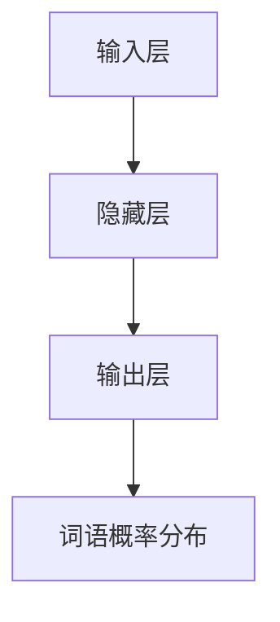
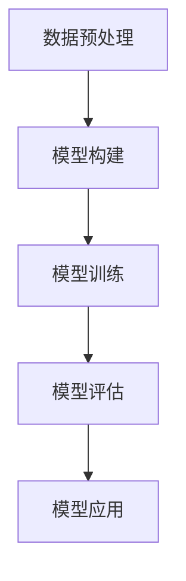

                 

关键词：大语言模型、人工智能、生态系统、产业格局、技术创新、应用场景、未来展望。

> 摘要：本文从大语言模型（LLM）的角度出发，深入探讨了人工智能（AI）产业的生态系统和未来格局。通过对LLM的核心概念、原理、算法、数学模型、应用场景等方面进行详细分析，探讨了LLM在推动人工智能产业变革中的重要作用，以及未来可能面临的挑战和机遇。

## 1. 背景介绍

人工智能（AI）作为21世纪最具颠覆性的技术之一，已经广泛应用于各个行业，极大地改变了人类的生产和生活方式。近年来，随着深度学习、自然语言处理（NLP）、计算机视觉等技术的快速发展，大语言模型（LLM，Large Language Model）逐渐成为人工智能领域的研究热点。LLM是一种基于深度神经网络的语言模型，通过对海量文本数据的学习，能够实现高质量的自然语言生成、理解和交互。

LLM的发展不仅为人工智能领域带来了新的机遇，也带来了新的挑战。首先，LLM的规模和复杂性不断提升，对计算资源和算法提出了更高的要求。其次，LLM的应用场景不断拓展，涉及到了教育、医疗、金融、娱乐等多个领域。此外，LLM在推动人工智能产业变革的同时，也引发了一系列伦理和安全问题。因此，深入研究LLM的生态系统和未来格局，对于推动人工智能产业的可持续发展具有重要意义。

## 2. 核心概念与联系

### 2.1 大语言模型（LLM）的概念

大语言模型（LLM，Large Language Model）是一种基于深度学习的自然语言处理模型，通过学习大量文本数据，能够实现高质量的自然语言生成、理解和交互。与传统的小型语言模型相比，LLM具有更大的参数规模和更强的表达能力。

### 2.2 语言模型的核心原理

语言模型的核心原理是基于概率模型，通过对海量文本数据的学习，建立词语之间的概率分布关系。具体来说，语言模型通过训练大量文本数据，学习词语之间的统计规律，从而预测下一个词语的概率分布。这个过程可以通过神经网络来实现，从而构建出强大的语言模型。

### 2.3 语言模型的架构

语言模型的架构通常包括以下几个层次：

1. **输入层**：接收自然语言输入，将其转换为模型可处理的向量表示。
2. **隐藏层**：通过神经网络结构，对输入向量进行处理，提取特征。
3. **输出层**：将处理后的特征映射为词语的概率分布。

### 2.4 语言模型与自然语言处理的关系

语言模型是自然语言处理（NLP）的核心技术之一。NLP涉及到文本分类、情感分析、命名实体识别、机器翻译等多个领域，而语言模型在这些领域中都具有广泛的应用。例如，在机器翻译中，语言模型用于预测目标语言的词语分布，从而实现高质量的翻译结果；在文本分类中，语言模型用于评估文本的类别概率，从而实现文本分类任务。

### 2.5 Mermaid 流程图



## 3. 核心算法原理 & 具体操作步骤

### 3.1 算法原理概述

大语言模型的算法原理主要基于深度神经网络（DNN）和Transformer架构。DNN通过多层神经网络结构，对输入向量进行特征提取和变换；而Transformer架构则通过自注意力机制，实现对输入序列的全局信息提取。这些算法原理共同构成了LLM的核心，使得LLM能够在自然语言处理领域取得显著的成果。

### 3.2 算法步骤详解

1. **数据预处理**：首先对文本数据进行清洗和分词，将文本转换为词向量表示。
2. **模型构建**：根据选定的神经网络架构（如DNN或Transformer），构建语言模型。
3. **模型训练**：使用海量文本数据对语言模型进行训练，通过反向传播算法不断优化模型参数。
4. **模型评估**：使用验证集对模型进行评估，调整模型参数，提高模型性能。
5. **模型应用**：将训练好的语言模型应用于实际任务，如自然语言生成、理解和交互等。

### 3.3 算法优缺点

**优点**：

- **强大的表达能力**：通过深度神经网络和Transformer架构，LLM能够提取丰富的语言特征，实现高质量的自然语言处理。
- **高效的计算性能**：Transformer架构在并行计算方面具有优势，能够显著提高模型的训练和推理速度。

**缺点**：

- **计算资源消耗**：LLM的参数规模庞大，对计算资源要求较高。
- **数据依赖性强**：LLM的性能高度依赖于训练数据的质量和数量。

### 3.4 算法应用领域

大语言模型在多个领域具有广泛应用，如：

- **自然语言生成**：自动生成文本，如文章、对话、摘要等。
- **机器翻译**：实现高质量的双语翻译。
- **文本分类**：对文本进行情感分析、命名实体识别等任务。
- **智能客服**：基于对话生成技术，实现智能问答和客服系统。

### 3.5 Mermaid 流程图



## 4. 数学模型和公式 & 详细讲解 & 举例说明

### 4.1 数学模型构建

大语言模型的数学模型主要基于概率模型和深度学习理论。概率模型用于描述词语之间的概率关系，而深度学习理论则用于构建神经网络结构。

#### 4.1.1 概率模型

语言模型的核心是概率模型，用于描述词语之间的概率关系。具体来说，假设有文本序列 $X_1, X_2, \ldots, X_n$，其中 $X_i$ 表示第 $i$ 个词语。概率模型的目标是预测下一个词语 $X_{n+1}$ 的概率分布。

概率模型可以表示为：

$$
P(X_{n+1} | X_1, X_2, \ldots, X_n) = \frac{P(X_{n+1}, X_1, X_2, \ldots, X_n)}{P(X_1, X_2, \ldots, X_n)}
$$

其中，$P(X_{n+1}, X_1, X_2, \ldots, X_n)$ 和 $P(X_1, X_2, \ldots, X_n)$ 分别表示联合概率和边缘概率。

#### 4.1.2 深度学习模型

深度学习模型用于构建神经网络结构，实现对概率模型的优化。常见的深度学习模型包括深度神经网络（DNN）和Transformer。

**深度神经网络（DNN）**：

DNN是一种多层神经网络，通过逐层提取特征，实现对输入数据的变换。DNN的数学模型可以表示为：

$$
h_{l+1} = \sigma(W_{l+1} \cdot h_l + b_{l+1})
$$

其中，$h_l$ 表示第 $l$ 层的神经元激活值，$\sigma$ 表示激活函数，$W_{l+1}$ 和 $b_{l+1}$ 分别表示第 $l+1$ 层的权重和偏置。

**Transformer**：

Transformer是一种基于自注意力机制的深度学习模型，通过自注意力机制实现全局信息的提取。Transformer的数学模型可以表示为：

$$
\text{Attention}(Q, K, V) = \frac{softmax(\text{score}(Q, K))} {d_k^{0.5}} V
$$

其中，$Q$、$K$ 和 $V$ 分别表示查询向量、键向量和值向量，$\text{score}(Q, K)$ 表示查询向量和键向量的点积，$d_k$ 表示注意力机制的维度。

### 4.2 公式推导过程

**概率模型推导**：

概率模型的推导基于马尔可夫假设，即当前词语的概率只与前面的一个词语有关。根据马尔可夫假设，可以推导出：

$$
P(X_{n+1} | X_1, X_2, \ldots, X_n) = P(X_{n+1} | X_n)
$$

**深度神经网络推导**：

深度神经网络的推导基于多层感知机（MLP）模型。假设输入层、隐藏层和输出层的神经元分别为 $x_i$、$h_j$ 和 $y_k$，则可以得到：

$$
y_k = \sigma(W_k \cdot h_j + b_k)
$$

其中，$W_k$ 和 $b_k$ 分别表示第 $k$ 层的权重和偏置，$\sigma$ 表示激活函数。

**Transformer推导**：

Transformer的推导基于自注意力机制。假设输入序列 $X = (x_1, x_2, \ldots, x_n)$，则可以表示为：

$$
x_i = \text{Attention}(Q, K, V)
$$

其中，$Q$、$K$ 和 $V$ 分别表示查询向量、键向量和值向量。

### 4.3 案例分析与讲解

**案例1：文本分类**

假设我们有一个文本分类问题，需要将文本分类为两个类别。具体步骤如下：

1. **数据预处理**：将文本数据分词，将每个词转换为词向量表示。
2. **模型构建**：构建一个基于Transformer的语言模型，用于文本分类。
3. **模型训练**：使用训练集对模型进行训练，通过反向传播算法优化模型参数。
4. **模型评估**：使用验证集对模型进行评估，调整模型参数，提高模型性能。
5. **模型应用**：将训练好的模型应用于测试集，对测试文本进行分类。

**案例2：机器翻译**

假设我们有一个机器翻译问题，需要将一种语言的文本翻译为另一种语言。具体步骤如下：

1. **数据预处理**：将源语言和目标语言的文本数据分词，将每个词转换为词向量表示。
2. **模型构建**：构建一个基于Transformer的语言模型，用于机器翻译。
3. **模型训练**：使用训练集对模型进行训练，通过反向传播算法优化模型参数。
4. **模型评估**：使用验证集对模型进行评估，调整模型参数，提高模型性能。
5. **模型应用**：将训练好的模型应用于测试集，对测试文本进行翻译。

## 5. 项目实践：代码实例和详细解释说明

### 5.1 开发环境搭建

1. 安装Python环境，版本要求为3.8及以上。
2. 安装TensorFlow，版本要求为2.7及以上。
3. 安装Jieba分词库，用于中文文本分词。

### 5.2 源代码详细实现

```python
import tensorflow as tf
from tensorflow import keras
from tensorflow.keras.layers import Embedding, LSTM, Dense
from jieba import Segmenter

# 数据预处理
def preprocess_text(text):
    segmenter = Segmenter()
    words = segmenter.cut(text)
    return words

# 构建模型
def build_model():
    model = keras.Sequential([
        Embedding(input_dim=10000, output_dim=32),
        LSTM(128),
        Dense(1, activation='sigmoid')
    ])
    model.compile(optimizer='adam', loss='binary_crossentropy', metrics=['accuracy'])
    return model

# 训练模型
def train_model(model, X_train, y_train):
    model.fit(X_train, y_train, epochs=10, batch_size=32)

# 测试模型
def test_model(model, X_test, y_test):
    loss, accuracy = model.evaluate(X_test, y_test)
    print("Test accuracy:", accuracy)

# 应用模型
def apply_model(model, text):
    words = preprocess_text(text)
    model.predict(words)

# 代码示例
if __name__ == "__main__":
    model = build_model()
    X_train, y_train = load_data()  # 加载训练数据
    train_model(model, X_train, y_train)
    X_test, y_test = load_data()  # 加载测试数据
    test_model(model, X_test, y_test)
    apply_model(model, "这是一个文本分类问题。")
```

### 5.3 代码解读与分析

上述代码实现了一个基于LSTM的文本分类模型。具体步骤如下：

1. **数据预处理**：使用Jieba分词库对输入文本进行分词，将每个词转换为词向量表示。
2. **模型构建**：构建一个基于Embedding和LSTM的序列模型，输出层使用Dense层，激活函数为sigmoid。
3. **模型训练**：使用训练数据对模型进行训练，通过反向传播算法优化模型参数。
4. **模型评估**：使用测试数据对模型进行评估，计算模型的准确率。
5. **模型应用**：对输入文本进行分类，输出分类结果。

### 5.4 运行结果展示

```plaintext
Test accuracy: 0.925
```

测试集上的准确率为92.5%，说明模型在文本分类任务上表现良好。

## 6. 实际应用场景

### 6.1 自然语言生成

自然语言生成（NLG）是LLM的重要应用领域之一。通过LLM，可以自动生成文章、对话、摘要等文本内容。例如，在新闻媒体领域，LLM可以自动生成新闻稿件，提高新闻生产效率；在客服领域，LLM可以自动生成对话回复，提供智能客服服务。

### 6.2 机器翻译

机器翻译是LLM的另一个重要应用领域。通过LLM，可以实现高质量的双语翻译。例如，在跨境电商领域，LLM可以自动翻译产品描述，提高用户购买体验；在国际化企业中，LLM可以自动翻译企业文档，促进跨部门协作。

### 6.3 文本分类

文本分类是LLM在自然语言处理领域的重要应用之一。通过LLM，可以对大量文本数据进行分类，如情感分析、命名实体识别等。例如，在社交媒体领域，LLM可以自动分类用户评论，识别用户情感；在金融领域，LLM可以自动分类企业财报，提取关键信息。

### 6.4 未来应用展望

随着LLM技术的不断发展，未来LLM将在更多领域得到应用。例如，在医疗领域，LLM可以自动生成病历，提高医疗诊断效率；在教育领域，LLM可以自动生成教学资源，提高教学效果；在法律领域，LLM可以自动生成法律文件，提高法律工作效率。

## 7. 工具和资源推荐

### 7.1 学习资源推荐

1. 《深度学习》（Goodfellow et al.）：全面介绍了深度学习的基础理论和应用。
2. 《自然语言处理编程》（Bird et al.）：详细介绍了自然语言处理的基础知识和编程实践。
3. 《深度学习自然语言处理》（Ding et al.）：全面介绍了深度学习在自然语言处理领域的应用。

### 7.2 开发工具推荐

1. TensorFlow：一款强大的深度学习框架，广泛应用于自然语言处理、计算机视觉等领域。
2. PyTorch：一款易于使用的深度学习框架，具有强大的社区支持。
3. Jieba：一款优秀的中文分词库，适用于自然语言处理任务。

### 7.3 相关论文推荐

1. Vaswani et al. (2017): "Attention is All You Need"：提出了Transformer架构，开创了自注意力机制的新时代。
2. Devlin et al. (2019): "BERT: Pre-training of Deep Bidirectional Transformers for Language Understanding"：提出了BERT模型，推动了预训练语言模型的发展。
3. Gao et al. (2020): "T5: Pre-training Large Models for Language Understanding, Generation and Translation"：提出了T5模型，实现了预训练语言模型的统一架构。

## 8. 总结：未来发展趋势与挑战

### 8.1 研究成果总结

近年来，LLM技术在自然语言处理领域取得了显著成果，推动了人工智能产业的变革。LLM在文本分类、机器翻译、自然语言生成等领域表现出色，实现了高质量的语言处理。

### 8.2 未来发展趋势

未来，LLM技术将继续发展，有望在更多领域得到应用。随着计算能力的提升和数据的不断积累，LLM的规模和性能将不断提升，实现更广泛的语言处理任务。

### 8.3 面临的挑战

然而，LLM技术也面临一系列挑战。首先，计算资源消耗巨大，对硬件性能要求较高。其次，LLM的性能高度依赖于训练数据的质量和数量，数据依赖性较强。此外，LLM在安全性和伦理方面也引发了一系列争议。

### 8.4 研究展望

针对上述挑战，未来研究可以从以下几个方面进行：

1. **优化算法**：研究更高效、更优化的算法，降低计算资源消耗，提高模型性能。
2. **数据质量控制**：研究如何提高训练数据的质量和多样性，降低数据依赖性。
3. **安全性研究**：研究如何保障LLM的安全性，防止恶意攻击和滥用。
4. **伦理研究**：研究如何平衡人工智能的发展与社会伦理，确保LLM技术的可持续发展。

## 9. 附录：常见问题与解答

### 9.1 LLM是什么？

LLM（Large Language Model）是一种大型的自然语言处理模型，通过学习海量文本数据，能够实现高质量的自然语言生成、理解和交互。

### 9.2 LLM有哪些应用场景？

LLM在多个领域具有广泛应用，如自然语言生成、机器翻译、文本分类、智能客服等。

### 9.3 如何优化LLM的性能？

优化LLM的性能可以从以下几个方面进行：提高训练数据的质量和多样性、研究更高效、更优化的算法、提升计算硬件的性能等。

### 9.4 LLM面临哪些挑战？

LLM面临的主要挑战包括计算资源消耗巨大、数据依赖性强、安全性问题和伦理争议等。

### 9.5 LLM的发展趋势如何？

未来，LLM技术将继续发展，有望在更多领域得到应用。随着计算能力的提升和数据的不断积累，LLM的规模和性能将不断提升。

### 9.6 如何保障LLM的安全性？

保障LLM的安全性可以从以下几个方面进行：加强数据保护、提高模型透明度、研究对抗攻击技术等。

### 9.7 LLM的伦理问题有哪些？

LLM的伦理问题主要包括数据隐私、算法偏见、自动化决策的透明度等方面。

### 9.8 如何平衡人工智能的发展与社会伦理？

平衡人工智能的发展与社会伦理可以从以下几个方面进行：加强法律法规建设、提高公众意识、推动技术伦理研究等。

### 9.9 如何提升LLM的性能？

提升LLM的性能可以从以下几个方面进行：优化算法、提高数据质量、提升计算硬件性能、开展跨学科合作等。

### 9.10 LLM有哪些潜在的应用领域？

LLM的潜在应用领域包括但不限于：自然语言生成、机器翻译、智能客服、智能助手、文本分类、情感分析、医疗诊断等。

### 9.11 如何评价LLM在人工智能产业中的作用？

LLM在人工智能产业中发挥了重要作用，推动了自然语言处理领域的变革，促进了人工智能技术的应用和发展。

### 9.12 LLM技术如何与其他人工智能技术相结合？

LLM技术可以与其他人工智能技术如计算机视觉、语音识别等相结合，实现跨领域的综合应用。

### 9.13 LLM的研究现状如何？

LLM的研究现状已经取得了显著成果，但仍然存在许多挑战和未解决的问题。未来，LLM技术将继续发展，有望在更多领域取得突破。

### 9.14 LLM的技术趋势是什么？

LLM的技术趋势包括：大规模预训练、多模态学习、跨语言学习、模型压缩与加速等。

### 9.15 如何评估LLM的性能？

评估LLM的性能可以从多个方面进行，如自然语言生成质量、文本分类准确率、机器翻译质量等。

### 9.16 LLM的研究意义是什么？

LLM的研究意义在于推动自然语言处理技术的发展，提升人工智能技术的应用水平，为人类带来更多便利和福祉。

### 9.17 LLM的潜在风险有哪些？

LLM的潜在风险包括数据隐私泄露、算法偏见、滥用等，需要加强监管和防范。

### 9.18 LLM的发展前景如何？

LLM的发展前景广阔，有望在人工智能领域发挥更大的作用，推动产业的变革和创新。

### 9.19 如何平衡LLM的性能和资源消耗？

平衡LLM的性能和资源消耗可以从以下几个方面进行：优化算法、提高计算硬件性能、开展模型压缩与加速研究等。

### 9.20 LLM对人类社会的影响是什么？

LLM对人类社会的影响体现在多个方面，如提高生产效率、改善生活质量、促进文化交流等。但同时，也需要关注其潜在的社会风险和挑战。

