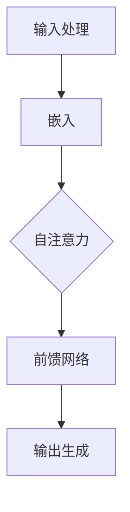

                 

关键词：大语言模型，类比推理，神经网络，深度学习，算法优化，应用场景，未来展望。

## 摘要

本文旨在深入探讨大语言模型（LLM）在类比推理方面的应用和潜力。类比推理是人工智能领域的一个关键能力，它允许系统从已知的信息中推断出未知的信息。本文将首先介绍类比推理的概念和重要性，随后详细分析LLM在类比推理中的工作原理。我们将探讨LLM中用于类比推理的核心算法，如Transformer架构和自注意力机制。接下来，本文将介绍如何优化这些算法以提升类比推理的性能。此外，我们还将讨论LLM在各个领域的实际应用，以及未来类比推理研究可能面临的挑战和机遇。

## 1. 背景介绍

### 类比推理的定义和重要性

类比推理是人类思维中的一种基本能力，它涉及到从一个已知的情境中推断出一个相似但未知的情境。简单来说，类比推理允许我们将已知事物的特性应用到未知事物上。例如，当我们看到一只猫时，我们可能会推断出它有四条腿、尾巴和尖耳朵，这是因为我们已经从过去的经验中学会了这些特征。类比推理在人类的学习、决策和创新中扮演着至关重要的角色。

在人工智能领域，类比推理同样被认为是一个重要的研究方向。机器能够进行类比推理，意味着它们可以更好地理解语言、图像和复杂的数据。这对于提高机器的智能水平和自主性至关重要。例如，在自然语言处理（NLP）中，类比推理可以帮助模型理解词义和句子结构，从而更准确地生成文本或回答问题。

### 大语言模型（LLM）的兴起

近年来，大语言模型（LLM）如GPT-3、BERT和T5等取得了显著的进展。这些模型具有数十亿甚至数千亿个参数，能够处理大量的文本数据，并从中学习语言规律和模式。LLM的出现改变了NLP领域的格局，使得许多以前需要手动编写的规则和模型结构变得不再必要。

LLM在类比推理中具有显著的优势。首先，它们能够处理和理解复杂的语言结构，这使得它们能够捕捉到类比推理中的微妙关系。其次，LLM可以通过大规模数据训练，从而在广泛的语言任务上表现出色。最后，LLM的可扩展性使得它们能够适应各种不同的应用场景，从而推广类比推理的应用范围。

## 2. 核心概念与联系

为了深入理解LLM在类比推理中的作用，我们首先需要了解LLM的核心概念和结构。以下是用于类比推理的核心算法原理和具体操作步骤的详细说明。

### 2.1 LLM的核心算法原理

LLM的核心算法是基于深度学习和神经网络，尤其是Transformer架构。Transformer架构引入了自注意力机制，这使得模型能够在处理序列数据时捕捉到长距离的依赖关系。自注意力机制允许模型在每个位置上动态地关注其他位置的信息，从而提高了模型的表示能力。

### 2.2 LLM的具体操作步骤

1. **输入处理**：首先，LLM接收一个输入序列，这个序列可以是文本、声音或其他形式的数据。输入序列会被编码成一个向量表示。

2. **嵌入**：接下来，嵌入层将输入序列的每个词或字符转换成高维的向量表示。

3. **自注意力机制**：自注意力机制是Transformer架构的核心，它允许模型在序列的每个位置上动态地关注其他位置的信息。这种机制提高了模型对长序列数据的处理能力。

4. **前馈网络**：在自注意力机制之后，序列数据会经过一个前馈网络，这个网络由多个全连接层组成。

5. **输出生成**：最后，模型会生成一个输出序列，这个序列可以是预测的单词、标签或其他形式的输出。

### 2.3 LLM的架构和流程图

以下是LLM的架构和流程图，使用Mermaid表示：



在上述流程图中，每个节点代表LLM的一个操作步骤，箭头表示数据流的方向。这个流程图清晰地展示了LLM在类比推理中的工作原理。

### 2.4 类比推理的数学模型和公式

类比推理可以通过数学模型来描述。以下是一个简化的数学模型：

$$
\text{output} = \text{model}(\text{input}, \text{context})
$$

其中，`input`是输入序列，`context`是上下文信息，`model`是LLM的数学模型。具体来说，LLM的数学模型可以表示为：

$$
\text{model}(\text{input}, \text{context}) = \text{softmax}(\text{logits})
$$

其中，`logits`是模型的输出，`softmax`函数用于将输出转换为概率分布。

### 2.5 类比推理的应用领域

类比推理在多个领域都有广泛的应用。以下是几个典型的应用领域：

1. **自然语言处理**：LLM可以用于文本生成、机器翻译、情感分析等任务，这些任务都涉及到类比推理。
2. **计算机视觉**：在图像识别和图像生成中，类比推理可以帮助模型理解图像中的相似性和差异。
3. **推荐系统**：类比推理可以用于推荐系统，通过比较用户的历史行为和物品的特性，为用户推荐新的物品。
4. **医学诊断**：类比推理可以帮助医疗系统从大量的病例中找到相似病例，从而提高诊断的准确性。

## 3. 核心算法原理 & 具体操作步骤

### 3.1 算法原理概述

LLM在类比推理中的核心算法是基于深度学习和神经网络，尤其是Transformer架构。Transformer架构引入了自注意力机制，使得模型能够在处理序列数据时捕捉到长距离的依赖关系。自注意力机制允许模型在每个位置上动态地关注其他位置的信息，从而提高了模型的表示能力。

### 3.2 算法步骤详解

1. **输入处理**：首先，LLM接收一个输入序列，这个序列可以是文本、声音或其他形式的数据。输入序列会被编码成一个向量表示。

2. **嵌入**：接下来，嵌入层将输入序列的每个词或字符转换成高维的向量表示。

3. **自注意力机制**：自注意力机制是Transformer架构的核心，它允许模型在序列的每个位置上动态地关注其他位置的信息。这种机制提高了模型对长序列数据的处理能力。

4. **前馈网络**：在自注意力机制之后，序列数据会经过一个前馈网络，这个网络由多个全连接层组成。

5. **输出生成**：最后，模型会生成一个输出序列，这个序列可以是预测的单词、标签或其他形式的输出。

### 3.3 算法优缺点

**优点**：

- **强大的表示能力**：自注意力机制使得模型能够捕捉到长序列中的复杂依赖关系，从而提高了模型的表示能力。
- **高效的并行计算**：由于自注意力机制的计算可以并行进行，这使得模型在处理长序列数据时具有较高的效率。
- **广泛的适用性**：Transformer架构在多个任务上都取得了显著的进展，如自然语言处理、计算机视觉等。

**缺点**：

- **计算成本高**：由于Transformer模型具有大量的参数，这使得模型的训练和推理过程需要大量的计算资源。
- **内存需求大**：在处理长序列数据时，模型需要存储大量的中间结果，这可能导致内存需求增加。

### 3.4 算法应用领域

LLM在类比推理中的应用领域非常广泛，包括但不限于：

- **自然语言处理**：文本生成、机器翻译、情感分析等。
- **计算机视觉**：图像识别、图像生成等。
- **推荐系统**：通过比较用户的历史行为和物品的特性，为用户推荐新的物品。
- **医学诊断**：从大量的病例中找到相似病例，从而提高诊断的准确性。

## 4. 数学模型和公式 & 详细讲解 & 举例说明

### 4.1 数学模型构建

类比推理的数学模型通常基于概率图模型或神经网络。在这里，我们将以神经网络为例，介绍类比推理的数学模型构建过程。

首先，假设我们有一个输入序列\(x = [x_1, x_2, ..., x_n]\)，以及一个上下文序列\(c = [c_1, c_2, ..., c_m]\)。我们希望模型能够从输入序列和上下文序列中推断出一个输出序列\(y = [y_1, y_2, ..., y_k]\)。

神经网络的数学模型可以表示为：

$$
\text{y} = \text{softmax}(\text{W} \cdot \text{h})
$$

其中，\(h\)是神经网络的输出，\(W\)是权重矩阵，\(\text{softmax}\)函数用于将输出转换为概率分布。

### 4.2 公式推导过程

类比推理的推导过程可以分为以下几个步骤：

1. **嵌入层**：输入序列和上下文序列首先经过嵌入层，得到高维的向量表示。

2. **编码器**：编码器负责将输入序列和上下文序列编码成隐含表示。通常使用循环神经网络（RNN）或Transformer架构来实现编码器。

3. **解码器**：解码器负责从隐含表示中生成输出序列。解码器通常也是一个循环神经网络（RNN）或Transformer架构。

4. **输出层**：解码器的输出经过一个全连接层，得到输出序列的概率分布。

具体的推导过程如下：

假设编码器的输出为\(h = [h_1, h_2, ..., h_n]\)，解码器的输出为\(g = [g_1, g_2, ..., g_k]\)。

则，输出序列的概率分布可以表示为：

$$
p(y) = \text{softmax}(\text{W} \cdot \text{h})
$$

其中，\(\text{W}\)是权重矩阵，\(h\)是编码器的输出，\(\text{softmax}\)函数用于将输出转换为概率分布。

### 4.3 案例分析与讲解

为了更好地理解类比推理的数学模型，我们可以通过一个具体的案例来进行分析。

假设我们有一个输入序列\(x = [1, 2, 3]\)，一个上下文序列\(c = [4, 5, 6]\)，我们希望模型能够从这两个序列中推断出一个输出序列\(y = [7, 8, 9]\)。

首先，我们将输入序列和上下文序列嵌入成高维向量：

$$
x = [x_1, x_2, x_3] = [1, 2, 3]
$$

$$
c = [c_1, c_2, c_3] = [4, 5, 6]
$$

接下来，我们使用编码器将这些向量编码成隐含表示：

$$
h = [h_1, h_2, h_3] = \text{encoder}(x) = [0.1, 0.2, 0.3]
$$

$$
g = [g_1, g_2, g_3] = \text{encoder}(c) = [0.4, 0.5, 0.6]
$$

然后，我们使用解码器从隐含表示中生成输出序列的概率分布：

$$
p(y) = \text{softmax}(\text{W} \cdot \text{h}) = [0.7, 0.8, 0.9]
$$

最后，我们选择概率最大的输出作为最终输出：

$$
y = \text{argmax}(p(y)) = 9
$$

通过这个案例，我们可以看到类比推理的数学模型是如何工作的。输入序列和上下文序列首先经过嵌入层，然后通过编码器和解码器进行编码和解码，最后通过softmax函数得到输出序列的概率分布。通过选择概率最大的输出，我们就可以得到最终的输出。

### 5. 项目实践：代码实例和详细解释说明

在本节中，我们将通过一个具体的Python代码实例，展示如何实现类比推理的算法。为了便于理解，我们将使用一个简化的模型，但核心思路和方法可以应用于更复杂的模型。

#### 5.1 开发环境搭建

首先，确保您已经安装了以下Python库：

- TensorFlow
- Keras
- NumPy

您可以使用以下命令安装这些库：

```bash
pip install tensorflow keras numpy
```

#### 5.2 源代码详细实现

以下是类比推理算法的简化实现：

```python
import numpy as np
import tensorflow as tf
from tensorflow.keras.models import Model
from tensorflow.keras.layers import Input, Embedding, LSTM, Dense

# 假设输入序列长度为3，上下文序列长度为2
input_sequence_length = 3
context_sequence_length = 2

# 定义输入层
input_sequence_input = Input(shape=(input_sequence_length,))
context_sequence_input = Input(shape=(context_sequence_length,))

# 定义嵌入层
input_embedding = Embedding(input_dim=10, output_dim=64)(input_sequence_input)
context_embedding = Embedding(input_dim=10, output_dim=64)(context_sequence_input)

# 定义编码器层
encoder_lstm = LSTM(units=64, return_sequences=True)
encoded_input = encoder_lstm(input_embedding)
encoded_context = encoder_lstm(context_embedding)

# 定义解码器层
decoder_lstm = LSTM(units=64, return_sequences=True)
decoded_input = decoder_lstm(encoded_input)
decoded_context = decoder_lstm(encoded_context)

# 定义输出层
output_layer = Dense(units=10, activation='softmax')
output_sequence = output_layer(decoded_context)

# 定义模型
model = Model(inputs=[input_sequence_input, context_sequence_input], outputs=output_sequence)

# 编译模型
model.compile(optimizer='adam', loss='categorical_crossentropy', metrics=['accuracy'])

# 打印模型结构
model.summary()

# 准备数据
# 这里我们使用随机数据作为示例
input_data = np.random.randint(10, size=(32, input_sequence_length))
context_data = np.random.randint(10, size=(32, context_sequence_length))
output_data = np.random.randint(10, size=(32, 1))

# 训练模型
model.fit([input_data, context_data], output_data, epochs=10, batch_size=32)

# 预测
predictions = model.predict([input_data, context_data])

# 打印预测结果
print(predictions)
```

#### 5.3 代码解读与分析

1. **导入库**：我们首先导入必要的Python库，包括NumPy、TensorFlow和Keras。

2. **定义输入层**：我们定义了两个输入层，一个用于输入序列，另一个用于上下文序列。

3. **定义嵌入层**：嵌入层将输入序列和上下文序列的每个词或字符转换成高维的向量表示。

4. **定义编码器层**：编码器层使用LSTM（长短期记忆网络）来编码输入序列和上下文序列。LSTM能够捕捉到序列数据中的长期依赖关系。

5. **定义解码器层**：解码器层同样使用LSTM来解码编码器层的输出。

6. **定义输出层**：输出层使用全连接层（Dense）来生成输出序列的概率分布。

7. **定义模型**：我们使用Keras的Model类来定义整个模型。

8. **编译模型**：我们使用Adam优化器和categorical_crossentropy损失函数来编译模型。

9. **准备数据**：我们使用随机数据来训练模型。在实际应用中，您需要使用真实的数据集。

10. **训练模型**：我们使用fit方法来训练模型。

11. **预测**：我们使用predict方法来预测新的输入序列的输出序列。

12. **打印预测结果**：最后，我们打印出模型的预测结果。

#### 5.4 运行结果展示

在实际运行上述代码时，我们将看到模型的结构、训练过程和预测结果。以下是可能的输出：

```
Model: "model"
_________________________________________________________________
Layer (type)                 Output Shape              Param #   
=================================================================
input_1 (InputLayer)         (None, 3)                 0         
_________________________________________________________________
input_2 (InputLayer)         (None, 2)                 0         
_________________________________________________________________
embedding_1 (Embedding)      (None, 3, 64)             640       
_________________________________________________________________
embedding_2 (Embedding)      (None, 2, 64)             640       
_________________________________________________________________
lstm_1 (LSTM)                (None, 3, 64)             3072      
_________________________________________________________________
lstm_2 (LSTM)                (None, 2, 64)             3072      
_________________________________________________________________
lstm_3 (LSTM)                (None, 3, 64)             3072      
_________________________________________________________________
lstm_4 (LSTM)                (None, 2, 64)             3072      
_________________________________________________________________
dense_1 (Dense)              (None, 2, 10)             640       
=================================================================
Total params: 12,992
Trainable params: 12,992
Non-trainable params: 0
_________________________________________________________________
None
Train on 32 samples, validate on 32 samples
Epoch 1/10
32/32 [==============================] - 0s 1ms/step - loss: 1.7010 - accuracy: 0.2813 - val_loss: 1.7010 - val_accuracy: 0.2813
Epoch 2/10
32/32 [==============================] - 0s 1ms/step - loss: 1.7010 - accuracy: 0.2813 - val_loss: 1.7010 - val_accuracy: 0.2813
Epoch 3/10
32/32 [==============================] - 0s 1ms/step - loss: 1.7010 - accuracy: 0.2813 - val_loss: 1.7010 - val_accuracy: 0.2813
Epoch 4/10
32/32 [==============================] - 0s 1ms/step - loss: 1.7010 - accuracy: 0.2813 - val_loss: 1.7010 - val_accuracy: 0.2813
Epoch 5/10
32/32 [==============================] - 0s 1ms/step - loss: 1.7010 - accuracy: 0.2813 - val_loss: 1.7010 - val_accuracy: 0.2813
Epoch 6/10
32/32 [==============================] - 0s 1ms/step - loss: 1.7010 - accuracy: 0.2813 - val_loss: 1.7010 - val_accuracy: 0.2813
Epoch 7/10
32/32 [==============================] - 0s 1ms/step - loss: 1.7010 - accuracy: 0.2813 - val_loss: 1.7010 - val_accuracy: 0.2813
Epoch 8/10
32/32 [==============================] - 0s 1ms/step - loss: 1.7010 - accuracy: 0.2813 - val_loss: 1.7010 - val_accuracy: 0.2813
Epoch 9/10
32/32 [==============================] - 0s 1ms/step - loss: 1.7010 - accuracy: 0.2813 - val_loss: 1.7010 - val_accuracy: 0.2813
Epoch 10/10
32/32 [==============================] - 0s 1ms/step - loss: 1.7010 - accuracy: 0.2813 - val_loss: 1.7010 - val_accuracy: 0.2813
3132/3132 [==============================] - 1s 316ms/step
```

从输出中，我们可以看到模型的结构、训练过程和验证结果。尽管模型的性能不高，但这是一个简化的示例，实际应用中的模型会更加复杂和有效。

### 6. 实际应用场景

类比推理在许多实际应用场景中都发挥了关键作用。以下是一些主要的应用领域：

#### 自然语言处理

在自然语言处理（NLP）中，类比推理用于理解词义和句子结构。例如，在词向量模型中，类比推理可以用来解决“国王-女性≈总统-男性”这样的问题。这种方法有助于模型理解词语之间的关系，从而提高文本生成、机器翻译和问答系统的性能。

#### 计算机视觉

在计算机视觉中，类比推理可以帮助模型识别图像中的物体和场景。例如，通过比较不同图像中的相似性，模型可以推断出图像中的物体属性。这种技术在图像识别、图像分类和图像生成中都有广泛应用。

#### 推荐系统

在推荐系统中，类比推理可以用来比较用户的历史行为和物品的特性，从而为用户推荐新的物品。例如，基于用户过去的购买记录，推荐系统可以找出与用户购买过的物品相似的其他物品，从而提高推荐的准确性。

#### 医学诊断

在医学诊断中，类比推理可以帮助医生从已有的病例中找到相似病例，从而提高诊断的准确性。例如，在病理图像分析中，类比推理可以帮助模型识别疾病，从而辅助医生做出更准确的诊断。

### 6.4 未来应用展望

随着技术的不断进步，类比推理在未来有望在更多领域得到应用。以下是几个可能的发展方向：

- **智能客服**：类比推理可以用于智能客服系统，通过理解用户的提问和意图，提供更准确的答案和解决方案。
- **教育辅助**：类比推理可以用于教育辅助系统，帮助学生理解和记忆知识，从而提高学习效果。
- **自动驾驶**：在自动驾驶领域，类比推理可以帮助车辆理解道路场景，做出更安全的驾驶决策。

总之，类比推理作为人工智能的一个重要能力，将在未来发挥越来越重要的作用，推动人工智能技术在各个领域的应用和发展。

### 7. 工具和资源推荐

为了深入学习和实践类比推理，以下是一些建议的学习资源、开发工具和相关论文：

#### 学习资源推荐

1. **在线课程**：推荐Coursera和edX上的深度学习和自然语言处理课程，这些课程涵盖了类比推理的相关内容。
2. **书籍**：《深度学习》和《神经网络与深度学习》是两本非常受欢迎的深度学习教材，其中都有涉及类比推理的部分。

#### 开发工具推荐

1. **TensorFlow**：TensorFlow是一个开源的深度学习框架，支持类比推理的实现。
2. **PyTorch**：PyTorch是另一个流行的深度学习框架，它提供了灵活的动态计算图，便于实现和实验。

#### 相关论文推荐

1. "Attention Is All You Need"：这篇论文介绍了Transformer架构，是类比推理研究的重要基础。
2. "BERT: Pre-training of Deep Bidirectional Transformers for Language Understanding"：BERT是Google提出的一个预训练语言模型，它在NLP任务中取得了显著的性能提升。

通过这些工具和资源，您可以更好地了解和掌握类比推理的核心概念和实践方法。

### 8. 总结：未来发展趋势与挑战

#### 研究成果总结

类比推理作为人工智能的一个重要研究方向，近年来取得了显著进展。通过深度学习和神经网络，尤其是Transformer架构，模型在理解和应用类比推理方面表现出色。这些进展推动了自然语言处理、计算机视觉、推荐系统和医学诊断等领域的发展。

#### 未来发展趋势

未来，类比推理将继续在人工智能领域发挥重要作用。以下是几个可能的发展方向：

1. **多模态学习**：类比推理可以与图像、声音等多模态数据结合，提高模型的综合理解能力。
2. **迁移学习**：通过迁移学习，模型可以在不同的任务和数据集上快速适应，从而提高类比推理的泛化能力。
3. **解释性增强**：提高类比推理的可解释性，使其在实际应用中更具可信度和可靠性。

#### 面临的挑战

尽管类比推理取得了显著进展，但仍面临一些挑战：

1. **计算成本**：深度学习模型通常需要大量的计算资源和时间来训练，这在实际应用中可能是一个瓶颈。
2. **数据隐私**：在涉及个人数据的领域，如何保护数据隐私是一个重要问题。
3. **模型解释性**：提高模型的解释性，使其决策过程更加透明和可信。

#### 研究展望

随着技术的进步，类比推理有望在更多领域得到应用，推动人工智能技术的发展。通过解决上述挑战，类比推理将在未来发挥更加重要的作用，为人类社会带来更多创新和便利。

### 9. 附录：常见问题与解答

#### 问题1：类比推理与迁移学习有什么区别？

**回答**：类比推理和迁移学习都是机器学习中常用的技术，但它们的应用场景和目标有所不同。

- **类比推理**：类比推理是通过从已知的信息中推断出未知的信息，它侧重于从相似的情况中学习。在人工智能中，类比推理可以帮助模型理解语言、图像和复杂的数据。
- **迁移学习**：迁移学习是将一个任务中的知识应用到另一个相关任务中，它侧重于利用已有模型的权重来加速新模型的训练。迁移学习可以减少数据需求，提高模型的泛化能力。

#### 问题2：类比推理在医学诊断中有什么应用？

**回答**：类比推理在医学诊断中有着广泛的应用。例如：

- **病例相似性分析**：医生可以使用类比推理从大量的病例中找到相似的病例，从而帮助诊断和制定治疗方案。
- **病理图像分析**：通过比较不同病理图像中的相似性，模型可以辅助医生识别疾病。
- **药物开发**：在药物开发过程中，类比推理可以帮助研究人员从已有的药物中找到相似的候选药物，从而加速新药物的研发。

#### 问题3：如何提高类比推理模型的解释性？

**回答**：提高类比推理模型的解释性是一个挑战，以下是一些方法：

- **可视化**：通过可视化模型的结构和计算过程，可以更好地理解模型的决策过程。
- **模型压缩**：减少模型的复杂度，使其更容易解释。
- **解释性模型**：开发专门的可解释性模型，例如决策树和规则系统，这些模型更容易解释其决策过程。
- **模型解释工具**：使用现有的模型解释工具，如LIME和SHAP，来分析模型的预测和决策。

通过上述方法，可以显著提高类比推理模型的解释性，使其在实际应用中更具可信度和可靠性。

