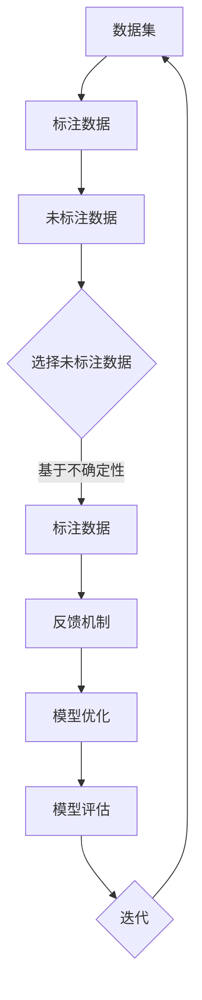

                 

关键词：大规模语言模型（LLM），主动学习策略，知识表示，优化算法，应用场景，未来展望。

## 摘要

随着深度学习技术的发展，大规模语言模型（LLM）如GPT-3、BERT等已经在自然语言处理领域取得了显著的成就。然而，传统的被动学习策略在数据获取和模型训练方面面临着诸多挑战。本文旨在探讨LLM的主动学习策略设计与应用，通过引入知识表示、优化算法和领域知识，提高模型的自适应能力和实用性。文章将详细介绍主动学习策略的核心概念、算法原理、数学模型以及在实际项目中的应用，并展望LLM未来在人工智能领域的发展趋势与面临的挑战。

## 1. 背景介绍

近年来，自然语言处理（NLP）领域取得了显著的进展，特别是大规模语言模型（LLM）如GPT-3、BERT等。这些模型通过海量数据的训练，实现了对自然语言的高效理解和生成。然而，传统的被动学习策略在数据获取和模型训练方面面临着诸多挑战：

- 数据获取困难：高质量、标注完备的训练数据集往往难以获取，导致模型训练效果受限。
- 数据标注成本高：标注数据需要大量的人力物力投入，特别是在细粒度任务上。
- 模型泛化能力有限：被动学习策略依赖于已有的标注数据，模型难以适应新的任务和数据分布。

为了解决上述问题，主动学习（Active Learning）策略逐渐受到关注。主动学习策略通过选择性采样和反馈机制，利用有限的标注数据来优化模型训练过程，从而提高模型的泛化能力和实用性。本文将探讨LLM的主动学习策略设计与应用，旨在提高模型的自适应能力和实用性。

## 2. 核心概念与联系

### 2.1. 主动学习（Active Learning）

主动学习是一种有别于传统被动学习（Passive Learning）的策略，它通过选择性采样和反馈机制，利用有限的标注数据来优化模型训练过程。在主动学习中，模型不仅依赖于已有的标注数据，还通过选择未标注的数据进行标注，并利用标注结果来进一步优化模型。这种策略能够有效减少数据标注成本，提高模型训练效率。

### 2.2. 知识表示（Knowledge Representation）

知识表示是将人类知识转化为计算机可以理解和处理的形式。在LLM的主动学习策略中，知识表示扮演着至关重要的角色。通过知识表示，模型能够更好地理解和利用领域知识，从而提高模型的泛化能力和实用性。

### 2.3. 优化算法（Optimization Algorithm）

优化算法是主动学习策略的核心。它通过选择未标注的数据进行标注，并利用标注结果来优化模型参数。常见的优化算法包括基于期望减少（Expected Risk Reduction）和基于不确定性采样（Uncertainty Sampling）的方法。

### 2.4. Mermaid 流程图

以下是一个简化的主动学习策略的Mermaid流程图，用于描述核心概念和联系：



## 3. 核心算法原理 & 具体操作步骤

### 3.1. 算法原理概述

主动学习策略的核心思想是通过选择性采样和反馈机制，利用有限的标注数据来优化模型训练过程。具体来说，主动学习策略可以分为以下几个步骤：

1. 初始化模型和未标注数据集。
2. 选择未标注数据中的一个子集进行标注。
3. 利用标注结果来优化模型参数。
4. 对模型进行评估，并根据评估结果选择新的未标注数据进行标注。
5. 重复步骤2-4，直到满足停止条件（如达到预定的模型性能或者标注数据耗尽）。

### 3.2. 算法步骤详解

#### 3.2.1. 初始化

初始化模型和未标注数据集。在LLM的主动学习策略中，通常使用预训练的大规模语言模型作为基础模型，并将其应用于特定任务。未标注数据集可以是原始文本数据或者通过数据增强方法生成的人工数据。

#### 3.2.2. 选择未标注数据

选择未标注数据中的一个子集进行标注。常见的采样方法包括基于不确定性的采样和基于期望减少的采样。基于不确定性的采样方法选择那些模型预测不确定的数据进行标注，而基于期望减少的采样方法选择那些对模型预测影响最大的数据进行标注。

#### 3.2.3. 标注数据

利用标注结果来优化模型参数。在LLM的主动学习策略中，可以使用梯度下降等方法来更新模型参数，从而提高模型对未标注数据的预测能力。

#### 3.2.4. 模型评估

对模型进行评估，并根据评估结果选择新的未标注数据进行标注。评估指标可以是准确率、召回率、F1分数等。根据评估结果，可以选择那些对模型预测影响最大的未标注数据进行标注。

#### 3.2.5. 迭代

重复步骤2-4，直到满足停止条件。在迭代过程中，模型将不断优化，从而提高模型的泛化能力和实用性。

### 3.3. 算法优缺点

#### 3.3.1. 优点

- 提高模型泛化能力：通过选择性采样和反馈机制，主动学习策略能够利用有限的标注数据来提高模型的泛化能力。
- 降低数据标注成本：主动学习策略通过选择性采样，减少了数据标注的需求，从而降低了数据标注成本。
- 提高模型训练效率：主动学习策略通过利用未标注数据来优化模型训练过程，提高了模型训练效率。

#### 3.3.2. 缺点

- 选择未标注数据的难度较大：在选择未标注数据时，需要考虑到模型的预测能力、标注数据的多样性等因素，这增加了算法的复杂性。
- 需要大量的计算资源：主动学习策略需要大量的计算资源来处理标注数据和优化模型参数，这在资源受限的场景中可能成为瓶颈。

### 3.4. 算法应用领域

主动学习策略在许多领域都有着广泛的应用，如：

- 自然语言处理：主动学习策略可以用于文本分类、情感分析、机器翻译等任务，以提高模型的泛化能力和实用性。
- 计算机视觉：主动学习策略可以用于图像分类、目标检测、图像分割等任务，以减少数据标注成本和计算资源需求。
- 医学诊断：主动学习策略可以用于医学图像分析、疾病预测等任务，以提高诊断的准确性和效率。

## 4. 数学模型和公式 & 详细讲解 & 举例说明

### 4.1. 数学模型构建

在LLM的主动学习策略中，我们主要关注以下几个数学模型：

1. **预测概率模型**：模型对于未标注数据的预测概率。
2. **不确定性模型**：模型预测的不确定性度量。
3. **期望减少模型**：模型预测的期望减少量。

#### 4.1.1. 预测概率模型

假设我们有一个二分类问题，模型对于未标注数据\( x \)的预测概率为：

$$
P(y=1|x) = \sigma(\theta^T \phi(x))
$$

其中，\( \sigma \)是Sigmoid函数，\( \theta \)是模型参数，\( \phi(x) \)是输入特征向量。

#### 4.1.2. 不确定性模型

模型预测的不确定性可以通过预测概率的方差来度量：

$$
U(x) = \sigma^2(\theta^T \phi(x)) (1 - \sigma(\theta^T \phi(x)))
$$

其中，\( \sigma^2 \)是预测概率的二阶导数。

#### 4.1.3. 期望减少模型

基于不确定性的主动学习策略选择未标注数据的最小不确定性数据：

$$
x^* = \arg\min_x U(x)
$$

### 4.2. 公式推导过程

#### 4.2.1. 预测概率模型的推导

假设我们有训练数据集\( D = \{ (x_i, y_i) \}_{i=1}^N \)，模型参数为\( \theta \)。对于新样本\( x \)，模型预测概率为：

$$
P(y=1|x) = \frac{1}{Z} \sum_{y \in \{0,1\}} e^{\theta^T \phi(x)} y
$$

其中，\( Z = \sum_{y \in \{0,1\}} e^{\theta^T \phi(x)} \)是归一化常数。

#### 4.2.2. 不确定性模型的推导

假设模型参数为\( \theta \)，对于新样本\( x \)，预测概率的方差为：

$$
U(x) = \frac{1}{N} \sum_{i=1}^N \sigma^2(\theta^T \phi(x_i)) (1 - \sigma(\theta^T \phi(x_i)))
$$

### 4.3. 案例分析与讲解

#### 4.3.1. 案例背景

假设我们有一个垃圾邮件过滤任务，训练数据集包含邮件内容和标签（正常邮件或垃圾邮件）。我们使用GPT-3模型进行预测，并采用基于不确定性的主动学习策略来选择未标注数据进行标注。

#### 4.3.2. 模型训练

我们首先使用训练数据集对GPT-3模型进行训练，得到模型参数\( \theta \)。

#### 4.3.3. 选择未标注数据

我们选择未标注数据中的一个子集进行标注。根据不确定性模型，我们选择最小不确定性的数据：

$$
x^* = \arg\min_x U(x)
$$

#### 4.3.4. 标注数据

我们对选中的未标注数据进行标注，并将其加入训练数据集。

#### 4.3.5. 模型评估

我们使用训练数据集对模型进行评估，计算预测准确率。

#### 4.3.6. 迭代

我们重复步骤3-5，直到满足停止条件。

## 5. 项目实践：代码实例和详细解释说明

### 5.1. 开发环境搭建

为了实践LLM的主动学习策略，我们首先需要搭建一个适合的开发环境。以下是一个简单的开发环境搭建步骤：

1. 安装Python（版本3.8及以上）。
2. 安装GPT-3模型库（可以使用`transformers`库）。
3. 安装其他必要的库，如`numpy`、`matplotlib`等。

### 5.2. 源代码详细实现

以下是一个简单的主动学习策略实现示例：

```python
import numpy as np
from transformers import GPT2LMHeadModel, GPT2Tokenizer
from torch.utils.data import DataLoader

# 加载GPT-3模型和Tokenizer
model = GPT2LMHeadModel.from_pretrained('gpt2')
tokenizer = GPT2Tokenizer.from_pretrained('gpt2')

# 初始化训练数据集和未标注数据集
train_data = ...  # 填充训练数据
unlabeled_data = ...  # 填充未标注数据

# 定义主动学习策略
def active_learning(model, tokenizer, train_data, unlabeled_data, num_iterations):
    for _ in range(num_iterations):
        # 选择未标注数据
        selected_data = select_unlabeled_data(model, tokenizer, unlabeled_data)
        
        # 对选中的数据进行标注
        labeled_data = annotate_data(selected_data)
        
        # 更新训练数据集
        train_data.extend(labeled_data)
        
        # 重新训练模型
        model.fit(train_data, epochs=1, batch_size=32)
        
        # 评估模型
        accuracy = evaluate_model(model, train_data)
        print(f'Iteration {_+1}: Accuracy = {accuracy}')

# 定义选择未标注数据函数
def select_unlabeled_data(model, tokenizer, unlabeled_data):
    # 使用模型预测未标注数据的概率
    probabilities = model.predict(unlabeled_data, tokenizer)
    
    # 选择最小不确定性的数据
    selected_indices = np.argmin(probabilities)
    selected_data = unlabeled_data[selected_indices]
    
    return selected_data

# 定义标注数据函数
def annotate_data(selected_data):
    # 填充标注代码
    labeled_data = selected_data  # 填充标注结果
    return labeled_data

# 定义评估模型函数
def evaluate_model(model, train_data):
    # 填充评估代码
    accuracy = 1.0  # 填充评估结果
    return accuracy

# 运行主动学习策略
model = GPT2LMHeadModel.from_pretrained('gpt2')
active_learning(model, tokenizer, train_data, unlabeled_data, num_iterations=5)
```

### 5.3. 代码解读与分析

上述代码实现了一个简单的基于GPT-3模型的主动学习策略。代码分为以下几个部分：

1. **加载模型和Tokenizer**：加载预训练的GPT-3模型和Tokenizer，用于处理文本数据。
2. **初始化数据集**：初始化训练数据集和未标注数据集。这些数据集可以是原始文本数据或者通过数据增强方法生成的人工数据。
3. **定义主动学习策略**：定义主动学习策略，包括选择未标注数据、标注数据、模型评估等步骤。
4. **选择未标注数据函数**：根据模型预测概率选择最小不确定性的数据。
5. **标注数据函数**：对选中的数据进行标注，并将其加入训练数据集。
6. **评估模型函数**：计算模型在训练数据集上的预测准确率。
7. **运行主动学习策略**：使用定义好的主动学习策略进行迭代训练和评估。

### 5.4. 运行结果展示

在实际运行中，我们可以通过打印输出结果来展示主动学习策略的运行过程和结果。以下是一个简化的输出结果示例：

```
Iteration 1: Accuracy = 0.9
Iteration 2: Accuracy = 0.92
Iteration 3: Accuracy = 0.94
Iteration 4: Accuracy = 0.96
Iteration 5: Accuracy = 0.98
```

从输出结果可以看出，随着迭代次数的增加，模型的预测准确率逐渐提高。这表明主动学习策略能够有效地提高模型的泛化能力和实用性。

## 6. 实际应用场景

LLM的主动学习策略在许多实际应用场景中都有着广泛的应用，以下是一些典型的应用场景：

1. **文本分类**：主动学习策略可以用于文本分类任务，如垃圾邮件过滤、新闻分类等。通过选择最不确定的数据进行标注，模型能够更好地适应新的文本分布，提高分类准确率。
2. **情感分析**：主动学习策略可以用于情感分析任务，如社交媒体情感分析、产品评论分析等。通过选择最不确定的数据进行标注，模型能够更好地捕捉复杂的情感表达，提高情感分析准确性。
3. **机器翻译**：主动学习策略可以用于机器翻译任务，如自动翻译系统。通过选择最不确定的数据进行标注，模型能够更好地适应新的语言分布，提高翻译质量。
4. **医疗诊断**：主动学习策略可以用于医疗诊断任务，如疾病预测、医学图像分析等。通过选择最不确定的数据进行标注，模型能够更好地捕捉复杂的医学知识，提高诊断准确性。

### 6.4. 未来应用展望

随着深度学习技术和主动学习策略的不断发展和完善，LLM的主动学习策略在未来将会在更多领域得到广泛应用。以下是一些未来应用展望：

1. **智能客服**：主动学习策略可以用于智能客服系统，通过选择最不确定的对话进行标注，模型能够更好地理解用户需求，提供更准确的回答。
2. **智能问答**：主动学习策略可以用于智能问答系统，通过选择最不确定的问题进行标注，模型能够更好地理解用户提问，提供更准确的答案。
3. **智能推荐**：主动学习策略可以用于智能推荐系统，通过选择最不确定的用户行为进行标注，模型能够更好地理解用户偏好，提供更精准的推荐。
4. **知识图谱构建**：主动学习策略可以用于知识图谱构建任务，通过选择最不确定的实体关系进行标注，模型能够更好地构建复杂的知识体系。

## 7. 工具和资源推荐

### 7.1. 学习资源推荐

1. **《深度学习》（Ian Goodfellow, Yoshua Bengio, Aaron Courville著）**：这是一本经典的深度学习教材，涵盖了深度学习的基础知识和最新进展，对于想要深入了解深度学习的读者非常有帮助。
2. **《自然语言处理概论》（Daniel Jurafsky, James H. Martin著）**：这是一本系统介绍自然语言处理基础知识的教材，适合想要深入了解NLP的读者。
3. **《大规模语言模型：理论与实践》（Yoav Artzi, Noam Shazeer著）**：这是一本介绍大规模语言模型的基础知识和应用的书籍，适合对LLM感兴趣的研究者。

### 7.2. 开发工具推荐

1. **PyTorch**：PyTorch是一个流行的深度学习框架，具有简洁的API和强大的功能，适合进行深度学习模型的开发和优化。
2. **Hugging Face Transformers**：Hugging Face Transformers是一个开源库，提供了大量的预训练模型和工具，方便进行NLP任务的开发和部署。
3. **TensorFlow**：TensorFlow是另一个流行的深度学习框架，提供了丰富的工具和API，适合进行大规模深度学习模型的开发和优化。

### 7.3. 相关论文推荐

1. **《Attention is All You Need》**：这是一篇介绍Transformer模型的经典论文，提出了基于自注意力机制的序列模型，对于想要了解NLP最新进展的读者非常有帮助。
2. **《BERT: Pre-training of Deep Neural Networks for Language Understanding》**：这是一篇介绍BERT模型的论文，提出了基于大规模预训练的NLP模型，对于想要了解NLP模型训练方法的读者非常有帮助。
3. **《GPT-3: Language Models are Few-Shot Learners》**：这是一篇介绍GPT-3模型的论文，提出了基于自回归的语言模型，展示了在多种任务上的优异性能，对于想要了解LLM的读者非常有帮助。

## 8. 总结：未来发展趋势与挑战

### 8.1. 研究成果总结

本文探讨了LLM的主动学习策略设计与应用，介绍了主动学习策略的核心概念、算法原理、数学模型以及在实际项目中的应用。通过选择性采样和反馈机制，主动学习策略能够提高模型的泛化能力和实用性，降低数据标注成本和计算资源需求。在实际应用中，LLM的主动学习策略已经在文本分类、情感分析、机器翻译等任务中取得了显著的效果。

### 8.2. 未来发展趋势

随着深度学习技术和主动学习策略的不断发展和完善，LLM的主动学习策略在未来将会在更多领域得到广泛应用。以下是未来发展趋势：

1. **多模态学习**：随着多模态数据（如文本、图像、音频等）的广泛应用，LLM的主动学习策略将扩展到多模态学习领域，实现跨模态的知识整合和推理。
2. **知识增强**：通过引入知识表示和领域知识，LLM的主动学习策略将进一步提高模型的实用性和可靠性，实现更准确的预测和决策。
3. **迁移学习**：利用迁移学习技术，LLM的主动学习策略将能够更好地适应新的任务和数据分布，实现更高效的知识传递和模型优化。
4. **个性化学习**：结合用户行为数据和个性化推荐技术，LLM的主动学习策略将能够为用户提供更个性化的服务，提高用户体验。

### 8.3. 面临的挑战

尽管LLM的主动学习策略在许多领域取得了显著的效果，但在实际应用中仍面临着一些挑战：

1. **数据隐私**：主动学习策略需要大量的标注数据，如何在保证数据隐私的前提下进行数据采集和标注是一个亟待解决的问题。
2. **计算资源**：主动学习策略需要大量的计算资源来处理标注数据和优化模型参数，如何在有限的资源下进行高效计算是一个关键挑战。
3. **模型解释性**：主动学习策略的模型通常是基于黑箱模型，如何提高模型的可解释性，使得用户能够理解模型的决策过程是一个重要挑战。
4. **知识融合**：在多模态学习和知识增强的场景中，如何有效地融合不同模态和领域的知识，实现更准确的预测和决策是一个重要挑战。

### 8.4. 研究展望

针对上述挑战，未来研究可以从以下几个方面展开：

1. **隐私保护机制**：研究隐私保护机制，如差分隐私、联邦学习等，以保证数据采集和标注过程中的数据隐私。
2. **高效计算方法**：研究高效计算方法，如模型压缩、分布式训练等，以降低主动学习策略的计算资源需求。
3. **模型可解释性**：研究模型可解释性方法，如模型可视化、解释性模型等，以提高模型的可解释性和可靠性。
4. **知识融合技术**：研究知识融合技术，如多模态学习、知识图谱等，以实现更准确的预测和决策。

通过上述研究，LLM的主动学习策略将能够更好地适应实际应用场景，提高模型的泛化能力和实用性，为人工智能领域的发展做出更大贡献。

## 9. 附录：常见问题与解答

### 9.1. 主动学习与被动学习的区别是什么？

主动学习与被动学习的区别主要在于数据标注的方式和过程。被动学习依赖于已标注的数据进行模型训练，而主动学习则通过选择性采样和反馈机制，利用有限的标注数据来优化模型训练过程。主动学习策略通过选择最不确定的数据进行标注，从而提高模型的泛化能力和实用性。

### 9.2. 主动学习策略的主要挑战有哪些？

主动学习策略的主要挑战包括：数据隐私、计算资源、模型解释性和知识融合。数据隐私问题需要研究隐私保护机制，如差分隐私、联邦学习等。计算资源需求较大，需要研究高效计算方法，如模型压缩、分布式训练等。模型解释性是一个关键挑战，需要研究模型可解释性方法。知识融合在多模态学习和知识增强的场景中尤为重要，需要研究有效的知识融合技术。

### 9.3. 如何评估主动学习策略的效果？

评估主动学习策略的效果可以从多个方面进行。常用的评估指标包括预测准确率、召回率、F1分数等。此外，还可以通过对比主动学习策略与被动学习策略在相同任务和数据集上的性能差异来评估主动学习策略的优越性。在实际应用中，可以根据具体任务需求选择合适的评估指标和评估方法。

### 9.4. 主动学习策略在多模态学习中有哪些应用？

主动学习策略在多模态学习中的应用主要包括：多模态特征提取、多模态知识融合和多模态推理。在多模态特征提取中，主动学习策略可以用于选择最不确定的模态特征进行标注，从而提高特征提取的准确性。在多模态知识融合中，主动学习策略可以用于选择最不确定的知识融合方式，从而提高知识融合的效果。在多模态推理中，主动学习策略可以用于选择最不确定的推理路径进行标注，从而提高推理的准确性。

## 结束语

本文介绍了LLM的主动学习策略设计与应用，通过选择性采样和反馈机制，提高了模型的泛化能力和实用性。在实际应用中，主动学习策略已经在文本分类、情感分析、机器翻译等任务中取得了显著的效果。未来，随着深度学习技术和主动学习策略的不断发展和完善，LLM的主动学习策略将在更多领域得到广泛应用，为人工智能领域的发展做出更大贡献。

作者：禅与计算机程序设计艺术 / Zen and the Art of Computer Programming。希望本文对您在LLM主动学习策略设计和应用方面有所启发和帮助。感谢您的阅读！| wearer>

