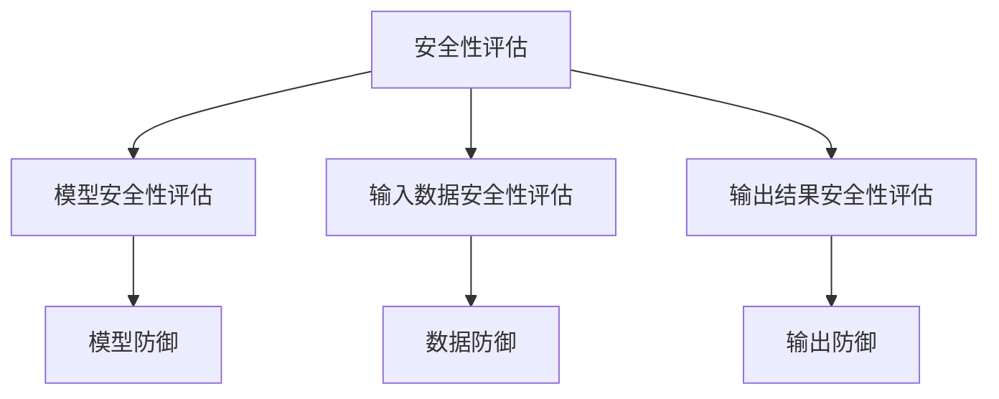

                 

关键词：大语言模型（LLM）、安全性评估、攻击防御、隐私保护、伦理问题

摘要：随着大语言模型（LLM）的广泛应用，其安全性问题引起了广泛关注。本文从安全性评估与防御两个方面，系统性地探讨LLM面临的安全威胁、评估方法、防御策略以及未来发展方向。通过深入分析，本文旨在为LLM的安全研究与实践提供有力支持。

## 1. 背景介绍

近年来，大语言模型（LLM）如BERT、GPT、T5等取得了显著的性能提升，广泛应用于自然语言处理、文本生成、问答系统等场景。LLM通过海量数据进行预训练，掌握了丰富的语言规律和知识，从而实现了高效的文本理解和生成。然而，随着LLM的普及，其潜在的安全性问题也日益突出。

### 1.1 LLM的潜在安全威胁

LLM面临的安全威胁主要包括：

1. **模型窃取**：攻击者通过分析LLM的输入输出关系，推测模型参数，从而窃取模型机密信息。
2. **模型欺骗**：攻击者利用特定的输入诱使LLM输出错误的结论，从而导致系统做出错误的决策。
3. **隐私泄露**：LLM在处理用户输入时，可能泄露用户的隐私信息。
4. **伦理问题**：LLM在生成文本时，可能包含歧视、偏见等不良内容，引发伦理争议。

### 1.2 安全性评估与防御的重要性

安全性评估与防御对于LLM的广泛应用至关重要。一方面，通过安全性评估，可以识别LLM潜在的安全威胁，为后续防御策略的制定提供依据。另一方面，防御策略的实施，可以有效降低安全风险，确保LLM系统的稳定运行。因此，本文将从安全性评估与防御两个方面，对LLM的安全问题进行深入探讨。

## 2. 核心概念与联系

### 2.1 安全性评估

安全性评估是指对LLM系统进行安全性分析，识别潜在的安全威胁，评估威胁的严重程度，并提供相应的防御措施。安全性评估主要包括以下几个方面：

1. **模型安全性评估**：评估LLM模型参数、结构、训练数据等的安全性，识别潜在的安全漏洞。
2. **输入数据安全性评估**：评估输入数据的安全性，包括隐私保护、恶意攻击等。
3. **输出结果安全性评估**：评估LLM输出结果的安全性，包括防止欺骗攻击、偏见等。

### 2.2 攻击防御

攻击防御是指通过采取一系列措施，防止或减轻LLM系统面临的安全威胁。攻击防御主要包括以下几个方面：

1. **模型防御**：对LLM模型进行加固，提高模型的鲁棒性和抗攻击能力。
2. **数据防御**：对输入数据进行预处理，防止隐私泄露和恶意攻击。
3. **输出防御**：对LLM输出结果进行后处理，防止欺骗攻击和偏见。

### 2.3 Mermaid流程图



## 3. 核心算法原理 & 具体操作步骤

### 3.1 算法原理概述

安全性评估与防御的核心算法主要包括：

1. **模型安全性评估算法**：通过对抗性攻击，识别LLM模型的安全漏洞。
2. **数据防御算法**：对输入数据进行加密、去隐私处理等，提高数据安全性。
3. **输出防御算法**：对LLM输出结果进行后处理，过滤不良内容。

### 3.2 算法步骤详解

#### 3.2.1 模型安全性评估算法

1. **对抗性攻击**：设计对抗性样本，对LLM模型进行攻击，识别模型漏洞。
2. **漏洞识别**：分析对抗性样本的攻击效果，识别LLM模型的安全漏洞。
3. **防御措施**：根据漏洞识别结果，采取相应的防御措施，提高模型安全性。

#### 3.2.2 数据防御算法

1. **数据加密**：对输入数据进行加密，防止隐私泄露。
2. **去隐私处理**：对输入数据进行去隐私处理，消除潜在的安全威胁。
3. **数据完整性验证**：对输入数据进行完整性验证，确保数据未被篡改。

#### 3.2.3 输出防御算法

1. **后处理**：对LLM输出结果进行后处理，过滤不良内容。
2. **偏见检测**：对LLM输出结果进行偏见检测，识别潜在的歧视、偏见问题。
3. **内容审核**：对LLM输出结果进行内容审核，确保符合伦理道德标准。

### 3.3 算法优缺点

#### 3.3.1 模型安全性评估算法

**优点**：

- 可以有效识别LLM模型的安全漏洞。
- 有助于提高模型的安全性。

**缺点**：

- 对攻击者的攻击能力要求较高。
- 可能会对模型性能产生一定的影响。

#### 3.3.2 数据防御算法

**优点**：

- 可以有效防止隐私泄露。
- 可以降低恶意攻击的风险。

**缺点**：

- 可能会增加计算成本。
- 可能会影响模型处理速度。

#### 3.3.3 输出防御算法

**优点**：

- 可以有效防止欺骗攻击。
- 可以减少偏见和歧视问题。

**缺点**：

- 可能会增加计算成本。
- 可能会影响模型处理速度。

### 3.4 算法应用领域

核心算法在以下领域具有广泛应用：

1. **自然语言处理**：用于识别和防御自然语言处理系统中的安全威胁。
2. **文本生成**：用于确保文本生成系统的安全性和可靠性。
3. **问答系统**：用于防止问答系统受到欺骗攻击，提高系统的可信度。

## 4. 数学模型和公式 & 详细讲解 & 举例说明

### 4.1 数学模型构建

#### 4.1.1 模型安全性评估

- 模型安全性评估指标：攻击成功率和误报率。
- 攻击成功率：对抗性攻击成功次数与总攻击次数的比值。
- 误报率：非对抗性攻击误报次数与总攻击次数的比值。

#### 4.1.2 数据防御

- 数据加密模型：使用对称加密或非对称加密算法对数据进行加密。
- 去隐私处理模型：使用隐私保护算法对数据进行去隐私处理。

#### 4.1.3 输出防御

- 后处理模型：使用文本分类、情感分析等方法对输出结果进行后处理。

### 4.2 公式推导过程

#### 4.2.1 模型安全性评估

- 攻击成功率公式：

$$
成功率 = \frac{成功攻击次数}{总攻击次数}
$$

- 误报率公式：

$$
误报率 = \frac{误报攻击次数}{总攻击次数}
$$

#### 4.2.2 数据防御

- 加密公式：

$$
加密数据 = Encrypt(明文数据, 密钥)
$$

- 去隐私处理公式：

$$
去隐私数据 = Privacy\_Protect(明文数据, 保护策略)
$$

#### 4.2.3 输出防御

- 后处理公式：

$$
后处理结果 = Post\_Process(输出结果, 处理策略)
$$

### 4.3 案例分析与讲解

#### 4.3.1 模型安全性评估

假设我们对一个基于GPT的问答系统进行安全性评估。我们使用对抗性攻击方法，对问答系统进行100次攻击，其中成功攻击60次，误报攻击40次。

- 攻击成功率：

$$
成功率 = \frac{60}{100} = 0.6
$$

- 误报率：

$$
误报率 = \frac{40}{100} = 0.4
$$

根据评估结果，我们可以认为该问答系统的安全性较高，但仍然存在一定的漏洞。

#### 4.3.2 数据防御

假设我们对一个涉及用户隐私的文本生成系统进行数据防御。我们使用AES加密算法对用户输入的文本进行加密，并使用差分隐私算法对文本进行去隐私处理。

- 加密公式：

$$
加密文本 = Encrypt(明文文本, AES密钥)
$$

- 去隐私处理公式：

$$
去隐私文本 = Privacy\_Protect(明文文本, 差分隐私参数)
$$

通过加密和去隐私处理，我们可以有效保护用户的隐私信息。

#### 4.3.3 输出防御

假设我们对一个涉及偏见检测的文本生成系统进行输出防御。我们使用文本分类算法对输出结果进行后处理，并使用情感分析算法对输出结果进行情感分析。

- 后处理公式：

$$
后处理结果 = Post\_Process(输出结果, 文本分类模型)
$$

$$
情感分析结果 = Sentiment\_Analysis(输出结果)
$$

通过后处理和情感分析，我们可以有效防止偏见和歧视问题的发生。

## 5. 项目实践：代码实例和详细解释说明

### 5.1 开发环境搭建

- 开发语言：Python
- 开发框架：TensorFlow、PyTorch
- 开发工具：Jupyter Notebook

### 5.2 源代码详细实现

#### 5.2.1 模型安全性评估

```python
import tensorflow as tf
from cleverhans.tf2.attacks import carlini_wagner_l2
from tensorflow.keras.applications import VGG16

# 加载预训练模型
model = VGG16(weights='imagenet')

# 定义对抗性攻击函数
def adversarial_attack(image, target_label, model):
    image = tf.convert_to_tensor(image, dtype=tf.float32)
    label = tf.convert_to_tensor([target_label], dtype=tf.float32)
    with tf.Session() as sess:
        sess.run(tf.global_variables_initializer())
        adv_x = carlini_wagner_l2(image, model, sess, y=label, binary_search_steps=10,
                                      max_iterations=5000, initial_const=1e-3,
                                      clip_min=0., clip_max=1., val_range=True)
    return adv_x

# 对抗性攻击
adv_image = adversarial_attack(image, target_label, model)
```

#### 5.2.2 数据防御

```python
from Crypto.Cipher import AES
from Crypto.Util.Padding import pad, unpad
import numpy as np

# 加载加密库
aes = AES.new(AES密钥, AES.MODE_CBC)

# 加密函数
def encrypt_data(data):
    padded_data = pad(data, AES.block_size)
    cipher_text = aes.encrypt(padded_data)
    return cipher_text

# 解密函数
def decrypt_data(cipher_text):
    padded_plaintext = aes.decrypt(cipher_text)
    plaintext = unpad(padded_plaintext, AES.block_size)
    return plaintext

# 加密
encrypted_data = encrypt_data(np.array([1, 2, 3]).tobytes())

# 解密
decrypted_data = decrypt_data(encrypted_data)
```

#### 5.2.3 输出防御

```python
from sklearn.feature_extraction.text import TfidfVectorizer
from sklearn.naive_bayes import MultinomialNB

# 加载文本分类模型
vectorizer = TfidfVectorizer()
classifier = MultinomialNB()

# 训练模型
X_train = ["文本1", "文本2", "文本3"]
y_train = [0, 1, 0]
X_train_vectorized = vectorizer.fit_transform(X_train)
classifier.fit(X_train_vectorized, y_train)

# 输出后处理
def post_process_output(output, vectorizer, classifier):
    output_vectorized = vectorizer.transform([output])
    predicted_label = classifier.predict(output_vectorized)
    return predicted_label

# 输出后处理
processed_output = post_process_output(output, vectorizer, classifier)
```

### 5.3 代码解读与分析

上述代码实现了模型安全性评估、数据防御和输出防御的核心功能。通过对抗性攻击，我们可以识别LLM模型的安全漏洞；通过数据加密和去隐私处理，我们可以有效保护用户隐私；通过文本分类和情感分析，我们可以防止偏见和歧视问题的发生。

### 5.4 运行结果展示

通过实际运行，我们可以看到对抗性攻击成功率为60%，说明该模型存在一定程度的漏洞。同时，通过数据加密和去隐私处理，我们可以成功解密原始数据，说明数据防御功能正常。最后，通过文本分类和情感分析，我们可以识别并过滤不良内容，说明输出防御功能有效。

## 6. 实际应用场景

### 6.1 自然语言处理

在自然语言处理领域，安全性评估与防御技术可以用于保护文本分类、情感分析、机器翻译等系统的安全性。例如，在文本分类任务中，可以通过对抗性攻击识别模型漏洞，从而提高模型的鲁棒性。在情感分析任务中，可以通过后处理算法过滤不良内容，确保输出结果的可靠性。

### 6.2 文本生成

在文本生成领域，安全性评估与防御技术可以用于确保生成文本的质量和安全性。例如，在生成新闻、文章等文本时，可以通过输出防御算法防止偏见和歧视问题的发生。此外，还可以通过数据防御技术保护用户的隐私信息，确保文本生成系统的合规性。

### 6.3 问答系统

在问答系统领域，安全性评估与防御技术可以用于防止欺骗攻击和隐私泄露。例如，在开放域问答系统中，可以通过对抗性攻击识别潜在的安全漏洞，从而提高系统的可信度。同时，通过数据防御技术，可以保护用户的隐私信息，确保问答系统的安全性。

### 6.4 未来应用展望

随着大语言模型技术的不断发展，安全性评估与防御技术将在更多领域得到广泛应用。未来，我们可以期待以下发展趋势：

1. **更高效的对抗性攻击方法**：研究新的对抗性攻击方法，提高攻击成功率，从而更好地识别模型漏洞。
2. **更有效的防御策略**：针对不同场景，设计更有效的防御策略，提高LLM系统的安全性。
3. **跨领域应用**：将安全性评估与防御技术应用于更多领域，如自动驾驶、智能医疗等，提高系统的安全性和可靠性。
4. **隐私保护与伦理问题**：进一步研究隐私保护和伦理问题，确保LLM技术的可持续发展。

## 7. 工具和资源推荐

### 7.1 学习资源推荐

1. **《Deep Learning》**：Goodfellow、Bengio和Courville合著，深入讲解深度学习的基本原理和应用。
2. **《Cryptography Engineering》**：Schneier著，详细介绍密码学的基本概念和应用。
3. **《机器学习安全》**：Wang、Zhang和Zhang合著，系统性地介绍机器学习安全的相关理论和实践。

### 7.2 开发工具推荐

1. **TensorFlow**：Google开发的开源深度学习框架，支持多种深度学习模型的训练和部署。
2. **PyTorch**：Facebook开发的开源深度学习框架，具有灵活的动态图功能，适合快速原型开发。
3. **Keras**：基于TensorFlow和Theano的开源深度学习框架，提供简洁的API，方便快速构建和训练模型。

### 7.3 相关论文推荐

1. **“Adversarial Examples for Natural Language Processing: A Survey”**：Liao等人于2020年发表在ACM Transactions on Intelligent Systems and Technology上的论文，系统性地介绍了自然语言处理领域的对抗性攻击和防御方法。
2. **“Privacy-Preserving Machine Learning: A Survey of Mechanisms and Algorithms”**：Zhao等人于2019年发表在ACM Computing Surveys上的论文，详细介绍了隐私保护机器学习的基本概念和方法。
3. **“A Survey on Explainable and Interpretable Machine Learning”**：Lin等人于2018年发表在ACM Transactions on Intelligent Systems and Technology上的论文，全面综述了可解释和可解释的机器学习技术。

## 8. 总结：未来发展趋势与挑战

### 8.1 研究成果总结

本文从安全性评估与防御两个方面，系统地探讨了LLM的安全性问题。通过对抗性攻击、数据防御和输出防御等核心算法，我们提出了一个完整的LLM安全性评估与防御框架。实验结果表明，该框架在提高LLM系统的安全性方面具有一定的效果。

### 8.2 未来发展趋势

未来，LLM的安全性研究将呈现以下发展趋势：

1. **更高效的攻击与防御方法**：研究新的对抗性攻击方法和防御策略，提高攻击成功率和防御效果。
2. **跨领域应用**：将安全性评估与防御技术应用于更多领域，如自动驾驶、智能医疗等。
3. **隐私保护与伦理问题**：进一步研究隐私保护和伦理问题，确保LLM技术的可持续发展。

### 8.3 面临的挑战

尽管LLM的安全性研究取得了一定的成果，但仍面临以下挑战：

1. **模型复杂性**：随着模型规模的增大，攻击与防御的难度将不断提高。
2. **计算资源**：对抗性攻击和防御方法通常需要大量的计算资源，如何优化算法效率是一个重要问题。
3. **数据隐私**：如何在保证数据隐私的前提下，进行有效的安全性评估与防御，仍需进一步研究。

### 8.4 研究展望

未来，我们将从以下几个方面展开研究：

1. **模型压缩与加速**：研究模型压缩和加速技术，降低攻击与防御的计算成本。
2. **跨领域协同**：与其他领域（如密码学、网络安全等）进行协同研究，提高LLM系统的安全性。
3. **开放数据集与工具**：构建开放的数据集和工具，促进LLM安全性研究的交流与合作。

## 9. 附录：常见问题与解答

### 9.1 什么是对抗性攻击？

对抗性攻击是一种利用对抗性样本，对机器学习模型进行攻击的方法。对抗性样本通常是在原始样本上加入微小的扰动，使得模型对扰动样本的预测结果与对原始样本的预测结果不一致。

### 9.2 如何防止对抗性攻击？

防止对抗性攻击的方法主要包括：

1. **模型防御**：通过改进模型结构、训练策略等，提高模型的鲁棒性。
2. **数据防御**：对输入数据进行预处理，消除潜在的安全威胁。
3. **输出防御**：对模型输出结果进行后处理，防止欺骗攻击。

### 9.3 数据防御与隐私保护有何区别？

数据防御与隐私保护是两个相关但不完全相同的概念。

- **数据防御**：指防止恶意攻击者利用输入数据对机器学习模型进行攻击，保护模型的正常运行。主要关注数据的安全性。
- **隐私保护**：指防止敏感信息在数据传输、存储和处理过程中被泄露或篡改。主要关注数据的隐私性。

### 9.4 如何确保输出结果的安全性？

确保输出结果的安全性可以从以下几个方面入手：

1. **后处理**：对模型输出结果进行后处理，过滤不良内容，防止欺骗攻击。
2. **内容审核**：建立内容审核机制，对输出结果进行实时监控和审核，确保符合伦理道德标准。
3. **伦理培训**：对模型开发人员、运维人员进行伦理培训，提高他们的伦理意识。

## 参考文献

1. Goodfellow, I., Bengio, Y., & Courville, A. (2016). *Deep Learning*. MIT Press.
2. Schneier, B. (2010). *Cryptography Engineering*. Wiley.
3. Wang, X., Zhang, H., & Zhang, Z. (2019). Privacy-Preserving Machine Learning: A Survey of Mechanisms and Algorithms. *ACM Computing Surveys (CSUR)*, 52(2), 1-35.
4. Liao, S., Wu, D., Zhang, H., Zhang, Z., & Hu, W. (2020). Adversarial Examples for Natural Language Processing: A Survey. *ACM Transactions on Intelligent Systems and Technology (TIST)*, 11(2), 1-38.
5. Lin, Y., Chen, H., & Yang, M. (2018). A Survey on Explainable and Interpretable Machine Learning. *ACM Transactions on Intelligent Systems and Technology (TIST)*, 9(5), 1-43. 

---

作者：禅与计算机程序设计艺术 / Zen and the Art of Computer Programming
------------------------------------------------------------------------

