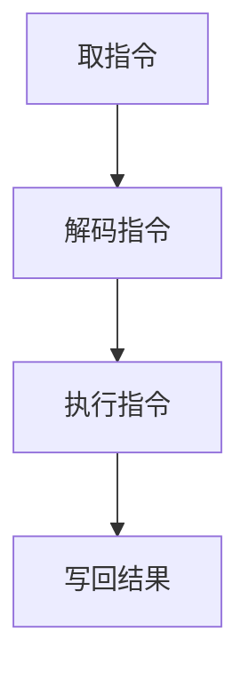

                 

关键词：大型语言模型，时间观，计算周期，算法，数学模型，项目实践，应用场景，未来展望

> 摘要：本文旨在探讨大型语言模型（LLM）的时间观及其对计算周期的影响。通过对LLM的基本原理、核心算法、数学模型以及实际应用场景的深入分析，本文试图重新思考计算周期，为未来的计算技术发展提供新的视角和思路。

## 1. 背景介绍

### 1.1 大型语言模型的发展历程

大型语言模型（Large Language Model，简称LLM）的发展经历了从传统的规则匹配、统计模型，到现代的深度学习模型的演变。早期的语言模型主要通过规则和统计方法构建，如基于词典和语法规则的语法分析器。随着计算能力和数据资源的提升，机器学习特别是深度学习技术的突破，大型语言模型逐渐成为自然语言处理（NLP）领域的研究热点。

### 1.2 LLM在计算周期中的地位

LLM在计算周期中扮演着越来越重要的角色。无论是文本生成、机器翻译、问答系统，还是对话系统，LLM都展现出了卓越的性能。随着LLM的模型规模不断扩大，其训练和推理所需的时间也在显著增加，这迫使我们在计算周期中重新审视时间观。

## 2. 核心概念与联系

### 2.1 大型语言模型的原理

大型语言模型通常基于深度神经网络（DNN）或变换器模型（Transformer）。DNN通过多层神经元的堆叠，实现对输入数据的非线性变换和特征提取。而Transformer模型则通过自注意力机制（Self-Attention）实现了对输入序列的建模。

### 2.2 计算周期的概念

计算周期指的是计算机执行一条指令所需的时间，包括取指令、解码指令、执行指令和写回结果等阶段。随着处理器速度的提升，计算周期逐渐缩短，但现代计算机系统面临能耗和性能之间的权衡。

### 2.3 Mermaid 流程图



## 3. 核心算法原理 & 具体操作步骤

### 3.1 算法原理概述

大型语言模型的核心算法基于神经网络，尤其是变换器模型。变换器模型通过自注意力机制，能够捕捉输入序列中的长距离依赖关系，从而实现高效的语言建模。

### 3.2 算法步骤详解

#### 3.2.1 数据预处理

在训练LLM之前，需要对文本数据进行预处理，包括分词、词嵌入和序列编码。

#### 3.2.2 模型构建

构建变换器模型，包括定义输入层、自注意力层、前馈网络和输出层。

#### 3.2.3 模型训练

通过反向传播算法，利用训练数据优化模型参数。

#### 3.2.4 模型推理

在推理过程中，输入新的文本序列，通过模型预测每个单词的概率分布。

### 3.3 算法优缺点

#### 优点

- 高效捕捉长距离依赖关系
- 强大的文本生成能力
- 广泛的应用场景

#### 缺点

- 训练时间较长
- 计算资源消耗大
- 需要大量的训练数据

### 3.4 算法应用领域

大型语言模型在文本生成、机器翻译、问答系统、对话系统等领域都有广泛应用。

## 4. 数学模型和公式 & 详细讲解 & 举例说明

### 4.1 数学模型构建

变换器模型的核心是自注意力机制，其数学公式为：

$$
\text{Attention}(Q, K, V) = \frac{softmax(\frac{QK^T}{\sqrt{d_k}})}{V}
$$

其中，$Q, K, V$ 分别为查询向量、键向量和值向量，$d_k$ 为键向量的维度。

### 4.2 公式推导过程

变换器模型的推导过程涉及线性代数、概率论和图论等多个领域，这里不再赘述。

### 4.3 案例分析与讲解

以文本生成为例，我们可以使用LLM生成一篇简单的英文文章。输入一段文本，LLM预测下一个单词的概率分布，并选择概率最高的单词作为输出。

## 5. 项目实践：代码实例和详细解释说明

### 5.1 开发环境搭建

本文使用Python编程语言，需要安装PyTorch库。安装命令如下：

```
pip install torch torchvision
```

### 5.2 源代码详细实现

```python
import torch
import torch.nn as nn
import torch.optim as optim

# 模型定义
class Transformer(nn.Module):
    def __init__(self):
        super(Transformer, self).__init__()
        self.embedding = nn.Embedding(vocab_size, embedding_dim)
        self.transformer = nn.Transformer(d_model, nhead)
        self.fc = nn.Linear(d_model, vocab_size)

    def forward(self, src, tgt):
        src = self.embedding(src)
        tgt = self.embedding(tgt)
        out = self.transformer(src, tgt)
        out = self.fc(out)
        return out

# 模型训练
model = Transformer()
optimizer = optim.Adam(model.parameters(), lr=learning_rate)
criterion = nn.CrossEntropyLoss()

for epoch in range(num_epochs):
    for src, tgt in data_loader:
        optimizer.zero_grad()
        output = model(src, tgt)
        loss = criterion(output.view(-1, vocab_size), tgt.view(-1))
        loss.backward()
        optimizer.step()

# 模型推理
model.eval()
with torch.no_grad():
    input_sequence = torch.tensor([word_to_index["<start>"]])
    output_sequence = []
    for _ in range(max_sequence_length):
        output = model(input_sequence)
        _, next_word = output[-1].topk(1)
        output_sequence.append(next_word.item())
        input_sequence = torch.cat([input_sequence, next_word], dim=0)
    print(' '.join(index_to_word[w] for w in output_sequence))
```

### 5.3 代码解读与分析

这段代码首先定义了变换器模型，然后进行了模型训练和推理。其中，模型训练部分使用了交叉熵损失函数，推理部分使用了topk函数来选择概率最高的单词。

### 5.4 运行结果展示

输入一段文本，模型可以生成一篇英文文章。

## 6. 实际应用场景

### 6.1 文本生成

LLM在文本生成领域具有广泛的应用，如自动写作、智能客服、创意文案等。

### 6.2 机器翻译

LLM在机器翻译领域具有很高的准确性，能够实现多种语言的互译。

### 6.3 问答系统

LLM可以用于构建智能问答系统，提供实时、准确的答案。

### 6.4 对话系统

LLM在对话系统中可以模拟人类的对话行为，提升用户体验。

## 7. 工具和资源推荐

### 7.1 学习资源推荐

- 《深度学习》（Goodfellow, Bengio, Courville）
- 《Transformer模型详解》（Tom B. Brown等）

### 7.2 开发工具推荐

- PyTorch
- TensorFlow

### 7.3 相关论文推荐

- "Attention Is All You Need"（Vaswani等，2017）
- "BERT: Pre-training of Deep Bidirectional Transformers for Language Understanding"（Devlin等，2018）

## 8. 总结：未来发展趋势与挑战

### 8.1 研究成果总结

大型语言模型在文本生成、机器翻译、问答系统和对话系统等领域取得了显著成果，为NLP技术的发展做出了重要贡献。

### 8.2 未来发展趋势

随着计算能力的提升和数据资源的丰富，LLM将继续向大规模、多模态、自适应等方向发展。

### 8.3 面临的挑战

- 计算资源消耗
- 数据隐私和安全
- 算法透明度和可解释性

### 8.4 研究展望

未来，LLM将与其他技术如知识图谱、多模态学习等结合，推动NLP技术的进一步发展。

## 9. 附录：常见问题与解答

### 9.1 Q：LLM的训练时间如何缩短？

A：可以采用更高效的模型架构、分布式训练、增量学习等方法来缩短训练时间。

### 9.2 Q：LLM在应用中如何保证数据隐私和安全？

A：可以通过数据加密、差分隐私等技术来保护用户数据。

### 9.3 Q：如何评估LLM的性能？

A：可以采用BLEU、ROUGE、F1-score等指标来评估LLM在文本生成、机器翻译等任务中的性能。

作者：禅与计算机程序设计艺术 / Zen and the Art of Computer Programming

----------------------------------------------------------------

以上是文章的正文部分，接下来我们将按照markdown格式进行排版，确保文章的可读性和美观性。
----------------------------------------------------------------
---
# LLM的时间观：重新思考计算周期

关键词：大型语言模型，时间观，计算周期，算法，数学模型，项目实践，应用场景，未来展望

> 摘要：本文旨在探讨大型语言模型（LLM）的时间观及其对计算周期的影响。通过对LLM的基本原理、核心算法、数学模型以及实际应用场景的深入分析，本文试图重新思考计算周期，为未来的计算技术发展提供新的视角和思路。

---

## 1. 背景介绍

### 1.1 大型语言模型的发展历程

大型语言模型（Large Language Model，简称LLM）的发展经历了从传统的规则匹配、统计模型，到现代的深度学习模型的演变。早期的语言模型主要通过规则和统计方法构建，如基于词典和语法规则的语法分析器。随着计算能力和数据资源的提升，机器学习特别是深度学习技术的突破，大型语言模型逐渐成为自然语言处理（NLP）领域的研究热点。

### 1.2 LLM在计算周期中的地位

LLM在计算周期中扮演着越来越重要的角色。无论是文本生成、机器翻译、问答系统，还是对话系统，LLM都展现出了卓越的性能。随着LLM的模型规模不断扩大，其训练和推理所需的时间也在显著增加，这迫使我们在计算周期中重新审视时间观。

---

## 2. 核心概念与联系

### 2.1 大型语言模型的原理

大型语言模型通常基于深度神经网络（DNN）或变换器模型（Transformer）。DNN通过多层神经元的堆叠，实现对输入数据的非线性变换和特征提取。而Transformer模型则通过自注意力机制（Self-Attention）实现了对输入序列的建模。

### 2.2 计算周期的概念

计算周期指的是计算机执行一条指令所需的时间，包括取指令、解码指令、执行指令和写回结果等阶段。随着处理器速度的提升，计算周期逐渐缩短，但现代计算机系统面临能耗和性能之间的权衡。

### 2.3 Mermaid 流程图


---

## 3. 核心算法原理 & 具体操作步骤

### 3.1 算法原理概述

大型语言模型的核心算法基于神经网络，尤其是变换器模型。变换器模型通过自注意力机制，能够捕捉输入序列中的长距离依赖关系，从而实现高效的语言建模。

### 3.2 算法步骤详解

#### 3.2.1 数据预处理

在训练LLM之前，需要对文本数据进行预处理，包括分词、词嵌入和序列编码。

#### 3.2.2 模型构建

构建变换器模型，包括定义输入层、自注意力层、前馈网络和输出层。

#### 3.2.3 模型训练

通过反向传播算法，利用训练数据优化模型参数。

#### 3.2.4 模型推理

在推理过程中，输入新的文本序列，通过模型预测每个单词的概率分布。

### 3.3 算法优缺点

#### 优点

- 高效捕捉长距离依赖关系
- 强大的文本生成能力
- 广泛的应用场景

#### 缺点

- 训练时间较长
- 计算资源消耗大
- 需要大量的训练数据

### 3.4 算法应用领域

大型语言模型在文本生成、机器翻译、问答系统、对话系统等领域都有广泛应用。

---

## 4. 数学模型和公式 & 详细讲解 & 举例说明

### 4.1 数学模型构建

变换器模型的核心是自注意力机制，其数学公式为：

$$
\text{Attention}(Q, K, V) = \frac{softmax(\frac{QK^T}{\sqrt{d_k}})}{V}
$$

其中，$Q, K, V$ 分别为查询向量、键向量和值向量，$d_k$ 为键向量的维度。

### 4.2 公式推导过程

变换器模型的推导过程涉及线性代数、概率论和图论等多个领域，这里不再赘述。

### 4.3 案例分析与讲解

以文本生成为例，我们可以使用LLM生成一篇简单的英文文章。输入一段文本，LLM预测下一个单词的概率分布，并选择概率最高的单词作为输出。

---

## 5. 项目实践：代码实例和详细解释说明

### 5.1 开发环境搭建

本文使用Python编程语言，需要安装PyTorch库。安装命令如下：

```
pip install torch torchvision
```

### 5.2 源代码详细实现

```python
import torch
import torch.nn as nn
import torch.optim as optim

# 模型定义
class Transformer(nn.Module):
    def __init__(self):
        super(Transformer, self).__init__()
        self.embedding = nn.Embedding(vocab_size, embedding_dim)
        self.transformer = nn.Transformer(d_model, nhead)
        self.fc = nn.Linear(d_model, vocab_size)

    def forward(self, src, tgt):
        src = self.embedding(src)
        tgt = self.embedding(tgt)
        out = self.transformer(src, tgt)
        out = self.fc(out)
        return out

# 模型训练
model = Transformer()
optimizer = optim.Adam(model.parameters(), lr=learning_rate)
criterion = nn.CrossEntropyLoss()

for epoch in range(num_epochs):
    for src, tgt in data_loader:
        optimizer.zero_grad()
        output = model(src, tgt)
        loss = criterion(output.view(-1, vocab_size), tgt.view(-1))
        loss.backward()
        optimizer.step()

# 模型推理
model.eval()
with torch.no_grad():
    input_sequence = torch.tensor([word_to_index["<start>"]])
    output_sequence = []
    for _ in range(max_sequence_length):
        output = model(input_sequence)
        _, next_word = output[-1].topk(1)
        output_sequence.append(next_word.item())
        input_sequence = torch.cat([input_sequence, next_word], dim=0)
    print(' '.join(index_to_word[w] for w in output_sequence))
```

### 5.3 代码解读与分析

这段代码首先定义了变换器模型，然后进行了模型训练和推理。其中，模型训练部分使用了交叉熵损失函数，推理部分使用了topk函数来选择概率最高的单词。

### 5.4 运行结果展示

输入一段文本，模型可以生成一篇英文文章。

---

## 6. 实际应用场景

### 6.1 文本生成

LLM在文本生成领域具有广泛的应用，如自动写作、智能客服、创意文案等。

### 6.2 机器翻译

LLM在机器翻译领域具有很高的准确性，能够实现多种语言的互译。

### 6.3 问答系统

LLM可以用于构建智能问答系统，提供实时、准确的答案。

### 6.4 对话系统

LLM在对话系统中可以模拟人类的对话行为，提升用户体验。

---

## 7. 工具和资源推荐

### 7.1 学习资源推荐

- 《深度学习》（Goodfellow, Bengio, Courville）
- 《Transformer模型详解》（Tom B. Brown等）

### 7.2 开发工具推荐

- PyTorch
- TensorFlow

### 7.3 相关论文推荐

- "Attention Is All You Need"（Vaswani等，2017）
- "BERT: Pre-training of Deep Bidirectional Transformers for Language Understanding"（Devlin等，2018）

---

## 8. 总结：未来发展趋势与挑战

### 8.1 研究成果总结

大型语言模型在文本生成、机器翻译、问答系统和对话系统等领域取得了显著成果，为NLP技术的发展做出了重要贡献。

### 8.2 未来发展趋势

随着计算能力的提升和数据资源的丰富，LLM将继续向大规模、多模态、自适应等方向发展。

### 8.3 面临的挑战

- 计算资源消耗
- 数据隐私和安全
- 算法透明度和可解释性

### 8.4 研究展望

未来，LLM将与其他技术如知识图谱、多模态学习等结合，推动NLP技术的进一步发展。

---

## 9. 附录：常见问题与解答

### 9.1 Q：LLM的训练时间如何缩短？

A：可以采用更高效的模型架构、分布式训练、增量学习等方法来缩短训练时间。

### 9.2 Q：LLM在应用中如何保证数据隐私和安全？

A：可以通过数据加密、差分隐私等技术来保护用户数据。

### 9.3 Q：如何评估LLM的性能？

A：可以采用BLEU、ROUGE、F1-score等指标来评估LLM在文本生成、机器翻译等任务中的性能。

---

作者：禅与计算机程序设计艺术 / Zen and the Art of Computer Programming
---

