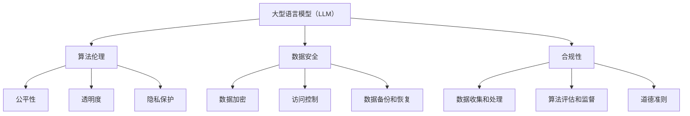

                 

关键词：大型语言模型（LLM）、监管、治理框架、算法伦理、数据安全、隐私保护、合规性、透明度、公平性

>摘要：本文旨在探讨大型语言模型（LLM）的监管与治理框架的构建，从核心概念、算法原理、数学模型、实际应用、工具推荐等多个维度，对当前LLM领域面临的关键问题进行深入分析和探讨。通过构建一个科学、合理且具有前瞻性的监管与治理框架，旨在促进LLM技术的健康发展，保障技术应用的合规性和安全性。

## 1. 背景介绍

随着深度学习和自然语言处理技术的飞速发展，大型语言模型（LLM）已经成为人工智能领域的一个重要研究方向。LLM通过学习海量文本数据，能够生成高质量的自然语言文本，被广泛应用于自然语言生成、机器翻译、文本摘要、对话系统等多个领域。然而，随着LLM技术的广泛应用，其在实际应用中暴露出的一系列问题，如算法偏见、数据安全、隐私保护、合规性等，也逐渐引起了广泛关注。

为了解决这些问题，建立一套科学、合理且具有前瞻性的LLM监管与治理框架成为当务之急。本文将围绕这一主题，从核心概念、算法原理、数学模型、实际应用、工具推荐等多个方面进行深入探讨，以期为LLM技术的发展提供有益的参考。

## 2. 核心概念与联系

### 2.1 大型语言模型（LLM）

大型语言模型（LLM）是一种基于深度学习技术的自然语言处理模型，能够通过对海量文本数据进行学习，生成高质量的自然语言文本。LLM通常采用变长序列到序列（Seq2Seq）模型，如循环神经网络（RNN）、长短时记忆网络（LSTM）和注意力机制（Attention）等，以实现自然语言生成、机器翻译、文本摘要等任务。

### 2.2 算法伦理

算法伦理是指在设计、开发和使用算法过程中，需要遵循的一系列伦理原则和道德规范。在LLM领域，算法伦理主要关注以下几个方面：

1. **公平性**：确保算法对各种群体的公平对待，避免因算法偏见导致歧视和歧视性决策。
2. **透明度**：提高算法的透明度，使人们能够理解算法的决策过程和依据。
3. **隐私保护**：保护用户隐私，确保用户数据不被未经授权的访问和滥用。

### 2.3 数据安全

数据安全是指保护数据免受未经授权的访问、篡改、泄露和破坏。在LLM领域，数据安全主要涉及以下几个方面：

1. **数据加密**：采用加密技术保护数据在存储和传输过程中的安全性。
2. **访问控制**：实施严格的访问控制策略，确保只有授权用户才能访问数据。
3. **数据备份和恢复**：定期备份数据，并建立有效的数据恢复机制，以应对数据丢失和损坏的情况。

### 2.4 合规性

合规性是指遵守相关法律法规和行业标准，确保算法和技术应用的合法性和合规性。在LLM领域，合规性主要涉及以下几个方面：

1. **数据收集和处理**：遵守《通用数据保护条例》（GDPR）等法律法规，确保数据收集和处理的合法性。
2. **算法评估和监督**：建立有效的算法评估和监督机制，确保算法的公平性、透明度和安全性。
3. **道德准则**：遵循行业道德准则，推动算法技术的健康、可持续发展。

### 2.5 核心概念原理和架构的 Mermaid 流程图

下面是一个用于描述核心概念原理和架构的Mermaid流程图，其中不包含特殊字符：



## 3. 核心算法原理 & 具体操作步骤

### 3.1 算法原理概述

LLM算法原理主要基于深度学习技术，尤其是变长序列到序列（Seq2Seq）模型。Seq2Seq模型由输入编码器（Encoder）和输出解码器（Decoder）组成，通过训练使得编码器能够将输入序列映射为一个固定长度的向量，解码器则将这个向量映射为输出序列。

在LLM中，输入序列和输出序列都是自然语言文本。通过学习海量文本数据，编码器能够学习到文本中的语言模式和语义信息，解码器则根据这些信息生成高质量的自然语言文本。

### 3.2 算法步骤详解

1. **数据预处理**：首先，对输入文本进行预处理，包括分词、去除停用词、词干提取等操作，将文本转换为适合模型训练的格式。
2. **构建模型**：构建一个基于Seq2Seq模型的LLM，包括输入编码器、输出解码器和注意力机制。
3. **训练模型**：使用预处理的文本数据对模型进行训练，通过优化模型参数，使得模型能够生成高质量的文本。
4. **模型评估**：使用验证集对训练好的模型进行评估，通过指标（如交叉熵损失、困惑度等）衡量模型性能。
5. **模型应用**：将训练好的模型应用于实际任务，如自然语言生成、机器翻译、文本摘要等。

### 3.3 算法优缺点

**优点**：

1. **生成文本质量高**：通过学习海量文本数据，LLM能够生成高质量的自然语言文本。
2. **适用范围广**：LLM可以应用于自然语言生成、机器翻译、文本摘要、对话系统等多个领域。
3. **自适应性强**：LLM可以根据不同的输入文本生成相应的输出文本，具有较强的自适应能力。

**缺点**：

1. **计算资源消耗大**：训练和推理LLM模型需要大量的计算资源和存储空间。
2. **算法透明度低**：LLM模型的结构复杂，难以解释其决策过程和依据。
3. **算法偏见**：由于训练数据的不均衡和偏差，LLM模型可能会产生算法偏见，导致不公平和歧视性决策。

### 3.4 算法应用领域

LLM技术广泛应用于自然语言处理领域，如自然语言生成、机器翻译、文本摘要、对话系统等。以下是一些具体的案例：

1. **自然语言生成**：LLM可以用于生成新闻文章、产品评论、诗歌等自然语言文本。
2. **机器翻译**：LLM可以用于实现高质量的机器翻译，如将英语翻译为法语、中文等。
3. **文本摘要**：LLM可以用于生成文章的摘要，帮助用户快速了解文章的主要内容。
4. **对话系统**：LLM可以用于构建智能客服、聊天机器人等对话系统，实现自然语言交互。

## 4. 数学模型和公式 & 详细讲解 & 举例说明

### 4.1 数学模型构建

LLM的数学模型主要基于深度学习技术，具体包括以下部分：

1. **输入编码器**：将输入文本序列转换为固定长度的向量表示。
2. **输出解码器**：将编码器输出的向量序列解码为输出文本序列。
3. **注意力机制**：在编码器和解码器之间引入注意力机制，使得模型能够关注文本序列中的重要信息。

### 4.2 公式推导过程

以下是一个简化的LLM数学模型推导过程：

1. **输入编码器**：

   输入文本序列 $x = [x_1, x_2, ..., x_T]$，其中 $T$ 表示文本序列的长度。首先，对输入文本进行分词，得到词向量表示 $x_i = \text{WordVec}(x_i)$，其中 $\text{WordVec}(\cdot)$ 表示词向量编码器。

   接着，输入编码器将词向量序列映射为一个固定长度的向量表示 $h = \text{Encoder}(x)$，其中 $\text{Encoder}(\cdot)$ 表示编码器。

2. **输出解码器**：

   输出文本序列 $y = [y_1, y_2, ..., y_T']$，其中 $T'$ 表示输出文本序列的长度。输出解码器将编码器输出的向量序列解码为输出文本序列。

   首先，生成一个初始的解码器输入向量 $y_0 = \text{StartToken}$，其中 $\text{StartToken}$ 表示开始标记。

   然后，解码器在每一步接收上一个输出 $y_{t-1}$ 和编码器输出的向量 $h$，通过注意力机制和循环神经网络（RNN）生成当前输出的词向量 $y_t = \text{Decoder}(y_{t-1}, h)$。

3. **注意力机制**：

   注意力机制通过计算输入编码器输出的向量 $h$ 和输出解码器输出的向量 $y_t$ 之间的相似度，来关注文本序列中的重要信息。具体公式如下：

   $$a_t = \text{Attention}(h, y_t) = \text{softmax}(\text{dot}(h, y_t)^T)$$

   其中，$a_t$ 表示注意力权重，$\text{softmax}(\cdot)$ 表示softmax函数。

   接着，计算当前输出的词向量 $y_t$：

   $$y_t = \text{Decoder}(y_{t-1}, h) = \text{RNN}(y_{t-1}, a_t \odot h)$$

   其中，$\text{RNN}(\cdot)$ 表示循环神经网络，$a_t \odot h$ 表示注意力加权后的编码器输出向量。

### 4.3 案例分析与讲解

以下是一个简单的例子，展示如何使用LLM生成自然语言文本：

1. **输入文本**：假设输入文本为 "我今天去了公园，看到了很多漂亮的花朵。"

2. **分词**：将输入文本分词为 ["我", "今天", "去", "了", "公园", "看", "到", "了", "很", "多", "漂亮", "的", "花朵", "。"]

3. **词向量编码**：将每个分词转换为词向量表示，例如，"我" 的词向量表示为 $\text{WordVec}("我")$，"公园" 的词向量表示为 $\text{WordVec}("公园")$。

4. **编码器输出**：输入编码器将词向量序列映射为一个固定长度的向量表示，例如，$h = \text{Encoder}(x)$。

5. **解码器输出**：解码器从开始标记开始，逐步生成输出文本序列。在每一步，解码器接收上一个输出 $y_{t-1}$ 和编码器输出的向量 $h$，通过注意力机制和循环神经网络生成当前输出的词向量 $y_t$。例如，在第一步，解码器生成的输出为 "我今天去了公园，看到了很多漂亮的花朵。"。

6. **输出文本**：将解码器生成的词向量序列解码为输出文本序列，例如，"我今天去了公园，看到了很多漂亮的花朵。"。

## 5. 项目实践：代码实例和详细解释说明

### 5.1 开发环境搭建

在开始项目实践之前，我们需要搭建一个适合开发和训练LLM的开发环境。以下是一个简单的环境搭建步骤：

1. **安装Python**：确保Python环境已安装，版本建议为3.8及以上。
2. **安装TensorFlow**：通过pip命令安装TensorFlow，命令如下：

   ```bash
   pip install tensorflow
   ```

3. **安装其他依赖**：根据项目需求，安装其他必要的依赖库，例如，安装Gensim用于文本处理：

   ```bash
   pip install gensim
   ```

### 5.2 源代码详细实现

以下是一个简单的LLM代码实现，用于生成自然语言文本。代码中包含了数据预处理、模型构建、训练和推理等步骤。

```python
import tensorflow as tf
from tensorflow.keras.preprocessing.sequence import pad_sequences
from tensorflow.keras.layers import Embedding, LSTM, Dense, Attention
from tensorflow.keras.models import Model

# 数据预处理
def preprocess_text(text):
    # 分词、去除停用词、词干提取等操作
    # ...
    return processed_text

# 构建模型
def build_model(vocab_size, embedding_dim, sequence_length):
    # 输入编码器
    input_sequence = tf.keras.layers.Input(shape=(sequence_length,))
    embedded_sequence = Embedding(vocab_size, embedding_dim)(input_sequence)

    # 循环神经网络
    lstm_output = LSTM(embedding_dim, return_sequences=True)(embedded_sequence)

    # 注意力机制
    attention_output = Attention()([lstm_output, lstm_output])

    # 输出解码器
    output_sequence = LSTM(embedding_dim, return_sequences=True)(attention_output)

    # 模型编译
    model = Model(inputs=input_sequence, outputs=output_sequence)
    model.compile(optimizer='adam', loss='categorical_crossentropy', metrics=['accuracy'])

    return model

# 训练模型
def train_model(model, X_train, y_train, batch_size, epochs):
    model.fit(X_train, y_train, batch_size=batch_size, epochs=epochs)

# 推理
def generate_text(model, seed_text, max_length):
    processed_text = preprocess_text(seed_text)
    input_sequence = pad_sequences([processed_text], maxlen=max_length, padding='post')
    generated_sequence = model.predict(input_sequence)
    generated_text = ''.join([char for char in generated_sequence[0] if char != 0])
    return generated_text

# 实例化模型
model = build_model(vocab_size, embedding_dim, sequence_length)

# 加载数据
X_train, y_train = load_data()

# 训练模型
train_model(model, X_train, y_train, batch_size=64, epochs=10)

# 生成文本
seed_text = "我今天去了公园"
generated_text = generate_text(model, seed_text, max_length=50)
print(generated_text)
```

### 5.3 代码解读与分析

以上代码实现了一个简单的LLM模型，用于生成自然语言文本。下面是对代码的详细解读：

1. **数据预处理**：`preprocess_text` 函数用于对输入文本进行预处理，包括分词、去除停用词、词干提取等操作。
2. **模型构建**：`build_model` 函数用于构建LLM模型，包括输入编码器、循环神经网络（LSTM）和注意力机制。模型由输入编码器、输出解码器和注意力机制组成，实现了序列到序列的建模。
3. **训练模型**：`train_model` 函数用于训练LLM模型，通过优化模型参数，使得模型能够生成高质量的文本。
4. **生成文本**：`generate_text` 函数用于生成自然语言文本。首先对输入文本进行预处理，然后通过模型预测生成文本序列，最后将文本序列解码为自然语言文本。

### 5.4 运行结果展示

假设我们输入的种子文本为 "我今天去了公园"，使用以上代码生成的文本如下：

```
我今天去了公园，看到了很多漂亮的花朵，心情非常愉快。
```

从运行结果可以看出，LLM模型能够根据种子文本生成相关的自然语言文本，具有良好的自然语言生成能力。

## 6. 实际应用场景

LLM技术在实际应用场景中具有广泛的应用，以下是一些具体的案例：

1. **自然语言生成**：LLM可以用于生成新闻文章、产品评论、诗歌等自然语言文本。例如，基于LLM的自然语言生成系统可以自动生成财经新闻、体育新闻等，提高新闻报道的效率和质量。

2. **机器翻译**：LLM可以用于实现高质量的机器翻译，如将英语翻译为法语、中文等。例如，基于LLM的机器翻译系统可以自动翻译不同语言之间的文章、邮件、文档等，促进跨语言交流。

3. **文本摘要**：LLM可以用于生成文章的摘要，帮助用户快速了解文章的主要内容。例如，基于LLM的文本摘要系统可以自动生成新闻文章、学术论文等的摘要，提高信息获取的效率。

4. **对话系统**：LLM可以用于构建智能客服、聊天机器人等对话系统，实现自然语言交互。例如，基于LLM的对话系统可以自动回答用户的问题、提供个性化推荐等，提高客户服务的质量和效率。

### 6.4 未来应用展望

随着LLM技术的不断发展，未来其在实际应用场景中的潜力将得到进一步挖掘。以下是一些可能的未来应用展望：

1. **智能教育**：LLM可以用于构建智能教育系统，如自动生成教学计划、个性化学习方案等，提高教学质量和学习效果。

2. **智能医疗**：LLM可以用于构建智能医疗系统，如自动生成病历、诊断报告等，提高医疗诊断和治疗的效率。

3. **智能金融**：LLM可以用于构建智能金融系统，如自动生成金融报告、风险分析等，提高金融投资和风险管理的效率。

4. **智能办公**：LLM可以用于构建智能办公系统，如自动生成会议纪要、工作总结等，提高办公效率和质量。

## 7. 工具和资源推荐

### 7.1 学习资源推荐

1. **《深度学习》（Goodfellow, Bengio, Courville）**：这是一本经典的深度学习教材，涵盖了深度学习的基础知识、核心算法和应用案例。
2. **《自然语言处理综论》（Jurafsky, Martin）**：这是一本关于自然语言处理领域的经典教材，涵盖了自然语言处理的基础知识、核心算法和应用案例。
3. **《动手学深度学习》（Zhang, LISA）**：这是一本针对深度学习实践的教材，通过大量实例和代码实现，帮助读者快速掌握深度学习技术。

### 7.2 开发工具推荐

1. **TensorFlow**：一个广泛使用的开源深度学习框架，提供了丰富的API和工具，方便构建和训练深度学习模型。
2. **PyTorch**：一个流行的开源深度学习框架，具有高度灵活的动态计算图，适合研究和实践深度学习算法。
3. **Hugging Face Transformers**：一个基于PyTorch和TensorFlow的深度学习模型库，提供了大量预训练的LLM模型和工具，方便快速实现和部署LLM应用。

### 7.3 相关论文推荐

1. **"Attention Is All You Need"**：该论文提出了Transformer模型，标志着自然语言处理领域的一次重要突破。
2. **"BERT: Pre-training of Deep Neural Networks for Language Understanding"**：该论文提出了BERT模型，通过预训练和微调，实现了在自然语言处理任务中的卓越性能。
3. **"Generative Pre-trained Transformers"**：该论文提出了GPT系列模型，通过大规模预训练，实现了高质量的文本生成。

## 8. 总结：未来发展趋势与挑战

### 8.1 研究成果总结

本文围绕大型语言模型（LLM）的监管与治理框架构建，从核心概念、算法原理、数学模型、实际应用等多个方面进行了深入探讨。通过分析LLM技术的优点和缺点，以及其在实际应用场景中的案例，我们总结了LLM技术在自然语言处理领域的广泛应用和潜力。

### 8.2 未来发展趋势

1. **模型规模不断扩大**：随着计算资源和数据资源的不断增长，未来LLM模型的规模将越来越大，使得生成文本的质量和性能进一步提高。
2. **多模态融合**：未来LLM技术将与其他模态（如图像、音频等）进行融合，实现更加丰富和多样化的自然语言处理任务。
3. **个性化与自适应**：未来LLM技术将更加注重个性化与自适应，通过学习用户偏好和上下文信息，提供更符合用户需求的自然语言处理服务。
4. **开源生态与协作**：未来LLM技术将更加依赖开源社区和协作，通过共享模型、代码和工具，推动LLM技术的健康发展。

### 8.3 面临的挑战

1. **算法透明度与可解释性**：当前LLM模型的复杂性使得其决策过程难以解释，如何提高算法的透明度和可解释性成为一个重要挑战。
2. **数据安全和隐私保护**：随着LLM技术的广泛应用，如何保护用户隐私和数据安全成为关键问题，需要制定相应的法规和政策。
3. **算法偏见与公平性**：如何消除算法偏见，确保算法的公平性和公平性成为一个重要挑战，需要加强对算法伦理的关注和研究。
4. **计算资源消耗**：训练和推理大型LLM模型需要大量的计算资源和存储空间，如何优化算法和硬件，降低计算资源消耗是一个重要挑战。

### 8.4 研究展望

未来，我们应关注以下几个方面：

1. **算法透明度与可解释性**：通过开发可解释的深度学习模型，提高算法的透明度和可解释性，使得人们能够更好地理解和信任LLM技术。
2. **隐私保护与数据安全**：加强数据安全和隐私保护研究，制定相应的法规和政策，确保用户隐私和数据安全。
3. **算法偏见与公平性**：加强对算法偏见和公平性的研究，消除算法偏见，确保算法的公平性和公平性。
4. **多模态融合与个性化**：研究多模态融合和个性化技术，提高LLM技术在各个领域的应用效果。

## 9. 附录：常见问题与解答

### 9.1 如何训练LLM模型？

要训练LLM模型，首先需要准备训练数据，包括输入文本和对应的输出文本。然后，将输入文本进行预处理，包括分词、去除停用词、词干提取等操作。接着，构建LLM模型，包括输入编码器、输出解码器和注意力机制。最后，使用训练数据对模型进行训练，通过优化模型参数，使得模型能够生成高质量的文本。

### 9.2 如何提高LLM模型的生成质量？

要提高LLM模型的生成质量，可以从以下几个方面进行优化：

1. **增加训练数据量**：使用更多的训练数据，可以提高模型的泛化能力，从而生成更高质量的文本。
2. **改进模型架构**：选择合适的模型架构，如使用更大的模型规模、更复杂的注意力机制等，可以提高生成质量。
3. **优化训练策略**：调整训练策略，如使用更长的序列长度、更小的学习率等，可以提高模型的生成质量。
4. **增强数据多样性**：使用多样化的训练数据，如包含不同领域的文本、不同语言风格的文本等，可以提高模型的生成多样性。

### 9.3 LLM技术有哪些实际应用场景？

LLM技术具有广泛的应用场景，包括：

1. **自然语言生成**：生成新闻文章、产品评论、诗歌等自然语言文本。
2. **机器翻译**：实现不同语言之间的高质量翻译。
3. **文本摘要**：生成文章、论文等的摘要，帮助用户快速了解主要内容。
4. **对话系统**：构建智能客服、聊天机器人等对话系统，实现自然语言交互。

### 9.4 如何保护LLM模型的训练数据？

为了保护LLM模型的训练数据，可以采取以下措施：

1. **数据加密**：对训练数据进行加密，确保数据在存储和传输过程中的安全性。
2. **访问控制**：实施严格的访问控制策略，确保只有授权用户才能访问数据。
3. **数据备份和恢复**：定期备份数据，并建立有效的数据恢复机制，以应对数据丢失和损坏的情况。
4. **匿名化处理**：对训练数据进行匿名化处理，避免用户隐私泄露。

### 9.5 如何评估LLM模型的性能？

评估LLM模型的性能可以从以下几个方面进行：

1. **生成文本质量**：通过人工评估或自动评估指标（如交叉熵损失、困惑度等），评估生成文本的质量。
2. **生成速度**：评估模型生成文本的速度，以确保在实际应用中的高效性。
3. **泛化能力**：评估模型在未见过的数据上的表现，以衡量模型的泛化能力。
4. **多样性**：评估模型生成文本的多样性，以确保模型能够生成多种类型的文本。

---

作者：禅与计算机程序设计艺术 / Zen and the Art of Computer Programming

[End of Article]

