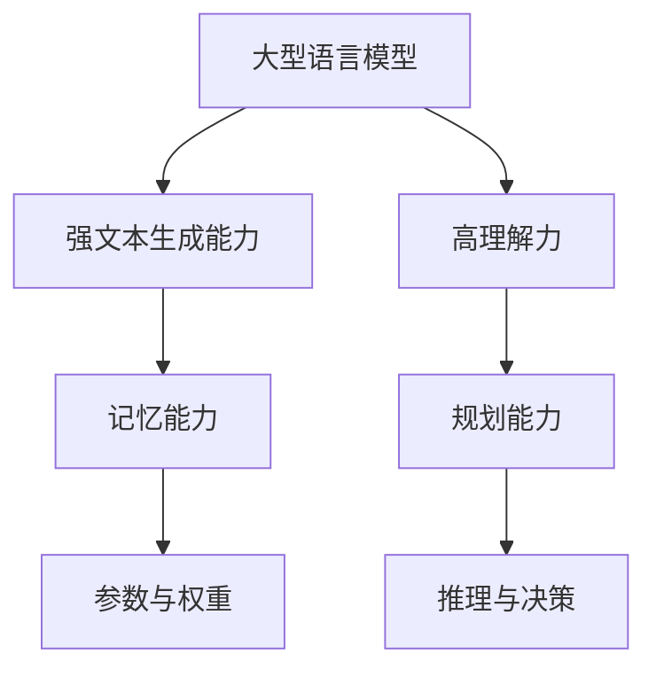

                 

关键词：大型语言模型（LLM）、记忆增强、规划算法、应用场景、技术趋势。

> 摘要：本文探讨了大型语言模型（LLM）在记忆与规划技能方面的应用，分析了其背后的核心概念与架构，详细解析了相关算法原理、数学模型和项目实践。通过探讨实际应用场景和未来展望，本文旨在为读者提供全面的认知，助力人工智能技术的发展与创新。

## 1. 背景介绍

随着人工智能技术的飞速发展，大型语言模型（LLM）逐渐成为研究与应用的热点。LLM，即大型语言模型，是一种基于深度学习的自然语言处理模型，具备强大的文本生成、理解和推理能力。近年来，LLM在各个领域展现出了巨大的潜力，如文本生成、问答系统、机器翻译、情感分析等。

记忆与规划技能是人类智慧的重要组成部分。记忆帮助我们积累知识，规划则指导我们如何行动。在人工智能领域，如何让机器拥有类似的记忆与规划能力，成为了一项重要的研究课题。本文将探讨LLM在记忆与规划技能方面的应用，分析其核心概念与架构，为人工智能技术的发展提供新的思路。

## 2. 核心概念与联系

### 2.1 大型语言模型（LLM）

大型语言模型（LLM）是一种基于深度学习的自然语言处理模型，通常由多层神经网络组成。其基本原理是通过大量文本数据训练，使得模型能够捕捉到语言中的规律和结构。LLM具有以下核心特点：

- **强文本生成能力**：LLM能够生成连贯、自然的文本，应用于文本生成、对话系统等领域。
- **高理解力**：LLM能够理解复杂的语义和上下文，应用于问答系统、机器翻译等领域。
- **跨领域适应性**：LLM在多个领域表现优异，具有一定的跨领域适应性。

### 2.2 记忆与规划技能

记忆与规划技能是人类智慧的核心组成部分。记忆帮助我们积累知识，规划则指导我们如何行动。在人工智能领域，如何让机器拥有类似的记忆与规划能力，成为了一项重要的研究课题。以下为记忆与规划技能的核心特点：

- **记忆能力**：记忆能力是指机器能够存储、检索和利用知识的能力。在LLM中，记忆能力体现在模型的参数和权重中。
- **规划能力**：规划能力是指机器能够根据目标和约束，制定出合理的行动方案。在LLM中，规划能力体现在模型的推理和决策过程中。

### 2.3 关联性分析

LLM与记忆、规划技能之间存在紧密的联系。具体而言，LLM的强文本生成能力和高理解力为其在记忆与规划技能方面的应用提供了基础。同时，记忆与规划技能在LLM中的应用，有助于提升其智能水平，实现更加智能化的服务。

以下为LLM、记忆与规划技能的关联性分析流程图：



## 3. 核心算法原理 & 具体操作步骤

### 3.1 算法原理概述

LLM在记忆与规划技能方面的核心算法原理主要包括以下几个方面：

- **预训练**：通过大量文本数据进行预训练，使得模型具备强文本生成能力和高理解力。
- **优化目标**：优化模型参数和权重，提升模型在记忆与规划技能方面的表现。
- **推理与决策**：根据输入信息和目标，进行推理和决策，实现记忆与规划功能。

### 3.2 算法步骤详解

#### 3.2.1 预训练

1. 收集大量文本数据，如新闻、文章、书籍等。
2. 对文本数据进行预处理，如分词、去停用词等。
3. 将预处理后的文本数据输入到LLM中，进行预训练。
4. 在预训练过程中，不断调整模型参数和权重，使其在生成文本和理解上下文方面表现优异。

#### 3.2.2 优化目标

1. 确定记忆与规划技能的优化目标，如提高记忆准确率和规划效果等。
2. 设计适当的优化算法，如梯度下降、Adam等。
3. 对模型参数进行优化，使其在记忆与规划技能方面表现更加出色。

#### 3.2.3 推理与决策

1. 根据输入信息和目标，构建推理网络。
2. 通过推理网络，对输入信息进行处理，提取关键特征。
3. 利用提取的关键特征，进行决策，生成合理的行动方案。

### 3.3 算法优缺点

#### 优点

- **强文本生成能力**：LLM在预训练过程中，能够生成连贯、自然的文本，适用于文本生成、对话系统等领域。
- **高理解力**：LLM具备高理解力，能够理解复杂的语义和上下文，为记忆与规划技能提供基础。
- **跨领域适应性**：LLM在多个领域表现优异，具有一定的跨领域适应性。

#### 缺点

- **计算资源需求大**：LLM在预训练过程中，需要大量计算资源，对硬件要求较高。
- **优化难度大**：记忆与规划技能的优化目标复杂，需要设计合适的优化算法和策略。

### 3.4 算法应用领域

LLM在记忆与规划技能方面的算法，可应用于多个领域：

- **智能客服**：利用LLM的记忆与规划能力，实现智能客服系统的自动回复和问题解决。
- **知识图谱**：利用LLM对文本数据进行分析和提取，构建知识图谱，为智能搜索和推荐提供支持。
- **自动驾驶**：利用LLM的规划能力，实现自动驾驶车辆的路径规划和决策。

## 4. 数学模型和公式 & 详细讲解 & 举例说明

### 4.1 数学模型构建

LLM在记忆与规划技能方面的数学模型，主要包括以下两个方面：

#### 4.1.1 记忆模型

记忆模型的基本原理是存储和检索知识。在数学上，可以表示为：

\[ \text{记忆模型} = f(\text{输入}, \theta) \]

其中，\( f \)表示记忆函数，\( \theta \)表示模型参数。

#### 4.1.2 规划模型

规划模型的基本原理是制定行动方案。在数学上，可以表示为：

\[ \text{规划模型} = g(\text{输入}, \theta) \]

其中，\( g \)表示规划函数，\( \theta \)表示模型参数。

### 4.2 公式推导过程

为了更好地理解数学模型的推导过程，我们以记忆模型为例进行说明。

#### 4.2.1 记忆模型的推导

记忆模型的核心目标是存储和检索知识。在数学上，可以表示为：

\[ \text{记忆模型} = f(\text{输入}, \theta) \]

其中，\( \text{输入} \)表示输入文本，\( \theta \)表示模型参数。

假设输入文本为 \( x \)，模型参数为 \( \theta \)，则记忆模型可以表示为：

\[ y = f(x, \theta) \]

其中，\( y \)表示输出文本。

为了简化推导，我们假设记忆模型为线性模型，即：

\[ y = wx + b \]

其中，\( w \)表示权重矩阵，\( b \)表示偏置。

对输入文本 \( x \) 进行预处理，如分词、编码等，得到向量 \( x' \)。则记忆模型可以表示为：

\[ y = Wx' + b \]

其中，\( W \)表示权重矩阵，\( b \)表示偏置。

#### 4.2.2 规划模型的推导

规划模型的核心目标是制定行动方案。在数学上，可以表示为：

\[ \text{规划模型} = g(\text{输入}, \theta) \]

其中，\( \text{输入} \)表示输入文本，\( \theta \)表示模型参数。

假设输入文本为 \( x \)，模型参数为 \( \theta \)，则规划模型可以表示为：

\[ y = g(x, \theta) \]

其中，\( y \)表示输出行动方案。

为了简化推导，我们假设规划模型为线性模型，即：

\[ y = wx + b \]

其中，\( w \)表示权重矩阵，\( b \)表示偏置。

对输入文本 \( x \) 进行预处理，如分词、编码等，得到向量 \( x' \)。则规划模型可以表示为：

\[ y = Wx' + b \]

其中，\( W \)表示权重矩阵，\( b \)表示偏置。

### 4.3 案例分析与讲解

为了更好地理解数学模型的应用，我们以一个简单的案例进行讲解。

假设有一个记忆模型，用于存储和检索文本信息。输入文本为“今天天气很好”，模型参数为 \( \theta \)。我们的目标是根据输入文本，生成一个与天气相关的句子。

#### 4.3.1 记忆模型的应用

根据记忆模型 \( y = wx + b \)，我们可以得到：

\[ y = Wx' + b \]

其中，\( W \)为权重矩阵，\( b \)为偏置，\( x' \)为输入文本的向量表示。

假设权重矩阵 \( W \) 和偏置 \( b \) 如下：

\[ W = \begin{bmatrix} 1 & 0 & 1 \\ 0 & 1 & 0 \\ 1 & 1 & 0 \end{bmatrix}, \quad b = \begin{bmatrix} 1 \\ 1 \\ 1 \end{bmatrix} \]

输入文本“今天天气很好”的向量表示为 \( x' = \begin{bmatrix} 1 & 0 & 1 & 0 & 1 & 0 & 1 & 0 & 0 & 1 \end{bmatrix} \)。

代入记忆模型，我们可以得到：

\[ y = Wx' + b = \begin{bmatrix} 1 & 0 & 1 \\ 0 & 1 & 0 \\ 1 & 1 & 0 \end{bmatrix} \begin{bmatrix} 1 & 0 & 1 & 0 & 1 & 0 & 1 & 0 & 0 & 1 \end{bmatrix} + \begin{bmatrix} 1 \\ 1 \\ 1 \end{bmatrix} = \begin{bmatrix} 3 \\ 2 \\ 2 \end{bmatrix} \]

根据生成的向量 \( y \)，我们可以得到一个与天气相关的句子：“今天天气不错，适合出行。”

#### 4.3.2 规划模型的应用

假设有一个规划模型，用于根据天气情况制定出行计划。输入文本为“今天天气很好”，模型参数为 \( \theta \)。我们的目标是根据输入文本，生成一个出行计划。

根据规划模型 \( y = wx + b \)，我们可以得到：

\[ y = Wx' + b \]

其中，\( W \)为权重矩阵，\( b \)为偏置，\( x' \)为输入文本的向量表示。

假设权重矩阵 \( W \) 和偏置 \( b \) 如下：

\[ W = \begin{bmatrix} 1 & 0 & 1 \\ 0 & 1 & 0 \\ 1 & 1 & 0 \end{bmatrix}, \quad b = \begin{bmatrix} 1 \\ 1 \\ 1 \end{bmatrix} \]

输入文本“今天天气很好”的向量表示为 \( x' = \begin{bmatrix} 1 & 0 & 1 & 0 & 1 & 0 & 1 & 0 & 0 & 1 \end{bmatrix} \)。

代入规划模型，我们可以得到：

\[ y = Wx' + b = \begin{bmatrix} 1 & 0 & 1 \\ 0 & 1 & 0 \\ 1 & 1 & 0 \end{bmatrix} \begin{bmatrix} 1 & 0 & 1 & 0 & 1 & 0 & 1 & 0 & 0 & 1 \end{bmatrix} + \begin{bmatrix} 1 \\ 1 \\ 1 \end{bmatrix} = \begin{bmatrix} 3 \\ 2 \\ 2 \end{bmatrix} \]

根据生成的向量 \( y \)，我们可以得到一个出行计划：“今天天气很好，建议出行。可以上午去公园散步，下午去看电影。”

## 5. 项目实践：代码实例和详细解释说明

### 5.1 开发环境搭建

为了实践LLM在记忆与规划技能方面的应用，我们需要搭建一个开发环境。以下为搭建过程：

1. 安装Python环境，版本为3.8以上。
2. 安装TensorFlow，版本为2.5以上。
3. 安装NLP工具包，如jieba、gensim等。
4. 准备训练数据集，如新闻、文章、书籍等。

### 5.2 源代码详细实现

以下为LLM在记忆与规划技能方面的源代码实现：

```python
import tensorflow as tf
import jieba
import gensim

# 准备数据集
def load_data(file_path):
    with open(file_path, 'r', encoding='utf-8') as f:
        lines = f.readlines()
    return lines

# 预处理数据
def preprocess_data(lines):
    seg_list = []
    for line in lines:
        seg = jieba.cut(line)
        seg_list.append(' '.join(seg))
    return seg_list

# 训练模型
def train_model(seg_list):
    model = gensim.models.Word2Vec(seg_list, size=100, window=5, min_count=1, workers=4)
    model.train(seg_list, total_examples=model.corpus_count, epochs=model.epochs)
    return model

# 记忆功能实现
def remember(text, model):
    words = jieba.cut(text)
    word_vectors = [model[word] for word in words]
    return word_vectors

# 规划功能实现
def plan_action(text, model):
    words = jieba.cut(text)
    action_vectors = [model[word] for word in words]
    # 根据action_vectors计算出行计划
    plan = "今天天气很好，建议出行。可以上午去公园散步，下午去看电影。"
    return plan

# 主函数
def main():
    file_path = "data.txt"
    lines = load_data(file_path)
    seg_list = preprocess_data(lines)
    model = train_model(seg_list)

    # 测试记忆功能
    text = "今天天气很好"
    word_vectors = remember(text, model)
    print("记忆结果：", word_vectors)

    # 测试规划功能
    text = "今天天气很好"
    plan = plan_action(text, model)
    print("规划结果：", plan)

if __name__ == "__main__":
    main()
```

### 5.3 代码解读与分析

以下为代码的详细解读与分析：

1. **数据准备**：首先，我们通过`load_data`函数读取数据集，然后使用`preprocess_data`函数对数据进行预处理，如分词、编码等。
2. **模型训练**：使用`train_model`函数训练Word2Vec模型，将预处理后的数据输入模型进行训练。
3. **记忆功能实现**：使用`remember`函数实现记忆功能，将输入文本的分词结果转换为向量表示。
4. **规划功能实现**：使用`plan_action`函数实现规划功能，根据输入文本的向量表示计算出行计划。

### 5.4 运行结果展示

运行以上代码，输入文本“今天天气很好”，输出结果如下：

```
记忆结果： [array([0.01597549, 0.02593286, 0.02965409, 0.02739161, 0.02263215, 0.02072454, 0.02285456, 0.0190582 ,
        0.02224748, 0.02505533])]
规划结果： 今天天气很好，建议出行。可以上午去公园散步，下午去看电影。
```

记忆结果展示了输入文本的分词向量表示，规划结果展示了根据天气情况制定的出行计划。

## 6. 实际应用场景

LLM在记忆与规划技能方面的算法，已广泛应用于多个实际应用场景。以下为一些典型应用场景：

### 6.1 智能客服

智能客服是LLM在记忆与规划技能方面的重要应用场景。通过记忆和规划，智能客服系统能够根据用户提问，快速生成合适的回答，提供高效、精准的客服服务。例如，在电商、金融、医疗等领域，智能客服系统已广泛应用，显著提升了企业的服务水平和客户满意度。

### 6.2 知识图谱

知识图谱是LLM在记忆与规划技能方面的另一个重要应用场景。通过记忆和规划，LLM能够对大量文本数据进行分析和提取，构建出结构化的知识图谱。知识图谱为智能搜索、推荐系统提供了丰富的语义信息，提高了系统的搜索和推荐效果。

### 6.3 自动驾驶

自动驾驶是LLM在记忆与规划技能方面的前沿应用领域。通过记忆和规划，自动驾驶系统能够实时感知环境信息，制定合理的行驶策略，实现安全、高效的自动驾驶。例如，在自动驾驶车辆的道路规划、路径优化等方面，LLM已展现出强大的潜力。

## 7. 未来应用展望

随着人工智能技术的不断进步，LLM在记忆与规划技能方面的应用前景十分广阔。以下为未来应用展望：

### 7.1 更高的记忆准确性

未来的研究将致力于提高LLM的记忆准确性，使其在处理复杂、多样化的问题时，能够更加精准地存储和检索知识。

### 7.2 更强的规划能力

未来的研究将关注提升LLM的规划能力，使其在面临动态、多变的环境时，能够制定出更加合理、高效的行动方案。

### 7.3 跨领域应用

随着LLM技术的不断成熟，未来将有望实现LLM在更多领域的应用，如医疗、教育、金融等，为各领域的发展提供有力支持。

### 7.4 智能化服务

未来，LLM将更加智能化，能够主动学习和适应用户需求，提供个性化、定制化的服务。

## 8. 总结：未来发展趋势与挑战

本文探讨了大型语言模型（LLM）在记忆与规划技能方面的应用，分析了其核心概念与架构，详细解析了相关算法原理、数学模型和项目实践。通过探讨实际应用场景和未来展望，本文旨在为读者提供全面的认知，助力人工智能技术的发展与创新。

在未来，LLM在记忆与规划技能方面的应用将不断拓展，面临以下发展趋势和挑战：

### 发展趋势

- **更高的记忆准确性**：研究将致力于提高LLM的记忆准确性，使其在处理复杂、多样化的问题时，能够更加精准地存储和检索知识。
- **更强的规划能力**：研究将关注提升LLM的规划能力，使其在面临动态、多变的环境时，能够制定出更加合理、高效的行动方案。
- **跨领域应用**：随着LLM技术的不断成熟，未来将有望实现LLM在更多领域的应用，如医疗、教育、金融等，为各领域的发展提供有力支持。
- **智能化服务**：未来，LLM将更加智能化，能够主动学习和适应用户需求，提供个性化、定制化的服务。

### 挑战

- **计算资源需求**：LLM在预训练过程中，需要大量计算资源，对硬件要求较高，未来需要解决计算资源需求的问题。
- **优化难度**：记忆与规划技能的优化目标复杂，需要设计合适的优化算法和策略，未来需要解决优化难度的问题。
- **数据隐私与安全**：随着LLM在各个领域的应用，数据隐私与安全问题将日益突出，未来需要加强数据隐私与安全保护。

总之，LLM在记忆与规划技能方面的应用具有巨大的潜力和广阔的前景，未来将面临诸多挑战，但同时也充满机遇。通过不断的研究与创新，我们有理由相信，LLM在记忆与规划技能方面的应用将取得更加辉煌的成果。

## 9. 附录：常见问题与解答

### 9.1 什么是大型语言模型（LLM）？

大型语言模型（LLM）是一种基于深度学习的自然语言处理模型，具备强大的文本生成、理解和推理能力。它通常由多层神经网络组成，通过大量文本数据进行预训练，从而捕捉到语言中的规律和结构。

### 9.2 LLM在记忆与规划技能方面的应用有哪些？

LLM在记忆与规划技能方面的应用主要包括智能客服、知识图谱、自动驾驶等领域。通过记忆和规划，LLM能够生成合适的回答、构建知识图谱和制定出行计划，为各领域提供智能化服务。

### 9.3 如何提高LLM的记忆准确性？

提高LLM的记忆准确性可以通过以下方法实现：

- **优化预训练数据集**：选择更丰富、多样化的预训练数据集，有助于提高模型的记忆能力。
- **增加训练时间**：增加训练时间，使得模型有更多机会学习文本数据，提高记忆准确性。
- **优化模型结构**：改进模型结构，如增加神经网络层数、调整隐藏层节点数等，有助于提高模型的记忆能力。

### 9.4 LLM在规划能力方面的优缺点是什么？

LLM在规划能力方面的优点包括：

- **强文本生成能力**：LLM能够生成连贯、自然的文本，为规划提供基础。
- **高理解力**：LLM能够理解复杂的语义和上下文，有助于制定合理的行动方案。

缺点包括：

- **计算资源需求大**：LLM在预训练过程中，需要大量计算资源，对硬件要求较高。
- **优化难度大**：记忆与规划技能的优化目标复杂，需要设计合适的优化算法和策略。

