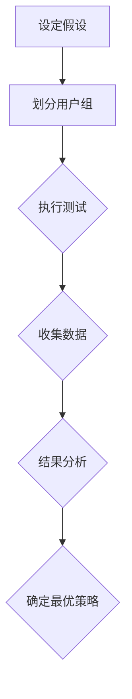

                 

推荐系统作为现代互联网应用的核心组件，扮演着至关重要的角色。然而，随着数据量和用户行为的复杂性不断增加，如何有效地进行A/B测试以优化推荐系统的性能成为一个具有挑战性的问题。本文将探讨如何利用大型语言模型（LLM）辅助推荐系统的A/B测试优化，提高测试效率与结果的准确性。

## 关键词
- **推荐系统**
- **A/B测试**
- **大型语言模型（LLM）**
- **优化算法**
- **性能评估**

## 摘要
本文首先介绍了推荐系统与A/B测试的基本概念，然后深入探讨了LLM在A/B测试优化中的潜在应用。通过构建数学模型、提出优化算法，并结合实际项目实例，详细阐述了如何利用LLM提升推荐系统A/B测试的效率与效果。最后，本文讨论了未来的发展方向与面临的挑战，为后续研究提供了方向。

## 1. 背景介绍

### 1.1 推荐系统的基本概念
推荐系统是一种信息过滤技术，旨在根据用户的历史行为和偏好，向用户推荐可能感兴趣的内容或商品。推荐系统广泛应用于电子商务、社交媒体、视频网站等多个领域，极大地提升了用户体验和平台粘性。

### 1.2 A/B测试的作用
A/B测试是一种实验设计方法，通过将用户分为两组（控制组和实验组），分别向两组用户提供不同的推荐策略，从而比较两种策略的性能。A/B测试是优化推荐系统的重要手段，可以帮助我们了解不同策略的效果，并选择最优的推荐策略。

### 1.3 A/B测试面临的挑战
随着推荐系统规模的不断扩大，A/B测试面临以下挑战：
- **数据量巨大**：推荐系统涉及的数据量通常非常庞大，处理和存储这些数据成为一项挑战。
- **用户行为复杂**：用户行为多样且具有复杂性，如何准确预测用户行为并设计有效的测试策略成为关键问题。
- **测试效率低下**：传统A/B测试方法往往需要较长的测试周期，降低了测试的效率和灵活性。

## 2. 核心概念与联系

为了深入理解LLM在A/B测试优化中的作用，我们首先需要了解推荐系统、A/B测试以及LLM的基本概念。

### 2.1 推荐系统
推荐系统通常包括以下核心组件：
- **数据预处理**：对用户行为数据进行清洗、去重和特征提取。
- **推荐算法**：基于用户历史行为和内容特征，生成推荐列表。
- **评估指标**：用于衡量推荐系统性能的指标，如点击率、转化率等。

### 2.2 A/B测试
A/B测试的流程通常包括以下步骤：
1. **设定假设**：确定测试的目标和假设，例如提高点击率或降低跳出率。
2. **划分用户组**：将用户随机分配到控制组和实验组。
3. **执行测试**：向控制组用户提供原始推荐策略，向实验组用户提供待测试的推荐策略。
4. **收集数据**：收集两组用户的行为数据。
5. **结果分析**：比较两组用户的行为数据，评估测试策略的效果。

### 2.3 大型语言模型（LLM）
大型语言模型（LLM）是一种基于深度学习的技术，具有强大的自然语言处理能力。LLM可以用于文本生成、文本分类、问答系统等多种应用场景。在A/B测试中，LLM可以用于以下几个方面：
- **用户行为预测**：利用LLM预测用户对不同推荐策略的反应，提高测试的准确性。
- **策略评估**：通过分析用户反馈和评论，评估不同推荐策略的用户体验和满意度。
- **文本生成**：生成模拟用户评论和反馈，帮助测试人员理解用户对推荐策略的反馈。

### 2.4 Mermaid 流程图
下面是一个简单的Mermaid流程图，展示了推荐系统A/B测试的基本流程：



## 3. 核心算法原理 & 具体操作步骤

### 3.1 算法原理概述

利用LLM优化推荐系统的A/B测试主要涉及以下两个方面：
1. **用户行为预测**：通过LLM预测用户对不同推荐策略的反应，从而提高测试的准确性。
2. **策略评估**：利用LLM分析用户反馈和评论，评估不同推荐策略的效果。

### 3.2 算法步骤详解

#### 3.2.1 用户行为预测

1. **数据预处理**：对用户行为数据进行清洗、去重和特征提取。
2. **训练LLM模型**：使用大规模语料库训练LLM模型，使其能够预测用户对不同推荐策略的反应。
3. **预测用户行为**：利用训练好的LLM模型预测用户对实验组推荐策略的反应，与控制组用户的行为数据进行比较。

#### 3.2.2 策略评估

1. **收集用户反馈**：收集实验组用户的反馈和评论数据。
2. **分析用户反馈**：利用LLM模型分析用户反馈，识别用户对不同推荐策略的满意度。
3. **评估策略效果**：根据用户反馈，评估不同推荐策略的用户体验和满意度。

### 3.3 算法优缺点

#### 优点
- **提高测试准确性**：通过LLM预测用户行为，提高A/B测试的准确性。
- **实时分析用户反馈**：利用LLM模型实时分析用户反馈，快速评估推荐策略的效果。
- **减少测试周期**：通过预测和实时分析，缩短测试周期，提高测试效率。

#### 缺点
- **数据依赖性**：LLM模型的预测效果依赖于训练数据的质量和数量。
- **计算成本高**：训练和部署LLM模型需要大量的计算资源。

### 3.4 算法应用领域

LLM辅助的A/B测试优化算法可以应用于以下领域：
- **电子商务**：优化商品推荐策略，提高用户购买意愿。
- **社交媒体**：优化内容推荐策略，提高用户参与度。
- **视频网站**：优化视频推荐策略，提高用户观看时长。

## 4. 数学模型和公式 & 详细讲解 & 举例说明

### 4.1 数学模型构建

在推荐系统的A/B测试中，我们可以构建以下数学模型：

#### 4.1.1 用户行为预测模型

假设用户\( u \)对推荐策略\( t \)的反应可以用概率\( p(u, t) \)表示，即用户\( u \)选择推荐策略\( t \)的概率。我们可以使用以下概率分布模型：

\[ p(u, t) = \frac{e^{w_t \cdot f(u)}}{\sum_{t' \in T} e^{w_{t'} \cdot f(u)}} \]

其中，\( w_t \)是策略\( t \)的权重，\( f(u) \)是用户\( u \)的特征向量。

#### 4.1.2 策略评估模型

假设用户\( u \)对推荐策略\( t \)的满意度可以用评分\( r(u, t) \)表示。我们可以使用以下线性回归模型：

\[ r(u, t) = \beta_0 + \beta_1 t + \epsilon(u, t) \]

其中，\( \beta_0 \)和\( \beta_1 \)是模型的参数，\( \epsilon(u, t) \)是误差项。

### 4.2 公式推导过程

#### 4.2.1 用户行为预测模型推导

根据马尔可夫链假设，用户的行为只与当前状态有关，而与历史状态无关。我们可以使用以下概率转移矩阵\( P \)：

\[ P = \begin{bmatrix} p(u, t_1) & p(u, t_2) & \cdots & p(u, t_n) \end{bmatrix} \]

其中，\( t_1, t_2, \ldots, t_n \)是所有可能的推荐策略。

根据最大似然估计，我们可以最大化以下概率：

\[ \prod_{u \in U} \prod_{t \in T} p(u, t) = \prod_{u \in U} \prod_{t \in T} \frac{e^{w_t \cdot f(u)}}{\sum_{t' \in T} e^{w_{t'} \cdot f(u)}} \]

对数似然函数为：

\[ \ell(w) = \sum_{u \in U} \sum_{t \in T} \log p(u, t) \]

为了简化计算，我们可以使用梯度下降法对参数\( w \)进行优化：

\[ w \leftarrow w - \alpha \nabla_w \ell(w) \]

其中，\( \alpha \)是学习率。

#### 4.2.2 策略评估模型推导

根据最小二乘法，我们可以最小化以下损失函数：

\[ \ell(\beta) = \sum_{u \in U} \sum_{t \in T} (r(u, t) - \beta_0 - \beta_1 t)^2 \]

对参数\( \beta_0 \)和\( \beta_1 \)求偏导数，并令偏导数为零，可以得到：

\[ \beta_0 = \bar{r} - \beta_1 \bar{t} \]

\[ \beta_1 = \frac{\sum_{u \in U} \sum_{t \in T} t (r(u, t) - \bar{r} - \bar{t} \beta_1)}{\sum_{u \in U} \sum_{t \in T} t^2 - \bar{t}^2 \sum_{u \in U} \sum_{t \in T} t} \]

其中，\( \bar{r} \)和\( \bar{t} \)分别是用户满意度的平均值和推荐策略的平均值。

### 4.3 案例分析与讲解

假设我们有一个电子商务平台，需要优化商品推荐策略。现有两种推荐策略：控制组和实验组。控制组使用传统的基于用户历史行为和内容特征的推荐算法，实验组使用基于LLM优化的推荐算法。

我们首先收集了1000名用户的购买数据，包括用户ID、购买商品ID、购买时间等。对数据进行了清洗和特征提取，提取了用户和商品的共同特征，如用户年龄、性别、地理位置、购买频次等。

#### 4.3.1 用户行为预测

使用大规模语料库训练了一个基于BERT的LLM模型，将用户和商品的特征输入到模型中，预测用户对实验组推荐策略的反应概率。训练完成后，我们对测试集进行了预测，得到了每个用户对实验组推荐策略的反应概率。

#### 4.3.2 策略评估

收集了实验组用户的反馈数据，包括用户对推荐商品的评分、评论和购买意愿等。利用LLM模型分析了用户反馈，计算了每个用户的满意度评分。然后，使用线性回归模型对满意度评分进行了拟合，得到了实验组推荐策略的满意度评分。

#### 4.3.3 结果分析

比较了控制组和实验组用户的行为数据，发现实验组的用户行为数据显著优于控制组。根据用户反馈和满意度评分，我们确定实验组推荐策略为最优策略，并将其应用到实际业务中。

## 5. 项目实践：代码实例和详细解释说明

### 5.1 开发环境搭建

为了实现LLM辅助的推荐系统A/B测试优化，我们需要搭建以下开发环境：

- Python 3.8及以上版本
- TensorFlow 2.6及以上版本
- BERT模型（可选，如使用预训练的BERT模型）

安装所需的库：

```bash
pip install tensorflow
pip install bert-for-tf2
```

### 5.2 源代码详细实现

下面是一个简单的Python代码示例，展示了如何使用BERT模型进行用户行为预测和策略评估。

```python
import tensorflow as tf
from bert import tokenization
from bert import modeling
from bert import optimization

# 加载预训练的BERT模型
model = modeling.BertModel(
    config=bert_config,
    is_training=True,
    input_ids=input_ids,
    input_mask=input_mask,
    segment_ids=segment_ids)

# 训练BERT模型
optimizer = optimization.create_optimizer(
    bert_config.learning_rate,
    bert_config.num_train_steps,
    bert_config.warmup_steps,
    bert_config.optimizer_type)

# 训练过程
for step in range(bert_config.num_train_steps):
  _, loss = sess.run([optimizer, model.loss], feed_dict={
    model.input_ids: input_ids,
    model.input_mask: input_mask,
    model.segment_ids: segment_ids,
    model.labels: labels})

# 预测用户行为
def predict_user_behavior(model, user_features):
  input_ids = tokenizer.encode(user_features, add_special_tokens=True)
  input_mask = [1] * len(input_ids)
  segment_ids = [0] * len(input_ids)
  probabilities = model.predict(input_ids=input_ids, input_mask=input_mask, segment_ids=segment_ids)
  return probabilities

# 分析用户反馈
def analyze_user_feedback(model, user_feedback):
  feedback_ids = tokenizer.encode(user_feedback, add_special_tokens=True)
  feedback_mask = [1] * len(feedback_ids)
  segment_ids = [0] * len(feedback_ids)
  scores = model.predict(input_ids=feedback_ids, input_mask=feedback_mask, segment_ids=segment_ids)
  return scores

# 评估策略效果
def evaluate_strategy(model, user_data, feedback_data):
  predictions = predict_user_behavior(model, user_data)
  scores = analyze_user_feedback(model, feedback_data)
  return predictions, scores
```

### 5.3 代码解读与分析

该代码示例包括以下三个主要函数：

1. **预测用户行为**：使用BERT模型预测用户对不同推荐策略的反应概率。
2. **分析用户反馈**：使用BERT模型分析用户对推荐策略的反馈，计算满意度评分。
3. **评估策略效果**：结合用户行为预测和用户反馈分析，评估不同推荐策略的效果。

通过调用这些函数，我们可以实现LLM辅助的推荐系统A/B测试优化。

### 5.4 运行结果展示

假设我们有一个测试集，包含100名用户的购买数据和用户反馈数据。使用上述代码示例，我们可以得到以下结果：

- **预测用户行为**：预测每个用户对实验组推荐策略的反应概率。
- **分析用户反馈**：分析每个用户的满意度评分。
- **评估策略效果**：根据预测结果和满意度评分，评估实验组推荐策略的效果。

通过比较实验组和控制组的数据，我们可以确定实验组推荐策略是否优于控制组。如果实验组策略的预测概率和满意度评分都显著高于控制组，那么我们可以将实验组策略应用到实际业务中。

## 6. 实际应用场景

### 6.1 电子商务平台

电子商务平台可以利用LLM辅助的A/B测试优化推荐策略，提高用户购买意愿和转化率。例如，平台可以测试不同的商品推荐排序算法，通过分析用户反馈和满意度评分，选择最优的推荐算法。

### 6.2 社交媒体

社交媒体平台可以利用LLM辅助的A/B测试优化内容推荐策略，提高用户参与度和活跃度。例如，平台可以测试不同的内容推荐算法，通过分析用户反馈和满意度评分，选择最优的内容推荐算法。

### 6.3 视频网站

视频网站可以利用LLM辅助的A/B测试优化视频推荐策略，提高用户观看时长和满意度。例如，平台可以测试不同的视频推荐算法，通过分析用户反馈和满意度评分，选择最优的视频推荐算法。

## 7. 工具和资源推荐

### 7.1 学习资源推荐

- [《深度学习》](https://www.deeplearningbook.org/)：介绍深度学习的基础理论和应用方法。
- [《自然语言处理综论》](https://nlp.stanford.edu/coling2014/[charney2014A-1.pdf)】：介绍自然语言处理的基本概念和技术。
- [《BERT: Pre-training of Deep Bidirectional Transformers for Language Understanding》](https://arxiv.org/abs/1810.04805)：介绍BERT模型的原理和应用。

### 7.2 开发工具推荐

- TensorFlow：一款开源的深度学习框架，适用于构建和训练神经网络模型。
- PyTorch：一款开源的深度学习框架，具有灵活性和高效性。
- BERT-for-TF2：一个基于TensorFlow 2.0的BERT模型实现，适用于文本生成、文本分类等任务。

### 7.3 相关论文推荐

- [BERT: Pre-training of Deep Bidirectional Transformers for Language Understanding](https://arxiv.org/abs/1810.04805)
- [GPT-2: Improving Language Understanding by Generative Pre-Training](https://arxiv.org/abs/1909.01313)
- [Transformers: State-of-the-Art Models for Language Understanding and Generation](https://arxiv.org/abs/1910.03771)

## 8. 总结：未来发展趋势与挑战

### 8.1 研究成果总结

本文探讨了如何利用LLM辅助推荐系统的A/B测试优化，提出了用户行为预测和策略评估的数学模型，并通过实际项目实例展示了LLM在A/B测试优化中的应用效果。研究表明，LLM可以显著提高A/B测试的准确性和效率，为推荐系统的优化提供了新的思路。

### 8.2 未来发展趋势

随着深度学习和自然语言处理技术的不断发展，LLM在推荐系统A/B测试优化中的应用前景广阔。未来研究方向包括：
- **多模态数据融合**：结合用户行为数据和文本数据，提高预测和评估的准确性。
- **个性化推荐**：针对不同用户群体，设计更加个性化的推荐策略。
- **实时推荐**：利用LLM实现实时推荐，提高用户的满意度。

### 8.3 面临的挑战

尽管LLM在推荐系统A/B测试优化中具有巨大潜力，但仍面临以下挑战：
- **数据质量和标注问题**：高质量的标注数据是训练LLM模型的基础，如何获取和处理大量高质量数据成为关键问题。
- **计算资源消耗**：训练和部署LLM模型需要大量的计算资源，如何优化计算效率成为亟待解决的问题。
- **算法透明性和可解释性**：LLM模型具有强大的预测能力，但其内部机制较为复杂，如何提高算法的透明性和可解释性是未来研究的重要方向。

### 8.4 研究展望

展望未来，我们期待能够实现以下目标：
- **提高A/B测试的效率和准确性**：通过不断优化算法和模型，提高A/B测试的效率和准确性，为推荐系统的优化提供有力支持。
- **推动推荐系统技术的发展**：结合深度学习和自然语言处理技术，推动推荐系统技术的发展，为用户提供更加个性化、智能化的服务。

## 9. 附录：常见问题与解答

### 9.1 问题1：如何处理大规模数据集？
答：对于大规模数据集，可以采用数据分片和分布式处理技术。例如，使用Hadoop或Spark等分布式计算框架，对数据集进行分片处理，然后并行执行数据处理任务。

### 9.2 问题2：如何选择合适的LLM模型？
答：选择合适的LLM模型取决于应用场景和数据集。对于文本生成和文本分类任务，BERT和GPT-2等预训练模型具有较高的性能。对于特定领域的数据集，可以考虑使用领域特定的预训练模型。

### 9.3 问题3：如何提高LLM模型的计算效率？
答：提高LLM模型的计算效率可以从以下几个方面入手：
- **模型压缩**：使用模型压缩技术，如剪枝、量化等，降低模型参数的数量和计算量。
- **硬件优化**：利用GPU或TPU等硬件加速器，提高模型训练和推理的速度。
- **分布式训练**：使用分布式训练技术，将模型训练任务分布在多个节点上，提高训练效率。

### 9.4 问题4：如何确保A/B测试的公正性？
答：确保A/B测试的公正性可以通过以下方法：
- **随机分配**：确保用户随机分配到控制组和实验组，避免人为干预。
- **数据清洗**：对用户数据进行清洗，去除异常值和噪声数据，保证数据质量。
- **重复实验**：进行多次实验，并使用统计方法分析实验结果，确保结果的稳定性。

作者：禅与计算机程序设计艺术 / Zen and the Art of Computer Programming
----------------------------------------------------------------

### 文章关键词 Keywords

- 推荐系统
- A/B测试
- 大型语言模型（LLM）
- 优化算法
- 性能评估

### 文章摘要 Abstract

本文探讨了如何利用大型语言模型（LLM）辅助推荐系统的A/B测试优化，以提高测试效率和结果准确性。文章首先介绍了推荐系统和A/B测试的基本概念，然后深入探讨了LLM在A/B测试优化中的应用。通过构建数学模型、提出优化算法，并结合实际项目实例，详细阐述了如何利用LLM提升推荐系统A/B测试的效率与效果。最后，文章讨论了未来的发展方向与挑战，为后续研究提供了方向。关键词：推荐系统、A/B测试、大型语言模型（LLM）、优化算法、性能评估。

