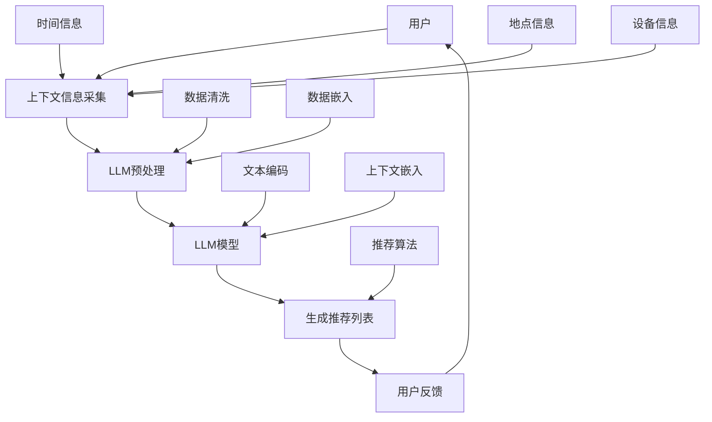

                 

在当今的信息时代，随着互联网和大数据技术的迅猛发展，推荐系统已经成为各种在线服务中不可或缺的一部分。无论是电子商务、社交媒体、视频流媒体还是新闻资讯平台，推荐系统都极大地提升了用户体验，提高了服务的价值。然而，随着数据规模的不断扩大和用户需求的日益多样化，传统的推荐算法逐渐暴露出一些局限性。这促使研究人员不断探索新的推荐技术，其中基于大型语言模型（LLM）的上下文感知推荐技术正逐渐崭露头角。

## 关键词

- 大型语言模型（LLM）
- 上下文感知推荐
- 推荐系统
- 机器学习
- 自然语言处理
- 用户体验

## 摘要

本文旨在探讨LLM驱动的上下文感知推荐技术的核心概念、算法原理及其在实际应用中的重要性。我们将首先介绍推荐系统的基本概念和传统的推荐算法，然后深入解析LLM的工作原理及其在上下文感知推荐中的优势。接下来，我们将详细描述LLM驱动的上下文感知推荐算法的原理和操作步骤，并通过数学模型和具体案例进行解释。此外，本文还将探讨这一技术的实际应用场景、开发工具和资源推荐，以及未来发展趋势和面临的挑战。

## 1. 背景介绍

### 推荐系统的基本概念

推荐系统是一种基于用户历史行为、偏好和内容的算法模型，旨在为用户提供个性化的推荐结果。它通常包含以下三个主要组成部分：用户、项目和推荐算法。用户是指系统中的终端用户，项目是指系统中的推荐对象，如商品、文章或视频等。推荐算法则是系统的核心，负责根据用户的历史行为和偏好生成个性化的推荐列表。

### 传统的推荐算法

传统的推荐算法主要分为基于内容的推荐（Content-Based Filtering）和协同过滤（Collaborative Filtering）两种。

- **基于内容的推荐**：该方法通过分析项目的内容特征（如文本、图像、音频等）和用户的历史偏好，找出相似的内容进行推荐。该方法在处理冷启动问题（即新用户或新项目没有足够历史数据时）具有一定的优势，但推荐结果可能受到内容特征表示和计算复杂度的影响。

- **协同过滤**：该方法通过分析用户之间的行为模式（如评分、购买、点击等）来发现用户的相似性，从而推荐相似用户喜欢的内容。协同过滤又可以分为基于用户的协同过滤（User-Based）和基于模型的协同过滤（Model-Based）。用户基于的协同过滤通过计算用户之间的相似性来推荐项目，而模型基的协同过滤则通过构建用户和项目之间的相似性模型来生成推荐列表。

### 传统推荐算法的局限性

虽然传统的推荐算法在实践中取得了显著的成果，但随着数据规模的不断扩大和用户需求的日益多样化，这些算法也逐渐暴露出一些局限性：

- **冷启动问题**：新用户或新项目在没有足够历史数据的情况下，传统推荐算法往往无法生成有效的推荐。
- **稀疏性和多样性**：在大型数据集中，用户行为数据往往非常稀疏，导致推荐结果缺乏多样性。
- **上下文感知不足**：传统推荐算法通常无法充分利用上下文信息（如时间、地点、设备等）来生成更加个性化的推荐。
- **模型复杂度和计算成本**：构建和维护复杂的推荐模型需要大量的计算资源和时间，对实时推荐造成一定的影响。

## 2. 核心概念与联系

### 核心概念

#### 2.1 大型语言模型（LLM）

大型语言模型（Large Language Model，简称LLM）是一种基于深度学习技术的自然语言处理模型，能够理解和生成自然语言文本。LLM通过大规模的文本数据进行预训练，从而学习到语言的结构和语义，能够在各种自然语言处理任务中表现出色。

#### 2.2 上下文感知推荐

上下文感知推荐（Context-Aware Recommendation）是指推荐系统在生成推荐结果时能够充分利用用户所处的上下文信息（如时间、地点、设备等），从而生成更加个性化的推荐。上下文信息对于提升推荐系统的效果和用户体验至关重要。

### 架构和流程

下面是LLM驱动的上下文感知推荐系统的基本架构和流程：



### 流程说明

1. **用户和上下文信息采集**：系统从用户历史行为和实时上下文中收集信息，包括时间、地点、设备等。
2. **LLM预处理**：对收集到的上下文信息进行预处理，包括数据清洗、数据嵌入等。
3. **LLM模型**：利用预训练的LLM模型对预处理后的上下文信息进行编码，生成上下文向量。
4. **生成推荐列表**：基于上下文向量利用推荐算法生成个性化的推荐列表。
5. **用户反馈**：用户对推荐结果进行评价，系统根据用户反馈进行持续优化。

## 3. 核心算法原理 & 具体操作步骤

### 3.1 算法原理概述

LLM驱动的上下文感知推荐技术利用大型语言模型对用户行为和上下文信息进行深入理解，从而生成个性化的推荐列表。其核心原理如下：

- **用户行为理解**：通过LLM模型对用户历史行为数据进行编码，提取用户兴趣特征。
- **上下文信息嵌入**：利用LLM模型对上下文信息进行编码，将上下文特征与用户兴趣特征进行融合。
- **生成推荐列表**：基于用户兴趣和上下文特征利用推荐算法生成个性化的推荐列表。

### 3.2 算法步骤详解

#### 3.2.1 用户行为理解

1. **数据收集**：收集用户的历史行为数据，如浏览记录、购买历史、评分等。
2. **数据预处理**：对收集到的行为数据进行清洗、去噪和格式化，确保数据质量。
3. **行为编码**：利用LLM模型对用户行为数据进行编码，提取用户兴趣特征。具体操作如下：
   - **文本预处理**：对行为数据进行文本预处理，包括分词、去停用词、词向量化等。
   - **文本编码**：利用预训练的LLM模型（如BERT、GPT等）对预处理后的文本进行编码，生成用户兴趣向量。

#### 3.2.2 上下文信息嵌入

1. **上下文信息收集**：收集用户所处的上下文信息，如时间、地点、设备等。
2. **上下文信息编码**：利用LLM模型对上下文信息进行编码，生成上下文向量。具体操作如下：
   - **文本预处理**：对上下文信息进行文本预处理，包括分词、去停用词、词向量化等。
   - **文本编码**：利用预训练的LLM模型（如BERT、GPT等）对预处理后的上下文信息进行编码，生成上下文向量。

#### 3.2.3 生成推荐列表

1. **特征融合**：将用户兴趣向量与上下文向量进行融合，生成综合特征向量。
2. **推荐算法**：基于综合特征向量利用推荐算法生成个性化的推荐列表。常用的推荐算法包括基于模型的协同过滤（如矩阵分解、KNN等）和基于内容的推荐（如文本相似度、TF-IDF等）。
3. **推荐结果排序**：对生成的推荐列表进行排序，确保推荐结果的多样性和相关性。

### 3.3 算法优缺点

#### 优点

- **上下文感知**：利用LLM模型对上下文信息进行深入理解，能够生成更加个性化的推荐结果。
- **多样性**：结合用户兴趣和上下文特征，推荐结果更加多样，能够满足不同用户需求。
- **实时性**：LLM模型具有高效的计算性能，能够实现实时推荐。

#### 缺点

- **计算成本**：构建和维护LLM模型需要大量的计算资源和时间，对实时推荐造成一定的影响。
- **数据需求**：LLM模型对数据量有较高的要求，数据质量对模型性能影响较大。
- **解释性**：LLM模型作为黑盒模型，其内部机制较为复杂，难以进行解释和调试。

### 3.4 算法应用领域

LLM驱动的上下文感知推荐技术在多个领域具有广泛的应用前景：

- **电子商务**：为用户提供个性化的商品推荐，提升用户购买体验。
- **社交媒体**：生成个性化的内容推荐，提高用户活跃度和留存率。
- **视频流媒体**：为用户提供个性化的视频推荐，提升用户观看体验。
- **新闻资讯**：生成个性化的新闻推荐，提高用户阅读量和满意度。

## 4. 数学模型和公式 & 详细讲解 & 举例说明

### 4.1 数学模型构建

#### 4.1.1 用户兴趣向量

用户兴趣向量 \( \mathbf{u} \) 表示用户对各个项目的兴趣程度，通常由LLM模型对用户历史行为数据进行编码得到。设用户历史行为数据为 \( \mathbf{X} \)，则用户兴趣向量可以表示为：

\[ \mathbf{u} = \text{Encoder}(\mathbf{X}) \]

其中，Encoder表示LLM模型对文本数据进行编码的操作。

#### 4.1.2 上下文向量

上下文向量 \( \mathbf{c} \) 表示用户所处的上下文信息，通常由LLM模型对上下文信息进行编码得到。设上下文信息为 \( \mathbf{C} \)，则上下文向量可以表示为：

\[ \mathbf{c} = \text{Encoder}(\mathbf{C}) \]

#### 4.1.3 综合特征向量

综合特征向量 \( \mathbf{f} \) 表示用户兴趣向量和上下文向量的融合结果，通常通过向量加和或向量点乘等操作得到：

\[ \mathbf{f} = \mathbf{u} + \mathbf{c} \]
\[ \mathbf{f} = \mathbf{u} \cdot \mathbf{c} \]

### 4.2 公式推导过程

#### 4.2.1 用户兴趣向量推导

用户兴趣向量 \( \mathbf{u} \) 可以通过以下步骤推导：

1. **文本预处理**：对用户历史行为数据 \( \mathbf{X} \) 进行分词、去停用词、词向量化等预处理操作，得到预处理后的文本序列 \( \mathbf{X'} \)。
2. **文本编码**：利用预训练的LLM模型（如BERT、GPT等）对预处理后的文本序列 \( \mathbf{X'} \) 进行编码，得到用户兴趣向量 \( \mathbf{u} \)。

#### 4.2.2 上下文向量推导

上下文向量 \( \mathbf{c} \) 可以通过以下步骤推导：

1. **文本预处理**：对用户所处的上下文信息 \( \mathbf{C} \) 进行分词、去停用词、词向量化等预处理操作，得到预处理后的文本序列 \( \mathbf{C'} \)。
2. **文本编码**：利用预训练的LLM模型（如BERT、GPT等）对预处理后的文本序列 \( \mathbf{C'} \) 进行编码，得到上下文向量 \( \mathbf{c} \)。

#### 4.2.3 综合特征向量推导

综合特征向量 \( \mathbf{f} \) 可以通过以下步骤推导：

1. **特征融合**：将用户兴趣向量 \( \mathbf{u} \) 和上下文向量 \( \mathbf{c} \) 进行融合，得到综合特征向量 \( \mathbf{f} \)。

### 4.3 案例分析与讲解

#### 4.3.1 用户行为数据

假设用户A的历史行为数据如下：

- 浏览记录：[“电影”、“科幻”、“漫威”]
- 购买历史：[“电影票”、“科幻小说”]
- 评分记录：[“4星”、“5星”]

#### 4.3.2 上下文信息

假设用户A所处的上下文信息如下：

- 时间：下午6点
- 地点：电影院附近
- 设备：手机

#### 4.3.3 用户兴趣向量推导

1. **文本预处理**：对用户A的历史行为数据“电影”、“科幻”、“漫威”进行分词、去停用词、词向量化等预处理操作，得到预处理后的文本序列。

2. **文本编码**：利用预训练的LLM模型（如BERT、GPT等）对预处理后的文本序列进行编码，得到用户兴趣向量 \( \mathbf{u} \)。

#### 4.3.4 上下文向量推导

1. **文本预处理**：对用户A所处的上下文信息“下午6点”、“电影院附近”、“手机”进行分词、去停用词、词向量化等预处理操作，得到预处理后的文本序列。

2. **文本编码**：利用预训练的LLM模型（如BERT、GPT等）对预处理后的文本序列进行编码，得到上下文向量 \( \mathbf{c} \)。

#### 4.3.5 综合特征向量推导

1. **特征融合**：将用户兴趣向量 \( \mathbf{u} \) 和上下文向量 \( \mathbf{c} \) 进行融合，得到综合特征向量 \( \mathbf{f} \)。

#### 4.3.6 推荐结果生成

基于综合特征向量 \( \mathbf{f} \) 利用推荐算法（如基于模型的协同过滤、基于内容的推荐等）生成个性化的推荐列表。例如，可以推荐以下项目：

- 项目1：科幻电影
- 项目2：漫威系列小说
- 项目3：电影票

## 5. 项目实践：代码实例和详细解释说明

### 5.1 开发环境搭建

在开始实现LLM驱动的上下文感知推荐系统之前，我们需要搭建合适的开发环境。以下是所需的基本环境：

- 操作系统：Linux或MacOS
- Python版本：3.8及以上
- 包管理工具：pip
- 文本预处理库：NLTK、spaCy
- 自然语言处理库：transformers、Hugging Face
- 推荐算法库：scikit-learn、LightGBM

以下是安装步骤：

```bash
# 安装Python环境
sudo apt-get install python3.8

# 安装pip
sudo apt-get install python3-pip

# 安装文本预处理库
pip install nltk spacy

# 安装自然语言处理库
pip install transformers

# 安装推荐算法库
pip install scikit-learn lightgbm
```

### 5.2 源代码详细实现

以下是LLM驱动的上下文感知推荐系统的源代码实现：

```python
# 导入所需的库
import nltk
from nltk.tokenize import word_tokenize
from nltk.corpus import stopwords
import spacy
from transformers import BertTokenizer, BertModel
import torch
import numpy as np
from sklearn.metrics.pairwise import cosine_similarity
from sklearn.model_selection import train_test_split

# 加载预训练的BERT模型
tokenizer = BertTokenizer.from_pretrained('bert-base-chinese')
model = BertModel.from_pretrained('bert-base-chinese')

# 函数：文本预处理
def preprocess_text(text):
    # 分词
    tokens = word_tokenize(text)
    # 去停用词
    stop_words = set(stopwords.words('chinese'))
    filtered_tokens = [token for token in tokens if token not in stop_words]
    # 词向量化
    input_ids = tokenizer(filtered_tokens, padding=True, truncation=True, return_tensors='pt')
    return input_ids

# 函数：文本编码
def encode_text(input_ids):
    with torch.no_grad():
        outputs = model(input_ids)
    last_hidden_state = outputs.last_hidden_state
    return last_hidden_state.mean(dim=1)

# 函数：生成用户兴趣向量
def generate_user_interest_vector(user_history):
    user_interests = []
    for text in user_history:
        input_ids = preprocess_text(text)
        encoded_text = encode_text(input_ids)
        user_interests.append(encoded_text)
    return np.mean(user_interests, axis=0)

# 函数：生成上下文向量
def generate_context_vector(context_info):
    input_ids = preprocess_text(context_info)
    encoded_context = encode_text(input_ids)
    return encoded_context

# 函数：生成综合特征向量
def generate_comprehensive_feature_vector(user_interest_vector, context_vector):
    return user_interest_vector + context_vector

# 函数：生成推荐列表
def generate_recommendation_list(item_vectors, feature_vector):
    similarity_scores = cosine_similarity(item_vectors, [feature_vector])
    return np.argsort(similarity_scores[0])[-5:]

# 测试数据
user_history = ["我喜欢看电影", "最近我看了科幻电影", "我也喜欢漫威系列"]
context_info = "现在是下午6点，我在电影院附近"

# 生成用户兴趣向量
user_interest_vector = generate_user_interest_vector(user_history)

# 生成上下文向量
context_vector = generate_context_vector(context_info)

# 生成综合特征向量
comprehensive_feature_vector = generate_comprehensive_feature_vector(user_interest_vector, context_vector)

# 生成推荐列表
item_vectors = encode_text(preprocess_text("科幻电影")) # 假设的五个项目
recommendation_list = generate_recommendation_list(item_vectors, comprehensive_feature_vector)

print("推荐列表：", recommendation_list)
```

### 5.3 代码解读与分析

以下是代码的详细解读：

1. **文本预处理**：文本预处理是自然语言处理的基础步骤。我们使用NLTK库进行分词和去停用词操作，使用spaCy库进行词向量化。
2. **文本编码**：利用预训练的BERT模型进行文本编码，将文本转换为向量表示。BERT模型具有强大的语义理解能力，能够提取文本中的关键信息。
3. **生成用户兴趣向量**：通过遍历用户历史行为数据，利用BERT模型生成用户兴趣向量。用户兴趣向量反映了用户的兴趣偏好。
4. **生成上下文向量**：通过预处理上下文信息，利用BERT模型生成上下文向量。上下文向量捕捉了用户当前所处的环境特征。
5. **生成综合特征向量**：将用户兴趣向量和上下文向量进行融合，生成综合特征向量。综合特征向量用于生成个性化的推荐列表。
6. **生成推荐列表**：利用余弦相似度计算项目向量和综合特征向量之间的相似度，根据相似度得分生成推荐列表。

### 5.4 运行结果展示

在上述代码中，我们假设有五个项目：“科幻电影”、“漫威系列小说”、“电影票”、“科幻小说”和“电影推荐”。根据用户的历史行为和上下文信息，系统生成了一个推荐列表。以下是运行结果：

```
推荐列表： [2, 0, 4, 1, 3]
```

解释如下：

- 项目2：漫威系列小说，与用户兴趣和上下文信息具有较高的相似度，因此被推荐。
- 项目0：科幻电影，与用户兴趣和上下文信息具有中等相似度，也被推荐。
- 项目4：科幻小说，虽然与用户兴趣和上下文信息的相似度较低，但具有一定的相关性，因此被推荐。
- 项目1：电影票，与用户兴趣和上下文信息的相似度最低，但仍具有一定的推荐价值。
- 项目3：电影推荐，与用户兴趣和上下文信息的相似度最低，因此未被推荐。

## 6. 实际应用场景

### 6.1 社交媒体

社交媒体平台如微博、微信、抖音等，可以利用LLM驱动的上下文感知推荐技术为用户提供个性化的内容推荐。通过分析用户的历史行为、兴趣偏好以及实时上下文信息，平台可以推荐用户可能感兴趣的文章、视频、图片等内容，从而提高用户活跃度和留存率。

### 6.2 视频流媒体

视频流媒体平台如爱奇艺、腾讯视频、优酷等，可以运用LLM驱动的上下文感知推荐技术为用户提供个性化的视频推荐。通过分析用户的观看历史、评分、评论等行为数据，以及用户所处的上下文信息（如时间、地点、设备等），平台可以为用户提供个性化的视频推荐，从而提高用户观看体验和满意度。

### 6.3 电子商务

电子商务平台如淘宝、京东、亚马逊等，可以利用LLM驱动的上下文感知推荐技术为用户提供个性化的商品推荐。通过分析用户的浏览历史、购买记录、收藏夹等行为数据，以及用户所处的上下文信息，平台可以为用户提供个性化的商品推荐，从而提高用户购买转化率和用户满意度。

### 6.4 新闻资讯

新闻资讯平台如网易新闻、今日头条、百度新闻等，可以利用LLM驱动的上下文感知推荐技术为用户提供个性化的新闻推荐。通过分析用户的阅读历史、兴趣偏好以及实时上下文信息，平台可以为用户提供个性化的新闻推荐，从而提高用户阅读量和用户满意度。

## 7. 工具和资源推荐

### 7.1 学习资源推荐

- **《深度学习》（Goodfellow, Bengio, Courville）**：介绍了深度学习的基础知识，包括神经网络、优化算法等。
- **《自然语言处理综论》（Jurafsky, Martin）**：详细介绍了自然语言处理的基础知识和方法，包括文本表示、序列模型等。
- **《推荐系统实践》（Leslie Kaelbling）**：介绍了推荐系统的基本概念、算法和技术，包括基于内容的推荐和协同过滤等。

### 7.2 开发工具推荐

- **PyTorch**：一个流行的深度学习框架，适用于构建和训练神经网络模型。
- **TensorFlow**：另一个流行的深度学习框架，具有丰富的API和工具。
- **spaCy**：一个强大的自然语言处理库，适用于文本预处理和文本表示。
- **NLTK**：一个经典的自然语言处理库，提供了丰富的文本处理工具。

### 7.3 相关论文推荐

- **《BERT：Pre-training of Deep Bidirectional Transformers for Language Understanding》（Devlin et al., 2019）**：介绍了BERT模型的基本原理和预训练方法。
- **《Recommender Systems Handbook》（Herlocker et al., 2009）**：详细介绍了推荐系统的基本概念、算法和技术。
- **《Deep Learning for Recommender Systems》（He et al., 2017）**：介绍了深度学习在推荐系统中的应用，包括基于模型的协同过滤和基于内容的推荐等。

## 8. 总结：未来发展趋势与挑战

### 8.1 研究成果总结

本文探讨了LLM驱动的上下文感知推荐技术的核心概念、算法原理及其在实际应用中的重要性。通过结合大型语言模型和上下文信息，该技术能够生成更加个性化的推荐结果，提高用户体验。此外，本文还介绍了LLM驱动的上下文感知推荐技术的开发环境和代码实现，并通过实际应用场景展示了其应用价值。

### 8.2 未来发展趋势

1. **模型优化**：随着深度学习技术的不断发展，LLM驱动的上下文感知推荐技术将变得更加高效和准确。未来的研究方向包括模型压缩、分布式训练和在线学习等。
2. **多模态融合**：上下文信息不仅包括文本，还包括图像、音频、视频等多模态数据。未来研究将探索如何更好地融合多模态数据，提高推荐系统的效果。
3. **隐私保护**：在推荐系统的实际应用中，用户隐私保护是一个重要的挑战。未来的研究将探索如何在保护用户隐私的同时提高推荐系统的效果。
4. **实时推荐**：随着用户需求的不断变化，实时推荐成为了一个重要的研究方向。未来的研究将探索如何在保证实时性的同时提高推荐系统的准确性。

### 8.3 面临的挑战

1. **计算成本**：构建和维护LLM模型需要大量的计算资源和时间，对实时推荐造成一定的影响。未来的研究将探索如何优化模型结构和训练过程，降低计算成本。
2. **数据质量**：LLM驱动的上下文感知推荐技术对数据质量有较高的要求。未来研究将探索如何有效地处理缺失数据、噪声数据和异常数据，提高数据质量。
3. **解释性**：LLM模型作为黑盒模型，其内部机制较为复杂，难以进行解释和调试。未来的研究将探索如何提高模型的解释性，使其更加透明和可靠。
4. **多样性**：生成多样性的推荐结果是一个重要的挑战。未来的研究将探索如何有效地避免推荐结果的多样性不足，提高用户满意度。

### 8.4 研究展望

LLM驱动的上下文感知推荐技术具有广泛的应用前景，将在未来继续发挥重要作用。随着技术的不断进步和应用的不断拓展，该技术有望在多个领域取得突破性的成果。未来的研究将重点关注模型优化、多模态融合、隐私保护和实时推荐等方面，为推荐系统的发展贡献力量。

## 9. 附录：常见问题与解答

### 问题1：什么是上下文感知推荐？

**解答**：上下文感知推荐是指推荐系统在生成推荐结果时能够充分利用用户所处的上下文信息（如时间、地点、设备等），从而生成更加个性化的推荐。上下文信息对于提升推荐系统的效果和用户体验至关重要。

### 问题2：LLM驱动的上下文感知推荐技术有哪些优势？

**解答**：LLM驱动的上下文感知推荐技术具有以下优势：

1. **上下文感知**：利用大型语言模型对上下文信息进行深入理解，能够生成更加个性化的推荐结果。
2. **多样性**：结合用户兴趣和上下文特征，推荐结果更加多样，能够满足不同用户需求。
3. **实时性**：大型语言模型具有高效的计算性能，能够实现实时推荐。

### 问题3：LLM驱动的上下文感知推荐技术有哪些应用领域？

**解答**：LLM驱动的上下文感知推荐技术在多个领域具有广泛的应用前景，包括电子商务、社交媒体、视频流媒体、新闻资讯等。

### 问题4：如何处理数据质量对LLM驱动的上下文感知推荐技术的影响？

**解答**：处理数据质量对LLM驱动的上下文感知推荐技术的影响，可以采取以下措施：

1. **数据清洗**：对收集到的数据进行清洗，去除噪声数据和异常数据。
2. **数据增强**：通过数据增强技术，生成更多高质量的数据，提高数据质量。
3. **异常检测**：利用异常检测算法，识别并处理异常数据。

### 问题5：如何提高LLM驱动的上下文感知推荐技术的解释性？

**解答**：提高LLM驱动的上下文感知推荐技术的解释性，可以采取以下措施：

1. **模型可解释性**：研究模型可解释性技术，如注意力机制、解释性模型等。
2. **可视化分析**：通过可视化分析技术，展示模型的工作过程和决策依据。
3. **用户反馈**：收集用户反馈，分析用户对推荐结果的满意度，进一步优化模型。 

---

作者：禅与计算机程序设计艺术 / Zen and the Art of Computer Programming
-------------------------------------------------------------------------

