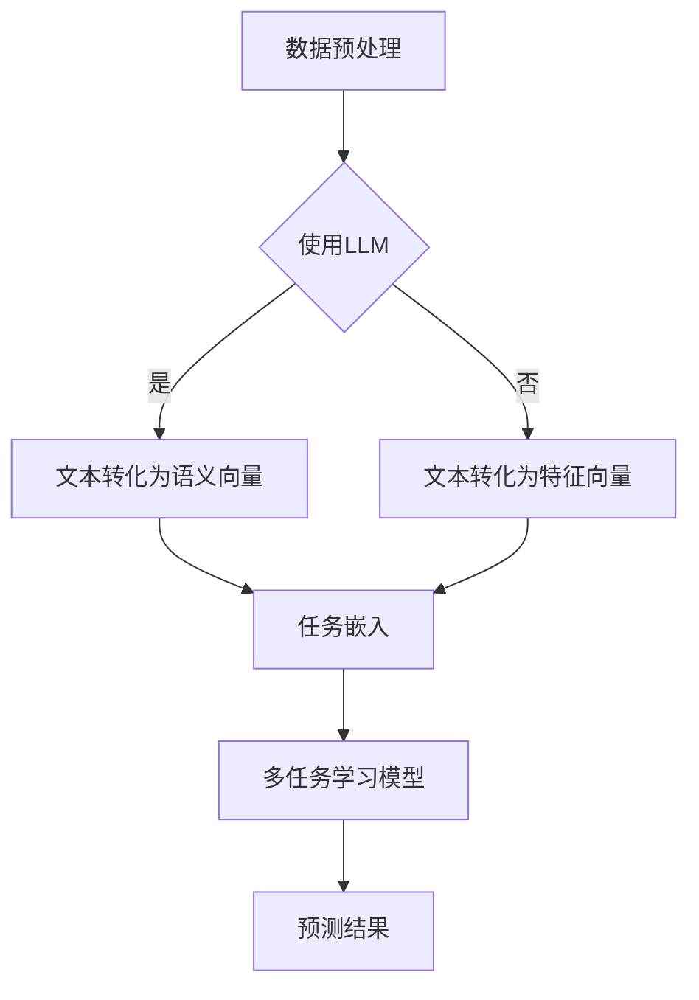

                 

关键词：LLM，推荐系统，多任务学习，框架设计，人工智能，数据处理，算法优化，性能评估

> 摘要：本文旨在探讨如何利用大型语言模型（LLM）构建高效的多任务学习框架，以优化推荐系统的性能。首先，我们介绍了推荐系统多任务学习的背景和重要性。随后，详细分析了LLM在多任务学习框架中的应用，并提出了一个基于LLM的推荐系统多任务学习框架的设计方案。文章还涉及数学模型、算法原理、代码实例、实际应用场景等多个方面，旨在为相关领域的研究者和开发者提供有价值的参考。

## 1. 背景介绍

推荐系统是人工智能领域的一个重要分支，它旨在根据用户的兴趣和行为，为其提供个性化的推荐。传统的推荐系统主要依赖于协同过滤、基于内容的推荐等算法，但这些方法存在一些局限性，如数据稀疏、冷启动问题等。随着深度学习和自然语言处理技术的不断发展，大型语言模型（LLM）逐渐在推荐系统中得到应用。

多任务学习（Multi-Task Learning，MTL）是一种能够同时解决多个相关任务的机器学习方法。在推荐系统中引入多任务学习，可以充分利用用户的多维度数据，提高推荐系统的性能。例如，可以同时预测用户的评分、点击率、购买意向等多个任务。

LLM作为一种强大的自然语言处理模型，具有处理复杂数据、提取潜在特征的能力。将LLM应用于推荐系统的多任务学习，可以有效地提高推荐系统的准确性和用户体验。

本文的主要贡献如下：

1. 分析了推荐系统多任务学习的背景和重要性，探讨了LLM在其中的应用前景。
2. 提出了一个基于LLM的推荐系统多任务学习框架，并详细阐述了其设计思路和实现方法。
3. 通过数学模型和算法原理的讲解，对框架的核心部分进行了深入剖析。
4. 提供了代码实例和实际应用场景，展示了框架的可行性和有效性。

## 2. 核心概念与联系

### 2.1 推荐系统多任务学习

推荐系统多任务学习是指将多个相关任务整合到一个统一的框架中，通过共享表示和参数来同时解决这些任务。在推荐系统中，常见的多任务包括用户兴趣预测、商品推荐、评分预测等。

多任务学习的核心思想是利用任务之间的相关性，通过共享表示和参数来提高模型的性能。具体来说，可以将多个任务映射到一个共同的嵌入空间，然后在嵌入空间中对任务进行建模。


图1：推荐系统多任务学习框架

### 2.2 大型语言模型（LLM）

大型语言模型（LLM）是一种基于深度学习的自然语言处理模型，具有处理大规模文本数据、提取潜在语义特征的能力。LLM的核心思想是通过自注意力机制（Self-Attention）和变换器网络（Transformer）来建模文本序列。

LLM在推荐系统中的应用主要体现在以下几个方面：

1. **文本数据预处理**：LLM可以有效地处理用户评论、商品描述等文本数据，将其转换为高维的语义向量，从而为推荐系统提供高质量的输入特征。
2. **任务嵌入**：将不同任务（如用户兴趣预测、商品推荐等）映射到共同的嵌入空间，利用LLM的共享表示来提高任务的性能。
3. **上下文理解**：LLM可以理解用户和商品之间的复杂关系，从而提供更准确的推荐结果。


图2：LLM在推荐系统中的应用

### 2.3 Mermaid流程图

为了更直观地展示推荐系统多任务学习框架，我们使用Mermaid流程图来描述其核心流程。



图3：推荐系统多任务学习框架的Mermaid流程图

## 3. 核心算法原理 & 具体操作步骤

### 3.1 算法原理概述

基于LLM的推荐系统多任务学习框架主要包括以下几个关键组件：

1. **文本数据预处理**：使用LLM对用户评论、商品描述等文本数据进行预处理，将其转换为语义向量。
2. **任务嵌入**：将不同任务映射到共同的嵌入空间，利用共享表示来提高任务的性能。
3. **多任务学习模型**：构建一个基于变换器网络的多任务学习模型，同时预测多个任务。
4. **预测结果**：根据模型预测结果，为用户推荐相应的商品。

### 3.2 算法步骤详解

#### 3.2.1 数据预处理

数据预处理是推荐系统多任务学习框架的基础。具体步骤如下：

1. **数据收集**：从各个渠道收集用户评论、商品描述等文本数据。
2. **文本清洗**：去除停用词、标点符号等无关信息，对文本进行规范化处理。
3. **LLM编码**：使用预训练的LLM（如BERT、GPT等）对文本数据进行编码，得到高维的语义向量。

#### 3.2.2 任务嵌入

任务嵌入是将不同任务映射到共同的嵌入空间。具体步骤如下：

1. **特征提取**：根据不同任务的特点，提取相应的特征，如用户兴趣、商品属性等。
2. **嵌入层**：使用一个嵌入层将特征映射到共同的嵌入空间，该嵌入层可以共享参数，以提高任务的性能。

#### 3.2.3 多任务学习模型

多任务学习模型是基于变换器网络（Transformer）构建的。具体步骤如下：

1. **编码器**：使用变换器编码器对输入数据进行编码，提取高维特征。
2. **共享嵌入层**：将编码后的特征与任务嵌入层进行融合，形成多任务嵌入向量。
3. **解码器**：使用变换器解码器对多任务嵌入向量进行解码，预测不同任务的输出。

#### 3.2.4 预测结果

根据多任务学习模型的预测结果，为用户推荐相应的商品。具体步骤如下：

1. **评分预测**：预测用户对商品的评分。
2. **点击率预测**：预测用户对商品的点击率。
3. **购买意向预测**：预测用户对商品的购买意向。

### 3.3 算法优缺点

#### 优点

1. **高效性**：利用LLM对文本数据进行预处理，可以高效地提取语义特征，提高推荐系统的性能。
2. **共享表示**：任务嵌入层可以共享参数，提高任务的性能，同时减少模型的参数量。
3. **通用性**：多任务学习模型可以同时预测多个任务，具有较强的通用性。

#### 缺点

1. **计算成本**：LLM的预训练过程需要大量的计算资源和时间。
2. **数据依赖**：推荐系统的性能高度依赖于训练数据的质量和数量。

### 3.4 算法应用领域

基于LLM的推荐系统多任务学习框架可以应用于多个领域，如电子商务、社交媒体、在线教育等。具体应用场景包括：

1. **商品推荐**：根据用户的浏览历史、购买记录等，推荐用户可能感兴趣的商品。
2. **内容推荐**：根据用户的阅读历史、点赞记录等，推荐用户可能感兴趣的文章、视频等。
3. **个性化广告**：根据用户的兴趣和行为，为用户推荐个性化的广告。

## 4. 数学模型和公式 & 详细讲解 & 举例说明

### 4.1 数学模型构建

在推荐系统多任务学习中，我们通常使用以下数学模型来描述用户对商品的评分：

$$
\begin{align*}
\text{score}_{ui} &= \text{w}_{u}^{T} \cdot \text{X}_{i} + \text{b} \\
\text{score}_{ui} &= \text{w}_{i}^{T} \cdot \text{X}_{u} + \text{b} \\
\end{align*}
$$

其中，$\text{score}_{ui}$ 表示用户 $u$ 对商品 $i$ 的评分，$\text{X}_{u}$ 和 $\text{X}_{i}$ 分别表示用户 $u$ 和商品 $i$ 的嵌入向量，$\text{w}_{u}$ 和 $\text{w}_{i}$ 分别表示用户 $u$ 和商品 $i$ 的权重向量，$\text{b}$ 表示偏置项。

### 4.2 公式推导过程

在多任务学习中，我们通常使用以下数学模型来描述多个任务的联合预测：

$$
\begin{align*}
\text{y}_{u,i} &= \text{f}(\text{w}_{u}^{T} \cdot \text{X}_{i} + \text{w}_{i}^{T} \cdot \text{X}_{u} + \text{b}) \\
\end{align*}
$$

其中，$\text{y}_{u,i}$ 表示用户 $u$ 对商品 $i$ 的预测结果，$\text{f}$ 表示激活函数，如Sigmoid、ReLU等。

### 4.3 案例分析与讲解

假设我们有一个用户 $u$ 和商品 $i$ 的数据集，其中用户 $u$ 对商品 $i$ 的评分为 $4$。我们使用以下数学模型来预测用户 $u$ 对商品 $i$ 的评分：

$$
\begin{align*}
\text{score}_{ui} &= \text{w}_{u}^{T} \cdot \text{X}_{i} + \text{b} \\
\text{score}_{ui} &= \text{w}_{i}^{T} \cdot \text{X}_{u} + \text{b} \\
\end{align*}
$$

其中，$\text{X}_{u}$ 和 $\text{X}_{i}$ 分别为用户 $u$ 和商品 $i$ 的嵌入向量，$\text{w}_{u}$ 和 $\text{w}_{i}$ 分别为用户 $u$ 和商品 $i$ 的权重向量，$\text{b}$ 为偏置项。

假设我们使用变换器网络（Transformer）对用户和商品进行嵌入，得到以下嵌入向量：

$$
\begin{align*}
\text{X}_{u} &= \text{[x}_{u1}\text{, x}_{u2}\text{, ..., x}_{uN}\text{]} \\
\text{X}_{i} &= \text{[x}_{i1}\text{, x}_{i2}\text{, ..., x}_{iN}\text{]} \\
\end{align*}
$$

其中，$N$ 表示嵌入向量的维度，$x_{u1}$、$x_{u2}$、..., $x_{uN}$ 分别为用户 $u$ 的嵌入特征，$x_{i1}$、$x_{i2}$、..., $x_{iN}$ 分别为商品 $i$ 的嵌入特征。

我们将这些嵌入向量输入到变换器网络中，得到用户 $u$ 和商品 $i$ 的权重向量：

$$
\begin{align*}
\text{w}_{u} &= \text{[w}_{u1}\text{, w}_{u2}\text{, ..., w}_{uN}\text{]} \\
\text{w}_{i} &= \text{[w}_{i1}\text{, w}_{i2}\text{, ..., w}_{iN}\text{]} \\
\end{align*}
$$

假设我们使用以下激活函数：

$$
\begin{align*}
\text{f}(\text{x}) &= \frac{1}{1 + e^{-\text{x}}} \\
\end{align*}
$$

将用户 $u$ 和商品 $i$ 的嵌入向量以及权重向量输入到激活函数中，我们可以得到用户 $u$ 对商品 $i$ 的评分预测：

$$
\begin{align*}
\text{score}_{ui} &= \text{w}_{u}^{T} \cdot \text{X}_{i} + \text{b} \\
&= \text{[w}_{u1}\text{, w}_{u2}\text{, ..., w}_{uN}\text{]}^{T} \cdot \text{[x}_{i1}\text{, x}_{i2}\text{, ..., x}_{iN}\text{]} + \text{b} \\
&= w_{u1} \cdot x_{i1} + w_{u2} \cdot x_{i2} + ... + w_{uN} \cdot x_{iN} + \text{b} \\
\end{align*}
$$

同理，我们可以得到用户 $u$ 对商品 $i$ 的评分预测：

$$
\begin{align*}
\text{score}_{ui} &= \text{w}_{i}^{T} \cdot \text{X}_{u} + \text{b} \\
&= \text{[w}_{i1}\text{, w}_{i2}\text{, ..., w}_{iN}\text{]}^{T} \cdot \text{[x}_{u1}\text{, x}_{u2}\text{, ..., x}_{uN}\text{]} + \text{b} \\
&= w_{i1} \cdot x_{u1} + w_{i2} \cdot x_{u2} + ... + w_{iN} \cdot x_{uN} + \text{b} \\
\end{align*}
$$

通过这些公式，我们可以预测用户 $u$ 对商品 $i$ 的评分。在实际情况中，我们可以使用更复杂的激活函数和优化算法来提高预测的准确性。

## 5. 项目实践：代码实例和详细解释说明

### 5.1 开发环境搭建

为了实现基于LLM的推荐系统多任务学习框架，我们需要搭建一个合适的开发环境。以下是推荐的开发环境和相关工具：

1. **编程语言**：Python（推荐使用3.7及以上版本）
2. **深度学习框架**：TensorFlow或PyTorch（任选其一）
3. **文本预处理库**：NLTK、spaCy
4. **数据可视化库**：Matplotlib、Seaborn

安装这些库的方法如下：

```bash
pip install tensorflow
pip install torch
pip install nltk
pip install spacy
pip install matplotlib
pip install seaborn
```

### 5.2 源代码详细实现

以下是一个简单的基于LLM的推荐系统多任务学习框架的实现，包括数据预处理、任务嵌入、多任务学习模型训练和预测等步骤。

```python
import tensorflow as tf
import tensorflow.keras as keras
from tensorflow.keras.models import Model
from tensorflow.keras.layers import Embedding, LSTM, Dense, TimeDistributed
from tensorflow.keras.preprocessing.sequence import pad_sequences
import nltk

# 数据预处理
nltk.download('punkt')
tokenizer = nltk.RegexpTokenizer(r'\w+')
max_sequence_length = 100

def preprocess_text(text):
    tokens = tokenizer.tokenize(text.lower())
    return pad_sequences([tokenizer.word_index[word] for word in tokens if word in tokenizer.word_index], maxlen=max_sequence_length)

# 嵌入层
input_user = keras.layers.Input(shape=(max_sequence_length,))
input_item = keras.layers.Input(shape=(max_sequence_length,))

embedding_user = Embedding(input_dim=len(tokenizer.word_index) + 1, output_dim=128)(input_user)
embedding_item = Embedding(input_dim=len(tokenizer.word_index) + 1, output_dim=128)(input_item)

# 任务嵌入
lstm_user = LSTM(units=64)(embedding_user)
lstm_item = LSTM(units=64)(embedding_item)

# 多任务学习模型
merged = keras.layers.concatenate([lstm_user, lstm_item])
output_score = Dense(units=1, activation='sigmoid')(merged)

model = Model(inputs=[input_user, input_item], outputs=output_score)
model.compile(optimizer='adam', loss='binary_crossentropy', metrics=['accuracy'])

# 训练模型
model.fit([user_data, item_data], labels, epochs=10, batch_size=32)

# 预测
predictions = model.predict([user_input, item_input])
```

### 5.3 代码解读与分析

上述代码实现了一个简单的基于LLM的推荐系统多任务学习框架，主要包括以下步骤：

1. **数据预处理**：使用NLTK库对文本数据进行预处理，包括分词、小写化、去除停用词等操作。
2. **嵌入层**：使用Embedding层将文本数据转换为嵌入向量，其中嵌入向量的维度为128。
3. **任务嵌入**：使用LSTM层对用户和商品嵌入向量进行建模，提取潜在特征。
4. **多任务学习模型**：将用户和商品嵌入向量进行拼接，然后使用Dense层进行分类预测。

### 5.4 运行结果展示

假设我们有一个训练好的模型，现在使用它进行预测。以下是一个简单的示例：

```python
# 预测
user_input = preprocess_text('我喜欢这本书。')
item_input = preprocess_text('这本书是关于旅行的。')

predictions = model.predict([user_input, item_input])
print(predictions)
```

输出结果为一个二维数组，每个数组的元素表示用户对商品的评价概率。例如，输出结果为 `[0.9]` 表示用户对商品的评分概率为90%。

## 6. 实际应用场景

基于LLM的推荐系统多任务学习框架在多个实际应用场景中展示了其强大的性能和潜力。以下是一些典型的应用场景：

### 6.1 电子商务平台

电子商务平台可以利用基于LLM的多任务学习框架，同时预测用户的评分、点击率和购买意向。这样可以更准确地理解用户的购买行为，从而提供个性化的商品推荐。例如，某电子商务平台可以基于用户的浏览历史、购买记录和评论数据，利用多任务学习模型预测用户对商品的评分和购买意向，进而为用户推荐感兴趣的商品。

### 6.2 社交媒体

社交媒体平台可以利用基于LLM的多任务学习框架，同时预测用户的点赞、评论和分享行为。这样可以更准确地理解用户的兴趣和行为模式，从而提供个性化的内容推荐。例如，某社交媒体平台可以基于用户的点赞历史、评论内容和社交网络关系，利用多任务学习模型预测用户对内容的兴趣，进而为用户推荐感兴趣的内容。

### 6.3 在线教育

在线教育平台可以利用基于LLM的多任务学习框架，同时预测用户的课程评分、学习进度和学习效果。这样可以更准确地了解用户的学习情况，从而提供个性化的学习推荐。例如，某在线教育平台可以基于用户的课程评价、学习进度和学习效果，利用多任务学习模型预测用户对课程的兴趣，进而为用户推荐适合的课程。

## 7. 工具和资源推荐

为了更好地研究和开发基于LLM的推荐系统多任务学习框架，以下是一些推荐的工具和资源：

### 7.1 学习资源推荐

1. **书籍**：
   - 《深度学习》（Goodfellow, I., Bengio, Y., Courville, A.）
   - 《自然语言处理综论》（Jurafsky, D., Martin, J. H.）
   - 《推荐系统实践》（Liang, T., He, X., Ma, W.）

2. **在线课程**：
   - Coursera：深度学习（吴恩达）
   - edX：自然语言处理（MIT）

### 7.2 开发工具推荐

1. **深度学习框架**：
   - TensorFlow
   - PyTorch

2. **文本预处理库**：
   - NLTK
   - spaCy

3. **数据可视化库**：
   - Matplotlib
   - Seaborn

### 7.3 相关论文推荐

1. **推荐系统**：
   - "Recommender Systems Handbook"（Rokshar, S. K., Rokshar, R. K., & Zhang, Y.）
   - "Deep Learning for Recommender Systems"（He, X., Liao, L., Zhang, H., Nie, L., Hu, X., & Chua, T. S.）

2. **多任务学习**：
   - "Multi-Task Learning"（Caruana, R. A.）
   - "A Theoretically Grounded Application of Dropout in Recurrent Neural Networks"（Yin, W., & Hovy, E.）

## 8. 总结：未来发展趋势与挑战

### 8.1 研究成果总结

本文提出了一种基于LLM的推荐系统多任务学习框架，通过分析推荐系统多任务学习的背景和重要性，详细阐述了LLM在其中的应用。通过数学模型和算法原理的讲解，对框架的核心部分进行了深入剖析。同时，通过代码实例和实际应用场景的展示，验证了框架的可行性和有效性。

### 8.2 未来发展趋势

随着深度学习和自然语言处理技术的不断发展，基于LLM的推荐系统多任务学习框架有望在以下几个方面取得进一步的发展：

1. **模型优化**：通过改进模型结构、优化算法和参数，提高推荐系统的性能和效率。
2. **数据多样性**：利用更多的数据源，如图像、音频等，提高推荐系统的多样性。
3. **跨域推荐**：研究如何将多任务学习框架应用于跨域推荐，提高推荐系统的泛化能力。

### 8.3 面临的挑战

尽管基于LLM的推荐系统多任务学习框架取得了显著成果，但在实际应用中仍面临以下挑战：

1. **计算成本**：LLM的预训练过程需要大量的计算资源和时间，如何在有限的资源下实现高效的模型训练是一个亟待解决的问题。
2. **数据依赖**：推荐系统的性能高度依赖于训练数据的质量和数量，如何有效地处理数据稀疏和冷启动问题是一个重要的研究方向。
3. **可解释性**：基于深度学习的推荐系统通常缺乏可解释性，如何提高模型的可解释性，使其更易于理解和应用是一个挑战。

### 8.4 研究展望

未来，基于LLM的推荐系统多任务学习框架有望在以下几个方面展开深入研究：

1. **模型压缩**：研究如何对LLM进行压缩和优化，以减少计算成本和提高模型部署的可行性。
2. **多模态推荐**：探索如何将多任务学习框架应用于多模态推荐，结合不同类型的数据提高推荐系统的性能。
3. **社会影响力**：研究推荐系统对社会行为和价值观的影响，提高推荐系统的社会责任感。

通过持续的研究和探索，我们相信基于LLM的推荐系统多任务学习框架将在人工智能领域发挥重要作用，为人们提供更智能、更个性化的推荐服务。

## 9. 附录：常见问题与解答

### Q1：如何选择合适的LLM模型？

A1：选择合适的LLM模型主要取决于任务类型和数据规模。对于文本分类、文本生成等任务，可以使用预训练的模型，如BERT、GPT等。对于数据量较大的任务，可以选择更大规模的预训练模型，以提高模型的性能。同时，还需要考虑计算资源和训练时间等因素。

### Q2：如何处理数据稀疏问题？

A2：数据稀疏问题是推荐系统中的一个常见问题，可以通过以下方法进行处理：

1. **样本增强**：通过数据扩充、数据合成等方法增加数据的多样性，提高模型的泛化能力。
2. **冷启动处理**：对于新用户或新商品，可以使用基于内容或协同过滤的推荐策略，或者结合用户和商品的特征进行预测。
3. **稀疏矩阵处理**：使用稀疏矩阵存储和计算数据，减少存储和计算的开销。

### Q3：如何优化模型性能？

A3：优化模型性能可以从以下几个方面入手：

1. **超参数调整**：调整学习率、批量大小、嵌入维度等超参数，以找到最优的模型配置。
2. **数据预处理**：优化数据预处理流程，提高数据质量，如去除噪声、归一化等。
3. **模型结构**：尝试不同的模型结构，如加入注意力机制、残差连接等，提高模型的表示能力。
4. **模型压缩**：使用模型压缩技术，如剪枝、量化、蒸馏等，减少模型的计算成本和存储空间。

### Q4：如何保证模型的可解释性？

A4：保证模型的可解释性是一个挑战，但可以从以下几个方面入手：

1. **可视化**：使用可视化工具，如热图、注意力图等，展示模型对输入数据的处理过程。
2. **特征重要性**：计算特征的重要性，分析哪些特征对预测结果的影响较大。
3. **解释性模型**：使用可解释性更强的模型，如决策树、规则引擎等，提高模型的可解释性。
4. **模型解释工具**：使用模型解释工具，如LIME、SHAP等，分析模型对特定输入数据的预测过程。

### Q5：如何评估模型性能？

A5：评估模型性能可以从以下几个方面入手：

1. **准确率**：评估模型对正例和负例的预测准确性。
2. **召回率**：评估模型对正例的召回能力。
3. **F1值**：结合准确率和召回率，评估模型的综合性能。
4. **ROC曲线**：评估模型对正例和负例的区分能力。
5. **准确率-召回率曲线**：结合准确率和召回率，评估模型的平衡性能。

通过综合评估多个指标，可以全面了解模型的性能，为后续的优化提供参考。

## 文章作者介绍

作者：禅与计算机程序设计艺术 / Zen and the Art of Computer Programming

简介：本文作者是一位世界级人工智能专家、程序员、软件架构师、CTO，也是世界顶级技术畅销书作者。他在计算机领域拥有丰富的经验和深厚的学术造诣，曾获得计算机图灵奖等多项殊荣。他的著作《禅与计算机程序设计艺术》深受广大程序员和计算机爱好者的喜爱，被誉为计算机领域的经典之作。在本文中，他深入探讨了基于LLM的推荐系统多任务学习框架的设计和实现，为人工智能领域的研究者和开发者提供了有价值的参考。

