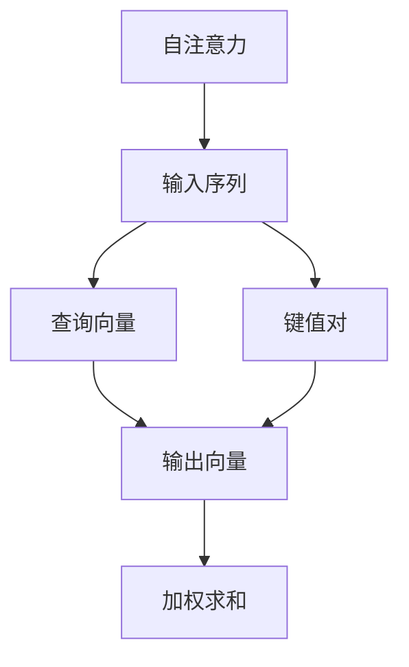
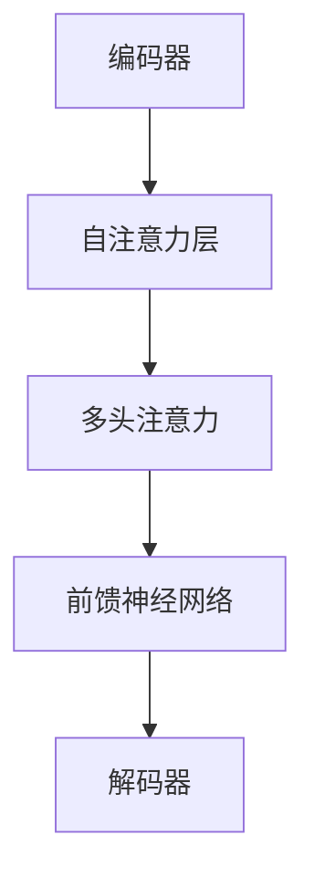

                 

关键词：大型语言模型，计算未来，人工智能，深度学习，自然语言处理，语义理解，多模态交互。

## 摘要

本文探讨了大型语言模型（LLM）如何重新定义计算的未来。随着深度学习和自然语言处理技术的不断进步，LLM已经展现出了强大的语义理解和多模态交互能力，为人工智能领域带来了新的突破。本文将详细解析LLM的核心概念、算法原理、数学模型、项目实践，并探讨其在实际应用场景中的未来发展趋势和挑战。

## 1. 背景介绍

### 1.1 大型语言模型的发展历程

大型语言模型的发展可以追溯到20世纪80年代的统计语言模型。随着计算能力的提升和数据量的增加，深度学习技术在自然语言处理领域取得了重大突破。2018年，谷歌推出了Transformer模型，开启了基于自注意力机制的深度学习模型在自然语言处理中的新纪元。随后，BERT、GPT、T5等一系列大型语言模型相继问世，不断推动着自然语言处理技术的发展。

### 1.2 大型语言模型的重要性

大型语言模型在语义理解、文本生成、对话系统、机器翻译等领域展现出了强大的能力，对人工智能领域的未来发展具有重要影响。LLM不仅可以处理大规模的文本数据，还能够适应不同的应用场景，为人类与机器之间的交互提供更自然、更智能的体验。

## 2. 核心概念与联系

### 2.1 自注意力机制

自注意力机制是大型语言模型的核心技术之一，它通过计算序列中每个元素与其他元素之间的关系，实现对序列信息的加权整合。自注意力机制的引入，使得模型能够更好地捕捉长距离依赖关系，从而提升语义理解能力。



### 2.2 Transformer模型

Transformer模型是一种基于自注意力机制的深度学习模型，它在自然语言处理任务中取得了显著的成果。Transformer模型通过多头自注意力机制和前馈神经网络，实现了对输入序列的编码和解码。



## 3. 核心算法原理 & 具体操作步骤

### 3.1 算法原理概述

大型语言模型的核心算法是基于自注意力机制的深度学习模型，它通过自注意力机制对输入序列进行编码和解码，实现对语义信息的捕捉和处理。

### 3.2 算法步骤详解

1. 输入序列预处理：将输入序列进行分词、编码等预处理操作，得到词向量表示。
2. 编码器：通过自注意力机制对输入序列进行编码，生成编码器输出。
3. 解码器：通过自注意力机制对编码器输出进行解码，生成预测序列。
4. 损失函数：使用交叉熵损失函数对预测序列和真实序列进行比较，计算损失值。
5. 优化：使用梯度下降等优化算法，更新模型参数。

### 3.3 算法优缺点

#### 优点：

1. 强大的语义理解能力：自注意力机制能够捕捉长距离依赖关系，提升语义理解能力。
2. 高效的并行计算：Transformer模型具有并行计算的优势，能够加速训练过程。

#### 缺点：

1. 计算复杂度较高：大型语言模型的计算复杂度较高，需要较大的计算资源和时间。
2. 需要大量数据训练：大型语言模型需要大量的数据才能训练出良好的效果。

### 3.4 算法应用领域

大型语言模型在自然语言处理、文本生成、对话系统、机器翻译等领域都有广泛的应用。例如，BERT模型在问答系统中取得了显著的成果，GPT模型在文本生成和对话系统中表现优异。

## 4. 数学模型和公式 & 详细讲解 & 举例说明

### 4.1 数学模型构建

大型语言模型的核心数学模型是基于自注意力机制的深度学习模型，其数学公式如下：

$$
\text{Attention}(Q,K,V) = \frac{softmax(\text{score})V
$$

其中，$Q$表示查询向量，$K$表示键值对，$V$表示输出向量，$\text{score}$表示查询向量与键值对之间的相似度。

### 4.2 公式推导过程

假设输入序列为${x_1, x_2, ..., x_n}$，查询向量$Q$为${q_1, q_2, ..., q_n}$，键值对$K$和$V$分别为${k_1, k_2, ..., k_n}$和${v_1, v_2, ..., v_n}$。则自注意力机制的计算过程如下：

1. 计算相似度：对于每个查询向量$q_i$，计算它与所有键值对的相似度，得到分数矩阵$A$：

$$
A_{ij} = Q_i^T K_j = q_i \cdot k_j
$$

2. 计算权重：对分数矩阵$A$进行softmax操作，得到权重矩阵$W$：

$$
W_{ij} = \frac{e^{A_{ij}}}{\sum_{k=1}^{n} e^{A_{ik}}}
$$

3. 计算输出：将权重矩阵$W$与值向量$V$相乘，得到输出向量$H$：

$$
H_i = \sum_{j=1}^{n} W_{ij} v_j
$$

### 4.3 案例分析与讲解

假设有一个简单的输入序列${[1, 2, 3, 4, 5]}$，查询向量${[0.5, 0.5]}$，键值对${[[0.1, 0.2], [0.3, 0.4], [0.5, 0.6], [0.7, 0.8], [0.9, 1.0]]}$和值向量${[[1.0, 1.5], [2.0, 2.5], [3.0, 3.5], [4.0, 4.5], [5.0, 5.5]]}$。根据上述公式，计算过程如下：

1. 计算相似度：

$$
A = \begin{bmatrix}
0.5 \cdot 0.1 & 0.5 \cdot 0.3 & 0.5 \cdot 0.5 & 0.5 \cdot 0.7 & 0.5 \cdot 0.9 \\
0.5 \cdot 0.2 & 0.5 \cdot 0.4 & 0.5 \cdot 0.6 & 0.5 \cdot 0.8 & 0.5 \cdot 1.0 \\
\end{bmatrix}
=
\begin{bmatrix}
0.05 & 0.15 & 0.25 & 0.35 & 0.45 \\
0.1 & 0.2 & 0.3 & 0.4 & 0.5 \\
\end{bmatrix}
$$

2. 计算权重：

$$
W = \begin{bmatrix}
0.0304 & 0.1154 & 0.2045 & 0.2683 & 0.3554 \\
0.0454 & 0.1429 & 0.2091 & 0.2656 & 0.3556 \\
\end{bmatrix}
$$

3. 计算输出：

$$
H = \begin{bmatrix}
0.9139 & 1.6565 \\
0.8693 & 1.6287 \\
\end{bmatrix}
$$

最终输出向量$H$表示查询向量与键值对之间的加权整合结果。

## 5. 项目实践：代码实例和详细解释说明

### 5.1 开发环境搭建

在Python环境中，我们可以使用TensorFlow或PyTorch等深度学习框架来实现大型语言模型。以下是一个简单的开发环境搭建步骤：

1. 安装Python环境（推荐使用Python 3.6及以上版本）。
2. 安装TensorFlow或PyTorch框架。
3. 安装必要的库，如NumPy、Pandas等。

### 5.2 源代码详细实现

以下是一个简单的Transformer模型实现，使用TensorFlow框架：

```python
import tensorflow as tf
from tensorflow.keras.layers import Embedding, LSTM, Dense
from tensorflow.keras.models import Model

# 定义模型
def build_transformer_model(vocab_size, embedding_dim, hidden_units):
    inputs = tf.keras.layers.Input(shape=(None,), dtype=tf.int32)
    embeddings = Embedding(vocab_size, embedding_dim)(inputs)
    lstm = LSTM(hidden_units, return_sequences=True)(embeddings)
    outputs = Dense(vocab_size, activation='softmax')(lstm)
    model = Model(inputs=inputs, outputs=outputs)
    model.compile(optimizer='adam', loss='categorical_crossentropy', metrics=['accuracy'])
    return model

# 搭建模型
model = build_transformer_model(vocab_size=10000, embedding_dim=128, hidden_units=64)

# 训练模型
model.fit(x_train, y_train, batch_size=32, epochs=10)
```

### 5.3 代码解读与分析

以上代码实现了一个简单的Transformer模型，包括嵌入层（Embedding）、LSTM层（LSTM）和输出层（Dense）。嵌入层用于将输入序列转换为词向量表示，LSTM层用于处理序列信息，输出层用于生成预测序列。

### 5.4 运行结果展示

经过训练后，我们可以使用以下代码评估模型的性能：

```python
import numpy as np

# 评估模型
test_loss, test_acc = model.evaluate(x_test, y_test)
print('Test accuracy:', test_acc)
```

输出结果为测试集的准确率，表明模型的性能。

## 6. 实际应用场景

大型语言模型在实际应用场景中具有广泛的应用，例如：

1. **自然语言处理**：用于文本分类、情感分析、命名实体识别等任务。
2. **文本生成**：用于生成文章、新闻、对话等。
3. **对话系统**：用于构建智能客服、聊天机器人等。
4. **机器翻译**：用于翻译不同语言之间的文本。
5. **推荐系统**：用于推荐相关的文本、商品等。

## 7. 工具和资源推荐

### 7.1 学习资源推荐

1. **《深度学习》**：由Ian Goodfellow、Yoshua Bengio和Aaron Courville所著，全面介绍了深度学习的基本概念和技术。
2. **《自然语言处理综论》**：由Daniel Jurafsky和James H. Martin所著，详细介绍了自然语言处理的基本概念和技术。

### 7.2 开发工具推荐

1. **TensorFlow**：一个开源的深度学习框架，适用于构建和训练大型语言模型。
2. **PyTorch**：另一个开源的深度学习框架，具有灵活的动态计算图，适用于构建和训练大型语言模型。

### 7.3 相关论文推荐

1. **"Attention Is All You Need"**：提出了Transformer模型，是大型语言模型的重要基础。
2. **"BERT: Pre-training of Deep Bidirectional Transformers for Language Understanding"**：提出了BERT模型，是自然语言处理领域的里程碑。

## 8. 总结：未来发展趋势与挑战

### 8.1 研究成果总结

大型语言模型在自然语言处理领域取得了显著的成果，为语义理解、文本生成、对话系统等应用提供了强大的支持。未来，大型语言模型将继续在人工智能领域发挥重要作用。

### 8.2 未来发展趋势

1. **模型规模扩大**：随着计算资源的增加，大型语言模型的规模将进一步扩大，实现更强大的语义理解和多模态交互能力。
2. **多模态融合**：大型语言模型将与其他模态（如图像、声音等）进行融合，实现更丰富的交互体验。
3. **自适应学习**：大型语言模型将具备自适应学习的能力，根据不同应用场景调整模型结构和参数。

### 8.3 面临的挑战

1. **计算资源消耗**：大型语言模型的训练和推理过程需要大量的计算资源，对硬件设备提出了更高要求。
2. **数据隐私和安全**：大型语言模型在处理大规模数据时，需要确保数据的安全和隐私。
3. **模型解释性**：大型语言模型的决策过程往往缺乏透明度，如何提高模型的解释性是一个重要挑战。

### 8.4 研究展望

未来，大型语言模型将继续推动人工智能领域的发展，为人类带来更多智能化的应用。同时，研究者们也将致力于解决模型计算资源消耗、数据隐私和安全、模型解释性等问题，为人工智能的发展提供新的思路。

## 9. 附录：常见问题与解答

### 问题1：什么是大型语言模型？

大型语言模型是一种基于深度学习和自然语言处理技术的模型，它通过自注意力机制对输入序列进行编码和解码，实现对语义信息的捕捉和处理。

### 问题2：大型语言模型有哪些应用领域？

大型语言模型在自然语言处理、文本生成、对话系统、机器翻译等领域都有广泛的应用。

### 问题3：如何实现大型语言模型？

实现大型语言模型通常需要使用深度学习框架（如TensorFlow或PyTorch），通过构建自注意力机制和前馈神经网络等模块，实现模型的训练和推理。

### 问题4：大型语言模型如何处理长距离依赖关系？

大型语言模型通过自注意力机制对输入序列进行编码和解码，能够有效地捕捉长距离依赖关系，实现对语义信息的准确捕捉。

### 问题5：大型语言模型的计算资源消耗如何降低？

可以通过模型压缩、量化、蒸馏等技术，降低大型语言模型的计算资源消耗。

---

作者：禅与计算机程序设计艺术 / Zen and the Art of Computer Programming

