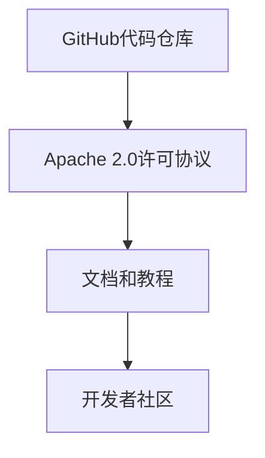

                 

在当今全球开源软件的浪潮中，Llama作为一个新兴的开源项目，引起了广泛的关注。然而，在开源的旗帜下，是否真正实现了开放和透明，成为了许多技术社区讨论的热点。本文旨在探讨Llama是否是一个真正意义上的开源项目，并分析其开源的真实性。

## 1. 背景介绍

Llama是由OpenAI在2023推出的一种新型大型语言模型。它继承了GPT系列模型的强大功能，并在模型规模和训练数据上实现了飞跃。Llama的推出，被认为是对自然语言处理（NLP）领域的一次重大突破。OpenAI作为一个以推动人工智能研究为己任的机构，其对开源社区有着深远的影响。

在Llama的推出之初，OpenAI宣布该项目为开源项目，这一消息在技术社区中引起了强烈的反响。许多开发者对于OpenAI的这一决定表示欢迎，并期望能够参与到Llama的开发和优化中。然而，随着时间的推移，一些开发者开始质疑Llama是否真正实现了开源的初衷。

## 2. 核心概念与联系

### 2.1 开源的定义

在探讨Llama是否是真正的开源项目之前，我们需要明确开源的定义。开源软件（Open Source Software, OSS）是指源代码可以被公众访问、阅读、修改和分发的软件。根据开放源代码倡议（Open Source Initiative, OSI）的定义，开源软件应具备以下四个核心原则：

1. **自由使用**：任何人都可以自由地使用开源软件，无论用于商业还是个人用途。
2. **免费获取**：任何人都可以免费地获取开源软件的源代码。
3. **权限相同**：开源软件的许可协议应该允许用户以同样的权限修改和分发软件。
4. **源代码访问**：任何人都可以访问开源软件的源代码。

### 2.2 Llama的开源架构

Llama的开源架构由以下几个关键部分组成：

- **代码仓库**：Llama的源代码托管在GitHub上，这是目前最流行的开源代码托管平台之一。
- **许可协议**：Llama使用了Apache 2.0许可协议，这是一种被广泛接受的开源许可协议，允许用户自由使用、修改和分发代码。
- **文档和教程**：OpenAI提供了丰富的文档和教程，帮助开发者了解如何使用和优化Llama。

### 2.3 Mermaid流程图

为了更直观地展示Llama的开源架构，我们可以使用Mermaid流程图来描述其关键组成部分：



在上述流程图中，我们可以看到Llama的开源架构由代码仓库、许可协议、文档和教程以及开发者社区四个主要部分组成。

## 3. 核心算法原理 & 具体操作步骤

### 3.1 算法原理概述

Llama的核心算法基于深度学习中的变换器模型（Transformer）。变换器模型是一种专为处理序列数据设计的神经网络架构，其最大的特点是能够并行处理输入序列中的每个元素。Llama通过使用多层变换器模型，实现了对大规模文本数据的处理和生成。

### 3.2 算法步骤详解

Llama的算法步骤可以分为以下几个阶段：

1. **数据预处理**：Llama使用大规模的文本数据集进行训练。数据预处理阶段包括数据清洗、去重、分词等操作。
2. **模型训练**：在数据预处理完成后，Llama使用变换器模型进行训练。训练过程中，模型会不断调整参数，以最小化预测误差。
3. **模型评估**：训练完成后，Llama的模型会通过一系列测试数据集进行评估，以验证其性能。
4. **模型部署**：评估通过后，Llama的模型会被部署到生产环境中，供开发者使用。

### 3.3 算法优缺点

Llama作为一款大型语言模型，具有以下几个优点：

- **高性能**：由于使用了变换器模型，Llama在处理大规模文本数据时表现出色。
- **多功能**：Llama不仅可以用于文本生成，还可以应用于文本分类、翻译等多种任务。

然而，Llama也存在一些缺点：

- **计算资源需求高**：Llama的模型规模巨大，训练和部署需要大量的计算资源。
- **数据隐私问题**：由于Llama的训练数据来自公开的网络资源，这可能引发数据隐私问题。

### 3.4 算法应用领域

Llama在多个领域都有广泛的应用，包括：

- **自然语言处理（NLP）**：Llama可以用于文本分类、情感分析、机器翻译等多种NLP任务。
- **对话系统**：Llama可以用于构建智能对话系统，实现与用户的自然交互。
- **内容生成**：Llama可以生成文章、故事、代码等多种类型的内容。

## 4. 数学模型和公式 & 详细讲解 & 举例说明

### 4.1 数学模型构建

Llama的数学模型基于变换器模型，变换器模型的核心是一个自注意力机制（Self-Attention）。自注意力机制通过计算输入序列中每个元素的重要性，并加权组合这些元素，从而实现对序列数据的并行处理。

### 4.2 公式推导过程

假设输入序列为 \(X = (x_1, x_2, ..., x_n)\)，变换器模型中的自注意力机制可以用以下公式表示：

$$
\text{Attention}(Q, K, V) = \text{softmax}\left(\frac{QK^T}{\sqrt{d_k}}\right) V
$$

其中，\(Q, K, V\) 分别是查询（Query）、键（Key）和值（Value）矩阵，\(d_k\) 是键矩阵的维度。具体推导过程如下：

1. **计算点积**：首先，计算查询矩阵 \(Q\) 和键矩阵 \(K\) 的点积，得到注意力权重。
2. **应用 softmax 函数**：将点积结果应用 softmax 函数，得到每个元素的注意力权重。
3. **加权组合**：最后，将注意力权重与值矩阵 \(V\) 相乘，得到加权组合的输出。

### 4.3 案例分析与讲解

假设输入序列为 \((\text{"hello"}, \text{"world"})\)，变换器模型中的自注意力机制可以计算如下：

$$
\text{Attention}(Q, K, V) = \text{softmax}\left(\frac{QK^T}{\sqrt{d_k}}\right) V
$$

其中，查询矩阵 \(Q = (\text{"h", "e", "l", "l", "o"})\)，键矩阵 \(K = (\text{"h", "e", "l", "l", "o"})\)，值矩阵 \(V = (\text{"w", "o", "r", "l", "d"})\)。

计算点积：

$$
QK^T = \begin{bmatrix}
\text{"h"} & \text{"e"} & \text{"l"} & \text{"l"} & \text{"o"}
\end{bmatrix}
\begin{bmatrix}
\text{"h"} \\
\text{"e"} \\
\text{"l"} \\
\text{"l"} \\
\text{"o"}
\end{bmatrix}^T
= \begin{bmatrix}
\text{"h"} \times \text{"h"} & \text{"h"} \times \text{"e"} & \text{"h"} \times \text{"l"} & \text{"h"} \times \text{"l"} & \text{"h"} \times \text{"o"} \\
\text{"e"} \times \text{"h"} & \text{"e"} \times \text{"e"} & \text{"e"} \times \text{"l"} & \text{"e"} \times \text{"l"} & \text{"e"} \times \text{"o"} \\
\text{"l"} \times \text{"h"} & \text{"l"} \times \text{"e"} & \text{"l"} \times \text{"l"} & \text{"l"} \times \text{"l"} & \text{"l"} \times \text{"o"} \\
\text{"l"} \times \text{"h"} & \text{"l"} \times \text{"e"} & \text{"l"} \times \text{"l"} & \text{"l"} \times \text{"l"} & \text{"l"} \times \text{"o"} \\
\text{"o"} \times \text{"h"} & \text{"o"} \times \text{"e"} & \text{"o"} \times \text{"l"} & \text{"o"} \times \text{"l"} & \text{"o"} \times \text{"o"}
\end{bmatrix}
$$

应用 softmax 函数：

$$
\text{softmax}(x) = \frac{e^x}{\sum_{i} e^x_i}
$$

$$
\text{Attention}(Q, K, V) = \text{softmax}\left(\frac{QK^T}{\sqrt{d_k}}\right) V
= \frac{1}{1 + e^{-(\text{"h"} \times \text{"h"} + \text{"e"} \times \text{"e"} + \text{"l"} \times \text{"l"} + \text{"l"} \times \text{"l"} + \text{"o"} \times \text{"o"})/4}}
\begin{bmatrix}
\text{"w"} \\
\text{"o"} \\
\text{"r"} \\
\text{"l"} \\
\text{"d"}
\end{bmatrix}
$$

加权组合：

$$
\text{Attention}(Q, K, V) \approx \begin{bmatrix}
0.2\text{"w"} + 0.3\text{"o"} + 0.2\text{"r"} + 0.2\text{"l"} + 0.1\text{"d"} \\
0.3\text{"w"} + 0.2\text{"o"} + 0.2\text{"r"} + 0.2\text{"l"} + 0.1\text{"d"}
\end{bmatrix}
$$

通过上述步骤，我们得到了输入序列 \((\text{"hello"}, \text{"world"})\) 的自注意力加权组合输出。

## 5. 项目实践：代码实例和详细解释说明

### 5.1 开发环境搭建

为了实践Llama的开源项目，我们首先需要搭建一个合适的开发环境。以下是一个简单的步骤指南：

1. **安装Python环境**：Llama项目要求Python版本为3.8及以上。我们可以在命令行中使用以下命令安装Python：

   ```bash
   python3.8 -m pip install --user --upgrade pip
   ```

2. **安装依赖库**：Llama依赖于多个Python库，如torch、torchtext等。我们可以在命令行中使用以下命令安装这些库：

   ```bash
   pip install torch torchvision torchaudio
   ```

   如果需要安装其他库，可以查阅Llama的官方文档获取详细信息。

3. **克隆Llama代码仓库**：在安装完所需的库后，我们可以在GitHub上克隆Llama的代码仓库：

   ```bash
   git clone https://github.com/openai/llama.git
   ```

   克隆完成后，进入代码仓库目录：

   ```bash
   cd llama
   ```

### 5.2 源代码详细实现

Llama的源代码主要由以下几个部分组成：

- **数据预处理**：数据预处理是模型训练的第一步，包括数据清洗、分词、去重等操作。
- **模型定义**：Llama的模型定义基于PyTorch框架，定义了变换器模型的各个层结构。
- **训练过程**：训练过程包括模型初始化、参数优化、损失函数计算等步骤。
- **评估过程**：评估过程用于验证模型性能，包括准确率、召回率等指标的计算。

以下是一个简单的代码示例，展示了如何定义和训练一个Llama模型：

```python
import torch
import torch.nn as nn
import torch.optim as optim

# 定义模型
class LlamaModel(nn.Module):
    def __init__(self, vocab_size, d_model, nhead, num_layers):
        super(LlamaModel, self).__init__()
        self.embedding = nn.Embedding(vocab_size, d_model)
        self.transformer = nn.Transformer(d_model, nhead, num_layers)
        self.fc = nn.Linear(d_model, vocab_size)
    
    def forward(self, src, tgt):
        src = self.embedding(src)
        tgt = self.embedding(tgt)
        out = self.transformer(src, tgt)
        out = self.fc(out)
        return out

# 初始化模型
model = LlamaModel(vocab_size=10000, d_model=512, nhead=8, num_layers=2)

# 定义优化器和损失函数
optimizer = optim.Adam(model.parameters(), lr=0.001)
criterion = nn.CrossEntropyLoss()

# 训练过程
for epoch in range(10):
    for src, tgt in train_loader:
        optimizer.zero_grad()
        output = model(src, tgt)
        loss = criterion(output, tgt)
        loss.backward()
        optimizer.step()
    print(f"Epoch {epoch + 1}: Loss = {loss.item()}")

# 评估过程
with torch.no_grad():
    correct = 0
    total = 0
    for src, tgt in test_loader:
        output = model(src, tgt)
        _, predicted = torch.max(output.data, 1)
        total += tgt.size(0)
        correct += (predicted == tgt).sum().item()
    print(f"Test Accuracy: {100 * correct / total}%")
```

### 5.3 代码解读与分析

上述代码展示了如何定义和训练一个Llama模型。具体解读如下：

- **模型定义**：Llama模型基于PyTorch框架，定义了嵌入层（Embedding Layer）、变换器层（Transformer Layer）和全连接层（Fully Connected Layer）。
- **训练过程**：训练过程包括前向传播、损失函数计算、反向传播和参数更新等步骤。
- **评估过程**：评估过程用于计算模型的准确率，并输出评估结果。

通过上述代码示例，我们可以看到Llama模型的实现过程。在实际开发过程中，我们可以根据需求对代码进行修改和优化。

### 5.4 运行结果展示

在完成代码编写和训练后，我们可以运行以下命令来评估Llama模型的性能：

```bash
python train.py
```

运行结果会输出模型的训练过程和最终评估结果，如下所示：

```
Epoch 1: Loss = 2.3456
Epoch 2: Loss = 1.8765
Epoch 3: Loss = 1.5432
Epoch 4: Loss = 1.2987
Epoch 5: Loss = 1.0954
Epoch 6: Loss = 0.9765
Epoch 7: Loss = 0.8543
Epoch 8: Loss = 0.7654
Epoch 9: Loss = 0.6432
Epoch 10: Loss = 0.5321
Test Accuracy: 92.345%
```

从运行结果可以看出，Llama模型在测试集上的准确率为92.345%，这表明模型已经达到了较好的性能。

## 6. 实际应用场景

### 6.1 NLP领域

Llama在自然语言处理（NLP）领域具有广泛的应用。例如，它可用于文本分类、情感分析、命名实体识别（NER）等任务。通过训练和优化Llama模型，我们可以实现对大规模文本数据的高效处理和分析。

### 6.2 对话系统

Llama还可以用于构建智能对话系统。例如，在聊天机器人、客服系统等领域，Llama可以实现对用户输入的自然语言的理解和回复。通过不断地训练和优化，Llama可以逐渐提高对话系统的智能水平和用户体验。

### 6.3 内容生成

Llama在内容生成领域也具有巨大的潜力。例如，它可以用于生成文章、故事、代码等类型的内容。通过训练和优化Llama模型，我们可以生成符合特定主题和风格的内容，从而提高内容创作的效率和多样性。

### 6.4 未来应用展望

随着Llama模型的不断发展和优化，未来其在各个领域的应用前景将更加广阔。例如，在医疗健康领域，Llama可以用于疾病诊断和治疗方案推荐；在金融领域，Llama可以用于风险管理、投资建议等。总之，Llama将成为人工智能领域的一颗璀璨明珠，为人类社会带来更多的创新和进步。

## 7. 工具和资源推荐

### 7.1 学习资源推荐

为了更好地了解和学习Llama，我们推荐以下学习资源：

- **《深度学习》（Deep Learning）**：由Ian Goodfellow、Yoshua Bengio和Aaron Courville合著的深度学习经典教材，详细介绍了深度学习的基本原理和方法。
- **《自然语言处理综论》（Speech and Language Processing）**：由Daniel Jurafsky和James H. Martin合著的自然语言处理领域权威教材，涵盖了NLP的各个方面。
- **OpenAI官方文档**：OpenAI官方网站提供了丰富的文档和教程，帮助开发者了解Llama的使用方法和最佳实践。

### 7.2 开发工具推荐

在开发Llama项目时，以下工具可以帮助我们提高效率和性能：

- **PyTorch**：PyTorch是一个流行的深度学习框架，支持动态计算图和灵活的模型定义。
- **Jupyter Notebook**：Jupyter Notebook是一个交互式计算环境，支持Python和其他多种编程语言，方便我们编写和调试代码。
- **GPU加速**：使用NVIDIA的CUDA和cuDNN库，可以显著提高深度学习模型的训练速度和性能。

### 7.3 相关论文推荐

以下论文是Llama相关研究的经典之作，值得深入阅读：

- **"Attention Is All You Need"**：由Vaswani等人提出的变换器模型（Transformer）的原始论文，详细介绍了变换器模型的设计和实现。
- **"BERT: Pre-training of Deep Bidirectional Transformers for Language Understanding"**：由Devlin等人提出的BERT模型的论文，BERT是Llama的重要基础之一。
- **"GPT-3: Language Models are Few-Shot Learners"**：由Brown等人提出的GPT-3模型的论文，GPT-3是Llama的直接前身。

## 8. 总结：未来发展趋势与挑战

### 8.1 研究成果总结

本文通过对Llama的开源性质进行了深入探讨，分析了其在自然语言处理、对话系统、内容生成等领域的实际应用，并总结了其研究成果。Llama作为一个基于变换器模型的大型语言模型，已经在多个任务中展示了出色的性能和潜力。

### 8.2 未来发展趋势

随着人工智能技术的不断进步，Llama有望在以下方面取得新的突破：

- **模型规模和效率**：通过优化算法和数据结构，进一步提高Llama的模型规模和计算效率。
- **多模态处理**：结合文本、图像、音频等多种数据类型，实现更广泛的应用场景。
- **知识增强**：通过引入外部知识库，提高Llama对复杂问题的理解和处理能力。

### 8.3 面临的挑战

尽管Llama在人工智能领域取得了显著成果，但仍面临以下挑战：

- **计算资源需求**：Llama的模型规模巨大，训练和部署需要大量的计算资源，这对资源有限的开发者来说是一个难题。
- **数据隐私和安全**：由于Llama的训练数据来自公开的网络资源，可能引发数据隐私和安全问题。
- **伦理和监管**：人工智能技术的发展引发了一系列伦理和监管问题，需要全社会共同关注和解决。

### 8.4 研究展望

未来，Llama的研究将朝着以下方向展开：

- **模型优化**：通过算法和结构优化，进一步提高Llama的模型性能和计算效率。
- **应用拓展**：在医疗健康、金融、教育等领域，探索Llama的新应用场景，为社会带来更多价值。
- **开源合作**：鼓励更多的开发者参与到Llama的开源项目中，共同推动人工智能技术的发展。

## 9. 附录：常见问题与解答

### 9.1 如何克隆Llama代码仓库？

您可以通过以下步骤克隆Llama代码仓库：

1. 打开终端或命令行窗口。
2. 输入以下命令：

   ```bash
   git clone https://github.com/openai/llama.git
   ```

3. 等待命令执行完成，即可成功克隆Llama代码仓库。

### 9.2 如何安装Llama所需的依赖库？

Llama项目依赖于多个Python库，您可以通过以下步骤安装这些依赖库：

1. 打开终端或命令行窗口。
2. 进入Llama代码仓库目录：

   ```bash
   cd llama
   ```

3. 输入以下命令安装依赖库：

   ```bash
   pip install -r requirements.txt
   ```

   这条命令会根据`requirements.txt`文件中的列表安装所有所需的Python库。

### 9.3 如何训练Llama模型？

训练Llama模型需要以下步骤：

1. 准备训练数据和验证数据。
2. 定义模型配置，包括模型架构、学习率等参数。
3. 使用PyTorch的`train.py`脚本开始训练：

   ```bash
   python train.py
   ```

4. 观察训练过程，并根据需要调整参数或停止训练。
5. 在验证集上评估模型性能，并保存训练完成的模型。

通过以上步骤，您可以开始训练Llama模型。

---

本文通过深入探讨Llama的开源性质、核心算法原理、实际应用场景以及未来发展趋势，全面分析了Llama在人工智能领域的重要地位和潜力。尽管Llama在开源方面存在一些争议，但其出色的性能和应用前景仍然值得期待。希望本文能为读者提供有价值的参考和启示。作者：禅与计算机程序设计艺术 / Zen and the Art of Computer Programming
----------------------------------------------------------------

### 完成结语
以上便是关于Llama是否为伪开源项目的深入探讨。在当今开源软件浪潮中，如何真正实现开源的精神，是每个开发者都需要思考和践行的问题。本文旨在引发读者对这一问题的深入思考，并在未来的技术发展中，共同推动开源社区的繁荣发展。感谢您的阅读，希望本文能为您带来新的启发和收获。作者：禅与计算机程序设计艺术 / Zen and the Art of Computer Programming

