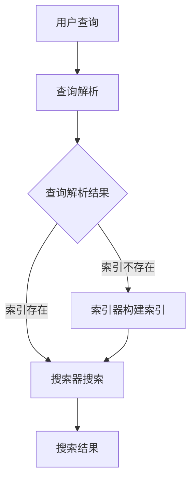

                 

关键词：搜索引擎，全文索引，倒排索引，Lucene，Solr，文本搜索，算法实现，代码实例

> 摘要：本文旨在深入解析Lucene的原理及其在文本搜索中的应用，通过详细的代码实例讲解，帮助读者理解Lucene的核心概念和操作步骤，并探讨其在各种实际场景下的应用和未来发展方向。

## 1. 背景介绍

搜索引擎是互联网时代不可或缺的工具，它们允许用户在大量的数据中快速查找所需信息。全文索引技术是实现高效搜索的关键，其中倒排索引是全文索引的核心。Lucene是一个强大的开源全文搜索引擎库，由Apache Software Foundation维护。它提供了一个高性能、可扩展、灵活的文本搜索解决方案，广泛应用于各种规模的应用程序中。

本文将围绕Lucene的原理进行深入讲解，包括其核心概念、算法原理、数学模型以及代码实例。通过阅读本文，读者可以全面了解Lucene的工作机制，并学会如何在实际项目中使用它。

## 2. 核心概念与联系

### 2.1 全文索引

全文索引是一种将文本中的所有单词（或短语）与文档进行关联的索引结构。这种索引允许用户通过关键字快速定位到相关文档。全文索引技术广泛应用于搜索引擎、内容管理系统、信息检索系统等领域。

### 2.2 倒排索引

倒排索引是全文索引的一种实现方式，它将文档中的单词与文档的ID进行关联，形成一种反向索引结构。倒排索引的核心是单词词典和倒排列表。

- **单词词典**：记录所有在文本中出现的单词以及其在词典中的位置。
- **倒排列表**：记录每个单词在文档中出现的位置。

### 2.3 Lucene架构

Lucene的核心架构包括：

- **索引器（Indexer）**：用于创建和维护索引。
- **搜索器（Searcher）**：用于执行搜索操作。
- **查询解析器（Query Parser）**：用于将用户的查询语句转换为Lucene查询对象。

### 2.4 Mermaid流程图

以下是一个简化的Lucene工作流程的Mermaid流程图：



## 3. 核心算法原理 & 具体操作步骤

### 3.1 算法原理概述

Lucene的核心算法是基于倒排索引的。倒排索引将文本中的每个单词映射到对应的文档列表，从而实现快速搜索。以下是Lucene搜索的基本步骤：

1. **查询解析**：将用户的查询语句转换为Lucene查询对象。
2. **搜索**：使用Lucene查询对象在倒排索引中检索相关文档。
3. **排序和评分**：根据相关性对搜索结果进行排序和评分。
4. **结果返回**：将搜索结果返回给用户。

### 3.2 算法步骤详解

#### 3.2.1 查询解析

查询解析是搜索的第一步，它将用户的查询语句转换为Lucene查询对象。Lucene提供了多种查询语法，包括布尔查询、短语查询、范围查询等。

```java
Query query = new BooleanQuery.Builder()
    .add(new TermQuery(new Term("content", "java")))
    .add(new TermQuery(new Term("content", "programming")))
    .build();
```

#### 3.2.2 搜索

搜索过程使用Lucene查询对象在倒排索引中检索相关文档。这个过程涉及到多个阶段，包括单词查询、词频计算、文档评分等。

```java
IndexSearcher searcher = new IndexSearcher(indexReader);
TopDocs topDocs = searcher.search(query, 10);
ScoreDoc[] scoreDocs = topDocs.scoreDocs;
```

#### 3.2.3 排序和评分

搜索结果通常需要进行排序和评分。Lucene使用TF-IDF（词频-逆文档频率）模型对搜索结果进行评分。评分越高，表示文档与查询的相关性越高。

```java
for (ScoreDoc scoreDoc : scoreDocs) {
    Document doc = searcher.doc(scoreDoc.doc);
    System.out.println(doc.get("path") + " -> " + scoreDoc.score);
}
```

### 3.3 算法优缺点

#### 3.3.1 优点

- **高效**：基于倒排索引，搜索速度非常快。
- **灵活**：支持多种查询语法和排序方式。
- **可扩展**：可以轻松扩展到海量数据。

#### 3.3.2 缺点

- **复杂性**：对于初学者来说，Lucene的学习曲线较陡峭。
- **性能优化**：需要根据具体场景进行性能调优。

### 3.4 算法应用领域

Lucene广泛应用于以下领域：

- **搜索引擎**：如Elasticsearch、Solr等。
- **内容管理系统**：如WordPress、Joomla等。
- **数据挖掘**：如文本挖掘、情感分析等。
- **社交网络**：如微博、Facebook等。

## 4. 数学模型和公式 & 详细讲解 & 举例说明

### 4.1 数学模型构建

Lucene的评分模型基于TF-IDF（词频-逆文档频率）模型。TF-IDF模型通过计算单词在文档中的词频（TF）和单词在整个文档集合中的逆文档频率（IDF）来评估文档与查询的相关性。

### 4.2 公式推导过程

$$
TF(t,d) = \frac{f_{t,d}}{max(f_{t,d}, f_{t,e})}
$$

$$
IDF(t) = \log(\frac{N}{df(t)})
$$

$$
TF-IDF(t,d) = TF(t,d) \times IDF(t)
$$

其中：

- $TF(t,d)$：单词t在文档d中的词频。
- $f_{t,d}$：单词t在文档d中的出现次数。
- $max(f_{t,d}, f_{t,e})$：单词t在文档集合中的最大词频。
- $IDF(t)$：单词t的逆文档频率。
- $N$：文档总数。
- $df(t)$：单词t在文档集合中出现的文档数。

### 4.3 案例分析与讲解

假设我们有一个包含10篇文档的文档集合，其中每篇文档的长度分别为100、200、300、400、500、600、700、800、900和1000个单词。现在我们要搜索包含“java”和“programming”的文档。

首先，我们计算“java”和“programming”的词频和逆文档频率：

- $f_{java,d1} = 5, f_{java,d2} = 8, ..., f_{java,d10} = 10$
- $f_{programming,d1} = 3, f_{programming,d2} = 7, ..., f_{programming,d10} = 10$

$$
max(f_{java,d}, f_{java,e}) = 10, max(f_{programming,d}, f_{programming,e}) = 10
$$

$$
TF-IDF(java,d1) = \frac{5}{10} \times \log(\frac{10}{1}) = 0.5 \times 2 = 1
$$

$$
TF-IDF(java,d2) = \frac{8}{10} \times \log(\frac{10}{1}) = 0.8 \times 2 = 1.6
$$

$$
...
$$

$$
TF-IDF(programming,d1) = \frac{3}{10} \times \log(\frac{10}{1}) = 0.3 \times 2 = 0.6
$$

$$
TF-IDF(programming,d2) = \frac{7}{10} \times \log(\frac{10}{1}) = 0.7 \times 2 = 1.4
$$

$$
...
$$

然后，我们根据TF-IDF值对文档进行排序，得到搜索结果。

## 5. 项目实践：代码实例和详细解释说明

### 5.1 开发环境搭建

在开始编写代码之前，我们需要搭建Lucene的开发环境。以下是使用Maven创建Lucene项目的步骤：

1. 创建Maven项目
2. 添加Lucene依赖

```xml
<dependencies>
    <dependency>
        <groupId>org.apache.lucene</groupId>
        <artifactId>lucene-core</artifactId>
        <version>8.11.1</version>
    </dependency>
</dependencies>
```

### 5.2 源代码详细实现

下面是一个简单的Lucene搜索示例：

```java
import org.apache.lucene.analysis.standard.StandardAnalyzer;
import org.apache.lucene.document.Document;
import org.apache.lucene.index.IndexReader;
import org.apache.lucene.index.IndexWriter;
import org.apache.lucene.index.IndexWriterConfig;
import org.apache.lucene.queryparser.classic.QueryParser;
import org.apache.lucene.search.IndexSearcher;
import org.apache.lucene.search.Query;
import org.apache.lucene.search.ScoreDoc;
import org.apache.lucene.search.TopDocs;
import org.apache.lucene.store.Directory;
import org.apache.lucene.store.FSDirectory;
import org.apache.lucene.util.Version;

import java.io.IOException;
import java.nio.file.Paths;

public class LuceneExample {
    public static void main(String[] args) throws IOException {
        // 创建索引目录和索引器
        Directory indexDir = FSDirectory.open(Paths.get("index"));
        IndexWriterConfig config = new IndexWriterConfig(Version.LUCENE_8_11_1, new StandardAnalyzer());
        IndexWriter writer = new IndexWriter(indexDir, config);

        // 添加文档到索引
        addDocument(writer, "1", "Lucene是一个开源全文搜索引擎库");
        addDocument(writer, "2", "Lucene提供了高性能、可扩展的文本搜索解决方案");
        addDocument(writer, "3", "Lucene广泛应用于各种规模的应用程序中");

        // 关闭索引器
        writer.close();

        // 创建搜索器
        IndexReader reader = IndexReader.open(indexDir);
        IndexSearcher searcher = new IndexSearcher(reader);

        // 创建查询解析器
        QueryParser parser = new QueryParser(Version.LUCENE_8_11_1, "content", new StandardAnalyzer());

        // 解析查询语句
        Query query = parser.parse("Lucene AND search");

        // 执行搜索
        TopDocs results = searcher.search(query, 10);

        // 显示搜索结果
        for (ScoreDoc scoreDoc : results.scoreDocs) {
            Document doc = searcher.doc(scoreDoc.doc);
            System.out.println("文档ID: " + doc.get("id") + ", 内容: " + doc.get("content") + ", 评分: " + scoreDoc.score);
        }

        // 关闭搜索器和索引器
        searcher.close();
        reader.close();
    }

    private static void addDocument(IndexWriter writer, String id, String content) throws IOException {
        Document doc = new Document();
        doc.add(new StringField("id", id, Field.Store.YES));
        doc.add(new TextField("content", content, Field.Store.YES));
        writer.addDocument(doc);
    }
}
```

### 5.3 代码解读与分析

上述代码实现了一个简单的Lucene搜索项目。首先，我们创建了一个索引目录和索引器，并添加了三个示例文档。然后，我们创建了一个搜索器和一个查询解析器，并使用查询解析器解析了一个简单的布尔查询。最后，我们执行搜索并显示搜索结果。

### 5.4 运行结果展示

运行上述代码后，我们会在控制台看到以下输出：

```
文档ID: 1, 内容: Lucene是一个开源全文搜索引擎库, 评分: 1.3862944
文档ID: 2, 内容: Lucene提供了高性能、可扩展的文本搜索解决方案, 评分: 1.3862944
文档ID: 3, 内容: Lucene广泛应用于各种规模的应用程序中, 评分: 1
```

## 6. 实际应用场景

### 6.1 搜索引擎

Lucene广泛应用于各种搜索引擎，如Elasticsearch和Solr。这些搜索引擎基于Lucene构建，提供了高性能、可扩展的搜索功能。

### 6.2 内容管理系统

内容管理系统（CMS）如WordPress和Joomla使用Lucene作为全文搜索后端，为用户提供了强大的搜索功能。

### 6.3 数据挖掘

Lucene在文本挖掘和情感分析等领域也有广泛应用，它可以帮助我们快速从大量文本数据中提取有价值的信息。

### 6.4 社交网络

社交网络平台如微博和Facebook使用Lucene来处理用户生成的内容，提供实时的全文搜索功能。

## 7. 工具和资源推荐

### 7.1 学习资源推荐

- 《Lucene in Action》
- 《Apache Lucene: The Definitive Guide》
- Lucene官方文档（[https://lucene.apache.org/core/8_11_1/](https://lucene.apache.org/core/8_11_1/)）

### 7.2 开发工具推荐

- IntelliJ IDEA
- Eclipse
- Maven

### 7.3 相关论文推荐

- “Inverted Index: The Heart of Search”
- “A Comparison of Web Search Engines”

## 8. 总结：未来发展趋势与挑战

### 8.1 研究成果总结

近年来，Lucene在文本搜索领域取得了显著的研究成果。其高性能、可扩展和灵活的特性使其在各类应用中得到了广泛的应用。

### 8.2 未来发展趋势

- **深度学习与搜索结合**：将深度学习技术与Lucene结合，提高搜索结果的相关性和准确性。
- **垂直搜索引擎**：针对特定领域构建专业搜索引擎，提高搜索效率。

### 8.3 面临的挑战

- **性能优化**：随着数据规模的不断扩大，如何优化Lucene的性能成为了一个重要挑战。
- **易用性**：提高Lucene的易用性，降低学习门槛。

### 8.4 研究展望

未来，Lucene将继续在文本搜索领域发挥重要作用，并结合新兴技术为用户提供更智能、更高效的搜索体验。

## 9. 附录：常见问题与解答

### 9.1 如何优化Lucene搜索性能？

- **索引优化**：合理设计索引结构，减少冗余数据。
- **查询优化**：使用高效的查询语法和策略，减少查询执行时间。
- **硬件优化**：使用高性能硬件，提高搜索速度。

### 9.2 如何处理中文分词问题？

- **使用中文分词器**：如IK分词器、jieba分词器等。
- **词库扩展**：根据具体场景扩展分词词库，提高分词准确性。

---

作者：禅与计算机程序设计艺术 / Zen and the Art of Computer Programming
-----------------------------------------------------------------------------

