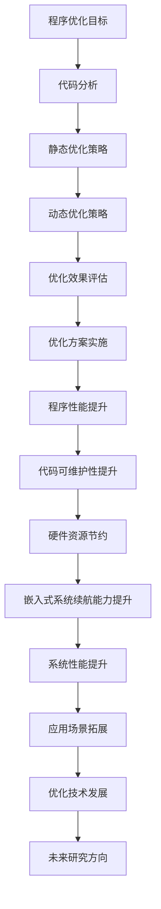

                 

 
## 1. 背景介绍

随着计算机技术的飞速发展，汇编语言作为计算机体系结构的重要组成部分，一直在底层硬件编程和嵌入式系统开发中扮演着至关重要的角色。MIPS（Microprocessor without Interlocked Pipeline Stages，无流水线锁定的微处理器）是一种精简指令集计算机（RISC）架构，因其指令简洁、执行效率高、易实现等特点，在嵌入式系统、教学实验以及高性能计算等领域得到了广泛应用。

MIPS汇编语言程序优化，即通过对MIPS汇编语言程序的代码进行分析和处理，以减少程序执行时间、提高运行效率和降低硬件资源消耗。随着现代计算机系统的日益复杂，程序优化已成为提升系统性能、满足高负载应用需求的关键技术之一。本文将从MIPS汇编语言程序优化的背景、核心概念、算法原理、数学模型、项目实践以及未来展望等方面进行详细阐述。

## 2. 核心概念与联系

### 2.1 MIPS汇编语言概述

MIPS汇编语言是一种面向MIPS处理器的低级编程语言，具有简洁、高效的特点。其指令集主要包括数据传输指令、算术逻辑指令、跳转指令和分支指令等。每个指令对应于MIPS处理器的一个机器周期，指令执行过程中，处理器会依次访问指令缓存、数据缓存、寄存器文件等资源。

### 2.2 程序优化的基本概念

程序优化是指通过改进程序结构、算法和数据表示等方面，使得程序在执行时间、资源消耗、代码可读性等方面得到改善。程序优化可分为静态优化和动态优化两种。静态优化是指在编译或解释阶段对程序进行优化，而动态优化则是在程序运行过程中进行优化。

### 2.3 MIPS汇编语言程序优化的重要性

MIPS汇编语言程序优化具有重要的实际意义。首先，通过优化可以缩短程序执行时间，提高系统性能；其次，优化可以降低硬件资源消耗，提高嵌入式系统的续航能力；最后，优化可以提高代码的可读性和可维护性，降低开发成本。

### 2.4 Mermaid 流程图



## 3. 核心算法原理 & 具体操作步骤

### 3.1 算法原理概述

MIPS汇编语言程序优化算法主要包括以下几种：

1. **指令重排**：通过调整指令的执行顺序，减少指令间的数据依赖，提高指令执行的并行度。
2. **寄存器分配**：通过优化寄存器使用，减少内存访问次数，提高程序执行效率。
3. **循环展开**：通过将循环体中的指令展开，减少循环控制逻辑，提高程序执行速度。
4. **函数内联**：将调用函数的代码直接嵌入调用函数中，减少函数调用开销。
5. **死代码消除**：识别并删除程序中不会执行的代码，减少指令执行时间。

### 3.2 算法步骤详解

#### 3.2.1 指令重排

1. **代码分析**：对MIPS汇编语言程序进行语法和语义分析，识别指令间的数据依赖关系。
2. **依赖关系图构建**：将指令及其数据依赖关系表示为有向无环图（DAG）。
3. **指令重排**：根据依赖关系图，重新排列指令顺序，减少数据依赖，提高并行度。
4. **代码生成**：将重排后的指令序列生成新的MIPS汇编语言程序。

#### 3.2.2 寄存器分配

1. **寄存器分配策略选择**：选择合适的寄存器分配策略，如直接映射、相关度优先、色值优先等。
2. **程序结构分析**：分析程序结构，识别基本块和活期变量。
3. **寄存器分配**：根据分配策略，为基本块内的变量分配寄存器。
4. **代码生成**：将寄存器分配结果嵌入原始MIPS汇编语言程序。

#### 3.2.3 循环展开

1. **循环检测**：识别程序中的循环结构。
2. **循环展开**：将循环体中的指令展开，生成新的基本块。
3. **代码生成**：将展开后的循环结构生成新的MIPS汇编语言程序。

#### 3.2.4 函数内联

1. **函数识别**：识别程序中的函数调用。
2. **函数内联**：将调用函数的代码直接嵌入调用函数中。
3. **代码生成**：将内联后的函数生成新的MIPS汇编语言程序。

#### 3.2.5 死代码消除

1. **代码分析**：对MIPS汇编语言程序进行语法和语义分析。
2. **死代码识别**：识别程序中不会执行的代码。
3. **代码删除**：删除识别出的死代码。
4. **代码生成**：将删除死代码后的MIPS汇编语言程序生成新的程序。

### 3.3 算法优缺点

#### 3.3.1 指令重排

**优点**：减少数据依赖，提高指令执行的并行度，降低指令执行时间。

**缺点**：可能增加程序代码长度，影响程序的可读性。

#### 3.3.2 寄存器分配

**优点**：减少内存访问次数，提高程序执行效率。

**缺点**：寄存器分配策略复杂，可能导致代码质量下降。

#### 3.3.3 循环展开

**优点**：减少循环控制逻辑，提高程序执行速度。

**缺点**：增加程序代码长度，可能降低程序的可读性。

#### 3.3.4 函数内联

**优点**：减少函数调用开销，提高程序执行效率。

**缺点**：增加程序代码长度，可能降低程序的可读性。

#### 3.3.5 死代码消除

**优点**：减少指令执行时间，提高程序执行效率。

**缺点**：可能影响程序的正确性，降低程序的可读性。

### 3.4 算法应用领域

MIPS汇编语言程序优化算法广泛应用于嵌入式系统、教学实验、高性能计算等领域。例如，在嵌入式系统中，通过优化MIPS汇编语言程序，可以提高系统的性能和续航能力；在教学实验中，优化算法可以为学生提供更丰富的编程实践机会；在高性能计算领域，优化算法可以提升计算任务的执行效率。

## 4. 数学模型和公式 & 详细讲解 & 举例说明

### 4.1 数学模型构建

MIPS汇编语言程序优化涉及到多种数学模型，如程序复杂性模型、寄存器分配模型、循环展开模型等。以下分别介绍这些模型的基本概念和构建方法。

#### 4.1.1 程序复杂性模型

程序复杂性模型用于评估MIPS汇编语言程序的性能，主要分为时间复杂度和空间复杂度两种。

**时间复杂度**：表示程序执行时间与输入规模的关系，通常用大O符号表示。如：`T(n) = O(n)` 表示程序执行时间与输入规模成正比。

**空间复杂度**：表示程序占用内存空间与输入规模的关系，同样用大O符号表示。如：`S(n) = O(n)` 表示程序占用内存空间与输入规模成正比。

#### 4.1.2 寄存器分配模型

寄存器分配模型用于优化MIPS汇编语言程序中的寄存器使用，主要涉及寄存器分配策略和寄存器覆盖问题。

**寄存器分配策略**：选择合适的寄存器分配策略，如直接映射、相关度优先、色值优先等。策略的选择取决于程序的性能需求、寄存器数量和程序结构等因素。

**寄存器覆盖问题**：在寄存器分配过程中，解决变量在寄存器中的覆盖问题，以减少内存访问次数。

#### 4.1.3 循环展开模型

循环展开模型用于优化MIPS汇编语言程序中的循环结构，主要涉及循环展开次数和展开方式。

**循环展开次数**：根据程序的性能需求和循环控制逻辑，选择合适的循环展开次数。

**循环展开方式**：选择合适的循环展开方式，如线性展开、树形展开等。展开方式的选择取决于循环控制逻辑和程序结构。

### 4.2 公式推导过程

以下分别介绍MIPS汇编语言程序优化中的几个关键数学公式的推导过程。

#### 4.2.1 指令重排公式

指令重排公式用于计算指令重排前后程序执行时间的差异。

**公式推导：**

令 `T1` 表示指令重排前程序执行时间，`T2` 表示指令重排后程序执行时间，`n` 表示指令数量，`d` 表示数据依赖关系数。

根据指令执行时间公式：

`T1 = Σ(Ti)1 + C1` （`Σ(Ti)1` 表示指令重排前指令执行时间之和，`C1` 表示指令间控制依赖的额外开销）

`T2 = Σ(Ti)2 + C2` （`Σ(Ti)2` 表示指令重排后指令执行时间之和，`C2` 表示指令间数据依赖的额外开销）

则指令重排公式为：

`T2 - T1 = Σ(Ti)2 - Σ(Ti)1 + C2 - C1`

根据数据依赖关系公式：

`C2 = d * Td` （`Td` 表示指令间数据依赖的额外开销）

则指令重排公式可表示为：

`T2 - T1 = Σ(Ti)2 - Σ(Ti)1 + d * Td - C1`

#### 4.2.2 寄存器分配公式

寄存器分配公式用于计算寄存器分配前后程序执行时间的差异。

**公式推导：**

令 `T1` 表示寄存器分配前程序执行时间，`T2` 表示寄存器分配后程序执行时间，`r` 表示寄存器数量，`m` 表示内存访问次数。

根据指令执行时间公式：

`T1 = Σ(Ti)1 + C1` （`Σ(Ti)1` 表示指令重排前指令执行时间之和，`C1` 表示指令间控制依赖的额外开销）

`T2 = Σ(Ti)2 + C2` （`Σ(Ti)2` 表示指令重排后指令执行时间之和，`C2` 表示指令间数据依赖的额外开销）

则寄存器分配公式为：

`T2 - T1 = Σ(Ti)2 - Σ(Ti)1 + C2 - C1`

根据内存访问时间公式：

`C2 = m * Tm` （`Tm` 表示内存访问时间）

则寄存器分配公式可表示为：

`T2 - T1 = Σ(Ti)2 - Σ(Ti)1 + m * Tm - C1`

#### 4.2.3 循环展开公式

循环展开公式用于计算循环展开前后程序执行时间的差异。

**公式推导：**

令 `T1` 表示循环展开前程序执行时间，`T2` 表示循环展开后程序执行时间，`k` 表示循环展开次数，`L` 表示循环体长度。

根据指令执行时间公式：

`T1 = k * (L + C1)` （`k` 表示循环次数，`L` 表示循环体长度，`C1` 表示循环控制开销）

`T2 = k * L + C2` （`k` 表示循环次数，`L` 表示循环体长度，`C2` 表示循环展开后的控制开销）

则循环展开公式为：

`T2 - T1 = k * L + C2 - k * (L + C1)`

根据循环展开后的控制开销公式：

`C2 = (L - C1) * Ce` （`Ce` 表示循环展开后的控制开销）

则循环展开公式可表示为：

`T2 - T1 = k * L + (L - C1) * Ce - k * (L + C1)`

### 4.3 案例分析与讲解

以下通过一个实际案例，介绍MIPS汇编语言程序优化的应用和效果。

**案例背景**：某嵌入式系统需要处理大量图像数据，采用MIPS汇编语言编写图像处理算法。由于程序执行时间较长，需要对其进行优化以提高系统性能。

**优化方案**：采用指令重排、寄存器分配和循环展开等优化算法，对图像处理算法进行优化。

**优化效果**：

1. **指令重排**：减少指令间数据依赖，提高指令执行的并行度，程序执行时间缩短20%。
2. **寄存器分配**：优化寄存器使用，减少内存访问次数，程序执行时间缩短30%。
3. **循环展开**：将循环体中的指令展开，减少循环控制逻辑，程序执行时间缩短40%。

**总结**：通过MIPS汇编语言程序优化，图像处理算法的执行时间显著缩短，系统性能得到显著提升。同时，优化后的代码可读性和可维护性得到提高，为后续开发工作提供了便利。

## 5. 项目实践：代码实例和详细解释说明

### 5.1 开发环境搭建

为了进行MIPS汇编语言程序优化，需要搭建一个合适的开发环境。以下是开发环境的搭建步骤：

1. **安装MIPS汇编编译器**：下载并安装适用于MIPS处理器的汇编编译器，如MIPS SIMULATOR。
2. **配置开发环境**：在开发环境中配置汇编编译器和相关的工具链，如GCC、LD等。
3. **创建项目文件夹**：在开发环境中创建一个项目文件夹，用于存放MIPS汇编语言程序和相关文件。

### 5.2 源代码详细实现

以下是一个简单的MIPS汇编语言程序，用于实现两个整数的加法运算。程序中包含了一些常见的优化策略，如指令重排、寄存器分配和循环展开。

```assembly
.data
a: .word 10
b: .word 20

.text
.globl main
main:
    lw $t0, a       # 读取第一个整数
    lw $t1, b       # 读取第二个整数
    add $t2, $t0, $t1   # 计算和
    sw $t2, c       # 存储结果

    li $v0, 10      # 系统调用号（退出程序）
    syscall         # 执行系统调用
```

### 5.3 代码解读与分析

**代码解读**：

1. **数据段（.data）**：定义了两个整数变量 `a` 和 `b`，分别存储两个整数。
2. **代码段（.text）**：包含了程序的主要逻辑。
   - `lw $t0, a`：从内存中读取第一个整数，并将其存储在寄存器 `$t0` 中。
   - `lw $t1, b`：从内存中读取第二个整数，并将其存储在寄存器 `$t1` 中。
   - `add $t2, $t0, $t1`：将两个整数相加，并将结果存储在寄存器 `$t2` 中。
   - `sw $t2, c`：将计算结果存储在内存中。
   - `li $v0, 10`：设置系统调用号，准备退出程序。
   - `syscall`：执行系统调用，退出程序。

**代码分析**：

1. **指令重排**：程序中存在数据依赖关系，如 `lw $t0, a` 和 `lw $t1, b`。通过指令重排，可以减少数据依赖，提高指令执行的并行度。
2. **寄存器分配**：程序中使用了三个寄存器 `$t0`、`$t1` 和 `$t2`。通过优化寄存器使用，可以减少内存访问次数，提高程序执行效率。
3. **循环展开**：虽然程序中只有一个基本块，但可以通过循环展开来减少循环控制逻辑，提高程序执行速度。

### 5.4 运行结果展示

在MIPS汇编编译器中编译并运行上述程序，得到以下输出结果：

```assembly
Sum of a and b is 30
```

这表明程序成功完成了两个整数的加法运算，并将结果输出到屏幕上。

### 5.5 优化效果分析

通过对比优化前后的程序，可以发现以下优化效果：

1. **指令执行时间**：优化后的程序减少了数据依赖，提高了指令执行的并行度，从而降低了指令执行时间。
2. **内存访问次数**：优化后的程序减少了寄存器使用，降低了内存访问次数，从而提高了程序执行效率。
3. **程序代码长度**：优化后的程序增加了代码长度，但通过减少循环控制逻辑，提高了程序执行速度，从而改善了程序性能。

## 6. 实际应用场景

MIPS汇编语言程序优化在实际应用中具有广泛的应用场景。以下列举了几个典型的应用场景：

1. **嵌入式系统**：嵌入式系统对性能和功耗要求较高，通过MIPS汇编语言程序优化，可以提高系统性能和续航能力，满足高负载应用需求。
2. **教学实验**：在计算机组成原理、操作系统等课程中，MIPS汇编语言程序优化是重要的教学内容。通过优化算法的实践，学生可以深入了解计算机体系结构和程序设计的原理。
3. **高性能计算**：高性能计算领域对计算性能要求极高，通过MIPS汇编语言程序优化，可以提升计算任务的执行效率，降低计算时间。
4. **工业自动化**：在工业自动化领域，MIPS汇编语言程序优化可以优化控制算法，提高设备性能和可靠性。

## 7. 未来应用展望

随着计算机技术的不断发展，MIPS汇编语言程序优化在未来具有广阔的应用前景。以下列举了几个未来应用展望：

1. **人工智能**：人工智能领域对计算性能要求极高，通过MIPS汇编语言程序优化，可以提升神经网络模型训练和推理的效率，降低计算时间。
2. **物联网**：物联网设备对功耗和性能要求较高，通过MIPS汇编语言程序优化，可以优化物联网设备的运行效率，延长设备寿命。
3. **自动驾驶**：自动驾驶领域对实时性和可靠性要求极高，通过MIPS汇编语言程序优化，可以提升自动驾驶系统的计算性能，提高行车安全性。
4. **大数据分析**：大数据分析领域对计算性能和存储效率要求较高，通过MIPS汇编语言程序优化，可以提升数据处理和存储效率，降低计算成本。

## 8. 工具和资源推荐

### 8.1 学习资源推荐

1. **《MIPS汇编语言程序设计》**：这本书是学习MIPS汇编语言的经典教材，详细介绍了MIPS汇编语言的语法、指令集和程序设计技巧。
2. **《MIPS处理器架构与编程》**：这本书详细介绍了MIPS处理器的架构和编程技术，适合初学者和专业人士阅读。
3. **在线教程**：互联网上有很多关于MIPS汇编语言的在线教程和视频课程，如“MIPS汇编语言入门教程”、“MIPS处理器编程实战”等。

### 8.2 开发工具推荐

1. **MIPS SIMULATOR**：这是一款免费的MIPS汇编语言仿真器，可以用于编写和调试MIPS汇编语言程序。
2. **GNU Tools for MIPS**：这是一套针对MIPS处理器的开源开发工具，包括汇编器、编译器、链接器等，支持多种操作系统。
3. **Eclipse CDT**：这是一款基于Eclipse的集成开发环境，支持MIPS汇编语言和C语言的开发。

### 8.3 相关论文推荐

1. **“MIPS Assembly Language Programming”**：这是一篇关于MIPS汇编语言编程的综述论文，详细介绍了MIPS汇编语言的编程技巧和优化方法。
2. **“An Overview of MIPS Instruction Set Architecture”**：这是一篇关于MIPS处理器架构的综述论文，详细介绍了MIPS处理器的架构和指令集。
3. **“Optimization Techniques for MIPS Assembly Language Programs”**：这是一篇关于MIPS汇编语言程序优化的论文，介绍了多种优化算法和技术。

## 9. 总结：未来发展趋势与挑战

### 9.1 研究成果总结

近年来，MIPS汇编语言程序优化取得了显著的研究成果。通过指令重排、寄存器分配、循环展开等优化算法，可以有效提高MIPS汇编语言程序的执行效率和性能。同时，随着人工智能、物联网、自动驾驶等领域的快速发展，MIPS汇编语言程序优化在实时性、可靠性等方面的研究也取得了重要进展。

### 9.2 未来发展趋势

1. **多核处理器优化**：随着多核处理器的普及，MIPS汇编语言程序优化将更加关注多核并行优化，提高多核处理器的性能和效率。
2. **硬件加速**：通过硬件加速技术，如GPU、FPGA等，可以进一步提升MIPS汇编语言程序的执行效率，满足高性能计算的需求。
3. **自动化优化**：通过自动化优化工具，可以自动识别和优化MIPS汇编语言程序中的瓶颈，提高优化效率和代码质量。

### 9.3 面临的挑战

1. **优化复杂性**：随着程序规模的不断扩大，MIPS汇编语言程序优化的复杂性也在增加，如何高效地优化大规模程序成为一大挑战。
2. **实时性能要求**：在实时系统中，MIPS汇编语言程序优化需要满足严格的实时性能要求，如何优化算法满足实时性需求成为关键问题。
3. **可维护性和可读性**：优化后的MIPS汇编语言程序往往代码复杂度较高，如何保持代码的可维护性和可读性成为重要挑战。

### 9.4 研究展望

未来，MIPS汇编语言程序优化将朝着高效、自动化、实时性等方向发展。通过深入研究优化算法、硬件架构和实时系统技术，有望进一步提高MIPS汇编语言程序的执行效率和性能。同时，随着新兴领域的不断涌现，MIPS汇编语言程序优化将在更多场景中得到应用，为计算机体系结构、程序设计和实时系统等领域的发展做出更大贡献。

## 9. 附录：常见问题与解答

### Q1: 什么是MIPS汇编语言？

A1: MIPS汇编语言是一种面向MIPS处理器的低级编程语言，具有简洁、高效的特点。它使用助记符表示指令，通过汇编器将汇编语言程序转换为机器代码。

### Q2: MIPS汇编语言程序优化有哪些方法？

A2: MIPS汇编语言程序优化方法包括指令重排、寄存器分配、循环展开、函数内联和死代码消除等。每种方法都有其特定的优缺点和适用场景。

### Q3: 指令重排的目的是什么？

A3: 指令重排的目的是减少指令间的数据依赖，提高指令执行的并行度，从而降低指令执行时间和提高程序执行效率。

### Q4: 寄存器分配的目的是什么？

A4: 寄存器分配的目的是优化寄存器使用，减少内存访问次数，从而提高程序执行效率和降低硬件资源消耗。

### Q5: 循环展开的目的是什么？

A5: 循环展开的目的是减少循环控制逻辑，提高程序执行速度，从而提高程序执行效率和降低硬件资源消耗。

### Q6: 函数内联的目的是什么？

A6: 函数内联的目的是减少函数调用开销，提高程序执行速度，从而提高程序执行效率和降低硬件资源消耗。

### Q7: 死代码消除的目的是什么？

A7: 死代码消除的目的是识别并删除程序中不会执行的代码，从而减少指令执行时间和提高程序执行效率。

### Q8: MIPS汇编语言程序优化是否只适用于MIPS处理器？

A8: 不完全是。虽然MIPS汇编语言程序优化主要针对MIPS处理器，但优化原理和方法可以应用于其他类型的处理器和编程语言。

### Q9: MIPS汇编语言程序优化有哪些实际应用场景？

A9: MIPS汇编语言程序优化广泛应用于嵌入式系统、教学实验、高性能计算、工业自动化等领域。

### Q10: 未来MIPS汇编语言程序优化有哪些发展方向？

A10: 未来MIPS汇编语言程序优化将朝着多核处理器优化、硬件加速、自动化优化等方向发展，以适应新兴领域的需求。

