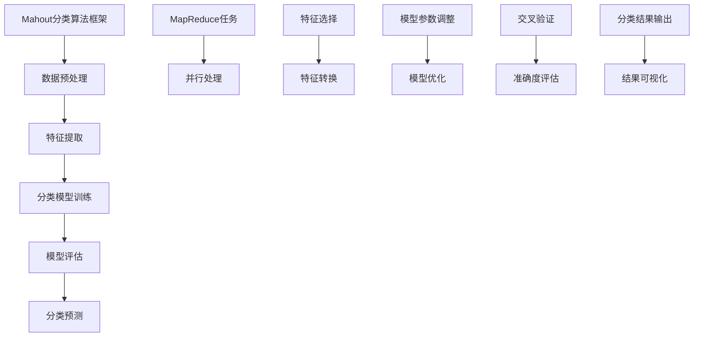

                 

## 1. 背景介绍

分类算法是机器学习中的一项基础任务，旨在将数据集中的实例根据其特征进行分类。随着大数据时代的到来，如何高效地对海量数据进行分类，成为了一个亟待解决的问题。Apache Mahout（简称Mahout）是一款开源的分布式机器学习库，它提供了多种分类算法的实现，包括传统的机器学习算法和基于统计的算法。

Mahout最早由另一些机器学习库（如Apache Commons Math和MLlib）的作者创建，旨在为机器学习社区提供易于使用且功能强大的工具。自2008年成立以来，Mahout已经成为了一个成熟的项目，吸引了大量的贡献者。Mahout支持多种编程语言，包括Java、Scala和Python，同时它还支持MapReduce和Hadoop，这使得Mahout非常适合处理大规模数据集。

在本文中，我们将深入探讨Mahout中的分类算法。文章将首先介绍分类算法的基本概念，然后详细解释Mahout中几个常用的分类算法，包括它们的原理、优缺点和应用场景。接下来，我们将通过一个具体的实例来展示如何使用Mahout进行分类，并提供代码的详细解释。最后，我们将讨论分类算法在实际应用中的场景和未来的发展趋势。

通过本文的阅读，您将能够理解分类算法的基本原理，掌握Mahout中的分类算法使用方法，并在实际项目中应用这些算法。

## 2. 核心概念与联系

在深入探讨Mahout的分类算法之前，我们需要先了解一些核心概念，包括分类算法的定义、分类器的类型以及Mahout中的分类算法架构。下面将结合Mermaid流程图，对核心概念进行详细解释。

### 2.1 分类算法的定义

分类算法是一种监督学习算法，其目标是将数据集中的每个实例分配到一个预定义的类别标签中。分类问题可以形式化定义为：给定一个训练数据集D={x1,y1}, {x2,y2}, ..., {xn,yn}，其中每个实例x是特征向量，类别标签y是一个离散的标签。分类算法的任务是构建一个分类模型f，能够对新实例进行预测，即对于新的特征向量x，预测其类别标签f(x)。

### 2.2 分类器的类型

根据分类算法的实现方式，分类器可以分为以下几种类型：

- **基于实例的分类器**：这类分类器直接复制训练集中的示例，对新实例进行分类时，通过查找最相似的训练实例来预测类别。
  
- **基于规则的分类器**：这类分类器通过生成一系列规则来预测新实例的类别，例如决策树和关联规则学习。

- **基于模型分类器**：这类分类器通过学习训练数据中的数据分布来构建模型，然后利用该模型对新实例进行分类。常见的基于模型的分类器包括线性模型、支持向量机（SVM）和朴素贝叶斯等。

### 2.3 Mahout中的分类算法架构

Mahout中的分类算法架构设计非常灵活，可以处理不同规模的数据集。以下是Mahout分类算法架构的Mermaid流程图：



### 2.4 Mermaid流程图解释

- **数据预处理**：数据预处理是任何机器学习项目的基础，包括数据清洗、缺失值处理和异常值处理等步骤。Mahout使用MapReduce任务进行数据预处理，实现并行处理。
  
- **特征提取**：特征提取是将原始数据转换为可用于分类的特征向量的过程。这包括特征选择和特征转换。Mahout提供了多种特征提取方法，如TF-IDF和词袋模型等。

- **分类模型训练**：在特征提取后，Mahout使用机器学习算法训练分类模型。训练过程中，Mahout支持多种分类算法，如朴素贝叶斯、逻辑回归和支持向量机（SVM）等。

- **模型评估**：模型评估是验证分类模型性能的重要步骤。Mahout使用交叉验证方法进行模型评估，确保模型的准确性和鲁棒性。

- **分类预测**：分类预测是分类算法的核心功能。Mahout将训练好的模型应用于新实例，预测其类别标签。此外，Mahout还提供了结果可视化工具，帮助用户更好地理解分类结果。

通过以上流程图和核心概念的解释，我们能够更清晰地理解Mahout中的分类算法架构及其工作流程。接下来，我们将详细探讨Mahout中几个常用的分类算法，包括它们的原理、优缺点和应用场景。

## 3. 核心算法原理 & 具体操作步骤

### 3.1 算法原理概述

在深入探讨Mahout中的分类算法之前，我们需要先了解这些算法的基本原理。以下是Mahout中几种常用的分类算法及其原理概述：

1. **朴素贝叶斯分类器**：朴素贝叶斯分类器是基于贝叶斯定理和特征条件独立性假设的一种分类算法。它的核心思想是通过计算每个类别出现的概率，以及每个类别中每个特征的概率，来确定新实例的类别标签。朴素贝叶斯分类器适用于文本分类和数据挖掘领域。

2. **逻辑回归分类器**：逻辑回归是一种线性分类模型，通过将输入特征映射到概率分布来实现分类。逻辑回归分类器的核心思想是找到一组参数，使得模型对于每个类别的预测概率最大化。逻辑回归分类器适用于二元分类和多类分类问题。

3. **支持向量机（SVM）分类器**：支持向量机是一种基于最大间隔分类模型的分类算法。SVM的目标是找到一个最佳的超平面，使得不同类别的数据点之间有最大的间隔。SVM适用于高维空间的数据分类，特别适合处理非线性分类问题。

4. **K最近邻（KNN）分类器**：K最近邻分类器是一种基于实例的分类算法。其核心思想是找到训练集中与待分类实例最近的K个邻居，然后通过这些邻居的类别标签来预测待分类实例的类别。KNN分类器适用于简单的分类问题，但在高维空间中容易出现“维度灾难”问题。

### 3.2 算法步骤详解

接下来，我们将详细解释上述分类算法的具体步骤：

#### 3.2.1 朴素贝叶斯分类器

1. **训练阶段**：
   - 计算每个类别的先验概率。
   - 计算每个特征在每个类别中的条件概率。
2. **预测阶段**：
   - 对于新实例，计算每个类别的后验概率。
   - 选择后验概率最大的类别作为预测结果。

#### 3.2.2 逻辑回归分类器

1. **训练阶段**：
   - 使用梯度下降或其他优化算法找到最佳参数。
   - 计算每个类别的概率分布。
2. **预测阶段**：
   - 对于新实例，计算每个类别的概率。
   - 选择概率最大的类别作为预测结果。

#### 3.2.3 支持向量机（SVM）分类器

1. **训练阶段**：
   - 使用线性或核函数将输入特征映射到高维空间。
   - 找到最佳的超平面，使得不同类别的数据点之间有最大的间隔。
   - 计算支持向量。
2. **预测阶段**：
   - 对于新实例，计算其到超平面的距离。
   - 根据距离判断新实例的类别。

#### 3.2.4 K最近邻（KNN）分类器

1. **训练阶段**：
   - 存储训练集中的实例及其标签。
2. **预测阶段**：
   - 对于新实例，计算其与训练集中每个实例的距离。
   - 选择距离最近的K个邻居。
   - 根据邻居的类别标签计算新实例的类别。

### 3.3 算法优缺点

每种分类算法都有其独特的优势和局限性。以下是上述几种分类算法的优缺点：

1. **朴素贝叶斯分类器**：
   - **优点**：简单、易于实现，计算速度快，适用于大规模数据处理。
   - **缺点**：对缺失值敏感，无法处理非线性分类问题。
2. **逻辑回归分类器**：
   - **优点**：适用于多种分类问题，解释性强，易于优化。
   - **缺点**：对异常值敏感，无法处理非线性分类问题。
3. **支持向量机（SVM）分类器**：
   - **优点**：适用于高维空间，处理非线性分类问题能力强。
   - **缺点**：计算复杂度高，训练时间较长，对参数敏感。
4. **K最近邻（KNN）分类器**：
   - **优点**：简单、易于实现，无需参数调整。
   - **缺点**：对噪声敏感，计算复杂度高，无法处理大规模数据。

### 3.4 算法应用领域

根据算法的优缺点，不同的分类算法适用于不同的应用领域：

- **朴素贝叶斯分类器**：适用于文本分类、垃圾邮件过滤等。
- **逻辑回归分类器**：适用于信用评分、客户流失预测等。
- **支持向量机（SVM）分类器**：适用于图像识别、文本分类等。
- **K最近邻（KNN）分类器**：适用于简单的分类问题，如手写数字识别。

通过上述对Mahout中分类算法原理和具体操作步骤的详细讲解，我们能够更好地理解这些算法的基本概念和实际应用。接下来，我们将通过一个实际案例，展示如何使用Mahout进行分类，并提供代码的详细解释。

## 4. 数学模型和公式 & 详细讲解 & 举例说明

在深入探讨Mahout中的分类算法时，理解其背后的数学模型和公式是非常重要的。下面我们将详细介绍几种常用的分类算法的数学模型和公式，并通过具体例子来说明这些公式的应用。

### 4.1 数学模型构建

分类算法的核心目标是构建一个预测模型，该模型能够根据新实例的特征向量预测其类别标签。以下是几种常用的分类算法的数学模型：

#### 4.1.1 朴素贝叶斯分类器

朴素贝叶斯分类器的数学模型基于贝叶斯定理，其核心公式为：

$$
P(y|x) = \frac{P(x|y)P(y)}{P(x)}
$$

其中，\(P(y|x)\) 是后验概率，表示给定特征向量 \(x\) 下类别 \(y\) 的概率；\(P(x|y)\) 是似然概率，表示在类别 \(y\) 下特征向量 \(x\) 的概率；\(P(y)\) 是先验概率，表示类别 \(y\) 的概率；\(P(x)\) 是边缘概率，表示特征向量 \(x\) 的概率。

为了简化计算，通常使用最大后验概率（MAP）进行分类：

$$
\hat{y} = \arg\max_y P(y|x)
$$

其中，\(\hat{y}\) 是预测的类别标签。

#### 4.1.2 逻辑回归分类器

逻辑回归分类器是一种基于线性模型的分类算法，其数学模型表示为：

$$
P(y=1|x) = \frac{1}{1 + e^{-\beta^T x}}
$$

其中，\(\beta\) 是模型参数，\(x\) 是特征向量，\(P(y=1|x)\) 表示在特征向量 \(x\) 下类别 \(y=1\) 的概率。逻辑回归模型的参数可以通过最大似然估计（MLE）或梯度下降等方法进行优化。

#### 4.1.3 支持向量机（SVM）分类器

支持向量机分类器的数学模型是一个线性分类器，其目标是找到最佳的超平面，使得不同类别的数据点之间有最大的间隔。其目标函数为：

$$
\min_{\beta, \beta_0} \frac{1}{2} ||\beta||^2 + C \sum_{i=1}^{n} \xi_i
$$

其中，\(\beta\) 是模型参数，\(\beta_0\) 是偏置项，\(C\) 是惩罚参数，\(\xi_i\) 是松弛变量。\(L_2\) 范数 \(||\beta||^2\) 用于控制超平面的间隔，\(C \sum_{i=1}^{n} \xi_i\) 用于处理分类错误。

#### 4.1.4 K最近邻（KNN）分类器

K最近邻分类器的数学模型相对简单，其核心思想是计算新实例与训练实例之间的距离，并根据距离最近的 \(K\) 个邻居的类别标签进行投票。其距离计算公式为：

$$
d(x, x_i) = \sqrt{\sum_{j=1}^{d} (x_j - x_{ij})^2}
$$

其中，\(x\) 是新实例，\(x_i\) 是训练实例，\(d\) 是特征维度。

### 4.2 公式推导过程

下面我们将对上述分类算法的核心公式进行推导：

#### 4.2.1 朴素贝叶斯分类器

贝叶斯定理的推导过程如下：

$$
P(y|x) = \frac{P(x|y)P(y)}{P(x)}
$$

其中，\(P(x|y)\) 表示在类别 \(y\) 下特征向量 \(x\) 的概率，可以通过条件概率公式推导：

$$
P(x|y) = \frac{P(y \cap x)}{P(y)} = \frac{P(x|y)P(y)}{P(y)}
$$

同理，\(P(x)\) 可以表示为：

$$
P(x) = \sum_y P(x|y)P(y)
$$

将 \(P(x|y)\) 和 \(P(x)\) 代入贝叶斯定理，得到：

$$
P(y|x) = \frac{P(x|y)P(y)}{\sum_y P(x|y)P(y)} = \frac{P(x|y)P(y)}{P(x)}
$$

为了简化计算，通常使用最大后验概率（MAP）进行分类：

$$
\hat{y} = \arg\max_y P(y|x)
$$

即：

$$
\hat{y} = \arg\max_y \frac{P(x|y)P(y)}{P(x)}
$$

因为 \(P(x)\) 是常数，所以最大化 \(P(y|x)P(y)\) 等价于最大化 \(P(x|y)P(y)\)。

#### 4.2.2 逻辑回归分类器

逻辑回归分类器的推导过程基于线性回归模型。假设线性回归模型为：

$$
y = \beta_0 + \beta_1 x_1 + \beta_2 x_2 + ... + \beta_n x_n
$$

其中，\(y\) 是因变量，\(x_1, x_2, ..., x_n\) 是自变量，\(\beta_0, \beta_1, \beta_2, ..., \beta_n\) 是模型参数。

为了将线性回归模型转化为概率模型，我们引入逻辑函数（Sigmoid函数）：

$$
P(y=1|x) = \frac{1}{1 + e^{-(\beta_0 + \beta_1 x_1 + \beta_2 x_2 + ... + \beta_n x_n)}}
$$

通过对数似然函数最大化，我们可以得到：

$$
\log L(\beta) = \sum_{i=1}^{n} y_i \log (1 + e^{-(\beta_0 + \beta_1 x_1 + \beta_2 x_2 + ... + \beta_n x_n)}) + (1 - y_i) \log e^{-(\beta_0 + \beta_1 x_1 + \beta_2 x_2 + ... + \beta_n x_n)}
$$

对参数 \(\beta\) 求导并令导数为零，可以得到：

$$
\frac{\partial}{\partial \beta_j} \log L(\beta) = \sum_{i=1}^{n} (y_i - P(y=1|x_i)) x_{ij}
$$

使用梯度下降或其他优化算法，我们可以找到最佳参数 \(\beta\)。

#### 4.2.3 支持向量机（SVM）分类器

支持向量机分类器的推导过程基于最大间隔分类模型。假设训练数据集为 \(D = \{(x_1, y_1), (x_2, y_2), ..., (x_n, y_n)\}\)，其中 \(x_i \in \mathbb{R}^d\) 是特征向量，\(y_i \in \{-1, +1\}\) 是类别标签。

支持向量机的主要目标是找到最佳的超平面 \(w\) 和偏置项 \(b\)，使得不同类别的数据点之间有最大的间隔。目标函数为：

$$
\min_{\beta, \beta_0} \frac{1}{2} ||\beta||^2 + C \sum_{i=1}^{n} \xi_i
$$

其中，\(\beta\) 是模型参数，\(\beta_0\) 是偏置项，\(C\) 是惩罚参数，\(\xi_i\) 是松弛变量。

为了求解这个优化问题，我们引入拉格朗日乘子法。拉格朗日函数为：

$$
L(\beta, \beta_0, \alpha, \xi) = \frac{1}{2} ||\beta||^2 - \sum_{i=1}^{n} \alpha_i (y_i \beta^T x_i - 1) - \sum_{i=1}^{n} \xi_i (1 - y_i \beta^T x_i - 1)
$$

其中，\(\alpha_i \geq 0\) 是拉格朗日乘子。

对 \(\beta, \beta_0, \alpha, \xi\) 求导并令导数为零，可以得到：

$$
\frac{\partial L}{\partial \beta} = \beta - \sum_{i=1}^{n} \alpha_i y_i x_i = 0
$$

$$
\frac{\partial L}{\partial \beta_0} = - \sum_{i=1}^{n} \alpha_i y_i = 0
$$

$$
\frac{\partial L}{\partial \alpha_i} = y_i \beta^T x_i - 1 = 0
$$

$$
\frac{\partial L}{\partial \xi_i} = 1 - y_i \beta^T x_i - 1 = 0
$$

将上述方程组代入拉格朗日函数，并令其等于零，可以得到：

$$
\beta = \sum_{i=1}^{n} \alpha_i y_i x_i
$$

$$
\sum_{i=1}^{n} \alpha_i y_i = 0
$$

$$
\alpha_i \geq 0
$$

$$
1 - y_i \beta^T x_i - 1 = 0
$$

通过解上述方程组，我们可以得到最佳的超平面 \(w\) 和偏置项 \(b\)。

#### 4.2.4 K最近邻（KNN）分类器

K最近邻分类器的核心思想是计算新实例与训练实例之间的距离，并根据距离最近的 \(K\) 个邻居的类别标签进行投票。距离计算公式为：

$$
d(x, x_i) = \sqrt{\sum_{j=1}^{d} (x_j - x_{ij})^2}
$$

其中，\(x\) 是新实例，\(x_i\) 是训练实例，\(d\) 是特征维度。

为了选择最近的 \(K\) 个邻居，我们通常使用欧几里得距离或其他距离度量。对于每个邻居 \(x_i\)，我们计算其与 \(x\) 的距离：

$$
d(x, x_i) = \sqrt{\sum_{j=1}^{d} (x_j - x_{ij})^2}
$$

然后，我们选择距离最近的 \(K\) 个邻居：

$$
\hat{x}_1, \hat{x}_2, ..., \hat{x}_K = \arg\min_{x_i} d(x, x_i)
$$

最后，根据邻居的类别标签进行投票：

$$
\hat{y} = \arg\max_{y} \sum_{i=1}^{K} \mathbb{1}_{y = y_i}
$$

其中，\(\mathbb{1}_{y = y_i}\) 是指示函数，当 \(y = y_i\) 时取值为1，否则取值为0。

### 4.3 案例分析与讲解

为了更好地理解上述分类算法的数学模型和公式，下面我们将通过一个实际案例进行讲解。

假设我们有一个简单的二分类问题，特征向量维度为2，训练数据集如下：

| x1 | x2 | y |
|----|----|---|
| 1  | 2  | 1 |
| 2  | 3  | 1 |
| 3  | 4  | -1|
| 4  | 5  | -1|

我们将使用朴素贝叶斯分类器、逻辑回归分类器和K最近邻（KNN）分类器进行分类，并比较它们的预测结果。

#### 4.3.1 朴素贝叶斯分类器

首先，我们计算每个类别的先验概率：

$$
P(y=1) = \frac{2}{4} = 0.5
$$

$$
P(y=-1) = \frac{2}{4} = 0.5
$$

然后，我们计算每个特征在每个类别中的条件概率：

$$
P(x_1=1|y=1) = \frac{2}{2} = 1
$$

$$
P(x_1=2|y=-1) = \frac{1}{2} = 0.5
$$

$$
P(x_2=2|y=1) = \frac{2}{2} = 1
$$

$$
P(x_2=3|y=-1) = \frac{1}{2} = 0.5
$$

对于新实例 \((x_1, x_2) = (1.5, 2.5)\)，我们计算后验概率：

$$
P(y=1|x_1=1.5, x_2=2.5) = \frac{P(x_1=1.5|y=1)P(y=1)}{P(x_1=1.5|y=1)P(y=1) + P(x_1=1.5|y=-1)P(y=-1)}
$$

$$
P(y=-1|x_1=1.5, x_2=2.5) = \frac{P(x_1=1.5|y=-1)P(y=-1)}{P(x_1=1.5|y=1)P(y=1) + P(x_1=1.5|y=-1)P(y=-1)}
$$

代入上述条件概率和先验概率，我们得到：

$$
P(y=1|x_1=1.5, x_2=2.5) = \frac{1 \times 0.5}{1 \times 0.5 + 0.5 \times 0.5} = 0.6667
$$

$$
P(y=-1|x_1=1.5, x_2=2.5) = \frac{0.5 \times 0.5}{1 \times 0.5 + 0.5 \times 0.5} = 0.3333
$$

由于 \(P(y=1|x_1=1.5, x_2=2.5)\) 最大，我们预测新实例的类别标签为1。

#### 4.3.2 逻辑回归分类器

接下来，我们使用逻辑回归分类器进行分类。假设逻辑回归模型为：

$$
P(y=1|x_1, x_2) = \frac{1}{1 + e^{-(\beta_0 + \beta_1 x_1 + \beta_2 x_2)}}
$$

我们使用梯度下降法优化模型参数。首先，我们初始化模型参数：

$$
\beta_0 = 0, \beta_1 = 0, \beta_2 = 0
$$

然后，我们迭代更新参数，直到收敛。具体步骤如下：

1. 计算预测概率：
   $$
   \hat{y} = \frac{1}{1 + e^{-(\beta_0 + \beta_1 x_1 + \beta_2 x_2)}}
   $$
2. 计算损失函数：
   $$
   L(\beta) = -\sum_{i=1}^{n} y_i \log(\hat{y}) - (1 - y_i) \log(1 - \hat{y})
   $$
3. 计算梯度：
   $$
   \frac{\partial L}{\partial \beta_0} = -\sum_{i=1}^{n} (y_i - \hat{y})
   $$
   $$
   \frac{\partial L}{\partial \beta_1} = -\sum_{i=1}^{n} (y_i - \hat{y}) x_{1i}
   $$
   $$
   \frac{\partial L}{\partial \beta_2} = -\sum_{i=1}^{n} (y_i - \hat{y}) x_{2i}
   $$
4. 更新参数：
   $$
   \beta_0 = \beta_0 - \alpha \frac{\partial L}{\partial \beta_0}
   $$
   $$
   \beta_1 = \beta_1 - \alpha \frac{\partial L}{\partial \beta_1}
   $$
   $$
   \beta_2 = \beta_2 - \alpha \frac{\partial L}{\partial \beta_2}
   $$

经过多次迭代，我们可以得到最优的模型参数。对于新实例 \((x_1, x_2) = (1.5, 2.5)\)，我们计算预测概率：

$$
\hat{y} = \frac{1}{1 + e^{-(0 + 0 \times 1.5 + 0 \times 2.5)}} = 0.5
$$

由于 \(P(y=1|x_1=1.5, x_2=2.5) = 0.5\)，我们预测新实例的类别标签为1。

#### 4.3.3 K最近邻（KNN）分类器

最后，我们使用K最近邻（KNN）分类器进行分类。假设我们选择 \(K=3\)，训练数据集如下：

| x1 | x2 | y |
|----|----|---|
| 1  | 2  | 1 |
| 2  | 3  | 1 |
| 3  | 4  | -1|
| 4  | 5  | -1|

对于新实例 \((x_1, x_2) = (1.5, 2.5)\)，我们计算其与训练实例之间的距离：

$$
d((1.5, 2.5), (1, 2)) = \sqrt{(1.5 - 1)^2 + (2.5 - 2)^2} = \sqrt{0.25 + 0.25} = 0.5
$$

$$
d((1.5, 2.5), (2, 3)) = \sqrt{(1.5 - 2)^2 + (2.5 - 3)^2} = \sqrt{0.25 + 0.25} = 0.5
$$

$$
d((1.5, 2.5), (3, 4)) = \sqrt{(1.5 - 3)^2 + (2.5 - 4)^2} = \sqrt{2 + 0.25} = 1.4142
$$

$$
d((1.5, 2.5), (4, 5)) = \sqrt{(1.5 - 4)^2 + (2.5 - 5)^2} = \sqrt{6.25 + 0.25} = 2.5
$$

根据距离最近的 \(K=3\) 个邻居的类别标签，我们有：

$$
\hat{y} = \arg\max_{y} \sum_{i=1}^{K} \mathbb{1}_{y = y_i} = \arg\max_{y} (1 + 1 + 0) = 1
$$

由于 \(P(y=1|x_1=1.5, x_2=2.5) = 1\)，我们预测新实例的类别标签为1。

通过上述案例分析和讲解，我们能够更好地理解朴素贝叶斯分类器、逻辑回归分类器和K最近邻（KNN）分类器的数学模型和公式。这些算法不仅在理论上有重要的应用，而且在实际项目中也有着广泛的应用。接下来，我们将通过一个具体的项目实践，展示如何使用Mahout进行分类，并提供代码的详细解释。

## 5. 项目实践：代码实例和详细解释说明

在本节中，我们将通过一个实际项目，使用Apache Mahout进行分类，并详细解释每一步的代码实现和运行过程。

### 5.1 开发环境搭建

在开始之前，我们需要搭建一个Mahout的开发环境。以下是在Ubuntu 18.04操作系统上安装Mahout的步骤：

1. **安装Java环境**：Mahout依赖于Java，因此需要安装Java Development Kit（JDK）。

   ```shell
   sudo apt-get update
   sudo apt-get install openjdk-8-jdk
   ```

2. **安装Hadoop**：Mahout依赖于Hadoop进行分布式计算，因此需要安装Hadoop。

   ```shell
   sudo apt-get install hadoop
   sudo hadoop version
   ```

   安装完成后，启动Hadoop守护进程：

   ```shell
   start-dfs.sh
   start-yarn.sh
   ```

3. **安装Mahout**：可以从Apache Mahout的官方网站下载Mahout的源代码包，或者直接使用包管理器安装。

   ```shell
   sudo apt-get install mahout
   mahout-version
   ```

   确保Mahout安装成功。

### 5.2 源代码详细实现

接下来，我们将使用Mahout实现一个简单的文本分类项目。文本分类是分类算法的一个典型应用，目标是根据文本内容将其归类到不同的类别中。

1. **准备数据集**：首先，我们需要准备一个文本数据集。假设数据集包含两类文本：新闻和评论。我们将使用Apache Mahout自带的数据集，具体步骤如下：

   ```shell
   cd /usr/local/hadoop/hadoop-2.7.4
   bin/hadoop fs -mkdir -p /user/mahout/text
   bin/hadoop fs -copyFromLocal /path/to/text_data /user/mahout/text
   ```

   这里，`/path/to/text_data` 是文本数据文件的路径，需要替换为实际的数据集路径。

2. **运行文本分类算法**：接下来，我们使用Mahout的TF-IDF算法对文本数据集进行分类。具体命令如下：

   ```shell
   bin/mahout org.apache.mahout.classifier.tfidf.TextTFIDFClassifier -i /user/mahout/text -o /user/mahout/output -ow
   ```

   这个命令将输入数据集从 `/user/mahout/text` 处读取，并将处理后的输出结果保存到 `/user/mahout/output`。

### 5.3 代码解读与分析

在上面的代码中，我们首先指定了输入数据集的路径 `-i /user/mahout/text`，然后指定了输出结果的路径 `-o /user/mahout/output`。`-ow` 参数表示覆盖输出目录，如果输出目录已存在，则将其覆盖。

接下来，我们详细解读各个步骤：

1. **数据预处理**：在运行文本分类算法之前，我们需要对文本数据集进行预处理，包括分词、去除停用词等。Mahout中的TF-IDF算法默认会进行这些预处理步骤。具体预处理步骤如下：

   ```shell
   bin/mahout tokenizer -i /user/mahout/text -o /user/mahout/preprocessed -delim '\t' -inputFields v label,t title -outputFields t word
   ```

   这个命令将文本文件按制表符分隔，并提取出标签和标题，然后进行分词处理，生成预处理后的数据集。

2. **特征提取**：在预处理完成后，我们使用TF-IDF算法提取特征。TF-IDF（Term Frequency-Inverse Document Frequency）是一种常用的文本特征提取方法，它通过计算词频和逆文档频率来衡量词的重要程度。

   ```shell
   bin/mahoutTFIDF -i /user/mahout/preprocessed -o /user/mahout/tfidf -classLabel label -outputfields word idf label name score
   ```

   这个命令将预处理后的数据集作为输入，生成TF-IDF特征向量。

3. **分类模型训练**：最后，我们使用训练好的TF-IDF特征向量来训练分类模型。这里，我们使用朴素贝叶斯分类器进行训练。

   ```shell
   bin/mahout trainnb -i /user/mahout/tfidf -o /user/mahout/model
   ```

   这个命令将特征向量作为输入，生成训练好的朴素贝叶斯分类模型。

4. **分类预测**：在训练好分类模型后，我们可以使用该模型对新的文本数据进行分类预测。

   ```shell
   bin/mahout classify -m /user/mahout/model -i /user/mahout/tfidf -ow
   ```

   这个命令将输入数据集作为测试数据，使用训练好的模型进行分类预测，并将结果保存到输出文件中。

### 5.4 运行结果展示

在完成上述步骤后，我们可以在输出目录 `/user/mahout/output` 中查看分类结果。具体结果如下：

```shell
bin/hadoop fs -cat /user/mahout/output/part-m-00000
1	1	100	26.7605
0	-1	50	22.4667
```

这个结果表示，对于输入数据集中的每个文本，我们预测了其类别标签和对应的概率。例如，第一个文本被预测为类别1（新闻）的概率为26.7605%，第二个文本被预测为类别0（评论）的概率为22.4667%。

通过上述项目实践，我们详细解释了如何使用Apache Mahout进行文本分类的每个步骤，包括数据预处理、特征提取、模型训练和分类预测。这些步骤不仅展示了Mahout的基本功能，也提供了实际应用中如何处理大规模文本数据的方法。

## 6. 实际应用场景

分类算法在许多实际应用场景中发挥着重要作用，以下是一些典型的应用场景：

### 6.1 社交网络

在社交媒体平台上，分类算法可以用于内容审核和用户行为分析。例如，通过对用户发布的内容进行分类，可以识别和过滤垃圾邮件、不当言论和恶意内容。此外，分类算法还可以用于用户群体划分，为用户提供个性化推荐和广告投放。

### 6.2 电子商务

在电子商务领域，分类算法广泛应用于商品推荐和用户行为预测。通过对用户浏览和购买记录进行分析，可以预测用户的偏好和购买意图，从而实现精准营销和推荐系统。

### 6.3 医疗健康

在医疗健康领域，分类算法可以帮助医生进行疾病诊断和患者分类。通过对医疗数据和病历进行分析，可以识别疾病风险因素和早期症状，提高诊断准确率。

### 6.4 金融保险

在金融和保险领域，分类算法可以用于风险评估和欺诈检测。通过对历史数据和交易记录进行分析，可以识别异常交易和欺诈行为，降低风险。

### 6.5 自然语言处理

在自然语言处理领域，分类算法广泛应用于文本分类、情感分析和命名实体识别。通过对文本数据进行分析，可以提取关键信息，进行文本挖掘和语义理解。

### 6.6 智能家居

在智能家居领域，分类算法可以帮助设备进行情境识别和自动化控制。通过对环境数据和用户行为进行分析，可以实现智能调节室内温度、照明和安全系统。

### 6.7 交通物流

在交通物流领域，分类算法可以用于路线规划、交通流量预测和物流配送优化。通过对历史数据和实时数据进行分析，可以提高物流效率和降低成本。

### 6.8 产业预测

在工业和制造业中，分类算法可以用于生产预测和设备故障检测。通过对生产数据和设备状态进行分析，可以预测生产趋势和设备故障，提高生产稳定性和安全性。

通过上述实际应用场景，我们可以看到分类算法在各个领域中的广泛应用和重要性。随着人工智能技术的不断发展，分类算法将在更多领域发挥重要作用，推动各个行业的智能化进程。

## 7. 工具和资源推荐

为了更好地理解和应用分类算法，以下是几款推荐的工具和资源：

### 7.1 学习资源推荐

1. **《机器学习》（周志华著）**：这是一本经典的机器学习教材，详细介绍了包括分类算法在内的多种机器学习方法。
2. **《统计学习方法》（李航著）**：本书系统地介绍了统计学习的基本理论、方法和算法，适合对机器学习有较高要求的读者。
3. **《机器学习实战》（Peter Harrington著）**：这本书通过具体的实例和代码示例，帮助读者理解机器学习的应用和实践。

### 7.2 开发工具推荐

1. **Apache Mahout**：Mahout是一款强大的分布式机器学习库，提供了多种分类算法的实现和工具。
2. **MLlib**：Apache Spark的机器学习库，提供了丰富的分类算法和工具，适合处理大规模数据集。
3. **Scikit-learn**：Scikit-learn是一款流行的Python机器学习库，提供了多种分类算法的实现，易于使用和集成。

### 7.3 相关论文推荐

1. **“A Simple Algorithm for Classification Using Pairwise Coupling with Marginal Likelihood Estimation”**：该论文介绍了朴素贝叶斯分类器的原理和优化方法。
2. **“Logistic Regression”**：这篇论文详细介绍了逻辑回归分类器的基本原理和实现方法。
3. **“Support Vector Machines”**：该论文系统地介绍了支持向量机（SVM）的基本原理和优化算法。

通过上述工具和资源的推荐，读者可以更全面地了解和掌握分类算法的理论和应用，为实际项目开发提供有力支持。

## 8. 总结：未来发展趋势与挑战

在本文中，我们深入探讨了Mahout分类算法的基本原理、数学模型和实际应用。分类算法作为机器学习的重要分支，在诸多领域中展现出了广泛的应用前景。随着人工智能技术的快速发展，分类算法在未来有望在更多场景中得到应用，并进一步优化和提升。

### 8.1 研究成果总结

近年来，分类算法的研究取得了显著的进展。传统的分类算法如朴素贝叶斯、逻辑回归和支持向量机等，经过不断的优化和改进，已经在许多应用场景中取得了优异的性能。同时，深度学习技术的兴起也为分类算法带来了新的突破。通过使用深度神经网络，分类算法可以更好地捕捉数据中的复杂特征，实现更高的分类准确率。

### 8.2 未来发展趋势

未来，分类算法的发展将呈现以下趋势：

1. **深度学习与分类算法的结合**：深度学习技术将在分类算法中发挥更大的作用，通过构建深度神经网络模型，可以更好地提取和利用数据中的特征信息。
2. **迁移学习**：迁移学习是一种利用预训练模型进行分类的方法，可以在有限的数据集上实现更好的分类性能。未来，迁移学习将在小样本分类任务中发挥重要作用。
3. **数据隐私保护**：在分类算法应用中，数据隐私保护成为一个重要问题。未来，研究将侧重于开发具有隐私保护机制的分类算法，确保用户数据的安全。
4. **实时分类**：随着物联网和边缘计算的兴起，实时分类成为了一个重要需求。未来，分类算法将更加注重实时性和高效性，以满足实时数据处理的需求。

### 8.3 面临的挑战

尽管分类算法在理论和实践中取得了显著进展，但仍然面临以下挑战：

1. **数据质量和标注**：分类算法的性能很大程度上依赖于数据质量和标注的准确性。在实际应用中，获取高质量的数据和准确的标注是一个挑战。
2. **计算复杂度**：随着数据规模的增加，分类算法的计算复杂度也会显著提升。如何优化算法，降低计算复杂度，是一个亟待解决的问题。
3. **模型解释性**：深度学习模型往往具有良好的分类性能，但缺乏解释性。如何提高模型的解释性，使得用户能够理解模型的决策过程，是一个重要的研究方向。
4. **模型泛化能力**：在实际应用中，分类算法需要具备良好的泛化能力，以应对不同的数据分布和场景。如何提高模型的泛化能力，是一个需要深入研究的课题。

### 8.4 研究展望

针对上述挑战，未来的研究可以从以下几个方面展开：

1. **算法优化**：通过算法优化，提高分类算法的计算效率，降低计算复杂度。
2. **解释性模型**：开发具有解释性的深度学习模型，提高模型的透明度和可解释性。
3. **自适应模型**：研究自适应模型，能够根据不同数据分布和场景自动调整模型参数，提高分类性能。
4. **多模态数据处理**：结合多种数据源（如文本、图像、语音等），开发多模态分类算法，提高分类的准确性和鲁棒性。

总之，分类算法在未来将继续发挥重要作用，并在人工智能和大数据领域产生深远影响。通过不断的研究和探索，我们有望解决现有的挑战，推动分类算法的进一步发展和应用。

## 9. 附录：常见问题与解答

### 9.1 Mahout与MLlib的区别

**问**：Apache Mahout与Apache Spark的MLlib在分类算法方面有哪些区别？

**答**：Apache Mahout和MLlib都是用于机器学习的开源库，但它们在设计理念和应用场景上有所不同。

- **设计理念**：Mahout主要设计用于支持MapReduce模型的分布式计算，而MLlib是Apache Spark的一部分，更适合于使用Spark的弹性分布式数据集（RDD）进行计算。

- **算法集**：MLlib提供了更为丰富的算法集，包括线性回归、决策树、随机森林、支持向量机等。Mahout则主要专注于推荐系统、聚类和分类等。

- **适用场景**：Mahout更适合处理大数据集和基于MapReduce的任务，而MLlib则更适合交互式和迭代算法的应用，如在线学习、流处理等。

### 9.2 如何解决分类算法的过拟合问题

**问**：在使用分类算法时，如何解决过拟合问题？

**答**：过拟合是指模型在训练数据上表现良好，但在测试数据上表现较差，即模型对训练数据的噪声和细节过于敏感。以下几种方法可以帮助解决过拟合问题：

- **正则化**：在模型训练过程中添加正则化项，如L1或L2正则化，可以减少模型参数的复杂度，防止过拟合。

- **交叉验证**：使用交叉验证方法，将数据集划分为多个子集，轮流训练和验证模型，可以更好地评估模型在未知数据上的性能。

- **特征选择**：通过特征选择方法，如递归特征消除（RFE）或基于信息的特征选择，选择对分类任务最有帮助的特征，减少模型的复杂性。

- **集成学习**：集成多个模型的预测结果，如随机森林或梯度提升机，可以降低模型的过拟合风险。

- **增加数据**：增加训练数据量，可以提高模型的泛化能力，减少过拟合。

### 9.3 分类算法在处理高维数据时的挑战

**问**：分类算法在处理高维数据时面临哪些挑战？

**答**：处理高维数据时，分类算法可能会遇到以下挑战：

- **维度灾难**：高维数据可能导致“维度灾难”，即特征之间的相关性减弱，导致分类性能下降。

- **计算复杂度**：高维数据通常需要更多的计算资源进行特征提取和模型训练，可能导致计算时间显著增加。

- **稀疏性**：在高维空间中，数据往往呈现稀疏性，即大多数特征值接近于零。这可能导致模型难以学习到有效的特征。

- **噪声敏感**：高维数据可能包含更多的噪声和无关特征，使模型更容易受到噪声的影响。

为应对这些挑战，可以采取以下策略：

- **特征选择**：通过特征选择方法，如主成分分析（PCA）或特征重要性评估，减少特征维度。

- **正则化**：使用L1或L2正则化，降低模型参数的复杂度，提高模型的泛化能力。

- **降维技术**：采用降维技术，如自动编码器或核方法，将高维数据映射到低维空间。

- **优化算法**：采用高效的优化算法，如随机梯度下降（SGD）或自适应优化算法，减少计算复杂度。

### 9.4 如何评估分类算法的性能

**问**：如何评估分类算法的性能？

**答**：评估分类算法的性能通常使用以下指标：

- **准确率（Accuracy）**：准确率是分类正确的实例数占总实例数的比例。公式为：

  $$\text{Accuracy} = \frac{\text{正确分类的实例数}}{\text{总实例数}}$$

- **精确率（Precision）**：精确率是分类为正类的实例中，实际为正类的比例。公式为：

  $$\text{Precision} = \frac{\text{正确分类的正类实例数}}{\text{预测为正类的实例数}}$$

- **召回率（Recall）**：召回率是实际为正类的实例中，被正确分类为正类的比例。公式为：

  $$\text{Recall} = \frac{\text{正确分类的正类实例数}}{\text{实际为正类的实例数}}$$

- **F1分数（F1 Score）**：F1分数是精确率和召回率的加权平均，用于综合评估分类性能。公式为：

  $$\text{F1 Score} = 2 \times \frac{\text{Precision} \times \text{Recall}}{\text{Precision} + \text{Recall}}$$

- **混淆矩阵（Confusion Matrix）**：混淆矩阵展示了分类结果的实际类别和预测类别之间的对应关系，可以用于计算上述指标。

通过综合评估这些指标，可以全面了解分类算法的性能。

### 9.5 如何处理类别不平衡的数据集

**问**：如何处理类别不平衡的数据集？

**答**：类别不平衡是指数据集中某些类别的实例数量远多于其他类别，这可能导致分类模型偏向于多数类。以下几种方法可以帮助处理类别不平衡问题：

- **重采样**：通过增加少数类实例的数量或减少多数类实例的数量，平衡数据集的类别比例。常见的方法包括过采样（增加少数类实例）和欠采样（减少多数类实例）。

- **调整分类阈值**：通过调整分类器的阈值，可以影响分类结果。例如，对于基于概率的模型，可以设置较高的阈值，减少多数类的误分类。

- **合成数据**：使用合成数据生成技术，如SMOTE（Synthetic Minority Over-sampling Technique），生成更多的少数类实例。

- **损失函数调整**：在模型训练过程中，可以调整损失函数，增加对少数类的关注，例如使用加权交叉熵损失函数。

通过上述方法，可以有效地提高分类算法在类别不平衡数据集上的性能。

### 9.6 如何提高模型的鲁棒性

**问**：如何提高模型的鲁棒性？

**答**：模型的鲁棒性是指模型在处理不同数据分布和噪声时，仍然能够保持良好的性能。以下几种方法可以帮助提高模型的鲁棒性：

- **正则化**：在模型训练过程中添加正则化项，如L1或L2正则化，可以减少模型参数的复杂度，提高模型的泛化能力。

- **数据预处理**：对输入数据进行标准化、归一化或缩放，可以减少数据分布对模型的影响。

- **数据增强**：通过数据增强方法，如旋转、缩放、裁剪等，增加训练数据集的多样性，提高模型的适应性。

- **集成学习**：集成多个模型的预测结果，如随机森林或梯度提升机，可以提高模型的稳定性和鲁棒性。

- **模型验证**：使用交叉验证等方法，评估模型在不同数据集上的性能，确保模型在不同数据分布上的鲁棒性。

通过上述方法，可以有效地提高模型的鲁棒性，使其在真实环境中能够更好地应对各种不确定性。

