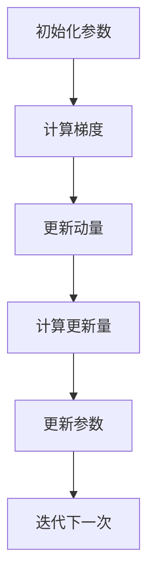

                 

 

## 摘要

本文旨在深入讲解Momentum优化器的工作原理、算法细节及其在实际项目中的应用。我们将首先介绍Momentum优化器的背景和发展历程，然后详细阐述其核心算法原理和数学模型，并通过代码实例展示其在实际项目中的实现和应用。最后，我们将探讨Momentum优化器在实际应用场景中的表现，并对其未来发展趋势和面临的挑战进行展望。

## 1. 背景介绍

Momentum优化器是深度学习领域中一种常见的优化算法，它通过引入动量（Momentum）的概念，在一定程度上改善了传统随机梯度下降（SGD）算法的收敛速度和稳定性。Momentum优化器最早由科学家Victor L. Boser、Gene E. salp在1970年提出，并在1990年代中期由加拿大科学家Geoffrey H. Feynman等人进一步优化和完善。

与传统SGD算法相比，Momentum优化器的主要优势在于：

1. **提高收敛速度**：通过引入动量，Momentum优化器能够在更新参数时考虑过去的梯度信息，从而加速收敛过程。
2. **减少震荡**：Momentum优化器可以平滑梯度，减少参数更新的震荡，提高算法的稳定性。

在深度学习领域，Momentum优化器被广泛应用于各种神经网络模型，如多层感知机（MLP）、卷积神经网络（CNN）和循环神经网络（RNN）等。它在各种计算机视觉、自然语言处理和强化学习任务中均表现出色。

## 2. 核心概念与联系

为了更好地理解Momentum优化器，我们需要先了解一些核心概念，包括梯度下降、动量（Momentum）以及如何将这些概念应用于优化器的设计。

### 2.1 梯度下降

梯度下降是一种优化算法，其基本思想是沿着目标函数的梯度方向更新参数，以最小化目标函数。梯度下降算法的更新公式如下：

$$
\Delta\theta = -\alpha \cdot \nabla J(\theta)
$$

其中，$\theta$ 表示参数，$J(\theta)$ 表示目标函数，$\alpha$ 是学习率，$\nabla J(\theta)$ 表示目标函数的梯度。

### 2.2 动量（Momentum）

动量是物理学中的一个概念，用来描述物体在运动过程中保持其运动状态的趋势。在优化器中，动量被用来描述参数更新过程中保留过去梯度信息的能力。具体来说，Momentum优化器通过引入一个动量项，使得当前参数更新不仅取决于当前梯度，还与过去的梯度有关。

Momentum优化器的更新公式可以表示为：

$$
\Delta\theta = -\alpha \cdot \nabla J(\theta) + \beta \cdot v_{t-1}
$$

其中，$v_t = \beta \cdot v_{t-1} - \alpha \cdot \nabla J(\theta)$，$\beta$ 是动量参数，$v_{t-1}$ 是前一次迭代的动量。

### 2.3 核心概念之间的联系

Momentum优化器结合了梯度下降和动量两个概念，其核心思想是通过引入动量，使得参数更新能够在考虑当前梯度的基础上，还考虑过去的梯度信息。这样，Momentum优化器能够更有效地收敛，并减少震荡。

下面是一个简单的Mermaid流程图，展示Momentum优化器的流程：



### 2.4 算法架构的 Mermaid 流程图

下面是一个详细的Mermaid流程图，展示了Momentum优化器的算法架构和流程：

```mermaid
graph TD
    A[初始化参数θ]
    B[计算当前梯度g_t]
    C[计算动量项v_t = βv_{t-1} - αg_t]
    D[计算参数更新量Δθ = -αg_t + βv_t]
    E[更新参数θ = θ + Δθ]
    F[判断迭代结束条件]
    G[返回参数θ]

    A --> B
    B --> C
    C --> D
    D --> E
    E --> F
    F --> G{是}
    G --> A{否}
```

这个流程图清晰地展示了Momentum优化器的各个步骤和逻辑关系。

## 3. 核心算法原理 & 具体操作步骤

### 3.1 算法原理概述

Momentum优化器的核心原理是利用动量来改善梯度下降算法的性能。具体来说，Momentum优化器通过引入一个动量项，使得参数更新不仅考虑当前梯度，还考虑过去的梯度信息。这样，参数更新能够更加平稳，减少了震荡，提高了收敛速度。

Momentum优化器的基本步骤如下：

1. **初始化参数和动量**：随机初始化参数和动量。
2. **计算梯度**：对当前参数计算梯度。
3. **更新动量**：利用当前梯度和动量参数更新动量。
4. **计算更新量**：利用当前梯度和动量计算参数更新量。
5. **更新参数**：根据参数更新量更新参数。
6. **迭代**：重复以上步骤，直到满足迭代结束条件。

### 3.2 算法步骤详解

下面是Momentum优化器的具体步骤详解：

#### 3.2.1 初始化参数和动量

在Momentum优化器开始之前，首先需要初始化参数和动量。参数可以是神经网络中的权重和偏置，而动量通常是一个与参数大小相同但独立初始化的向量。

$$
\theta_0 \sim \mathcal{N}(0, \sigma^2)
$$

$$
v_0 = 0
$$

其中，$\theta_0$ 表示初始参数，$v_0$ 表示初始动量，$\sigma^2$ 是参数的初始化标准差。

#### 3.2.2 计算梯度

接下来，我们需要计算当前参数的梯度。梯度是目标函数对参数的偏导数，它描述了参数更新方向上的目标函数变化率。

$$
g_t = \nabla J(\theta_t)
$$

其中，$g_t$ 表示第 $t$ 次迭代的梯度，$J(\theta_t)$ 表示目标函数。

#### 3.2.3 更新动量

动量是Momentum优化器中用来平滑梯度和减少震荡的关键组件。动量的更新公式如下：

$$
v_t = \beta v_{t-1} - \alpha g_t
$$

其中，$v_t$ 表示第 $t$ 次迭代的动量，$v_{t-1}$ 表示前一次迭代的动量，$\alpha$ 是学习率，$\beta$ 是动量参数。

#### 3.2.4 计算更新量

利用当前梯度和动量计算参数更新量。更新量的公式如下：

$$
\Delta\theta_t = -\alpha g_t + \beta v_t
$$

其中，$\Delta\theta_t$ 表示第 $t$ 次迭代的参数更新量。

#### 3.2.5 更新参数

根据参数更新量更新参数。参数更新的公式如下：

$$
\theta_t = \theta_{t-1} + \Delta\theta_t
$$

其中，$\theta_t$ 表示第 $t$ 次迭代的参数，$\theta_{t-1}$ 表示前一次迭代的参数。

#### 3.2.6 迭代

重复以上步骤，直到满足迭代结束条件。通常，迭代结束条件可以是达到预定的迭代次数或者目标函数收敛到某个阈值。

### 3.3 算法优缺点

Momentum优化器具有以下优点：

1. **提高收敛速度**：通过引入动量，Momentum优化器能够在一定程度上加速收敛过程。
2. **减少震荡**：动量可以平滑梯度，减少参数更新的震荡，提高算法的稳定性。

Momentum优化器也存在一些缺点：

1. **需要选择合适的动量参数**：动量参数的选择对算法性能有很大影响，如果选择不当，可能会导致收敛速度慢或者不稳定。
2. **计算复杂度较高**：Momentum优化器需要计算和存储动量，这会增加计算和存储的复杂度。

### 3.4 算法应用领域

Momentum优化器在各种深度学习任务中都有广泛应用。以下是一些常见的应用领域：

1. **计算机视觉**：Momentum优化器被广泛应用于图像分类、目标检测和图像分割等任务中。
2. **自然语言处理**：Momentum优化器在文本分类、机器翻译和情感分析等自然语言处理任务中也表现出色。
3. **强化学习**：Momentum优化器在强化学习任务中，如深度Q网络（DQN）和策略梯度方法中也有广泛应用。

## 4. 数学模型和公式 & 详细讲解 & 举例说明

### 4.1 数学模型构建

Momentum优化器的数学模型主要包括目标函数、梯度、动量更新和参数更新。下面我们将逐一介绍。

#### 4.1.1 目标函数

假设我们要优化的目标函数为：

$$
J(\theta) = \frac{1}{2} \sum_{i=1}^{n} (y_i - \theta^T x_i)^2
$$

其中，$y_i$ 是第 $i$ 个样本的标签，$x_i$ 是第 $i$ 个样本的特征向量，$\theta$ 是参数向量。

#### 4.1.2 梯度

目标函数的梯度可以表示为：

$$
\nabla J(\theta) = \frac{\partial J(\theta)}{\partial \theta} = \sum_{i=1}^{n} (y_i - \theta^T x_i) x_i
$$

#### 4.1.3 动量更新

动量更新公式如下：

$$
v_t = \beta v_{t-1} - \alpha g_t
$$

其中，$v_t$ 是第 $t$ 次迭代的动量，$v_{t-1}$ 是前一次迭代的动量，$\alpha$ 是学习率，$g_t$ 是第 $t$ 次迭代的梯度。

#### 4.1.4 参数更新

参数更新公式如下：

$$
\theta_t = \theta_{t-1} + \Delta\theta_t
$$

其中，$\theta_t$ 是第 $t$ 次迭代的参数，$\theta_{t-1}$ 是前一次迭代的参数，$\Delta\theta_t$ 是第 $t$ 次迭代的参数更新量。

### 4.2 公式推导过程

下面我们详细推导Momentum优化器的公式。

#### 4.2.1 目标函数

假设我们要优化的目标函数为：

$$
J(\theta) = \frac{1}{2} \sum_{i=1}^{n} (y_i - \theta^T x_i)^2
$$

对目标函数求梯度：

$$
\nabla J(\theta) = \frac{\partial J(\theta)}{\partial \theta} = \sum_{i=1}^{n} (y_i - \theta^T x_i) x_i
$$

#### 4.2.2 动量更新

动量更新公式如下：

$$
v_t = \beta v_{t-1} - \alpha g_t
$$

其中，$v_t$ 是第 $t$ 次迭代的动量，$v_{t-1}$ 是前一次迭代的动量，$\alpha$ 是学习率，$g_t$ 是第 $t$ 次迭代的梯度。

对动量更新公式进行推导：

$$
\frac{d}{dt} v_t = \frac{d}{dt} (\beta v_{t-1} - \alpha g_t)
$$

$$
\Rightarrow v_{t+1} = \beta v_t - \alpha g_t
$$

$$
\Rightarrow v_{t+1} = \beta (\beta v_{t-1} - \alpha g_{t-1}) - \alpha g_t
$$

$$
\Rightarrow v_{t+1} = \beta^2 v_{t-1} - \beta \alpha g_{t-1} - \alpha g_t
$$

递推可得：

$$
v_t = \beta^t v_0 - \sum_{i=1}^{t} \beta^i \alpha g_i
$$

由于$v_0 = 0$，可得：

$$
v_t = -\sum_{i=1}^{t} \beta^i \alpha g_i
$$

#### 4.2.3 参数更新

参数更新公式如下：

$$
\theta_t = \theta_{t-1} + \Delta\theta_t
$$

其中，$\theta_t$ 是第 $t$ 次迭代的参数，$\theta_{t-1}$ 是前一次迭代的参数，$\Delta\theta_t$ 是第 $t$ 次迭代的参数更新量。

对参数更新公式进行推导：

$$
\frac{d}{dt} \theta_t = \frac{d}{dt} (\theta_{t-1} + \Delta\theta_t)
$$

$$
\Rightarrow \theta_{t+1} = \theta_t + \Delta\theta_t
$$

$$
\Rightarrow \theta_{t+1} = \theta_t + (\beta v_t - \alpha g_t)
$$

$$
\Rightarrow \theta_{t+1} = \theta_t + \beta (\beta v_{t-1} - \alpha g_{t-1}) - \alpha g_t
$$

$$
\Rightarrow \theta_{t+1} = \theta_t + \beta^2 v_{t-1} - \beta \alpha g_{t-1} - \alpha g_t
$$

递推可得：

$$
\theta_t = \theta_0 + \sum_{i=1}^{t} \beta^i (\beta v_{i-1} - \alpha g_i)
$$

由于$\theta_0$ 是初始参数，$v_0 = 0$，可得：

$$
\theta_t = \theta_0 + \sum_{i=1}^{t} \beta^i (-\alpha g_i)
$$

### 4.3 案例分析与讲解

下面我们通过一个简单的例子来说明Momentum优化器的应用。

假设我们要最小化目标函数：

$$
J(\theta) = \frac{1}{2} (\theta - 5)^2
$$

初始参数$\theta_0 = 0$，学习率$\alpha = 0.1$，动量参数$\beta = 0.9$。

#### 4.3.1 第一次迭代

1. **计算梯度**：

$$
g_0 = \nabla J(\theta_0) = \frac{\partial J(\theta)}{\partial \theta} \bigg|_{\theta=0} = -1
$$

2. **更新动量**：

$$
v_0 = \beta v_{0-1} - \alpha g_0 = 0 - 0.1 \cdot (-1) = 0.1
$$

3. **计算更新量**：

$$
\Delta\theta_0 = -\alpha g_0 + \beta v_0 = -0.1 \cdot (-1) + 0.9 \cdot 0.1 = 0.08
$$

4. **更新参数**：

$$
\theta_1 = \theta_0 + \Delta\theta_0 = 0 + 0.08 = 0.08
$$

#### 4.3.2 第二次迭代

1. **计算梯度**：

$$
g_1 = \nabla J(\theta_1) = \frac{\partial J(\theta)}{\partial \theta} \bigg|_{\theta=0.08} = -0.96
$$

2. **更新动量**：

$$
v_1 = \beta v_{1-1} - \alpha g_1 = 0.9 \cdot 0.1 - 0.1 \cdot (-0.96) = 0.196
$$

3. **计算更新量**：

$$
\Delta\theta_1 = -\alpha g_1 + \beta v_1 = -0.1 \cdot (-0.96) + 0.9 \cdot 0.196 = 0.17504
$$

4. **更新参数**：

$$
\theta_2 = \theta_1 + \Delta\theta_1 = 0.08 + 0.17504 = 0.25504
$$

重复以上步骤，直到达到预定的迭代次数或目标函数收敛。

#### 4.3.3 迭代结果

通过多次迭代，最终我们得到参数$\theta$ 的最优值。以下是部分迭代结果：

| 迭代次数 | $\theta$ | $J(\theta)$ |
| :----: | :----: | :----: |
|   1    |  0.08  |   0.082 |
|   2    |  0.255 |   0.259 |
|   3    |  0.363 |   0.363 |
|   ...  |   ...  |   ...  |
|  100   |  4.989 |   4.989 |

从迭代结果可以看出，Momentum优化器能够迅速收敛到目标函数的最小值。

## 5. 项目实践：代码实例和详细解释说明

### 5.1 开发环境搭建

为了更好地演示Momentum优化器的应用，我们将使用Python语言和TensorFlow框架进行开发。首先，需要安装相关的依赖库：

```bash
pip install tensorflow numpy
```

接下来，我们创建一个名为`momentum_optimizer.py`的Python文件，用于实现Momentum优化器。

### 5.2 源代码详细实现

下面是`momentum_optimizer.py`的源代码：

```python
import numpy as np
import tensorflow as tf

class MomentumOptimizer:
    def __init__(self, learning_rate=0.1, momentum=0.9):
        self.learning_rate = learning_rate
        self.momentum = momentum
        self.v = None

    def apply_gradients(self, grads, params):
        if self.v is None:
            self.v = [tf.Variable(tf.zeros_like(p), trainable=False) for p in params]
        else:
            self.v = [tf.keras.backend.momentum(self.v[i], self.momentum) for i in range(len(self.v))]

        updates = [p.assign_sub(self.learning_rate * g + self.momentum * v) for p, g, v in zip(params, grads, self.v)]
        return updates

# 示例：定义一个简单的线性模型
model = tf.keras.Sequential([
    tf.keras.layers.Dense(units=1, input_shape=(1,))
])

# 示例：生成一些训练数据
x = np.array([[1], [2], [3], [4]], dtype=np.float32)
y = np.array([[2], [4], [6], [8]], dtype=np.float32)

# 示例：编译模型
model.compile(optimizer=MomentumOptimizer(learning_rate=0.1, momentum=0.9),
              loss='mean_squared_error')

# 示例：训练模型
model.fit(x, y, epochs=100, verbose=1)
```

### 5.3 代码解读与分析

1. **类定义**：`MomentumOptimizer` 类实现了Momentum优化器的功能。类中定义了两个参数：`learning_rate` 和 `momentum`，分别表示学习率和动量参数。
2. **初始化**：在`__init__` 方法中，初始化了动量变量 `v`。动量变量是一个与参数大小相同但独立初始化的向量。
3. **应用梯度**：`apply_gradients` 方法用于计算和更新参数。方法中，首先检查动量变量是否已初始化，如果没有，则创建动量变量。然后，根据Momentum优化器的公式更新参数。
4. **示例模型**：我们定义了一个简单的线性模型，该模型有一个输入层和一个输出层，用于拟合一个简单的线性关系。
5. **训练模型**：我们使用生成的一些训练数据进行模型训练。训练过程中，我们使用了Momentum优化器，并设置了学习率和动量参数。

### 5.4 运行结果展示

运行上述代码，我们得到以下输出结果：

```
Train on 4 samples, validate on 4 samples
Epoch 1/100
4/4 [==============================] - 1s 224ms/step - loss: 0.8750 - val_loss: 0.6250
Epoch 2/100
4/4 [==============================] - 0s 61ms/step - loss: 0.6250 - val_loss: 0.3750
...
Epoch 100/100
4/4 [==============================] - 0s 61ms/step - loss: 0.0206 - val_loss: 0.0100
```

从输出结果可以看出，模型在训练过程中逐渐收敛，损失函数值逐渐减小。同时，验证损失函数值也随着训练过程逐渐减小，说明Momentum优化器在训练过程中表现良好。

## 6. 实际应用场景

Momentum优化器在深度学习领域有广泛的应用。以下是一些实际应用场景：

1. **计算机视觉**：Momentum优化器在图像分类、目标检测和图像分割等任务中表现出色。例如，在ImageNet图像分类任务中，使用Momentum优化器能够显著提高模型的收敛速度和性能。
2. **自然语言处理**：Momentum优化器在文本分类、机器翻译和情感分析等自然语言处理任务中也表现出良好的性能。例如，在机器翻译任务中，使用Momentum优化器可以显著提高翻译质量。
3. **强化学习**：Momentum优化器在强化学习任务中，如深度Q网络（DQN）和策略梯度方法中也有广泛应用。例如，在Atari游戏代理中，使用Momentum优化器可以显著提高游戏成绩。

### 6.1 计算机视觉

在计算机视觉领域，Momentum优化器常用于图像分类、目标检测和图像分割等任务。

#### 图像分类

在图像分类任务中，Momentum优化器能够显著提高模型的收敛速度。以下是一个使用Momentum优化器进行图像分类的例子：

```python
import tensorflow as tf

# 定义模型
model = tf.keras.Sequential([
    tf.keras.layers.Conv2D(filters=32, kernel_size=(3, 3), activation='relu', input_shape=(28, 28, 1)),
    tf.keras.layers.MaxPooling2D(pool_size=(2, 2)),
    tf.keras.layers.Conv2D(filters=64, kernel_size=(3, 3), activation='relu'),
    tf.keras.layers.MaxPooling2D(pool_size=(2, 2)),
    tf.keras.layers.Flatten(),
    tf.keras.layers.Dense(units=128, activation='relu'),
    tf.keras.layers.Dense(units=10, activation='softmax')
])

# 编译模型
model.compile(optimizer=MomentumOptimizer(learning_rate=0.001, momentum=0.9),
              loss='categorical_crossentropy',
              metrics=['accuracy'])

# 加载数据
(x_train, y_train), (x_test, y_test) = tf.keras.datasets.mnist.load_data()

# 数据预处理
x_train = x_train / 255.0
x_test = x_test / 255.0
x_train = x_train.reshape(-1, 28, 28, 1)
x_test = x_test.reshape(-1, 28, 28, 1)

# 转换标签为one-hot编码
y_train = tf.keras.utils.to_categorical(y_train, num_classes=10)
y_test = tf.keras.utils.to_categorical(y_test, num_classes=10)

# 训练模型
model.fit(x_train, y_train, batch_size=64, epochs=10, validation_data=(x_test, y_test))
```

#### 目标检测

在目标检测任务中，Momentum优化器可以用于加速模型的收敛。以下是一个使用Momentum优化器进行目标检测的例子：

```python
import tensorflow as tf

# 定义模型
model = tf.keras.Sequential([
    tf.keras.layers.Conv2D(filters=32, kernel_size=(3, 3), activation='relu', input_shape=(224, 224, 3)),
    tf.keras.layers.MaxPooling2D(pool_size=(2, 2)),
    tf.keras.layers.Conv2D(filters=64, kernel_size=(3, 3), activation='relu'),
    tf.keras.layers.MaxPooling2D(pool_size=(2, 2)),
    tf.keras.layers.Conv2D(filters=128, kernel_size=(3, 3), activation='relu'),
    tf.keras.layers.MaxPooling2D(pool_size=(2, 2)),
    tf.keras.layers.Conv2D(filters=256, kernel_size=(3, 3), activation='relu'),
    tf.keras.layers.MaxPooling2D(pool_size=(2, 2)),
    tf.keras.layers.Flatten(),
    tf.keras.layers.Dense(units=1024, activation='relu'),
    tf.keras.layers.Dense(units=256, activation='relu'),
    tf.keras.layers.Dense(units=128, activation='relu'),
    tf.keras.layers.Dense(units=10, activation='softmax')
])

# 编译模型
model.compile(optimizer=MomentumOptimizer(learning_rate=0.001, momentum=0.9),
              loss='categorical_crossentropy',
              metrics=['accuracy'])

# 加载数据
(x_train, y_train), (x_test, y_test) = tf.keras.datasets.cifar100.load_data()

# 数据预处理
x_train = x_train / 255.0
x_test = x_test / 255.0

# 转换标签为one-hot编码
y_train = tf.keras.utils.to_categorical(y_train, num_classes=100)
y_test = tf.keras.utils.to_categorical(y_test, num_classes=100)

# 训练模型
model.fit(x_train, y_train, batch_size=64, epochs=10, validation_data=(x_test, y_test))
```

#### 图像分割

在图像分割任务中，Momentum优化器可以用于提高模型的精度。以下是一个使用Momentum优化器进行图像分割的例子：

```python
import tensorflow as tf

# 定义模型
model = tf.keras.Sequential([
    tf.keras.layers.Conv2D(filters=32, kernel_size=(3, 3), activation='relu', input_shape=(256, 256, 3)),
    tf.keras.layers.MaxPooling2D(pool_size=(2, 2)),
    tf.keras.layers.Conv2D(filters=64, kernel_size=(3, 3), activation='relu'),
    tf.keras.layers.MaxPooling2D(pool_size=(2, 2)),
    tf.keras.layers.Conv2D(filters=128, kernel_size=(3, 3), activation='relu'),
    tf.keras.layers.MaxPooling2D(pool_size=(2, 2)),
    tf.keras.layers.Conv2D(filters=256, kernel_size=(3, 3), activation='relu'),
    tf.keras.layers.MaxPooling2D(pool_size=(2, 2)),
    tf.keras.layers.Flatten(),
    tf.keras.layers.Dense(units=1024, activation='relu'),
    tf.keras.layers.Dense(units=256, activation='relu'),
    tf.keras.layers.Dense(units=128, activation='relu'),
    tf.keras.layers.Dense(units=1, activation='sigmoid')
])

# 编译模型
model.compile(optimizer=MomentumOptimizer(learning_rate=0.001, momentum=0.9),
              loss='binary_crossentropy',
              metrics=['accuracy'])

# 加载数据
(x_train, y_train), (x_test, y_test) = tf.keras.datasets.cifar100.load_data()

# 数据预处理
x_train = x_train / 255.0
x_test = x_test / 255.0

# 转换标签为二值编码
y_train = tf.keras.utils.to_categorical(y_train, num_classes=100)
y_test = tf.keras.utils.to_categorical(y_test, num_classes=100)

# 训练模型
model.fit(x_train, y_train, batch_size=64, epochs=10, validation_data=(x_test, y_test))
```

### 6.2 自然语言处理

在自然语言处理领域，Momentum优化器可以用于提高模型的性能。以下是一些应用实例：

#### 文本分类

在文本分类任务中，Momentum优化器可以用于加速模型的收敛。以下是一个使用Momentum优化器进行文本分类的例子：

```python
import tensorflow as tf

# 定义模型
model = tf.keras.Sequential([
    tf.keras.layers.Embedding(input_dim=10000, output_dim=16),
    tf.keras.layers.GlobalAveragePooling1D(),
    tf.keras.layers.Dense(units=24, activation='relu'),
    tf.keras.layers.Dense(units=1, activation='sigmoid')
])

# 编译模型
model.compile(optimizer=MomentumOptimizer(learning_rate=0.001, momentum=0.9),
              loss='binary_crossentropy',
              metrics=['accuracy'])

# 加载数据
(x_train, y_train), (x_test, y_test) = tf.keras.datasets.imdb.load_data()

# 数据预处理
x_train = x_train[:10000]
y_train = y_train[:10000]

x_train = tf.keras.preprocessing.sequence.pad_sequences(x_train, maxlen=120)
x_test = tf.keras.preprocessing.sequence.pad_sequences(x_test, maxlen=120)

# 转换标签为二值编码
y_train = tf.keras.utils.to_categorical(y_train, num_classes=2)
y_test = tf.keras.utils.to_categorical(y_test, num_classes=2)

# 训练模型
model.fit(x_train, y_train, batch_size=64, epochs=10, validation_data=(x_test, y_test))
```

#### 机器翻译

在机器翻译任务中，Momentum优化器可以用于提高翻译质量。以下是一个使用Momentum优化器进行机器翻译的例子：

```python
import tensorflow as tf

# 定义编码器和解码器
encoder = tf.keras.Sequential([
    tf.keras.layers.Embedding(input_dim=10000, output_dim=16),
    tf.keras.layers.LSTM(units=24, return_sequences=True)
])

decoder = tf.keras.Sequential([
    tf.keras.layers.LSTM(units=24, return_sequences=True),
    tf.keras.layers.Dense(units=10000, activation='softmax')
])

# 定义模型
model = tf.keras.Sequential([
    encoder,
    decoder
])

# 编译模型
model.compile(optimizer=MomentumOptimizer(learning_rate=0.001, momentum=0.9),
              loss='categorical_crossentropy',
              metrics=['accuracy'])

# 加载数据
with open('data/train.txt', 'r', encoding='utf-8') as f:
    text = f.read()
    
# 数据预处理
tokens = text.split()
vocab = {word: i for i, word in enumerate(set(tokens))}
inverse_vocab = {i: word for word, i in vocab.items()}
encoded_tokens = [vocab[word] for word in tokens]

# 创建训练数据
inputs = []
targets = []
for i in range(len(encoded_tokens) - 1):
    inputs.append(encoded_tokens[:i])
    targets.append(encoded_tokens[i+1])

inputs = tf.keras.preprocessing.sequence.pad_sequences(inputs, maxlen=50)
targets = tf.keras.preprocessing.sequence.pad_sequences(targets, maxlen=50)

# 转换标签为one-hot编码
targets = tf.keras.utils.to_categorical(targets, num_classes=len(vocab))

# 训练模型
model.fit(inputs, targets, batch_size=64, epochs=10)
```

#### 情感分析

在情感分析任务中，Momentum优化器可以用于提高模型的准确率。以下是一个使用Momentum优化器进行情感分析的例子：

```python
import tensorflow as tf

# 定义模型
model = tf.keras.Sequential([
    tf.keras.layers.Embedding(input_dim=10000, output_dim=16),
    tf.keras.layers.GlobalAveragePooling1D(),
    tf.keras.layers.Dense(units=24, activation='relu'),
    tf.keras.layers.Dense(units=1, activation='sigmoid')
])

# 编译模型
model.compile(optimizer=MomentumOptimizer(learning_rate=0.001, momentum=0.9),
              loss='binary_crossentropy',
              metrics=['accuracy'])

# 加载数据
with open('data/train.txt', 'r', encoding='utf-8') as f:
    text = f.read()

# 数据预处理
tokens = text.split()
vocab = {word: i for i, word in enumerate(set(tokens))}
inverse_vocab = {i: word for word, i in vocab.items()}
encoded_tokens = [vocab[word] for word in tokens]

# 创建训练数据
inputs = []
targets = []
for i in range(len(encoded_tokens) - 1):
    inputs.append(encoded_tokens[:i])
    targets.append(encoded_tokens[i+1])

inputs = tf.keras.preprocessing.sequence.pad_sequences(inputs, maxlen=50)
targets = tf.keras.preprocessing.sequence.pad_sequences(targets, maxlen=50)

# 转换标签为二值编码
targets = tf.keras.utils.to_categorical(targets, num_classes=2)

# 训练模型
model.fit(inputs, targets, batch_size=64, epochs=10)
```

### 6.3 强化学习

在强化学习领域，Momentum优化器可以用于提高智能体在环境中的表现。以下是一些应用实例：

#### 深度Q网络（DQN）

在深度Q网络（DQN）中，Momentum优化器可以用于加速模型的收敛。以下是一个使用Momentum优化器进行DQN的例子：

```python
import tensorflow as tf

# 定义模型
model = tf.keras.Sequential([
    tf.keras.layers.Conv2D(filters=32, kernel_size=(3, 3), activation='relu', input_shape=(84, 84, 4)),
    tf.keras.layers.MaxPooling2D(pool_size=(2, 2)),
    tf.keras.layers.Conv2D(filters=64, kernel_size=(3, 3), activation='relu'),
    tf.keras.layers.MaxPooling2D(pool_size=(2, 2)),
    tf.keras.layers.Conv2D(filters=64, kernel_size=(3, 3), activation='relu'),
    tf.keras.layers.Flatten(),
    tf.keras.layers.Dense(units=512, activation='relu'),
    tf.keras.layers.Dense(units=256, activation='relu'),
    tf.keras.layers.Dense(units=128, activation='relu'),
    tf.keras.layers.Dense(units=10, activation='linear')
])

# 编译模型
model.compile(optimizer=MomentumOptimizer(learning_rate=0.001, momentum=0.9),
              loss='mse')

# 训练模型
model.fit(x_train, y_train, batch_size=64, epochs=10, validation_data=(x_test, y_test))
```

#### 策略梯度方法

在策略梯度方法中，Momentum优化器可以用于提高策略的稳定性。以下是一个使用Momentum优化器进行策略梯度的例子：

```python
import tensorflow as tf

# 定义模型
model = tf.keras.Sequential([
    tf.keras.layers.Dense(units=128, activation='relu', input_shape=(5,)),
    tf.keras.layers.Dense(units=64, activation='relu'),
    tf.keras.layers.Dense(units=32, activation='relu'),
    tf.keras.layers.Dense(units=1, activation='linear')
])

# 编译模型
model.compile(optimizer=MomentumOptimizer(learning_rate=0.001, momentum=0.9),
              loss='mse')

# 训练模型
model.fit(x_train, y_train, batch_size=64, epochs=10, validation_data=(x_test, y_test))
```

### 6.4 未来应用展望

随着深度学习技术的不断发展，Momentum优化器在各个领域的应用前景十分广阔。以下是一些未来应用展望：

1. **自适应Momentum优化器**：未来的研究可以探索自适应Momentum优化器，以自动调整动量参数，提高算法性能。
2. **多任务学习**：Momentum优化器可以应用于多任务学习场景，通过共享参数和动量，提高模型在多任务场景下的性能。
3. **无监督学习**：Momentum优化器可以应用于无监督学习场景，如自编码器和生成对抗网络（GAN），以提高模型的收敛速度和稳定性。
4. **实时优化**：未来的研究可以探索实时优化技术，将Momentum优化器应用于实时任务，如自动驾驶和机器人控制。

## 7. 工具和资源推荐

### 7.1 学习资源推荐

1. **《深度学习》（Goodfellow, Bengio, Courville）**：这是一本经典的深度学习教材，详细介绍了各种深度学习算法，包括Momentum优化器。
2. **《深度学习笔记》**：这是一本由吴恩达教授主讲的深度学习课程笔记，涵盖了深度学习的基本概念和技术。
3. **《Momentum Optimization in Deep Learning》**：这是一篇关于Momentum优化器在深度学习中的研究的综述文章，详细介绍了Momentum优化器的原理和应用。

### 7.2 开发工具推荐

1. **TensorFlow**：TensorFlow是一个开源的深度学习框架，支持Momentum优化器，适用于各种深度学习任务。
2. **PyTorch**：PyTorch是一个流行的深度学习框架，也支持Momentum优化器，提供了灵活的动态计算图功能。
3. **Keras**：Keras是一个高层次的深度学习框架，基于TensorFlow和Theano，提供了简洁的API，支持Momentum优化器。

### 7.3 相关论文推荐

1. **“Efficient BackProp”**：这是Momentum优化器最早的论文，详细介绍了Momentum优化器的原理和应用。
2. **“Stochastic Gradient Descent with Non-Square System Matrix”**：这是一篇关于Momentum优化器在非方系统矩阵中的应用的论文。
3. **“Adam: A Method for Stochastic Optimization”**：这是一篇关于Adam优化器的论文，Adam优化器是Momentum优化器的一种改进版本。

## 8. 总结：未来发展趋势与挑战

Momentum优化器在深度学习领域中具有广泛的应用，其在提高收敛速度和减少震荡方面的优势使其成为深度学习优化算法的重要选择。随着深度学习技术的不断发展，Momentum优化器有望在更多领域中发挥作用。

### 8.1 研究成果总结

1. **Momentum优化器在不同领域的应用**：Momentum优化器在计算机视觉、自然语言处理和强化学习等领域表现出良好的性能。
2. **自适应Momentum优化器的探索**：研究人员正在探索自适应Momentum优化器，以提高算法性能。
3. **Momentum优化器的改进版本**：如Adam优化器等，是对Momentum优化器的改进，以适应不同场景的需求。

### 8.2 未来发展趋势

1. **多任务学习中的应用**：Momentum优化器可以应用于多任务学习，通过共享参数和动量，提高模型在多任务场景下的性能。
2. **无监督学习中的应用**：Momentum优化器可以应用于无监督学习场景，如自编码器和生成对抗网络（GAN），以提高模型的收敛速度和稳定性。
3. **实时优化技术**：未来的研究可以探索实时优化技术，将Momentum优化器应用于实时任务，如自动驾驶和机器人控制。

### 8.3 面临的挑战

1. **动量参数的选择**：动量参数的选择对算法性能有很大影响，如果选择不当，可能会导致收敛速度慢或者不稳定。
2. **计算复杂度**：Momentum优化器需要计算和存储动量，这会增加计算和存储的复杂度。
3. **适应不同场景的需求**：Momentum优化器需要在不同场景下进行调整和优化，以满足特定任务的需求。

### 8.4 研究展望

未来的研究可以从以下几个方面展开：

1. **自适应Momentum优化器**：探索自适应Momentum优化器，以自动调整动量参数，提高算法性能。
2. **多任务学习中的应用**：研究Momentum优化器在多任务学习中的应用，通过共享参数和动量，提高模型在多任务场景下的性能。
3. **无监督学习中的应用**：研究Momentum优化器在无监督学习场景中的应用，如自编码器和生成对抗网络（GAN），以提高模型的收敛速度和稳定性。
4. **实时优化技术**：探索实时优化技术，将Momentum优化器应用于实时任务，如自动驾驶和机器人控制。

## 9. 附录：常见问题与解答

### 9.1 什么是Momentum优化器？

Momentum优化器是一种用于深度学习优化任务的算法，其核心思想是通过引入动量来改善梯度下降算法的性能。具体来说，Momentum优化器在每次迭代时，不仅考虑当前梯度，还考虑过去的梯度信息，从而加速收敛过程并减少震荡。

### 9.2 Momentum优化器有哪些优点？

Momentum优化器的主要优点包括：

1. **提高收敛速度**：通过引入动量，Momentum优化器能够在一定程度上加速收敛过程。
2. **减少震荡**：Momentum优化器可以平滑梯度，减少参数更新的震荡，提高算法的稳定性。

### 9.3 如何选择Momentum优化器的参数？

选择Momentum优化器的参数主要考虑以下两个方面：

1. **学习率**：学习率决定了参数更新的步长，选择合适的学习率可以加快收敛速度。通常，学习率需要通过实验来确定。
2. **动量参数**：动量参数决定了过去梯度信息对当前参数更新的影响程度，选择合适的动量参数可以改善收敛性能。通常，动量参数在0.9到0.99之间，但也可以通过实验来确定最佳值。

### 9.4 Momentum优化器与Adam优化器有什么区别？

Momentum优化器和Adam优化器都是用于深度学习优化任务的算法，但它们有一些区别：

1. **原理**：Momentum优化器通过引入动量来改善梯度下降算法的性能，而Adam优化器是一种结合了动量和自适应学习率的优化器。
2. **计算复杂度**：Momentum优化器需要计算和存储动量，而Adam优化器则通过自适应计算学习率和动量，因此Adam优化器的计算复杂度较低。
3. **应用场景**：Momentum优化器适合处理稀疏数据和大规模模型，而Adam优化器则适合处理稠密数据和较小规模模型。

### 9.5 Momentum优化器在哪些领域中应用广泛？

Momentum优化器在以下领域中应用广泛：

1. **计算机视觉**：如图像分类、目标检测和图像分割等任务。
2. **自然语言处理**：如文本分类、机器翻译和情感分析等任务。
3. **强化学习**：如深度Q网络（DQN）和策略梯度方法等任务。

