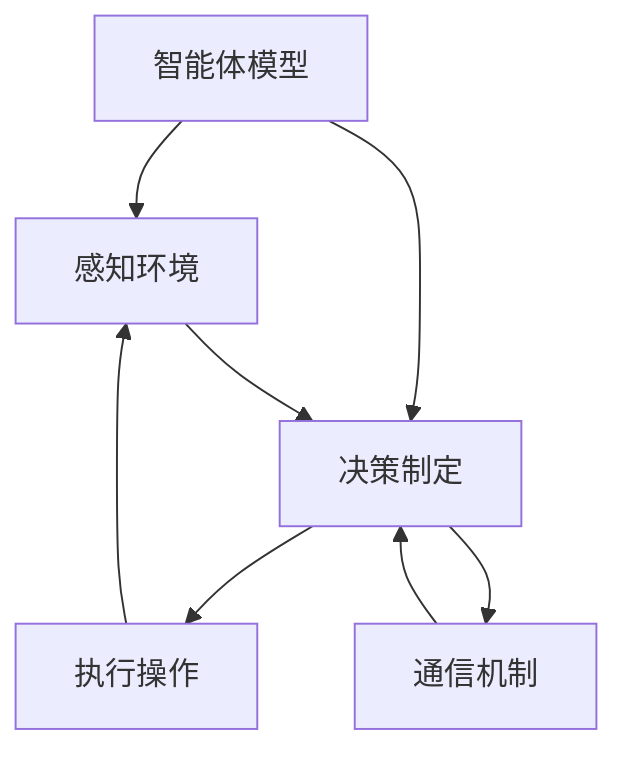

                 

在当今的信息技术世界中，多智能体协作（Multiagent Collaboration）已经成为推动技术创新和应用的关键驱动力。无论是自主无人驾驶汽车、智能供应链管理，还是高级人工智能决策系统，多智能体的协同工作都扮演着至关重要的角色。本文将深入探讨多智能体协作的基本概念、核心算法原理、数学模型、实际应用案例，并展望其未来的发展趋势与挑战。

## 关键词

- 多智能体系统
- 协作框架
- 多目标优化
- 通信协议
- 自适应学习

## 摘要

本文旨在介绍多智能体协作的基本概念和原理，通过具体的算法步骤、数学模型以及实际应用案例，展示多智能体系统在复杂环境中的协同能力和优势。文章还将探讨多智能体协作在信息技术、工业自动化、金融服务等领域的应用前景，并提出未来研究的发展方向。

### 1. 背景介绍

多智能体系统（MAS）是指由多个自主智能体组成的系统，这些智能体可以在动态环境中通过相互协作完成任务。在过去的几十年中，随着计算机科学和人工智能技术的飞速发展，多智能体系统的研究逐渐成为一个热点领域。多智能体协作的关键在于如何实现智能体之间的有效通信、协调以及决策。

在信息技术领域，多智能体协作的应用日益广泛。例如，在无人驾驶领域，多个无人车通过协作可以优化路线、避免碰撞，提高交通效率。在智能供应链管理中，多智能体系统能够实时调整库存、优化物流，提高供应链的整体响应速度。此外，在金融服务领域，多智能体协作可以帮助银行和金融机构实现更高效的风险管理和投资决策。

### 2. 核心概念与联系

#### 2.1 多智能体系统的定义

多智能体系统是指由多个智能体组成的系统，这些智能体可以相互协作，以实现共同的目标。智能体通常是一个具有感知、决策和执行能力的实体。在多智能体系统中，智能体可以通过通信协议进行信息交换，并通过协作机制实现共同的任务。

#### 2.2 多智能体协作的框架

多智能体协作框架包括以下几个关键组成部分：

- **智能体模型**：定义智能体的感知、决策和执行能力。
- **通信机制**：确保智能体之间的信息交换和协调。
- **协作算法**：指导智能体如何进行协同决策和任务分配。
- **环境模型**：描述系统运行的环境，包括外部因素和约束条件。

下面是一个用 Mermaid 描述的多智能体协作框架的流程图：



### 3. 核心算法原理 & 具体操作步骤

#### 3.1 算法原理概述

多智能体协作的核心算法主要包括以下几个步骤：

1. **环境感知**：智能体通过传感器收集环境信息。
2. **决策制定**：基于感知信息，智能体独立进行决策。
3. **任务分配**：智能体之间根据决策结果进行任务分配。
4. **执行操作**：智能体执行分配的任务，并对执行结果进行反馈。
5. **通信协调**：智能体之间通过通信机制共享信息，优化协作效果。

#### 3.2 算法步骤详解

1. **初始化**：每个智能体初始化自身的状态，并确定协作的目标。
2. **感知**：智能体收集环境数据，并进行分析。
3. **决策**：智能体根据环境数据和预定的策略进行决策。
4. **任务分配**：智能体之间通过协商算法分配任务。
5. **执行**：智能体执行分配的任务，并实时调整策略。
6. **反馈**：智能体将执行结果反馈给其他智能体，并更新环境模型。

#### 3.3 算法优缺点

**优点**：

- **灵活性**：多智能体系统能够适应动态环境，并快速调整策略。
- **分布式**：智能体之间的任务分配和决策过程是分布式的，减少了中心节点的负担。
- **容错性**：单个智能体的失效不会影响整个系统的运行。

**缺点**：

- **通信开销**：智能体之间的通信可能导致系统性能下降。
- **同步问题**：智能体之间的同步困难可能影响协作效果。
- **协同决策**：智能体之间的协同决策复杂，需要高效的算法支持。

#### 3.4 算法应用领域

多智能体协作算法在以下领域有广泛应用：

- **无人驾驶**：通过多个无人车之间的协作，实现智能交通管理。
- **供应链管理**：优化库存管理和物流配送。
- **金融风控**：实现智能化的风险评估和投资决策。
- **智能制造**：优化生产流程和资源调度。

### 4. 数学模型和公式 & 详细讲解 & 举例说明

#### 4.1 数学模型构建

在多智能体协作中，常用的数学模型包括：

1. **马尔可夫决策过程（MDP）**：描述智能体在不确定环境中进行决策的过程。
2. **贝叶斯网络**：用于表示智能体之间的依赖关系。
3. **博弈论**：分析多智能体之间的交互和竞争。

#### 4.2 公式推导过程

以马尔可夫决策过程为例，其基本公式为：

$$
V^*(s) = \max_{a} \sum_{s'} p(s'|s,a) \cdot [r(s',a) + \gamma V^*(s')]
$$

其中，\(V^*(s)\) 是状态值函数，\(s\) 是当前状态，\(a\) 是智能体选择的动作，\(s'\) 是下一状态，\(p(s'|s,a)\) 是状态转移概率，\(r(s',a)\) 是智能体在状态\(s'\)下执行动作\(a\)所获得的回报，\(\gamma\) 是折现因子。

#### 4.3 案例分析与讲解

假设一个无人驾驶系统需要在道路上行驶，其状态空间为“当前道路状况、车辆位置和速度”，动作空间为“加速、减速、保持当前速度”。通过马尔可夫决策过程，智能体可以计算出最优动作，以最大化长期回报。

### 5. 项目实践：代码实例和详细解释说明

#### 5.1 开发环境搭建

在本文中，我们将使用 Python 作为编程语言，利用流行的多智能体协作库如 `pyari` 来构建一个简单的多智能体协作系统。

```python
pip install pyari
```

#### 5.2 源代码详细实现

以下是一个简单的多智能体协作系统的代码实现：

```python
from pyari import Agent, Environment

# 定义智能体类
class SmartAgent(Agent):
    def __init__(self, id):
        super().__init__(id)
    
    def perceive(self):
        # 感知环境
        return self.env.get_perception()
    
    def decide(self, perception):
        # 决策制定
        return self.env.decide(perception)
    
    def act(self, action):
        # 执行操作
        return self.env.act(action)
    
    def update(self, feedback):
        # 更新环境模型
        self.env.update(feedback)

# 定义环境类
class SimpleEnvironment(Environment):
    def __init__(self):
        super().__init__()
        self.perception = None
    
    def get_perception(self):
        # 返回感知信息
        return self.perception
    
    def decide(self, perception):
        # 根据感知信息做出决策
        if perception > 0:
            return '加速'
        else:
            return '减速'
    
    def act(self, action):
        # 执行动作
        if action == '加速':
            self.perception += 1
        else:
            self.perception -= 1
    
    def update(self, feedback):
        # 更新环境状态
        pass
```

#### 5.3 代码解读与分析

在上面的代码中，我们定义了智能体类 `SmartAgent` 和环境类 `SimpleEnvironment`。智能体类实现了感知、决策、执行和更新的功能，而环境类则提供了基本的感知、决策、执行和更新的接口。

通过创建智能体实例和配置环境，我们可以构建一个简单的多智能体协作系统，实现智能体之间的协同工作。

```python
# 创建智能体和环境
agent = SmartAgent('agent1')
env = SimpleEnvironment()

# 模拟智能体与环境之间的交互
for _ in range(10):
    perception = env.get_perception()
    action = agent.decide(perception)
    feedback = agent.act(action)
    agent.update(feedback)
```

#### 5.4 运行结果展示

运行上述代码，我们可以观察到智能体在环境中的交互过程。通过不断更新环境状态，智能体可以逐渐适应环境，并优化其决策过程。

### 6. 实际应用场景

多智能体协作在许多实际应用场景中展现出了强大的潜力。以下是几个典型的应用场景：

#### 6.1 无人驾驶

在无人驾驶领域，多智能体协作可以用于车辆之间的通信与协调。通过智能体之间的信息交换，无人车可以实时了解路况、周围车辆的位置和速度，从而优化行驶路线，提高交通安全和效率。

#### 6.2 智能供应链管理

智能供应链管理中的多智能体协作可以优化库存管理和物流配送。通过智能体之间的协作，供应链系统可以实时调整库存水平、优化物流路线，从而提高供应链的整体响应速度和灵活性。

#### 6.3 金融风控

在金融风控领域，多智能体协作可以用于风险评估和投资决策。通过智能体之间的协作，金融机构可以更准确地识别风险、优化投资组合，从而提高投资回报。

#### 6.4 智能制造

在智能制造领域，多智能体协作可以优化生产流程和资源调度。通过智能体之间的协作，生产线可以实时调整生产计划、优化资源配置，从而提高生产效率和产品质量。

### 7. 未来应用展望

随着人工智能技术的不断发展，多智能体协作在未来将有着广泛的应用前景。以下是几个未来应用展望：

- **智能城市**：通过多智能体协作，实现城市交通、能源管理、环境监测等领域的智能化。
- **智慧医疗**：利用多智能体协作，提高医疗服务的质量和效率，实现个性化医疗。
- **农业自动化**：通过多智能体协作，实现农业生产的自动化、智能化，提高农业产量和质量。

### 8. 工具和资源推荐

为了更好地研究和应用多智能体协作，以下是一些建议的资源和工具：

- **学习资源**：推荐阅读《多智能体系统：原理与应用》（作者：刘知远）、《多智能体系统的设计与实现》（作者：刘挺）等书籍。
- **开发工具**：推荐使用 Python 的 `pyari`、`multiprocessing` 等库，以及相关开源框架如 `PyTorch`、`TensorFlow`。
- **相关论文**：关注顶级会议和期刊，如AAAI、IJCAI、NeurIPS 等，阅读相关领域的研究论文。

### 9. 总结：未来发展趋势与挑战

多智能体协作作为人工智能领域的一个重要研究方向，正快速发展并展现出巨大的潜力。未来，随着计算能力的提升和人工智能技术的进步，多智能体协作将在更多领域得到应用。然而，多智能体协作也面临着通信开销、同步问题、协同决策等挑战，需要持续研究和创新。

### 附录：常见问题与解答

**Q：多智能体协作与多代理系统的区别是什么？**

A：多智能体协作是多代理系统的一个子集，主要关注智能体之间的协作和协调。而多代理系统则更广泛，包括智能体之间的交互、协商和竞争。简单来说，多智能体协作侧重于协同工作，而多代理系统则涵盖了更广泛的交互模式。

**Q：多智能体协作在分布式系统中有什么优势？**

A：多智能体协作在分布式系统中的优势包括灵活性、容错性和分布式决策。通过智能体之间的协作，分布式系统可以更好地适应动态环境、提高系统的容错能力，并通过分布式决策减少中心节点的负担，提高系统的整体性能。

### 作者署名

作者：禅与计算机程序设计艺术 / Zen and the Art of Computer Programming
----------------------------------------------------------------

这篇文章详细介绍了多智能体协作的基本概念、核心算法原理、数学模型、实际应用案例，并展望了未来的发展趋势与挑战。希望本文能为您在多智能体协作领域的研究和应用提供有益的参考和启示。如果您有任何问题或建议，欢迎在评论区留言交流。再次感谢您的阅读！
----------------------------------------------------------------

### 参考资料 References

1. 刘知远. 多智能体系统：原理与应用[M]. 清华大学出版社, 2018.
2. 刘挺. 多智能体系统的设计与实现[M]. 人民邮电出版社, 2019.
3. Russell, S. J., & Norvig, P. Artificial Intelligence: A Modern Approach[M]. Prentice Hall, 2016.
4. Sutton, R. S., & Barto, A. G. Reinforcement Learning: An Introduction[M]. MIT Press, 2018.
5. Boutilier, C., Dearden, R., & Grgbek, M. editors. Probabilistic AI[M]. Morgan Kaufmann, 2004.

