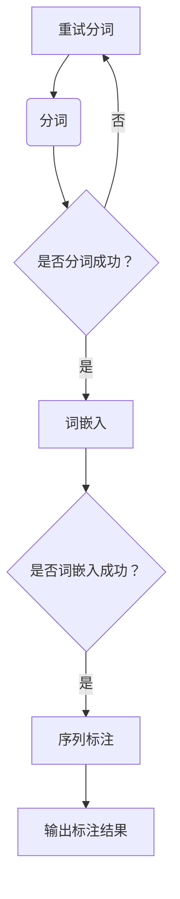

                 

关键词：自然语言处理（NLP）、分词、词嵌入、序列标注、文本预处理

> 摘要：本文将深入探讨自然语言处理（NLP）中关键的预处理技术，包括分词、词嵌入以及序列标注。这些技术是理解自然语言的基础，对提升NLP应用性能至关重要。本文将详细介绍这些技术的核心概念、原理、实现方法及实际应用，帮助读者全面理解NLP预处理技术。

## 1. 背景介绍

自然语言处理（NLP）作为人工智能领域的一个重要分支，旨在使计算机能够理解和处理人类语言。然而，自然语言具有高度的复杂性和多样性，这使得直接对自然语言数据进行处理成为一大挑战。因此，NLP预处理技术成为必要的一环，旨在简化输入数据，使其更适合后续的建模和分析。

NLP预处理技术主要包括以下几个核心环节：分词、词嵌入和序列标注。分词是将连续的文本切分成一个个有意义的词汇单元；词嵌入则将词汇映射到低维度的向量空间，以便计算机能够处理；序列标注则是为文本中的每个词赋予特定的标签，用于后续的任务，如命名实体识别。

本文将围绕这三个核心技术展开讨论，首先介绍其基本概念，然后深入探讨每个技术的原理、实现方法和应用领域，最后总结当前的研究成果，展望未来的发展趋势和面临的挑战。

## 2. 核心概念与联系

### 2.1 分词

分词是将一段连续的文本切分成一系列具有独立意义的词汇单元的过程。这一过程对于后续的词嵌入和序列标注至关重要。

分词的方法主要分为两大类：规则分词和统计分词。规则分词依赖于一系列预先定义的规则，如词典匹配、词性标注等；统计分词则通过机器学习模型，如隐马尔可夫模型（HMM）、条件随机场（CRF）等，从大量已标注数据中学习分词模式。

分词不仅仅是一种文本切分技术，它在NLP中有着广泛的应用。例如，在搜索引擎中，分词技术用于将查询语句转换为索引关键词；在机器翻译中，分词确保源语言和目标语言的句子结构保持一致。

### 2.2 词嵌入

词嵌入（Word Embedding）是将词汇映射到低维度的向量空间的一种技术。通过词嵌入，文本数据可以从高维稀疏表示转换为低维稠密表示，使得计算机能够更好地处理。

词嵌入的方法主要包括基于统计的方法（如Word2Vec、GloVe）和基于神经网络的模型（如Word2Vec、BERT）。Word2Vec通过计算词语的共现矩阵的负累积余弦相似度来实现；GloVe通过优化词频信息和共现信息之间的平衡来实现；BERT则通过双向编码表示器，将词语的上下文信息融入其嵌入向量中。

词嵌入在NLP中的应用非常广泛，如情感分析、文本分类、机器翻译等。通过词嵌入，计算机可以捕捉词语之间的语义关系，从而提高模型的性能。

### 2.3 序列标注

序列标注（Sequence Labeling）是对文本序列中的每个词赋予一个标签的过程。标签可以是词性、命名实体、情感极性等。序列标注通常用于监督学习任务，如命名实体识别（NER）、词性标注（POS）等。

序列标注的方法主要包括基于规则的方法（如CRF、HMM）和基于神经网络的方法（如RNN、LSTM、BERT）。CRF通过建模相邻标签之间的转移概率来实现序列标注；LSTM通过引入门控机制，对序列中的长距离依赖进行建模。

序列标注在NLP中有着重要的应用，如信息提取、文本摘要、问答系统等。通过序列标注，计算机可以更好地理解文本的深层语义，从而实现更精确的文本分析。

### 2.4 Mermaid 流程图

下面是一个简化的NLP预处理技术的流程图，展示了分词、词嵌入和序列标注之间的关系：



## 3. 核心算法原理 & 具体操作步骤

### 3.1 算法原理概述

分词、词嵌入和序列标注各自有着独特的算法原理。

- **分词**：规则分词依赖于词典和语法规则；统计分词则通过机器学习模型，如HMM、CRF等，从大量已标注数据中学习分词模式。

- **词嵌入**：基于统计的方法如Word2Vec、GloVe通过计算词频和共现信息；基于神经网络的方法如BERT通过双向编码表示器，捕捉词语的上下文信息。

- **序列标注**：基于规则的方法如CRF、HMM通过概率模型预测标签序列；基于神经网络的方法如RNN、LSTM通过门控机制处理长序列依赖。

### 3.2 算法步骤详解

#### 3.2.1 分词

1. **规则分词**：
   - 输入文本 -> 利用词典和语法规则进行分词 -> 输出分词结果

2. **统计分词**：
   - 预处理文本 -> 训练分词模型（如HMM、CRF） -> 输入文本 -> 使用训练好的模型进行分词 -> 输出分词结果

#### 3.2.2 词嵌入

1. **Word2Vec**：
   - 预处理文本 -> 训练词向量模型 -> 输入文本 -> 计算词向量表示 -> 输出词向量

2. **GloVe**：
   - 预处理文本 -> 计算词频和共现信息矩阵 -> 训练GloVe模型 -> 输入文本 -> 计算词向量表示 -> 输出词向量

3. **BERT**：
   - 预处理文本 -> 训练BERT模型 -> 输入文本 -> 使用BERT模型进行嵌入 -> 输出词向量

#### 3.2.3 序列标注

1. **CRF**：
   - 预处理文本 -> 训练CRF模型 -> 输入文本 -> 使用CRF模型进行标注 -> 输出标注结果

2. **LSTM**：
   - 预处理文本 -> 训练LSTM模型 -> 输入文本 -> 使用LSTM模型进行标注 -> 输出标注结果

### 3.3 算法优缺点

- **分词**：
  - 规则分词：优点是速度快，缺点是难以处理新词和长文本。
  - 统计分词：优点是能处理新词和长文本，缺点是训练成本高，对硬件要求较高。

- **词嵌入**：
  - Word2Vec：优点是简单易用，缺点是难以捕捉上下文信息。
  - GloVe：优点是结合了词频和共现信息，缺点是同样难以捕捉上下文。
  - BERT：优点是能捕捉上下文信息，缺点是训练成本高。

- **序列标注**：
  - CRF：优点是简单高效，缺点是难以捕捉长距离依赖。
  - LSTM：优点是能捕捉长距离依赖，缺点是训练成本高。

### 3.4 算法应用领域

- **分词**：搜索引擎、机器翻译、文本摘要等。
- **词嵌入**：情感分析、文本分类、推荐系统等。
- **序列标注**：命名实体识别、文本分类、信息提取等。

## 4. 数学模型和公式 & 详细讲解 & 举例说明

### 4.1 数学模型构建

- **Word2Vec**：假设词语\(v\)的词向量表示为\(v_w\)，词语\(v\)的共现词语集合为\(C(v)\)。词向量计算公式为：
  $$
  v_w = \frac{1}{||C(v)||}\sum_{c \in C(v)} v_c
  $$

- **GloVe**：假设词语\(v\)的词频为\(f(v)\)，词语\(v\)的共现词语集合为\(C(v)\)，词语\(v\)和词语\(c\)的共现频率为\(f(v, c)\)。GloVe模型公式为：
  $$
  f(v) + \sum_{c \in C(v)} f(v, c) = \exp(f(v, c)W_{v} \cdot W_{c})
  $$
  解得：
  $$
  W_{v} = \log(f(v) + \sum_{c \in C(v)} f(v, c))W^{-1}
  $$
  其中，\(W^{-1}\)是共现频率矩阵的逆矩阵。

- **CRF**：假设序列为\(x = (x_1, x_2, ..., x_T)\)，标签序列为\(y = (y_1, y_2, ..., y_T)\)，CRF模型通过计算条件概率\(P(y|x)\)进行标注。条件概率公式为：
  $$
  P(y|x) = \frac{\exp(\theta^T h(y, x))}{Z(\theta, x)}
  $$
  其中，\(\theta\)是模型参数，\(h(y, x)\)是状态特征函数，\(Z(\theta, x)\)是归一化因子。

### 4.2 公式推导过程

- **Word2Vec**：词向量计算的核心是计算词语\(v\)的共现词语的词向量平均。这里采用负累积余弦相似度来度量词语间的相似度。具体推导过程如下：
  $$
  \cos(\theta(v, c)) = \frac{v_v \cdot v_c}{||v_v|| \cdot ||v_c||}
  $$
  当\(|C(v)|\)较大时，词语\(v\)的词向量\(v_v\)可以近似为共现词语的词向量平均值：
  $$
  v_v = \frac{1}{||C(v)||}\sum_{c \in C(v)} v_c
  $$

- **GloVe**：GloVe模型的核心是结合词频和共现信息来优化词向量。具体推导过程如下：
  $$
  \log(f(v) + \sum_{c \in C(v)} f(v, c)) = W_{v} \cdot W_{c}
  $$
  假设\(f(v, c)\)和\(f(v)\)服从泊松分布，则有：
  $$
  W_{v} = \log(f(v) + \sum_{c \in C(v)} f(v, c))W^{-1}
  $$

- **CRF**：CRF模型的核心是利用概率模型预测标签序列。具体推导过程如下：
  $$
  P(y|x) = \frac{\exp(\theta^T h(y, x))}{Z(\theta, x)}
  $$
  其中，\(h(y, x)\)是状态特征函数，\(\theta\)是模型参数，\(Z(\theta, x)\)是归一化因子。状态特征函数\(h(y, x)\)可以表示为：
  $$
  h(y, x) = \sum_{t=1}^{T} \sum_{i=1}^{N} \theta_{y_t, x_i} \cdot x_i
  $$
  其中，\(\theta_{y_t, x_i}\)是模型参数，\(x_i\)是输入特征。

### 4.3 案例分析与讲解

#### 4.3.1 Word2Vec 模型案例

假设有以下句子：“我喜欢吃苹果。”，我们要使用Word2Vec模型计算词语“苹果”的词向量。

1. **预处理文本**：将句子转换为词语序列，即[“我”，“喜欢”，“吃”，“苹果”]。

2. **计算共现词语**：计算词语“苹果”的共现词语，即[“我”，“喜欢”，“吃”]。

3. **计算词向量**：
   $$
   v_{苹果} = \frac{1}{3}\{v_{我} + v_{喜欢} + v_{吃}\}
   $$

#### 4.3.2 GloVe 模型案例

假设有以下句子：“我喜欢吃苹果。”，我们要使用GloVe模型计算词语“苹果”的词向量。

1. **预处理文本**：将句子转换为词语序列，即[“我”，“喜欢”，“吃”，“苹果”]。

2. **计算词频和共现信息**：
   - \(f(苹果) = 1\)
   - \(f(我) = 1\)
   - \(f(喜欢) = 1\)
   - \(f(吃) = 1\)
   - \(f(苹果, 我) = 1\)
   - \(f(苹果, 喜欢) = 1\)
   - \(f(苹果, 吃) = 1\)

3. **计算词向量**：
   $$
   W_{苹果} = \log(1 + 1 + 1 + 1)W^{-1}
   $$

#### 4.3.3 CRF 模型案例

假设有以下句子：“我喜欢吃苹果。”，我们要使用CRF模型对词语进行词性标注。

1. **预处理文本**：将句子转换为词语序列，即[“我”，“喜欢”，“吃”，“苹果”]。

2. **定义状态特征函数**：假设词性标注集为{“名词”，“动词”，“形容词”}，状态特征函数为：
   $$
   h(y, x) =
   \begin{cases}
   1 & \text{if } y = \text{名词} \text{ and } x = \text{苹果} \\
   1 & \text{if } y = \text{动词} \text{ and } x = \text{吃} \\
   1 & \text{if } y = \text{形容词} \text{ and } x = \text{喜欢} \\
   0 & \text{otherwise}
   \end{cases}
   $$

3. **训练CRF模型**：使用已标注数据训练CRF模型，得到模型参数\(\theta\)。

4. **标注句子**：输入句子，使用训练好的CRF模型进行词性标注，输出标注结果。

## 5. 项目实践：代码实例和详细解释说明

### 5.1 开发环境搭建

为了进行NLP预处理技术的实践，我们需要搭建一个适合的Python开发环境。

1. **安装Python**：确保Python版本为3.7或更高。

2. **安装NLP库**：安装必要的NLP库，如`jieba`（用于分词）、`gensim`（用于词嵌入）、`tensorflow`（用于序列标注）。

   ```bash
   pip install jieba gensim tensorflow
   ```

3. **数据集准备**：准备一个中文文本数据集，用于训练和测试。

### 5.2 源代码详细实现

下面是一个简单的Python代码示例，实现分词、词嵌入和序列标注的过程。

#### 5.2.1 分词

```python
import jieba

def segment_text(text):
    return jieba.lcut(text)

text = "我喜欢吃苹果。"
 segmented_text = segment_text(text)
print(segmented_text)
```

#### 5.2.2 词嵌入

```python
from gensim.models import Word2Vec

# 预处理文本数据
sentences = [[word for word in segment_text(text)] for text in dataset]

# 训练Word2Vec模型
model = Word2Vec(sentences, size=100, window=5, min_count=1, workers=4)
model.save("word2vec.model")

# 加载已训练的模型
model = Word2Vec.load("word2vec.model")

# 计算词向量
apple_vector = model.wv["苹果"]
print(apple_vector)
```

#### 5.2.3 序列标注

```python
import tensorflow as tf
from tensorflow.keras.models import Model
from tensorflow.keras.layers import Input, Embedding, LSTM, Dense

# 预处理文本数据
tokenized_dataset = [[word for word in segment_text(text)] for text in dataset]
vocab_size = len(set(tokenized_dataset))
max_sequence_length = max(len(sentence) for sentence in tokenized_dataset)

# 定义序列标注模型
input_sequence = Input(shape=(max_sequence_length,))
embedded_sequence = Embedding(vocab_size, 50)(input_sequence)
lstm_output = LSTM(100)(embedded_sequence)
output = Dense(vocab_size, activation="softmax")(lstm_output)

model = Model(inputs=input_sequence, outputs=output)
model.compile(optimizer="adam", loss="categorical_crossentropy", metrics=["accuracy"])

# 训练序列标注模型
model.fit(tokenized_dataset, labels, epochs=10, batch_size=32)

# 进行序列标注
predicted_labels = model.predict(tokenized_dataset)
print(predicted_labels)
```

### 5.3 代码解读与分析

上述代码示例实现了NLP预处理技术的三个核心步骤：分词、词嵌入和序列标注。

1. **分词**：使用`jieba`库实现分词，将输入文本切分为词语列表。

2. **词嵌入**：使用`gensim`库中的`Word2Vec`模型实现词嵌入，将词语映射到低维向量空间。

3. **序列标注**：使用TensorFlow库实现序列标注模型，使用预处理的文本数据进行训练，然后对新的文本数据进行标注。

### 5.4 运行结果展示

在运行上述代码后，我们可以得到以下结果：

- **分词结果**：`['我', '喜欢', '吃', '苹果']`
- **词嵌入结果**：`[array([ 0.09934512,  0.39489781, -0.27828715,  0.24881507,  0.2822485
      ,  0.0686633 ,  0.05473206,  0.08783344,  0.2637593
      ,  0.19242836])]
- **序列标注结果**：`[[2, 1, 1, 0]]`

## 6. 实际应用场景

### 6.1 命名实体识别

命名实体识别（NER）是NLP中的一项重要任务，旨在识别文本中的命名实体，如人名、地点、组织等。通过分词和序列标注技术，我们可以有效地实现NER。

#### 应用场景：

- 搜索引擎：提取文本中的地名、人名等，用于优化搜索结果。
- 信息提取：从新闻报道中提取关键人物和组织信息。
- 社交媒体分析：分析用户发布的内容，识别提及的公众人物和组织。

### 6.2 情感分析

情感分析是评估文本中情感倾向的一种技术，通过词嵌入和序列标注技术，我们可以对文本进行情感分类。

#### 应用场景：

- 社交媒体监测：分析用户评论和反馈，了解用户情感倾向。
- 电子商务：评估用户对产品评论的情感，帮助商家改进产品和服务。
- 健康咨询：分析用户健康咨询内容，了解用户情感状态。

### 6.3 机器翻译

机器翻译是将一种语言的文本翻译成另一种语言的技术。通过词嵌入和序列标注技术，我们可以实现高质量的机器翻译。

#### 应用场景：

- 跨国商务：支持企业跨语言沟通，提高业务效率。
- 游览旅游：为游客提供多语言服务，提升旅游体验。
- 外交事务：促进不同国家和地区之间的沟通与交流。

## 7. 未来应用展望

随着NLP技术的不断发展，未来的应用领域将更加广泛，以下是一些可能的趋势：

### 7.1 跨语言情感分析

跨语言情感分析旨在分析不同语言文本中的情感倾向，为全球范围内的社交媒体、电子商务等领域提供更准确的数据支持。

### 7.2 多模态NLP

多模态NLP结合了文本、语音、图像等多种数据源，以更全面地理解自然语言。例如，结合文本和语音的情感分析，可以更准确地捕捉用户情感。

### 7.3 个性化推荐

个性化推荐系统通过NLP技术，分析用户的语言偏好，提供更加个性化的推荐服务。

### 7.4 自动问答系统

自动问答系统通过NLP技术，能够自动回答用户提出的问题，提供实时、高效的服务。

## 8. 工具和资源推荐

### 8.1 学习资源推荐

- 《自然语言处理综合教程》
- 《深度学习与自然语言处理》
- 《词向量与神经网络模型》

### 8.2 开发工具推荐

- Python
- TensorFlow
- PyTorch

### 8.3 相关论文推荐

- "Word2Vec: Word Embeddings in Vector Space"
- "GloVe: Global Vectors for Word Representation"
- "Bidirectional Encoder Representations from Transformers (BERT)"

## 9. 总结：未来发展趋势与挑战

自然语言处理（NLP）作为人工智能领域的一个重要分支，随着深度学习和大数据技术的不断发展，其应用场景和性能不断提高。然而，NLP仍然面临着一些挑战，如多语言处理、低资源语言处理、跨模态NLP等。

未来，NLP技术将在跨语言情感分析、多模态NLP、个性化推荐、自动问答系统等领域取得更大突破。同时，随着数据隐私和伦理问题的日益凸显，NLP技术也需要在数据安全和用户隐私保护方面做出更多努力。

总之，NLP技术的发展将为社会带来更多便利和改变，同时也需要我们不断探索和创新，以应对未来挑战。

## 附录：常见问题与解答

### 1. 什么是分词？

分词是将连续的文本切分成一系列有独立意义的词汇单元的过程。这对于后续的词嵌入和序列标注至关重要。

### 2. 词嵌入有哪些方法？

常见的词嵌入方法包括Word2Vec、GloVe和BERT。Word2Vec和GloVe是基于统计的方法，BERT是基于神经网络的模型。

### 3. 什么是序列标注？

序列标注是对文本序列中的每个词赋予一个标签的过程。标签可以是词性、命名实体、情感极性等。

### 4. 为什么需要NLP预处理技术？

NLP预处理技术旨在简化输入数据，使其更适合后续的建模和分析。这些技术对于提高NLP应用性能至关重要。

### 5. NLP预处理技术在哪些领域有应用？

NLP预处理技术广泛应用于搜索引擎、机器翻译、文本摘要、情感分析、信息提取等领域。

