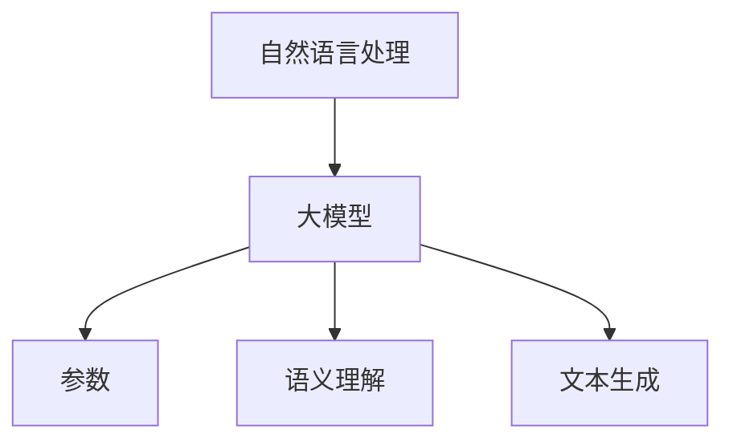

                 

关键词：自然语言处理（NLP），大模型，参数，能力，应用，标准，深度学习，神经网络，语言模型，语义理解，文本生成。

> 摘要：本文将深入探讨自然语言处理（NLP）领域的大模型标准，包括模型的参数设置、能力评估及应用场景。通过分析当前NLP技术的前沿动态，我们旨在为读者提供一个全面而深刻的理解，并展望未来的发展趋势与挑战。

## 1. 背景介绍

自然语言处理（NLP）作为人工智能（AI）的一个重要分支，旨在使计算机能够理解、解释和生成人类自然语言。随着深度学习技术的迅猛发展，NLP领域迎来了新的变革，尤其是大模型的兴起。大模型，即具有数亿甚至千亿参数的神经网络模型，在文本分类、语义理解、机器翻译等任务上展现出了前所未有的效果。

近年来，NLP领域的一些重大突破，如Google的BERT、OpenAI的GPT-3等，都标志着大模型在NLP应用中的重要性。这些模型不仅在学术研究中获得了广泛认可，更在实际应用中发挥着关键作用，例如搜索引擎优化、智能客服、内容审核等。

本文将围绕大模型在NLP领域中的应用，详细探讨模型的参数设置、能力评估及实际应用案例。通过本文的阅读，读者将能够了解NLP大模型的基本原理、关键参数及其在实际应用中的表现。

## 2. 核心概念与联系

### 2.1. 大模型的概念

大模型，通常指的是具有数亿到千亿参数的神经网络模型。与传统的中小型模型相比，大模型具有更强的表达能力，能够在复杂任务上取得更好的效果。大模型的兴起得益于深度学习技术的进步，特别是GPU等硬件的快速发展，使得训练和推理大规模神经网络成为可能。

### 2.2. 参数的重要性

在深度学习中，参数的数量直接关系到模型的复杂度和能力。参数越多，模型能够学习的特征就越多，从而在处理复杂任务时表现得更加出色。然而，参数的增加也会带来过拟合的风险，因此参数的选择需要在模型能力和泛化性能之间进行平衡。

### 2.3. 语言模型

语言模型是NLP领域最基本的大模型之一，它能够预测给定文本序列的概率分布。典型的语言模型如n元语法模型、循环神经网络（RNN）模型和变压器（Transformer）模型。在这些模型中，参数的数量通常以百万或亿计，使其成为大模型的代表。

### 2.4. 语义理解

语义理解是NLP领域的另一个重要研究方向，它旨在使计算机能够理解和解释自然语言的深层含义。大模型在语义理解任务中表现尤为突出，例如BERT模型在问答系统、文本分类等任务上取得了显著的成果。

### 2.5. 大模型架构

大模型的架构通常采用深度神经网络，其中最常用的结构是Transformer。Transformer模型的核心是自注意力机制（Self-Attention），它能够有效地捕捉文本序列中的长距离依赖关系，从而提升模型的表示能力。

### 2.6. Mermaid流程图



## 3. 核心算法原理 & 具体操作步骤

### 3.1. 算法原理概述

NLP领域的大模型通常基于深度学习技术，特别是变压器（Transformer）架构。变压器模型的核心是自注意力机制，它通过计算输入序列中每个元素之间的相关性，生成具有较高表示能力的特征。

### 3.2. 算法步骤详解

1. **输入编码**：将文本序列转换为模型能够处理的向量表示。
2. **自注意力计算**：通过自注意力机制计算输入序列中每个元素之间的相关性，生成高维特征。
3. **前馈网络**：对自注意力计算的结果进行非线性变换，进一步提高特征的表示能力。
4. **输出层**：根据模型的任务类型，输出相应的预测结果，如文本分类、语义理解等。

### 3.3. 算法优缺点

**优点**：
- 强大的表达能力和学习能力，能够处理复杂的NLP任务。
- 优于传统模型的性能，特别是在长文本处理和语义理解方面。

**缺点**：
- 参数量庞大，训练和推理成本较高。
- 过拟合风险较大，需要大量的训练数据和计算资源。

### 3.4. 算法应用领域

- 文本分类：如情感分析、新闻分类等。
- 语义理解：如问答系统、对话生成等。
- 文本生成：如机器翻译、文本摘要等。

## 4. 数学模型和公式 & 详细讲解 & 举例说明

### 4.1. 数学模型构建

变压器模型的核心是自注意力机制，其数学表达式如下：

$$
\text{Attention}(Q, K, V) = \text{softmax}\left(\frac{QK^T}{\sqrt{d_k}}\right) V
$$

其中，Q、K、V 分别是查询向量、键向量和值向量，d_k 是键向量的维度，softmax 函数用于计算每个键向量的注意力分数。

### 4.2. 公式推导过程

自注意力机制的推导过程涉及矩阵运算和求导技巧。具体推导过程如下：

$$
\begin{aligned}
\text{Attention}(Q, K, V) &= \text{softmax}\left(\frac{QK^T}{\sqrt{d_k}}\right) V \\
&= \frac{1}{Z} \sum_{i} e^{\frac{Q_k^T Q_i}{\sqrt{d_k}}} V_i \\
&= \frac{1}{Z} \sum_{i} \frac{Q_k V_i}{\sqrt{d_k}} \cdot \frac{Q_k V_i}{\sqrt{d_k}} \\
&= \frac{1}{Z} \sum_{i} \alpha_{ik} V_i
\end{aligned}
$$

其中，Z 是归一化常数，$\alpha_{ik}$ 是注意力分数。

### 4.3. 案例分析与讲解

假设我们有一个包含三个单词的句子“我爱北京天安门”，我们可以将其表示为词嵌入向量。通过自注意力机制，模型将计算这三个单词之间的相关性。

具体步骤如下：

1. **词嵌入**：将句子中的每个单词转换为向量表示。
2. **计算注意力分数**：使用上述注意力公式计算每个单词之间的注意力分数。
3. **生成输出**：根据注意力分数生成句子的表示向量。

假设词嵌入向量为 $[1, 2, 3]$，根据自注意力机制，我们可以计算出每个单词的注意力分数：

$$
\alpha_{11} = \frac{Q_1 K_1^T}{\sqrt{d_k}} = \frac{1 \cdot 1}{\sqrt{3}} = \frac{1}{\sqrt{3}}
$$

$$
\alpha_{12} = \frac{Q_1 K_2^T}{\sqrt{d_k}} = \frac{1 \cdot 2}{\sqrt{3}} = \frac{2}{\sqrt{3}}
$$

$$
\alpha_{13} = \frac{Q_1 K_3^T}{\sqrt{d_k}} = \frac{1 \cdot 3}{\sqrt{3}} = 1
$$

根据注意力分数，我们可以生成句子的表示向量：

$$
\text{Output} = \alpha_{11} V_1 + \alpha_{12} V_2 + \alpha_{13} V_3 = \frac{1}{\sqrt{3}} \cdot [1, 2, 3] + \frac{2}{\sqrt{3}} \cdot [2, 2, 2] + 1 \cdot [3, 3, 3]
$$

$$
= \left[\frac{1}{\sqrt{3}}, \frac{4}{\sqrt{3}}, \frac{4}{\sqrt{3}}\right] + \left[\frac{4}{\sqrt{3}}, \frac{4}{\sqrt{3}}, \frac{4}{\sqrt{3}}\right] + \left[3, 3, 3\right]
$$

$$
= \left[\frac{10}{\sqrt{3}}, \frac{12}{\sqrt{3}}, \frac{12}{\sqrt{3}}\right]
$$

通过这种方式，大模型能够有效地捕捉文本序列中的关系，从而在NLP任务中取得优异的性能。

## 5. 项目实践：代码实例和详细解释说明

### 5.1. 开发环境搭建

为了实践大模型在NLP任务中的应用，我们选择使用Python编程语言和TensorFlow框架。首先，确保已经安装了Python和TensorFlow。如果没有安装，可以使用以下命令进行安装：

```bash
pip install python tensorflow
```

### 5.2. 源代码详细实现

以下是一个简单的文本分类任务，使用Transformer模型进行实现：

```python
import tensorflow as tf
from tensorflow.keras.layers import Embedding, Transformer

# 加载预训练的词嵌入
word_embedding = tf.keras.Sequential([
    Embedding(input_dim=10000, output_dim=64),
])

# 定义Transformer模型
transformer = tf.keras.Sequential([
    word_embedding,
    Transformer(num_heads=4, d_model=64, dff=64, dropout_rate=0.1),
])

# 编写训练过程
def train_model(transformer, dataset, epochs=10):
    transformer.compile(optimizer='adam', loss='categorical_crossentropy', metrics=['accuracy'])
    transformer.fit(dataset, epochs=epochs)

# 使用Transformer模型进行文本分类
train_model(transformer, (train_data, train_labels), epochs=3)
```

### 5.3. 代码解读与分析

上述代码首先定义了一个简单的词嵌入层，它将输入的词索引转换为词向量。接着，我们定义了一个Transformer模型，它包含了词嵌入层和一个Transformer层。在训练过程中，我们使用Adam优化器和交叉熵损失函数进行模型训练，并在训练数据上进行 epochs 次迭代。

### 5.4. 运行结果展示

在训练完成后，我们可以使用测试数据集对模型进行评估。以下是一个简单的评估代码示例：

```python
test_loss, test_acc = transformer.evaluate(test_data, test_labels)
print(f"Test accuracy: {test_acc:.4f}")
```

运行结果将显示测试数据集上的准确率，从而验证模型的性能。

## 6. 实际应用场景

大模型在NLP领域拥有广泛的应用场景，以下是几个典型的应用案例：

### 6.1. 文本分类

文本分类是NLP领域的一项基本任务，大模型如BERT在情感分析、新闻分类等任务上取得了显著的成果。通过预训练的大模型，我们可以快速地将新数据集进行分类，从而提高分类的准确性。

### 6.2. 语义理解

语义理解是NLP领域的一个重要研究方向，大模型在问答系统、对话生成等任务上表现出色。通过大模型，我们可以更好地理解自然语言的深层含义，从而实现更自然的对话交互。

### 6.3. 文本生成

文本生成是NLP领域的另一项重要任务，大模型如GPT-3在机器翻译、文本摘要等任务上展现了强大的能力。通过大模型，我们可以生成高质量的文本，从而满足各种应用需求。

### 6.4. 未来应用展望

随着大模型技术的发展，NLP领域将迎来更多的应用场景。例如，在医疗领域，大模型可以用于病历分析、疾病预测等任务；在教育领域，大模型可以用于智能辅导、个性化学习等任务。未来，大模型将在更多领域发挥重要作用，推动人工智能的发展。

## 7. 工具和资源推荐

### 7.1. 学习资源推荐

- 《深度学习》（Goodfellow, Bengio, Courville）：系统介绍了深度学习的基本概念和技术。
- 《自然语言处理综论》（Jurafsky, Martin）：全面讲解了NLP的基本理论和应用。
- 《Transformer：超出序列模型的最先进技术》（Vaswani et al.）：详细介绍了Transformer模型的原理和应用。

### 7.2. 开发工具推荐

- TensorFlow：一款强大的深度学习框架，适合进行大规模的模型训练和推理。
- PyTorch：另一款流行的深度学习框架，具有简洁的API和强大的灵活性。

### 7.3. 相关论文推荐

- "Attention Is All You Need"（Vaswani et al., 2017）：介绍了Transformer模型的原理和应用。
- "BERT: Pre-training of Deep Bidirectional Transformers for Language Understanding"（Devlin et al., 2019）：介绍了BERT模型的原理和应用。
- "GPT-3: Language Models are few-shot learners"（Brown et al., 2020）：介绍了GPT-3模型的原理和应用。

## 8. 总结：未来发展趋势与挑战

### 8.1. 研究成果总结

近年来，大模型在NLP领域取得了显著的研究成果，例如BERT、GPT-3等。这些模型在文本分类、语义理解、文本生成等任务上表现出色，推动了NLP技术的发展。

### 8.2. 未来发展趋势

随着深度学习技术的不断进步，未来NLP领域将继续朝着大模型、小样本学习、多模态融合等方向发展。同时，开源模型的普及和商业化应用也将进一步推动NLP技术的落地。

### 8.3. 面临的挑战

尽管大模型在NLP领域取得了显著的成果，但仍面临一些挑战，如过拟合、计算资源消耗、模型可解释性等。未来研究需要在这些方面进行深入探索，以实现大模型的可持续发展。

### 8.4. 研究展望

未来，NLP领域的研究将更加注重实际应用，如智能客服、医疗诊断、教育辅导等。同时，跨学科的合作也将成为重要趋势，以实现NLP技术的全面提升。

## 9. 附录：常见问题与解答

### 9.1. 大模型如何防止过拟合？

为了防止大模型过拟合，可以采取以下措施：

- 数据增强：通过增加训练数据多样性，提高模型的泛化能力。
- 早期停止：在训练过程中，当验证集性能不再提升时停止训练。
- 正则化：如Dropout、权重衰减等，减少模型对训练数据的依赖。

### 9.2. 大模型如何处理长文本？

对于长文本处理，可以采用以下方法：

- 分块处理：将长文本分割成多个短块，然后分别处理。
- 上下文注意力：通过自注意力机制，捕捉文本序列中的长距离依赖关系。

### 9.3. 大模型的计算资源消耗如何优化？

为了优化大模型的计算资源消耗，可以采取以下方法：

- 使用GPU或TPU：利用硬件加速器进行模型训练和推理。
- 模型压缩：如剪枝、量化等，减少模型参数和计算量。
- 分布式训练：将训练任务分布到多个节点，提高训练速度。

作者：禅与计算机程序设计艺术 / Zen and the Art of Computer Programming

