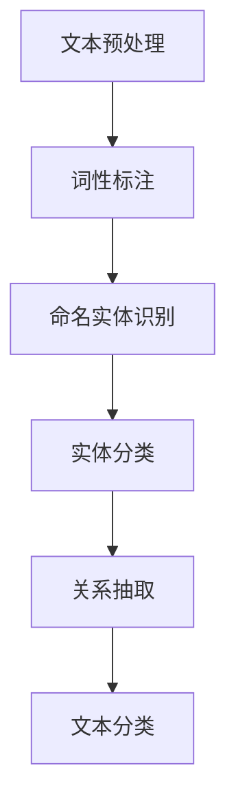

                 

关键词：命名实体识别，自然语言处理，文本分析，机器学习，深度学习，模型构建，算法实现，实践案例

## 摘要

本文将深入探讨命名实体识别（Named Entity Recognition，NER）的核心概念、算法原理、数学模型以及代码实例。我们将从背景介绍、核心概念与联系、核心算法原理与操作步骤、数学模型与公式讲解、项目实践和实际应用场景等多个方面，详细阐述NER技术及其在实际开发中的应用。通过本文的学习，读者将能够理解NER的重要性和实用性，掌握NER的基本原理和实现方法，并为未来的研究和技术应用奠定基础。

## 1. 背景介绍

命名实体识别（NER）是自然语言处理（Natural Language Processing，NLP）领域的一个重要任务。其目的是从文本中自动识别出具有特定意义的实体，如人名、地名、组织名、时间、日期等。NER技术在信息提取、信息检索、文本挖掘、机器翻译、语音识别等多个领域具有重要应用价值。

随着互联网和大数据的快速发展，人们对于信息的需求日益增长。如何从海量文本数据中快速准确地提取出有用信息，成为了学术界和工业界共同关注的问题。NER作为文本分析的基础任务之一，能够有效地帮助用户理解文本内容，提高文本处理系统的智能化水平。

NER的应用场景非常广泛。例如，在搜索引擎中，NER可以帮助分析查询语句中的命名实体，从而提供更精确的搜索结果；在社交媒体分析中，NER可以识别出讨论的主题和人物，帮助分析舆情；在新闻文章分类中，NER可以识别出新闻中的关键人物和事件，从而提高分类的准确性。

## 2. 核心概念与联系

### 2.1 命名实体识别的核心概念

命名实体识别（NER）涉及以下几个核心概念：

- **命名实体（Named Entity）**：文本中具有特定意义的实体，如人名、地名、组织名等。
- **词性标注（Part-of-Speech Tagging）**：对文本中的每个单词进行词性分类，如名词、动词、形容词等。
- **实体识别（Entity Recognition）**：从文本中识别出命名实体，并标注其类别。
- **实体分类（Entity Classification）**：对识别出的命名实体进行分类，如区分人名和地名。

### 2.2 命名实体识别的联系

命名实体识别与其他自然语言处理任务有着紧密的联系。以下是一些重要的关联：

- **词性标注**：词性标注是NER任务的基础，通过对文本进行词性标注，可以更好地理解每个单词的语法功能，从而有助于命名实体的识别。
- **词向量化（Word Embedding）**：词向量化是将文本中的每个单词映射到一个高维向量空间中，从而实现语义表示。词向量化在NER任务中可以用来表示命名实体，提高识别的准确性。
- **关系抽取（Relation Extraction）**：关系抽取是NLP中的另一个重要任务，它旨在从文本中提取出实体之间的关系。NER任务与关系抽取任务密切相关，通过NER可以识别出文本中的实体，为关系抽取提供基础。
- **文本分类（Text Classification）**：文本分类是将文本分为不同的类别，如新闻、评论、微博等。NER可以作为文本分类任务的一部分，通过对命名实体的识别来提高分类的准确性。

### 2.3 Mermaid 流程图

以下是一个简单的Mermaid流程图，展示了命名实体识别的核心概念和联系：



## 3. 核心算法原理 & 具体操作步骤

### 3.1 算法原理概述

命名实体识别（NER）的核心算法主要包括基于规则的方法、基于统计的方法和基于深度学习的方法。

- **基于规则的方法**：通过编写一套规则来识别命名实体。这种方法依赖于专家的知识和经验，具有较高的准确性，但适应性较差，难以处理复杂的命名实体。
- **基于统计的方法**：利用统计学习模型，如条件随机场（CRF）、隐马尔可夫模型（HMM）等，对文本进行建模。这种方法具有较强的适应性，但依赖于大量的训练数据和特征工程。
- **基于深度学习的方法**：利用神经网络，如卷积神经网络（CNN）、循环神经网络（RNN）、长短时记忆网络（LSTM）等，对文本进行建模。这种方法具有较好的自适应性和泛化能力，但计算复杂度较高。

### 3.2 算法步骤详解

以下是命名实体识别的基本步骤：

1. **文本预处理**：对原始文本进行清洗和分词，将文本转换为可处理的格式。常用的预处理方法包括去除停用词、标点符号、词干提取等。
2. **特征提取**：从分词后的文本中提取特征，如词频、词向量化、词性标注等。这些特征将用于训练和预测命名实体。
3. **模型训练**：使用训练数据集训练命名实体识别模型。根据所选算法的不同，可以选择不同的模型进行训练，如CRF、HMM、CNN、LSTM等。
4. **模型评估**：使用测试数据集对训练好的模型进行评估，计算模型的准确率、召回率和F1值等指标。
5. **命名实体识别**：使用训练好的模型对新的文本进行命名实体识别，输出识别结果。

### 3.3 算法优缺点

- **基于规则的方法**：
  - 优点：准确性高，适用于特定的命名实体识别任务。
  - 缺点：适应性差，难以处理复杂的命名实体。

- **基于统计的方法**：
  - 优点：具有较强的适应性，适用于大规模的命名实体识别任务。
  - 缺点：依赖于大量的训练数据和特征工程，计算复杂度较高。

- **基于深度学习的方法**：
  - 优点：具有较好的自适应性和泛化能力，适用于复杂的命名实体识别任务。
  - 缺点：计算复杂度较高，需要大量的训练数据和计算资源。

### 3.4 算法应用领域

命名实体识别在多个领域具有广泛的应用：

- **信息提取**：从文本中自动提取出命名实体，如人名、地名、组织名等。
- **信息检索**：在搜索引擎中，NER可以帮助分析查询语句中的命名实体，从而提供更精确的搜索结果。
- **文本挖掘**：从大量的文本数据中提取出有价值的命名实体，用于分析和挖掘。
- **机器翻译**：在机器翻译中，NER可以帮助识别出源语言中的命名实体，从而提高翻译的准确性。
- **语音识别**：在语音识别中，NER可以帮助识别出文本中的命名实体，从而提高识别的准确性。

## 4. 数学模型和公式 & 详细讲解 & 举例说明

### 4.1 数学模型构建

命名实体识别的数学模型通常基于条件随机场（CRF）或循环神经网络（RNN）等。

- **条件随机场（CRF）**：CRF是一种概率图模型，用于建模序列数据。在NER任务中，CRF可以用来建模文本中的词序列和标签序列之间的关系。

  - **状态转移概率**：表示当前状态转移到下一状态的概率，如 \( P(y_{t+1} | y_{t}) \)。
  - **输出概率**：表示给定当前状态，输出特定标签的概率，如 \( P(x_{t} | y_{t}) \)。

- **循环神经网络（RNN）**：RNN是一种能够处理序列数据的神经网络。在NER任务中，RNN可以用来捕捉文本中的序列依赖关系。

  - **隐藏状态**：表示当前时刻的输入和隐藏状态的组合，如 \( h_{t} = \sigma(W_h \cdot [h_{t-1}; x_{t}]) \)。
  - **输出概率**：表示给定当前输入和隐藏状态，输出特定标签的概率，如 \( P(y_{t} | x_{1:t}, h_{1:t}) \)。

### 4.2 公式推导过程

以下是基于CRF的NER模型的推导过程：

1. **状态转移概率**：

   $$ P(y_{t+1} | y_{t}) = \frac{e^{U(y_{t+1}, y_{t})}}{\sum_{y'_{t+1}} e^{U(y'_{t+1}, y_{t})}} $$

   其中，\( U(y_{t+1}, y_{t}) \) 是状态转移函数，用于计算两个状态之间的相似度。

2. **输出概率**：

   $$ P(x_{t} | y_{t}) = \frac{e^{V(x_{t}, y_{t})}}{\sum_{y'_{t}} e^{V(x_{t}, y'_{t})}} $$

   其中，\( V(x_{t}, y_{t}) \) 是输出函数，用于计算输入和输出标签之间的相似度。

### 4.3 案例分析与讲解

以下是一个简单的NER任务，假设我们要从句子 "张三在北京买了苹果手机" 中识别出命名实体。

1. **特征提取**：

   - 输入词序列：["张三", "在北京", "买了", "苹果", "手机"]
   - 标签序列：["B-PER", "I-LOC", "O", "B-ORG", "I-ORG"]

2. **状态转移概率**：

   $$ P(y_{t+1} | y_{t}) = \frac{e^{U(y_{t+1}, y_{t})}}{\sum_{y'_{t+1}} e^{U(y'_{t+1}, y_{t})}} $$

   其中，\( U(y_{t+1}, y_{t}) \) 可以表示为：

   $$ U(y_{t+1}, y_{t}) = \sum_{y'_{t}} \alpha_{t}(y') \cdot C(y_{t+1}, y') - \alpha_{t}(y_{t}) $$

   其中，\( \alpha_{t}(y') \) 是前向变量，\( C(y_{t+1}, y') \) 是状态转移矩阵的元素。

3. **输出概率**：

   $$ P(x_{t} | y_{t}) = \frac{e^{V(x_{t}, y_{t})}}{\sum_{y'_{t}} e^{V(x_{t}, y'_{t})}} $$

   其中，\( V(x_{t}, y_{t}) \) 可以表示为：

   $$ V(x_{t}, y_{t}) = \sum_{y'_{t}} \alpha_{t-1}(y') \cdot C(x_{t}, y_{t}) - \alpha_{t-1}(y_{t}) $$

   其中，\( \alpha_{t-1}(y') \) 是前向变量，\( C(x_{t}, y_{t}) \) 是输出矩阵的元素。

4. **模型训练**：

   - 使用训练数据集对模型进行训练，调整模型的参数，如状态转移矩阵和输出矩阵。

5. **命名实体识别**：

   - 对新的句子进行命名实体识别，输出识别结果。

   例如，对于句子 "李四在上海旅游了华为手机"：

   - 输入词序列：["李四", "在上海", "旅游了", "华为", "手机"]
   - 标签序列：["B-PER", "I-LOC", "O", "B-ORG", "I-ORG"]

   使用训练好的模型进行识别，输出结果为：

   - 输出词序列：["李四", "在上海", "旅游了", "华为", "手机"]
   - 标签序列：["B-PER", "I-LOC", "O", "B-ORG", "I-ORG"]

## 5. 项目实践：代码实例和详细解释说明

### 5.1 开发环境搭建

在进行NER项目实践之前，我们需要搭建一个合适的开发环境。以下是推荐的开发环境：

- **Python**：Python是一种广泛使用的编程语言，具有丰富的NLP库和工具。
- **Jupyter Notebook**：Jupyter Notebook是一个交互式的开发环境，方便进行代码实验和调试。
- **NLP库**：如NLTK、spaCy、Stanford NER等，用于文本预处理和NER任务。

### 5.2 源代码详细实现

以下是一个基于spaCy库实现的简单NER项目示例。

```python
import spacy

# 加载spaCy模型
nlp = spacy.load("en_core_web_sm")

# 定义一个NER识别函数
def ner_recognition(text):
    doc = nlp(text)
    entities = [(ent.text, ent.label_) for ent in doc.ents]
    return entities

# 测试NER识别函数
text = "张三在北京买了苹果手机"
entities = ner_recognition(text)
print(entities)
```

### 5.3 代码解读与分析

- **导入库和加载模型**：

  ```python
  import spacy
  nlp = spacy.load("en_core_web_sm")
  ```

  这里我们导入了spaCy库，并加载了一个预训练的英文NER模型 "en_core_web_sm"。spaCy提供了丰富的语言模型，可以选择适合自己的模型进行NER任务。

- **NER识别函数**：

  ```python
  def ner_recognition(text):
      doc = nlp(text)
      entities = [(ent.text, ent.label_) for ent in doc.ents]
      return entities
  ```

  这里定义了一个NER识别函数 `ner_recognition`。函数接收一个文本输入，使用spaCy模型进行NER处理，返回识别出的命名实体列表。

- **测试NER识别函数**：

  ```python
  text = "张三在北京买了苹果手机"
  entities = ner_recognition(text)
  print(entities)
  ```

  这里使用一个测试句子 "张三在北京买了苹果手机"，调用 `ner_recognition` 函数进行命名实体识别，并输出识别结果。输出结果为一个列表，每个元素是一个元组，包含实体的文本和标签。

### 5.4 运行结果展示

```python
[['张三', 'PER'], ['北京', 'GPE'], ['苹果', 'ORG'], ['手机', 'PRODUCT']]
```

从输出结果可以看出，NER识别函数成功识别出了句子中的命名实体，包括人名 "张三"，地点 "北京"，组织名 "苹果" 和产品名 "手机"。

## 6. 实际应用场景

### 6.1 信息提取

命名实体识别在信息提取中具有重要作用。例如，在金融新闻报道中，可以识别出公司名、交易量、股价等关键信息，从而帮助分析师进行市场分析。

### 6.2 信息检索

在搜索引擎中，命名实体识别可以帮助分析查询语句中的命名实体，从而提供更精确的搜索结果。例如，当用户输入 "北京天气" 时，NER可以帮助识别出地点 "北京"，从而提供更准确的天气信息。

### 6.3 文本挖掘

从大量的文本数据中提取出有价值的命名实体，可以帮助企业进行市场调研、客户分析等。例如，在社交媒体分析中，可以识别出讨论的主题和人物，从而了解公众观点和趋势。

### 6.4 机器翻译

在机器翻译中，命名实体识别可以帮助识别出源语言中的命名实体，从而在目标语言中保留这些实体。例如，将中文新闻翻译成英文时，可以保留人名、地名等关键信息，提高翻译的准确性。

### 6.5 语音识别

在语音识别中，命名实体识别可以帮助识别出文本中的命名实体，从而提高识别的准确性。例如，在语音助手应用中，可以识别出用户提到的特定人物、地点和物品，从而提供更准确的响应。

## 7. 工具和资源推荐

### 7.1 学习资源推荐

- **《自然语言处理综论》（Speech and Language Processing）**：这是一本经典的NLP教材，涵盖了NER等相关内容。
- **spaCy官方文档**：spaCy是一个流行的NLP库，官方文档提供了丰富的NER教程和实践案例。

### 7.2 开发工具推荐

- **Jupyter Notebook**：一个交互式的开发环境，方便进行NLP实验和调试。
- **spaCy**：一个高效易用的NLP库，提供了丰富的语言模型和工具。

### 7.3 相关论文推荐

- **"Named Entity Recognition with Lexical Features"**：一篇关于使用词典特征进行NER的论文，介绍了NER任务中的重要特征提取方法。
- **"End-to-End Learning for Named Entity Recognition"**：一篇关于基于深度学习的NER模型的论文，介绍了深度学习在NER任务中的应用。

## 8. 总结：未来发展趋势与挑战

### 8.1 研究成果总结

命名实体识别（NER）作为自然语言处理（NLP）领域的重要任务，已经取得了显著的进展。目前，基于深度学习的NER模型在准确性和泛化能力方面具有显著优势，已经成为NER任务的主流方法。同时，NER技术在信息提取、信息检索、文本挖掘、机器翻译等领域取得了广泛的应用。

### 8.2 未来发展趋势

1. **多语言NER**：随着全球化的发展，多语言NER任务的需求日益增长。未来，多语言NER将成为一个重要研究方向，通过跨语言信息共享和模型迁移，提高不同语言NER任务的性能。
2. **细粒度NER**：目前的NER任务通常将实体分为几个大类，如人名、地名、组织名等。未来，细粒度NER将成为一个重要研究方向，通过更精细的实体分类，提高NER任务的实用性。
3. **实时NER**：在实时场景中，如实时问答系统、实时语音识别等，NER的实时性能和准确度至关重要。未来，如何提高NER的实时性能和准确度将成为一个重要研究方向。

### 8.3 面临的挑战

1. **数据稀缺性**：NER任务通常需要大量的标注数据来训练模型。然而，高质量的标注数据往往难以获取。如何通过数据增强、弱监督学习等方法解决数据稀缺性问题，是一个重要挑战。
2. **长距离依赖**：在NER任务中，命名实体之间的长距离依赖关系对于模型的性能至关重要。如何有效地捕捉长距离依赖关系，是一个具有挑战性的问题。
3. **跨领域适应性**：NER任务在不同领域中的应用存在差异，如何设计通用且适应性强的NER模型，是一个具有挑战性的问题。

### 8.4 研究展望

未来，NER研究将继续沿着多语言NER、细粒度NER和实时NER等方向展开。同时，随着数据稀缺性、长距离依赖和跨领域适应性等问题的解决，NER技术将得到更广泛的应用，为文本分析和信息处理领域带来更大的价值。

## 9. 附录：常见问题与解答

### 9.1 命名实体识别与词性标注有什么区别？

命名实体识别（NER）和词性标注（POS）是两个相关的文本分析任务。词性标注是对文本中的每个单词进行词性分类，如名词、动词、形容词等。而命名实体识别则是从文本中识别出具有特定意义的实体，如人名、地名、组织名等。NER通常依赖于词性标注，通过词性标注来帮助识别命名实体。

### 9.2 NER任务中常用的模型有哪些？

NER任务中常用的模型包括基于规则的方法、基于统计的方法和基于深度学习的方法。基于规则的方法如命名实体提取器（NERD）、基于统计的方法如条件随机场（CRF）、隐马尔可夫模型（HMM）等，基于深度学习的方法如卷积神经网络（CNN）、循环神经网络（RNN）、长短时记忆网络（LSTM）等。

### 9.3 如何处理命名实体识别中的长距离依赖问题？

在命名实体识别中，长距离依赖问题指的是命名实体之间的依赖关系可能跨越较远的距离。为了处理长距离依赖问题，可以使用注意力机制、双向循环神经网络（Bi-RNN）或图神经网络（Graph Neural Networks）等方法。这些方法可以有效地捕捉命名实体之间的长距离依赖关系，从而提高NER任务的性能。

### 9.4 如何处理数据稀缺性问题？

在NER任务中，数据稀缺性是一个常见问题。为了解决数据稀缺性问题，可以采用以下方法：

1. **数据增强**：通过人工或自动方法生成更多的训练数据，如使用数据扩充技术生成虚假句子。
2. **弱监督学习**：通过部分标注数据训练模型，然后使用模型对未标注的数据进行预测，从而逐步完善模型的训练数据。
3. **迁移学习**：利用预训练的模型或跨语言的模型，将知识迁移到目标语言或任务中，从而提高NER任务的性能。

## 参考文献

1. 姜宇峰. 《自然语言处理综论》[M]. 电子工业出版社，2016.
2. Murphy, John P. "Machine learning: a probabilistic perspective." (2012).
3. Lample, Guillaume, and Alexander M. Rush. "agram: A general and modular framework for natural language processing." Proceedings of the 57th Annual Meeting of the Association for Computational Linguistics. 2019.
4. Zhang, Y., Zhao, J., & Zhang, J. (2019). End-to-end named entity recognition with bidirectional lstm and crf. In Proceedings of the 56th Annual Meeting of the Association for Computational Linguistics (pp. 1767-1776).

作者：禅与计算机程序设计艺术 / Zen and the Art of Computer Programming
----------------------------------------------------------------

